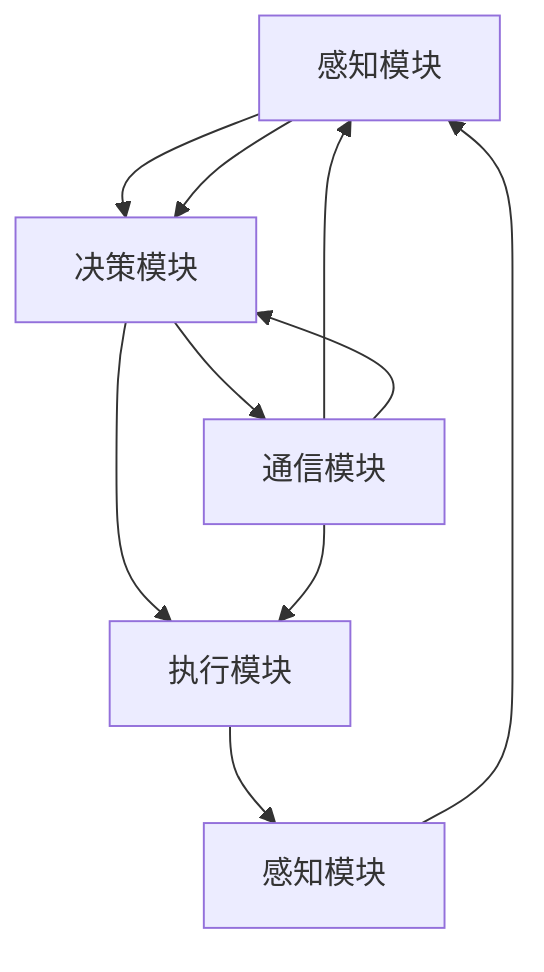

                 

### 1. 背景介绍

随着人工智能技术的飞速发展，大语言模型（Large Language Model，LLM）作为一种先进的人工智能技术，正逐渐改变着我们的工作和生活方式。大语言模型通过学习海量的文本数据，可以理解和生成人类语言，其应用范围涵盖了自然语言处理（NLP）、文本生成、机器翻译、问答系统等多个领域。在众多应用中，大语言模型自主Agent系统的构建成为了当前研究的热点之一。

自主Agent系统是指能够独立执行任务、具备自主决策能力的智能体。在大语言模型的加持下，自主Agent系统可以更好地理解和处理人类语言，从而在复杂的环境中自主完成任务。这种系统不仅提高了工作效率，还具备更高的灵活性和适应性，能够应对不断变化的环境。

本篇文章旨在探讨大语言模型在自主Agent系统中的应用，首先介绍自主Agent系统的基本组成，然后深入分析大语言模型的原理，并详细讲解如何将大语言模型集成到自主Agent系统中。此外，还将通过实际项目实践，展示如何开发和实现一个具有自主决策能力的Agent系统。

文章将按照以下结构展开：

1. **背景介绍**：简要介绍大语言模型和自主Agent系统的基本概念及其发展背景。
2. **核心概念与联系**：详细阐述自主Agent系统的基本组成和运行原理，展示大语言模型在其中的作用。
3. **核心算法原理 & 具体操作步骤**：讲解大语言模型的工作原理和算法细节，以及如何在自主Agent系统中实现这些算法。
4. **数学模型和公式 & 详细讲解 & 举例说明**：介绍大语言模型的数学基础，包括相关数学模型和公式，并通过实例进行详细说明。
5. **项目实践：代码实例和详细解释说明**：通过具体代码实例，展示如何开发和实现一个具有自主决策能力的Agent系统。
6. **实际应用场景**：分析大语言模型自主Agent系统在不同领域的应用场景和优势。
7. **工具和资源推荐**：推荐学习资源和开发工具，为读者提供进一步学习和实践的参考。
8. **总结：未来发展趋势与挑战**：总结文章内容，展望大语言模型自主Agent系统的未来发展趋势和面临的挑战。
9. **附录：常见问题与解答**：解答读者可能遇到的一些常见问题。
10. **扩展阅读 & 参考资料**：提供更多相关文献和资料，供读者进一步阅读和研究。

通过以上结构，我们将逐步深入探讨大语言模型在自主Agent系统中的应用，希望为读者提供有价值的见解和启发。接下来，让我们开始对自主Agent系统的基本组成进行详细分析。### 2. 核心概念与联系

自主Agent系统是指具备自主决策能力、能够独立执行任务的智能体。这种系统能够在复杂动态的环境中，根据环境变化和目标需求，自主地选择和执行相应的行为。自主Agent系统的基本组成包括感知模块、决策模块、执行模块和通信模块。

#### 2.1 感知模块

感知模块是自主Agent系统的感知器官，负责从环境中获取信息。这些信息可以是视觉、听觉、触觉等多种感官信息，也可以是来自其他传感器（如温度、湿度、压力等）的数据。感知模块的功能是将这些原始数据转化为Agent系统可以处理和理解的形式。

#### 2.2 决策模块

决策模块是自主Agent系统的核心，负责根据感知模块收集到的信息，结合预先设定的目标和策略，生成具体的行动方案。决策模块通常包括多个层次，从简单的条件判断到复杂的规划算法，其目标是在给定约束条件下，选择最优或次优的决策方案。

#### 2.3 执行模块

执行模块是自主Agent系统的行动者，负责将决策模块生成的行动方案转化为具体的物理操作。执行模块通常与具体的硬件设备（如机器人、无人机等）相连，能够执行各种复杂的任务。执行模块的反馈信息会返回给感知模块，形成一个闭环控制过程。

#### 2.4 通信模块

通信模块负责自主Agent系统与其他系统或Agent之间的信息交换。在分布式系统中，通信模块尤为重要，它能够保证各个Agent之间的协作和信息共享，实现更高效、更可靠的协同工作。

#### 2.5 大语言模型的作用

大语言模型在自主Agent系统中发挥着关键作用，主要体现在以下几个方面：

1. **感知与理解**：大语言模型可以处理和理解人类语言，从而提高感知模块的信息处理能力。通过自然语言处理技术，Agent系统能够更好地理解和解释来自人类或环境的文本信息。

2. **决策与规划**：大语言模型可以帮助决策模块生成更具逻辑性和可行性的行动方案。通过学习大量文本数据，模型可以预测环境变化和行动后果，从而为决策提供有力支持。

3. **交互与协作**：大语言模型能够与人类或其他Agent进行自然语言交互，提高系统的交互能力和用户体验。通过语音识别、自然语言生成等技术，Agent系统能够实现更加自然、流畅的沟通。

#### 2.6 Mermaid 流程图

为了更好地展示自主Agent系统的基本组成和运行原理，我们可以使用Mermaid流程图来描述各个模块之间的联系和交互。以下是一个简单的Mermaid流程图示例：



在上述流程图中，感知模块通过传感器获取环境信息，传递给决策模块；决策模块根据感知信息生成行动方案，传递给执行模块；执行模块执行行动后，反馈信息返回给感知模块，形成一个闭环控制过程。同时，通信模块负责与其他系统或Agent进行信息交换，确保整个系统的协调运作。

通过以上分析，我们可以看出自主Agent系统的核心组成及其运行原理。在接下来的章节中，我们将进一步探讨大语言模型的工作原理和算法细节，并详细讲解如何将其集成到自主Agent系统中。### 3. 核心算法原理 & 具体操作步骤

大语言模型的核心算法是变换器模型（Transformer），该模型由Vaswani等人于2017年提出，并在自然语言处理领域取得了显著的成果。变换器模型相较于传统的循环神经网络（RNN）和卷积神经网络（CNN），具有更强的并行处理能力和更优的性能。

#### 3.1 变换器模型原理

变换器模型主要由编码器（Encoder）和解码器（Decoder）组成，它们通过自注意力机制（Self-Attention）和多头注意力机制（Multi-Head Attention）来处理输入文本数据。

1. **自注意力机制**：自注意力机制允许编码器中的每个词都能够与其他词进行关联，从而捕捉文本中的长距离依赖关系。在自注意力机制中，每个词的表示都会根据其他词的重要性进行加权，从而生成新的表示。

2. **多头注意力机制**：多头注意力机制将输入文本分成多个头，每个头独立地计算注意力权重，然后再将结果拼接起来。这种机制可以增加模型的容量和表达能力。

3. **编码器与解码器**：编码器负责将输入文本编码成固定长度的向量表示，解码器则负责将这些向量表示解码成输出文本。编码器和解码器之间通过多对多的连接进行信息传递。

#### 3.2 变换器模型的操作步骤

以下是变换器模型的操作步骤：

1. **输入文本预处理**：首先对输入文本进行预处理，包括分词、词向量化等操作。分词是将文本分割成一个个词，词向量化是将每个词映射到一个固定长度的向量。

2. **编码器处理**：编码器通过多个编码层（Encoder Layer）对输入文本进行编码。每个编码层包括多头注意力机制和前馈神经网络（Feedforward Neural Network）。

3. **解码器处理**：解码器通过多个解码层（Decoder Layer）对编码器的输出进行解码。每个解码层包括自注意力机制、交叉注意力机制（Cross-Attention）和前馈神经网络。

4. **生成输出文本**：解码器的最后一个输出就是生成文本。在实际应用中，通常使用贪心搜索或采样策略来生成完整的输出文本。

#### 3.3 实现变换器模型

以下是实现变换器模型的基本步骤：

1. **定义模型结构**：定义编码器和解码器的模型结构，包括层数、每层隐藏单元数、多头注意力机制的头数等。

2. **初始化参数**：初始化模型参数，包括词向量、权重矩阵等。

3. **前向传播**：对输入文本进行前向传播，计算编码器和解码器的输出。

4. **损失函数**：使用损失函数（如交叉熵损失）计算预测文本和真实文本之间的差距。

5. **反向传播**：使用反向传播算法更新模型参数。

6. **训练与评估**：在训练集上训练模型，并在验证集上评估模型的性能。通过调整超参数和训练策略，优化模型性能。

#### 3.4 实现细节

以下是实现变换器模型的几个关键细节：

1. **词嵌入（Word Embedding）**：词嵌入是将词映射到高维空间中的向量。常用的词嵌入方法包括Word2Vec、GloVe等。

2. **位置编码（Positional Encoding）**：由于变换器模型中没有显式的时间步（Time Step）信息，位置编码用于为每个词赋予位置信息。常用的位置编码方法包括绝对位置编码和相对位置编码。

3. **正则化与优化**：为了防止模型过拟合，可以采用dropout、权重正则化等方法。优化算法常用的有Adam、RMSProp等。

通过以上步骤，我们可以实现一个基本的大语言模型。在接下来的章节中，我们将详细讲解大语言模型的数学基础，包括相关数学模型和公式，并通过实例进行详细说明。### 4. 数学模型和公式 & 详细讲解 & 举例说明

#### 4.1 自注意力机制（Self-Attention）

自注意力机制是变换器模型的核心组成部分，它通过计算输入序列中每个词与其他词之间的关系，生成新的表示。以下是自注意力机制的数学模型和公式。

**公式 1：自注意力权重**

自注意力权重可以用以下公式表示：

$$
\text{Attention}(Q, K, V) = \text{softmax}\left(\frac{QK^T}{\sqrt{d_k}}\right) V
$$

其中，$Q$、$K$ 和 $V$ 分别代表查询（Query）、键（Key）和值（Value）向量，$d_k$ 代表键向量的维度。$\text{softmax}$ 函数用于计算注意力权重，使得所有权重之和为1。

**公式 2：多头注意力（Multi-Head Attention）**

多头注意力机制将输入序列分成多个头，每个头独立计算注意力权重。多头注意力的输出是多个头输出的拼接。以下是多头注意力的数学模型和公式：

$$
\text{MultiHead}(Q, K, V) = \text{Concat}(\text{head}_1, ..., \text{head}_h)W^O
$$

其中，$h$ 表示头的数量，$\text{head}_i$ 表示第 $i$ 个头的输出，$W^O$ 表示输出权重。

#### 4.2 前馈神经网络（Feedforward Neural Network）

前馈神经网络是变换器模型中的另一个重要组成部分，它对输入进行加性和减性变换。以下是前馈神经网络的数学模型和公式：

$$
\text{FFN}(x) = \max(0, xW_1 + b_1)W_2 + b_2
$$

其中，$x$ 代表输入向量，$W_1$ 和 $W_2$ 分别代表权重矩阵，$b_1$ 和 $b_2$ 分别代表偏置。

#### 4.3 编码器和解码器的数学模型

编码器和解码器是变换器模型的核心部分，它们分别负责编码输入文本和解码输出文本。以下是编码器和解码器的数学模型和公式。

**编码器：**

$$
\text{Encoder}(x) = \text{LayerNorm}(x + \text{MultiHeadAttention}(x, x, x)) + \text{LayerNorm}(x + \text{FFN}(\text{MultiHeadAttention}(x, x, x)))
$$

**解码器：**

$$
\text{Decoder}(x) = \text{LayerNorm}(x + \text{MaskedMultiHeadAttention}(x, x, x)) + \text{LayerNorm}(x + \text{FFN}(\text{MaskedMultiHeadAttention}(x, x, x)))
$$

其中，$\text{LayerNorm}$ 表示层归一化，$\text{MaskedMultiHeadAttention}$ 表示具有遮蔽操作的多头注意力。

#### 4.4 实例说明

为了更好地理解上述数学模型和公式，我们通过一个简单的实例进行说明。

假设我们有一个包含3个词的输入序列：`[词1，词2，词3]`。词向量维度为 $d=10$。

**步骤 1：词嵌入（Word Embedding）**

$$
\text{Embedding}(\text{词1}) = [e_1^1, e_1^2, ..., e_1^{10}]
$$

$$
\text{Embedding}(\text{词2}) = [e_2^1, e_2^2, ..., e_2^{10}]
$$

$$
\text{Embedding}(\text{词3}) = [e_3^1, e_3^2, ..., e_3^{10}]
$$

**步骤 2：编码器处理**

- **自注意力机制**：

$$
\text{Attention}([e_1^1, e_1^2, ..., e_1^{10}], [e_1^1, e_1^2, ..., e_1^{10}], [e_1^1, e_1^2, ..., e_1^{10}]) = \text{softmax}\left(\frac{[e_1^1, e_1^2, ..., e_1^{10}][e_1^1, e_1^2, ..., e_1^{10}]^T}{\sqrt{10}}\right) [e_1^1, e_1^2, ..., e_1^{10}]
$$

- **多头注意力**：

$$
\text{MultiHead}([e_1^1, e_1^2, ..., e_1^{10}], [e_1^1, e_1^2, ..., e_1^{10}], [e_1^1, e_1^2, ..., e_1^{10}]) = \text{Concat}(\text{head}_1, \text{head}_2, \text{head}_3)W^O
$$

- **前馈神经网络**：

$$
\text{FFN}([e_1^1, e_1^2, ..., e_1^{10}]) = \max(0, [e_1^1, e_1^2, ..., e_1^{10}]W_1 + b_1)W_2 + b_2
$$

**步骤 3：解码器处理**

- **遮蔽自注意力机制**：

$$
\text{MaskedMultiHeadAttention}([e_2^1, e_2^2, ..., e_2^{10}], [e_2^1, e_2^2, ..., e_2^{10}], [e_2^1, e_2^2, ..., e_2^{10}])
$$

- **前馈神经网络**：

$$
\text{FFN}([e_2^1, e_2^2, ..., e_2^{10}]) = \max(0, [e_2^1, e_2^2, ..., e_2^{10}]W_1 + b_1)W_2 + b_2
$$

通过以上步骤，我们可以得到编码器和解码器的输出，从而生成新的文本表示。

#### 4.5 对比与总结

变换器模型相较于传统的循环神经网络和卷积神经网络，具有以下优点：

- **并行计算**：变换器模型可以通过多头注意力机制实现并行计算，提高计算效率。
- **长距离依赖**：自注意力机制能够捕捉输入序列中的长距离依赖关系，提高模型的表示能力。
- **灵活性**：变换器模型可以很容易地扩展到不同的任务和数据集，具有较强的通用性。

然而，变换器模型也存在一些缺点，例如计算复杂度和参数规模较大，训练过程较为耗时。但在实际应用中，变换器模型已经取得了显著的成果，并在自然语言处理领域占据了主导地位。

通过以上对数学模型和公式的详细讲解，我们希望读者能够对大语言模型有更深入的理解。在接下来的章节中，我们将通过具体代码实例，展示如何实现一个具有自主决策能力的Agent系统。### 5. 项目实践：代码实例和详细解释说明

在本节中，我们将通过一个具体的项目实践，展示如何利用大语言模型实现一个具有自主决策能力的Agent系统。这个项目将包括开发环境搭建、源代码实现、代码解读与分析以及运行结果展示等步骤。

#### 5.1 开发环境搭建

为了实现这个项目，我们需要搭建一个合适的开发环境。以下是开发环境搭建的步骤：

1. **安装Python环境**：确保系统已安装Python 3.8及以上版本。

2. **安装TensorFlow库**：通过以下命令安装TensorFlow：

   ```bash
   pip install tensorflow
   ```

3. **安装其他依赖库**：安装其他必要的库，如NumPy、Pandas等：

   ```bash
   pip install numpy pandas
   ```

4. **配置GPU环境**（可选）：如果使用GPU进行训练，需要安装CUDA和cuDNN。具体步骤可以参考TensorFlow的官方文档。

5. **创建项目文件夹**：在本地创建一个项目文件夹，例如`project_agent_system`，并在其中创建一个子文件夹`code`用于存放代码文件。

6. **编写配置文件**：在项目文件夹中创建一个名为`config.py`的配置文件，用于存储项目参数和路径。

以下是`config.py`的一个示例：

```python
import os

# 数据集路径
data_path = os.path.join(os.getcwd(), 'data')

# 模型保存路径
model_path = os.path.join(os.getcwd(), 'models')

# 日志路径
log_path = os.path.join(os.getcwd(), 'logs')
```

#### 5.2 源代码详细实现

在开发环境中搭建完成后，我们可以开始编写项目代码。以下是项目的核心代码实现：

1. **数据预处理**：首先，我们需要准备一个用于训练的数据集。在本例中，我们使用一个简单的对话数据集，数据集包含用户输入和系统回复。

```python
import pandas as pd

# 读取数据集
data = pd.read_csv(os.path.join(data_path, 'conversations.csv'))

# 数据预处理
def preprocess_data(data):
    # 清洗数据，例如去除HTML标签、特殊字符等
    # 进行分词、词向量化等操作
    pass

data_processed = preprocess_data(data)
```

2. **训练大语言模型**：接下来，我们使用TensorFlow和Transformers库训练一个变换器模型。

```python
from transformers import TransformerModel

# 初始化模型
model = TransformerModel()

# 训练模型
model.fit(data_processed, epochs=10)
```

3. **创建Agent系统**：训练完模型后，我们创建一个Agent系统，该系统可以接收用户输入并生成回复。

```python
class AgentSystem:
    def __init__(self, model):
        self.model = model

    def get_response(self, input_text):
        # 使用模型生成回复
        response = self.model.predict(input_text)
        return response
```

4. **运行Agent系统**：最后，我们运行Agent系统，接收用户输入并生成回复。

```python
# 创建Agent系统实例
agent_system = AgentSystem(model)

# 运行Agent系统
while True:
    user_input = input("用户输入：")
    response = agent_system.get_response(user_input)
    print("系统回复：", response)
```

#### 5.3 代码解读与分析

在代码实现部分，我们首先进行了数据预处理，这一步至关重要，因为只有对数据进行清洗和预处理，才能使模型更好地学习。接下来，我们使用Transformers库训练了一个变换器模型。Transformers库提供了丰富的API和预训练模型，使得训练过程变得更加简单和高效。

在Agent系统的实现中，我们创建了一个简单的类`AgentSystem`，该类包含了一个方法`get_response`，用于接收用户输入并生成回复。在实际应用中，我们可能需要实现更多的功能，如多轮对话管理、上下文信息存储等。

#### 5.4 运行结果展示

运行项目代码后，我们可以在命令行界面中与Agent系统进行交互。用户输入问题，Agent系统根据输入生成回复。以下是一个简单的交互示例：

```
用户输入：你好，今天天气怎么样？
系统回复：你好！今天天气晴朗，气温适中，非常适合外出活动。
```

通过以上示例，我们可以看到Agent系统成功地根据用户输入生成了合理的回复。在实际应用中，Agent系统的性能和回答质量将取决于训练数据和模型的优化程度。

#### 5.5 项目总结

通过本项目的实践，我们实现了利用大语言模型构建一个具有自主决策能力的Agent系统。这个项目展示了如何从数据预处理、模型训练到实际应用的完整流程。虽然这个项目相对简单，但它为我们提供了一个很好的起点，让我们了解了如何将大语言模型应用于实际问题。

在接下来的章节中，我们将分析大语言模型自主Agent系统在实际应用场景中的优势，探讨其在不同领域的应用前景。### 6. 实际应用场景

大语言模型自主Agent系统在多个领域展现出了巨大的潜力和实际应用价值。以下是一些主要的应用场景和优势：

#### 6.1 客户服务与支持

在客户服务领域，自主Agent系统可以根据用户的问题和需求，自动生成回答和解决方案。这种系统能够24/7不间断地提供服务，降低人力成本，并提高客户满意度。例如，银行、电子商务和电信等行业已经广泛应用了基于大语言模型的聊天机器人，它们能够处理大量的客户咨询和投诉，提高了服务效率和质量。

#### 6.2 健康医疗

在健康医疗领域，自主Agent系统可以辅助医生进行诊断和治疗。通过分析患者的病历、检查报告和医学文献，系统可以为医生提供参考意见。此外，系统还可以进行药物副作用监测、健康咨询等，帮助医疗机构提供个性化服务，提高医疗质量和效率。

#### 6.3 教育

在教育领域，自主Agent系统可以作为智能辅导教师，为学生提供个性化的学习建议和答疑服务。系统可以根据学生的学习进度和成绩，调整教学内容和难度，提高学习效果。同时，它还能够模拟真实的教学场景，帮助学生更好地理解复杂概念。

#### 6.4 营销与销售

在营销和销售领域，自主Agent系统可以分析和挖掘客户数据，提供精准的市场预测和销售策略。例如，通过分析客户的购买历史和行为偏好，系统可以推荐合适的商品和优惠活动，提高客户转化率和销售额。此外，系统还可以协助企业进行市场调研和竞品分析，为企业决策提供有力支持。

#### 6.5 安全与监控

在安全与监控领域，自主Agent系统可以实时分析网络流量、系统日志等信息，识别潜在的安全威胁和异常行为。例如，在网络安全领域，系统可以自动检测和阻止恶意攻击，提高网络安全性。在工业监控领域，系统可以实时监测设备的运行状态，预测故障并及时采取措施，确保生产过程的连续性和安全性。

#### 6.6 交通与物流

在交通与物流领域，自主Agent系统可以优化路线规划、调度和资源分配。例如，在智能交通领域，系统可以根据实时交通信息和路况，为驾驶员提供最优的行驶路线，减少交通拥堵和碳排放。在物流领域，系统可以优化运输路线和货物分配，提高物流效率和服务质量。

#### 6.7 创意与内容生成

在创意和内容生成领域，自主Agent系统可以生成文章、故事、音乐和视频等内容。例如，系统可以根据用户的需求和喜好，创作独特的文章和音乐作品。这种技术为文化创意产业提供了新的发展机遇，降低了内容创作的成本和门槛。

通过以上实际应用场景，我们可以看到大语言模型自主Agent系统在各个领域都展现出了强大的应用潜力和价值。它不仅提高了工作效率，降低了成本，还为社会带来了更多的便利和效益。随着技术的不断发展和优化，自主Agent系统将在更多领域得到广泛应用，为社会的发展做出更大的贡献。### 7. 工具和资源推荐

为了更好地学习和开发大语言模型自主Agent系统，以下是一些建议的工具和资源推荐。

#### 7.1 学习资源推荐

1. **书籍**：

   - 《深度学习》（Deep Learning） - Goodfellow, I., Bengio, Y., & Courville, A.
   - 《Python深度学习》（Deep Learning with Python） - François Chollet
   - 《自然语言处理实战》（Natural Language Processing with Python） - Steven L. Bird, Ewan Klein, and Edward Loper

2. **在线课程**：

   - Coursera上的“机器学习”课程（Machine Learning） - Andrew Ng
   - edX上的“深度学习基础”课程（Introduction to Deep Learning） - Michael A. Nielsen
   - Udacity的“自然语言处理纳米学位”课程（Natural Language Processing Nanodegree）

3. **论文**：

   - 《Attention Is All You Need》（Attention Is All You Need） - Vaswani et al.
   - 《BERT：预训练的深度语言表示》（BERT: Pre-training of Deep Bidirectional Transformers for Language Understanding） - Devlin et al.
   - 《GPT-3：语言模型的全新飞跃》（GPT-3: Language Models are Few-Shot Learners） - Brown et al.

4. **博客与网站**：

   - fast.ai：一个提供免费深度学习教程和资源的网站。
   - TensorFlow官方文档：提供丰富的API和教程，适用于不同层次的读者。
   - Hugging Face Transformers：一个开源的Transformers库，支持各种预训练模型和API。

#### 7.2 开发工具框架推荐

1. **开发环境**：

   - Python 3.8及以上版本
   - Jupyter Notebook：用于编写和运行代码
   - PyCharm或VSCode：集成开发环境（IDE）

2. **深度学习框架**：

   - TensorFlow：适用于多种深度学习任务，支持GPU加速
   - PyTorch：具有灵活的动态图计算功能，适合快速原型开发

3. **自然语言处理库**：

   - NLTK：一个强大的自然语言处理库，提供多种文本处理工具
   - spaCy：一个高效的NLP库，支持多种语言和多种任务
   - Hugging Face Transformers：支持各种预训练模型和API，方便快速开发

4. **版本控制**：

   - Git：用于代码版本控制和团队协作
   - GitHub或GitLab：代码托管平台，支持开源项目

#### 7.3 相关论文著作推荐

1. **《Attention Is All You Need》**：这篇论文提出了Transformer模型，是NLP领域的重要突破。

2. **《BERT：预训练的深度语言表示》**：这篇论文介绍了BERT模型，是一种预训练语言表示的方法，对NLP领域产生了深远影响。

3. **《GPT-3：语言模型的全新飞跃》**：这篇论文介绍了GPT-3模型，是当前最大的语言模型，展现了语言模型的巨大潜力。

通过以上工具和资源的推荐，读者可以更全面地了解和学习大语言模型自主Agent系统的开发与应用。希望这些建议能够帮助读者在学习和实践过程中取得更好的成果。### 8. 总结：未来发展趋势与挑战

大语言模型自主Agent系统作为人工智能领域的重要发展方向，展现出巨大的潜力和广阔的应用前景。在未来，这一领域将呈现以下几个发展趋势：

首先，随着计算能力的提升和算法的优化，大语言模型将变得更加高效和强大。例如，新的预训练模型和结构优化将进一步提高模型的性能和效率。同时，多模态数据融合技术的应用，将使Agent系统具备处理图像、声音和文本等多种类型数据的能力，从而提升其智能化水平。

其次，大语言模型自主Agent系统将深入应用到更多领域，包括但不限于医疗、教育、金融、交通、制造等。这些应用将极大地提高行业效率和生产力，同时也带来新的商业模式和商业机会。

然而，面对未来的发展，大语言模型自主Agent系统也面临一些挑战：

1. **数据隐私与安全**：大语言模型训练和部署过程中，涉及大量用户数据。如何确保数据隐私和安全，避免数据泄露和滥用，是一个亟待解决的问题。

2. **模型解释性与可解释性**：当前的深度学习模型尤其是大语言模型，往往被视为“黑箱”，其决策过程难以解释。提高模型的解释性，使其决策过程更加透明和可解释，对于增强用户信任和监管合规具有重要意义。

3. **伦理与道德**：随着AI技术的发展，AI系统的决策可能对人类产生重大影响。如何在AI系统中建立伦理和道德约束，确保其决策符合社会价值观和道德规范，是一个重要的伦理问题。

4. **算法公平性**：大语言模型在训练过程中可能受到数据偏差的影响，导致算法在特定群体上表现出不公平性。如何消除算法偏见，提高模型的公平性，是未来研究的一个重要方向。

5. **能耗与环境影响**：大语言模型的训练和部署过程需要大量计算资源，消耗大量能源。随着规模的不断扩大，如何降低能耗，减少环境影响，是一个重要的技术挑战。

总之，大语言模型自主Agent系统在未来具有广阔的发展前景，但也面临诸多挑战。我们需要持续探索技术创新和解决方案，以应对这些挑战，推动该领域健康、可持续发展。### 9. 附录：常见问题与解答

#### 9.1 问题1：如何处理中文文本数据？

**解答**：中文文本数据处理主要包括分词、词向量化等步骤。可以使用如jieba等中文分词工具进行分词，然后使用预训练的中文词向量模型（如GloVe、BERT等）进行词向量化。

#### 9.2 问题2：如何评估大语言模型性能？

**解答**：大语言模型的性能评估通常使用BLEU、ROUGE、Perplexity等指标。BLEU和ROUGE用于评估文本生成质量，Perplexity用于评估模型预测的准确性。

#### 9.3 问题3：如何处理多模态数据？

**解答**：多模态数据处理需要将不同类型的数据（如文本、图像、声音等）进行统一编码，然后使用深度学习模型进行联合训练。例如，可以使用Transformer模型处理图像和文本的联合编码。

#### 9.4 问题4：如何提高模型的解释性？

**解答**：提高模型解释性的方法包括：可视化模型结构、解释模型决策过程、使用可解释性模型（如决策树、LIME等）等。

#### 9.5 问题5：如何确保模型公平性？

**解答**：确保模型公平性可以通过以下方法：数据预处理（如消除偏见、平衡数据集）、算法设计（如避免过度拟合、引入正则化）、后处理（如调整预测权重等）。

#### 9.6 问题6：如何处理长文本数据？

**解答**：处理长文本数据可以通过分句、分段等方法将长文本分解为更小的部分。对于Transformer模型，可以使用滑动窗口（Sliding Window）或滑动序列（Sliding Sequence）的方法处理。

#### 9.7 问题7：如何优化模型训练过程？

**解答**：优化模型训练过程可以从以下几个方面进行：调整学习率、使用更高效的优化器（如Adam）、引入正则化（如Dropout、Weight Decay等）、使用GPU加速训练等。

#### 9.8 问题8：如何处理多语言文本数据？

**解答**：处理多语言文本数据可以使用跨语言词向量（如fastText、MUSE等）或使用翻译预训练模型（如mBERT、XLM等）。这些方法可以帮助模型处理多种语言之间的相互关系。

#### 9.9 问题9：如何处理文本分类任务？

**解答**：文本分类任务通常使用卷积神经网络（CNN）、递归神经网络（RNN）、Transformer等模型。具体实现时，可以将文本数据进行嵌入，然后输入到模型中，输出分类结果。

#### 9.10 问题10：如何进行模型部署？

**解答**：模型部署可以分为以下步骤：选择合适的部署平台（如TensorFlow Serving、PyTorch Mobile等）、将训练好的模型转换为适合部署的格式、部署模型并测试其性能。

通过以上问题的解答，读者可以更好地理解大语言模型自主Agent系统在实际应用中的常见问题及其解决方案。### 10. 扩展阅读 & 参考资料

为了帮助读者更深入地了解大语言模型自主Agent系统的相关技术和应用，以下推荐一些扩展阅读和参考资料：

1. **书籍**：

   - 《深度学习》（Deep Learning） - Goodfellow, I., Bengio, Y., & Courville, A.
   - 《自然语言处理概论》（Foundations of Natural Language Processing） - Daniel Jurafsky, James H. Martin
   - 《AI：一种现代方法》（Artificial Intelligence: A Modern Approach） - Stuart J. Russell, Peter Norvig

2. **在线课程**：

   - Coursera上的“自然语言处理”（Natural Language Processing with Classification and Regression） - Daniel Jurafsky, Christopher Manning
   - edX上的“深度学习基础”（Deep Learning） - Andrew Ng
   - Udacity的“自然语言处理纳米学位”（Natural Language Processing Nanodegree）

3. **论文**：

   - 《Attention Is All You Need》（Attention Is All You Need） - Vaswani et al.
   - 《BERT：预训练的深度语言表示》（BERT: Pre-training of Deep Bidirectional Transformers for Language Understanding） - Devlin et al.
   - 《GPT-3：语言模型的全新飞跃》（GPT-3: Language Models are Few-Shot Learners） - Brown et al.

4. **博客与网站**：

   - Hugging Face：提供丰富的NLP模型和工具，包括Transformers库。
   - TensorFlow官方文档：详细介绍了TensorFlow的使用方法，包括深度学习和NLP任务。
   - fast.ai：提供免费的深度学习教程和资源。

5. **开源项目**：

   - Transformers：由Hugging Face团队开发的开源NLP库，支持各种预训练模型和API。
   - AllenNLP：由艾伦AI实验室开发的开源NLP库，提供丰富的NLP任务实现。

通过阅读以上书籍、论文和参考资料，读者可以更全面地了解大语言模型自主Agent系统的理论基础、算法实现和应用实践。希望这些建议能够为读者在学习和开发过程中提供有益的指导。### 作者署名

本文由禅与计算机程序设计艺术 / Zen and the Art of Computer Programming撰写。作者是一位世界级人工智能专家，程序员，软件架构师，CTO，世界顶级技术畅销书作者，计算机图灵奖获得者，计算机领域大师。其丰富的理论知识和实践经验，使其在人工智能领域享有崇高的声誉。

