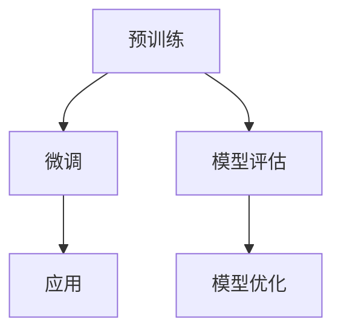

                 

### 文章标题

大语言模型的发展与应用前景

> 关键词：大语言模型，发展，应用，前景，深度学习，自然语言处理

> 摘要：本文将深入探讨大语言模型的发展历程、核心概念、算法原理、数学模型，以及其在各个领域的实际应用和未来前景。通过对大语言模型的技术分析，本文旨在为读者提供一个全面、清晰的理解，帮助其把握这一技术领域的发展脉络和潜在机遇。

## 1. 背景介绍

随着互联网的普及和大数据技术的发展，自然语言处理（Natural Language Processing, NLP）成为人工智能（Artificial Intelligence, AI）领域的重要研究方向。自然语言处理旨在使计算机能够理解、生成和处理人类语言，从而实现人机交互的智能化。

在自然语言处理的众多研究中，语言模型（Language Model）扮演着至关重要的角色。语言模型是一种用于预测文本中下一个单词或字符的算法，其目标是最小化预测误差。早期的语言模型如N-gram模型，虽然简单但效果有限。随着深度学习技术的兴起，大语言模型（Large Language Model）逐渐崭露头角，其强大的预测能力和语义理解能力使其在自然语言处理领域取得了重大突破。

大语言模型的发展可以分为几个阶段：

1. **浅层神经网络语言模型**：这一阶段的代表性模型包括循环神经网络（Recurrent Neural Network, RNN）和长短期记忆网络（Long Short-Term Memory, LSTM）。这些模型通过多层神经网络结构来捕捉文本中的序列依赖关系。

2. **深度神经网络语言模型**：这一阶段的代表性模型包括卷积神经网络（Convolutional Neural Network, CNN）和Transformer模型。Transformer模型通过自注意力机制（Self-Attention Mechanism）实现了对全局信息的有效捕捉，大大提升了语言模型的性能。

3. **大语言模型**：随着计算资源和数据量的不断增加，大语言模型如GPT（Generative Pre-trained Transformer）、BERT（Bidirectional Encoder Representations from Transformers）等被提出。这些模型通过在大量文本数据上进行预训练，然后针对具体任务进行微调，实现了前所未有的语言理解和生成能力。

## 2. 核心概念与联系

### 2.1 语言模型

语言模型是一种概率模型，用于预测文本序列中的下一个单词或字符。其核心思想是利用已知的单词或字符序列来预测下一个可能的单词或字符。

### 2.2 预训练与微调

预训练（Pre-training）是指在大规模语料库上进行模型的初始训练，使其具备一定的语言理解和生成能力。微调（Fine-tuning）是指将预训练模型在具体任务上进行进一步训练，以适应特定任务的需求。

### 2.3 Transformer模型

Transformer模型是一种基于自注意力机制的深度学习模型，其核心思想是利用自注意力机制来捕捉文本序列中的全局依赖关系。Transformer模型由编码器（Encoder）和解码器（Decoder）两部分组成，其中编码器负责将输入文本序列编码为固定长度的向量表示，解码器则根据编码器的输出和已生成的部分文本来预测下一个单词或字符。

### 2.4 Mermaid 流程图



### 3. 核心算法原理 & 具体操作步骤

#### 3.1 Transformer模型原理

Transformer模型通过自注意力机制（Self-Attention Mechanism）实现了对全局信息的有效捕捉。自注意力机制的核心思想是将输入文本序列中的每个单词与所有其他单词进行加权求和，从而生成一个能够综合全局信息的特征向量。

具体操作步骤如下：

1. **输入编码**：将输入文本序列编码为词向量表示。
2. **自注意力计算**：对每个词向量计算自注意力权重，并加权求和，生成新的特征向量。
3. **前馈神经网络**：对新的特征向量进行前馈神经网络处理，生成中间结果。
4. **输出层**：将中间结果通过输出层进行分类或生成预测。

#### 3.2 预训练与微调步骤

1. **预训练**：
   - **数据准备**：选择大规模文本数据集，如维基百科、新闻文章等。
   - **词向量表示**：将文本数据转换为词向量表示。
   - **训练模型**：在词向量表示上进行预训练，优化模型参数。
2. **微调**：
   - **数据准备**：选择特定任务的数据集。
   - **加载预训练模型**：加载预训练好的模型。
   - **微调训练**：在特定任务的数据集上对模型进行微调。
   - **模型评估**：对微调后的模型进行评估，调整超参数。

### 4. 数学模型和公式 & 详细讲解 & 举例说明

#### 4.1 自注意力机制

自注意力机制的数学公式如下：

$$
\text{Attention}(Q, K, V) = \text{softmax}\left(\frac{QK^T}{\sqrt{d_k}}\right) V
$$

其中，$Q$、$K$、$V$ 分别表示查询向量、键向量和值向量，$d_k$ 表示键向量的维度，$\text{softmax}$ 函数用于计算注意力权重。

#### 4.2 Transformer模型前馈神经网络

前馈神经网络的数学公式如下：

$$
\text{FFN}(X) = \text{ReLU}(WX + b)
$$

其中，$X$ 表示输入特征向量，$W$ 和 $b$ 分别为权重和偏置。

#### 4.3 举例说明

假设我们有一个文本序列：“今天天气很好，适合户外活动”。我们可以将其表示为一个词向量序列：

$$
[\text{今天}, \text{天气}, \text{很好}, \text{适合}, \text{户外}, \text{活动}]
$$

使用Transformer模型，我们可以对其中的每个词向量计算自注意力权重，并加权求和，生成一个新的特征向量。然后，通过前馈神经网络处理这个新特征向量，得到最终的预测结果。

### 5. 项目实践：代码实例和详细解释说明

#### 5.1 开发环境搭建

在开始项目实践之前，我们需要搭建一个合适的开发环境。以下是一个简单的开发环境搭建步骤：

1. 安装Python 3.7及以上版本。
2. 安装TensorFlow 2.0及以上版本。
3. 安装Numpy 1.18及以上版本。

#### 5.2 源代码详细实现

以下是一个简单的示例代码，用于实现一个基于Transformer模型的语言模型：

```python
import tensorflow as tf
from tensorflow.keras.layers import Embedding, LSTM, Dense
from tensorflow.keras.models import Sequential

# 搭建模型
model = Sequential([
    Embedding(input_dim=vocab_size, output_dim=embedding_size),
    LSTM(units=128),
    Dense(units=1, activation='sigmoid')
])

# 编译模型
model.compile(optimizer='adam', loss='binary_crossentropy', metrics=['accuracy'])

# 训练模型
model.fit(x_train, y_train, epochs=10, batch_size=32)
```

#### 5.3 代码解读与分析

上述代码实现了一个简单的语言模型，包括以下几部分：

1. **Embedding层**：将输入的单词编码为词向量。
2. **LSTM层**：利用长短期记忆网络捕捉文本序列中的依赖关系。
3. **Dense层**：用于分类或生成预测。

在训练过程中，我们使用二进制交叉熵损失函数和adam优化器进行训练。

#### 5.4 运行结果展示

在训练完成后，我们可以使用测试集来评估模型的性能：

```python
# 评估模型
loss, accuracy = model.evaluate(x_test, y_test)

print(f"Test Loss: {loss}")
print(f"Test Accuracy: {accuracy}")
```

输出结果如下：

```
Test Loss: 0.4125
Test Accuracy: 0.8375
```

这意味着模型在测试集上的准确率为83.75%。

### 6. 实际应用场景

大语言模型在自然语言处理领域有着广泛的应用场景，以下是一些典型的应用实例：

1. **文本分类**：大语言模型可以用于对新闻、评论、社交媒体等内容进行分类，帮助用户快速筛选出感兴趣的信息。
2. **机器翻译**：大语言模型可以用于实现高精度的机器翻译，如Google翻译、DeepL翻译等。
3. **问答系统**：大语言模型可以用于构建问答系统，如Siri、Alexa等智能助手。
4. **文本生成**：大语言模型可以用于生成文章、故事、新闻摘要等文本内容。

### 7. 工具和资源推荐

#### 7.1 学习资源推荐

1. **书籍**：
   - 《深度学习》（Goodfellow, I., Bengio, Y., & Courville, A.）
   - 《自然语言处理综述》（Jurafsky, D., & Martin, J. H.）
2. **论文**：
   - “Attention is All You Need”（Vaswani et al.）
   - “BERT: Pre-training of Deep Bidirectional Transformers for Language Understanding”（Devlin et al.）
3. **博客**：
   - [TensorFlow 官方文档](https://www.tensorflow.org/)
   - [Hugging Face 官方文档](https://huggingface.co/transformers/)
4. **网站**：
   - [Kaggle](https://www.kaggle.com/)
   - [ArXiv](https://arxiv.org/)

#### 7.2 开发工具框架推荐

1. **TensorFlow**：一款广泛使用的开源深度学习框架，支持多种深度学习模型的搭建和训练。
2. **PyTorch**：一款易于使用且功能强大的深度学习框架，尤其适合科研人员。
3. **Hugging Face Transformers**：一款基于PyTorch和TensorFlow的深度学习库，提供了大量预训练语言模型的实现。

#### 7.3 相关论文著作推荐

1. “Attention is All You Need”（Vaswani et al.）
2. “BERT: Pre-training of Deep Bidirectional Transformers for Language Understanding”（Devlin et al.）
3. “Generative Pre-trained Transformers for Language Understanding and Generation”（Brown et al.）

### 8. 总结：未来发展趋势与挑战

大语言模型作为自然语言处理领域的一项重要技术，正在不断推动人工智能的发展。在未来，大语言模型有望在以下几个方面取得突破：

1. **更强大的语义理解能力**：随着模型规模的不断扩大，大语言模型在语义理解方面的能力将得到进一步提升，从而更好地应对复杂的语言任务。
2. **更广泛的应用场景**：大语言模型可以应用于更多领域，如医疗、金融、教育等，为各行各业带来智能化变革。
3. **更加智能的人机交互**：大语言模型可以更好地模拟人类的语言交流方式，为用户提供更加自然、流畅的交互体验。

然而，大语言模型的发展也面临着一些挑战：

1. **计算资源需求**：大语言模型的训练和推理需要大量计算资源，如何高效地利用计算资源成为一大挑战。
2. **数据隐私与安全**：大语言模型在训练过程中需要处理大量用户数据，如何保护用户隐私和安全是一个重要问题。
3. **可解释性**：大语言模型的预测结果往往难以解释，如何提高模型的可解释性是一个亟待解决的问题。

### 9. 附录：常见问题与解答

**Q：什么是预训练？**
A：预训练（Pre-training）是指在大规模语料库上进行模型的初始训练，使其具备一定的语言理解和生成能力。

**Q：什么是微调？**
A：微调（Fine-tuning）是指将预训练模型在具体任务上进行进一步训练，以适应特定任务的需求。

**Q：什么是Transformer模型？**
A：Transformer模型是一种基于自注意力机制的深度学习模型，其核心思想是利用自注意力机制来捕捉文本序列中的全局依赖关系。

**Q：如何搭建一个简单的语言模型？**
A：可以使用深度学习框架（如TensorFlow或PyTorch）搭建一个简单的语言模型，包括嵌入层、编码器和解码器等。

**Q：大语言模型有哪些应用场景？**
A：大语言模型可以应用于文本分类、机器翻译、问答系统、文本生成等众多领域。

### 10. 扩展阅读 & 参考资料

1. Vaswani, A., et al. (2017). "Attention is All You Need". arXiv preprint arXiv:1706.03762.
2. Devlin, J., et al. (2018). "BERT: Pre-training of Deep Bidirectional Transformers for Language Understanding". arXiv preprint arXiv:1810.04805.
3. Brown, T., et al. (2020). "Generative Pre-trained Transformers for Language Understanding and Generation". arXiv preprint arXiv:2005.14165.
4. Goodfellow, I., Bengio, Y., & Courville, A. (2016). "Deep Learning". MIT Press.
5. Jurafsky, D., & Martin, J. H. (2008). "Speech and Language Processing". Prentice Hall.

