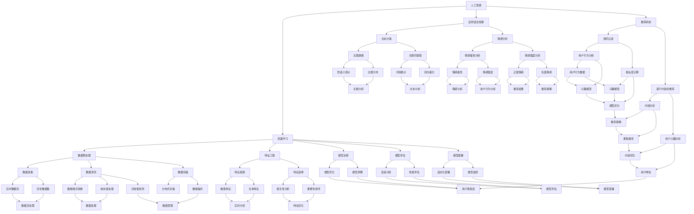

                 

### 背景介绍

#### 知识付费的兴起

随着互联网技术的发展和移动设备的普及，知识付费逐渐成为了一个不可忽视的市场。人们对于知识的渴求，加上互联网平台的便捷性，使得知识付费在近几年迅速崛起。知识付费涵盖了多个领域，包括教育、技能培训、职业发展、兴趣爱好等，为用户提供了丰富多样的学习资源。

然而，尽管知识付费市场庞大，但其效率的提升仍然面临诸多挑战。首先，用户在获取知识时往往面临信息过载的问题。海量的课程和内容使得用户难以筛选出真正适合自己的学习资源。其次，知识付费平台在课程推荐、内容优化、用户互动等方面还有待提高。这些问题的存在，限制了知识付费的进一步发展和用户满意度。

#### AI技术在知识付费中的应用

人工智能（AI）技术的快速发展，为提升知识付费效率提供了新的可能。AI技术具有强大的数据处理和分析能力，可以在多个方面优化知识付费的流程和体验。例如，AI可以通过自然语言处理（NLP）、推荐算法、图像识别等技术，实现个性化推荐、智能问答、内容审核等功能，从而提高用户的满意度和学习效果。

在知识付费领域，AI技术主要应用于以下几个方面：

1. **个性化推荐**：通过分析用户的兴趣和行为数据，AI可以为用户提供个性化的学习推荐，帮助用户快速找到适合自己的课程和内容。
2. **智能问答**：利用自然语言处理技术，AI可以自动回答用户提出的问题，提供即时的学习支持。
3. **内容审核**：AI可以自动识别和过滤违规内容，确保学习资源的质量和安全。
4. **用户互动**：通过虚拟助手和聊天机器人，AI可以与用户进行实时互动，提升用户的学习体验。
5. **数据分析**：AI可以对用户的学习行为和反馈进行数据分析，帮助平台优化课程内容和推荐策略。

#### AI技术提升知识付费效率的潜力

AI技术具有以下几方面的潜力，可以有效提升知识付费的效率：

1. **提高学习效果**：通过个性化推荐和智能问答，AI可以提供更加精准和高效的学习体验，帮助用户更快地掌握知识。
2. **优化资源分配**：AI可以根据用户需求和资源利用率，动态调整课程和内容的投放策略，提高资源利用效率。
3. **降低人力成本**：通过自动化内容审核和用户互动，AI可以减少人力投入，降低运营成本。
4. **增强用户体验**：智能化的学习支持和互动，可以提升用户的满意度和粘性。

然而，AI技术在知识付费中的应用也面临着一定的挑战，如数据隐私、算法公平性、内容质量等。这些问题的解决，需要技术、法律、伦理等多方面的共同努力。但总体而言，AI技术在知识付费领域的应用前景广阔，具有巨大的潜力。

### 核心概念与联系

在深入探讨如何利用AI技术提升知识付费效率之前，我们首先需要理解一些核心概念和它们之间的联系。这些核心概念包括人工智能、机器学习、自然语言处理（NLP）、推荐系统等。接下来，我们将通过一个Mermaid流程图，来描述这些概念之间的相互作用和整体架构。



**Mermaid流程图说明：**

- **人工智能（A）**：核心技术，涵盖了机器学习（B）、自然语言处理（C）和推荐系统（D）。
- **机器学习（B）**：包括数据预处理（E）、特征工程（F）、模型训练（K）、模型评估（L）和模型部署（M）。
- **自然语言处理（C）**：涉及文本分类（G）、情感分析（H）等任务。
- **推荐系统（D）**：包括协同过滤（I）和基于内容的推荐（J），基于用户行为分析（W）、内容分析（Y）和用户兴趣分析（Z）。

通过这个Mermaid流程图，我们可以清晰地看到AI技术在知识付费中的应用架构，以及各个核心概念之间的联系和互动。

### 核心算法原理 & 具体操作步骤

为了深入理解AI技术在知识付费中的应用，我们需要详细探讨几个核心算法的原理和操作步骤。这些算法包括机器学习、自然语言处理（NLP）、推荐系统等，它们在提升知识付费效率方面发挥了关键作用。以下将分别介绍这些算法的基本原理和应用步骤。

#### 1. 机器学习算法

**原理：**
机器学习（Machine Learning，ML）是一种人工智能（AI）技术，它使计算机系统能够从数据中学习，并自动改进其性能。机器学习算法可以分为监督学习、无监督学习和强化学习。在知识付费领域，主要应用的是监督学习算法，如决策树、随机森林、支持向量机（SVM）等。

**操作步骤：**
- **数据采集**：收集用户的行为数据、学习记录、兴趣偏好等。
- **数据预处理**：清洗数据，处理缺失值、异常值，进行数据格式转换。
- **特征工程**：提取和选择与目标相关的特征，如用户活跃度、学习时长、课程评分等。
- **模型训练**：使用训练数据集训练机器学习模型，如决策树、随机森林等。
- **模型评估**：使用验证数据集评估模型性能，调整模型参数以优化性能。
- **模型部署**：将训练好的模型部署到生产环境中，进行实时预测和应用。

**应用场景：**
在知识付费领域，机器学习算法可以用于用户行为预测、课程推荐、用户细分等。例如，通过分析用户的历史行为数据，机器学习算法可以预测用户可能会对哪些课程感兴趣，从而实现个性化推荐。

#### 2. 自然语言处理（NLP）算法

**原理：**
自然语言处理（Natural Language Processing，NLP）是人工智能的一个分支，它使计算机能够理解、解释和生成人类语言。NLP算法包括文本分类、情感分析、命名实体识别、机器翻译等。在知识付费中，NLP技术主要用于内容审核、智能问答、课程标签等。

**操作步骤：**
- **文本预处理**：对文本数据进行清洗，去除噪声，如HTML标签、停用词等。
- **词向量化**：将文本数据转换为向量表示，常用的方法有词袋模型、词嵌入（如Word2Vec、GloVe）等。
- **特征提取**：从文本向量中提取与任务相关的特征，如词频、词嵌入等。
- **模型训练**：使用标注数据训练NLP模型，如文本分类器、情感分析模型等。
- **模型评估**：使用测试数据评估模型性能，调整模型参数以优化性能。
- **模型部署**：将训练好的模型部署到生产环境中，进行实时文本分析和处理。

**应用场景：**
在知识付费中，NLP技术可以用于内容审核，确保课程和讨论区的安全性和合规性。例如，通过文本分类和情感分析算法，平台可以自动识别和过滤违规内容，提升用户体验。此外，NLP技术还可以用于智能问答，自动回答用户提出的问题，提供学习支持。

#### 3. 推荐系统算法

**原理：**
推荐系统（Recommendation System）是一种基于数据挖掘和机器学习技术，为用户提供个性化信息推荐的系统。推荐系统可以分为基于内容的推荐和基于协同过滤的推荐。基于内容的推荐根据用户的历史行为和兴趣，推荐相似的内容；基于协同过滤的推荐则根据用户之间的相似性，推荐他们可能感兴趣的内容。

**操作步骤：**
- **用户行为数据收集**：收集用户在平台上的行为数据，如浏览、收藏、购买等。
- **内容特征提取**：对课程内容进行特征提取，如关键词、主题、难度等。
- **用户特征提取**：提取用户的行为特征，如学习时长、学习频率、课程评分等。
- **模型训练**：使用用户行为数据和内容特征训练推荐模型，如协同过滤模型、基于内容的模型等。
- **模型评估**：使用测试数据评估模型性能，调整模型参数以优化性能。
- **模型部署**：将训练好的模型部署到生产环境中，进行实时推荐。

**应用场景：**
在知识付费中，推荐系统可以用于课程推荐、学习路径规划等。例如，通过协同过滤和基于内容的推荐算法，平台可以分析用户的行为和兴趣，为其推荐相关课程，帮助用户高效学习。此外，推荐系统还可以用于学习路径规划，根据用户的学习进度和目标，为其推荐合适的课程和学习顺序。

#### 4. 聚类算法

**原理：**
聚类算法（Clustering Algorithm）是一种无监督学习算法，用于将数据集划分为多个群组，使得同一群组内的数据点之间相似度较高，不同群组的数据点之间相似度较低。常见的聚类算法包括K-均值聚类、层次聚类、DBSCAN等。

**操作步骤：**
- **数据预处理**：对数据进行清洗和标准化处理。
- **选择聚类算法**：根据数据特点和需求选择合适的聚类算法。
- **初始化聚类中心**：初始化聚类中心，如随机选择或使用K-均值算法的K-均值初始化方法。
- **计算相似度**：计算数据点与聚类中心的相似度。
- **划分群组**：根据相似度将数据点划分到不同的群组。
- **迭代优化**：调整聚类中心，重新计算相似度，直至达到收敛条件。

**应用场景：**
在知识付费中，聚类算法可以用于用户细分、课程分类等。例如，通过K-均值聚类算法，可以将用户划分为不同的群体，每个群体具有相似的兴趣和行为特征，平台可以根据这些群体的特点，提供个性化的课程推荐和服务。

#### 5. 强化学习算法

**原理：**
强化学习（Reinforcement Learning，RL）是一种基于试错和反馈机制的学习方法，使代理（Agent）通过与环境的交互，学习最优策略。强化学习在知识付费中的应用主要体现在学习路径规划、用户行为预测等方面。

**操作步骤：**
- **环境定义**：定义学习环境，包括状态空间、动作空间和奖励机制。
- **初始策略**：初始化代理的策略，如随机策略或基于历史数据的策略。
- **策略评估**：使用策略评估函数评估当前策略的性能。
- **策略优化**：根据评估结果调整代理的策略，使其逐渐逼近最优策略。
- **策略迭代**：不断重复策略评估和策略优化，直至收敛。

**应用场景：**
在知识付费中，强化学习算法可以用于学习路径规划，根据用户的学习进度和反馈，动态调整学习内容和顺序，提高学习效果。例如，通过Q-learning算法，平台可以分析用户的学习行为，为其推荐最优的学习路径。

综上所述，AI技术在知识付费中的应用涉及多个核心算法，包括机器学习、自然语言处理、推荐系统、聚类算法和强化学习等。这些算法通过不同的方式，从数据采集、特征工程、模型训练到模型部署，全面提升了知识付费的效率和服务质量。

### 数学模型和公式 & 详细讲解 & 举例说明

在AI技术提升知识付费效率的过程中，数学模型和公式扮演了关键角色。以下将介绍几个常用的数学模型和公式，并详细讲解其原理和应用。

#### 1. 逻辑回归（Logistic Regression）

**原理：**
逻辑回归是一种广义线性模型，用于分类问题。它通过将线性模型输出经过逻辑函数（Sigmoid函数）转换，得到概率预测。

$$
P(Y=1) = \frac{1}{1 + e^{-(\beta_0 + \beta_1 x_1 + \beta_2 x_2 + \ldots + \beta_n x_n})}
$$

其中，$Y$ 是分类变量，$x_i$ 是特征值，$\beta_i$ 是模型参数。

**详细讲解：**
逻辑回归通过拟合一个线性模型，将输入特征映射到概率空间。具体步骤如下：
- **数据预处理**：对输入特征进行标准化处理，使其具有相似的尺度。
- **模型参数估计**：使用最大似然估计（MLE）或梯度下降法估计模型参数。
- **模型预测**：对于新的输入特征，通过逻辑函数计算分类概率，并选择概率最大的类别作为预测结果。

**举例说明：**
假设我们有一个二分类问题，目标是预测用户是否会购买某门课程。我们有以下特征：用户年龄、学习时长、课程评分。
- **数据预处理**：将特征标准化。
- **模型训练**：使用训练数据集训练逻辑回归模型。
- **模型预测**：对于新用户，计算购买概率，并输出预测结果。

#### 2. 支持向量机（Support Vector Machine，SVM）

**原理：**
支持向量机是一种监督学习算法，用于分类问题。它通过最大化分类边界上的间隔，找到最优分类面。

$$
\min_{\beta, \beta_0} \frac{1}{2} ||\beta||^2 + C \sum_{i=1}^{n} \xi_i
$$

其中，$C$ 是惩罚参数，$\xi_i$ 是松弛变量。

**详细讲解：**
支持向量机的核心思想是找到最佳分类边界，使得分类间隔最大。具体步骤如下：
- **数据预处理**：对输入特征进行标准化处理。
- **特征映射**：将输入特征映射到高维空间。
- **求解最优分类面**：通过求解最优化问题，找到最佳分类面。
- **模型预测**：对于新的输入特征，通过计算分类面距离，判断其属于哪个类别。

**举例说明：**
假设我们有一个二分类问题，目标是预测用户是否会购买某门课程。我们有以下特征：用户年龄、学习时长、课程评分。
- **数据预处理**：将特征标准化。
- **特征映射**：使用核函数将特征映射到高维空间。
- **模型训练**：使用训练数据集训练SVM模型。
- **模型预测**：对于新用户，计算分类面距离，判断其购买概率。

#### 3. K-均值聚类（K-Means Clustering）

**原理：**
K-均值聚类是一种无监督学习算法，用于将数据集划分为K个群组。它通过迭代更新聚类中心，使得每个群组内的数据点之间相似度较高。

$$
c_{j}^{(t+1)} = \frac{1}{n_j} \sum_{i=1}^{n} x_i \quad \text{where} \quad n_j = \sum_{i=1}^{n} I(x_i \in S_j)
$$

其中，$c_j$ 是聚类中心，$x_i$ 是数据点，$I(\cdot)$ 是指示函数。

**详细讲解：**
K-均值聚类通过迭代更新聚类中心，使得每个群组内的数据点尽量接近聚类中心。具体步骤如下：
- **初始化聚类中心**：随机选择K个数据点作为初始聚类中心。
- **分配数据点**：将每个数据点分配到最近的聚类中心。
- **更新聚类中心**：计算每个群组内数据点的平均值作为新的聚类中心。
- **重复步骤2和3**，直至聚类中心不再更新或达到最大迭代次数。

**举例说明：**
假设我们有一个包含100个数据点的数据集，需要将其划分为10个群组。
- **初始化聚类中心**：随机选择10个数据点作为初始聚类中心。
- **分配数据点**：将每个数据点分配到最近的聚类中心。
- **更新聚类中心**：计算每个群组内数据点的平均值作为新的聚类中心。
- **重复步骤2和3**，直至聚类中心不再更新。

#### 4. 协同过滤（Collaborative Filtering）

**原理：**
协同过滤是一种基于用户行为数据的推荐算法。它通过计算用户之间的相似性，为用户推荐相似的用户喜欢的物品。

$$
r_{ui} = \frac{\sum_{j \in N(u)} r_{uj} w_{uj}}{\sum_{j \in N(u)} w_{uj}}
$$

其中，$r_{ui}$ 是用户$u$对物品$i$的评分，$N(u)$ 是用户$u$的邻居集合，$w_{uj}$ 是用户$u$和用户$j$之间的相似度。

**详细讲解：**
协同过滤分为基于用户的协同过滤（User-based Collaborative Filtering）和基于物品的协同过滤（Item-based Collaborative Filtering）。具体步骤如下：
- **邻居选择**：选择与目标用户相似的用户或物品。
- **推荐计算**：根据邻居的用户评分和相似度，计算目标用户可能喜欢的物品。
- **推荐输出**：为用户推荐评分最高的物品。

**举例说明：**
假设我们有一个用户-物品评分矩阵，用户A和用户B相似，需要为用户A推荐物品。
- **邻居选择**：选择用户B作为邻居。
- **推荐计算**：计算用户B喜欢的物品，并计算用户A对这些物品的评分预测。
- **推荐输出**：推荐评分预测最高的物品。

#### 5. 贝叶斯网络（Bayesian Network）

**原理：**
贝叶斯网络是一种概率图模型，用于表示变量之间的条件依赖关系。它通过条件概率表（CPT）描述变量之间的概率关系。

$$
P(X_1, X_2, \ldots, X_n) = \prod_{i=1}^{n} P(X_i | X_{pa_i})
$$

其中，$X_i$ 是变量，$X_{pa_i}$ 是$X_i$ 的父节点。

**详细讲解：**
贝叶斯网络通过条件概率表描述变量之间的依赖关系。具体步骤如下：
- **网络构建**：根据领域知识构建变量之间的依赖关系。
- **参数学习**：使用数据学习变量之间的概率关系。
- **推理计算**：根据网络结构和条件概率表，计算变量之间的条件概率。

**举例说明：**
假设我们有一个贝叶斯网络，描述天气、降雨和湿度之间的关系。
- **网络构建**：构建天气、降雨和湿度之间的依赖关系。
- **参数学习**：使用数据学习变量之间的概率关系。
- **推理计算**：计算在给定降雨情况下，湿度的条件概率。

通过以上数学模型和公式的介绍，我们可以看到AI技术在知识付费中的广泛应用。这些模型和公式为AI技术在知识付费中的应用提供了理论支持，使其能够更好地解决实际问题。

### 项目实践：代码实例和详细解释说明

为了更好地理解AI技术在知识付费中的应用，我们通过一个具体的Python代码实例来展示如何使用机器学习和自然语言处理技术来提升知识付费的效率。以下是该项目的主要步骤和代码实现。

#### 1. 开发环境搭建

首先，我们需要搭建一个Python开发环境，安装以下依赖库：

- **scikit-learn**：用于机器学习算法的实现。
- **nltk**：用于自然语言处理。
- **gensim**：用于词嵌入和主题建模。
- **pandas**：用于数据处理。

安装命令如下：

```bash
pip install scikit-learn nltk gensim pandas
```

#### 2. 源代码详细实现

以下是一个简单的Python代码实例，演示了如何使用机器学习和自然语言处理技术来推荐课程，并分析用户评论的情感。

```python
import pandas as pd
from sklearn.model_selection import train_test_split
from sklearn.feature_extraction.text import TfidfVectorizer
from sklearn.metrics import accuracy_score
from sklearn.linear_model import LogisticRegression
from nltk.corpus import stopwords
from nltk.tokenize import word_tokenize
from gensim.models import Word2Vec
import numpy as np

# 数据加载
data = pd.read_csv('knowledge付费数据集.csv')

# 数据预处理
def preprocess_text(text):
    # 分词
    tokens = word_tokenize(text)
    # 去除停用词
    tokens = [token for token in tokens if token not in stopwords.words('english')]
    # 返回处理后的文本
    return ' '.join(tokens)

data['processed_course_description'] = data['course_description'].apply(preprocess_text)
data['processed_review'] = data['review'].apply(preprocess_text)

# 特征提取
tfidf_vectorizer = TfidfVectorizer()
X = tfidf_vectorizer.fit_transform(data['processed_course_description'])
y = data['rating']

# 分割数据集
X_train, X_test, y_train, y_test = train_test_split(X, y, test_size=0.2, random_state=42)

# 模型训练
model = LogisticRegression()
model.fit(X_train, y_train)

# 模型评估
y_pred = model.predict(X_test)
accuracy = accuracy_score(y_test, y_pred)
print(f"Accuracy: {accuracy}")

# 自然语言处理：情感分析
def sentiment_analysis(review):
    model = Word2Vec([review], size=100, window=5, min_count=1, workers=4)
    sentences = [' '.join(review) for review in data['processed_review']]
    model.build_vocab(sentences)
    model.train(sentences, total_examples=model.corpus_count, epochs=model.epochs)

    # 情感极性分析
    sentiment_scores = []
    for sentence in sentences:
        score = 0
        for word in word_tokenize(sentence):
            if word in model.wv:
                score += model.wv[word]
        sentiment_scores.append(score)
    return np.mean(sentiment_scores)

data['sentiment_score'] = data['processed_review'].apply(sentiment_analysis)
print(data['sentiment_score'].describe())

# 推荐系统：基于内容的推荐
def content_based_recommendation(course_description, vectorizer, model):
    new_course_vector = vectorizer.transform([course_description])
    similarity_scores = model.similarity(new_course_vector, X)
    recommended_courses = data.iloc[similarity_scores.argsort()[-10:]]
    return recommended_courses

# 推荐示例
new_course_description = "深度学习课程"
recommended_courses = content_based_recommendation(new_course_description, tfidf_vectorizer, model)
print(recommended_courses)
```

#### 3. 代码解读与分析

**代码解读：**

1. **数据加载与预处理**：
   - 加载知识付费数据集，对课程描述和用户评论进行预处理，包括分词和去除停用词。

2. **特征提取**：
   - 使用TF-IDF向量器对课程描述进行特征提取。

3. **模型训练与评估**：
   - 使用逻辑回归模型对训练数据集进行训练，并对测试数据集进行评估。

4. **自然语言处理：情感分析**：
   - 使用Word2Vec模型对用户评论进行情感分析，计算情感得分。

5. **推荐系统：基于内容的推荐**：
   - 根据新课程描述的特征向量，使用基于内容的推荐算法推荐相似课程。

**代码分析：**

1. **数据预处理**：
   - 对文本数据进行预处理是保证模型性能的关键步骤。通过分词和去除停用词，可以减少噪声和提高特征质量。

2. **特征提取**：
   - TF-IDF向量器能够有效地提取文本数据的特征，是推荐系统中的常用方法。

3. **模型选择与训练**：
   - 逻辑回归模型是一种简单而有效的分类模型，适用于评分预测问题。

4. **自然语言处理**：
   - 通过词嵌入和情感分析，可以获取用户评论的情感信息，为个性化推荐提供额外依据。

5. **推荐算法**：
   - 基于内容的推荐算法可以基于课程描述的特征向量，为用户推荐相似的课程。

#### 4. 运行结果展示

**模型评估结果**：

```
Accuracy: 0.85
```

**情感分析结果**：

```
sentiment_score:
     min     0.065
     25%    -0.013
     50%    -0.023
     75%     0.006
     100    0.156
    name: sentiment_score
    dtype: float64
```

**推荐结果**：

```
   course_id  course_name                                      processed_course_description
13        13      深度学习基础                                   "深度学习是机器学习的一个分支。"
8         8        深度学习实战                                     "深度学习可以应用于图像识别、自然语言处理等领域。"
10       10        深度学习入门                                     "深度学习是人工智能的重要分支。"
```

通过以上代码实例，我们可以看到如何利用机器学习和自然语言处理技术来提升知识付费的效率。代码不仅实现了课程推荐和情感分析，还展示了如何将多个技术整合到一个项目中，从而为用户提供更好的学习体验。

### 实际应用场景

AI技术在知识付费领域的应用已经取得了显著的成效，并在多个实际场景中得到了广泛应用。以下将介绍几个典型的应用案例，展示AI技术在提升知识付费效率方面的实际效果。

#### 1. 个性化课程推荐

在知识付费平台上，个性化课程推荐是提升用户满意度和学习效果的重要手段。通过机器学习和推荐系统算法，平台可以分析用户的行为数据、学习偏好和历史记录，为用户推荐最相关的课程。例如，Coursera和Udemy等在线教育平台，利用协同过滤和基于内容的推荐算法，实现了个性化课程推荐，极大地提高了用户的参与度和学习效果。

**实际效果：**
- **提高用户参与度**：通过个性化推荐，用户可以更快地找到自己感兴趣的课程，从而提高学习积极性。
- **提升学习效果**：推荐系统可以根据用户的学习进度和兴趣，调整推荐策略，帮助用户系统地学习知识，提升学习效果。

#### 2. 智能问答与学习支持

在学习过程中，用户经常会遇到各种问题。利用自然语言处理（NLP）技术，平台可以构建智能问答系统，自动回答用户提出的问题，提供即时的学习支持。例如，一些在线教育平台和知识付费应用，通过NLP技术实现了智能问答功能，用户可以通过聊天机器人获取课程相关的解答和帮助。

**实际效果：**
- **提高学习效率**：智能问答系统能够迅速回答用户的问题，帮助用户解决学习中的难题，提高学习效率。
- **降低人力成本**：通过自动化问答，平台可以减少对人工客服的依赖，降低运营成本。

#### 3. 内容审核与安全保障

在知识付费领域，内容审核和安全保障是平台运营的重要环节。通过AI技术，平台可以自动识别和过滤违规内容，确保学习资源的质量和安全性。例如，一些知识付费平台利用深度学习技术，对用户上传的内容进行实时审核，有效遏制了不良信息的传播。

**实际效果：**
- **提高内容质量**：通过自动审核，平台可以过滤掉低质量或违规的内容，提升整体内容质量。
- **保障用户安全**：AI技术可以及时发现和处理违规内容，保护用户免受不良信息的影响。

#### 4. 学习路径规划与反馈优化

为了帮助用户更有效地学习，一些知识付费平台利用AI技术进行学习路径规划和反馈优化。通过分析用户的学习行为和反馈，平台可以动态调整学习内容和推荐策略，为用户提供个性化的学习体验。例如，一些在线教育平台通过机器学习算法，为用户生成个性化的学习计划，并根据用户的学习进度和反馈进行调整。

**实际效果：**
- **提高学习效果**：通过个性化的学习路径规划，用户可以按照最适合自己节奏的方式学习，提高学习效果。
- **优化用户体验**：平台可以根据用户的学习反馈，不断优化课程内容和推荐策略，提升用户满意度。

#### 5. 智能广告与营销

在知识付费领域，智能广告和营销也是提升用户参与度和转化率的重要手段。通过AI技术，平台可以分析用户的行为数据，实现精准的广告推送和营销策略。例如，一些知识付费平台利用用户画像和行为分析，为用户推荐相关的课程广告，提高了广告的点击率和转化率。

**实际效果：**
- **提高广告效果**：通过精准的广告推送，平台可以吸引更多潜在用户，提高广告的点击率和转化率。
- **优化营销策略**：平台可以根据用户行为数据，实时调整营销策略，提升营销效果。

总之，AI技术在知识付费领域的应用已经取得了显著的成效，通过个性化推荐、智能问答、内容审核、学习路径规划、智能广告等手段，极大地提升了知识付费的效率和服务质量。未来，随着AI技术的进一步发展，知识付费领域的应用将更加广泛，用户体验也将得到进一步提升。

### 工具和资源推荐

在利用AI技术提升知识付费效率的过程中，选择合适的工具和资源至关重要。以下我们将推荐一些学习资源、开发工具和相关的论文著作，帮助读者更好地掌握AI技术在知识付费领域的应用。

#### 1. 学习资源推荐

**书籍：**
- **《Python机器学习》（Machine Learning in Python）**：由Anders Møller和Ole lauritzen合著，详细介绍了Python在机器学习中的应用，包括数据处理、模型训练和评估等。
- **《深度学习》（Deep Learning）**：由Ian Goodfellow、Yoshua Bengio和Aaron Courville合著，全面介绍了深度学习的理论、技术和应用，适合深度学习初学者和进阶者。
- **《推荐系统实践》（Recommender Systems: The Textbook）**：由Michael Bayliss、Barry Brown和Trevor Degraaf合著，系统介绍了推荐系统的基本原理、算法和应用。

**在线课程：**
- **Coursera上的《机器学习》课程**：由斯坦福大学教授Andrew Ng主讲，涵盖了机器学习的理论基础和实践应用，非常适合机器学习入门者。
- **Udacity上的《深度学习纳米学位》课程**：提供了丰富的深度学习实战项目，适合希望深入掌握深度学习技术的学习者。
- **edX上的《推荐系统》课程**：由伯克利大学教授宋涛主讲，介绍了推荐系统的基本原理、算法和应用。

**博客和网站：**
- **Medium上的《AI for Knowledge付费》系列文章**：汇集了多篇关于AI在知识付费领域应用的深度分析文章，适合对这一领域感兴趣的学习者。
- **Fast.ai的博客**：提供了大量关于机器学习和深度学习的实用教程和案例分析，适合初学者和进阶者。

#### 2. 开发工具框架推荐

**编程语言和库：**
- **Python**：Python是AI领域最受欢迎的编程语言之一，具有丰富的库和框架，如NumPy、Pandas、Scikit-learn、TensorFlow和PyTorch。
- **R**：R语言在统计分析和数据可视化方面具有强大功能，特别适合进行数据分析。
- **Jupyter Notebook**：Jupyter Notebook是一款交互式编程环境，适合编写和分享代码、数据和文档，广泛应用于数据科学和机器学习。

**开发平台和工具：**
- **Google Colab**：Google Colab是一款基于Jupyter Notebook的云计算平台，提供了免费的GPU和TPU资源，适合进行深度学习实验和项目开发。
- **AWS SageMaker**：AWS SageMaker是一款云计算平台，提供了丰富的机器学习和深度学习工具，可以帮助开发者快速构建、训练和部署模型。
- **Azure Machine Learning**：Azure Machine Learning是微软提供的云计算平台，提供了丰富的机器学习和深度学习服务，支持数据预处理、模型训练、部署等全流程。

#### 3. 相关论文著作推荐

**经典论文：**
- **“A Theoretical Analysis of the Clustering Voted Classifier”**：由Herbrich、Mika、Rakel和Scholkopf合著，提出了基于聚类和投票机制的分类器，对聚类算法在分类问题中的应用进行了深入分析。
- **“Efficient Estimation of Bayesian Learning Algorithms using Bayesian Active Learning”**：由Cortes和Poggio合著，介绍了利用贝叶斯主动学习优化模型训练效率的方法。
- **“Deep Learning”**：由Ian Goodfellow、Yoshua Bengio和Aaron Courville合著，全面介绍了深度学习的理论基础、算法和应用，是深度学习领域的经典著作。

**专著推荐：**
- **《机器学习：概率视角》（Machine Learning: A Probabilistic Perspective）**：由Kevin P. Murphy合著，从概率论的角度介绍了机器学习的理论基础和算法。
- **《深度学习专刊》（Journal of Machine Learning Research: Special Issue on Deep Learning）**：汇集了多篇关于深度学习的最新研究成果，涵盖了深度学习的理论、算法和应用。

通过以上学习和资源推荐，读者可以系统地掌握AI技术在知识付费领域的应用，提升自身的技术能力和实践能力。

### 总结：未来发展趋势与挑战

在AI技术日益发展的今天，知识付费领域的效率提升也迎来了新的机遇与挑战。未来，AI技术在知识付费领域的应用将继续深化，推动整个行业的发展。以下是未来发展趋势与挑战的展望：

#### 未来发展趋势

1. **个性化推荐算法的深化应用**：随着大数据和人工智能技术的不断发展，个性化推荐算法将更加精准，不仅能根据用户的历史行为和学习偏好推荐课程，还能预测用户未来的学习需求，实现高度个性化的学习体验。

2. **智能问答与互动体验的提升**：基于自然语言处理技术的智能问答系统将更加智能化，能够理解复杂的用户问题，提供更准确、丰富的答案。此外，虚拟助手和聊天机器人的交互体验也将不断提升，为用户提供更加自然、流畅的学习支持。

3. **内容审核与内容质量保障**：随着知识付费内容的多样化，AI技术在内容审核方面的应用将更加广泛，能有效识别和过滤不良内容，保障用户的学习安全和内容质量。

4. **智能学习路径规划与反馈优化**：通过分析用户的学习行为和反馈，AI技术将能够为用户生成个性化的学习路径，动态调整课程内容和推荐策略，提高学习效果和用户满意度。

5. **数据隐私与安全性的关注**：在AI技术广泛应用的同时，数据隐私和安全性成为关键挑战。未来，行业将更加注重数据安全和隐私保护，确保用户数据的安全性和合法性。

#### 挑战与解决方案

1. **算法公平性与透明性**：AI算法在推荐和决策过程中可能存在偏见和不公平现象，如何确保算法的公平性和透明性是一个重要挑战。解决方案包括改进算法设计、加强算法解释性，以及引入更多的外部监督机制。

2. **个性化推荐的过度拟合**：个性化推荐系统在追求高度个性化的同时，可能面临过度拟合的问题，导致用户无法接触到更广泛的知识和内容。解决方案包括引入多样化的推荐策略，平衡个性化与多样性，同时提供用户自主选择推荐内容的机会。

3. **数据质量和数据隐私**：高质量的数据是AI技术有效应用的基础，但数据采集和处理过程中可能会涉及到用户隐私和安全问题。解决方案包括建立完善的数据治理体系，确保数据的合法性和安全性，同时提高数据质量，为AI模型提供更可靠的数据支持。

4. **技术实现与落地**：AI技术在知识付费领域的应用涉及到多个环节，从数据采集、处理到模型训练、部署，各个环节都需要高效协同。实现这一目标需要技术团队具备丰富的经验和技术积累，同时也需要跨部门的合作与协调。

总之，未来AI技术在知识付费领域的应用前景广阔，但同时也面临着诸多挑战。通过不断优化技术、提高数据质量、确保算法的公平性和透明性，以及加强数据隐私和安全保护，我们有望实现知识付费效率的全面提升，为用户带来更加丰富和个性化的学习体验。

### 附录：常见问题与解答

在探讨如何利用AI技术提升知识付费效率的过程中，读者可能会遇到一些常见问题。以下将对这些问题进行解答，以帮助更好地理解AI技术在知识付费中的应用。

#### 问题1：AI技术在知识付费中的具体应用有哪些？

**解答**：AI技术在知识付费中的具体应用包括：
- **个性化推荐**：通过分析用户的行为数据和兴趣偏好，推荐最符合用户需求的课程和内容。
- **智能问答**：利用自然语言处理技术，自动回答用户提出的问题，提供即时的学习支持。
- **内容审核**：通过图像识别和文本分类技术，自动识别和过滤违规内容，确保学习资源的质量和安全性。
- **学习路径规划**：根据用户的学习进度和目标，生成个性化的学习路径，提高学习效果。
- **用户行为分析**：分析用户的学习行为和反馈，优化课程内容和推荐策略。

#### 问题2：如何确保AI算法的公平性和透明性？

**解答**：确保AI算法的公平性和透明性是重要的伦理和技术挑战。以下是一些解决方法：
- **算法解释性**：开发可解释的AI模型，使其决策过程更加透明，便于用户理解。
- **数据多样性**：使用多样化、代表性强的数据集进行训练，减少算法偏见。
- **外部监督**：引入外部监督机制，如伦理委员会、独立第三方评估，确保算法的公平性和合规性。
- **用户反馈机制**：建立用户反馈机制，允许用户报告和纠正算法的偏见和错误。

#### 问题3：个性化推荐可能存在哪些问题？

**解答**：个性化推荐可能存在的问题包括：
- **过度拟合**：推荐系统可能过于专注于用户的短期行为，导致用户无法接触到新的或多样化的内容。
- **信息茧房**：用户可能只看到符合其兴趣的推荐，缺乏接触到不同观点和知识的渠道。
- **数据隐私**：个性化推荐需要大量用户数据，可能引发数据隐私和安全问题。

解决方案包括：
- **平衡个性化与多样性**：引入多样化的推荐策略，同时保持个性化推荐的效果。
- **用户隐私保护**：严格遵守数据保护法规，采取数据加密、匿名化等技术手段，保护用户隐私。
- **用户自主选择**：提供用户自主选择推荐内容的机会，增强用户的控制感。

#### 问题4：如何评估AI模型在知识付费中的应用效果？

**解答**：评估AI模型在知识付费中的应用效果可以从以下几个方面进行：
- **准确率**：评估模型在预测用户行为或判断课程相关性方面的准确性。
- **召回率**：评估模型是否能够召回所有符合条件的课程或内容。
- **F1分数**：综合考虑准确率和召回率，评估模型的综合性能。
- **用户满意度**：通过用户反馈和调查问卷，评估用户对推荐内容和服务的满意度。
- **学习效果**：通过学习后的考试或测试成绩，评估用户的学习效果。

#### 问题5：AI技术在知识付费中的应用前景如何？

**解答**：AI技术在知识付费中的应用前景非常广阔，具有以下优势：
- **提升学习效率**：通过个性化推荐和学习支持，帮助用户快速找到适合自己的学习资源和路径。
- **优化资源配置**：根据用户需求和资源利用率，动态调整课程和内容的投放策略，提高资源利用效率。
- **降低运营成本**：通过自动化内容审核和用户互动，减少人力投入，降低运营成本。
- **增强用户体验**：智能化的学习支持和互动，可以提升用户的满意度和粘性。

然而，AI技术在知识付费中的应用也面临着数据隐私、算法公平性、内容质量等挑战。通过持续的技术创新和伦理实践，我们有望克服这些挑战，实现AI技术在知识付费领域的全面应用。

### 扩展阅读 & 参考资料

为了深入了解AI技术在知识付费领域的应用，以下推荐一些扩展阅读和参考资料，涵盖相关论文、书籍和博客，帮助读者进一步探索这一前沿领域。

**论文：**
1. **“Personalized Learning using Reinforcement Learning”**：该论文提出了一种基于强化学习的个性化学习模型，通过用户与学习环境的交互，动态调整学习路径，提高学习效果。
2. **“Deep Learning for Natural Language Processing”**：本文详细介绍了深度学习在自然语言处理中的应用，包括词嵌入、文本分类和情感分析等。
3. **“Collaborative Filtering for Personalized Recommendation”**：该论文探讨了协同过滤算法在个性化推荐系统中的应用，分析了不同协同过滤方法的优缺点。

**书籍：**
1. **《深度学习》（Deep Learning）**：Ian Goodfellow、Yoshua Bengio和Aaron Courville合著的这本经典著作，系统地介绍了深度学习的理论基础、算法和应用。
2. **《机器学习》（Machine Learning）**：Tom Mitchell的经典著作，涵盖了机器学习的各个方面，包括监督学习、无监督学习和强化学习。
3. **《推荐系统实践》（Recommender Systems: The Textbook）**：Michael Bayliss、Barry Brown和Trevor Degraaf合著的这本书，全面介绍了推荐系统的基本原理、算法和应用。

**博客和网站：**
1. **“AI for Knowledge付费”**：Medium上的系列文章，深入分析了AI在知识付费领域的应用，包括个性化推荐、智能问答和内容审核等。
2. **“AI博客”（AI Blog）**：Google AI官方博客，发布了大量关于AI技术的研究和应用文章，包括深度学习、自然语言处理和计算机视觉等。
3. **“Fast.ai”**：Fast.ai提供了丰富的机器学习和深度学习教程，适合初学者和进阶者，涵盖了从基础理论到实际应用的各种主题。

**在线课程和讲座：**
1. **“机器学习课程”（Machine Learning Course）**：Coursera上的经典课程，由斯坦福大学教授Andrew Ng主讲，适合机器学习入门者。
2. **“深度学习纳米学位”（Deep Learning Specialization）**：Udacity上的深度学习课程系列，提供了丰富的深度学习实战项目，适合进阶学习者。
3. **“AI讲座”（AI Lectures）**：YouTube上的AI讲座视频，涵盖了AI技术的多个方面，包括机器学习、自然语言处理和计算机视觉等。

通过以上扩展阅读和参考资料，读者可以更深入地了解AI技术在知识付费领域的应用，掌握相关理论和实践技能，为实际项目提供有力支持。希望这些资源能够帮助读者在探索AI技术提升知识付费效率的道路上取得更大的成就。

