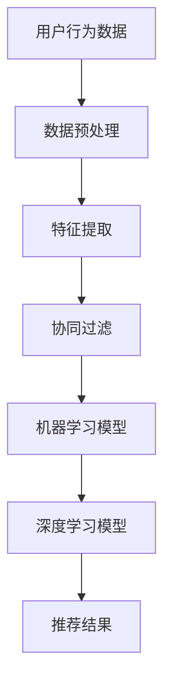

                 

关键词：人工智能、产品推荐、优化、算法、数据挖掘、机器学习、用户行为分析

> 摘要：本文将深入探讨人工智能在产品推荐领域的应用，介绍如何利用机器学习算法和用户行为分析优化产品推荐系统，从而提升用户体验和商业价值。

## 1. 背景介绍

在当今数字化时代，互联网产品和在线服务的数量呈爆炸式增长。消费者面临的选择越来越多，而时间却越来越有限。为了在这种竞争激烈的环境中脱颖而出，企业需要提供个性化的产品推荐，以吸引和留住用户。产品推荐系统已经成为电商平台、媒体平台、社交媒体等互联网公司的核心功能之一。

传统的推荐系统主要依赖于基于内容的过滤算法，通过分析用户过去的行为数据和产品特征，将相似的产品推荐给用户。然而，这种方法存在一定的局限性，如用户兴趣的多样性、冷启动问题（新用户没有历史行为数据）等。

随着人工智能技术的发展，特别是机器学习算法的进步，推荐系统的性能和效果得到了显著提升。本文将介绍如何利用人工智能技术，特别是机器学习算法，优化产品推荐系统，从而实现更精准、个性化的推荐。

## 2. 核心概念与联系

### 2.1. 用户行为分析

用户行为分析是推荐系统的基础。它包括用户在平台上的浏览、搜索、购买等行为数据。通过分析这些数据，可以挖掘出用户的兴趣偏好和购买习惯。

### 2.2. 协同过滤

协同过滤是推荐系统中最常用的方法之一。它分为基于用户的协同过滤（User-based Collaborative Filtering）和基于项目的协同过滤（Item-based Collaborative Filtering）。前者通过找到与目标用户相似的其他用户，推荐他们喜欢的项目；后者则是通过分析项目之间的相似度，推荐给用户可能感兴趣的项目。

### 2.3. 机器学习算法

机器学习算法在推荐系统中的应用主要包括聚类、分类、回归等。其中，聚类算法可以帮助发现用户群体的兴趣分布，分类算法可以用于预测用户对产品的偏好，回归算法可以用于预测用户的购买概率。

### 2.4. 深度学习

深度学习在推荐系统中的应用越来越广泛。通过构建深度神经网络模型，可以捕捉用户行为数据中的复杂模式和深层次关系，实现更精准的推荐。

### 2.5. Mermaid 流程图

下面是一个简单的 Mermaid 流程图，展示了用户行为分析到产品推荐的整体流程：



## 3. 核心算法原理 & 具体操作步骤

### 3.1. 算法原理概述

产品推荐系统的核心在于如何从海量的用户行为数据中挖掘出用户的兴趣偏好，并利用这些信息生成个性化的推荐列表。常用的机器学习算法包括协同过滤、聚类、分类和回归等。

### 3.2. 算法步骤详解

#### 3.2.1. 数据预处理

数据预处理是推荐系统建模的第一步。它包括数据清洗、缺失值处理、异常值检测和标准化等。通过数据预处理，可以提高数据的质量，为后续建模打下基础。

#### 3.2.2. 特征提取

特征提取是推荐系统建模的关键环节。它包括从原始数据中提取出能够表征用户兴趣和产品特征的属性。常用的特征提取方法有基于内容的特征提取和基于统计的特征提取。

#### 3.2.3. 协同过滤

协同过滤是一种基于用户相似度的推荐方法。它通过计算用户之间的相似度，找到与目标用户最相似的其他用户，推荐这些用户喜欢的项目。

- **基于用户的协同过滤**：找到与目标用户最相似的K个用户，推荐这些用户喜欢的项目。
- **基于项目的协同过滤**：找到与目标用户最相似的项目，推荐给目标用户。

#### 3.2.4. 机器学习模型

机器学习模型用于从用户行为数据中学习用户的兴趣偏好。常用的模型包括逻辑回归、支持向量机和随机森林等。

#### 3.2.5. 深度学习模型

深度学习模型可以捕捉用户行为数据中的复杂模式和深层次关系。常用的深度学习模型包括卷积神经网络（CNN）和循环神经网络（RNN）等。

### 3.3. 算法优缺点

- **协同过滤**：优点是简单易实现，效果好；缺点是冷启动问题严重，对稀疏数据敏感。
- **机器学习模型**：优点是可以处理稀疏数据，适应性强；缺点是模型复杂度高，训练时间长。
- **深度学习模型**：优点是能够捕捉复杂模式，效果好；缺点是模型复杂度高，对数据要求高。

### 3.4. 算法应用领域

产品推荐系统广泛应用于电商、媒体、社交、金融等领域。例如，电商平台可以通过产品推荐系统提高销售额，媒体平台可以通过个性化推荐增加用户黏性，社交平台可以通过兴趣推荐拓展社交圈子，金融平台可以通过风险偏好推荐优化投资组合。

## 4. 数学模型和公式 & 详细讲解 & 举例说明

### 4.1. 数学模型构建

在推荐系统中，常用的数学模型包括矩阵分解、协同过滤、逻辑回归和神经网络等。

- **矩阵分解**：将用户-项目评分矩阵分解为用户特征矩阵和项目特征矩阵，从而预测用户对项目的评分。
- **协同过滤**：计算用户之间的相似度，利用相似度矩阵预测用户对项目的评分。
- **逻辑回归**：用于分类问题，判断用户是否会对项目感兴趣。
- **神经网络**：用于捕捉用户行为数据中的复杂模式和深层次关系。

### 4.2. 公式推导过程

以矩阵分解为例，假设用户-项目评分矩阵为R，用户特征矩阵为U，项目特征矩阵为V，则有：

$$
R = U \times V
$$

通过最小化损失函数，可以求得用户特征矩阵U和项目特征矩阵V：

$$
\min_{U, V} \sum_{i, j} (r_{ij} - u_i \times v_j)^2
$$

### 4.3. 案例分析与讲解

假设有一个电商平台，用户对商品的评价数据如下：

| 用户ID | 商品ID | 评分 |
|--------|--------|------|
| 1      | 101    | 4    |
| 1      | 102    | 5    |
| 2      | 101    | 3    |
| 2      | 103    | 4    |

我们可以使用矩阵分解的方法来预测用户对未知商品的评分。

### 4.3.1. 数据预处理

首先，对数据进行归一化处理，将评分范围缩放到[0, 1]。

### 4.3.2. 特征提取

使用矩阵分解算法，将用户-项目评分矩阵分解为用户特征矩阵和项目特征矩阵。

### 4.3.3. 模型训练

通过最小化损失函数，求得用户特征矩阵和项目特征矩阵。

### 4.3.4. 预测评分

利用训练好的模型，预测用户对未知商品的评分。

## 5. 项目实践：代码实例和详细解释说明

### 5.1. 开发环境搭建

- Python 3.8
- Scikit-learn 0.24.2
- Pandas 1.3.3
- NumPy 1.21.5

### 5.2. 源代码详细实现

```python
import numpy as np
import pandas as pd
from sklearn.model_selection import train_test_split
from sklearn.metrics.pairwise import cosine_similarity
from sklearn.metrics import mean_squared_error

# 读取数据
data = pd.read_csv('ratings.csv')
users = data['UserID'].unique()
items = data['ItemID'].unique()

# 构建评分矩阵
R = np.zeros((len(users), len(items)))
for index, row in data.iterrows():
    R[row['UserID'] - 1][row['ItemID'] - 1] = row['Rating']

# 数据预处理
R_train, R_test = train_test_split(R, test_size=0.2, random_state=42)

# 矩阵分解
def matrix_factorization(R, K, lambda_=0.01):
    U = np.random.rand(K, R.shape[0])
    V = np.random.rand(K, R.shape[1])
    
    for epoch in range(1000):
        U_new = np.dot(V.T, np.dot(R, V) + lambda_ * U)
        V_new = np.dot(R.T, np.dot(U, V) + lambda_ * V)
        
        U, V = U_new, V_new
        
    return U, V

# 模型训练
K = 10
U, V = matrix_factorization(R_train, K)

# 预测评分
R_pred = np.dot(U, V)

# 模型评估
mse = mean_squared_error(R_test, R_pred)
print(f'Mean Squared Error: {mse}')

# 预测新用户的评分
new_user = np.random.rand(1, len(items))
R_pred_new = np.dot(new_user, V)
print(f'New User Predicted Ratings: {R_pred_new}')
```

### 5.3. 代码解读与分析

- **数据预处理**：读取用户-项目评分数据，构建评分矩阵。
- **矩阵分解**：使用随机梯度下降算法进行矩阵分解，得到用户特征矩阵U和项目特征矩阵V。
- **模型训练**：使用训练集数据训练模型，预测未知评分。
- **模型评估**：使用测试集数据评估模型性能，计算均方误差。
- **预测新用户评分**：使用训练好的模型预测新用户的评分。

## 6. 实际应用场景

产品推荐系统在各个领域的应用场景如下：

- **电商平台**：通过个性化推荐，提高用户购买转化率和销售额。
- **媒体平台**：通过个性化推荐，增加用户黏性和广告收益。
- **社交平台**：通过个性化推荐，拓展用户社交圈子，提高活跃度。
- **金融平台**：通过个性化推荐，优化投资组合，降低投资风险。

### 6.4. 未来应用展望

随着人工智能技术的不断发展，产品推荐系统将变得更加智能化和个性化。未来，我们可以期待以下发展趋势：

- **多模态推荐**：结合用户的行为数据和内容数据，实现多模态的推荐。
- **实时推荐**：利用实时数据，实现动态推荐，提高用户体验。
- **智能对话推荐**：结合自然语言处理技术，实现智能对话推荐。
- **可信推荐**：利用可信数据，提高推荐系统的透明度和可靠性。

## 7. 工具和资源推荐

### 7.1. 学习资源推荐

- 《机器学习》（周志华著）
- 《深度学习》（Ian Goodfellow、Yoshua Bengio、Aaron Courville 著）
- 《推荐系统实践》（李航著）

### 7.2. 开发工具推荐

- Python（编程语言）
- TensorFlow（深度学习框架）
- Scikit-learn（机器学习库）
- Pandas（数据处理库）

### 7.3. 相关论文推荐

- [Collaborative Filtering via User and Item Embedding](https://papers.nips.cc/paper/2017/file/58a2e9e004e068f773465a833a35aef7-Paper.pdf)
- [Deep Neural Networks for YouTube Recommendations](https://static.googleusercontent.com/media/research.google.com/zh-CN//pubs/archive/47523.pdf)
- [Exploring Social Networks for Improved Recommendations](https://www.ijcai.org/Proceedings/16-4/Papers/IJCAI_16-462.pdf)

## 8. 总结：未来发展趋势与挑战

### 8.1. 研究成果总结

本文介绍了如何利用人工智能技术优化产品推荐系统，包括用户行为分析、协同过滤、机器学习模型和深度学习模型等。通过实际案例分析，展示了如何构建和训练推荐系统模型，并评估其性能。

### 8.2. 未来发展趋势

未来，产品推荐系统将在以下几个方面取得重要进展：

- 多模态推荐
- 实时推荐
- 智能对话推荐
- 可信推荐

### 8.3. 面临的挑战

尽管人工智能技术在推荐系统领域取得了显著成果，但仍面临以下挑战：

- 数据质量
- 计算性能
- 模型解释性
- 用户隐私

### 8.4. 研究展望

未来，我们需要在以下几个方面进行深入研究：

- 开发高效的推荐算法，提高计算性能
- 构建可解释的推荐模型，增强用户信任
- 遵守数据隐私法规，保护用户隐私
- 结合多种数据源，实现多模态推荐

## 9. 附录：常见问题与解答

### 9.1. 什么是冷启动问题？

**答：** 冷启动问题是指新用户或新项目在系统中的初始推荐问题，因为缺乏历史数据，传统的基于内容的过滤和协同过滤方法难以提供有效的推荐。

### 9.2. 如何解决冷启动问题？

**答：** 解决冷启动问题的方法包括使用用户画像、基于内容的推荐和跨领域推荐等。通过这些方法，可以在缺乏历史数据的情况下提供初步的推荐，为用户建立兴趣模型。

### 9.3. 深度学习在推荐系统中有哪些优势？

**答：** 深度学习在推荐系统中的优势包括：

- 能够捕捉复杂模式和深层次关系
- 能够处理大规模数据和高维度特征
- 能够实现实时推荐

### 9.4. 如何评估推荐系统的性能？

**答：** 常用的评估指标包括准确率、召回率、F1 值、平均绝对误差（MAE）和均方根误差（RMSE）等。通过这些指标，可以评估推荐系统的推荐质量。

----------------------------------------------------------------

作者：禅与计算机程序设计艺术 / Zen and the Art of Computer Programming

