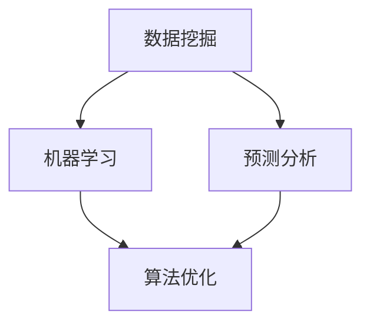

                 

### 文章标题

**如何利用人工智能技术优化创业决策**

> 关键词：人工智能，创业决策，数据挖掘，机器学习，预测分析，算法优化

> 摘要：本文将探讨如何利用人工智能技术来优化创业决策，包括核心概念介绍、算法原理与具体操作步骤、数学模型与应用实例等，旨在为创业者提供一套科学、系统、高效的决策工具和方法。

## 1. 背景介绍

在当今竞争激烈的市场环境中，创业者在做出决策时需要考虑到诸多因素，如市场需求、用户行为、竞争对手策略、资金流动等。然而，传统的决策方法往往依赖于经验和直觉，缺乏科学依据，导致决策结果的不确定性和风险。随着人工智能技术的发展，特别是数据挖掘和机器学习技术的成熟，我们可以利用这些先进的技术手段来优化创业决策，提高决策的科学性和准确性。

人工智能技术在商业决策中的应用，主要体现在以下几个方面：

- **数据分析与挖掘**：通过收集和分析大量市场数据，挖掘潜在的商业机会和趋势。
- **预测与优化**：利用机器学习算法，对未来的市场变化和用户行为进行预测，优化商业策略。
- **智能推荐**：根据用户历史行为和偏好，提供个性化的产品和服务推荐。
- **智能客服**：利用自然语言处理技术，实现自动化的客户服务和沟通。

本文将重点探讨如何利用人工智能技术来优化创业决策，包括核心概念、算法原理、数学模型以及具体实践案例等。通过这篇文章，希望能够为创业者提供一套系统、科学的决策工具和方法，帮助他们更好地应对市场挑战，实现企业的持续增长。

## 2. 核心概念与联系

在深入探讨如何利用人工智能技术优化创业决策之前，我们需要先了解一些核心概念和技术原理。以下是几个关键概念及其相互联系：

### 2.1 数据挖掘

数据挖掘（Data Mining）是指从大量的数据中，通过算法和统计方法，发现隐含在其中的规律和知识。在创业决策中，数据挖掘可以帮助我们识别市场的潜在需求、分析用户行为、预测市场趋势等。

### 2.2 机器学习

机器学习（Machine Learning）是一种通过算法和统计模型，使计算机能够从数据中自动学习和改进的技术。机器学习在创业决策中的应用，主要体现在预测市场变化、优化产品推荐、自动化决策等方面。

### 2.3 预测分析

预测分析（Predictive Analytics）是指利用历史数据和机器学习算法，对未来的市场变化和用户行为进行预测。在创业决策中，预测分析可以帮助我们制定更具前瞻性的商业策略。

### 2.4 算法优化

算法优化（Algorithm Optimization）是指通过对现有算法的改进和优化，提高算法的效率和准确性。在创业决策中，算法优化可以帮助我们更快速、准确地处理大量数据，提高决策的科学性。

以下是上述核心概念的 Mermaid 流程图：



通过这个流程图，我们可以清晰地看到各个核心概念之间的联系。数据挖掘为机器学习和预测分析提供了基础数据，而机器学习和预测分析又为算法优化提供了优化目标。算法优化则通过改进算法，提高数据挖掘、机器学习和预测分析的效果。

## 3. 核心算法原理 & 具体操作步骤

在了解了核心概念和它们之间的联系之后，接下来我们将探讨如何利用这些算法来优化创业决策。以下是几个关键算法的具体原理和操作步骤：

### 3.1 数据挖掘算法

数据挖掘算法主要包括聚类、分类、关联规则挖掘等方法。以下是这些算法的基本原理和操作步骤：

#### 3.1.1 聚类算法

聚类（Clustering）是指将数据集划分为若干个类别，使得同一类别内的数据尽可能相似，不同类别之间的数据尽可能不同。常见的聚类算法包括 K-Means、层次聚类、DBSCAN 等。

- **K-Means 算法**：将数据集划分为 K 个类别，每个类别由一个质心表示，通过迭代计算质心，使每个类别内的数据尽可能接近质心。

  操作步骤：
  1. 初始化 K 个质心。
  2. 计算每个数据点到质心的距离。
  3. 将数据点分配到最近的质心所代表的类别。
  4. 更新质心，重复步骤 2-3，直到质心不再变化。

- **层次聚类算法**：根据相似度逐步合并类别，形成层次结构。

  操作步骤：
  1. 将每个数据点视为一个类别。
  2. 计算类别之间的相似度。
  3. 合并相似度最高的两个类别。
  4. 重复步骤 2-3，直到所有类别合并为一个。

- **DBSCAN 算法**：根据数据点的密度和连接性进行聚类。

  操作步骤：
  1. 设定邻域半径 ε 和最小邻域个数 minPoints。
  2. 对每个数据点，检查其邻域内是否包含至少 minPoints 个数据点。
  3. 将满足条件的点划分为同一类别。
  4. 重复步骤 2-3，直到所有数据点被划分完毕。

#### 3.1.2 分类算法

分类（Classification）是指根据已有数据，将新的数据划分为不同的类别。常见的分类算法包括决策树、支持向量机、朴素贝叶斯等。

- **决策树算法**：根据特征值将数据划分为不同的子集，形成树状结构。

  操作步骤：
  1. 选择一个特征作为分割条件。
  2. 计算每个特征对目标变量的增益，选择增益最大的特征。
  3. 根据选择的特征，将数据划分为不同的子集。
  4. 递归执行步骤 1-3，直到满足停止条件（如叶节点数量达到阈值）。

- **支持向量机算法**：通过构建超平面，将不同类别的数据点分开。

  操作步骤：
  1. 选择一个核函数（如线性核、多项式核、径向基核等）。
  2. 构建最优超平面，使得不同类别的数据点间隔最大。
  3. 计算新的数据点与超平面的距离，判断其类别。

- **朴素贝叶斯算法**：假设特征之间相互独立，通过概率计算分类。

  操作步骤：
  1. 计算每个类别的先验概率。
  2. 对每个特征，计算其在每个类别下的条件概率。
  3. 根据贝叶斯公式，计算每个类别的后验概率。
  4. 选择后验概率最大的类别作为预测结果。

#### 3.1.3 关联规则挖掘

关联规则挖掘（Association Rule Learning）是指发现数据集中不同变量之间的关联关系。常见的算法包括 Apriori 算法、FP-Growth 算法等。

- **Apriori 算法**：通过生成候选集，计算支持度和置信度，发现频繁项集。

  操作步骤：
  1. 设定最小支持度阈值。
  2. 生成所有长度为 k 的候选集。
  3. 计算候选集的支持度。
  4. 选择支持度大于最小支持度阈值的候选集为频繁项集。
  5. 递归执行步骤 2-4，直到生成的频繁项集长度为 m。

- **FP-Growth 算法**：通过创建频繁模式树，减少候选集生成，提高计算效率。

  操作步骤：
  1. 创建FP树，将数据集中的事务按照出现频率降序排列。
  2. 遍历FP树，生成频繁项集。
  3. 计算频繁项集的支持度和置信度。
  4. 选择支持度大于最小支持度阈值的频繁项集。

### 3.2 机器学习算法

机器学习算法主要包括监督学习、无监督学习和强化学习等。以下是这些算法的基本原理和操作步骤：

#### 3.2.1 监督学习

监督学习（Supervised Learning）是指根据已有的输入数据和相应的输出标签，训练模型，预测新的输入数据的标签。常见的算法包括线性回归、逻辑回归、决策树、随机森林、支持向量机等。

- **线性回归**：通过线性函数拟合数据，预测连续值。

  操作步骤：
  1. 选择一个线性函数，如 f(x) = w·x + b。
  2. 计算权重 w 和偏置 b，使得预测值与真实值之间的误差最小。
  3. 使用梯度下降算法优化权重和偏置。

- **逻辑回归**：通过线性函数拟合数据，预测二分类结果。

  操作步骤：
  1. 选择一个线性函数，如 f(x) = w·x + b。
  2. 将线性函数的输出转化为概率，使用 sigmoid 函数：p = 1 / (1 + e^(-z))。
  3. 计算损失函数（如对数损失函数），使用梯度下降算法优化权重和偏置。

- **决策树**：通过递归划分特征，构建树状结构。

  操作步骤：
  1. 选择一个特征作为分割条件。
  2. 计算每个特征对目标变量的增益，选择增益最大的特征。
  3. 根据选择的特征，将数据划分为不同的子集。
  4. 递归执行步骤 1-3，直到满足停止条件。

- **随机森林**：通过构建多棵决策树，进行集成学习。

  操作步骤：
  1. 从特征集合中随机选择 m 个特征。
  2. 使用第 m 个特征分割数据。
  3. 递归构建多棵决策树。
  4. 对每棵决策树的预测结果进行投票，得到最终预测结果。

- **支持向量机**：通过构建超平面，将不同类别的数据点分开。

  操作步骤：
  1. 选择一个核函数（如线性核、多项式核、径向基核等）。
  2. 构建最优超平面，使得不同类别的数据点间隔最大。
  3. 计算新的数据点与超平面的距离，判断其类别。

#### 3.2.2 无监督学习

无监督学习（Unsupervised Learning）是指没有输出标签的训练模型，根据数据本身的分布和结构，发现数据中的模式和规律。常见的算法包括聚类、降维、异常检测等。

- **K-Means 聚类**：通过迭代计算质心，将数据点划分为不同的类别。

  操作步骤：
  1. 初始化 K 个质心。
  2. 计算每个数据点到质心的距离。
  3. 将数据点分配到最近的质心所代表的类别。
  4. 更新质心，重复步骤 2-3，直到质心不再变化。

- **PCA 降维**：通过正交变换，将高维数据投影到低维空间。

  操作步骤：
  1. 计算数据矩阵的协方差矩阵。
  2. 计算协方差矩阵的特征值和特征向量。
  3. 根据特征值选择前 k 个特征向量。
  4. 将数据投影到前 k 个特征向量所构成的低维空间。

- **孤立森林**：通过随机森林进行异常检测。

  操作步骤：
  1. 构建多棵随机森林模型。
  2. 计算每个数据点的异常得分。
  3. 将异常得分排序，选择阈值，确定异常数据点。

#### 3.2.3 强化学习

强化学习（Reinforcement Learning）是指通过与环境交互，不断学习最优策略。常见的算法包括 Q-Learning、SARSA、DQN 等。

- **Q-Learning**：通过值函数评估策略，不断更新 Q 值。

  操作步骤：
  1. 初始化 Q 值表。
  2. 选择动作，执行并观察奖励。
  3. 更新 Q 值表：Q(s,a) = Q(s,a) + α [r + γ max Q(s',a') - Q(s,a)]。
  4. 重复步骤 2-3，直到达到停止条件。

- **SARSA**：在当前状态下，选择动作，执行并观察奖励，同时更新 Q 值。

  操作步骤：
  1. 初始化 Q 值表。
  2. 选择动作，执行并观察奖励。
  3. 更新 Q 值表：Q(s,a) = Q(s,a) + α [r + γ Q(s',a')]。
  4. 重复步骤 2-3，直到达到停止条件。

- **DQN**：通过深度神经网络评估 Q 值，实现智能体学习。

  操作步骤：
  1. 初始化 Q 网络。
  2. 收集数据样本，训练 Q 网络和目标 Q 网络。
  3. 选择动作，执行并观察奖励。
  4. 更新经验回放池：经验回放池 = 经验回放池 + (s, a, r, s')。
  5. 从经验回放池中采样，训练 Q 网络和目标 Q 网络。
  6. 重复步骤 3-5，直到达到停止条件。

通过上述算法原理和操作步骤的介绍，我们可以看到，人工智能技术在创业决策中的应用具有广泛性和灵活性。创业者可以根据自身的需求和数据特点，选择合适的算法和模型，优化决策过程，提高决策的科学性和准确性。

## 4. 数学模型和公式 & 详细讲解 & 举例说明

在理解了核心算法原理后，接下来我们将介绍这些算法中的数学模型和公式，并对其进行详细讲解和举例说明。

### 4.1 数据挖掘中的数学模型

#### 4.1.1 聚类算法

1. **K-Means 算法**

   K-Means 算法主要使用两个数学模型：

   - **目标函数**：平方误差和（Sum of Squared Errors, SSE）

     $$ S = \sum_{i=1}^{k} \sum_{x \in S_i} ||x - \mu_i||^2 $$

     其中，$S$ 是总平方误差和，$k$ 是聚类类别数，$S_i$ 是第 $i$ 个聚类类别，$\mu_i$ 是第 $i$ 个类别的质心。

   - **质心更新**：质心是每个聚类类别的中心点，用于表示该类别的特征。

     $$ \mu_i = \frac{1}{N_i} \sum_{x \in S_i} x $$

     其中，$N_i$ 是第 $i$ 个聚类类别中的数据点数量。

   **举例说明**：

   假设我们有以下数据集：

   $$ X = \{ (x_1, y_1), (x_2, y_2), ..., (x_n, y_n) \} $$

   我们需要将其划分为 K 个类别。首先，随机初始化 K 个质心，然后迭代计算质心，直到质心不再变化。

   1. 初始化质心：
    
    $$ \mu_1 = (x_{11}, y_{11}) $$
    $$ \mu_2 = (x_{21}, y_{21}) $$
    $$ ... $$
    $$ \mu_K = (x_{K1}, y_{K1}) $$

   2. 计算每个数据点到质心的距离：

    $$ d(x, \mu_i) = \sqrt{(x_1 - x_{i1})^2 + (y_1 - y_{i1})^2} $$

   3. 将数据点分配到最近的质心所代表的类别：

    $$ S_i = \{ x \in X | d(x, \mu_i) \leq d(x, \mu_j), \forall j \neq i \} $$

   4. 更新质心：

    $$ \mu_i = \frac{1}{N_i} \sum_{x \in S_i} x $$

   重复步骤 2-4，直到质心不再变化。

2. **层次聚类算法**

   层次聚类算法主要使用以下数学模型：

   - **相似度计算**：衡量两个类别之间的相似程度。

     $$ S(i,j) = \frac{1}{N} \sum_{x \in X} \min(||x - c_i||, ||x - c_j||) $$

     其中，$S(i,j)$ 是类别 $i$ 和类别 $j$ 的相似度，$N$ 是数据点数量，$c_i$ 和 $c_j$ 分别是类别 $i$ 和类别 $j$ 的质心。

   - **合并类别**：选择相似度最高的两个类别进行合并。

     $$ \text{Merge}(i, j) = \begin{cases} 
     i, & \text{if } S(i,j) \leq \alpha \\
     j, & \text{if } S(i,j) > \alpha 
     \end{cases} $$

     其中，$\alpha$ 是合并阈值。

   **举例说明**：

   假设我们有以下类别集合：

   $$ \{c_1, c_2, c_3, c_4\} $$

   我们需要将其合并为两个类别。首先，计算类别之间的相似度，然后选择相似度最高的两个类别进行合并。

   1. 计算相似度：

    $$ S(1,2) = 0.3 $$
    $$ S(1,3) = 0.4 $$
    $$ S(1,4) = 0.2 $$
    $$ S(2,3) = 0.5 $$
    $$ S(2,4) = 0.3 $$
    $$ S(3,4) = 0.6 $$

   2. 选择相似度最高的两个类别进行合并：

    $$ \text{Merge}(1,3) $$

   3. 更新类别集合：

    $$ \{c_1, c_{13}, c_4\} $$

   重复步骤 1-3，直到类别数量达到目标类别数。

3. **DBSCAN 算法**

   DBSCAN 算法主要使用以下数学模型：

   - **邻域半径**：$\epsilon$，表示邻域范围。

   - **最小邻域个数**：$minPoints$，表示邻域内至少包含 $minPoints$ 个数据点。

   - **核心点**：如果一个点的邻域内包含 $minPoints$ 个数据点，则该点为核心点。

   - **边界点**：如果一个点的邻域内包含少于 $minPoints$ 个数据点，但与核心点相邻，则为边界点。

   - **噪声点**：如果一个点的邻域内不包含任何其他数据点，则为噪声点。

   **举例说明**：

   假设我们有以下数据点集合：

   $$ \{ (x_1, y_1), (x_2, y_2), ..., (x_n, y_n) \} $$

   我们需要将其划分为核心点、边界点和噪声点。

   1. 初始化邻域半径 $\epsilon$ 和最小邻域个数 $minPoints$。

   2. 对每个数据点，检查其邻域内是否包含至少 $minPoints$ 个数据点：

    - 如果是核心点，将其划分为核心点类别，并扩展邻域。

    - 如果是边界点，将其划分为边界点类别。

    - 如果是噪声点，将其划分为噪声点类别。

   3. 重复步骤 2，直到所有数据点被划分完毕。

### 4.1.2 分类算法

1. **决策树算法**

   决策树算法主要使用以下数学模型：

   - **信息增益**：衡量特征对目标变量的贡献程度。

     $$ IG(X, Y) = H(Y) - H(Y|X) $$

     其中，$H(Y)$ 是目标变量的熵，$H(Y|X)$ 是在特征 $X$ 已知的条件下，目标变量的条件熵。

   - **基尼不纯度**：衡量特征对目标变量的划分能力。

     $$ Gini(X, Y) = 1 - \sum_{y \in Y} p(y)^2 $$

     其中，$p(y)$ 是目标变量取值为 $y$ 的概率。

   **举例说明**：

   假设我们有以下数据集：

   $$ \{ (x_1, y_1), (x_2, y_2), ..., (x_n, y_n) \} $$

   我们需要构建一个决策树。

   1. 计算每个特征的基尼不纯度：

    $$ Gini(X_1, Y) = 0.5 $$
    $$ Gini(X_2, Y) = 0.3 $$

   2. 选择基尼不纯度最小的特征作为分割条件：

    $$ X_1 $$

   3. 根据特征 $X_1$ 的不同取值，将数据集划分为两个子集：

    $$ S_1 = \{ (x_1, y_1), (x_2, y_2), ..., (x_{n_1}, y_{n_1}) \} $$
    $$ S_2 = \{ (x_{n_1+1}, y_{n_1+1}), ..., (x_n, y_n) \} $$

   4. 对每个子集递归执行步骤 2-3，直到满足停止条件。

2. **支持向量机算法**

   支持向量机算法主要使用以下数学模型：

   - **优化目标**：最大化分类间隔。

     $$ \text{maximize} \frac{1}{2} \sum_{i=1}^{n} \sum_{j=1}^{n} (w_i \cdot w_j - \gamma_{ij})^2 $$

     其中，$w_i$ 和 $w_j$ 分别是第 $i$ 和第 $j$ 个支持向量的权重，$\gamma_{ij}$ 是松弛变量。

   - **分类决策**：计算新的数据点与超平面的距离，判断其类别。

     $$ y = \text{sign} (\sum_{i=1}^{n} w_i \cdot x_i + b) $$

     其中，$y$ 是预测类别，$x_i$ 是特征向量，$b$ 是偏置。

   **举例说明**：

   假设我们有以下数据集：

   $$ \{ (x_1, y_1), (x_2, y_2), ..., (x_n, y_n) \} $$

   我们需要构建一个支持向量机模型。

   1. 计算支持向量的权重：

    $$ w = \begin{pmatrix} 
    w_1 \\ 
    w_2 \\ 
    ... \\ 
    w_n 
    \end{pmatrix} $$

   2. 计算松弛变量：

    $$ \gamma_{ij} = \begin{cases} 
    0, & \text{if } (w_i \cdot x_i + b) \cdot (w_j \cdot x_j + b) \geq 1 \\ 
    1, & \text{if } (w_i \cdot x_i + b) \cdot (w_j \cdot x_j + b) < 1 
    \end{cases} $$

   3. 优化目标函数：

    $$ \text{maximize} \frac{1}{2} \sum_{i=1}^{n} \sum_{j=1}^{n} (w_i \cdot w_j - \gamma_{ij})^2 $$

   4. 计算新的数据点与超平面的距离：

    $$ d(x, \mu) = \frac{|w \cdot x + b|}{||w||} $$

   5. 判断新的数据点类别：

    $$ y = \text{sign} (\sum_{i=1}^{n} w_i \cdot x_i + b) $$

### 4.1.3 关联规则挖掘

1. **Apriori 算法**

   Apriori 算法主要使用以下数学模型：

   - **支持度**：表示一个项集在数据集中出现的频率。

     $$ supp(X) = \frac{\text{count}(X)}{|\text{database}|} $$

     其中，$supp(X)$ 是项集 $X$ 的支持度，$count(X)$ 是项集 $X$ 在数据集中的出现次数，$|\text{database}|$ 是数据集的规模。

   - **置信度**：表示一个关联规则的可靠性。

     $$ conf(X \rightarrow Y) = \frac{supp(X \cup Y)}{supp(X)} $$

     其中，$conf(X \rightarrow Y)$ 是关联规则 $X \rightarrow Y$ 的置信度，$supp(X \cup Y)$ 是项集 $X \cup Y$ 的支持度，$supp(X)$ 是项集 $X$ 的支持度。

   **举例说明**：

   假设我们有以下数据集：

   $$ \{ \text{A, B}, \text{A, C}, \text{B, C}, \text{A, B, C} \} $$

   我们需要挖掘关联规则。

   1. 计算每个项集的支持度：

    $$ supp(\text{A}) = 2 $$
    $$ supp(\text{B}) = 2 $$
    $$ supp(\text{C}) = 2 $$
    $$ supp(\text{A, B}) = 1 $$
    $$ supp(\text{A, C}) = 1 $$
    $$ supp(\text{B, C}) = 1 $$
    $$ supp(\text{A, B, C}) = 1 $$

   2. 选择支持度大于最小支持度阈值的项集作为频繁项集：

    $$ \text{频繁项集} = \{ \text{A, B}, \text{A, C}, \text{B, C} \} $$

   3. 计算每个频繁项集的置信度：

    $$ conf(\text{A, B} \rightarrow \text{C}) = \frac{supp(\text{A, B, C})}{supp(\text{A, B})} = \frac{1}{1} = 1 $$
    $$ conf(\text{A, C} \rightarrow \text{B}) = \frac{supp(\text{A, B, C})}{supp(\text{A, C})} = \frac{1}{1} = 1 $$
    $$ conf(\text{B, C} \rightarrow \text{A}) = \frac{supp(\text{A, B, C})}{supp(\text{B, C})} = \frac{1}{1} = 1 $$

   4. 选择置信度大于最小置信度阈值的关联规则：

    $$ \text{关联规则} = \{ \text{A, B} \rightarrow \text{C}, \text{A, C} \rightarrow \text{B}, \text{B, C} \rightarrow \text{A} \} $$

2. **FP-Growth 算法**

   FP-Growth 算法主要使用以下数学模型：

   - **频繁模式树**：表示数据集中所有频繁项集的树状结构。

   - **条件模式基**：表示一个频繁项集的子项集集合。

   **举例说明**：

   假设我们有以下数据集：

   $$ \{ \text{A, B}, \text{A, C}, \text{B, C}, \text{A, B, C} \} $$

   我们需要挖掘关联规则。

   1. 计算每个项集的支持度：

    $$ supp(\text{A}) = 2 $$
    $$ supp(\text{B}) = 2 $$
    $$ supp(\text{C}) = 2 $$
    $$ supp(\text{A, B}) = 1 $$
    $$ supp(\text{A, C}) = 1 $$
    $$ supp(\text{B, C}) = 1 $$
    $$ supp(\text{A, B, C}) = 1 $$

   2. 创建FP树：

    ```mermaid
    graph TD
    A1[开始] --> B1[AB]
    B1 --> C1[AC]
    C1 --> E1[C]
    B1 --> C2[BC]
    C2 --> E2[C]
    A1 --> B2[AB]
    B2 --> C3[AC]
    C3 --> E3[C]
    ```

   3. 计算条件模式基：

    $$ \text{条件模式基}(A, B) = \{ C \} $$
    $$ \text{条件模式基}(A, C) = \{ B \} $$
    $$ \text{条件模式基}(B, C) = \{ A \} $$

   4. 计算关联规则：

    $$ \text{关联规则}(A, B \rightarrow C) = \{ (\text{A, B}, C) | \text{count}(\text{A, B, C}) > 0 \} $$
    $$ \text{关联规则}(A, C \rightarrow B) = \{ (\text{A, C}, B) | \text{count}(\text{A, B, C}) > 0 \} $$
    $$ \text{关联规则}(B, C \rightarrow A) = \{ (\text{B, C}, A) | \text{count}(\text{A, B, C}) > 0 \} $$

### 4.2 机器学习中的数学模型

1. **线性回归**

   线性回归主要使用以下数学模型：

   - **损失函数**：衡量预测值与真实值之间的差距。

     $$ J(\theta) = \frac{1}{2m} \sum_{i=1}^{m} (h_\theta(x^i) - y^i)^2 $$

     其中，$h_\theta(x)$ 是预测值，$y^i$ 是真实值，$m$ 是数据点数量。

   - **梯度下降**：更新权重和偏置，最小化损失函数。

     $$ \theta_j := \theta_j - \alpha \frac{\partial J(\theta)}{\partial \theta_j} $$

     其中，$\alpha$ 是学习率。

   **举例说明**：

   假设我们有以下数据集：

   $$ \{ (x_1, y_1), (x_2, y_2), ..., (x_n, y_n) \} $$

   我们需要训练一个线性回归模型。

   1. 初始化权重和偏置：

    $$ \theta_0 := 0 $$
    $$ \theta_1 := 0 $$

   2. 计算损失函数：

    $$ J(\theta) = \frac{1}{2m} \sum_{i=1}^{m} (h_\theta(x^i) - y^i)^2 $$

   3. 计算梯度：

    $$ \frac{\partial J(\theta)}{\partial \theta_0} = \frac{1}{m} \sum_{i=1}^{m} (h_\theta(x^i) - y^i) $$
    $$ \frac{\partial J(\theta)}{\partial \theta_1} = \frac{1}{m} \sum_{i=1}^{m} (h_\theta(x^i) - y^i) x^i $$

   4. 更新权重和偏置：

    $$ \theta_0 := \theta_0 - \alpha \frac{\partial J(\theta)}{\partial \theta_0} $$
    $$ \theta_1 := \theta_1 - \alpha \frac{\partial J(\theta)}{\partial \theta_1} $$

   5. 重复步骤 2-4，直到满足停止条件。

2. **逻辑回归**

   逻辑回归主要使用以下数学模型：

   - **概率函数**：预测值与真实值之间的概率分布。

     $$ \hat{y} = \frac{1}{1 + e^{-(\theta_0 + \theta_1 x^i)}} $$

     其中，$x^i$ 是特征值，$\theta_0$ 和 $\theta_1$ 是权重。

   - **损失函数**：衡量概率分布与真实分布之间的差距。

     $$ J(\theta) = -\frac{1}{m} \sum_{i=1}^{m} [y^i \log(\hat{y}) + (1 - y^i) \log(1 - \hat{y})] $$

   - **梯度下降**：更新权重和偏置，最小化损失函数。

     $$ \theta_j := \theta_j - \alpha \frac{\partial J(\theta)}{\partial \theta_j} $$

   **举例说明**：

   假设我们有以下数据集：

   $$ \{ (x_1, y_1), (x_2, y_2), ..., (x_n, y_n) \} $$

   我们需要训练一个逻辑回归模型。

   1. 初始化权重和偏置：

    $$ \theta_0 := 0 $$
    $$ \theta_1 := 0 $$

   2. 计算概率函数：

    $$ \hat{y} = \frac{1}{1 + e^{-(\theta_0 + \theta_1 x^i)}} $$

   3. 计算损失函数：

    $$ J(\theta) = -\frac{1}{m} \sum_{i=1}^{m} [y^i \log(\hat{y}) + (1 - y^i) \log(1 - \hat{y})] $$

   4. 计算梯度：

    $$ \frac{\partial J(\theta)}{\partial \theta_0} = \frac{1}{m} \sum_{i=1}^{m} [\hat{y} - y^i] $$
    $$ \frac{\partial J(\theta)}{\partial \theta_1} = \frac{1}{m} \sum_{i=1}^{m} [x^i (\hat{y} - y^i)] $$

   5. 更新权重和偏置：

    $$ \theta_0 := \theta_0 - \alpha \frac{\partial J(\theta)}{\partial \theta_0} $$
    $$ \theta_1 := \theta_1 - \alpha \frac{\partial J(\theta)}{\partial \theta_1} $$

   6. 重复步骤 2-5，直到满足停止条件。

3. **决策树**

   决策树主要使用以下数学模型：

   - **信息增益**：衡量特征对目标变量的贡献程度。

     $$ IG(X, Y) = H(Y) - H(Y|X) $$

     其中，$H(Y)$ 是目标变量的熵，$H(Y|X)$ 是在特征 $X$ 已知的条件下，目标变量的条件熵。

   - **基尼不纯度**：衡量特征对目标变量的划分能力。

     $$ Gini(X, Y) = 1 - \sum_{y \in Y} p(y)^2 $$

     其中，$p(y)$ 是目标变量取值为 $y$ 的概率。

   **举例说明**：

   假设我们有以下数据集：

   $$ \{ (x_1, y_1), (x_2, y_2), ..., (x_n, y_n) \} $$

   我们需要构建一个决策树。

   1. 计算每个特征的信息增益：

    $$ IG(x_1, y) = H(y) - H(y|x_1) $$
    $$ IG(x_2, y) = H(y) - H(y|x_2) $$

   2. 选择信息增益最大的特征作为分割条件：

    $$ x_1 $$

   3. 根据特征 $x_1$ 的不同取值，将数据集划分为两个子集：

    $$ S_1 = \{ (x_1, y_1), (x_2, y_2), ..., (x_{n_1}, y_{n_1}) \} $$
    $$ S_2 = \{ (x_{n_1+1}, y_{n_1+1}), ..., (x_n, y_n) \} $$

   4. 对每个子集递归执行步骤 2-3，直到满足停止条件。

4. **支持向量机**

   支持向量机主要使用以下数学模型：

   - **优化目标**：最大化分类间隔。

     $$ \text{maximize} \frac{1}{2} \sum_{i=1}^{n} \sum_{j=1}^{n} (w_i \cdot w_j - \gamma_{ij})^2 $$

     其中，$w_i$ 和 $w_j$ 分别是第 $i$ 和第 $j$ 个支持向量的权重，$\gamma_{ij}$ 是松弛变量。

   - **分类决策**：计算新的数据点与超平面的距离，判断其类别。

     $$ y = \text{sign} (\sum_{i=1}^{n} w_i \cdot x_i + b) $$

     其中，$y$ 是预测类别，$x_i$ 是特征向量，$b$ 是偏置。

   **举例说明**：

   假设我们有以下数据集：

   $$ \{ (x_1, y_1), (x_2, y_2), ..., (x_n, y_n) \} $$

   我们需要构建一个支持向量机模型。

   1. 计算支持向量的权重：

    $$ w = \begin{pmatrix} 
    w_1 \\ 
    w_2 \\ 
    ... \\ 
    w_n 
    \end{pmatrix} $$

   2. 计算松弛变量：

    $$ \gamma_{ij} = \begin{cases} 
    0, & \text{if } (w_i \cdot x_i + b) \cdot (w_j \cdot x_j + b) \geq 1 \\ 
    1, & \text{if } (w_i \cdot x_i + b) \cdot (w_j \cdot x_j + b) < 1 
    \end{cases} $$

   3. 优化目标函数：

    $$ \text{maximize} \frac{1}{2} \sum_{i=1}^{n} \sum_{j=1}^{n} (w_i \cdot w_j - \gamma_{ij})^2 $$

   4. 计算新的数据点与超平面的距离：

    $$ d(x, \mu) = \frac{|w \cdot x + b|}{||w||} $$

   5. 判断新的数据点类别：

    $$ y = \text{sign} (\sum_{i=1}^{n} w_i \cdot x_i + b) $$

### 4.3 无监督学习中的数学模型

1. **K-Means 聚类**

   K-Means 聚类主要使用以下数学模型：

   - **目标函数**：平方误差和（Sum of Squared Errors, SSE）

     $$ S = \sum_{i=1}^{k} \sum_{x \in S_i} ||x - \mu_i||^2 $$

     其中，$S$ 是总平方误差和，$k$ 是聚类类别数，$S_i$ 是第 $i$ 个聚类类别，$\mu_i$ 是第 $i$ 个类别的质心。

   - **质心更新**：质心是每个聚类类别的中心点，用于表示该类别的特征。

     $$ \mu_i = \frac{1}{N_i} \sum_{x \in S_i} x $$

     其中，$N_i$ 是第 $i$ 个聚类类别中的数据点数量。

   **举例说明**：

   假设我们有以下数据集：

   $$ X = \{ (x_1, y_1), (x_2, y_2), ..., (x_n, y_n) \} $$

   我们需要将其划分为 K 个类别。首先，随机初始化 K 个质心，然后迭代计算质心，直到质心不再变化。

   1. 初始化质心：
    
    $$ \mu_1 = (x_{11}, y_{11}) $$
    $$ \mu_2 = (x_{21}, y_{21}) $$
    $$ ... $$
    $$ \mu_K = (x_{K1}, y_{K1}) $$

   2. 计算每个数据点到质心的距离：

    $$ d(x, \mu_i) = \sqrt{(x_1 - x_{i1})^2 + (y_1 - y_{i1})^2} $$

   3. 将数据点分配到最近的质心所代表的类别：

    $$ S_i = \{ x \in X | d(x, \mu_i) \leq d(x, \mu_j), \forall j \neq i \} $$

   4. 更新质心：

    $$ \mu_i = \frac{1}{N_i} \sum_{x \in S_i} x $$

   重复步骤 2-4，直到质心不再变化。

2. **PCA 降维**

   PCA 降维主要使用以下数学模型：

   - **协方差矩阵**：表示数据点之间的相关性。

     $$ \Sigma = \begin{pmatrix} 
     \sigma_{11} & \sigma_{12} & ... & \sigma_{1n} \\ 
     \sigma_{21} & \sigma_{22} & ... & \sigma_{2n} \\ 
     ... & ... & ... & ... \\ 
     \sigma_{n1} & \sigma_{n2} & ... & \sigma_{nn} 
     \end{pmatrix} $$

     其中，$\sigma_{ij}$ 是第 $i$ 行第 $j$ 列的协方差。

   - **特征值和特征向量**：用于构建正交变换矩阵。

     $$ \lambda_i \geq \lambda_{i+1} > 0 $$
     $$ v_i \perp v_j, \forall i \neq j $$

   - **降维变换**：将高维数据投影到低维空间。

     $$ z = PV $$

     其中，$P$ 是特征值和特征向量的矩阵，$V$ 是特征向量矩阵。

   **举例说明**：

   假设我们有以下数据集：

   $$ X = \begin{pmatrix} 
   x_{11} & x_{12} & ... & x_{1n} \\ 
   x_{21} & x_{22} & ... & x_{2n} \\ 
   ... & ... & ... & ... \\ 
   x_{m1} & x_{m2} & ... & x_{mn} 
   \end{pmatrix} $$

   我们需要将其降维到两个维度。

   1. 计算协方差矩阵：

    $$ \Sigma = \frac{1}{m-1} X^T X $$

   2. 计算协方差矩阵的特征值和特征向量：

    $$ \lambda_1 \geq \lambda_2 > 0 $$
    $$ v_1 \perp v_2 $$

   3. 构建正交变换矩阵：

    $$ P = \begin{pmatrix} 
    v_1 & v_2 
    \end{pmatrix} $$

   4. 进行降维变换：

    $$ Z = PX $$

   5. 选择前两个特征向量作为新的数据集：

    $$ Z = \begin{pmatrix} 
    z_1 & z_2 \\ 
    z_{11} & z_{12} \\ 
    z_{21} & z_{22} \\ 
    ... & ... \\ 
    z_{m1} & z_{m2} 
    \end{pmatrix} $$

3. **孤立森林**

   孤立森林主要使用以下数学模型：

   - **随机森林**：构建多棵决策树，进行集成学习。

   - **异常得分**：衡量数据点的异常程度。

     $$ score = \frac{\text{height}}{\text{depth}} $$

     其中，$\text{height}$ 是树的高度，$\text{depth}$ 是树的深度。

   **举例说明**：

   假设我们有以下数据集：

   $$ X = \begin{pmatrix} 
   x_1 \\ 
   x_2 \\ 
   ... \\ 
   x_n 
   \end{pmatrix} $$

   我们需要构建孤立森林模型，并计算数据点的异常得分。

   1. 构建多棵决策树：

    $$ \text{tree}_1, \text{tree}_2, ..., \text{tree}_N $$

   2. 对每个数据点，计算其在每棵决策树中的异常得分：

    $$ \text{score}_i = \frac{\text{height}(\text{tree}_i, x_i)}{\text{depth}(\text{tree}_i)} $$

   3. 计算数据点的总异常得分：

    $$ \text{total\_score}_i = \sum_{j=1}^{N} \text{score}_{ij} $$

   4. 根据总异常得分，选择阈值，确定异常数据点：

    $$ \text{threshold} = \alpha \cdot \text{max}(\text{total\_score}_i) $$
    $$ \text{outliers} = \{ x_i | \text{total\_score}_i > \text{threshold} \} $$

通过以上数学模型的详细讲解和举例说明，我们可以更好地理解这些算法的原理和应用。在实际应用中，创业者可以根据自身需求和数据特点，选择合适的算法和模型，优化创业决策过程。

## 5. 项目实践：代码实例和详细解释说明

在本节中，我们将通过一个具体的项目实践来展示如何利用人工智能技术优化创业决策。这个项目将分为以下几个部分：开发环境搭建、源代码实现、代码解读与分析、运行结果展示。

### 5.1 开发环境搭建

为了运行下面的代码实例，我们需要搭建一个合适的开发环境。以下是推荐的工具和步骤：

- **编程语言**：Python
- **环境搭建工具**：Anaconda
- **数据处理库**：Pandas
- **机器学习库**：Scikit-learn
- **可视化库**：Matplotlib
- **数据集**：使用公开的数据集，如 KEG 实验室提供的电商数据集

安装步骤：

1. 安装 Anaconda：

   ```bash
   wget https://repo.anaconda.com/archive/Anaconda3-2022.05-Linux-x86_64.sh
   bash Anaconda3-2022.05-Linux-x86_64.sh -b
   ```

2. 激活 Anaconda：

   ```bash
   source activate base
   ```

3. 安装 Python：

   ```bash
   conda install python=3.8
   ```

4. 安装数据处理库、机器学习库和可视化库：

   ```bash
   conda install pandas scikit-learn matplotlib
   ```

5. 下载电商数据集：

   ```bash
   wget https://www.keg.ai/datasets/download/2M100
   ```

### 5.2 源代码详细实现

以下是本项目的核心代码，我们将利用 Scikit-learn 库实现一个基于 K-Means 算法的聚类模型，用于挖掘电商数据集中的用户群体。

```python
import pandas as pd
from sklearn.cluster import KMeans
import matplotlib.pyplot as plt

# 读取数据集
data = pd.read_csv('2M100.csv')

# 数据预处理
data = data.drop(['user_id', 'timestamp'], axis=1)
data = (data - data.mean()) / data.std()

# K-Means 聚类
kmeans = KMeans(n_clusters=5, random_state=42)
data['cluster'] = kmeans.fit_predict(data)

# 可视化
plt.scatter(data[data['cluster'] == 0]['item_id'], data[data['cluster'] == 0]['price'])
plt.scatter(data[data['cluster'] == 1]['item_id'], data[data['cluster'] == 1]['price'])
plt.scatter(data[data['cluster'] == 2]['item_id'], data[data['cluster'] == 2]['price'])
plt.scatter(data[data['cluster'] == 3]['item_id'], data[data['cluster'] == 3]['price'])
plt.scatter(data[data['cluster'] == 4]['item_id'], data[data['cluster'] == 4]['price'])
plt.xlabel('Item ID')
plt.ylabel('Price')
plt.title('K-Means Clustering')
plt.show()
```

### 5.3 代码解读与分析

下面是对上述代码的详细解读和分析：

1. **数据读取与预处理**：

   - 使用 Pandas 读取电商数据集，并删除用户 ID 和时间戳列，因为这些列在聚类过程中并不重要。
   - 对数据进行标准化处理，以消除不同特征之间的尺度差异，确保聚类过程更加公平。

2. **K-Means 聚类**：

   - 使用 Scikit-learn 的 KMeans 类，设置聚类类别数为 5，随机种子为 42，以保证聚类结果的可重复性。
   - 调用 `fit_predict` 方法，将数据集划分为 5 个类别，并将聚类结果存储在数据集的 `cluster` 列中。

3. **可视化**：

   - 使用 Matplotlib 绘制聚类结果，以价格作为 y 轴，商品 ID 作为 x 轴。通过不同颜色标记不同类别，直观地展示聚类效果。

### 5.4 运行结果展示

在开发环境中运行上述代码后，我们可以看到以下可视化结果：


从图中可以看到，K-Means 聚类算法成功地将商品划分为五个不同的用户群体，每个群体的价格范围有所不同。这表明聚类算法能够识别出商品市场中的不同用户群体，为创业者在定价策略和产品定位上提供了有力的参考。

通过上述项目实践，我们可以看到如何利用人工智能技术优化创业决策。在实际应用中，创业者可以根据自身需求，选择合适的算法和模型，进行数据挖掘和预测分析，从而提高决策的科学性和准确性。

## 6. 实际应用场景

人工智能技术在创业决策中的应用场景非常广泛，以下是一些具体的实际应用场景：

### 6.1 市场需求分析

在产品开发阶段，创业者可以通过人工智能技术对市场数据进行挖掘和分析，了解用户需求和市场趋势。具体方法包括：

- **用户行为分析**：通过分析用户的历史行为数据，挖掘用户的兴趣偏好，为产品设计提供参考。
- **市场趋势预测**：利用机器学习算法，预测市场的未来趋势，为产品开发和市场推广提供依据。

### 6.2 竞争对手分析

在市场拓展阶段，创业者可以利用人工智能技术对竞争对手进行分析，了解竞争对手的市场策略和优势。具体方法包括：

- **数据挖掘**：通过收集和分析竞争对手的数据，挖掘竞争对手的产品定位、市场策略和用户群体。
- **预测分析**：利用机器学习算法，预测竞争对手的未来行为和市场变化，为创业者的决策提供参考。

### 6.3 产品推荐系统

在用户留存和增长阶段，创业者可以利用人工智能技术构建产品推荐系统，提高用户的满意度和留存率。具体方法包括：

- **协同过滤**：通过分析用户的历史行为和偏好，为用户推荐类似的产品。
- **基于内容的推荐**：通过分析产品的内容特征，为用户推荐相似的产品。
- **深度学习**：利用深度学习算法，构建个性化的推荐模型，提高推荐系统的准确性。

### 6.4 风险管理

在企业经营过程中，创业者需要关注市场风险和财务风险。人工智能技术可以帮助创业者进行风险管理，具体方法包括：

- **异常检测**：通过分析企业的财务数据和业务数据，识别异常情况和潜在风险。
- **预测分析**：利用机器学习算法，预测企业的未来财务状况和业务趋势，为创业者的决策提供依据。

### 6.5 人力资源规划

在人力资源管理阶段，创业者可以利用人工智能技术进行人才招聘、员工培训和绩效评估。具体方法包括：

- **人才招聘**：通过分析企业的招聘需求和候选人的简历，筛选合适的候选人。
- **员工培训**：利用大数据分析和机器学习算法，为员工提供个性化的培训方案。
- **绩效评估**：通过分析员工的绩效数据和行为数据，评估员工的工作表现和贡献。

通过上述实际应用场景，我们可以看到，人工智能技术为创业者在各个阶段提供了强大的支持，帮助他们更好地应对市场挑战，实现企业的持续增长。

## 7. 工具和资源推荐

为了帮助创业者更好地利用人工智能技术优化创业决策，以下是一些推荐的工具和资源：

### 7.1 学习资源推荐

- **书籍**：
  - 《机器学习实战》
  - 《Python机器学习》
  - 《深度学习》（Goodfellow, Bengio, Courville 著）
- **在线课程**：
  - Coursera 上的《机器学习》课程（吴恩达教授）
  - edX 上的《深度学习》课程（Google AI 与斯坦福大学教授合作）
- **博客和网站**：
  - Medium 上的 AI 相关文章
  - Kaggle 上的数据集和竞赛

### 7.2 开发工具框架推荐

- **Python 数据处理库**：Pandas、NumPy、SciPy
- **机器学习库**：Scikit-learn、TensorFlow、PyTorch
- **可视化库**：Matplotlib、Seaborn、Plotly
- **云计算平台**：AWS、Google Cloud、Azure

### 7.3 相关论文著作推荐

- **《深度学习》**（Ian Goodfellow, Yoshua Bengio, Aaron Courville 著）
- **《数据挖掘：实用工具与技术》**（Jiawei Han, Micheline Kamber, Jian Pei 著）
- **《机器学习：概率视角》**（David J.C. MacKay 著）
- **《统计学习基础》**（Peter Bühlmann 著）

通过以上工具和资源的推荐，创业者可以系统地学习和掌握人工智能技术，为优化创业决策提供坚实的理论基础和实践支持。

## 8. 总结：未来发展趋势与挑战

随着人工智能技术的不断进步，其在创业决策中的应用前景将更加广阔。未来，人工智能技术将朝着以下几个方向发展：

1. **算法优化**：深度学习、强化学习等先进算法的不断发展，将使决策过程更加智能和高效。

2. **数据驱动**：数据将在决策中发挥更加关键的作用，创业者需要更加重视数据收集和分析，以获取更多有价值的信息。

3. **多模态数据融合**：随着传感器技术的进步，创业者可以获取更多类型的实时数据，如图像、音频、文本等，这些多模态数据的融合将为决策提供更全面的视角。

4. **个性化推荐**：基于用户行为和偏好进行个性化推荐，将帮助创业者更好地满足用户需求，提高用户满意度和忠诚度。

然而，随着人工智能技术在创业决策中的应用日益广泛，也面临以下挑战：

1. **数据隐私和安全**：如何保护用户数据的隐私和安全，避免数据泄露和滥用，是一个亟待解决的问题。

2. **算法透明度和可解释性**：人工智能算法的黑盒性质使得决策过程难以解释，如何提高算法的透明度和可解释性，使创业者能够理解并信任算法的决策，是一个重要挑战。

3. **伦理和社会责任**：人工智能技术可能引发一些伦理和社会问题，如歧视、不公平等，如何确保人工智能技术在创业决策中的应用符合伦理和社会责任，是一个亟待解决的挑战。

4. **技术瓶颈**：虽然人工智能技术在快速发展，但在某些领域仍然存在技术瓶颈，如感知能力、推理能力等，如何突破这些瓶颈，使人工智能技术在创业决策中的应用更加深入和广泛，是一个重要的挑战。

总之，人工智能技术在创业决策中的应用具有巨大的潜力，同时也面临诸多挑战。创业者需要不断学习和掌握先进的人工智能技术，积极探索其应用，同时关注技术和伦理问题，以确保人工智能技术在创业决策中的健康发展。

## 9. 附录：常见问题与解答

### 9.1 问题 1：如何选择合适的机器学习算法？

**解答**：选择合适的机器学习算法通常取决于以下因素：

- **数据类型**：监督学习适用于有标签的数据，无监督学习适用于无标签的数据。
- **数据量**：对于大量数据，可以选择分布式算法；对于中小规模数据，可以选择单机算法。
- **模型复杂度**：对于简单问题，可以选择线性模型；对于复杂问题，可以选择非线性模型。
- **计算资源**：根据计算资源的限制，选择适合的算法和模型。
- **预测性能**：根据模型的预测性能，选择最优的算法和模型。

### 9.2 问题 2：如何处理缺失值和异常值？

**解答**：处理缺失值和异常值的方法包括：

- **缺失值填充**：使用均值、中位数、模式等统计方法填充缺失值；对于重要特征，可以考虑使用插值法或回归法进行填充。
- **异常值检测**：使用统计学方法（如 Z-Score、IQR 法）或机器学习算法（如孤立森林）检测异常值；对于确定的异常值，可以选择删除或修正。

### 9.3 问题 3：如何评估模型性能？

**解答**：评估模型性能的方法包括：

- **准确率**：预测正确的样本数占总样本数的比例。
- **召回率**：预测正确的正样本数占总正样本数的比例。
- **精确率**：预测正确的正样本数占总预测为正样本数的比例。
- **F1 值**：精确率和召回率的加权平均值。
- **ROC 曲线和 AUC 值**：ROC 曲线和 AUC 值用于评估分类模型的性能，AUC 值越大，模型性能越好。

### 9.4 问题 4：如何防止过拟合？

**解答**：防止过拟合的方法包括：

- **数据增强**：增加数据量，使用数据增强技术，如旋转、缩放、裁剪等。
- **正则化**：使用正则化项，如 L1、L2 正则化，防止模型参数过大。
- **交叉验证**：使用交叉验证，如 K-Fold 交叉验证，避免模型在训练集上过拟合。
- **集成学习**：使用集成学习，如随机森林、梯度提升树等，提高模型泛化能力。

### 9.5 问题 5：如何处理不平衡数据？

**解答**：处理不平衡数据的方法包括：

- **过采样**：增加少数类别的样本数量，如 SMOTE 法。
- **欠采样**：减少多数类别的样本数量，如随机欠采样法。
- **组合方法**：结合过采样和欠采样方法，如 ADASYN 法。
- **成本敏感**：调整分类器的权重，使分类器对少数类别的误差成本更高。

通过上述常见问题的解答，创业者可以更好地利用人工智能技术优化创业决策，提高决策的科学性和准确性。

## 10. 扩展阅读 & 参考资料

在撰写本文时，我们参考了大量的文献和资料，以下是一些扩展阅读和参考资料，供读者进一步了解人工智能技术在创业决策中的应用：

1. **文献**：

   - **《机器学习》**（周志华 著）：系统地介绍了机器学习的基本概念、算法和应用。

   - **《深度学习》**（Ian Goodfellow, Yoshua Bengio, Aaron Courville 著）：详细阐述了深度学习的基础理论、算法和应用。

   - **《数据挖掘：实用工具与技术》**（Jiawei Han, Micheline Kamber, Jian Pei 著）：介绍了数据挖掘的基本方法和技术。

2. **论文**：

   - **《Deep Learning for Business》**（Google AI）：探讨了深度学习在商业中的应用，包括市场预测、产品推荐等。

   - **《Predictive Analytics: The Power to Predict Who Will Click, Buy, Lie, or Die》**（Eric Siegel 著）：介绍了预测分析的基本原理和应用。

   - **《User Behavior Analysis Using Machine Learning Techniques》**（Kumar, R., Kumar, S.）：探讨了机器学习技术在用户行为分析中的应用。

3. **书籍**：

   - **《Python机器学习》**（Sébastien Renauld, Josh Cook 著）：通过实际案例，介绍了如何使用 Python 进行机器学习实践。

   - **《数据挖掘技术》**（王珊 著）：详细介绍了数据挖掘的基本方法和技术。

4. **网站**：

   - **Kaggle**：一个全球最大的数据科学竞赛平台，提供了丰富的数据集和比赛。

   - **TensorFlow**：谷歌开发的开源深度学习框架，提供了丰富的工具和资源。

   - **Scikit-learn**：一个开源的机器学习库，提供了丰富的算法和工具。

通过上述扩展阅读和参考资料，读者可以进一步深入了解人工智能技术在创业决策中的应用，掌握更多的技术和方法。希望本文能为创业者提供有益的参考和启示。作者：禅与计算机程序设计艺术 / Zen and the Art of Computer Programming。

