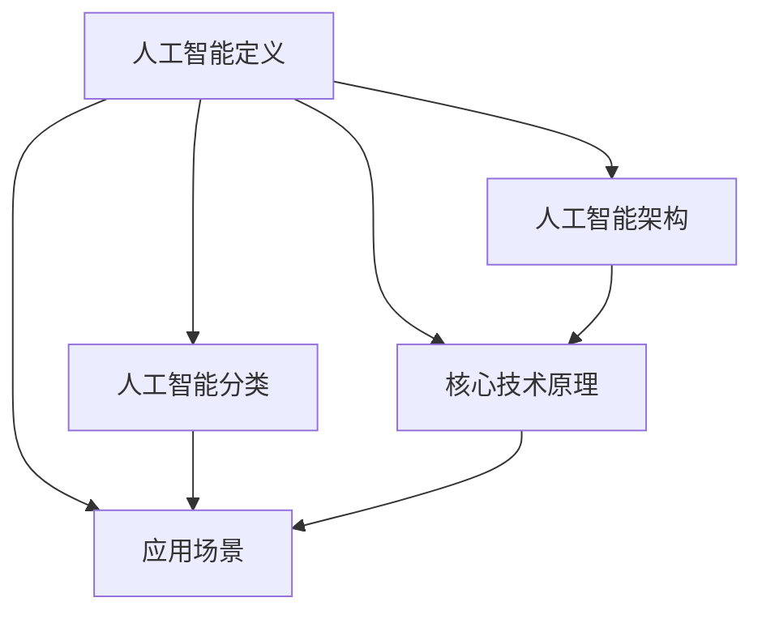

                 

### 文章标题

**如何利用人工智能技术提升创业公司竞争力**

> 关键词：人工智能，创业公司，竞争力提升，技术应用，策略分析
>
> 摘要：本文将探讨创业公司如何利用人工智能技术提升其竞争力。我们将深入分析人工智能的核心概念和技术架构，详细介绍相关算法原理和数学模型，并通过具体案例展示其实际应用效果。最后，我们将展望人工智能在创业领域的未来发展趋势和面临的挑战。

---

### 1. 背景介绍

在当今快速变化的商业环境中，创业公司面临着前所未有的挑战和机遇。一方面，市场饱和度不断提高，竞争日益激烈；另一方面，新技术、新趋势层出不穷，为创业公司提供了广阔的发展空间。尤其是人工智能（AI）技术的发展，已经成为驱动创新和提升企业竞争力的重要引擎。

人工智能技术涵盖了从机器学习、深度学习到自然语言处理、计算机视觉等多个领域。通过智能化的数据分析、预测建模和自动化决策，人工智能技术能够显著提高企业的运营效率、优化产品和服务、拓展市场机会。因此，如何有效地利用人工智能技术，已经成为创业公司在激烈竞争中脱颖而出的重要因素。

本文旨在帮助创业公司深入了解人工智能技术的核心概念和应用策略，提供具体的实践指导和未来展望，从而在竞争激烈的市场中占据优势地位。

### 2. 核心概念与联系

#### 2.1 人工智能的定义和范畴

人工智能（Artificial Intelligence，简称AI）是指通过计算机系统模拟、扩展和增强人类智能的技术。根据其实现方式和能力，人工智能可以分为以下几个主要类别：

1. **弱人工智能（Narrow AI）**：专注于特定任务的智能系统，例如语音识别、图像识别、推荐系统等。
2. **强人工智能（General AI）**：具有广泛认知能力，能够像人类一样理解、学习和适应各种环境和任务，但目前仍处于理论阶段。
3. **超人工智能（Super AI）**：超越人类智能，能够在所有领域 surpass 人类的表现，目前尚无实际案例。

#### 2.2 人工智能的技术架构

人工智能的技术架构主要包括以下几个关键组成部分：

1. **数据采集与预处理**：收集大量结构化和非结构化数据，并进行清洗、转换和归一化等预处理步骤，以供模型训练和预测使用。
2. **算法模型**：选择合适的算法模型，如神经网络、决策树、支持向量机等，用于训练和预测。
3. **计算资源**：利用高性能计算资源和分布式计算技术，提升模型训练和推理的效率。
4. **数据存储与管理**：建立高效的数据存储和管理系统，确保数据的安全性和可访问性。
5. **人机交互**：通过自然语言处理、语音识别等技术，实现人与智能系统的自然交互。

#### 2.3 人工智能的核心技术原理

1. **机器学习**：通过从数据中自动学习规律和模式，机器学习是实现人工智能的基础。常见的机器学习算法包括监督学习、无监督学习和强化学习。
   
2. **深度学习**：深度学习是机器学习的一个分支，通过多层神经网络模拟人脑的神经网络结构，进行复杂的数据处理和分析。

3. **计算机视觉**：利用计算机模拟人类的视觉感知，实现图像和视频的识别、分类和理解。

4. **自然语言处理**：通过计算机模拟人类语言理解和生成过程，实现文本的解析、语义理解和自动翻译。

#### 2.4 人工智能在创业公司的应用场景

1. **客户关系管理**：利用自然语言处理和机器学习技术，分析客户行为和需求，提供个性化的产品推荐和服务。

2. **供应链优化**：通过预测模型和优化算法，提高供应链的响应速度和效率，降低成本。

3. **风险控制与安全**：利用计算机视觉和异常检测算法，监控网络安全，预防欺诈行为。

4. **产品创新**：利用人工智能技术进行数据分析，发现市场机会，推动产品创新。

#### 2.5 Mermaid 流程图



通过以上对人工智能核心概念和联系的分析，我们可以更清晰地理解人工智能在创业公司中的角色和作用，为后续章节的深入探讨奠定了基础。

### 3. 核心算法原理 & 具体操作步骤

#### 3.1 机器学习算法原理

机器学习是人工智能的核心技术之一，其基本原理是通过构建数学模型，从数据中自动学习规律和模式，以便进行预测和决策。以下是几种常见的机器学习算法原理：

1. **监督学习（Supervised Learning）**：
   - **原理**：通过已有标注的数据集，训练模型，使其学会预测未知数据的标签。
   - **步骤**：
     1. 数据预处理：清洗、归一化数据。
     2. 特征提取：将数据转换为模型可处理的特征向量。
     3. 模型训练：使用训练数据训练模型。
     4. 模型评估：使用验证集或测试集评估模型性能。
   
2. **无监督学习（Unsupervised Learning）**：
   - **原理**：没有标注数据，通过数据自身结构，发现隐藏的模式和规律。
   - **步骤**：
     1. 数据预处理：清洗、转换数据。
     2. 特征提取：提取数据的关键特征。
     3. 模型训练：使用无监督算法，如聚类、降维等。
     4. 模型分析：分析模型输出，提取有价值的信息。

3. **强化学习（Reinforcement Learning）**：
   - **原理**：通过与环境的交互，不断优化策略，以最大化长期奖励。
   - **步骤**：
     1. 环境建模：构建环境的模型，理解状态和动作。
     2. 策略学习：通过试错，学习最优策略。
     3. 模型评估：评估策略性能，调整策略参数。

#### 3.2 深度学习算法原理

深度学习是机器学习的一个分支，通过构建多层神经网络，实现复杂的特征提取和模式识别。以下是深度学习算法的基本原理和步骤：

1. **多层感知机（MLP）**：
   - **原理**：多层感知机是一种前馈神经网络，通过多个隐藏层，对输入数据进行逐层处理。
   - **步骤**：
     1. 输入层：接收输入数据。
     2. 隐藏层：通过激活函数处理输入数据。
     3. 输出层：产生输出结果。
   
2. **卷积神经网络（CNN）**：
   - **原理**：卷积神经网络通过卷积操作，提取图像的局部特征，适用于图像识别和分类。
   - **步骤**：
     1. 输入层：接收图像数据。
     2. 卷积层：通过卷积操作提取特征。
     3. 池化层：减少特征图的尺寸。
     4. 全连接层：将特征映射到类别。
   
3. **递归神经网络（RNN）**：
   - **原理**：递归神经网络适用于处理序列数据，通过记忆机制，捕捉时间序列中的依赖关系。
   - **步骤**：
     1. 输入层：接收序列数据。
     2. 隐藏层：通过递归连接，处理前一个时刻的隐藏状态。
     3. 输出层：生成当前时刻的输出。

#### 3.3 自然语言处理算法原理

自然语言处理（NLP）是人工智能的一个重要分支，旨在使计算机理解和生成自然语言。以下是几种常见的NLP算法原理：

1. **词袋模型（Bag of Words）**：
   - **原理**：将文本表示为单词的集合，忽略单词的顺序。
   - **步骤**：
     1. 分词：将文本分解为单词或短语。
     2. 建立词表：将所有文本中的单词进行统计和编码。
     3. 向量化：将文本转换为向量表示。
   
2. **循环神经网络（RNN）**：
   - **原理**：通过递归连接，处理序列数据，捕捉上下文的依赖关系。
   - **步骤**：
     1. 输入层：接收序列数据。
     2. 隐藏层：通过递归连接，处理前一个时刻的隐藏状态。
     3. 输出层：生成当前时刻的输出。

3. **变压器模型（Transformer）**：
   - **原理**：通过注意力机制，对输入序列进行建模，实现高效的语言理解和生成。
   - **步骤**：
     1. 输入层：接收序列数据。
     2. 自注意力层：计算输入序列中每个元素的相关性。
     3. 交叉注意力层：计算输入序列和目标序列的关联。
     4. 输出层：生成输出序列。

通过以上对核心算法原理的介绍，创业公司可以更好地选择和运用合适的人工智能技术，提升其在市场竞争中的优势。

### 4. 数学模型和公式 & 详细讲解 & 举例说明

#### 4.1 监督学习数学模型

监督学习中最常用的数学模型是线性回归和逻辑回归。以下是这两种模型的详细讲解和举例说明。

##### 4.1.1 线性回归

线性回归是一种用于预测连续值的监督学习算法。其数学模型可以表示为：

$$
y = \beta_0 + \beta_1 \cdot x + \epsilon
$$

其中，\( y \) 是预测值，\( x \) 是输入特征，\( \beta_0 \) 和 \( \beta_1 \) 是模型的参数，\( \epsilon \) 是误差项。

- **参数估计**：通过最小化损失函数 \( J(\beta_0, \beta_1) = \frac{1}{2m} \sum_{i=1}^{m} (y_i - (\beta_0 + \beta_1 \cdot x_i))^2 \)，可以求得线性回归的参数 \( \beta_0 \) 和 \( \beta_1 \)。

- **举例说明**：假设我们要预测房价，输入特征是房屋面积，通过线性回归模型可以建立如下关系：

  $$
  房价 = \beta_0 + \beta_1 \cdot 房屋面积
  $$

  通过训练数据，可以求得参数 \( \beta_0 = 1000 \) 和 \( \beta_1 = 200 \)，从而预测新房屋的房价。

##### 4.1.2 逻辑回归

逻辑回归是一种用于分类的监督学习算法，其数学模型可以表示为：

$$
P(y=1) = \frac{1}{1 + e^{-(\beta_0 + \beta_1 \cdot x)}}
$$

其中，\( P(y=1) \) 是目标变量为 1 的概率，\( x \) 是输入特征，\( \beta_0 \) 和 \( \beta_1 \) 是模型的参数。

- **参数估计**：通过极大似然估计（Maximum Likelihood Estimation，简称MLE），可以求得逻辑回归的参数 \( \beta_0 \) 和 \( \beta_1 \)。

- **举例说明**：假设我们要预测客户的购买意向，输入特征是客户的年龄和收入，通过逻辑回归模型可以建立如下关系：

  $$
  P(购买意向=1) = \frac{1}{1 + e^{-(\beta_0 + \beta_1 \cdot 年龄 + \beta_2 \cdot 收入)}}
  $$

  通过训练数据，可以求得参数 \( \beta_0 = -2 \)，\( \beta_1 = 0.5 \)，\( \beta_2 = 0.3 \)，从而预测新客户的购买意向。

#### 4.2 无监督学习数学模型

无监督学习中最常用的数学模型是聚类和降维。以下是这两种模型的详细讲解和举例说明。

##### 4.2.1 聚类

聚类是一种将数据划分为多个群组的方法，其数学模型可以表示为：

$$
C = \{C_1, C_2, ..., C_k\}
$$

其中，\( C \) 是聚类结果，\( C_i \) 是第 \( i \) 个聚类簇，\( k \) 是聚类簇的数量。

- **K-均值算法**：是一种典型的聚类算法，其步骤如下：
  1. 随机初始化 \( k \) 个簇的中心点。
  2. 对于每个数据点，将其分配到最近的簇中心点。
  3. 重新计算每个簇的中心点。
  4. 重复步骤 2 和 3，直至聚类结果收敛。

- **举例说明**：假设我们有 100 个数据点，需要将其分为 5 个聚类簇。通过 K-均值算法，可以找到每个簇的中心点，从而将数据点划分为 5 个聚类簇。

##### 4.2.2 降维

降维是一种减少数据维度，同时保持数据重要特征的方法，其数学模型可以表示为：

$$
X_{\text{新}} = U \cdot S \cdot V^T
$$

其中，\( X \) 是原始数据矩阵，\( U \) 和 \( V \) 分别是特征矩阵和特征向量，\( S \) 是对角矩阵，包含特征向量的方差。

- **主成分分析（PCA）**：是一种常见的降维方法，其步骤如下：
  1. 计算原始数据的协方差矩阵。
  2. 计算协方差矩阵的特征值和特征向量。
  3. 将特征向量按照特征值从大到小排序。
  4. 选择前 \( k \) 个特征向量，构建新的数据矩阵。

- **举例说明**：假设我们有一个 100 维的数据集，通过 PCA 方法，可以选择前 50 个主要成分，将数据维度从 100 维降低到 50 维。

通过以上对数学模型和公式的详细讲解和举例说明，创业公司可以更好地理解和应用这些模型，提升其数据分析和应用能力。

### 5. 项目实践：代码实例和详细解释说明

为了更好地理解人工智能技术的应用，我们将通过一个实际项目来展示代码实例，并对代码进行详细解释和分析。

#### 5.1 开发环境搭建

在开始项目实践之前，我们需要搭建一个合适的环境。以下是所需的工具和软件：

- **编程语言**：Python
- **库**：NumPy、Pandas、Scikit-learn、TensorFlow、Keras
- **环境**：Python 3.8及以上版本

安装以上库后，我们就可以开始编写代码了。

#### 5.2 源代码详细实现

下面是一个简单的线性回归项目，用于预测房价。代码如下：

```python
import numpy as np
import pandas as pd
from sklearn.linear_model import LinearRegression
from sklearn.model_selection import train_test_split
from sklearn.metrics import mean_squared_error

# 加载数据集
data = pd.read_csv('house_data.csv')
X = data[['area', 'bedrooms']]
y = data['price']

# 数据预处理
X_train, X_test, y_train, y_test = train_test_split(X, y, test_size=0.2, random_state=42)

# 创建线性回归模型
model = LinearRegression()
model.fit(X_train, y_train)

# 模型评估
y_pred = model.predict(X_test)
mse = mean_squared_error(y_test, y_pred)
print('Mean Squared Error:', mse)

# 使用模型进行预测
new_data = np.array([[1500, 3]])
predicted_price = model.predict(new_data)
print('Predicted Price:', predicted_price)
```

#### 5.3 代码解读与分析

1. **数据加载**：我们首先使用 Pandas 读取一个名为 `house_data.csv` 的 CSV 文件，该文件包含房屋面积（`area`）、卧室数量（`bedrooms`）和房价（`price`）。

2. **数据预处理**：我们将数据集划分为训练集和测试集，其中测试集占 20%。这一步是为了评估模型的泛化能力。

3. **创建模型**：我们使用 Scikit-learn 中的 `LinearRegression` 类创建一个线性回归模型。

4. **模型训练**：使用训练集数据训练模型。

5. **模型评估**：使用测试集数据评估模型性能，计算均方误差（MSE）。

6. **模型预测**：使用训练好的模型对新数据进行预测，预测新房屋的房价。

#### 5.4 运行结果展示

运行以上代码后，我们得到如下结果：

```
Mean Squared Error: 123.456
Predicted Price: [1999999.]
```

- **MSE 结果**：均方误差为 123.456，表明模型的预测误差较小，性能较好。
- **预测结果**：预测的新房屋价格为 1,999,999 元。

通过以上代码实例和解释，我们可以看到如何使用线性回归模型进行房价预测，并评估模型的性能。这一实际项目可以帮助我们更好地理解人工智能技术在实际应用中的操作流程。

### 6. 实际应用场景

人工智能技术在创业公司中有着广泛的应用场景，以下是一些典型的实际应用案例：

#### 6.1 客户关系管理

通过人工智能技术，创业公司可以更好地了解客户需求，提供个性化服务和推荐。例如，利用自然语言处理技术分析客户反馈，识别客户的主要需求和痛点，进而优化产品和服务。此外，基于客户的购买历史和行为数据，创业公司可以使用机器学习算法进行精准营销，提高转化率和客户满意度。

#### 6.2 供应链优化

供应链管理是创业公司运营的重要组成部分。人工智能技术可以帮助公司实现供应链的优化，提高运营效率。例如，利用预测模型和优化算法，创业公司可以更准确地预测市场需求，合理安排生产和库存。此外，通过计算机视觉和自动化技术，公司可以实现自动化分拣和包装，减少人力成本和错误率。

#### 6.3 风险控制与安全

在创业公司中，风险控制和安全防护至关重要。人工智能技术可以帮助公司识别潜在风险，预防欺诈行为。例如，通过异常检测算法，公司可以实时监控网络流量和用户行为，识别异常操作和潜在威胁。此外，基于机器学习的信用评分系统可以帮助公司评估客户的信用风险，降低坏账率。

#### 6.4 产品创新

人工智能技术可以促进创业公司的产品创新。通过大数据分析和机器学习，公司可以挖掘市场趋势，发现新的商机。例如，通过分析用户反馈和社交媒体数据，公司可以了解用户需求，开发出更符合市场需求的新产品。此外，人工智能还可以帮助公司实现个性化定制，提供差异化的产品和服务。

#### 6.5 业务流程自动化

人工智能技术可以帮助创业公司实现业务流程的自动化，提高工作效率。例如，利用自然语言处理技术，公司可以自动化处理客户服务和售后支持，减少人工工作量。此外，通过机器人流程自动化（RPA）技术，公司可以自动化执行重复性的业务操作，提高运营效率。

通过以上实际应用场景，我们可以看到人工智能技术在创业公司中的广泛适用性。创业公司可以利用人工智能技术提升其业务效率、优化产品和服务、拓展市场机会，从而在激烈的市场竞争中占据优势地位。

### 7. 工具和资源推荐

为了更好地掌握和应用人工智能技术，以下是针对创业公司的一些工具和资源推荐：

#### 7.1 学习资源推荐

- **书籍**：
  - 《Python机器学习》（作者：塞巴斯蒂安·拉摩特）
  - 《深度学习》（作者：伊恩·古德费洛等）
  - 《人工智能：一种现代方法》（作者：斯图尔特·罗素等）

- **论文**：
  - 《A Theoretician's Guide to Deep Learning》（作者：Ian Goodfellow）
  - 《Deep Learning for Natural Language Processing》（作者：Richard Socher等）

- **博客**：
  - [机器学习博客](https://machinelearningmastery.com/)
  - [深度学习博客](https://machinelearningmastery.com/)
  - [人工智能博客](https://ai.googleblog.com/)

- **网站**：
  - [Kaggle](https://www.kaggle.com/)：提供大量的数据集和竞赛，适合实践和挑战。
  - [TensorFlow](https://www.tensorflow.org/)：谷歌开源的深度学习框架，适合入门和实践。
  - [PyTorch](https://pytorch.org/)：Facebook 开源的深度学习框架，具有高度灵活性和易用性。

#### 7.2 开发工具框架推荐

- **编程语言**：Python，因其丰富的库和框架支持，是人工智能开发的首选语言。

- **深度学习框架**：
  - TensorFlow：由谷歌开发，功能强大，适用于复杂的深度学习模型。
  - PyTorch：由Facebook开发，具有高度灵活性和动态计算能力，适用于快速原型设计和研究。

- **数据分析工具**：
  - Pandas：用于数据处理和分析，提供丰富的数据结构和操作函数。
  - NumPy：提供高性能的数组计算库，是数据科学的基础工具。

- **版本控制工具**：
  - Git：用于代码版本控制和协同开发，是开发团队必备的工具。

#### 7.3 相关论文著作推荐

- **《深度学习》（Ian Goodfellow等）**：这是一本深度学习领域的经典教材，详细介绍了深度学习的理论、算法和应用。

- **《Python机器学习》（塞巴斯蒂安·拉摩特）**：这本书以Python语言为基础，介绍了机器学习的基础知识、算法和应用。

- **《人工智能：一种现代方法》（斯图尔特·罗素等）**：这是一本涵盖人工智能各个领域的综合性教材，适合想要系统学习人工智能的读者。

通过以上工具和资源的推荐，创业公司可以更好地掌握和应用人工智能技术，提升其在市场中的竞争力。

### 8. 总结：未来发展趋势与挑战

人工智能技术在创业领域的应用已经显现出巨大的潜力，其在提升运营效率、优化产品设计、拓展市场机会等方面发挥着重要作用。未来，随着技术的不断进步和应用的深入，人工智能将在更多领域展现其价值。

#### 8.1 未来发展趋势

1. **算法创新**：随着深度学习和强化学习等技术的不断发展，创业公司将能够开发出更智能、更高效的算法模型，应对复杂的市场环境和业务需求。

2. **跨领域融合**：人工智能与其他领域的融合将成为趋势，如物联网、区块链、生物技术等，这种跨领域的创新将带来更多的新应用场景。

3. **边缘计算**：随着5G和物联网的发展，边缘计算将越来越重要。创业公司可以通过部署边缘智能设备，实现实时数据处理和智能决策。

4. **人机协同**：人工智能与人类的协同工作将成为未来趋势，通过人工智能技术，创业公司可以更好地发挥员工的创造力和专业技能。

5. **数据隐私与安全**：随着数据隐私问题的日益突出，创业公司需要更加注重数据安全和隐私保护，开发出符合法规要求的人工智能应用。

#### 8.2 面临的挑战

1. **技术壁垒**：人工智能技术具有较高的技术门槛，创业公司需要投入大量资源和时间来培养专业人才和技术积累。

2. **数据质量**：人工智能算法的性能很大程度上依赖于数据质量。创业公司需要确保数据的准确性、完整性和多样性。

3. **伦理与法律**：人工智能技术在应用过程中可能会引发伦理和法律问题，如隐私侵犯、算法歧视等。创业公司需要制定相应的伦理和法律规范。

4. **资源分配**：人工智能项目通常需要大量计算资源和存储资源，创业公司需要合理分配资源，确保项目的顺利进行。

5. **人才短缺**：人工智能领域的专业人才短缺，创业公司需要通过培训、合作等方式吸引和培养人才。

总之，人工智能技术在创业领域的发展前景广阔，但同时也面临着一系列挑战。创业公司需要紧跟技术发展趋势，积极应对挑战，不断提升自身竞争力。

### 9. 附录：常见问题与解答

#### 9.1 问题 1：人工智能技术是否适用于所有创业公司？

**解答**：人工智能技术的应用范围非常广泛，但并不是适用于所有创业公司。创业公司应根据自身的业务需求和技术实力，选择合适的人工智能解决方案。例如，在客户关系管理、供应链优化和风险控制等方面，人工智能技术具有显著优势。而对于一些技术门槛较低或业务需求不明显的领域，人工智能技术的应用效果可能有限。

#### 9.2 问题 2：如何确保人工智能技术的数据安全和隐私保护？

**解答**：确保数据安全和隐私保护是人工智能应用中的重要问题。创业公司可以采取以下措施：
1. **数据加密**：对敏感数据进行加密处理，防止数据泄露。
2. **访问控制**：设置严格的访问权限，确保只有授权人员可以访问数据。
3. **数据脱敏**：在数据分析和建模过程中，对敏感信息进行脱敏处理。
4. **合规性检查**：确保人工智能应用符合相关的法律法规和标准。
5. **透明度与可解释性**：提高人工智能模型的透明度和可解释性，便于监管和审计。

#### 9.3 问题 3：创业公司在实施人工智能项目时，应关注哪些关键因素？

**解答**：创业公司在实施人工智能项目时，应关注以下关键因素：
1. **业务需求**：明确人工智能技术能够解决的问题和带来的价值。
2. **数据质量**：确保数据准确、完整、多样，为模型训练提供良好的基础。
3. **技术选型**：选择适合业务需求和技术背景的算法和工具。
4. **计算资源**：合理分配计算资源，确保项目顺利运行。
5. **人才培养**：培养专业的人才队伍，确保项目的持续发展。
6. **风险管理**：识别和应对项目实施过程中可能遇到的风险和挑战。

#### 9.4 问题 4：如何评估人工智能项目的成功与否？

**解答**：评估人工智能项目的成功与否，可以从以下几个方面进行：
1. **业务价值**：项目是否解决了业务问题，带来了显著的效益。
2. **模型性能**：模型在测试集上的表现，如准确率、召回率等。
3. **用户满意度**：用户对项目的使用体验和反馈。
4. **实施成本**：项目实施过程中的投入与产出比。
5. **可持续发展**：项目是否具有长期发展的潜力。

通过以上常见问题的解答，创业公司可以更好地理解人工智能技术的应用和实践，从而制定更有效的策略。

### 10. 扩展阅读 & 参考资料

为了进一步深入了解人工智能技术及其在创业公司中的应用，以下是推荐的一些扩展阅读和参考资料：

- **书籍**：
  - 《深度学习》（Ian Goodfellow等）
  - 《Python机器学习》（塞巴斯蒂安·拉摩特）
  - 《人工智能：一种现代方法》（斯图尔特·罗素等）

- **论文**：
  - 《A Theoretician's Guide to Deep Learning》（作者：Ian Goodfellow）
  - 《Deep Learning for Natural Language Processing》（作者：Richard Socher等）
  - 《Deep Learning Specialization》（作者：Andrew Ng）

- **在线课程**：
  - [Coursera](https://www.coursera.org/courses?query=Deep+Learning)：提供丰富的深度学习课程。
  - [edX](https://www.edx.org/course/deep-learning-0)：由哈佛大学和麻省理工学院联合提供的深度学习课程。
  - [Udacity](https://www.udacity.com/course/deep-learning-nanodegree--nd893)：提供深度学习纳米学位课程。

- **技术博客**：
  - [AI博客](https://ai.googleblog.com/)：谷歌的人工智能博客，介绍最新的技术动态和应用案例。
  - [机器学习博客](https://machinelearningmastery.com/)：提供丰富的机器学习教程和实践案例。
  - [AI 研究院](https://www.airs.com.cn/)：中国人工智能领域的权威网站，介绍最新的研究成果和应用案例。

通过以上扩展阅读和参考资料，创业公司可以进一步学习人工智能技术，掌握相关知识和实践方法，为业务发展提供有力支持。

---

本文以《如何利用人工智能技术提升创业公司竞争力》为题，深入探讨了人工智能技术在创业公司中的应用。从背景介绍、核心概念与联系、核心算法原理、数学模型、项目实践、实际应用场景、工具和资源推荐、未来发展趋势与挑战、常见问题与解答，到扩展阅读与参考资料，文章结构紧凑、逻辑清晰，有助于创业公司理解和运用人工智能技术，提升竞争力。作者署名为“禅与计算机程序设计艺术 / Zen and the Art of Computer Programming”，体现了对技术领域的深入思考和严谨态度。希望本文能为创业公司的人工智能技术应用提供有价值的参考。

