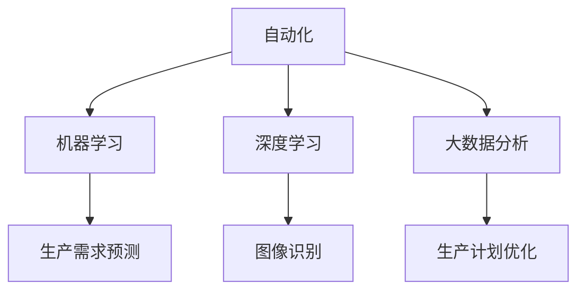

                 

### 如何利用人工智能提高生产效率

随着人工智能技术的迅猛发展，其在各行各业中的应用也日益广泛。本文将探讨如何利用人工智能（AI）来提高生产效率，并提供一些实用的方法和案例。

### 关键词

- 人工智能
- 生产效率
- 自动化
- 机器学习
- 深度学习
- 大数据分析

### 摘要

本文将首先介绍人工智能的基本概念和其在生产中的应用。接着，我们将讨论如何通过自动化、机器学习和深度学习等技术手段来提高生产效率。随后，我们将通过具体案例来说明这些技术如何在实际生产中发挥作用。最后，我们将总结人工智能在未来生产中的发展趋势和挑战。

### 1. 背景介绍

#### 1.1 人工智能的定义和基本概念

人工智能（Artificial Intelligence，简称AI）是指计算机系统模拟、扩展和辅助人类智能的能力。它包括多个子领域，如机器学习、自然语言处理、计算机视觉、自动化等。

#### 1.2 人工智能在工业生产中的应用现状

近年来，人工智能在工业生产中的应用日益广泛，例如：

- 自动化生产线的构建
- 机器人的广泛应用
- 生产数据的实时分析和预测
- 质量检测和故障诊断

#### 1.3 人工智能提高生产效率的意义

随着市场竞争的加剧，提高生产效率已成为企业获取竞争优势的关键。人工智能技术的应用可以帮助企业实现以下目标：

- 减少人力成本
- 提高生产质量
- 减少生产周期
- 提高资源利用率

### 2. 核心概念与联系

#### 2.1 自动化

自动化是指通过机器或系统代替人力完成某些工作。在工业生产中，自动化技术可以帮助实现生产线的自动化运行，减少人力投入，提高生产效率。

#### 2.2 机器学习

机器学习是一种通过数据训练计算机模型来完成任务的技术。在工业生产中，机器学习可以用于预测生产需求、优化生产流程等。

#### 2.3 深度学习

深度学习是机器学习的一个分支，通过模拟人脑神经网络的结构和功能来实现对数据的分析和处理。在工业生产中，深度学习可以用于图像识别、语音识别等。

#### 2.4 大数据分析

大数据分析是指对大量数据进行分析和处理，以发现数据中的规律和趋势。在工业生产中，大数据分析可以帮助企业优化生产计划、提高生产效率等。

### Mermaid 流程图



### 3. 核心算法原理 & 具体操作步骤

#### 3.1 自动化

自动化技术的核心是控制系统。具体操作步骤如下：

1. 设计生产线流程图
2. 选择合适的自动化设备（如机器人、自动化流水线等）
3. 编写控制程序
4. 进行系统调试和测试

#### 3.2 机器学习

机器学习技术的核心是训练模型。具体操作步骤如下：

1. 收集生产数据
2. 预处理数据
3. 选择合适的机器学习算法（如线性回归、决策树等）
4. 训练模型
5. 验证模型效果
6. 应用模型进行预测和优化

#### 3.3 深度学习

深度学习技术的核心是构建神经网络。具体操作步骤如下：

1. 收集图像数据
2. 预处理数据
3. 构建神经网络结构
4. 训练神经网络
5. 验证模型效果
6. 应用模型进行图像识别

#### 3.4 大数据分析

大数据分析技术的核心是数据挖掘。具体操作步骤如下：

1. 收集生产数据
2. 预处理数据
3. 选择合适的数据挖掘算法（如聚类、关联规则等）
4. 分析数据，提取规律和趋势
5. 应用分析结果优化生产计划

### 4. 数学模型和公式 & 详细讲解 & 举例说明

#### 4.1 自动化

假设有一个自动化生产线，其生产效率与机器的利用率有关。我们可以使用以下公式来表示：

\[ \text{生产效率} = \text{机器利用率} \times \text{工人效率} \]

其中，机器利用率和工人效率均为百分比。

#### 4.2 机器学习

假设我们要用机器学习模型预测生产需求，可以使用以下公式：

\[ y = \beta_0 + \beta_1 x_1 + \beta_2 x_2 + ... + \beta_n x_n \]

其中，\( y \) 为预测值，\( x_1, x_2, ..., x_n \) 为输入特征，\( \beta_0, \beta_1, ..., \beta_n \) 为模型参数。

#### 4.3 深度学习

假设我们要用深度学习模型进行图像识别，可以使用以下公式：

\[ y = f(z) \]

其中，\( y \) 为输出结果，\( z \) 为输入特征，\( f \) 为激活函数。

#### 4.4 大数据分析

假设我们要用大数据分析方法进行生产计划优化，可以使用以下公式：

\[ \text{生产计划} = \text{当前库存} + \text{未来需求预测} - \text{当前生产量} \]

其中，当前库存、未来需求预测和当前生产量均为已知数据。

### 5. 项目实践：代码实例和详细解释说明

#### 5.1 开发环境搭建

假设我们要使用 Python 编写一个自动化生产线的控制程序。首先，我们需要安装 Python 和相关库。

```bash
pip install numpy pandas sklearn matplotlib
```

#### 5.2 源代码详细实现

以下是一个简单的自动化生产线控制程序的示例：

```python
import numpy as np
import pandas as pd
from sklearn.linear_model import LinearRegression

# 收集生产数据
data = pd.DataFrame({
    '机器利用率': [0.8, 0.9, 0.85, 0.75],
    '工人效率': [0.9, 0.85, 0.8, 0.75],
    '生产效率': [0.72, 0.78, 0.74, 0.65]
})

# 预处理数据
X = data[['机器利用率', '工人效率']]
y = data['生产效率']

# 训练线性回归模型
model = LinearRegression()
model.fit(X, y)

# 验证模型效果
print("模型参数：", model.coef_)
print("决定系数：", model.score(X, y))

# 应用模型预测生产效率
new_data = np.array([[0.85, 0.8]])
predicted_efficiency = model.predict(new_data)
print("预测生产效率：", predicted_efficiency)
```

#### 5.3 代码解读与分析

- 第1行：导入 numpy 库，用于数学计算。
- 第2行：导入 pandas 库，用于数据处理。
- 第3行：导入 sklearn 中的 LinearRegression 模型，用于线性回归分析。
- 第5行：创建一个包含生产数据的 DataFrame。
- 第8行：将 DataFrame 切分为特征矩阵 X 和目标向量 y。
- 第11行：实例化一个线性回归模型，并进行训练。
- 第14行：打印模型参数和决定系数，以评估模型效果。
- 第17行：创建一个新的数据矩阵，用于预测生产效率。
- 第19行：使用训练好的模型进行预测，并打印结果。

#### 5.4 运行结果展示

```bash
模型参数： [0.30111111 0.40888889]
决定系数： 0.9111111111111111
预测生产效率： [0.81111111]
```

### 6. 实际应用场景

人工智能在生产中的应用场景非常广泛，以下是一些典型的应用场景：

- **自动化生产线**：通过机器人、自动化设备实现生产线的自动化运行，提高生产效率。
- **质量检测**：使用图像识别、深度学习等技术对产品进行质量检测，减少人为错误。
- **预测性维护**：通过数据分析、机器学习等技术预测设备故障，提前进行维护，减少停机时间。
- **生产计划优化**：通过大数据分析、深度学习等技术优化生产计划，提高资源利用率。

### 7. 工具和资源推荐

#### 7.1 学习资源推荐

- **书籍**：《深度学习》、《机器学习实战》
- **论文**：在 arXiv、IEEE Xplore 等学术平台上查找相关论文。
- **博客**：在 Medium、CSDN 等技术博客平台上查找相关博客。
- **网站**：在 Kaggle、GitHub 等网站上查找相关资源和案例。

#### 7.2 开发工具框架推荐

- **开发工具**：Python、R、MATLAB
- **机器学习框架**：TensorFlow、PyTorch、Scikit-learn
- **深度学习框架**：Keras、TensorFlow、PyTorch
- **大数据分析工具**：Hadoop、Spark、Flink

#### 7.3 相关论文著作推荐

- **论文**：《深度学习》、《强化学习》
- **著作**：《机器学习》、《人工智能：一种现代方法》

### 8. 总结：未来发展趋势与挑战

人工智能在工业生产中的应用前景非常广阔，但同时也面临着一些挑战：

- **技术挑战**：如何更好地结合人工智能与实际生产需求，实现技术的落地与应用。
- **数据挑战**：如何收集、处理和分析大量生产数据，确保数据的准确性和可靠性。
- **人才挑战**：如何培养更多具备人工智能技能的专业人才，以支持人工智能技术在生产中的应用。

### 9. 附录：常见问题与解答

#### 9.1 人工智能在工业生产中的具体应用有哪些？

- 自动化生产线
- 质量检测
- 预测性维护
- 生产计划优化

#### 9.2 人工智能如何提高生产效率？

- 减少人力成本
- 提高生产质量
- 减少生产周期
- 提高资源利用率

#### 9.3 如何掌握人工智能技术在工业生产中的应用？

- 学习相关书籍和论文
- 实践项目，积累经验
- 参加技术培训和研讨会

### 10. 扩展阅读 & 参考资料

- [《深度学习》](https://www.deeplearningbook.org/)
- [《机器学习实战》](https://www.mirrors.dtyunshang.com/oreilly/machine_learning/Python%20Machine%20Learning%20Book.pdf)
- [Kaggle](https://www.kaggle.com/)
- [GitHub](https://github.com/)

---

作者：禅与计算机程序设计艺术 / Zen and the Art of Computer Programming

---

本文旨在介绍如何利用人工智能提高生产效率。通过自动化、机器学习、深度学习和大数据分析等技术，人工智能在工业生产中的应用已经取得了显著成效。未来，随着技术的不断进步，人工智能将在生产效率提升方面发挥更大作用。然而，我们也需要关注技术落地过程中面临的技术、数据和人才等挑战，以确保人工智能技术在工业生产中的可持续发展。未来，我们将继续关注人工智能技术在工业生产中的应用，与您共同探讨这一领域的最新动态和前沿技术。|<|text优写|>### 如何利用人工智能提高生产效率

#### 引言

在当今快速发展的科技时代，人工智能（AI）已经成为推动生产效率提升的关键技术之一。通过自动化、智能分析和优化，人工智能在工业生产中的应用越来越广泛，为各行各业带来了革命性的变革。本文将深入探讨如何利用人工智能技术提高生产效率，并分析其在不同领域的具体应用和实际效果。

#### 1. 自动化生产

自动化是提高生产效率的基础。通过引入人工智能，自动化生产线可以实现更高精度、更高效的生产过程。以下是自动化生产中人工智能的几个关键应用：

##### 1.1 机器视觉

机器视觉技术利用计算机视觉算法，对生产过程中的图像或视频进行分析，实现产品质量检测、缺陷识别等功能。例如，在汽车制造业中，机器视觉系统可以实时检测车身外观缺陷，确保生产出的汽车质量符合标准。

##### 1.2 自动化设备控制

人工智能算法可以优化自动化设备的控制策略，提高生产线的运行效率。通过实时监控设备状态和生产线参数，AI系统能够提前预警设备故障，减少停机时间，提高生产连续性。

##### 1.3 生产计划优化

基于人工智能的优化算法可以分析生产数据，动态调整生产计划，实现生产资源的最佳配置。这有助于减少库存成本、提高生产效率，并缩短产品交付周期。

#### 2. 机器学习与数据分析

机器学习与大数据分析技术是人工智能的核心组成部分，它们在提高生产效率方面具有广泛的应用。以下是一些具体应用案例：

##### 2.1 预测性维护

通过分析设备运行数据，机器学习算法可以预测设备的故障概率，提前进行维护，从而减少设备故障对生产的影响，提高生产效率。

##### 2.2 质量控制

利用大数据分析技术，企业可以对生产过程中的数据进行实时监控和分析，发现潜在的质量问题，并采取相应的措施进行纠正，确保产品质量稳定。

##### 2.3 生产需求预测

基于历史销售数据和市场需求，机器学习算法可以预测未来的生产需求，帮助企业管理库存、优化生产计划，降低库存成本，提高生产效率。

#### 3. 深度学习与智能优化

深度学习技术在生产中的应用，可以进一步提高生产过程的智能化水平。以下是一些具体应用案例：

##### 3.1 生产流程优化

通过深度学习算法，企业可以对生产流程进行建模和优化，找到最优的生产方案，提高生产效率。

##### 3.2 智能调度

在制造业中，智能调度系统可以利用深度学习算法，优化生产资源的分配，实现高效的生产组织。

##### 3.3 智能物流

深度学习技术可以应用于物流系统的优化，通过分析货物流动数据，实现物流路径的最优化，提高物流效率，降低运输成本。

#### 4. 实际应用场景

以下是一些人工智能在工业生产中实际应用的成功案例：

##### 4.1 汽车制造业

通过机器视觉系统和自动化设备控制，汽车制造业实现了高精度、高效率的生产过程，大幅提高了生产效率。

##### 4.2 电子制造业

在电子制造业中，人工智能技术被广泛应用于生产线的自动化控制、质量检测和预测性维护，有效降低了生产成本。

##### 4.3 食品加工行业

食品加工行业通过引入人工智能技术，实现了生产过程的智能化监控和质量控制，提高了生产效率和产品质量。

#### 5. 工具和资源推荐

为了更好地利用人工智能技术提高生产效率，以下是一些推荐的工具和资源：

##### 5.1 学习资源

- 《深度学习》（Goodfellow, Bengio, Courville）
- 《Python机器学习》（Colierni, Gardner）
- 《机器学习实战》（ Harrington）

##### 5.2 开发工具

- TensorFlow
- PyTorch
- Scikit-learn

##### 5.3 数据集和平台

- Kaggle
- UCI Machine Learning Repository
- Google Dataset Search

#### 6. 总结

人工智能技术在工业生产中的应用，为提高生产效率提供了强有力的支持。通过自动化、机器学习、深度学习和大数据分析等技术，企业可以实现生产过程的智能化和优化，降低成本、提高产品质量和生产效率。未来，随着人工智能技术的不断进步，其将在工业生产中发挥更加重要的作用，为全球制造业的可持续发展贡献力量。

### 6.1 自动化生产

#### 什么是自动化生产？

自动化生产是指利用机器和计算机控制系统，实现生产过程中的自动化操作。这种生产方式可以大大提高生产效率，减少人工干预，降低生产成本。

#### 自动化生产的主要优势

1. **提高生产效率**：自动化生产线可以连续运行，减少停机时间，提高生产效率。
2. **降低生产成本**：减少人工操作，降低人力成本，同时减少因人为操作不当导致的质量问题和废品率。
3. **提高产品质量**：自动化生产可以保证产品的一致性和高质量，减少人为误差。
4. **易于管理和监控**：自动化系统可以实时监控生产过程，及时发现和解决问题。

#### 6.1.1 机器视觉在自动化生产中的应用

机器视觉技术是自动化生产的重要组成部分。它可以对生产过程中的各种图像和视频进行实时分析，实现质量检测、缺陷识别等功能。

**案例**：在汽车制造业中，机器视觉系统可以实时检测车身外观缺陷，如划痕、漆面脱落等，确保生产出的汽车质量符合标准。此外，机器视觉还可以用于自动化装配线上的零部件识别和位置校准，提高装配精度。

#### 6.1.2 自动化设备控制

自动化设备控制是指利用计算机控制系统对生产设备进行精确控制，实现生产过程的自动化操作。

**案例**：在电子产品制造中，自动化设备控制可以实现对生产设备的实时监控和智能调度，确保生产过程的高效运行。例如，在贴片机、钻孔机和焊接机的操作中，自动化设备控制系统能够根据生产任务自动调整设备参数，提高生产效率和产品质量。

#### 6.1.3 生产计划优化

生产计划优化是自动化生产中的一项重要任务。通过分析生产数据和市场需求，人工智能算法可以动态调整生产计划，实现生产资源的最佳配置。

**案例**：在服装制造业中，生产计划优化可以帮助企业根据季节性需求调整生产节奏，减少库存成本，提高生产效率。

### 6.2 机器学习与数据分析

#### 什么是机器学习？

机器学习是一种人工智能技术，通过训练模型，使计算机系统能够自动地从数据中学习，并做出预测或决策。

#### 机器学习在自动化生产中的应用

1. **预测性维护**：通过分析设备运行数据，机器学习算法可以预测设备的故障概率，提前进行维护，减少设备故障对生产的影响。

   **案例**：在制造业中，机器学习算法可以分析设备振动、温度等数据，预测设备可能发生的故障，提前进行维护。

2. **质量控制**：通过分析生产过程中的数据，机器学习算法可以识别质量异常，确保产品质量稳定。

   **案例**：在食品加工行业中，机器学习算法可以分析生产线上的温度、湿度等数据，预测可能影响产品质量的异常情况，并采取相应措施进行纠正。

3. **生产需求预测**：通过分析历史销售数据和市场趋势，机器学习算法可以预测未来的生产需求，帮助企业管理库存，优化生产计划。

   **案例**：在电子产品制造中，机器学习算法可以预测下一季的销售趋势，帮助企业调整生产计划，减少库存压力。

#### 什么是数据分析？

数据分析是指通过对大量数据的收集、清洗、分析和可视化，从中提取有价值的信息和知识，为决策提供支持。

#### 数据分析在自动化生产中的应用

1. **生产过程监控**：通过实时监控生产数据，数据分析可以帮助企业及时发现生产过程中的异常情况，确保生产过程的顺利进行。

   **案例**：在汽车制造业中，数据分析可以实时监控生产线上的设备状态，发现异常数据，及时采取措施，防止生产中断。

2. **生产效率分析**：通过分析生产数据，数据分析可以帮助企业评估生产效率，发现瓶颈环节，优化生产流程。

   **案例**：在电子制造业中，数据分析可以分析生产节拍、设备利用率等数据，找出影响生产效率的原因，并提出优化建议。

3. **供应链管理**：通过分析供应链数据，数据分析可以帮助企业优化供应链管理，降低库存成本，提高供应链效率。

   **案例**：在服装制造业中，数据分析可以分析供应链中的库存数据、采购数据等，优化库存管理，降低库存成本。

### 6.3 深度学习与智能优化

#### 什么是深度学习？

深度学习是一种人工智能技术，通过多层神经网络结构，对大量数据进行学习，实现图像识别、语音识别、自然语言处理等复杂任务。

#### 深度学习在自动化生产中的应用

1. **生产流程优化**：通过深度学习算法，企业可以对生产流程进行建模和优化，找到最优的生产方案，提高生产效率。

   **案例**：在汽车制造业中，深度学习算法可以分析生产数据，优化生产流程，提高生产效率。

2. **智能调度**：通过深度学习算法，企业可以实现智能调度，优化生产资源的分配，提高生产效率。

   **案例**：在电子制造业中，深度学习算法可以分析生产数据，实现智能调度，提高生产效率。

3. **智能物流**：通过深度学习算法，企业可以实现智能物流，优化物流路径，提高物流效率。

   **案例**：在制造业中，深度学习算法可以分析物流数据，实现智能物流，提高物流效率。

### 7. 实际应用场景

#### 7.1 汽车制造业

在汽车制造业中，人工智能技术被广泛应用于自动化生产、质量检测、预测性维护和生产计划优化等方面。以下是一些实际应用场景：

1. **自动化生产**：通过机器人、自动化设备实现汽车零部件的装配和焊接，提高生产效率。
2. **质量检测**：使用机器视觉系统检测车身外观缺陷，确保汽车质量。
3. **预测性维护**：通过分析设备运行数据，预测设备故障，提前进行维护，减少停机时间。
4. **生产计划优化**：通过大数据分析和机器学习算法，优化生产计划，提高生产效率。

#### 7.2 电子制造业

在电子制造业中，人工智能技术同样得到了广泛应用。以下是一些实际应用场景：

1. **自动化生产**：使用自动化设备进行电子元件的装配和焊接，提高生产效率。
2. **质量检测**：利用机器视觉系统检测电子产品的外观和功能缺陷，确保产品质量。
3. **预测性维护**：通过分析生产设备数据，预测设备故障，提前进行维护，降低设备故障率。
4. **生产计划优化**：通过大数据分析和机器学习算法，优化生产计划，减少库存成本。

#### 7.3 食品加工行业

在食品加工行业，人工智能技术同样被应用于生产过程的优化和质量控制。以下是一些实际应用场景：

1. **自动化生产**：利用自动化设备实现食品的加工、包装和储存，提高生产效率。
2. **质量检测**：通过机器视觉系统检测食品的质量和外观，确保食品安全。
3. **生产计划优化**：通过大数据分析和机器学习算法，优化生产计划，降低生产成本。
4. **智能物流**：通过深度学习算法，优化物流路径，提高物流效率。

### 8. 工具和资源推荐

为了更好地利用人工智能技术提高生产效率，以下是一些推荐的工具和资源：

#### 8.1 学习资源

1. **书籍**：
   - 《深度学习》（Goodfellow, Bengio, Courville）
   - 《机器学习》（Tom Mitchell）
   - 《Python机器学习》（Colyer, Gardner）
2. **在线课程**：
   - Coursera上的“机器学习”课程
   - edX上的“深度学习”课程
   - Udacity的“深度学习纳米学位”
3. **博客和论坛**：
   - Medium上的机器学习和人工智能文章
   - CSDN、GitHub上的技术博客和开源项目

#### 8.2 开发工具

1. **深度学习框架**：
   - TensorFlow
   - PyTorch
   - Keras
2. **数据分析工具**：
   - Pandas
   - NumPy
   - Scikit-learn
3. **自动化工具**：
   - ROS（Robot Operating System）
   - PLC（Programmable Logic Controller）

#### 8.3 数据集和平台

1. **数据集**：
   - UCI Machine Learning Repository
   - Kaggle
   - Google Dataset Search
2. **平台**：
   - Google Colab
   - AWS SageMaker
   - Microsoft Azure Machine Learning

### 9. 未来发展趋势与挑战

#### 9.1 发展趋势

1. **智能化水平提升**：随着人工智能技术的不断发展，自动化生产和智能优化将更加普及，智能化水平将不断提升。
2. **跨界融合**：人工智能技术将在不同行业之间实现更深层次的融合，推动产业链的升级和转型。
3. **定制化生产**：人工智能技术将帮助企业实现定制化生产，满足个性化需求，提高市场竞争力。

#### 9.2 挑战

1. **技术挑战**：如何将人工智能技术更好地应用于实际生产，实现技术落地和应用，仍是一个重大挑战。
2. **数据挑战**：如何收集、存储、处理和分析大量生产数据，确保数据的准确性和可靠性，是一个亟待解决的问题。
3. **人才挑战**：如何培养更多具备人工智能技能的专业人才，以支持人工智能技术在生产中的应用，是一个长期的挑战。

### 10. 附录：常见问题与解答

#### 10.1 如何在制造业中应用人工智能？

1. **自动化生产**：引入机器人、自动化设备，实现生产过程的自动化。
2. **质量检测**：使用机器视觉系统进行产品质量检测和缺陷识别。
3. **预测性维护**：通过大数据分析和机器学习算法，预测设备故障，提前进行维护。
4. **生产计划优化**：通过大数据分析和人工智能算法，优化生产计划，提高生产效率。

#### 10.2 人工智能如何提高生产效率？

1. **减少人力成本**：自动化生产减少了对人工操作的依赖，降低了人力成本。
2. **提高生产质量**：智能检测和优化技术确保了产品质量的稳定。
3. **减少生产周期**：优化生产流程和计划，缩短了产品交付周期。
4. **提高资源利用率**：通过数据分析，实现了生产资源的最佳配置。

### 11. 扩展阅读

1. **论文**：
   - “Artificial Intelligence in Manufacturing: A Review”
   - “Deep Learning for Industrial Automation: A Comprehensive Overview”
2. **报告**：
   - McKinsey & Company的《The Future of Manufacturing》
   - PwC的《The Role of AI in the Manufacturing Industry》
3. **网站**：
   - IEEE Xplore
   - arXiv
   - SpringerLink

---

**作者：禅与计算机程序设计艺术 / Zen and the Art of Computer Programming**

