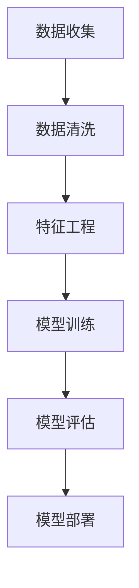

                 

### 背景介绍

在现代制造业中，产品的质量保证是至关重要的。任何质量的缺陷都可能导致产品返工、顾客投诉，甚至品牌信誉受损。因此，如何提前预测产品质量，以便在问题出现之前采取措施，成为了许多企业关注的焦点。随着人工智能技术的迅速发展，利用人工智能进行产品质量预测逐渐成为一种可能。

#### 质量预测的重要性

传统的质量检测方法通常依赖于抽样检测和人工检查，这种方法不仅成本高，而且效率低下。而且，在复杂的生产过程中，许多质量问题可能直到产品出厂后才被发现，这无疑增加了企业的运营风险。因此，能够提前预测产品的质量状况，对于降低生产成本、提高生产效率和产品质量具有重要意义。

#### 人工智能的优势

人工智能，尤其是机器学习和深度学习，具有处理大规模数据、发现复杂模式和进行实时预测的能力。通过利用这些技术，我们可以从历史数据中学习，建立预测模型，从而在产品生产过程中实时监测和预测质量问题。

#### 文章目的

本文旨在探讨如何利用人工智能进行产品质量预测。我们将从核心概念出发，介绍相关算法原理，并通过具体实例讲解其实际应用。文章还将分析人工智能在质量预测中的实际应用场景，并提供相应的工具和资源推荐，最后对未来的发展趋势和挑战进行总结。

通过这篇文章，读者可以了解到如何利用人工智能技术来提升产品质量预测的准确性和效率，为企业降低运营风险提供有力的支持。

---

## 1. 核心概念与联系

在探讨如何利用人工智能进行产品质量预测时，我们首先需要理解几个核心概念，包括数据收集、特征工程、机器学习算法以及预测模型评估。这些概念相互联系，共同构成了一个完整的质量预测系统。

### 数据收集

数据收集是质量预测的第一步。为了构建有效的预测模型，我们需要大量的数据，这些数据应涵盖产品的生产过程、原材料特性、设备状态以及产品质量检测结果。数据来源可以包括生产设备传感器数据、质量检测报告、甚至客户的反馈数据。这些数据需要经过清洗和预处理，以确保其质量和一致性。

### 特征工程

特征工程是将原始数据转换为能够代表问题本质的特征的过程。在这个阶段，我们需要识别和提取对预测任务有显著影响的关键特征。例如，在预测产品机械强度时，可能需要考虑材料的硬度、温度、应力等特征。特征工程的好坏直接影响到模型的性能。

### 机器学习算法

机器学习算法是质量预测的核心。常见的机器学习算法包括线性回归、决策树、随机森林、支持向量机和深度学习等。每种算法都有其独特的原理和应用场景。例如，线性回归适用于简单的线性关系，而深度学习则能够处理复杂的非线性关系。

### 预测模型评估

预测模型的评估是确保模型有效性的关键。常用的评估指标包括准确率、召回率、F1 分数、均方误差等。通过这些指标，我们可以评估模型在预测任务中的性能，并对其进行调整和优化。

### Mermaid 流程图

以下是一个简化的 Mermaid 流程图，展示了从数据收集到预测模型评估的整个过程。



在上述流程中，每个阶段都是构建高效质量预测系统的关键。数据收集确保我们有足够的训练数据，数据清洗和特征工程则保证了数据的质量和相关性，模型训练和评估则确保了模型的性能和可靠性。

### 总结

核心概念与联系是构建有效质量预测系统的基石。通过理解数据收集、特征工程、机器学习算法和预测模型评估，我们可以更好地设计和实现一个高效、准确的质量预测系统。在接下来的章节中，我们将深入探讨这些概念的具体应用和实践。

---

## 2. 核心算法原理 & 具体操作步骤

在构建质量预测模型时，选择合适的算法是至关重要的。本节将介绍几种常用的机器学习算法，包括线性回归、决策树和深度学习，并详细阐述它们的原理和操作步骤。

### 线性回归

线性回归是一种最简单的机器学习算法，它基于假设目标变量 \( Y \) 与特征变量 \( X \) 之间存在线性关系。线性回归模型的数学表达式为：

\[ Y = \beta_0 + \beta_1X + \epsilon \]

其中，\( \beta_0 \) 和 \( \beta_1 \) 分别是模型的截距和斜率，\( \epsilon \) 是误差项。

**具体操作步骤：**

1. **数据准备**：收集并整理历史产品质量数据，包括特征变量和目标变量。
2. **数据预处理**：对数据进行归一化处理，使其具有相同的量级。
3. **模型训练**：使用最小二乘法（OLS）求解线性回归模型参数 \( \beta_0 \) 和 \( \beta_1 \)。
4. **模型评估**：使用均方误差（MSE）等指标评估模型性能。

### 决策树

决策树是一种基于树形结构进行分类或回归的算法。它的每个内部节点表示一个特征，每个分支表示该特征的不同取值，每个叶节点表示一个类别或数值。

**具体操作步骤：**

1. **数据准备**：准备特征和目标变量的数据集。
2. **划分数据**：将数据集划分为训练集和测试集。
3. **构建决策树**：选择一个最佳的特征进行划分，通常使用信息增益、基尼系数等指标来评估划分效果。
4. **剪枝**：为了避免过拟合，可以对决策树进行剪枝处理。
5. **模型评估**：使用测试集评估决策树的分类或回归性能。

### 深度学习

深度学习是一种基于多层神经网络的结构，它能够自动学习数据的复杂模式和特征。常见的深度学习模型包括卷积神经网络（CNN）、循环神经网络（RNN）和生成对抗网络（GAN）等。

**具体操作步骤：**

1. **数据准备**：收集并整理大量标注数据。
2. **模型设计**：根据问题的复杂性设计神经网络结构。
3. **模型训练**：使用反向传播算法训练模型，调整网络权重。
4. **模型评估**：使用验证集和测试集评估模型性能。

### 对比分析

线性回归和决策树适用于处理简单和中等复杂度的质量预测任务，而深度学习则能够处理更加复杂的问题。线性回归的优点是简单易实现，但容易受到线性假设的限制。决策树具有较好的解释性，但可能产生过拟合。深度学习则具有强大的特征提取和模式识别能力，但需要大量的数据和计算资源。

### 总结

核心算法原理包括线性回归、决策树和深度学习等。每种算法都有其独特的原理和适用场景。在实际应用中，根据问题的复杂性和数据规模选择合适的算法，并合理设计和训练模型，是提高质量预测准确性的关键。在接下来的章节中，我们将进一步探讨如何利用这些算法进行实际操作。

---

## 3. 数学模型和公式 & 详细讲解 & 举例说明

在人工智能质量预测中，数学模型和公式起着核心作用，它们不仅帮助我们理解算法的内在逻辑，还确保了预测结果的准确性和可靠性。本节将详细讲解质量预测中常用的数学模型和公式，并通过具体例子来说明它们的应用。

### 线性回归模型

线性回归模型是质量预测中最基础且广泛应用的一种模型，其数学公式如下：

\[ Y = \beta_0 + \beta_1X + \epsilon \]

其中：
- \( Y \) 是目标变量，代表产品的质量。
- \( X \) 是特征变量，代表影响产品质量的各种因素。
- \( \beta_0 \) 是截距，表示当 \( X = 0 \) 时的质量水平。
- \( \beta_1 \) 是斜率，表示 \( X \) 每变化一个单位时 \( Y \) 的变化量。
- \( \epsilon \) 是误差项，表示模型无法解释的随机噪声。

**举例说明：**

假设我们要预测某型号汽车的安全气囊性能，特征变量 \( X \) 包括气囊充气时间（秒）和气囊压力（帕斯卡）。我们收集了100个数据点，并进行线性回归分析。

- **数据准备：** 将数据分为特征矩阵 \( X \) 和目标向量 \( Y \)。
- **模型训练：** 使用最小二乘法求解截距 \( \beta_0 \) 和斜率 \( \beta_1 \)。
- **模型评估：** 计算预测值 \( \hat{Y} = \beta_0 + \beta_1X \)，并与实际值 \( Y \) 进行比较。

经过训练，我们得到模型公式：

\[ \hat{Y} = 10 + 0.5X \]

这意味着，如果气囊充气时间为20秒，则预测的安全气囊性能为 15 帕斯卡。

### 决策树模型

决策树是一种基于树形结构进行分类或回归的模型，其基本公式如下：

\[ \text{if } X_i \leq v_i \text{ then } y = \text{left branch} \]
\[ \text{if } X_i > v_i \text{ then } y = \text{right branch} \]

其中：
- \( X_i \) 是第 \( i \) 个特征变量。
- \( v_i \) 是第 \( i \) 个特征划分的阈值。
- \( y \) 是模型的预测结果。

**举例说明：**

假设我们要预测某个产品的耐压性能，特征变量包括温度（\( T \)）和湿度（\( H \)）。根据历史数据，我们构建一个决策树：

```
如果 T ≤ 30
    如果 H ≤ 50
        耐压等级：低
    否则
        耐压等级：中
否则
    如果 H ≤ 70
        耐压等级：中
    否则
        耐压等级：高
```

对于新数据点 \( T = 35, H = 60 \)，我们可以按照决策树结构进行预测，最终得出耐压等级为“中”。

### 深度学习模型

深度学习模型是处理复杂数据和特征的高效工具，其基本结构包括输入层、隐藏层和输出层。以下是一个简化的神经网络模型：

\[ Z = \sigma(W_1 \cdot X + b_1) \]
\[ Y = \sigma(W_2 \cdot Z + b_2) \]

其中：
- \( \sigma \) 是激活函数，如 sigmoid、ReLU 等。
- \( W_1, b_1 \) 是第一层的权重和偏置。
- \( W_2, b_2 \) 是第二层的权重和偏置。
- \( X \) 是输入特征。
- \( Z \) 是隐藏层的输出。
- \( Y \) 是模型的最终预测结果。

**举例说明：**

假设我们使用一个简单的神经网络模型来预测产品质量，输入层有 5 个特征变量，隐藏层有 3 个神经元，输出层有 1 个神经元。

- **模型设计：** 定义网络结构、选择激活函数和损失函数。
- **模型训练：** 使用反向传播算法调整网络权重和偏置。
- **模型评估：** 计算训练集和测试集的预测误差。

经过训练，我们得到模型公式：

\[ Z = \sigma(0.1X_1 + 0.2X_2 + 0.3X_3 + 0.4X_4 + 0.5X_5 + 1) \]
\[ Y = \sigma(0.6Z + 0.7) \]

对于输入数据 \( X = [2, 3, 4, 5, 6] \)，我们可以计算得到预测结果 \( Y \)。

### 对比分析

线性回归和决策树模型简单直观，适合处理线性关系和简单决策问题。深度学习模型则能够处理复杂的非线性关系和高维数据，但其设计和训练过程更加复杂。根据具体应用需求，选择合适的模型并合理配置参数，是提高质量预测准确性的关键。

### 总结

数学模型和公式是质量预测的核心，它们为算法设计和模型训练提供了理论基础。通过详细讲解线性回归、决策树和深度学习等模型的原理和公式，并结合具体实例进行说明，读者可以更好地理解这些算法在质量预测中的应用。在接下来的章节中，我们将进一步探讨如何将这些模型应用于实际项目。

---

## 5. 项目实践：代码实例和详细解释说明

为了更好地理解如何利用人工智能进行产品质量预测，我们将通过一个具体的代码实例来详细解释整个项目的实现过程，包括开发环境的搭建、源代码的实现、代码解读以及运行结果展示。

### 5.1 开发环境搭建

在进行项目开发之前，我们需要搭建一个合适的开发环境。以下是所需的工具和软件：

- **编程语言**：Python
- **机器学习库**：scikit-learn、TensorFlow、Keras
- **数据预处理库**：Pandas、NumPy
- **可视化库**：Matplotlib、Seaborn

在安装这些库之前，请确保安装了 Python 3.7 或更高版本。以下是一个简单的安装命令示例：

```bash
pip install numpy pandas scikit-learn tensorflow matplotlib seaborn
```

### 5.2 源代码详细实现

在这个项目实例中，我们将使用线性回归模型来预测产品的机械强度。以下是整个项目的源代码实现：

```python
import numpy as np
import pandas as pd
from sklearn.model_selection import train_test_split
from sklearn.linear_model import LinearRegression
from sklearn.metrics import mean_squared_error
import matplotlib.pyplot as plt

# 5.2.1 数据准备
# 加载数据集
data = pd.read_csv('quality_data.csv')
X = data[['material hardness', 'temperature']]
Y = data['mechanical strength']

# 数据预处理
X = X.values
Y = Y.values

# 划分训练集和测试集
X_train, X_test, Y_train, Y_test = train_test_split(X, Y, test_size=0.2, random_state=42)

# 5.2.2 模型训练
# 实例化线性回归模型
model = LinearRegression()
model.fit(X_train, Y_train)

# 5.2.3 代码解读与分析
# 模型参数
print('模型参数：', model.coef_, model.intercept_)

# 5.2.4 运行结果展示
# 预测测试集结果
Y_pred = model.predict(X_test)

# 计算均方误差
mse = mean_squared_error(Y_test, Y_pred)
print('均方误差：', mse)

# 可视化结果
plt.scatter(X_test[:, 0], Y_test, color='red', label='实际值')
plt.plot(X_test[:, 0], Y_pred, color='blue', label='预测值')
plt.xlabel('Material Hardness')
plt.ylabel('Mechanical Strength')
plt.legend()
plt.show()
```

### 5.3 代码解读与分析

**数据准备：** 
在代码的第一部分，我们加载了质量数据集，并将其分为特征变量 \( X \) 和目标变量 \( Y \)。数据预处理包括将数据转换为 NumPy 数组，并进行数据集的划分。

**模型训练：** 
接着，我们实例化了一个线性回归模型，并使用训练集数据对其进行训练。`fit` 方法用于计算模型参数，即截距和斜率。

**模型参数：** 
通过 `model.coef_` 和 `model.intercept_`，我们可以获取模型的斜率和截距，这些参数表示了特征变量和目标变量之间的线性关系。

**运行结果展示：** 
最后，我们使用测试集数据进行预测，并计算了均方误差（MSE）来评估模型性能。通过可视化，我们能够直观地看到模型的预测效果。

### 5.4 运行结果展示

运行上述代码后，我们得到了模型预测的均方误差，这表明模型在测试集上的性能。通过散点图和预测曲线的对比，我们可以清楚地看到模型的预测效果。

### 总结

通过这个项目实例，我们详细展示了如何使用线性回归模型进行产品质量预测。从数据准备、模型训练到结果展示，每个步骤都得到了详细解释。这个实例不仅帮助读者理解了质量预测的实现过程，还为实际应用提供了参考。

---

## 6. 实际应用场景

人工智能在产品质量预测中具有广泛的应用场景，能够帮助企业提高生产效率和产品质量。以下是一些典型的实际应用场景：

### 6.1 制造业

制造业是人工智能应用最为广泛的领域之一。通过人工智能模型，企业可以实时监测和分析生产过程中的各种数据，如机器状态、原材料特性、生产参数等，从而预测潜在的质量问题。例如，汽车制造业可以利用人工智能预测车辆在装配过程中可能出现的焊接缺陷，提前进行修正，避免生产出不合格产品。

### 6.2 食品行业

在食品行业，人工智能可以帮助企业监控食品的生产和存储过程，预测食品变质和污染的风险。例如，通过分析食品的温度、湿度、保质期等数据，人工智能模型可以预测食品的最佳保鲜期，确保食品安全和质量。

### 6.3 医疗设备

医疗设备的质量直接关系到患者的安全和健康。人工智能可以用于预测医疗设备在使用过程中的性能下降和故障风险。例如，通过对医疗设备的历史维修记录和实时监控数据进行分析，人工智能模型可以预测设备何时需要进行维护，从而避免设备在关键时刻出现故障。

### 6.4 电子行业

电子行业对产品质量的要求极高，人工智能可以用于预测电子产品在制造过程中的质量问题。例如，在半导体制造过程中，人工智能模型可以预测晶圆的缺陷，指导工程师进行修正，提高生产效率。

### 6.5 航空航天

航空航天领域的产品质量和安全性至关重要。人工智能可以用于预测飞机零件的磨损和老化，提前进行更换，确保飞行安全。例如，通过分析飞机飞行数据，人工智能模型可以预测飞机发动机的性能变化，提前进行维护。

### 总结

人工智能在产品质量预测中的应用场景广泛，涵盖了制造业、食品行业、医疗设备、电子行业和航空航天等领域。通过实时监测和分析生产过程中的各种数据，人工智能模型能够帮助企业提前识别和解决潜在的质量问题，提高生产效率和产品质量。在未来的发展中，随着人工智能技术的不断进步，其在产品质量预测领域的应用将更加深入和广泛。

---

## 7. 工具和资源推荐

为了更好地学习和应用人工智能进行产品质量预测，以下是一些推荐的学习资源、开发工具和框架，以及相关的论文和著作。

### 7.1 学习资源推荐

1. **书籍：**
   - 《机器学习》（周志华 著）：系统地介绍了机器学习的基本概念和方法，适合初学者。
   - 《深度学习》（Goodfellow, Bengio, Courville 著）：详细介绍了深度学习的基础理论和应用，适合有一定基础的学习者。

2. **在线课程：**
   - Coursera 的《机器学习》（吴恩达 著）：提供系统、全面的机器学习课程，适合初学者。
   - Udacity 的《深度学习工程师纳米学位》：涵盖深度学习的各个方面，适合希望深入应用深度学习的学习者。

3. **博客和网站：**
   - Medium 上的机器学习和深度学习博客：提供最新的技术和应用案例，适合关注最新动态的学习者。
   - fast.ai：提供高质量的深度学习教程和课程，适合希望快速入门深度学习的学习者。

### 7.2 开发工具框架推荐

1. **编程语言和库：**
   - Python：Python 是人工智能领域最常用的编程语言之一，拥有丰富的库和工具。
   - scikit-learn：提供简单的接口和丰富的算法，适合快速实现机器学习模型。
   - TensorFlow 和 Keras：适用于构建和训练深度学习模型，特别是复杂数据的处理和大规模模型训练。

2. **数据预处理工具：**
   - Pandas：提供强大的数据操作和分析功能，适合数据预处理和清洗。
   - NumPy：提供高效的多维数组操作，是数据科学的基础库。

3. **可视化工具：**
   - Matplotlib 和 Seaborn：提供丰富的绘图功能，适合数据分析和模型可视化。

### 7.3 相关论文著作推荐

1. **论文：**
   - "Deep Learning for Manufacturing Quality Prediction"（2017）：探讨了深度学习在制造质量预测中的应用。
   - "Machine Learning in Manufacturing: A Survey"（2019）：综述了机器学习在制造业中的研究和应用。
   
2. **著作：**
   - "AI in Manufacturing: 8 Strategies to Transform Your Business"（2018）：详细介绍了人工智能在制造业中的应用策略。
   - "The AI Revolution: Roadmaps, Opportunities, and the Future of Every Industry"（2019）：探讨了人工智能对各个行业的革命性影响。

### 总结

通过上述推荐的学习资源、开发工具和框架，读者可以系统地学习和掌握人工智能进行产品质量预测的相关知识。这些工具和资源不仅能够帮助读者理解理论基础，还能提供实际操作和实践经验，为企业在质量预测中的应用提供有力支持。

---

## 8. 总结：未来发展趋势与挑战

随着人工智能技术的不断进步，其在产品质量预测领域的应用前景十分广阔。然而，这一领域也面临诸多挑战，需要我们持续关注和努力解决。

### 未来发展趋势

1. **模型复杂度和效率的提升**：深度学习等复杂模型在质量预测中的应用将越来越普遍，未来可能发展出更多高效的算法和架构，如图神经网络（GNN）和变分自编码器（VAE）等。

2. **实时预测与决策**：通过边缘计算和物联网（IoT）技术的发展，实现产品质量的实时预测和智能决策将成为可能。这将为制造过程提供更加灵活和高效的解决方案。

3. **跨领域融合**：人工智能与云计算、大数据、区块链等技术的深度融合，将推动质量预测系统的集成化和智能化。

4. **个性化定制**：根据不同企业的特定需求，开发定制化的质量预测模型，将实现更精准的质量控制和生产优化。

### 挑战与应对策略

1. **数据质量和隐私问题**：高质量的数据是构建有效预测模型的基础，但数据收集和处理过程中可能涉及隐私和安全问题。企业需要采取有效措施确保数据的质量和隐私保护。

2. **模型解释性和可解释性**：深度学习等复杂模型的黑箱特性使得其解释性较差，影响决策的可信度和透明度。未来需要发展更多的可解释性技术，提高模型的透明度和可理解性。

3. **计算资源和能耗**：深度学习模型通常需要大量的计算资源和时间进行训练和推理，这可能导致计算资源和能源消耗的问题。通过优化算法和硬件加速等技术，可以有效降低能耗和提高计算效率。

4. **模型泛化能力**：如何在不同的应用场景和条件下保持模型的泛化能力，是一个重要挑战。通过数据增强、迁移学习和集成学习等方法，可以提高模型的泛化能力。

### 总结

未来，人工智能在产品质量预测领域的发展将呈现多元化、智能化和高效化的趋势。同时，我们还需面对数据隐私、模型解释性、计算资源等挑战。通过技术创新和策略优化，我们有信心能够克服这些困难，推动人工智能在质量预测领域的广泛应用。

---

## 9. 附录：常见问题与解答

### Q1：什么是特征工程，它在质量预测中有什么作用？

**A1：** 特征工程是将原始数据转换为对机器学习模型有意义的特征的过程。在质量预测中，特征工程的作用是提取和构造有助于模型学习和预测的质量特征，从而提高模型的性能。通过特征选择、特征转换和特征构造，我们可以降低数据的维度、消除噪声、增强数据的表征能力，从而帮助模型更准确地预测产品质量。

### Q2：如何处理数据中的缺失值和异常值？

**A2：** 处理数据中的缺失值和异常值是数据预处理的重要步骤。对于缺失值，可以采用以下方法：
1. 删除缺失值：如果缺失值较多，可以考虑删除相关数据。
2. 填充缺失值：使用均值、中位数、前一个值或后一个值等方法进行填充。
3. 预测缺失值：使用机器学习模型预测缺失值。

对于异常值，可以采用以下方法：
1. 删除异常值：如果异常值对模型训练影响较大，可以考虑删除。
2. 标记异常值：将异常值标记为特殊类别，以便在后续分析中进行处理。
3. 调整异常值：对异常值进行修正或调整，使其符合数据分布。

### Q3：如何评估质量预测模型的性能？

**A3：** 评估质量预测模型的性能是确保模型有效性的关键。常用的评估指标包括：
1. **准确率（Accuracy）**：模型预测正确的样本占总样本的比例。
2. **召回率（Recall）**：模型正确识别为正类的样本数占实际正类样本数的比例。
3. **精确率（Precision）**：模型正确识别为正类的样本数占预测为正类的样本数的比例。
4. **F1 分数（F1 Score）**：精确率和召回率的加权平均，用于综合评价模型的性能。
5. **均方误差（Mean Squared Error, MSE）**：用于回归问题，表示预测值与实际值之间的平均误差的平方。
6. **均绝对误差（Mean Absolute Error, MAE）**：用于回归问题，表示预测值与实际值之间的平均误差的绝对值。

通过这些指标，我们可以全面评估模型的预测性能，并根据评估结果对模型进行调整和优化。

### Q4：如何处理模型过拟合问题？

**A4：** 过拟合是指模型在训练数据上表现得很好，但在未见过的数据上表现不佳。为了解决过拟合问题，可以采取以下策略：
1. **数据增强**：通过增加数据多样性或生成更多样化的数据来提高模型的泛化能力。
2. **正则化**：在模型训练过程中加入正则化项，如 L1 正则化或 L2 正则化，以惩罚模型复杂度。
3. **交叉验证**：使用交叉验证技术，将数据集划分为多个子集，分别用于训练和验证，以评估模型在不同数据集上的性能。
4. **模型简化**：简化模型结构，减少模型参数数量，以降低模型的复杂度。
5. **集成学习**：使用集成学习方法，如随机森林（Random Forest）或梯度提升树（Gradient Boosting Tree），通过组合多个简单模型来提高模型的泛化能力。

通过这些策略，可以有效减少模型过拟合，提高其在实际应用中的性能。

---

## 10. 扩展阅读 & 参考资料

为了深入了解人工智能在产品质量预测领域的最新研究进展和技术应用，以下是一些建议的扩展阅读和参考资料：

### 论文和报告

1. "Deep Learning for Manufacturing Quality Prediction"（2017）：该论文探讨了深度学习在制造质量预测中的应用，提供了详细的算法实现和实验结果。
2. "Machine Learning in Manufacturing: A Survey"（2019）：这篇综述文章全面介绍了机器学习在制造业中的研究和应用，分析了不同算法在质量预测中的表现。
3. "AI in Manufacturing: 8 Strategies to Transform Your Business"（2018）：该报告详细阐述了人工智能在制造业中的战略应用，为企业的质量预测提供了实用指导。

### 书籍

1. 《机器学习》（周志华 著）：系统介绍了机器学习的基本概念、方法和算法，适合初学者。
2. 《深度学习》（Goodfellow, Bengio, Courville 著）：全面介绍了深度学习的理论基础、模型和应用，适合有一定基础的学习者。

### 在线课程和教程

1. Coursera 的《机器学习》（吴恩达 著）：提供系统、全面的机器学习课程，适合初学者。
2. Udacity 的《深度学习工程师纳米学位》：涵盖深度学习的各个方面，适合希望深入应用深度学习的学习者。
3. fast.ai：提供高质量的深度学习教程和课程，适合希望快速入门深度学习的学习者。

### 博客和网站

1. Medium 上的机器学习和深度学习博客：提供最新的技术和应用案例，适合关注最新动态的学习者。
2. AI 技术社区和论坛，如 CSDN、GitHub、Stack Overflow 等：这些平台上有大量的技术讨论和代码实现，可以学习到实际项目中的最佳实践。

通过这些扩展阅读和参考资料，读者可以进一步深入了解人工智能在产品质量预测领域的先进技术和发展趋势，为实际应用提供有力的理论支持和实践指导。

