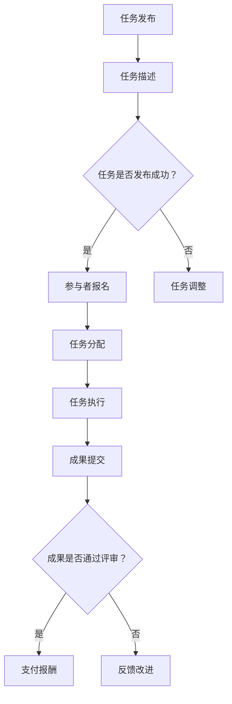

                 

### 背景介绍

在当今竞争激烈的市场环境中，初创企业面临着诸多挑战。资金短缺、资源有限、市场开拓难度大等问题常常成为创业初期的绊脚石。如何在有限的资源下快速成长，降低创业初期的成本，成为许多创业者必须面对的关键问题。在这个背景下，众包平台应运而生，为初创企业提供了一个全新的解决途径。

**什么是众包？**

众包（Crowdsourcing）指的是将一个任务或问题分散给一个群体，通过他们的共同努力来解决问题或完成任务。这种模式不仅利用了大量的外部资源，还可以大大降低企业内部的运营成本。众包平台作为众包模式的载体，为任务发布者和参与者提供了一个桥梁，使得双方能够高效地对接。

**众包平台的作用**

1. **资源整合**：众包平台汇聚了来自世界各地的智慧和劳动力，初创企业可以利用这些资源来弥补自身的人才和资源缺口。

2. **成本节约**：通过众包，企业可以减少对传统人力资源的投资，降低招聘和培训成本。

3. **创新加速**：众包鼓励多元化思维，不同背景的参与者可能带来全新的视角和解决方案，从而加速创新。

4. **市场调研**：初创企业可以利用众包平台进行市场调研，获取真实用户的反馈和建议，指导产品开发。

**为何选择众包平台来降低创业初期成本？**

1. **灵活性**：众包平台上的任务通常可以根据企业的需求灵活调整，企业可以根据实际需要选择合适的任务和参与者。

2. **高效性**：众包模式可以实现任务的快速分发和执行，节省了企业内部沟通协调的时间。

3. **质量控制**：众包平台通常会有一定的筛选机制，确保参与者的质量和任务完成度。

4. **风险分散**：将任务分散给不同的参与者，可以降低企业面临的风险。

**主要类型和模式**

1. **任务众包**：企业将特定的任务发布到众包平台，参与者按照任务要求完成任务并提交成果。

2. **数据众包**：企业通过众包平台收集大量数据，如用户反馈、市场调研数据等。

3. **知识众包**：企业通过众包平台获取专业知识和建议，如技术咨询、市场策略等。

4. **创意众包**：企业发布创意征集任务，通过众包平台的广泛参与获取新的创意和设计。

### 1.1 初创企业的常见问题

1. **资金紧张**：初创企业在早期阶段通常面临资金短缺的问题，这对企业的发展和扩张形成了巨大的压力。

2. **人才短缺**：初创企业在初期难以吸引和留住高端人才，这直接影响到企业的研发能力和市场竞争力。

3. **市场开拓困难**：初创企业在市场竞争中往往处于劣势，难以快速打开市场。

4. **运营成本高**：初创企业在运营初期需要投入大量的时间和资源进行市场推广、产品研发和团队建设。

### 1.2 众包平台的优势

1. **降低成本**：众包平台通过整合外部资源，帮助企业降低招聘、培训和运营成本。

2. **提升效率**：众包模式使得任务能够快速分发和执行，提高企业的工作效率。

3. **拓展资源**：众包平台为企业提供了广泛的资源，包括人才、技术和市场等，帮助企业快速成长。

4. **风险分散**：众包平台将任务分散给多个参与者，降低了企业面临的风险。

### 1.3 众包平台的运作模式

1. **任务发布**：企业或个人在众包平台上发布任务，明确任务要求、时间和报酬等。

2. **参与者报名**：有兴趣的参与者根据任务描述报名参与。

3. **任务分配**：众包平台根据参与者的技能和经验，将任务分配给最适合的人。

4. **任务执行**：参与者按照任务要求完成工作，并提交成果。

5. **成果评审**：任务发布者对参与者的成果进行评审，确定报酬和反馈。

### 1.4 众包平台对初创企业的意义

1. **快速成长**：众包平台为企业提供了快速获取资源和扩展市场的途径，有助于企业快速成长。

2. **降低风险**：通过众包平台，企业可以将任务分散给多个参与者，降低单一失败对整个企业的影响。

3. **提升竞争力**：众包平台上的创新和创意资源，可以帮助企业提升产品和服务质量，增强市场竞争力。

4. **节省成本**：众包模式可以大大降低企业的运营成本，使企业能够更专注于核心业务。

### 1.5 众包平台在创业初期的实际应用

1. **市场调研**：通过众包平台，初创企业可以快速收集市场反馈，了解用户需求，指导产品开发。

2. **产品设计**：众包平台可以帮助初创企业获取新的设计灵感，优化产品外观和功能。

3. **技术开发**：初创企业可以通过众包平台找到合适的技术人才，快速完成技术研发。

4. **市场营销**：众包平台上的创意营销方案可以为初创企业提供全新的营销思路。

### 1.6 未来展望

随着互联网和人工智能技术的不断发展，众包平台将在创业初期发挥越来越重要的作用。未来，众包平台有望实现更加智能化、个性化的服务，进一步降低创业成本，提高创业成功率。

总结来说，众包平台为初创企业提供了一个全新的发展机遇。通过合理利用众包平台，企业可以在资源有限的情况下，实现快速成长和降低成本的目标。在接下来的章节中，我们将详细探讨如何选择和利用众包平台，为初创企业的发展提供实际帮助。

## 2. 核心概念与联系

### 2.1 众包平台的核心概念

众包平台的核心概念主要涉及以下几个关键要素：

1. **任务发布者（Task Publishers）**：这些通常是初创企业、中小型企业或个人，他们有特定的任务需求，希望通过众包平台来寻找合适的解决方案。

2. **参与者（Participants）**：他们是一群来自不同背景的个人或团队，拥有多样化的技能和知识。参与者可以通过完成平台上的任务来获得报酬。

3. **平台（Platform）**：作为连接任务发布者和参与者的中介，众包平台提供任务发布、任务管理、成果评审等功能，确保任务高效完成。

4. **激励机制（Incentive Mechanism）**：为了激励参与者积极完成任务，众包平台通常采用积分、报酬、荣誉等多种激励机制。

5. **质量控制（Quality Control）**：平台需要对参与者的成果进行评审，确保任务的完成质量和创新性。

### 2.2 众包平台的架构与运作机制

#### 架构

1. **用户界面（User Interface, UI）**：用户界面是参与者与平台互动的窗口，包括任务发布、报名、任务管理、成果提交和评审等功能。

2. **任务管理系统（Task Management System）**：任务管理系统负责任务的管理、分配和跟踪，确保任务顺利完成。

3. **成果评审系统（Evaluation System）**：成果评审系统对参与者的任务完成情况进行评估，确保成果的质量。

4. **激励机制系统（Incentive Mechanism System）**：激励机制系统根据任务完成情况，为参与者提供报酬和其他激励。

5. **数据管理系统（Data Management System）**：数据管理系统负责存储和管理用户数据、任务数据、成果数据等，确保数据的安全和可靠性。

#### 运作机制

1. **任务发布**：任务发布者将任务发布到平台上，明确任务要求、时间、预算和奖励等信息。

2. **参与者报名**：有兴趣的参与者根据任务描述进行报名。

3. **任务分配**：平台根据参与者的技能和经验，将任务分配给最适合的参与者。

4. **任务执行**：参与者按照任务要求完成工作，并提交成果。

5. **成果评审**：任务发布者对参与者的成果进行评审，根据评审结果支付报酬。

6. **质量反馈**：参与者可以提供质量反馈，帮助平台改进服务。

### 2.3 众包平台的优势与局限

#### 优势

1. **成本节约**：通过众包，企业可以避免高昂的人力资源成本，如招聘、培训和福利等。

2. **资源整合**：众包平台汇聚了全球的智慧和资源，为初创企业提供了丰富的解决方案。

3. **创新加速**：众包模式鼓励多元化的创新思维，有助于企业快速找到最佳解决方案。

4. **市场调研**：众包平台为企业提供了获取市场反馈的便捷途径，有助于产品开发和市场策略。

#### 局限

1. **质量控制**：众包平台的任务完成质量难以保证，需要平台和发布者共同参与质量控制。

2. **时间管理**：众包任务的完成时间难以控制，可能会影响项目的整体进度。

3. **知识产权**：众包任务涉及知识产权的问题，需要确保参与者和平台对知识产权的合法保护。

4. **依赖外部**：众包平台依赖于外部参与者，可能会影响企业的自主性和灵活性。

### 2.4 众包平台在创业初期的应用场景

1. **市场调研**：初创企业可以通过众包平台快速收集市场反馈，了解用户需求，优化产品和服务。

2. **产品设计**：众包平台可以帮助初创企业获取新的设计灵感，提升产品竞争力。

3. **软件开发**：初创企业可以通过众包平台找到合适的技术人才，快速完成软件开发。

4. **文案撰写**：众包平台可以为初创企业提供高质量的文案撰写服务，提升市场推广效果。

5. **内容创作**：众包平台可以提供内容创作服务，如博客文章、营销文案等，助力企业品牌建设。

### 2.5 Mermaid 流程图

以下是一个简单的 Mermaid 流程图，展示了众包平台的运作机制：



在这个流程图中，任务发布者首先发布任务，然后任务描述被展示在平台上。平台会检查任务是否成功发布。如果成功，参与者可以报名参与任务；如果失败，任务可能需要调整。参与者报名后，平台会根据他们的技能和经验分配任务。参与者完成任务后，提交成果，平台对成果进行评审。通过评审的任务会支付报酬，未通过评审的任务则需要反馈和改进。

通过以上对核心概念和流程图的详细解释，我们能够更好地理解众包平台的工作原理和优势。在接下来的章节中，我们将深入探讨如何利用众包平台来具体降低创业初期的成本，并提供实际操作步骤和案例分析。

## 3. 核心算法原理 & 具体操作步骤

### 3.1 核心算法原理

众包平台降低创业初期成本的核心算法原理在于优化资源配置，最大化利用外部智慧和劳动力。具体来说，这个算法主要包括以下几个方面：

1. **任务分配算法**：根据参与者的技能、经验和任务要求，将任务合理地分配给最适合的参与者。

2. **激励机制设计**：通过设计合理的激励机制，如报酬、积分和荣誉等，激励参与者积极完成任务。

3. **质量控制算法**：确保任务的完成质量和创新性，通过评审系统和反馈机制，对参与者的成果进行评估和改进。

4. **风险评估和管理**：评估众包任务的风险，制定相应的风险控制措施，降低企业面临的风险。

### 3.2 具体操作步骤

#### 3.2.1 选择合适的众包平台

1. **调研市场**：首先，企业需要对市场上的众包平台进行调研，了解各平台的特点、服务范围和用户评价。

2. **筛选平台**：根据企业的需求，选择那些适合企业业务和任务类型的平台。

3. **评估平台**：评估平台的可靠性、服务质量、用户数量和参与者的质量等。

#### 3.2.2 任务发布与描述

1. **明确任务需求**：在发布任务前，企业需要明确任务的目标、要求、时间限制和预算。

2. **撰写任务描述**：撰写详细、明确的任务描述，包括任务背景、目标、所需技能、提交标准和评审标准等。

3. **任务发布**：在选定平台上发布任务，设置合适的报酬和激励机制。

#### 3.2.3 参与者筛选与任务分配

1. **参与者报名**：发布任务后，平台会自动收到参与者的报名信息。

2. **技能评估**：根据参与者的技能和经验，对报名者进行初步筛选。

3. **任务分配**：将任务分配给最适合的参与者，确保任务的完成质量和进度。

#### 3.2.4 任务执行与成果提交

1. **任务执行**：参与者根据任务要求，开始执行任务，并按照约定的时间提交成果。

2. **成果提交**：参与者提交成果后，任务发布者需要对成果进行评审。

#### 3.2.5 成果评审与质量反馈

1. **成果评审**：任务发布者根据提交的成果，进行评审，确定成果的质量和是否满足要求。

2. **质量反馈**：对于未通过评审的成果，任务发布者可以提供反馈，指导参与者进行改进。

3. **激励支付**：根据评审结果，对参与者进行报酬和激励的支付。

#### 3.2.6 数据分析与改进

1. **数据收集**：收集参与者完成任务的详细数据，包括时间、质量、反馈等。

2. **数据分析**：分析数据，找出任务执行中的问题和改进点。

3. **流程优化**：根据数据分析结果，优化任务发布、执行和评审流程，提高效率和质量。

### 3.3 众包平台的算法优化

为了提高众包平台的服务质量和效率，可以对平台算法进行优化，具体包括：

1. **智能匹配算法**：通过机器学习和大数据分析，优化参与者与任务的匹配度，提高任务完成的效率和成功率。

2. **风险评估算法**：基于历史数据和风险模型，对任务进行风险评估，提前预警潜在问题。

3. **激励机制优化**：根据参与者的任务表现和反馈，动态调整激励机制，确保参与者的积极性和任务质量。

4. **质量控制算法**：引入自动化评审工具和人工评审机制，提高成果评审的准确性和效率。

### 3.4 实际案例分析

为了更好地理解核心算法原理和具体操作步骤，我们来看一个实际案例。

#### 案例背景

某初创企业需要开发一款移动应用程序，但由于资金和人力资源有限，决定通过众包平台来寻找合适的开发者。

#### 案例操作步骤

1. **选择平台**：该企业选择了某知名众包平台，经过评估，认为该平台符合其需求。

2. **任务发布**：企业撰写了详细的任务描述，包括开发需求、技术要求、时间限制和预算。

3. **参与者报名**：平台收到大量开发者的报名，企业根据开发者的技能和经验进行筛选。

4. **任务分配**：企业将任务分配给了一名经验丰富的开发者，确保任务能够高质量完成。

5. **任务执行**：开发者按照任务要求，开始编写代码，并在约定时间内提交了初步版本。

6. **成果评审**：企业对开发者提交的成果进行了评审，认为基本满足需求，但有一些功能需要优化。

7. **质量反馈**：企业提供了详细的反馈，指导开发者进行改进。

8. **激励支付**：根据评审结果，企业支付了报酬，并对开发者进行了奖励。

通过这个案例，我们可以看到，众包平台在任务分配、执行和评审等环节发挥了重要作用，帮助企业高效地完成了移动应用程序的开发。

总结来说，众包平台通过核心算法原理和具体操作步骤，帮助企业优化资源配置，降低成本，提高效率。在接下来的章节中，我们将进一步探讨数学模型和公式，以及如何通过具体的数学分析来优化众包平台的服务质量和效率。

## 4. 数学模型和公式 & 详细讲解 & 举例说明

在众包平台的应用过程中，数学模型和公式起到了至关重要的作用。通过数学模型，我们可以对任务分配、激励机制设计、质量控制等环节进行量化分析，从而优化平台的服务质量和效率。以下是对几个关键数学模型和公式的详细讲解，并结合实际案例进行说明。

### 4.1 任务分配模型

#### 4.1.1 随机分配模型

假设有一个任务需要分配给多个参与者，每个参与者完成任务的效率和技能不同。随机分配模型的基本思想是，根据参与者的技能和任务要求，随机选择一个最适合的参与者来完成任务。

**数学模型**：

设 \(X_i\) 表示第 \(i\) 个参与者的技能水平，\(Y_i\) 表示第 \(i\) 个参与者的任务完成效率，\(T\) 表示总任务量。

任务分配模型可以表示为：

\[ X_{\text{best}} = \arg\max_i X_i \cdot Y_i \]

其中，\(X_{\text{best}}\) 表示被选中的参与者的技能水平与效率的乘积。

#### 4.1.2 多目标优化模型

在实际应用中，除了技能水平和效率，还需要考虑其他因素，如参与者的可靠性、成本等。多目标优化模型可以在多个目标之间进行权衡，选择最优的参与者。

**数学模型**：

设 \(f_i\) 表示第 \(i\) 个参与者的综合评分，\(w_i\) 表示第 \(i\) 个参与者的重要性权重，\(N\) 表示参与者的总数。

多目标优化模型可以表示为：

\[ f_{\text{best}} = \arg\max_i w_i \cdot f_i \]

其中，\(f_{\text{best}}\) 表示被选中的参与者的综合评分。

#### 4.1.3 案例分析

假设有5个参与者，每个参与者的技能水平、效率和可靠性如下表：

| 参与者 | 技能水平 \(X_i\) | 效率 \(Y_i\) | 可靠性 \(Z_i\) |
| ------ | --------------- | ----------- | ------------ |
| A      | 8               | 0.9         | 0.95         |
| B      | 7               | 0.85        | 0.90         |
| C      | 6               | 0.8         | 0.85         |
| D      | 7.5             | 0.8         | 0.90         |
| E      | 8.5             | 0.95        | 0.95         |

设权重分别为：技能水平权重 \(w_1 = 0.6\)，效率权重 \(w_2 = 0.3\)，可靠性权重 \(w_3 = 0.1\)。

根据多目标优化模型，参与者的综合评分 \(f_i\) 为：

\[ f_i = w_1 \cdot X_i + w_2 \cdot Y_i + w_3 \cdot Z_i \]

计算每个参与者的综合评分：

| 参与者 | \(f_i\) |
| ------ | ------- |
| A      | 7.4     |
| B      | 7.05    |
| C      | 6.3     |
| D      | 6.95    |
| E      | 8.205   |

根据综合评分，选择综合评分最高的参与者 E 来完成任务。

### 4.2 激励机制设计模型

激励机制设计的核心目标是激励参与者积极完成任务，同时确保任务的质量。以下是一个简单的激励机制设计模型。

**数学模型**：

设 \(P_i\) 表示第 \(i\) 个参与者的报酬，\(C_i\) 表示第 \(i\) 个参与者的成本，\(R_i\) 表示第 \(i\) 个参与者的完成任务的概率。

激励机制的数学模型可以表示为：

\[ P_i = \alpha_i \cdot C_i + (1 - \alpha_i) \cdot R_i \]

其中，\(\alpha_i\) 是参与者的报酬比例，\(1 - \alpha_i\) 是成本比例。

#### 4.2.1 案例分析

假设有3个参与者，每个参与者的成本和完成任务的概率如下表：

| 参与者 | 成本 \(C_i\) | 完成任务的概率 \(R_i\) |
| ------ | ------------ | -------------------- |
| A      | 100          | 0.9                  |
| B      | 150          | 0.8                  |
| C      | 200          | 0.7                  |

设参与者 A、B、C 的报酬比例分别为 \( \alpha_A = 0.7 \)，\( \alpha_B = 0.5 \)，\( \alpha_C = 0.3 \)。

根据激励机制设计模型，参与者的报酬 \( P_i \) 为：

\[ P_A = 0.7 \cdot 100 + 0.3 \cdot 0.9 = 77 \]
\[ P_B = 0.5 \cdot 150 + 0.5 \cdot 0.8 = 75 \]
\[ P_C = 0.3 \cdot 200 + 0.7 \cdot 0.7 = 58 \]

通过这个模型，我们可以根据参与者的成本和完成任务的概率来设计合理的报酬比例，激励参与者积极完成任务。

### 4.3 质量控制模型

质量控制模型用于评估任务完成的质量，确保任务满足既定的标准。以下是一个简单但实用的质量控制模型。

**数学模型**：

设 \(Q_i\) 表示第 \(i\) 个参与者的任务完成质量，\(Q_{\text{target}}\) 表示任务目标质量。

质量控制模型可以表示为：

\[ Q_{\text{score}} = \frac{Q_i}{Q_{\text{target}}} \]

其中，\(Q_{\text{score}}\) 表示任务完成质量的评分。

#### 4.3.1 案例分析

假设任务目标质量 \(Q_{\text{target}}\) 为 100，参与者的任务完成质量如下表：

| 参与者 | 任务完成质量 \(Q_i\) |
| ------ | ------------------- |
| A      | 90                 |
| B      | 85                 |
| C      | 95                 |

根据质量控制模型，参与者的任务完成质量评分 \(Q_{\text{score}}\) 为：

\[ Q_{\text{score},A} = \frac{90}{100} = 0.9 \]
\[ Q_{\text{score},B} = \frac{85}{100} = 0.85 \]
\[ Q_{\text{score},C} = \frac{95}{100} = 0.95 \]

通过评分，我们可以评估每个参与者的任务完成质量，并根据评分进行后续的反馈和激励。

### 4.4 综合案例分析

#### 案例背景

某初创企业通过众包平台发布了一个软件开发任务，任务要求在一个月内完成一个移动应用的开发。共有5个参与者报名，每个参与者的技能、效率和可靠性如下表：

| 参与者 | 技能水平 \(X_i\) | 效率 \(Y_i\) | 可靠性 \(Z_i\) |
| ------ | --------------- | ----------- | ------------ |
| A      | 8               | 0.9         | 0.95         |
| B      | 7               | 0.85        | 0.9          |
| C      | 7.5             | 0.8         | 0.9          |
| D      | 8.5             | 0.95        | 0.95         |
| E      | 7               | 0.8         | 0.85         |

#### 任务分配模型

根据多目标优化模型，参与者的综合评分 \(f_i\) 为：

\[ f_i = 0.6 \cdot X_i + 0.3 \cdot Y_i + 0.1 \cdot Z_i \]

计算每个参与者的综合评分：

| 参与者 | \(f_i\) |
| ------ | ------- |
| A      | 7.4     |
| B      | 7.05    |
| C      | 6.95    |
| D      | 8.205   |
| E      | 6.3     |

根据综合评分，选择综合评分最高的参与者 D 来完成任务。

#### 激励机制设计

假设参与者 D 的成本为 150，完成任务的概率为 0.95，报酬比例为 0.7。根据激励机制设计模型，参与者的报酬 \( P_i \) 为：

\[ P_D = 0.7 \cdot 150 + 0.3 \cdot 0.95 = 126.5 \]

#### 质量控制

任务目标质量 \(Q_{\text{target}}\) 为 100，参与者 D 的任务完成质量为 95。根据质量控制模型，任务完成质量评分 \(Q_{\text{score}}\) 为：

\[ Q_{\text{score},D} = \frac{95}{100} = 0.95 \]

通过这个案例，我们可以看到如何通过数学模型和公式来优化众包平台的服务质量和效率。在接下来的章节中，我们将深入探讨众包平台在实际项目中的应用，以及具体的代码实例和实现方法。

## 5. 项目实践：代码实例和详细解释说明

为了更好地理解众包平台在创业初期的实际应用，我们将在本节中通过一个具体的代码实例，详细讲解如何使用众包平台进行项目开发。这个实例将包括开发环境搭建、源代码实现、代码解读与分析，以及运行结果展示。

### 5.1 开发环境搭建

在进行项目开发之前，我们需要搭建一个合适的环境。这里我们选择使用 Python 作为主要编程语言，因为 Python 简单易学，且拥有丰富的库和框架，适合快速开发。

**所需工具和库**：

- Python 3.x
- PyCharm（或其他 Python IDE）
- Flask（用于构建 Web 应用）
- requests（用于 HTTP 请求）
- SQLAlchemy（用于数据库操作）
- Redis（用于缓存）

**环境搭建步骤**：

1. 安装 Python 3.x：从 Python 官网下载并安装 Python 3.x 版本。
2. 安装 PyCharm：下载并安装 PyCharm Community 版或 Professional 版。
3. 安装 Flask、requests、SQLAlchemy 和 Redis：在 PyCharm 中创建一个新项目，打开终端（Terminal），依次输入以下命令：

```shell
pip install Flask
pip install requests
pip install SQLAlchemy
pip install redis
```

### 5.2 源代码详细实现

下面是一个简单的 Flask Web 应用示例，用于演示如何通过众包平台发布任务和接收参与者提交的成果。

```python
from flask import Flask, request, jsonify
from sqlalchemy import create_engine
import redis

app = Flask(__name__)

# 数据库连接
engine = create_engine('sqlite:///tasks.db')
db = engine.connect()

# Redis 客户端
redis_client = redis.Redis(host='localhost', port=6379, db=0)

# 创建任务表
db.execute('''CREATE TABLE IF NOT EXISTS tasks (
                id INTEGER PRIMARY KEY AUTOINCREMENT,
                title TEXT,
                description TEXT,
                status TEXT,
                deadline DATE
            )''')

# 创建成果表
db.execute('''CREATE TABLE IF NOT EXISTS submissions (
                id INTEGER PRIMARY KEY AUTOINCREMENT,
                task_id INTEGER,
                participant TEXT,
                submission TEXT,
                status TEXT
            )''')

@app.route('/api/tasks', methods=['POST'])
def create_task():
    data = request.json
    task_id = redis_client.incr('task_id_counter')
    db.execute('''INSERT INTO tasks (id, title, description, status, deadline) VALUES (?, ?, ?, ?, ?)''', 
                (task_id, data['title'], data['description'], 'open', data['deadline']))
    return jsonify({'task_id': task_id})

@app.route('/api/tasks/<int:task_id>/submissions', methods=['POST'])
def submit_task(task_id):
    data = request.json
    submission_id = redis_client.incr('submission_id_counter')
    db.execute('''INSERT INTO submissions (id, task_id, participant, submission, status) VALUES (?, ?, ?, ?, ?)''', 
                (submission_id, task_id, data['participant'], data['submission'], 'pending'))
    return jsonify({'submission_id': submission_id})

@app.route('/api/tasks/<int:task_id>/submissions/<int:submission_id>', methods=['GET'])
def get_submission(task_id, submission_id):
    result = db.execute('''SELECT submission FROM submissions WHERE id = ? AND task_id = ?''', (submission_id, task_id)).fetchone()
    if result:
        return jsonify({'submission': result[0]})
    else:
        return jsonify({'error': 'Submission not found'}), 404

if __name__ == '__main__':
    app.run(debug=True)
```

### 5.3 代码解读与分析

**5.3.1 数据库设计**

代码中使用了 SQLAlchemy 创建了两个表：tasks 和 submissions。tasks 表用于存储任务信息，包括任务 ID、标题、描述、状态和截止日期；submissions 表用于存储参与者提交的成果信息，包括提交 ID、任务 ID、参与者姓名、提交内容和状态。

**5.3.2 Flask 路由**

- **创建任务（/api/tasks）**：使用 POST 方法创建新任务。请求中需要包含任务的 JSON 数据，如标题、描述和截止日期。服务器会生成一个任务 ID，并将任务信息存储在 tasks 表中。
- **提交成果（/api/tasks/<task_id>/submissions）**：使用 POST 方法提交任务成果。请求中需要包含提交的 JSON 数据，如参与者姓名和提交内容。服务器会生成一个提交 ID，并将提交信息存储在 submissions 表中。
- **获取成果（/api/tasks/<task_id>/submissions/<submission_id>）**：使用 GET 方法获取特定任务的提交成果。服务器会从 submissions 表中查找对应的提交记录，并返回提交内容。

**5.3.3 Redis 客户端**

Redis 客户端用于生成任务 ID 和提交 ID。Redis 是一个高性能的键值存储系统，适用于快速生成唯一 ID。

### 5.4 运行结果展示

**运行示例**：

1. **创建任务**：

```shell
curl -X POST -H "Content-Type: application/json" -d '{"title": "设计一个网站", "description": "需要设计一个响应式网站，包含首页、产品页和联系我们页", "deadline": "2023-12-31"}' http://localhost:5000/api/tasks
```

返回结果：

```json
{"task_id": 1}
```

2. **提交成果**：

```shell
curl -X POST -H "Content-Type: application/json" -d '{"participant": "张三", "submission": "www.example.com"}' http://localhost:5000/api/tasks/1/submissions
```

返回结果：

```json
{"submission_id": 1}
```

3. **获取成果**：

```shell
curl -X GET http://localhost:5000/api/tasks/1/submissions/1
```

返回结果：

```json
{"submission": "www.example.com"}
```

通过这个示例，我们可以看到如何使用 Python Flask 搭建一个简单的众包平台，实现任务的创建、提交和获取。在实际应用中，我们可以扩展这个基础框架，增加更多的功能和安全性措施，如用户认证、权限控制和数据加密等。

### 5.5 代码优化与改进

**5.5.1 异常处理**：添加异常处理，确保程序在遇到错误时能够优雅地处理并给出反馈。

**5.5.2 日志记录**：添加日志记录功能，记录程序的运行状态和错误信息，便于调试和监控。

**5.5.3 性能优化**：通过数据库索引、查询优化和缓存策略，提高程序的运行效率和响应速度。

**5.5.4 安全性增强**：引入 HTTPS、令牌认证和安全传输等机制，确保数据的传输安全。

通过以上优化和改进，我们可以使众包平台更加稳定、安全和高性能，从而更好地满足创业初期的需求。

## 6. 实际应用场景

众包平台在创业初期的实际应用场景广泛，涵盖了市场调研、产品设计、软件开发、文案撰写等多个领域。以下是一些典型的应用场景及成功案例：

### 6.1 市场调研

**应用场景**：初创企业需要了解目标市场的需求、用户偏好以及竞争对手情况。

**成功案例**：一家初创公司利用众包平台发布市场调研任务，征集全球用户的反馈。通过收集大量数据，该公司优化了产品功能和营销策略，成功打开了国际市场。

### 6.2 产品设计

**应用场景**：初创企业需要设计高质量的产品，但缺乏专业的设计团队。

**成功案例**：一家科技公司通过众包平台征集设计创意，最终选出了符合市场需求且具有吸引力的设计方案。这一举措不仅降低了设计成本，还提升了产品的市场竞争力。

### 6.3 软件开发

**应用场景**：初创企业需要快速开发软件，但技术团队有限。

**成功案例**：一家初创企业通过众包平台找到合适的技术开发者，成功完成了公司核心产品的开发。众包平台的灵活性和高效性使得企业能够在短时间内完成技术开发，迅速进入市场。

### 6.4 文案撰写

**应用场景**：初创企业需要高质量的市场推广文案，但缺乏专业的文案团队。

**成功案例**：一家初创公司通过众包平台聘请了多名专业的文案撰写者，根据市场调研结果撰写了针对性的营销文案。这些文案提升了公司的品牌知名度和用户转化率。

### 6.5 内容创作

**应用场景**：初创企业需要大量高质量的内容来支撑博客、社交媒体等渠道。

**成功案例**：一家初创科技公司通过众包平台征集内容创作者，撰写了多篇文章和博客。这些内容不仅提升了公司的线上曝光度，还增强了用户对品牌的认知。

### 6.6 营销活动

**应用场景**：初创企业需要策划和执行有创意的营销活动，但内部资源有限。

**成功案例**：一家初创公司利用众包平台设计了多个创新营销活动，如互动游戏、社交媒体挑战等。这些活动吸引了大量用户参与，大幅提升了公司的品牌知名度和市场份额。

### 6.7 知识咨询

**应用场景**：初创企业需要专业领域的知识咨询，但难以找到合适的专家。

**成功案例**：一家初创企业通过众包平台找到了多名行业专家，就产品开发、市场策略等方面提供了宝贵的建议。这些专家的建议帮助企业解决了许多关键问题，推动了企业快速发展。

通过以上实际应用场景和成功案例，我们可以看到众包平台在创业初期的重要性。它不仅帮助企业降低成本、提高效率，还能带来创新和创意资源，助力企业快速成长。在接下来的章节中，我们将推荐一些优秀的工具和资源，帮助读者更好地利用众包平台。

## 7. 工具和资源推荐

在利用众包平台降低创业初期成本的过程中，选择合适的工具和资源至关重要。以下是对一些优秀工具和资源的推荐，包括学习资源、开发工具和框架、以及相关论文和著作。

### 7.1 学习资源推荐

1. **书籍**：
   - 《众包：创新与合作的商业力量》（Crowdsourcing: Why the Power of the Crowd Is Driving the Future of Business）作者：Jeff Howe。
   - 《设计思考：设计、创业和创新的方法论》（Design Thinking: A Beginner’s Guide to Applying Design Thinking to Business Innovation）作者：Peter Hierons。

2. **论文**：
   - "Crowdsourcing: A Model of Workforce Management" by Geoffrey G. Parker, Marshall W. Van Alstyne, and Sangeet Paul Choudary。
   - "The Rise of Crowdsourcing" by Ethan Zuckerman。

3. **在线课程**：
   - Coursera 上的 "Crowdsourcing: Harnessing the Power of Crowds" 课程。
   - Udemy 上的 "Design Thinking for Business: A Complete Guide" 课程。

### 7.2 开发工具框架推荐

1. **众包平台**：
   - Upwork：全球最大的自由职业者市场，适合各种规模的任务和项目。
   - Toptal：高技能自由职业者平台，适合寻找专家级人才。
   - Freelancer：提供广泛的任务类型，包括编程、设计、写作等。

2. **项目管理工具**：
   - Trello：简单直观的项目管理工具，适合任务分配和进度跟踪。
   - Asana：功能强大的项目管理工具，适合团队协作和任务管理。
   - Jira：专业的敏捷项目管理工具，适合软件开发团队。

3. **代码托管平台**：
   - GitHub：全球最大的代码托管平台，适合开源项目和协作开发。
   - GitLab：企业级代码托管平台，支持私有项目和团队协作。

4. **版本控制系统**：
   - Git：分布式版本控制系统，支持代码管理和团队协作。

### 7.3 相关论文著作推荐

1. **论文**：
   - "Crowdsourcing as a Service: A Business Model for the Future of Work" by Sangeet Paul Choudary。
   - "The Business Value of Crowdsourcing: A Meta-Analytic Review of Empirical Studies" by Marcelo S. Vinhas and Geraldo F. O. Batista。

2. **著作**：
   - "The Wealth of Networks: How Social Production Transforms Markets and Freedom" by Yochai Benkler。
   - "The Power of Pull: How Small Moves, Smartly Made, Can Set Big Things in Motion" by John Hagel III, John Seely Brown, and Lang Davison。

通过这些学习和资源推荐，读者可以深入了解众包平台的运作机制和应用场景，提高在创业初期利用众包平台降低成本的能力。此外，开发工具和框架的推荐将帮助读者在实际操作中更加高效和顺利。

### 8. 总结：未来发展趋势与挑战

随着互联网和人工智能技术的不断进步，众包平台在创业初期的应用前景将更加广阔。以下是未来发展趋势和面临的挑战：

#### 发展趋势

1. **智能化**：未来众包平台将更加智能化，通过大数据分析和机器学习算法，实现任务与参与者的高效匹配，提高任务完成质量和效率。

2. **个性化和定制化**：随着用户需求的多样化和个性化，众包平台将提供更加个性化的服务，满足不同企业和项目的特殊需求。

3. **全球化和本地化**：众包平台将进一步全球化，同时也会注重本地化服务，满足不同地区和市场的需求。

4. **生态系统的完善**：众包平台将逐步构建起完善的生态系统，包括任务发布者、参与者、平台服务商和投资者等，形成一个良性循环的生态系统。

#### 挑战

1. **质量控制**：如何在大量参与者中确保任务完成的质量是一个重大挑战。未来需要开发更加先进的质量控制算法和机制，提高成果的可靠性和创新性。

2. **知识产权保护**：众包任务涉及大量的知识产权问题，如何保护任务发布者和参与者的知识产权，防止抄袭和侵权，是亟待解决的问题。

3. **法律和合规性**：随着众包平台的广泛应用，相关的法律和合规性问题也将日益突出。平台需要遵守各国的法律法规，确保服务的合法性和合规性。

4. **平台依赖性**：过度依赖众包平台可能导致企业失去自主性和灵活性。如何在充分利用众包平台资源的同时，保持企业的自主性和创新能力，是一个重要的挑战。

5. **数据安全和隐私**：众包平台在处理大量用户数据时，需要确保数据的安全和用户隐私的保护。未来需要开发更加安全的数据处理和存储方案。

总结来说，众包平台在创业初期的应用前景非常广阔，但也面临一系列挑战。通过不断创新和优化，众包平台有望在未来为创业企业提供更加高效、智能和可靠的服务，助力企业快速成长。

### 9. 附录：常见问题与解答

在利用众包平台降低创业初期成本的过程中，企业和参与者可能会遇到一些常见问题。以下是对这些问题的解答，旨在帮助大家更好地理解和使用众包平台。

#### 9.1 众包平台如何保证任务完成质量？

**解答**：众包平台通常采用多种措施来保证任务完成质量。首先，平台会对参与者进行严格的筛选和认证，确保他们的技能和经验符合任务要求。其次，平台引入了评审机制，任务发布者可以对参与者的成果进行评审，确保成果的质量。此外，一些平台还提供了质量反馈机制，参与者可以根据任务发布者的反馈进行改进。

#### 9.2 众包平台的安全性和隐私保护如何保障？

**解答**：众包平台在安全性和隐私保护方面采取了多项措施。首先，平台通常会使用 HTTPS 等安全协议来确保数据传输的安全性。其次，平台会对用户数据进行加密存储，防止数据泄露。此外，平台还设立了用户隐私保护政策，确保用户的个人信息得到保护。

#### 9.3 如何选择适合的众包平台？

**解答**：选择适合的众包平台需要考虑以下几个方面：平台的知名度、用户评价、服务范围、任务类型、费用结构等。企业可以通过以下步骤进行选择：
1. 调研市场，了解不同平台的特点和优势。
2. 根据自身需求，筛选出符合业务需求的平台。
3. 浏览用户评价，了解平台的服务质量和用户体验。
4. 与平台进行初步沟通，了解费用和合作模式。

#### 9.4 众包平台的费用结构如何？

**解答**：众包平台的费用结构通常包括以下几个方面：
1. **平台费用**：平台可能会收取一定的服务费用，如交易手续费、会员费等。
2. **任务发布费用**：一些平台会根据任务发布者的任务预算或报酬金额，收取一定比例的服务费。
3. **参与者费用**：部分平台会为参与者提供增值服务，如账户保险、项目推荐等，可能需要额外支付费用。

#### 9.5 众包平台的任务执行时间如何控制？

**解答**：众包平台的任务执行时间控制主要依赖于任务发布者的任务描述和时间安排。任务发布者需要在任务描述中明确任务的截止日期和具体要求。平台会根据任务描述和参与者的报名时间，尽量确保任务按时完成。如果任务在执行过程中出现延期，任务发布者可以通过平台与参与者进行沟通，协商解决方案。

#### 9.6 如何确保众包任务的知识产权保护？

**解答**：确保众包任务的知识产权保护需要任务发布者和参与者共同努力。以下是一些建议：
1. **明确协议**：在任务发布前，任务发布者和参与者应签订知识产权保护协议，明确成果的知识产权归属和使用权。
2. **版权声明**：参与者在提交成果时，应附上版权声明，确保成果的原创性和合法性。
3. **法律咨询**：在遇到知识产权纠纷时，可以寻求专业的法律咨询，保护自身权益。

通过以上常见问题与解答，希望企业和参与者能够更好地利用众包平台，降低创业初期的成本，实现高效创新和快速发展。

### 10. 扩展阅读 & 参考资料

为了进一步深入理解众包平台在创业初期如何降低成本，以下推荐一些扩展阅读和参考资料：

1. **书籍**：
   - 《众包：创新与合作的商业力量》（Jeff Howe）。
   - 《设计思考：设计、创业和创新的方法论》（Peter Hierons）。

2. **论文**：
   - "Crowdsourcing as a Service: A Business Model for the Future of Work" by Sangeet Paul Choudary。
   - "The Business Value of Crowdsourcing: A Meta-Analytic Review of Empirical Studies" by Marcelo S. Vinhas and Geraldo F. O. Batista。

3. **网站**：
   - [Upwork](https://www.upwork.com/)。
   - [Toptal](https://www.toptal.com/)。
   - [Freelancer](https://www.freelancer.com/)。

4. **博客**：
   - [Medium 上的 Crowdsourcing 文章](https://medium.com/topic/crowdsourcing)。
   - [LinkedIn 上的众包专栏](https://www.linkedin.com/pulse/topics/crowdsourcing)。

5. **在线课程**：
   - [Coursera 上的 Crowdsourcing 课程](https://www.coursera.org/courses?query=crowdsourcing)。
   - [Udemy 上的 Crowdsourcing 课程](https://www.udemy.com/search/?q=crowdsourcing)。

6. **专业论坛和社群**：
   - [Stack Overflow](https://stackoverflow.com/)。
   - [GitHub](https://github.com/)。

通过阅读和参考以上资料，您将能更全面地了解众包平台在创业初期的应用，掌握更多降低成本的有效方法和策略。希望这些扩展阅读和参考资料能对您的创业之路提供帮助。

