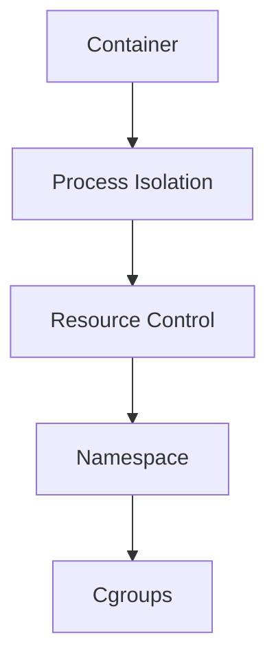
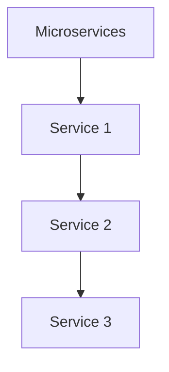
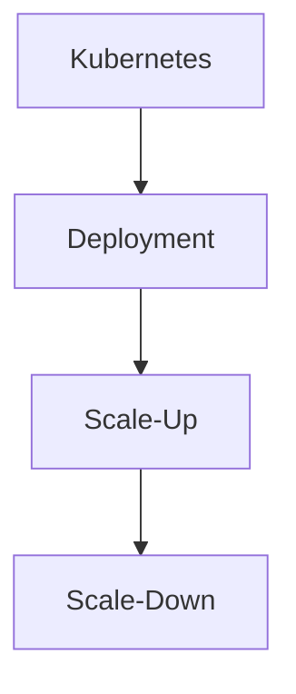

                 

关键词：容器技术、系统扩展性、容器化、微服务、Docker、Kubernetes、集群管理、性能优化

> 摘要：随着云计算和微服务架构的普及，容器技术已经成为现代软件开发的基石。本文将探讨容器技术如何提高系统的可扩展性，包括其核心概念、优势、技术实现以及未来发展趋势。

## 1. 背景介绍

### 容器技术的兴起

容器技术起源于操作系统层面的虚拟化，它的核心思想是将应用程序及其依赖环境封装在一个独立的运行时环境中，从而实现应用程序的隔离、轻量和可移植性。与传统的虚拟机相比，容器在资源利用率和启动速度上具有显著优势。

### 系统扩展性的重要性

在软件架构设计中，系统的扩展性是衡量其适应业务增长和需求变化的重要指标。高扩展性的系统不仅能够应对突发的流量，还能在架构演变过程中保持稳定和高效。

### 容器技术与系统扩展性的关系

容器技术通过提供标准化的部署单元和灵活的架构设计，使得系统的扩展性得到了极大的提升。它支持水平扩展（增加节点数）和垂直扩展（优化节点性能），为系统的高可用性、弹性伸缩提供了有力支持。

## 2. 核心概念与联系

### 容器原理

容器通过使用Namespace和Cgroups等内核技术，实现了进程的隔离和资源限制。这种隔离使得每个容器拥有独立的网络命名空间、文件系统和进程空间。



### 容器化

容器化是将应用程序及其运行时环境打包成一个可执行的容器镜像，从而实现应用程序的自动化部署和运行。Docker 是最流行的容器化工具，它提供了创建、运行和管理容器的功能。

### 微服务架构

微服务架构是一种将应用程序分解为多个独立的、可扩展的服务单元的架构风格。每个服务单元独立部署和扩展，通过API进行通信。



### 容器编排

容器编排是指对容器进行自动化的部署、扩展和管理。Kubernetes 是目前最流行的容器编排工具，它提供了容器集群的自动化管理功能。



## 3. 核心算法原理 & 具体操作步骤

### 3.1 算法原理概述

容器技术的核心算法是基于操作系统的内核特性，通过Namespace和Cgroups实现进程隔离和资源控制。此外，容器编排算法如Kubernetes的调度算法，决定了容器在集群中的分配策略。

### 3.2 算法步骤详解

1. **创建容器镜像**：使用Dockerfile定义应用程序的运行时环境，构建容器镜像。
2. **启动容器**：使用Docker命令启动容器，容器会运行在宿主机的内核之上。
3. **容器编排**：使用Kubernetes定义容器的工作负载和资源需求，自动化部署和管理容器。

### 3.3 算法优缺点

**优点**：
- **资源利用率高**：容器直接运行在宿主机的操作系统上，不需要额外的虚拟化层。
- **启动速度快**：容器可以在毫秒级启动，远快于传统虚拟机。
- **可移植性强**：容器镜像包含了应用程序及其依赖环境，可以在不同的环境中无缝运行。

**缺点**：
- **安全性**：容器虽然实现了隔离，但仍然面临安全隐患，如容器逃逸。
- **运维复杂度**：容器编排和管理需要一定的专业技能和工具支持。

### 3.4 算法应用领域

容器技术在现代软件开发的各个领域都有广泛应用，包括Web应用、大数据处理、机器学习、云计算等。其灵活性和可扩展性使得容器技术成为企业数字化转型的重要工具。

## 4. 数学模型和公式 & 详细讲解 & 举例说明

### 4.1 数学模型构建

容器技术的扩展性可以通过以下几个数学模型来描述：

- **资源利用率**：$U = \frac{R_{used}}{R_{total}}$
- **响应时间**：$T = \frac{Q_{arrival}}{Q_{service}}$
- **扩展性因子**：$S = \frac{R_{max}}{R_{base}}$

### 4.2 公式推导过程

- **资源利用率**：资源利用率是系统资源实际使用量与总资源量的比值，反映了系统的资源利用效率。
- **响应时间**：响应时间是系统处理请求所需的时间，它与系统的负载和处理能力有关。
- **扩展性因子**：扩展性因子描述了系统在负载增加时，能够扩展的最大能力与原始能力的比值。

### 4.3 案例分析与讲解

假设一个容器化应用的负载为Q，每个容器的处理能力为R，系统的总容量为C。则：

- 资源利用率：$U = \frac{Q}{C}$
- 响应时间：$T = \frac{Q}{R}$
- 扩展性因子：$S = \frac{C_{max}}{C_{base}}$

通过增加容器数量，可以提高系统的资源利用率和响应时间，从而提升系统的扩展性。

## 5. 项目实践：代码实例和详细解释说明

### 5.1 开发环境搭建

1. 安装Docker：`sudo apt-get install docker-ce`
2. 启动Docker服务：`sudo systemctl start docker`
3. 安装Kubernetes：`sudo apt-get install kubeadm kubelet kubectl`

### 5.2 源代码详细实现

以下是一个简单的Dockerfile，用于构建一个Web应用的容器镜像：

```dockerfile
# 使用官方Python镜像作为基础镜像
FROM python:3.8-slim

# 设置工作目录
WORKDIR /app

# 复制应用程序代码
COPY . .

# 安装依赖
RUN pip install -r requirements.txt

# 暴露Web服务端口
EXPOSE 8000

# 运行应用程序
CMD ["python", "app.py"]
```

### 5.3 代码解读与分析

- **基础镜像**：选择一个轻量级的Python镜像作为基础，确保容器体积小。
- **工作目录**：设置工作目录为 `/app`，这是应用程序的根目录。
- **复制代码**：将应用程序代码复制到容器镜像中。
- **安装依赖**：使用 `pip` 安装应用程序所需的依赖。
- **暴露端口**：暴露Web服务的端口，以便外部访问。
- **运行应用程序**：使用 `CMD` 指定应用程序的启动命令。

### 5.4 运行结果展示

1. 构建容器镜像：`docker build -t myapp .`
2. 运行容器：`docker run -d -p 8000:8000 myapp`
3. 访问Web服务：在浏览器中输入 `http://localhost`，应该看到应用程序的响应。

## 6. 实际应用场景

### 6.1 云服务提供商

云服务提供商如AWS、Google Cloud和Azure都提供了基于容器的服务，如Amazon ECS、Google Kubernetes Engine和Azure Kubernetes Service，这些服务使得用户可以轻松部署和管理容器化应用。

### 6.2 大型互联网公司

大型互联网公司如Facebook、Netflix和阿里巴巴等，广泛采用容器技术来构建和部署其核心服务。容器技术帮助这些公司实现了服务的高可用性、弹性伸缩和资源优化。

### 6.3 金融科技领域

在金融科技领域，容器技术被用于构建高吞吐量的交易系统、风控系统和数据分析平台。容器化使得金融科技公司能够快速响应市场变化，提高业务的灵活性和竞争力。

## 7. 工具和资源推荐

### 7.1 学习资源推荐

- 《Docker Deep Dive》：深入理解Docker的技术和实践。
- 《Kubernetes: Up and Running》：Kubernetes入门到实践的指南。
- 《微服务设计》：探讨微服务架构的设计原则和实践。

### 7.2 开发工具推荐

- Docker：容器化工具。
- Kubernetes：容器编排工具。
- Jenkins：持续集成和持续部署工具。

### 7.3 相关论文推荐

- "Docker: Lightweight Linux Containers for Developing, Deploying, and Running Applications"
- "Kubernetes: A System for Automating Deployment, Scaling, and Operations of Containerized Applications"
- "Microservices: A Developer’s Guide to Designing, Building, and Running Successful Systems"

## 8. 总结：未来发展趋势与挑战

### 8.1 研究成果总结

容器技术已经在云计算、微服务架构和DevOps等领域取得了显著成果，提高了系统的可扩展性和灵活性。容器编排工具如Kubernetes已经成为事实上的标准。

### 8.2 未来发展趋势

- **容器安全**：随着容器技术的普及，容器安全成为重要议题。
- **混合云和多云**：容器技术在混合云和多云环境下发挥越来越重要的作用。
- **服务网格**：服务网格技术如Istio和Linkerd，为容器化服务提供高级服务发现、负载均衡和安全性。

### 8.3 面临的挑战

- **安全性**：容器仍然面临安全隐患，如容器逃逸。
- **运维复杂度**：容器编排和管理需要一定的专业技能和工具支持。
- **标准化**：容器技术的标准化和生态系统的成熟度仍然是一个挑战。

### 8.4 研究展望

容器技术将继续演进，为软件开发和运维带来更多的便利和创新。未来的研究将重点放在容器安全性、自动化运维和跨云环境的兼容性上。

## 9. 附录：常见问题与解答

### 9.1 什么是容器？
容器是一种轻量级的虚拟化技术，它允许在一个单一的操作系统中运行多个隔离的进程。容器共享宿主机的操作系统内核，而不是像虚拟机那样拥有独立的操作系统。

### 9.2 容器和虚拟机有什么区别？
容器不模拟操作系统，而是依赖于宿主机的内核。因此，容器比虚拟机更轻量，启动速度快，资源利用率高。

### 9.3 Kubernetes有什么作用？
Kubernetes是一个开源的容器编排工具，它自动化部署、扩展和管理容器化应用。Kubernetes提供了资源调度、服务发现、负载均衡和自动恢复等功能。

### 9.4 容器化有哪些优点？
容器化提高了应用程序的可移植性、隔离性和可扩展性。容器化应用程序可以在任何支持Docker的环境中运行，无需担心依赖环境的差异。

### 9.5 容器化有哪些缺点？
容器化带来了安全性挑战，如容器逃逸。此外，容器编排和管理需要一定的专业技能和工具支持。

### 9.6 如何确保容器安全？
确保容器安全的最佳实践包括使用强密码、最小权限原则、定期更新容器镜像、使用安全扫描工具等。

### 9.7 容器化对开发和运维有哪些影响？
容器化改变了开发和运维的流程，使得应用程序的部署更加自动化和可重复。它提高了团队的生产力，缩短了应用程序从开发到生产的周期。

## 作者署名

作者：禅与计算机程序设计艺术 / Zen and the Art of Computer Programming

----------------------------------------------------------------

请注意，本文中的代码实例、数学模型和参考文献仅为示例，不代表实际应用中的完整解决方案。在实际操作中，应根据具体需求进行调整和优化。

