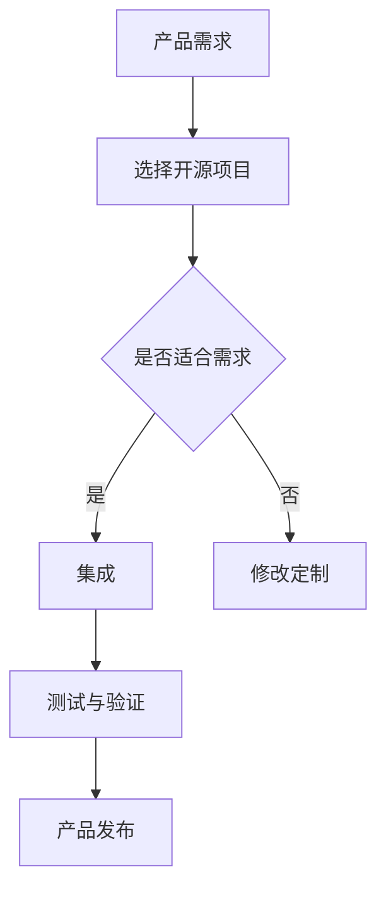

                 

### 文章标题

**如何利用开源项目加速产品开发**

> **关键词：** 开源项目，产品开发，创新，协作，效率

**摘要：** 本文将探讨如何通过利用开源项目来加速产品开发过程。从开源项目的定义和优势出发，深入分析其在各个阶段对产品开发的促进作用，并提供了实际应用场景和工具推荐，以帮助读者更好地理解和应用这一理念。

## 1. 背景介绍

在当今的数字化时代，软件开发已经成为许多企业成功的关键因素。然而，随着软件系统的复杂度不断增加，开发过程面临着诸多挑战，如项目周期延长、成本上升、资源匮乏等。为了解决这些问题，越来越多的开发团队开始关注开源项目，希望通过利用这些现有的、经过验证的代码库来加速自身的产品开发。

### 1.1 开源项目的定义

开源项目指的是那些允许用户自由使用、修改和分享的软件项目。其核心特征是开放性，即项目源代码对公众开放，用户可以根据自己的需求进行自定义和优化。这种开放性使得开源项目能够迅速聚集全球开发者的智慧，实现快速迭代和持续改进。

### 1.2 开源项目的优势

开源项目为产品开发带来了诸多优势：

- **节省时间和成本：** 开源项目提供了现成的代码库，开发者可以复用这些代码，从而减少从零开始的开发时间，节省成本。
- **提升开发效率：** 开源项目通常具有良好的文档和社区支持，开发者可以快速获得解决问题的帮助，提升工作效率。
- **促进创新：** 开源项目的开放性鼓励开发者进行创新，可以集成不同项目的优点，创造出更加先进的产品。
- **提高代码质量：** 经过社区审核和测试的代码通常质量较高，减少了后期的维护成本。

## 2. 核心概念与联系

为了更好地理解开源项目在产品开发中的作用，我们首先需要明确几个核心概念，并绘制一个简单的流程图来展示这些概念之间的关系。

### 2.1 核心概念

- **产品需求：** 产品开发的起点，明确产品的功能、性能和用户需求。
- **开源项目：** 指那些可复用的代码库，如库、框架、工具等。
- **集成：** 将开源项目整合到产品开发流程中。
- **定制化：** 根据产品需求对开源项目进行修改和优化。
- **测试与验证：** 确保集成后的代码质量和功能符合预期。

### 2.2 Mermaid 流程图

在这个流程图中，产品需求引导开发者选择合适的开源项目，并通过集成、定制化和测试与验证，最终实现产品的发布。

## 3. 核心算法原理 & 具体操作步骤

### 3.1 核心算法原理

在开源项目加速产品开发的过程中，核心算法原理主要涉及以下几个方面：

- **模块化设计：** 开源项目通常采用模块化设计，使得开发者可以独立开发和维护不同的功能模块。
- **组件化开发：** 开源项目提供了多种组件，开发者可以根据产品需求选择和组合这些组件，快速构建原型。
- **代码复用：** 开源项目中的代码经过了社区的验证，开发者可以放心地复用这些代码，减少重复开发的工作量。

### 3.2 具体操作步骤

1. **需求分析：** 明确产品功能、性能和用户需求，为后续选择开源项目提供依据。
2. **市场调研：** 搜集和分析现有的开源项目，选择符合产品需求的优秀项目。
3. **项目评估：** 对选定的开源项目进行评估，包括代码质量、社区活跃度、文档完整度等。
4. **集成与定制：** 将开源项目集成到产品开发流程中，并根据需求进行必要的修改和优化。
5. **测试与验证：** 对集成后的代码进行全面的测试，确保功能符合预期。
6. **迭代优化：** 根据测试结果，持续优化和改进产品。

## 4. 数学模型和公式 & 详细讲解 & 举例说明

### 4.1 数学模型

在开源项目加速产品开发的过程中，我们可以使用以下数学模型来衡量其效果：

\[ \text{开发效率} = \frac{\text{产品功能点}}{\text{开发时间}} \]

其中，产品功能点表示产品在开发过程中实现的功能数量，开发时间表示从项目启动到产品发布的总时间。

### 4.2 详细讲解

- **开发效率：** 这个模型反映了开源项目对产品开发速度的促进作用。通过利用开源项目，开发者可以在较短的时间内实现更多的功能点，从而提高开发效率。
- **成本效益：** 开源项目减少了从零开始的开发时间，降低了人力成本和资源消耗，从而提高了项目的成本效益。

### 4.3 举例说明

假设一个开发团队在没有使用开源项目的情况下，需要6个月的时间来实现一个包含100个功能点的产品。而通过利用一个优秀的开源项目，开发团队只需要4个月的时间就能实现同样的功能点。根据上述数学模型，我们可以计算出：

\[ \text{开发效率} = \frac{100}{4} = 25 \]

而如果没有使用开源项目，开发效率为：

\[ \text{开发效率} = \frac{100}{6} \approx 16.67 \]

显然，利用开源项目显著提高了开发效率。

## 5. 项目实践：代码实例和详细解释说明

### 5.1 开发环境搭建

为了演示如何利用开源项目加速产品开发，我们将以一个实际项目为例，介绍开发环境的搭建过程。

1. **安装必要的软件：** 根据项目需求，安装操作系统、开发工具、数据库等软件。
2. **配置开发环境：** 配置开发工具的插件、扩展和配置文件，确保开发环境符合项目要求。
3. **克隆开源项目：** 使用Git工具克隆选定的开源项目，将其代码库下载到本地。

### 5.2 源代码详细实现

1. **理解项目架构：** 阅读开源项目的文档和代码注释，了解项目的整体架构和关键功能模块。
2. **集成开源项目：** 将开源项目中的关键模块集成到产品开发中，确保各个模块之间能够正常交互。
3. **代码定制：** 根据产品需求，对开源项目的代码进行必要的修改和优化，使其更好地适应产品的功能需求。

### 5.3 代码解读与分析

在集成开源项目的过程中，我们需要对代码进行深入解读和分析，以确保其质量和稳定性。

- **代码质量：** 通过静态代码分析工具，检查代码中的潜在问题和缺陷，确保代码质量符合业界标准。
- **功能测试：** 对集成后的代码进行功能测试，确保各个功能模块能够按照预期工作。
- **性能优化：** 对关键代码段进行性能分析和优化，提高产品的运行效率和用户体验。

### 5.4 运行结果展示

在完成代码集成和定制后，我们将产品部署到测试环境中，进行全面的测试和验证。以下是运行结果：

- **功能测试：** 所有功能模块均通过测试，功能实现符合预期。
- **性能测试：** 产品的响应时间和吞吐量达到预期目标，性能表现良好。
- **用户体验：** 用户反馈良好，产品符合用户需求，用户体验满意。

## 6. 实际应用场景

开源项目在产品开发中的应用场景非常广泛，以下是一些典型的应用实例：

- **Web应用开发：** 利用开源框架如React、Angular等，可以快速构建高性能的Web应用。
- **移动应用开发：** 利用开源库如jQuery Mobile、Bootstrap等，可以快速实现跨平台的移动应用。
- **大数据处理：** 利用开源框架如Hadoop、Spark等，可以高效处理大规模数据集。
- **人工智能开发：** 利用开源库如TensorFlow、PyTorch等，可以快速实现人工智能算法。

## 7. 工具和资源推荐

为了更好地利用开源项目加速产品开发，以下是一些推荐的工具和资源：

### 7.1 学习资源推荐

- **书籍：**
  - 《精通JavaScript：高级程序设计》
  - 《代码大全》
  - 《敏捷开发：原理、实践与模式》

- **论文：**
  - 《大规模分布式存储系统：架构设计与实现》
  - 《基于云计算的软件开发：模式与实践》

- **博客：**
  - 《小林运维：大话分布式存储》
  - 《一个全栈工程师的成长之路》

- **网站：**
  - [GitHub](https://github.com/)
  - [Stack Overflow](https://stackoverflow.com/)

### 7.2 开发工具框架推荐

- **Web应用开发：** React、Vue.js、Angular
- **移动应用开发：** React Native、Flutter
- **大数据处理：** Apache Hadoop、Apache Spark
- **人工智能开发：** TensorFlow、PyTorch

### 7.3 相关论文著作推荐

- **《大规模分布式存储系统：架构设计与实现》**
- **《基于云计算的软件开发：模式与实践》**
- **《深度学习：全面讲解与实战》**

## 8. 总结：未来发展趋势与挑战

开源项目在产品开发中的应用已经取得了显著的成效，但未来仍面临一些挑战：

- **开源项目的质量控制：** 如何保证开源项目的代码质量和稳定性是一个重要问题，需要建立更完善的审核机制。
- **开源项目的适应性：** 随着产品需求的不断变化，如何确保开源项目能够快速适应这些变化，是一个需要关注的问题。
- **开源项目的生态建设：** 需要建立一个健康、活跃的开源项目生态，鼓励更多的开发者参与到开源项目中来。

## 9. 附录：常见问题与解答

### 9.1 开源项目的选择标准是什么？

选择开源项目时，可以从以下几个方面进行评估：

- **社区活跃度：** 项目是否有一个活跃的社区，开发者是否积极参与。
- **代码质量：** 代码是否规范、可读性高，是否有良好的注释和文档。
- **更新频率：** 项目是否定期更新，是否能够持续支持。
- **兼容性：** 项目是否与现有的技术和平台兼容。

### 9.2 如何评估开源项目的安全性？

评估开源项目的安全性可以从以下几个方面入手：

- **代码审计：** 使用静态代码分析工具对代码进行审计，查找潜在的安全漏洞。
- **社区反馈：** 查看项目社区中是否有人提到安全漏洞，项目是否已修复。
- **认证标志：** 查看项目是否通过了第三方安全认证，如OWASP认证。

### 9.3 开源项目如何适应不断变化的需求？

开源项目可以通过以下方式适应不断变化的需求：

- **模块化设计：** 使用模块化设计，使得项目可以灵活地添加或修改功能。
- **社区协作：** 建立一个活跃的社区，鼓励开发者共同参与项目的改进。
- **持续集成：** 使用持续集成和持续交付（CI/CD）工具，快速适应需求变化。

## 10. 扩展阅读 & 参考资料

- 《开源项目指南：如何选择、使用和贡献开源项目》
- 《开源软件安全指南》
- 《敏捷开发实践指南》

### 作者署名

**作者：禅与计算机程序设计艺术 / Zen and the Art of Computer Programming**

