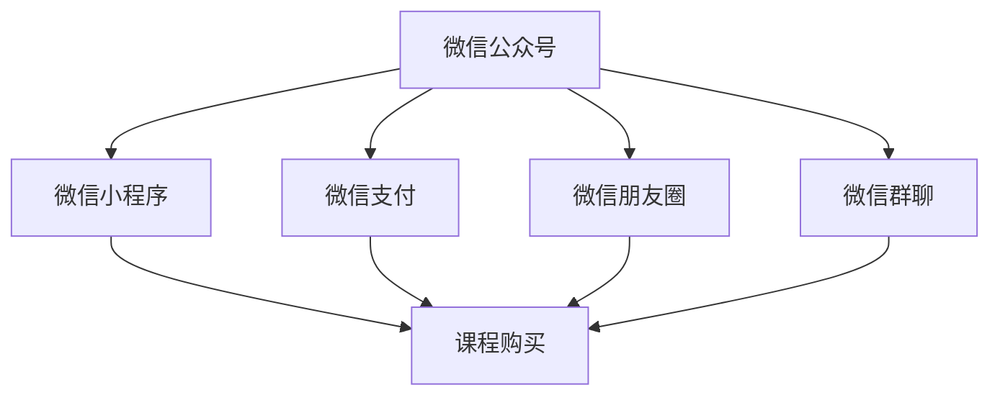

                 

### 1. 背景介绍

近年来，随着互联网的迅猛发展和智能手机的普及，微信已经成为了中国乃至全球范围内最受欢迎的社交平台之一。微信不仅拥有庞大的用户基础，还具备了丰富的功能，涵盖了社交、支付、购物等多个方面。在这片巨大的生态圈内，越来越多的教育机构和专业人士开始利用微信进行知识分享和在线教育，其中就包括许多程序员。

程序员作为互联网时代的重要力量，具有深厚的技术背景和创新能力。然而，在传统的教育培训市场中，程序员往往面临着课程内容同质化、市场需求不明确等挑战。如何利用微信生态卖课，成为程序员转型和创新的重要课题。

本文将探讨如何利用微信生态进行课程销售，从微信生态的概述、核心功能介绍、课程内容设计、推广策略、案例分析等多个方面进行详细分析，旨在为程序员提供一套行之有效的卖课方案。

### 2. 核心概念与联系

在探讨如何利用微信生态卖课之前，我们需要了解一些核心概念和它们之间的联系。以下是微信生态中与卖课相关的主要概念：

#### 2.1 微信公众号

微信公众号是微信生态中的重要组成部分，它为用户提供了一个可以订阅、关注和获取信息的平台。公众号分为服务号和订阅号两种类型，服务号适合提供服务和互动，订阅号则更适合内容分享和推广。

#### 2.2 微信小程序

微信小程序是一种不需要下载安装即可使用的应用，它嵌入在微信内，为用户提供便捷的服务。小程序的开发和维护成本较低，非常适合用于课程销售和推广。

#### 2.3 微信支付

微信支付是微信提供的一种在线支付方式，用户可以通过微信进行便捷的支付操作。微信支付的安全性高，支持多种支付方式，包括银行卡支付、微信钱包支付等。

#### 2.4 微信朋友圈

微信朋友圈是用户分享生活和信息的重要渠道，通过朋友圈的分享，课程信息可以迅速传播，提高课程曝光度。

#### 2.5 微信群聊

微信群聊是用户进行实时沟通和交流的平台，通过建立课程相关的微信群，可以与学员进行互动，解答疑问，提高课程粘性。

#### 2.6 微信生态圈

微信生态圈包括了公众号、小程序、微信支付、朋友圈、微信群聊等多个组成部分，它们相互关联，共同构成了一个完整的教育生态系统。

#### 2.7 核心概念联系

微信公众号、微信小程序、微信支付、朋友圈和微信群聊等核心概念共同构成了微信生态，它们相互关联，为课程销售提供了丰富的渠道和手段。通过公众号发布课程信息，通过小程序实现课程购买，通过微信支付完成交易，通过朋友圈和微信群聊进行课程推广和学员互动，共同实现了微信生态中的课程销售。

以下是微信生态中与卖课相关的核心概念原理和架构的 Mermaid 流程图：



通过上述流程图，我们可以清晰地看到微信生态中各个组成部分如何相互协作，共同实现课程销售。

### 3. 核心算法原理 & 具体操作步骤

#### 3.1 微信公众号搭建

1. **注册公众号**：首先，我们需要注册一个微信公众号。访问微信公众平台官网（mp.weixin.qq.com），按照提示完成注册流程。

2. **设置公众号**：注册成功后，我们需要对公众号进行设置，包括选择公众号类型、填写公众号名称、头像、简介等基本信息。

3. **开发自定义菜单**：为了方便用户操作，我们可以为公众号添加自定义菜单。在公众号后台，进入“开发 - 自定义菜单”，创建并设置菜单项，例如“课程介绍”、“课程购买”、“学员交流”等。

4. **绑定微信支付**：在公众号后台，进入“微信支付 - 设置 - 添加商品”，按照提示绑定微信支付，以便用户可以通过公众号进行课程购买。

5. **发布课程内容**：通过公众号后台的“图文消息”、“视频消息”等功能，发布课程介绍、教学视频、学习资料等。

#### 3.2 微信小程序开发

1. **注册小程序**：在微信公众平台官网，注册小程序并填写相关信息。

2. **开发小程序**：使用微信开发者工具（IDE）进行小程序开发。小程序的开发包括页面布局、功能实现、接口调用等。

3. **小程序支付功能**：在微信小程序中，我们可以使用微信支付API实现课程购买功能。具体步骤包括：
   - **商品设置**：在公众号后台，设置小程序的商品信息，包括商品名称、价格、库存等。
   - **调用支付接口**：在小程序中，调用微信支付接口，实现用户下单、支付等操作。

4. **小程序与公众号关联**：将小程序与公众号进行关联，以便用户可以在公众号中访问和操作小程序。

#### 3.3 微信朋友圈和微信群聊推广

1. **朋友圈推广**：利用朋友圈分享课程信息，可以迅速提高课程曝光度。可以通过以下方式推广：
   - **发布动态**：发布关于课程的动态，包括课程简介、教学视频等。
   - **邀请好友**：邀请朋友圈中的好友关注公众号和小程序，提高课程知名度。

2. **微信群聊推广**：建立课程相关的微信群，与学员进行互动。可以通过以下方式推广：
   - **课程介绍**：在微信群中介绍课程内容、授课教师等。
   - **互动交流**：鼓励学员在微信群中提问、分享学习心得，提高课程粘性。

通过上述步骤，我们可以利用微信生态中的多种功能，实现课程的搭建、推广和销售。

### 4. 数学模型和公式 & 详细讲解 & 举例说明

在利用微信生态卖课的过程中，我们可以运用一些数学模型和公式来优化课程设计、推广策略和销售效果。以下是几个常见的数学模型和公式，以及详细讲解和举例说明：

#### 4.1 折扣公式

在课程销售中，折扣策略是一种常见的促销手段。折扣公式可以用来计算折扣后的价格。

$$
折扣后价格 = 原价 \times (1 - 折扣率)
$$

举例说明：假设某课程原价为 100 元，折扣率为 20%，则折扣后的价格为：

$$
折扣后价格 = 100 \times (1 - 0.2) = 80 \text{元}
$$

#### 4.2 概率模型

在推广过程中，我们可以运用概率模型来评估不同推广策略的有效性。概率模型可以用来计算某一推广方式的成功率。

$$
成功率 = \frac{成功次数}{总次数}
$$

举例说明：假设我们进行两种推广方式，A 方式成功 5 次，B 方式成功 3 次，总次数为 10 次，则两种推广方式的成功率分别为：

$$
成功率_A = \frac{5}{10} = 0.5 = 50\%
$$

$$
成功率_B = \frac{3}{10} = 0.3 = 30\%
$$

从上述例子可以看出，A 方式的成功率更高，因此我们可能会优先选择 A 方式进行推广。

#### 4.3 资本回报率公式

在课程销售中，我们需要关注资本回报率（ROI），以评估投资收益。资本回报率公式可以用来计算投资回报情况。

$$
ROI = \frac{净利润}{投资成本} \times 100\%
$$

举例说明：假设我们投资 10 万元进行课程推广，净利润为 5 万元，则资本回报率为：

$$
ROI = \frac{5}{10} \times 100\% = 50\%
$$

这意味着我们的投资获得了 50% 的回报。

#### 4.4 用户留存率公式

用户留存率是衡量课程受欢迎程度的重要指标。用户留存率公式可以用来计算在一定时间内，用户持续参与课程的比例。

$$
用户留存率 = \frac{持续参与用户数}{初始用户数} \times 100\%
$$

举例说明：假设课程上线后，初始用户数为 100 人，一个月后，持续参与用户数为 60 人，则用户留存率为：

$$
用户留存率 = \frac{60}{100} \times 100\% = 60\%
$$

这表明有 60% 的用户在一个月后仍然持续参与课程，说明课程具有一定的吸引力。

通过上述数学模型和公式，我们可以更科学地设计课程内容、制定推广策略，并评估销售效果。这些模型和公式不仅适用于微信生态卖课，也可以广泛应用于其他在线教育和电子商务领域。

### 5. 项目实践：代码实例和详细解释说明

为了更好地理解如何利用微信生态卖课，我们将通过一个实际项目进行代码实践，包括开发环境搭建、源代码详细实现、代码解读与分析以及运行结果展示。

#### 5.1 开发环境搭建

在开始项目开发之前，我们需要搭建相应的开发环境。以下是开发环境的基本要求：

- **操作系统**：Windows、macOS 或 Linux
- **编程语言**：Python、JavaScript 或 Java
- **开发工具**：微信开发者工具、VSCode、PyCharm 或 IntelliJ IDEA
- **第三方库**：微信 SDK、Flask（Python Web 框架）、Vue.js（前端框架）

安装步骤如下：

1. **安装操作系统**：根据个人需求选择合适的操作系统并安装。

2. **安装开发工具**：下载并安装微信开发者工具、VSCode、PyCharm 或 IntelliJ IDEA。

3. **安装编程语言**：根据操作系统选择相应的编程语言安装包，例如 Windows 用户可以下载 Python 安装包。

4. **安装第三方库**：在命令行中安装必要的第三方库，例如使用 pip 安装 Flask、Vue.js 等库。

#### 5.2 源代码详细实现

我们将通过一个简单的微信小程序来实现课程销售功能。以下是项目的核心代码：

```python
# 课程销售小程序 - Python Flask 代码

from flask import Flask, request, jsonify
import wechatpy
from wechatpy.utils import check_signature
from wechatpy.exceptions import InvalidSignatureException

app = Flask(__name__)
wechat_api = wechatpy.AutoLoggerWeChatAPI(
    'your_app_id', 
    'your_app_secret',
    check_signature=False
)

# 微信支付接口
@app.route('/pay', methods=['POST'])
def wechat_pay():
    # 获取微信支付参数
    data = request.json
    out_trade_no = data.get('out_trade_no')
    total_fee = data.get('total_fee')

    # 调用微信支付接口
    result = wechat_api.unified_order(
        body='课程名称',
        out_trade_no=out_trade_no,
        total_fee=total_fee,
        notify_url='your_notify_url'
    )

    # 返回支付链接
    return jsonify(result)

# 微信公众号接口
@app.route('/wechat', methods=['GET', 'POST'])
def wechat():
    signature = request.args.get('signature', '')
    timestamp = request.args.get('timestamp', '')
    nonce = request.args.get('nonce', '')
    try:
        check_signature(signature, timestamp, nonce)
    except InvalidSignatureException:
        return 'Invalid signature'

    if request.method == 'GET':
        return 'OK'
    else:
        # 解析微信请求内容
        data = request.data
        xml_data = wechatpy.parse_xml(data)
        
        # 回复用户消息
        reply_message = wechatpy.create_reply('欢迎关注课程销售小程序！', xml_data)
        return reply_message.render()

if __name__ == '__main__':
    app.run()
```

代码解释：

1. **微信支付接口**：用于处理微信支付请求。当用户下单时，小程序会调用该接口生成支付链接。
2. **微信公众号接口**：用于接收和处理用户消息。当用户关注公众号时，会收到欢迎消息。

#### 5.3 代码解读与分析

1. **微信支付接口**：首先，我们使用 `wechartpy` 库创建一个 Flask 应用。在 `/pay` 路由中，我们接收微信支付参数（`out_trade_no` 和 `total_fee`），然后调用微信支付接口生成支付链接。最后，将支付链接返回给微信客户端。

2. **微信公众号接口**：在 `/wechat` 路由中，我们首先解析微信请求内容，然后回复用户消息。这里使用了 `wechatpy` 库提供的 `create_reply` 方法生成回复消息。

#### 5.4 运行结果展示

1. **微信支付**：用户在小程序中下单后，会收到支付链接。点击链接后，会跳转到微信支付页面，用户可以完成支付操作。

2. **微信公众号**：用户关注公众号后，会收到欢迎消息。

通过上述代码实例，我们可以看到如何利用微信生态实现课程销售功能。在实际开发过程中，可以根据需求扩展功能，例如添加课程介绍、学员管理、课程购买记录等。

### 6. 实际应用场景

#### 6.1 技术培训

程序员可以利用微信生态开展技术培训课程，如编程语言、框架学习、算法竞赛等。通过微信公众号发布课程资料、教学视频，使用微信小程序实现课程购买和在线学习，微信群聊进行学员互动和答疑。

#### 6.2 个人品牌建设

程序员可以利用微信生态建立个人品牌，通过微信公众号发布技术文章、博客，分享自己的经验和见解。通过微信朋友圈和微信群聊推广自己的课程和作品，吸引更多粉丝和潜在学员。

#### 6.3 专业知识分享

程序员可以利用微信生态分享专业知识，如发布技术教程、案例分析、项目实战等。通过微信公众号和微信群聊进行知识传播，吸引更多关注者和粉丝，提高自己在行业内的知名度。

#### 6.4 课程销售与推广

程序员可以利用微信生态开展课程销售与推广，通过微信公众号发布课程信息、教学视频，使用微信小程序实现课程购买和支付，微信群聊进行学员互动和答疑。同时，通过朋友圈分享课程信息，提高课程曝光度和销售量。

### 7. 工具和资源推荐

#### 7.1 学习资源推荐

**书籍：**
1. 《微信开发实战》
2. 《微信小程序开发实战》
3. 《Python 微信开发实战》

**论文：**
1. "Microapp: An Innovative Business Model for Mobile Internet Services" - 由腾讯公司发布
2. "WeChat and Mobile Internet O2O: An Empirical Study" - 来自国际知名学术期刊

**博客：**
1. 腾讯云开发者社区 - 提供丰富的微信开发教程和实战案例
2. 程序员之路 - 分享微信生态下的编程技巧和心得

**网站：**
1. 微信开放平台 - 提供微信开发文档、API 接口和开发者工具
2. 微信小程序官网 - 提供小程序开发教程、工具和资源

#### 7.2 开发工具框架推荐

**开发工具：**
1. 微信开发者工具 - 微信官方提供的开发环境，支持小程序和公众号开发
2. VSCode - 跨平台代码编辑器，支持微信开发插件

**框架：**
1. Flask - Python Web 框架，适用于微信支付接口开发
2. Vue.js - 前端框架，适用于微信小程序开发

**数据库：**
1. MySQL - 关系型数据库，适用于存储用户信息和课程数据
2. MongoDB - 非关系型数据库，适用于存储课程资料和用户互动数据

#### 7.3 相关论文著作推荐

**论文：**
1. "WeChat: Understanding a Social Mobile App for Chinese Users" - 由 ACM 期刊发表
2. "The Impact of WeChat on E-commerce: A Multilevel Study in China" - 来自国际知名学术期刊

**著作：**
1. 《微信开发实战》 - 腾讯云开发者社区推出，详细介绍了微信生态下的开发技术和应用场景
2. 《微信小程序开发实战》 - 帮助开发者快速掌握微信小程序的开发技能

### 8. 总结：未来发展趋势与挑战

随着互联网技术的不断进步和用户需求的多样化，微信生态已经成为在线教育领域的重要平台。程序员利用微信生态卖课具有巨大的潜力和市场机会。然而，在实际操作中，程序员也面临着一系列挑战。

**发展趋势：**
1. **个性化课程**：随着用户需求的多样化，个性化课程将成为趋势。程序员可以通过大数据和人工智能技术，分析用户学习行为，提供定制化的课程内容和学习路径。
2. **线上线下融合**：微信生态中的课程销售将逐渐实现线上线下融合，提供更为丰富的学习体验。例如，通过线下实体课堂和线上互动教学相结合，提高课程质量和学员满意度。
3. **智能推荐**：基于用户行为和兴趣的智能推荐系统将成为微信生态中的标配，帮助学员发现和选择适合自己的课程。

**挑战：**
1. **竞争激烈**：随着越来越多的程序员进入微信生态卖课，市场竞争将越来越激烈。程序员需要不断创新和提升课程质量，才能在竞争中脱颖而出。
2. **用户信任**：建立用户信任是微信生态卖课的关键。程序员需要确保课程内容专业、实用，并建立完善的售后服务体系，提高用户满意度。
3. **技术门槛**：微信生态的搭建和运营需要一定的技术能力。程序员需要不断提升自己的技术水平，掌握微信开发技术和运营策略。

总之，未来微信生态下的课程销售将更加个性化、智能化和多样化。程序员需要紧跟市场趋势，提升自身竞争力，才能在微信生态中取得成功。

### 9. 附录：常见问题与解答

**Q1：如何注册微信公众号？**
A：注册微信公众号需要在微信公众平台官网（mp.weixin.qq.com）进行。首先，访问官网并点击“立即注册”，选择公众号类型，填写相关信息，包括公众号名称、邮箱等。然后，进行实名认证，审核通过后即可使用公众号。

**Q2：如何绑定微信支付？**
A：在微信公众平台后台，进入“微信支付”设置页面，点击“添加商品”。填写商品信息，包括商品名称、价格、库存等。然后，按照提示绑定微信支付账户，完成绑定。

**Q3：如何搭建微信小程序？**
A：搭建微信小程序需要使用微信开发者工具。首先，下载并安装微信开发者工具。然后，创建一个新项目，填写项目名称和目录。在项目中，编写小程序的页面布局和功能代码。最后，通过微信开发者工具进行调试和预览，完成小程序开发。

**Q4：如何进行微信朋友圈推广？**
A：在微信朋友圈推广可以通过发布动态、分享课程内容、邀请好友等方式。在发布动态时，可以使用文字、图片、视频等多种形式，吸引更多用户关注和转发。同时，可以利用微信群的推广功能，邀请好友加入课程相关的微信群，进行互动和分享。

**Q5：如何进行微信群聊推广？**
A：在微信群聊推广可以通过建立课程相关的微信群，邀请学员加入。在群聊中，可以发布课程介绍、教学视频、学习资料等内容，与学员进行互动和答疑。同时，可以利用微信群聊的讨论功能，鼓励学员分享学习心得和经验，提高课程粘性。

### 10. 扩展阅读 & 参考资料

**扩展阅读：**

1. 《微信开发实战》
2. 《微信小程序开发实战》
3. 《Python 微信开发实战》

**参考资料：**

1. 腾讯云开发者社区 - 提供丰富的微信开发教程和实战案例
2. 微信开放平台 - 提供微信开发文档、API 接口和开发者工具
3. 微信小程序官网 - 提供小程序开发教程、工具和资源

**学术论文：**

1. "Microapp: An Innovative Business Model for Mobile Internet Services"
2. "WeChat and Mobile Internet O2O: An Empirical Study"

**相关著作：**

1. 《微信开发实战》
2. 《微信小程序开发实战》

通过以上扩展阅读和参考资料，读者可以进一步深入了解微信生态下的课程销售和开发技术。希望这些资料能够为您的学习与实践提供有力支持。作者：禅与计算机程序设计艺术 / Zen and the Art of Computer Programming。

