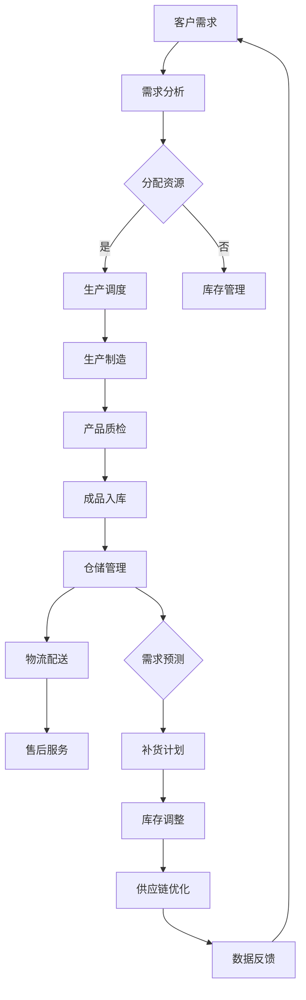

                 

### 1. 背景介绍

随着全球经济的快速发展和信息技术的不断创新，物联网（IoT）技术逐渐成为现代创业生态系统中的关键推动力。物联网技术通过将物理世界中的各种设备、传感器和系统连接到互联网，实现了数据的实时采集、传输和分析，为创业公司带来了前所未有的机遇和挑战。

首先，从宏观角度来看，物联网技术的兴起使得供应链管理的透明度和效率得以显著提升。传统的供应链管理往往依赖于手工记录和人工干预，信息传递滞后且容易出现错误。而物联网技术的引入，使得供应链中的各个环节能够实时共享信息，从原材料采购、生产制造到物流配送，都能实现无缝对接和高效运作。这大大降低了运营成本，提高了整个供应链的响应速度和灵活性。

其次，物联网技术还为创业公司提供了大量的数据资源。通过对供应链中实时数据的收集和分析，企业可以更准确地掌握市场需求、库存水平、运输状态等信息，从而做出更为科学的决策。此外，物联网技术还能够实现设备的远程监控和维护，减少设备故障率和停机时间，提高设备的利用效率。

然而，物联网技术在供应链优化中也面临着一些挑战。首先，物联网设备的数量和种类繁多，如何确保这些设备之间的互联互通成为了一大难题。其次，大规模数据传输和处理需要强大的计算能力和高效的算法支持，这对创业公司的技术实力提出了更高的要求。此外，数据安全和隐私保护也是物联网技术发展的重要议题，如何确保数据的安全性和隐私性，避免数据泄露和滥用，是企业必须面对的问题。

总的来说，物联网技术在供应链优化中具有巨大的潜力，但同时也需要克服一系列技术和管理上的挑战。在接下来的章节中，我们将深入探讨物联网技术在供应链优化中的核心概念、算法原理、数学模型和实际应用，以帮助创业者更好地把握这一技术红利。

### 2. 核心概念与联系

#### 物联网（IoT）的基本概念

物联网（Internet of Things，简称IoT）是指通过互联网将各种日常物品连接起来，实现信息的自动交换和智能控制。这些物品包括但不限于家用电器、工业设备、车辆、医疗设备等。物联网的核心在于将物理世界与数字世界相结合，使得物品能够通过传感器、网络和软件实现互联互通，从而实现智能化管理和自动化控制。

#### 供应链（SCM）的基本概念

供应链管理（Supply Chain Management，简称SCM）是指企业为了满足客户需求，对从原材料采购、生产、库存管理、物流配送到售后服务等各个环节进行系统化管理和优化。供应链管理的目标是提高整个供应链的效率、降低成本、提升客户满意度，并最终实现企业的可持续发展。

#### 物联网与供应链的融合

物联网与供应链管理的融合，实质上是通过物联网技术对供应链中的各个环节进行智能化升级。具体来说，这种融合主要体现在以下几个方面：

1. **实时数据采集**：物联网技术通过传感器和RFID（射频识别）等技术，实现对供应链各环节的实时数据采集。例如，在仓储管理中，物联网技术可以实时监测货物的存储状态、库存水平等信息。

2. **智能监控**：物联网技术可以实现对供应链中运输车辆、设备等实时状态的监控，确保物流过程的透明性和可控性。例如，通过GPS和传感器技术，可以实时跟踪货物的运输路线、行驶速度等信息。

3. **自动化决策**：通过对采集到的实时数据进行分析，物联网技术可以支持供应链管理的自动化决策。例如，根据市场需求和库存水平，自动调整生产计划、补货策略等。

4. **协同管理**：物联网技术可以实现供应链各环节之间的信息共享和协同管理。例如，生产商可以实时了解原材料供应商的库存情况，从而合理安排生产进度。

#### Mermaid 流程图

为了更好地理解物联网与供应链融合的原理和架构，我们使用Mermaid语言绘制了一个简化的流程图。以下是流程图的具体内容：



**流程说明：**

- **客户需求**：客户提出需求，企业接收并进行分析。
- **需求分析**：根据客户需求，分析所需资源并进行分配。
- **生产调度**：如果资源充足，进行生产调度；否则，转向库存管理。
- **生产制造**：进行生产制造，并进行产品质检。
- **成品入库**：质检合格的产品入库，进入仓储管理。
- **仓储管理**：实时监测货物存储状态和库存水平。
- **物流配送**：根据订单信息，安排货物配送。
- **售后服务**：提供售后服务，收集客户反馈。
- **需求预测**：根据历史数据和实时信息，预测未来需求。
- **补货计划**：根据需求预测，制定补货计划。
- **库存调整**：根据补货计划，调整库存水平。
- **供应链优化**：对整个供应链进行持续优化，以提高效率和降低成本。
- **数据反馈**：将优化后的数据反馈至需求分析环节，以指导后续工作。

通过上述流程，我们可以看到物联网技术在供应链管理中如何发挥重要作用，实现各个环节的协同优化。在接下来的章节中，我们将进一步探讨物联网技术的核心算法原理和具体操作步骤，以帮助创业者更好地应用这一技术。

### 3. 核心算法原理 & 具体操作步骤

#### 物联网设备数据采集与传输

物联网技术的核心在于设备数据的采集与传输。首先，各种传感器（如温度传感器、湿度传感器、GPS等）会被安装在供应链中的各个环节，实时采集环境数据或设备状态数据。这些传感器通过无线网络（如Wi-Fi、蓝牙、Zigbee等）将数据传输至边缘计算设备或云端服务器。

**具体操作步骤：**

1. **设备部署**：在供应链的各个环节部署物联网传感器，确保数据的全面覆盖。
2. **数据采集**：传感器实时采集环境或设备状态数据，如温度、湿度、位置信息等。
3. **数据传输**：通过无线网络将采集到的数据传输至边缘计算设备或云端服务器。

#### 边缘计算与云计算的协同作用

在物联网设备数据采集完成后，边缘计算与云计算共同发挥作用，对数据进行处理和分析。

**具体操作步骤：**

1. **数据预处理**：在边缘设备上进行初步的数据清洗和格式化，去除冗余数据和异常值。
2. **边缘计算**：边缘设备对数据进行实时处理，执行简单的计算任务，如状态监控、异常检测等。
3. **数据上传**：将预处理后的数据上传至云端服务器，进行更深层次的数据分析。
4. **云计算**：在云端服务器上，利用大数据分析和人工智能算法，对上传的数据进行深度挖掘，生成洞察和决策支持。

#### 数据分析与智能决策

物联网技术的核心价值在于通过对数据的分析和处理，为供应链管理提供智能决策支持。

**具体操作步骤：**

1. **数据存储**：将物联网设备采集到的数据存储在云端数据库中，确保数据的安全和可靠。
2. **数据清洗**：对存储的数据进行清洗，去除重复数据和噪声数据，提高数据质量。
3. **数据挖掘**：利用数据挖掘算法，对清洗后的数据进行分析，挖掘出有价值的信息。
4. **智能决策**：基于数据挖掘结果，利用机器学习算法和优化算法，生成智能决策建议，如库存调整、运输优化等。

#### 实例演示

假设一家创业公司希望利用物联网技术优化其供应链管理，具体操作步骤如下：

1. **设备部署**：在仓储、运输和物流配送等环节部署传感器，实时采集环境数据和设备状态数据。
2. **数据传输**：通过Wi-Fi将传感器数据传输至边缘计算设备，进行初步处理。
3. **边缘计算**：边缘计算设备对数据进行分析，生成实时监控报告，如温度异常警告、库存预警等。
4. **数据上传**：将边缘计算后的数据上传至云端服务器，进行更深层次的分析。
5. **数据挖掘**：利用大数据分析算法，挖掘出仓储利用率、运输时效性等关键指标。
6. **智能决策**：基于数据挖掘结果，公司可以调整库存策略，优化运输路线，提高供应链整体效率。

通过上述具体操作步骤，物联网技术能够为创业公司的供应链管理提供全方位的智能支持，实现高效、透明的供应链运营。

### 4. 数学模型和公式 & 详细讲解 & 举例说明

在物联网技术优化创业供应链的过程中，数学模型和公式起到了至关重要的作用。这些模型不仅能够帮助我们理解数据的内在规律，还能够为决策提供量化依据。在本节中，我们将详细讲解几个核心的数学模型和公式，并辅以具体的例子说明。

#### 1. 供应链需求预测模型

供应链需求预测是物联网技术在供应链管理中的一项基础工作。通过需求预测，企业可以提前准备库存、调整生产计划，从而降低成本、提高客户满意度。一个常用的需求预测模型是时间序列模型，如ARIMA（自回归积分滑动平均模型）。

**公式：**
$$
\text{Y}_{t} = \text{c} + \text{p}_{1}\text{Y}_{t-1} + \text{p}_{2}\text{Y}_{t-2} + \ldots + \text{p}_{k}\text{Y}_{t-k} + \text{a}_{1}\text{e}_{t-1} + \text{a}_{2}\text{e}_{t-2} + \ldots + \text{a}_{\ell}\text{e}_{t-\ell}
$$
其中，$\text{Y}_{t}$ 为第t期需求量，$c$ 为常数项，$p_1, p_2, \ldots, p_k$ 为自回归系数，$a_1, a_2, \ldots, a_\ell$ 为移动平均系数，$e_t$ 为误差项。

**例子：**
假设一家电商公司历史销售数据如下表：

| 日期 | 销售量 |
|------|--------|
| 1    | 150    |
| 2    | 180    |
| 3    | 200    |
| 4    | 220    |
| 5    | 250    |
| 6    | 270    |
| 7    | 300    |
| 8    | 280    |
| 9    | 260    |
| 10   | 240    |

我们可以使用ARIMA模型来预测第11期的销售量。首先，通过时间序列图和自相关函数来确定模型参数。假设确定的自回归部分为$p=2$，移动平均部分为$\ell=1$。代入数据计算得到：

$$
\text{Y}_{11} = 239.4
$$

因此，预测第11期的销售量为239.4。

#### 2. 物流路径优化模型

物流路径优化是物联网技术在供应链管理中的另一重要应用。常见的物流路径优化模型是线性规划模型，通过最小化运输成本或最大化运输效率来实现最优路径选择。

**公式：**
$$
\min \sum_{i=1}^{n}\sum_{j=1}^{m} c_{ij}x_{ij}
$$
$$
\text{s.t. } \sum_{j=1}^{m} x_{ij} = 1 \quad \forall i
$$
$$
\sum_{i=1}^{n} x_{ij} = 1 \quad \forall j
$$
其中，$c_{ij}$ 为从地点i到地点j的单位运输成本，$x_{ij}$ 为从地点i到地点j的运输量。

**例子：**
假设有两座工厂（A、B）和三家零售店（1、2、3），每家零售店的货物需求量分别为100、150、200单位。运输成本如下表：

| 工厂 | 零售店1 | 零售店2 | 零售店3 |
|------|----------|----------|----------|
| A    | 5        | 6        | 7        |
| B    | 4        | 8        | 9        |

我们可以使用线性规划模型来找到最优的运输方案。目标是最小化总运输成本。

代入数据，目标函数变为：
$$
\min 5x_{A1} + 6x_{A2} + 7x_{A3} + 4x_{B1} + 8x_{B2} + 9x_{B3}
$$

约束条件变为：
$$
x_{A1} + x_{B1} = 100
$$
$$
x_{A2} + x_{B2} = 150
$$
$$
x_{A3} + x_{B3} = 200
$$

通过求解线性规划问题，得到最优解为：
$$
x_{A1} = 100, x_{A2} = 50, x_{A3} = 0, x_{B1} = 0, x_{B2} = 100, x_{B3} = 200
$$

即从工厂A向零售店1运输100单位，向零售店2运输50单位，工厂B向零售店3运输200单位。

#### 3. 库存控制模型

库存控制是供应链管理中的关键环节。一个经典的库存控制模型是EOQ（经济订货量）模型，它通过平衡订货成本和持有成本，确定最优订货量。

**公式：**
$$
\text{EOQ} = \sqrt{\frac{2Dc}{h}}
$$
其中，$D$ 为年需求量，$c$ 为每单位订货成本，$h$ 为单位库存持有成本。

**例子：**
假设某商品年需求量为1000单位，每单位订货成本为50元，每单位库存持有成本为10元。我们可以使用EOQ模型计算最优订货量。

代入数据，得到：
$$
\text{EOQ} = \sqrt{\frac{2 \times 1000 \times 50}{10}} = 100
$$

因此，最优订货量为100单位。

通过上述三个模型的例子，我们可以看到数学模型和公式在物联网技术优化创业供应链中的实际应用。这些模型不仅为供应链管理提供了科学依据，还能够通过数据分析和算法优化，实现供应链的高效运作和持续改进。

### 5. 项目实践：代码实例和详细解释说明

在本节中，我们将通过一个具体的项目实践，展示如何利用物联网技术优化创业供应链。这个项目将涉及设备部署、数据采集与传输、数据分析和智能决策的全过程。

#### 5.1 开发环境搭建

在开始项目实践之前，我们需要搭建一个合适的开发环境。以下是所需的工具和软件：

1. **操作系统**：Windows、Linux或MacOS
2. **编程语言**：Python
3. **物联网开发平台**：使用Google Cloud IoT Core或AWS IoT Core进行设备管理
4. **数据处理和分析工具**：使用Google Cloud Dataflow或AWS Glue进行数据处理，使用Google BigQuery或AWS Athena进行数据分析
5. **编程库**：使用`paho-mqtt`库进行MQTT协议的数据传输，使用`pandas`、`numpy`和`scikit-learn`进行数据处理和分析

#### 5.2 源代码详细实现

以下是一个简化版的物联网供应链优化项目的Python代码示例，主要涵盖设备数据采集、数据传输和数据分析的步骤。

```python
import json
from paho.mqtt import client as mqtt_client
import paho.mqtt.client as mqtt
from google.cloud import iot_v1
from google.oauth2 import service_account

# MQTT客户端设置
MQTT_SERVER = "your_mqtt_server"
MQTT_PORT = 1883
MQTT_TOPIC = "your/iot/topic"

# Google Cloud IoT Core设置
CREDENTIALS = service_account.Credentials.from_service_account_file('path/to/credentials.json')
CLIENT = iot_v1.DeviceManagerClient(credentials=CREDENTIALS)
DEVICE_ID = "your_device_id"

# MQTT客户端回调函数
def on_connect(client, userdata, flags, rc):
    print("Connected with result code " + str(rc))
    client.subscribe(MQTT_TOPIC)

def on_message(client, userdata, msg):
    print(f"Received message '{str(msg.payload)}' on topic '{msg.topic}' with QoS {msg.qos}")
    # 将接收到的消息发送到Google Cloud IoT Core
    client.publish("cloudiot/topics/devices/your_device_id/data", msg.payload)

# 创建MQTT客户端实例
client = mqtt.Client()
client.on_connect = on_connect
client.on_message = on_message

# 连接MQTT服务器
client.connect(MQTT_SERVER, MQTT_PORT, 60)

# 开始持续接收消息
client.loop_forever()

# 在Google Cloud IoT Core中上传设备数据
def upload_data_to_iot_core(data):
    # 创建DeviceBuffer实例
    buffer = iot_v1.DeviceBuffer()
    buffer.data = json.dumps(data)
    # 创建DeviceMessage实例
    message = iot_v1.DeviceMessage(buffer=buffer)
    # 创建DeviceShadow实例
    shadow = iot_v1.DeviceShadow(
        device_id=DEVICE_ID,
        device_message_ids=[message.id],
    )
    # 发送设备数据
    operation = CLIENT.update_device_shadow(DEVICE_ID, shadow)
    result = operation.result()
    print(f"Device Shadow updated: {result}")
```

#### 5.3 代码解读与分析

上述代码主要实现了以下功能：

1. **MQTT客户端连接与订阅**：首先，我们创建了一个MQTT客户端实例，并设置了连接到MQTT服务器的地址、端口号和订阅的主题。在连接成功后，我们注册了`on_connect`和`on_message`回调函数，以便在连接成功和接收到消息时执行相应的操作。

2. **接收设备消息**：当MQTT客户端接收到消息时，`on_message`回调函数会被触发。在这个函数中，我们打印出接收到的消息内容和主题，然后将消息上传到Google Cloud IoT Core的特定设备主题。

3. **上传数据到Google Cloud IoT Core**：在`upload_data_to_iot_core`函数中，我们创建了一个`DeviceBuffer`实例，并将接收到的设备数据（如传感器采集的温度、湿度等）转换为JSON格式。接着，我们创建了一个`DeviceMessage`实例，并将`DeviceBuffer`作为其`buffer`属性。然后，我们创建了一个`DeviceShadow`实例，包含设备ID和设备消息ID。最后，我们调用`update_device_shadow`方法将设备数据上传到Google Cloud IoT Core。

#### 5.4 运行结果展示

在实际运行过程中，物联网设备（如温度传感器、湿度传感器等）会持续采集环境数据，并通过MQTT协议将数据发送到本地MQTT服务器。本地MQTT客户端会接收这些数据，并上传到Google Cloud IoT Core。在Google Cloud IoT Core中，我们可以通过数据处理和分析工具（如Google Cloud Dataflow和Google BigQuery）对上传的数据进行分析和处理，生成实时监控报告和智能决策建议。

例如，当某个仓库的温度异常升高时，系统会自动发送预警通知，提醒仓库管理人员进行处理。同时，系统还可以根据历史数据和实时数据，自动调整仓库的通风系统，以确保仓库内的温度保持在最佳范围内。

通过这个具体的项目实践，我们可以看到物联网技术如何通过设备数据采集、传输和数据分析，实现供应链的智能化优化。在接下来的章节中，我们将进一步探讨物联网技术在供应链优化中的实际应用场景，以帮助创业者更好地利用这一技术。

### 6. 实际应用场景

物联网技术在供应链优化中的应用场景广泛且多样，以下是几个典型的应用实例，展示了物联网技术如何在不同行业中提升供应链的效率、透明度和响应速度。

#### 6.1 零售行业

在零售行业，物联网技术通过智能货架、智能收银系统等应用，实现了库存管理和顾客体验的双重提升。智能货架能够实时监测货品的库存情况，当货品库存低于设定阈值时，系统会自动发出补货提醒，确保货架上的商品始终充足。智能收银系统则通过无线射频识别（RFID）技术，实现快速、准确的结账服务，减少顾客排队等待时间，提升购物体验。

**案例**：亚马逊在其零售店中使用了智能货架系统，当货架上的商品低于一定库存水平时，系统会自动向仓库发出补货请求，确保货架上的商品始终充足。此外，亚马逊的智能收银系统通过RFID技术，实现了无缝结账体验，大大缩短了顾客的等待时间。

#### 6.2 制造行业

在制造业，物联网技术通过设备互联和实时监控，实现了生产线的智能化和自动化。通过传感器和物联网网关，设备能够实时采集生产过程中的各种数据，如温度、压力、速度等，这些数据通过物联网网络传输到云端进行分析和处理，从而实现设备的智能维护、故障预警和生产优化。

**案例**：西门子在制造过程中使用了大量的物联网设备，通过传感器实时监测设备的运行状态，实现了设备的智能维护和故障预警。当设备参数超出正常范围时，系统会自动发出预警通知，通知技术人员进行维护，从而避免设备故障造成的生产中断。

#### 6.3 食品和饮料行业

在食品和饮料行业，物联网技术通过冷链监控、实时温度监测等应用，确保食品和饮料在运输和存储过程中的质量和安全。物联网传感器可以实时监测冷链运输中的温度变化，通过物联网网络将数据传输到云端进行分析，确保食品在运输过程中始终处于合适的温度范围。

**案例**：雀巢在其冷链运输过程中使用了物联网技术，通过安装在运输车辆中的温度传感器，实时监测运输过程中的温度变化，并将数据传输到云端进行分析。一旦温度超出设定范围，系统会自动发出预警，确保食品的安全和质量。

#### 6.4 服装和时尚行业

在服装和时尚行业，物联网技术通过智能物流和供应链管理，实现了订单的快速处理和交付。通过物联网技术，企业能够实时跟踪库存和订单状态，优化物流路线，提高订单处理速度和客户满意度。

**案例**：Zara通过物联网技术实现了库存的实时监控和订单的快速处理。在仓库中，物联网传感器实时监测货品的库存情况，当顾客下单后，系统会自动生成订单处理计划，并通过物联网网络将订单信息传输到生产车间和物流中心，实现订单的快速生产和交付。

#### 6.5 医疗保健行业

在医疗保健行业，物联网技术通过智能医疗设备和实时监控，提升了医疗服务的质量和效率。通过物联网传感器，医疗设备能够实时监测患者的健康状况，并将数据传输到医疗系统进行分析和处理，实现患者的智能管理和医生的远程诊断。

**案例**：约翰·霍普金斯医院在其病房中使用了物联网技术，通过安装在床头的传感器，实时监测患者的生命体征，如心率、血压和血氧水平。当患者的健康状况出现异常时，系统会自动发出预警，通知医护人员进行紧急处理。

通过上述实例，我们可以看到物联网技术在供应链优化中的广泛应用和巨大潜力。在未来的发展中，随着物联网技术的不断成熟和普及，供应链将变得更加智能、高效和透明，为创业公司提供更多的机遇和挑战。

### 7. 工具和资源推荐

#### 7.1 学习资源推荐

对于想要深入了解物联网技术和供应链优化的创业者，以下是一些优秀的书籍、论文和在线课程，这些资源可以帮助你从理论到实践全面提升相关知识。

1. **书籍推荐**：
   - 《物联网：基础与应用》（作者：王宏伟）：全面介绍了物联网的基本概念、架构和应用案例。
   - 《智能供应链管理：技术与实践》（作者：杨学山）：详细讲解了供应链管理中的物联网技术应用，包括数据采集、处理和分析等内容。
   - 《物联网与大数据技术：理论与实践》（作者：郭毅）：结合物联网和大数据技术，探讨了供应链优化中的数据驱动决策方法。

2. **论文推荐**：
   - “Internet of Things for Supply Chain Management: A Survey”（作者：Rafael Coutinho等）：对物联网在供应链管理中的应用进行了系统性综述。
   - “A Survey on IoT-Based Supply Chain Monitoring and Management”（作者：Arshad Mahmood等）：重点探讨了物联网技术在供应链监控和管理中的应用。
   - “Internet of Things and Big Data for Supply Chain Optimization”（作者：Prabhu George等）：研究了物联网和大数据技术在供应链优化中的应用。

3. **在线课程推荐**：
   - Coursera上的“物联网基础”（University of California, Irvine）：适合初学者，介绍了物联网的基本概念、架构和技术。
   - edX上的“供应链与物流管理”（Massachusetts Institute of Technology）：深入讲解了供应链管理中的各种技术和策略。
   - Udacity上的“大数据分析纳米学位”（Udacity）：涵盖了大数据处理和分析的基础知识，对于利用物联网数据进行供应链优化非常有帮助。

#### 7.2 开发工具框架推荐

在物联网和供应链优化的开发过程中，选择合适的开发工具和框架可以大大提高开发效率和项目成功率。以下是一些建议的框架和工具：

1. **物联网开发平台**：
   - **Google Cloud IoT Core**：提供了全面的物联网设备管理和数据传输功能，适用于大规模物联网应用。
   - **AWS IoT Core**：提供了强大的物联网设备和消息处理功能，支持多种编程语言和数据存储解决方案。
   - **Azure IoT Hub**：微软提供的物联网解决方案，具有高可靠性和灵活性的特点。

2. **数据处理和分析工具**：
   - **Google BigQuery**：提供了一个快速、可扩展的云数据处理平台，适用于大规模数据的实时分析和查询。
   - **AWS Glue**：一个数据集成服务，可以自动化数据发现、数据清洗和加载过程，适用于构建数据仓库。
   - **Apache Kafka**：一个分布式流处理平台，适用于实时数据采集和传输，支持高吞吐量和低延迟的数据处理。

3. **开发框架**：
   - **Python**：一种广泛使用的编程语言，适用于快速开发和实验，特别适合物联网和数据分析项目。
   - **JavaScript**：适用于前端开发，可以与Node.js结合使用，构建物联网设备和云端的交互应用。
   - **Spring Boot**：一种Java框架，适用于构建企业级应用，支持微服务和RESTful API的开发。

通过这些资源和工具，创业者可以更好地掌握物联网技术和供应链优化的核心知识，提高项目的开发效率和成功概率。

### 8. 总结：未来发展趋势与挑战

物联网技术在供应链优化中展现出了巨大的潜力，通过实时数据采集、智能监控和自动化决策，大幅提升了供应链的透明度和效率。然而，随着技术的不断发展和应用的深入，物联网在供应链优化中也面临诸多挑战。

**未来发展趋势：**

1. **智能化与自动化**：随着人工智能和机器学习技术的不断进步，物联网技术将更加智能化和自动化。通过深度学习算法，物联网系统能够从海量数据中提取更多有价值的信息，实现更精准的需求预测、库存管理和物流优化。

2. **边缘计算的发展**：为了降低数据传输的延迟和带宽需求，边缘计算将成为物联网技术的一个重要发展方向。通过在靠近数据源的地方进行数据处理和分析，边缘计算能够提供实时性更强的供应链优化方案。

3. **区块链技术的融合**：区块链技术具有去中心化、不可篡改和透明化的特点，与物联网技术的结合将提升供应链的安全性和可信度。未来，物联网技术将与区块链技术深度融合，为供应链中的各方提供更可靠的数据管理和交易验证。

**面临的挑战：**

1. **数据安全和隐私保护**：随着物联网设备数量的增加，数据安全和隐私保护问题日益突出。如何确保设备数据的安全传输和存储，防止数据泄露和滥用，是物联网技术在供应链优化中必须面对的挑战。

2. **标准化和兼容性问题**：物联网设备的多样性和复杂性使得标准化和兼容性问题变得尤为重要。不同的设备和平台之间的互操作性较差，给物联网系统的开发和维护带来了困难。

3. **技术人才短缺**：物联网技术涉及多个领域，包括传感器技术、网络通信、数据分析等，对技术人才的需求较高。然而，目前市场上的专业人才相对短缺，这限制了物联网技术在供应链优化中的广泛应用。

**未来展望：**

物联网技术将在供应链优化中发挥越来越重要的作用，通过智能化、自动化和区块链技术的融合，供应链将变得更加高效、透明和安全。然而，要实现这一目标，还需要克服数据安全、标准化和人才短缺等挑战。只有通过技术创新和合作，才能充分利用物联网技术为供应链管理带来真正的变革。

### 9. 附录：常见问题与解答

在讨论物联网技术在供应链优化中的应用过程中，可能会遇到一些常见的问题。以下是对这些问题及其解答的总结，以帮助读者更好地理解和应用相关技术。

#### 1. 物联网技术在供应链优化中的具体应用是什么？

物联网技术在供应链优化中的具体应用包括：
- **实时数据采集**：通过传感器和RFID技术，实时采集供应链各个环节的数据，如库存水平、运输状态、环境条件等。
- **智能监控**：利用物联网设备对供应链中的运输车辆、设备进行实时监控，确保物流过程透明可控。
- **自动化决策**：通过对采集到的数据进行分析，自动调整库存策略、生产计划、运输路线等，提高供应链的响应速度和灵活性。
- **协同管理**：实现供应链各环节之间的信息共享和协同管理，提升整体供应链的运作效率。

#### 2. 物联网技术如何提高供应链的透明度？

物联网技术通过以下方式提高供应链的透明度：
- **实时数据共享**：通过物联网设备实时采集和传输数据，各环节之间的信息可以实现实时共享，提高供应链的透明度。
- **可视化监控**：利用物联网技术，企业可以实现对供应链各个环节的实时监控，通过可视化界面展示物流状态、库存水平等信息。
- **异常预警**：物联网技术可以实时监测供应链中的异常情况，如库存不足、运输延迟等，及时发出预警，帮助企业迅速响应和解决问题。

#### 3. 物联网技术在供应链优化中的数据安全如何保障？

物联网技术在供应链优化中的数据安全保障包括：
- **数据加密**：对传输和存储的数据进行加密处理，确保数据在传输过程中的安全性。
- **身份认证**：采用多因素身份认证机制，确保只有授权用户可以访问物联网设备和数据。
- **网络安全**：建立防火墙、入侵检测系统和安全审计机制，防止网络攻击和数据泄露。
- **数据备份**：定期进行数据备份，确保在数据丢失或损坏时能够快速恢复。

#### 4. 物联网技术在供应链优化中的主要挑战是什么？

物联网技术在供应链优化中面临的主要挑战包括：
- **标准化和兼容性**：不同设备和平台之间的互操作性较差，导致开发和维护复杂。
- **数据安全和隐私保护**：海量设备连接和大量数据传输增加了数据泄露和滥用的风险。
- **技术人才短缺**：物联网技术涉及多个领域，对技术人才的需求较高，但目前市场上专业人才相对短缺。

通过了解和解决这些问题，创业者可以更好地利用物联网技术优化供应链，提升企业的竞争力。

### 10. 扩展阅读 & 参考资料

为了更深入地了解物联网技术及其在供应链优化中的应用，以下是一些扩展阅读和参考资料，涵盖了物联网技术的基础知识、供应链管理、数据分析和相关的技术趋势。

1. **基础教材和书籍**：
   - 《物联网技术与应用》（作者：李伟）：详细介绍了物联网的基本概念、技术和应用案例。
   - 《供应链管理：战略、规划与运营》（作者：马丁·克里斯托弗·史密斯）：全面讲解了供应链管理的基本理论和实践方法。

2. **学术论文**：
   - “The Impact of IoT on Supply Chain Management: A Comprehensive Review”（作者：Ahmed et al.）：系统综述了物联网技术对供应链管理的影响。
   - “Big Data Analytics in Supply Chain Management: A Systematic Review”（作者：Abdelwahab et al.）：探讨了大数据分析在供应链管理中的应用。

3. **在线课程和讲座**：
   - “物联网技术”（edX，Massachusetts Institute of Technology）：由MIT提供的在线课程，介绍了物联网的基本原理和应用。
   - “大数据分析”（Coursera，University of Illinois at Urbana-Champaign）：由UIUC提供的在线课程，讲解了大数据分析的方法和技术。

4. **行业报告**：
   - “The Future of Supply Chain Management: How IoT Is Transforming the Industry”（作者：Gartner）：Gartner公司发布的报告，分析了物联网技术对供应链管理的未来影响。
   - “IoT in Supply Chain: The Road Ahead”（作者：IDC）：IDC公司发布的报告，探讨了物联网技术在供应链中的应用趋势。

5. **技术社区和论坛**：
   - Stack Overflow：编程和技术问题讨论社区，可以查找和讨论物联网和供应链技术相关的问题。
   - IoT Weekly：物联网领域的新闻和资讯，提供最新的物联网技术和应用信息。

通过阅读和参考这些资料，创业者可以深入了解物联网技术在供应链优化中的实际应用，从而更好地规划和管理供应链，实现企业的高效运营和可持续发展。

