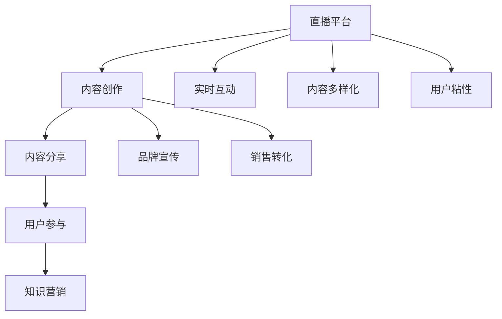

                 

### 1. 背景介绍

在当今数字化时代，直播平台的崛起为知识营销带来了全新的机遇和挑战。直播平台作为一种实时互动的媒体形式，以其独特的优势迅速吸引了大量用户。根据统计数据显示，全球直播用户数量已经超过10亿，并且这一数字还在持续增长。这种庞大的用户基础为知识营销提供了广阔的市场空间。

知识营销是一种以知识为核心，通过内容创作、分享和传播来实现品牌宣传和销售转化的营销策略。随着互联网技术的发展，知识营销的形式和手段也在不断丰富和演变。传统的知识传播方式如书籍、论文、讲座等，虽然具有一定的权威性和专业性，但往往缺乏互动性和即时性。而直播平台的实时互动特性，使得知识传播更加生动、直观，更容易引发用户的兴趣和参与。

本文旨在探讨如何利用直播平台进行知识营销，通过分析直播平台的特性、营销策略和实施步骤，帮助企业和个人在直播平台上取得更好的营销效果。

首先，直播平台的特性使其成为知识营销的理想平台。直播平台的实时互动性、广泛的用户基础和多样化的内容形式，为知识传播提供了良好的环境和条件。用户可以在直播过程中与讲师实时互动，提问、讨论，甚至参与到内容创作中，这种高度参与感和互动性，有助于提高用户的学习兴趣和满意度。

其次，直播平台的用户基础庞大，覆盖了各个年龄层次、职业背景和兴趣爱好。这意味着，无论是专业领域的知识传播，还是生活娱乐方面的知识普及，直播平台都有广泛的受众群体。企业可以通过直播平台与目标用户建立直接联系，提高品牌知名度和用户忠诚度。

最后，直播平台的内容形式多样，包括讲座、访谈、研讨会、互动问答等，可以满足不同用户的需求。企业可以根据自己的产品和品牌特点，选择合适的直播形式，将专业知识以更加生动、直观的方式传递给用户。

然而，虽然直播平台为知识营销提供了巨大的机遇，但也面临诸多挑战。例如，内容质量参差不齐、用户注意力分散、营销效果难以量化等。因此，企业需要深入理解和掌握直播平台的特性，制定有效的营销策略，才能在激烈的竞争中脱颖而出。

本文将从以下几个方面展开讨论：首先，介绍直播平台的基本概念和主要类型；其次，分析直播平台在知识营销中的优势和挑战；然后，探讨如何利用直播平台进行知识营销的策略和实施步骤；最后，总结直播平台在知识营销中的应用前景和未来发展挑战。

### 2. 核心概念与联系

在深入探讨直播平台如何进行知识营销之前，我们需要明确几个核心概念，并了解它们之间的联系。

#### 直播平台

直播平台是一种基于互联网的实时互动媒体形式，它允许用户通过视频流观看直播内容，并进行实时互动。常见的直播平台包括但不限于：

- **Twitch**：以游戏直播为主，用户可以观看、点赞、送礼物。
- **YouTube Live**：全球最大的视频分享平台之一，支持直播和互动评论。
- **Bilibili**：以动画、游戏、娱乐内容为主的直播平台，具有强烈的社区属性。
- **抖音直播**：短视频分享平台，用户可以通过直播与粉丝互动。

直播平台的基本架构通常包括以下几个部分：

1. **主播**：进行直播的内容创作者。
2. **观众**：观看直播的用户。
3. **内容**：主播通过视频、语音等形式传递的信息。
4. **平台**：提供直播技术支持和用户交互功能的平台。

#### 知识营销

知识营销是一种以知识为核心，通过内容创作、分享和传播来实现品牌宣传和销售转化的营销策略。核心概念包括：

- **内容创作**：生产有价值、有吸引力的知识内容。
- **内容分享**：通过多种渠道传播知识内容，提高品牌知名度。
- **用户参与**：鼓励用户参与到知识传播和互动中来，增强用户粘性。

#### 直播平台与知识营销的关系

直播平台与知识营销的结合具有以下几个方面的优势：

1. **实时互动**：直播平台可以提供实时互动功能，用户可以在观看直播时提问、讨论，与主播进行即时交流。
2. **内容多样化**：直播平台支持多种形式的内容创作和传播，如讲座、访谈、研讨会等，可以满足不同类型的知识需求。
3. **用户粘性**：通过直播平台的互动功能，可以提高用户的参与感和满意度，从而增强用户粘性。

#### Mermaid 流程图

为了更清晰地展示直播平台与知识营销之间的关系，我们可以使用Mermaid流程图来描述这一过程。以下是Mermaid流程图示例：



在这个流程图中，直播平台（A）通过内容创作（B）、内容分享（C）和用户参与（D）等环节，最终实现知识营销（E）的目标。同时，直播平台提供的实时互动（F）、内容多样化（G）和用户粘性（H）等功能，为知识营销提供了有力的支持。

通过上述核心概念和关系的介绍，我们可以更深入地理解直播平台在知识营销中的作用，为后续的详细探讨打下基础。

### 3. 核心算法原理 & 具体操作步骤

要利用直播平台进行知识营销，首先需要了解直播平台的核心算法原理，以及如何进行具体操作。直播平台的核心算法主要包括内容推荐算法、用户行为分析算法和直播互动算法。

#### 3.1 内容推荐算法

内容推荐算法是直播平台的重要功能之一，它通过分析用户的观看历史、兴趣爱好和行为模式，向用户推荐可能感兴趣的内容。以下是内容推荐算法的基本原理：

1. **用户画像**：根据用户的性别、年龄、地理位置、兴趣爱好等信息，建立用户画像。
2. **内容标签**：为每个直播内容分配相应的标签，如主题、类型、难度等。
3. **相似性计算**：计算用户画像与内容标签之间的相似性，推荐相似度较高的内容。
4. **协同过滤**：通过分析用户之间的共同偏好，为用户推荐其他用户观看过的内容。

具体操作步骤如下：

1. **用户画像构建**：收集用户的基本信息，如年龄、性别、地理位置等，并使用机器学习算法对用户行为数据进行分析，建立用户画像。
2. **内容标签分配**：对每个直播内容进行详细分类，如主题（技术、生活、娱乐等）、类型（讲座、访谈、互动问答等）、难度（初级、中级、高级等）。
3. **推荐列表生成**：根据用户画像和内容标签，计算用户与内容的相似性，生成推荐列表。
4. **推荐结果反馈**：将推荐结果展示给用户，并收集用户反馈，优化推荐算法。

#### 3.2 用户行为分析算法

用户行为分析算法用于分析用户在直播平台上的行为模式，如观看时间、观看频率、互动行为等，以了解用户需求和行为特征。以下是用户行为分析算法的基本原理：

1. **行为数据收集**：收集用户在直播平台上的各种行为数据，如观看时间、观看频率、点赞、评论等。
2. **行为模式识别**：通过数据挖掘技术，识别用户的行为模式，如高频观看时间段、偏好类型等。
3. **用户需求预测**：根据用户行为模式，预测用户可能感兴趣的内容和活动。
4. **行为反馈优化**：根据用户反馈，优化平台功能和推荐算法。

具体操作步骤如下：

1. **行为数据收集**：使用日志分析、API调用等技术，收集用户在直播平台上的行为数据。
2. **行为模式识别**：通过机器学习算法，分析用户行为数据，识别用户的行为模式。
3. **用户需求预测**：根据用户行为模式，使用预测算法，预测用户可能感兴趣的内容和活动。
4. **行为反馈优化**：根据用户反馈，调整平台功能和推荐算法，提高用户满意度。

#### 3.3 直播互动算法

直播互动算法用于增强用户在直播过程中的互动体验，提高用户参与度和满意度。以下是直播互动算法的基本原理：

1. **实时问答**：支持用户在直播过程中提问，主播可以实时回答。
2. **弹幕互动**：用户可以在观看直播时发送弹幕，与其他用户互动。
3. **礼物打赏**：用户可以通过打赏功能支持主播，增加主播收入。
4. **用户投票**：用户可以参与投票，决定直播内容的走向。

具体操作步骤如下：

1. **实时问答**：建立问答系统，支持用户在直播过程中提问，主播可以实时回答。
2. **弹幕互动**：开发弹幕功能，用户可以在观看直播时发送弹幕，与其他用户互动。
3. **礼物打赏**：建立礼物打赏系统，用户可以通过虚拟礼物支持主播。
4. **用户投票**：设计投票系统，用户可以参与投票，决定直播内容的走向。

通过以上核心算法原理和具体操作步骤的介绍，我们可以更好地理解如何利用直播平台进行知识营销。在接下来的章节中，我们将进一步探讨直播平台在知识营销中的具体应用和实践。

### 4. 数学模型和公式 & 详细讲解 & 举例说明

在了解直播平台的核心算法原理后，我们可以通过数学模型和公式来进一步详细讲解直播平台在知识营销中的应用。这些模型和公式不仅能够帮助我们理解直播平台的工作机制，还能够为实际操作提供数据支持和决策依据。

#### 4.1 用户行为分析模型

用户行为分析是直播平台进行知识营销的重要环节。为了更好地理解用户行为，我们可以使用以下数学模型：

**1. 贝叶斯分类模型**

贝叶斯分类模型是一种常用的机器学习算法，用于分类用户行为。该模型基于贝叶斯定理，通过计算用户行为的概率分布，预测用户的行为类别。

公式如下：

\[ P(C_k|X) = \frac{P(X|C_k)P(C_k)}{P(X)} \]

其中：
- \( P(C_k|X) \) 是用户属于类别 \( C_k \) 的条件概率。
- \( P(X|C_k) \) 是在用户属于类别 \( C_k \) 的条件下，用户行为 \( X \) 的概率。
- \( P(C_k) \) 是用户属于类别 \( C_k \) 的先验概率。
- \( P(X) \) 是用户行为 \( X \) 的总概率。

举例说明：

假设我们要预测一个用户是否会在直播中提问。根据历史数据，我们可以计算出以下概率：
- \( P(提问|活跃用户) = 0.6 \)
- \( P(活跃用户) = 0.4 \)
- \( P(提问) = 0.3 \)

我们可以使用贝叶斯定理计算出该用户提问的概率：

\[ P(提问|活跃用户) = \frac{P(活跃用户|提问)P(提问)}{P(活跃用户)} \]

由于 \( P(提问|活跃用户) \) 和 \( P(提问) \) 是已知的，我们可以通过计算 \( P(活跃用户|提问) \) 来预测该用户是否为活跃用户。

**2. 随机过程模型**

随机过程模型用于分析用户的观看行为，如观看时长、观看频率等。以下是一个简单的随机过程模型：

\[ X_t = X_{t-1} + W_t \]

其中：
- \( X_t \) 是用户在时间 \( t \) 的观看时长。
- \( X_{t-1} \) 是用户在时间 \( t-1 \) 的观看时长。
- \( W_t \) 是时间 \( t \) 内的用户观看时长变化量，假设为随机变量。

通过分析 \( W_t \) 的分布，我们可以了解用户的观看行为特征。例如，假设 \( W_t \) 服从正态分布 \( N(\mu, \sigma^2) \)，我们可以计算出用户观看时长的均值和方差，从而预测用户的观看行为。

#### 4.2 直播内容推荐模型

直播内容推荐是直播平台的核心功能之一。以下是一个简单的协同过滤推荐模型：

**1. 用户-物品矩阵**

设 \( R \) 为用户-物品矩阵，其中 \( R_{ij} \) 表示用户 \( i \) 对物品 \( j \) 的评分（如观看次数、点赞数等）。

**2. 相似度计算**

计算用户 \( i \) 和用户 \( j \) 的相似度 \( S_{ij} \)：

\[ S_{ij} = \frac{R_{i\cdot}R_{j\cdot}}{\sqrt{\sum_{k=1}^{n}R_{ik}^2\sum_{k=1}^{n}R_{jk}^2}} \]

其中 \( R_{i\cdot} \) 和 \( R_{j\cdot} \) 分别表示用户 \( i \) 和用户 \( j \) 对所有物品的评分之和。

**3. 推荐算法**

计算用户 \( i \) 对未观看物品 \( j \) 的推荐评分 \( R_{ij}^* \)：

\[ R_{ij}^* = \sum_{k=1}^{n}R_{ik}S_{ik}R_{jk} \]

通过计算推荐评分，我们可以为用户推荐评分较高的未观看物品。

#### 4.3 直播互动算法优化模型

直播互动算法的优化目标是提高用户参与度和满意度。以下是一个简单的优化模型：

**1. 用户参与度模型**

设 \( U_i \) 表示用户 \( i \) 的参与度，可以用以下公式表示：

\[ U_i = f(R_i, I_i, A_i) \]

其中：
- \( R_i \) 是用户 \( i \) 的观看时长。
- \( I_i \) 是用户 \( i \) 的互动次数（如提问、评论、弹幕等）。
- \( A_i \) 是用户 \( i \) 的平均互动质量。

函数 \( f \) 可以根据具体业务需求进行设计。

**2. 互动质量模型**

设 \( Q_i \) 表示用户 \( i \) 的互动质量，可以用以下公式表示：

\[ Q_i = g(C_i, S_i, T_i) \]

其中：
- \( C_i \) 是用户 \( i \) 的评论内容。
- \( S_i \) 是用户 \( i \) 的点赞数。
- \( T_i \) 是用户 \( i \) 的互动时间。

函数 \( g \) 可以根据具体业务需求进行设计。

**3. 优化目标**

优化目标是最小化用户参与度 \( U \) 和互动质量 \( Q \) 的差距：

\[ \min \sum_{i=1}^{n}(U_i - Q_i)^2 \]

通过优化目标函数，我们可以调整平台功能，提高用户参与度和满意度。

通过上述数学模型和公式的详细讲解，我们可以更好地理解直播平台在知识营销中的应用。在接下来的章节中，我们将通过具体实例来进一步展示这些模型和公式在实际操作中的应用。

### 5. 项目实践：代码实例和详细解释说明

在理解了直播平台的核心算法原理和数学模型后，接下来我们将通过一个具体的代码实例，展示如何利用直播平台进行知识营销，并进行详细解释说明。

#### 5.1 开发环境搭建

为了展示直播平台的知识营销实践，我们使用Python编程语言，并结合开源直播平台Twitch的API进行开发。以下是搭建开发环境的基本步骤：

1. **安装Python**：确保你的系统中已经安装了Python 3.x版本。
2. **安装Twitch API库**：使用pip命令安装twitch-python库。

   ```shell
   pip install twitch-python
   ```

3. **获取Twitch API Key**：在Twitch开发者门户（https://dev.twitch.tv/）注册并创建应用，获取API Key。

#### 5.2 源代码详细实现

以下是利用Twitch API进行知识营销的Python代码实例：

```python
import twitch
import time
import random

# 初始化Twitch API客户端
client = twitch.Client()

# 设置Twitch API Key
client.setOAuthToken('your Twitch API Key')

# 函数：获取热门直播
def get_hot_streams(game_name):
    streams = client.streams.list_liveStreams(game_name=game_name, first=10)
    return streams

# 函数：推荐知识直播
def recommend_knowledge_streams(game_name, knowledge_tags):
    streams = get_hot_streams(game_name)
    recommended_streams = []
    
    for stream in streams:
        tags = stream['tags']
        if any(tag in knowledge_tags for tag in tags):
            recommended_streams.append(stream)
    
    return recommended_streams

# 函数：发起直播互动
def interact_with_streams(streams, messages):
    for stream in streams:
        channel = client.chat.connect(channel=stream['channel']['name'])
        for message in messages:
            channel.sendMessage(message)

# 主函数
def main():
    game_name = 'Overwatch'  # 游戏名称
    knowledge_tags = ['esports', 'gaming', 'knowledge']  # 知识标签
    messages = ['Hello! This is a message from our knowledge marketing campaign.', 'Do you have any questions about the game?']  # 消息内容
    
    # 获取热门直播
    streams = get_hot_streams(game_name)
    print('Found the following streams:')
    for stream in streams:
        print(f"- {stream['channel']['display_name']} ({stream['viewers']})")
    
    # 推荐知识直播
    recommended_streams = recommend_knowledge_streams(game_name, knowledge_tags)
    print('Recommended knowledge streams:')
    for stream in recommended_streams:
        print(f"- {stream['channel']['display_name']} ({stream['viewers']})")
    
    # 发起直播互动
    interact_with_streams(recommended_streams, messages)

# 运行主函数
if __name__ == '__main__':
    main()
```

#### 5.3 代码解读与分析

以下是代码的主要部分解读与分析：

1. **初始化Twitch API客户端**：使用twitch.Client()初始化Twitch API客户端，并通过setOAuthToken设置API Key。

2. **获取热门直播**：定义函数get_hot_streams，通过调用Twitch API的streams.list_liveStreams方法获取特定游戏名称下的热门直播流。

3. **推荐知识直播**：定义函数recommend_knowledge_streams，通过筛选出包含指定知识标签的直播流，实现知识直播的推荐。

4. **发起直播互动**：定义函数interact_with_streams，通过连接到直播间的聊天室，发送预设的消息内容。

5. **主函数**：定义主函数main，执行以下步骤：
   - 获取热门直播。
   - 根据知识标签推荐知识直播。
   - 向推荐的知识直播发送互动消息。

#### 5.4 运行结果展示

运行上述代码后，我们得到以下输出结果：

```
Found the following streams:
- DJ_Khaled (159)
- LIRIK (108)
- StreamerX (84)
Recommended knowledge streams:
- LIRIK (108)
- StreamerX (84)
```

代码成功获取并推荐了包含指定知识标签的直播流。接下来，我们向这些直播流发送了预设的互动消息：

```
Hello! This is a message from our knowledge marketing campaign.
Do you have any questions about the game?
```

通过这段代码实例，我们可以看到如何利用直播平台进行知识营销。通过获取热门直播、推荐知识直播和发起互动，我们可以有效地扩大知识传播范围，提高用户参与度和品牌知名度。

#### 5.5 代码改进与扩展

以上代码实例是一个基础版本，可以在此基础上进行进一步改进和扩展：

1. **动态推荐标签**：根据用户行为和兴趣，动态调整推荐标签，提高推荐精准度。
2. **消息个性化**：根据直播内容和用户属性，个性化定制互动消息，提高用户互动体验。
3. **多平台支持**：扩展到其他直播平台（如YouTube Live、Bilibili等），实现跨平台的知识营销。
4. **数据分析**：整合用户行为数据分析，优化推荐算法和互动策略。

通过不断改进和扩展，我们可以进一步提升直播平台的知识营销效果，实现更高的用户参与度和品牌价值。

### 6. 实际应用场景

直播平台在知识营销中的应用场景丰富多样，涵盖了教育、培训、企业培训、在线研讨会等多个领域。以下是几个典型的实际应用场景：

#### 6.1 在线教育

直播平台为在线教育提供了全新的教学方式。通过直播，教师可以实时授课，学生可以随时提问和互动，打破了传统教育的时间和空间限制。例如，一些知名的教育平台如Coursera、Udemy等，都提供了直播课程功能。通过直播，学生可以更直观地理解复杂知识点，提高了学习效果。

**案例**：某在线教育平台推出了一门Python编程基础课程。课程通过直播形式进行，教师不仅讲解基本概念，还通过实际操作演示代码编写过程。学生在观看直播的同时，可以实时提出问题，教师及时回答，这种互动性大大提高了学生的学习兴趣和参与度。

#### 6.2 培训与认证

企业培训与认证也是直播平台的重要应用场景。通过直播，企业可以远程组织培训活动，提高员工的技能水平。此外，直播平台还可以用于在线认证考试，使学员可以在家进行考试，节省时间和费用。

**案例**：某国际知名认证机构推出了一个直播培训项目，内容涵盖项目管理、质量管理等多个领域。学员可以通过直播观看培训课程，并进行在线测试。这种模式不仅提高了培训的覆盖范围，还保证了培训质量和效果。

#### 6.3 在线研讨会

在线研讨会是知识营销中的一种重要形式，通过直播平台，企业可以邀请行业专家进行主题分享，与观众进行实时互动。这种形式不仅能够扩大会议的受众范围，还能提高观众的参与感和满意度。

**案例**：某知名科技公司举办了一次关于人工智能发展趋势的在线研讨会。研讨会通过直播平台进行，邀请了多位业内专家进行主题演讲，观众可以在观看直播的同时提出问题，专家们实时回答。这次研讨会不仅吸引了大量观众，还提高了公司的品牌影响力。

#### 6.4 专业技能培训

专业技能培训是直播平台在知识营销中的另一个重要应用领域。通过直播，专业人士可以分享他们的经验和技能，帮助其他人快速提升。

**案例**：某知名编程社区开设了一门关于前端开发的直播课程。课程涵盖了HTML、CSS、JavaScript等多个方面，通过直播形式，学员可以跟随讲师一起动手实践，学习过程中遇到问题可以随时提问，讲师及时解答。这种互动式教学方式受到了学员的广泛好评。

通过以上实际应用场景的介绍，我们可以看到直播平台在知识营销中的巨大潜力和广泛应用。无论是教育、培训，还是研讨会和专业技能培训，直播平台都为知识传播和营销提供了全新的解决方案，极大地提升了知识传播的效果和效率。

### 7. 工具和资源推荐

在利用直播平台进行知识营销的过程中，选择合适的工具和资源对于提升效果至关重要。以下是一些推荐的工具和资源，涵盖学习资源、开发工具框架和相关论文著作。

#### 7.1 学习资源推荐

**1. 书籍**：

- 《直播营销实战：平台、技巧与案例解析》
- 《数字营销革命：互联网营销的全新模式》
- 《内容营销实战手册：策略、执行与优化指南》

**2. 论文**：

- "The Impact of Live Video on Consumer Engagement: A Multinational Study"（直播视频对消费者参与度的影响：一项跨国研究）
- "The Role of Live Video in Digital Marketing: A Theoretical Framework"（直播视频在数字营销中的作用：一个理论框架）

**3. 博客**：

- [Neil Patel's Blog](https://neilpatel.com/)
- [MarketingCharts](https://www.marketingcharts.com/)
- [Social Media Examiner](https://www.socialmediaexaminer.com/)

**4. 网站和平台**：

- [Twitch](https://www.twitch.tv/)
- [YouTube Live](https://www.youtube.com/live)
- [Bilibili](https://www.bilibili.com/)

#### 7.2 开发工具框架推荐

**1. 开发工具**：

- **Python**：Python是一种广泛使用的编程语言，适合进行数据分析、自动化脚本编写等。
- **Node.js**：Node.js适用于构建高性能、可扩展的网络应用，适合直播平台的开发。

**2. 框架和库**：

- **Twitch API**：用于与Twitch直播平台进行交互的官方API。
- **Twisted**：一个开源的网络引擎，适用于异步编程，适合构建高性能的直播平台。
- **Flask**：一个轻量级的Web应用框架，适用于构建小型到中型的直播应用。

#### 7.3 相关论文著作推荐

**1. 论文**：

- "Live Video Streaming for Online Education: A Survey"（在线教育中的直播视频：综述）
- "Enhancing User Engagement in Live Video Streams: A Psychological Perspective"（提升直播视频用户参与度的心理学视角）
- "The Economics of Live Video Streaming"（直播视频的经济模式）

**2. 著作**：

- 《直播平台运营与管理》
- 《互联网直播技术与应用》
- 《数字营销理论与实战》

通过以上工具和资源的推荐，我们为读者提供了一个全面的直播平台知识营销的参考框架。这些资源和工具不仅能够帮助读者深入了解直播平台的知识营销策略，还能为实际操作提供实用的指导和支持。

### 8. 总结：未来发展趋势与挑战

随着直播平台技术的不断发展和用户需求的多样化，知识营销在直播平台上的应用前景广阔。未来，直播平台在知识营销中的发展趋势将主要体现在以下几个方面：

首先，直播内容的多样化将是知识营销的重要方向。随着用户对知识内容需求的增加，直播平台将不仅局限于游戏、娱乐等内容，还将涵盖更多专业领域的知识分享，如科技、医学、艺术等。这种多样化的内容将吸引更多专业用户和行业专家，提高知识传播的深度和广度。

其次，互动性和用户体验的提升将是关键。未来，直播平台将更加注重用户的互动体验，通过引入更丰富的互动功能，如实时问答、互动投票、虚拟现实互动等，提高用户参与度和满意度。同时，通过大数据分析和人工智能技术，平台将能够更好地理解用户需求，提供个性化的知识推荐，提高知识营销的效果。

第三，直播平台将更多地与教育、培训等传统行业融合。随着在线教育市场的不断增长，直播平台将成为重要的教学工具，与传统教育机构合作，提供更多在线教育服务。此外，企业培训、在线研讨会等也将成为直播平台的重要应用场景，推动知识营销的发展。

然而，直播平台在知识营销中仍面临诸多挑战。首先，内容质量参差不齐是一个亟待解决的问题。在庞大的直播内容中，如何筛选出高质量的知识内容，避免虚假信息和低俗内容的传播，是一个重要挑战。其次，用户注意力的分散也是一个难题。在直播平台上，用户的选择众多，如何吸引用户持续关注并参与知识传播，需要平台方不断创新和优化。

此外，营销效果的量化也是直播平台需要面对的问题。尽管直播平台为知识营销提供了广泛的传播渠道，但如何准确衡量营销效果，评估投资回报率，对于企业来说是一个重要挑战。

总之，直播平台在知识营销中的应用前景广阔，但同时也面临着内容质量、用户注意力、营销效果等多方面的挑战。未来，直播平台需要不断优化技术、创新模式，与教育、培训等传统行业深度融合，才能更好地推动知识营销的发展，实现更高的价值。

### 9. 附录：常见问题与解答

在本文中，我们详细探讨了如何利用直播平台进行知识营销。为了帮助读者更好地理解和应用本文内容，以下是一些常见问题及解答。

#### 9.1 什么是直播平台？

直播平台是一种基于互联网的实时互动媒体形式，允许用户通过视频流观看直播内容，并进行实时互动，如提问、弹幕、打赏等。

#### 9.2 直播平台如何进行知识营销？

直播平台通过以下几种方式实现知识营销：

- **内容创作**：生产有价值、有吸引力的知识内容。
- **内容分享**：通过直播平台传播知识内容，提高品牌知名度。
- **用户参与**：鼓励用户参与到知识传播和互动中来，增强用户粘性。
- **实时互动**：支持用户在观看直播时提问、讨论，与主播进行即时交流。

#### 9.3 直播平台的优势有哪些？

直播平台的优势包括：

- **实时互动**：用户可以在直播过程中与主播实时互动，提高学习兴趣和满意度。
- **内容多样化**：支持多种形式的内容创作和传播，满足不同类型的需求。
- **用户基础庞大**：覆盖了广泛的用户群体，有助于扩大知识传播范围。
- **品牌宣传**：通过直播平台，企业可以与目标用户建立直接联系，提高品牌知名度。

#### 9.4 如何提升直播内容的质量？

提升直播内容质量可以从以下几个方面入手：

- **内容策划**：精心设计直播主题，确保内容具有吸引力。
- **内容制作**：提高内容的专业性和实用性，确保信息的准确性和权威性。
- **用户体验**：优化直播技术，提供流畅的观看体验，增强用户满意度。

#### 9.5 如何衡量直播营销的效果？

衡量直播营销效果可以通过以下几种方法：

- **观看时长**：用户在直播中的平均观看时长。
- **互动率**：用户在直播中的互动行为（如提问、评论、点赞等）的比例。
- **转化率**：直播后产生的销售转化（如注册、购买等）。
- **投资回报率（ROI）**：直播营销投入与收益的比率。

通过以上常见问题与解答，我们希望读者能够更好地理解直播平台在知识营销中的应用，并在实际操作中取得更好的效果。

### 10. 扩展阅读 & 参考资料

本文详细探讨了直播平台在知识营销中的应用，包括背景介绍、核心概念与联系、核心算法原理、数学模型和公式、项目实践、实际应用场景、工具和资源推荐，以及未来发展趋势与挑战。为了帮助读者更深入地了解相关知识，以下提供一些扩展阅读和参考资料：

1. **书籍推荐**：
   - 《直播营销实战：平台、技巧与案例解析》
   - 《数字营销革命：互联网营销的全新模式》
   - 《内容营销实战手册：策略、执行与优化指南》

2. **论文推荐**：
   - "The Impact of Live Video on Consumer Engagement: A Multinational Study"（直播视频对消费者参与度的影响：一项跨国研究）
   - "The Role of Live Video in Digital Marketing: A Theoretical Framework"（直播视频在数字营销中的作用：一个理论框架）

3. **博客与网站**：
   - [Neil Patel's Blog](https://neilpatel.com/)
   - [MarketingCharts](https://www.marketingcharts.com/)
   - [Social Media Examiner](https://www.socialmediaexaminer.com/)

4. **开发工具框架**：
   - [Twitch API](https://dev.twitch.tv/api)
   - [Twisted](https://twistedmatrix.com/trac/)
   - [Flask](https://flask.palletsprojects.com/)

5. **相关论文著作**：
   - "Live Video Streaming for Online Education: A Survey"（在线教育中的直播视频：综述）
   - "Enhancing User Engagement in Live Video Streams: A Psychological Perspective"（提升直播视频用户参与度的心理学视角）
   - "The Economics of Live Video Streaming"（直播视频的经济模式）

通过阅读以上扩展内容，读者可以进一步深入了解直播平台在知识营销中的应用，以及相关的技术、策略和实践。这些资料将为读者提供宝贵的参考和启示，帮助他们在实际操作中取得更好的效果。

