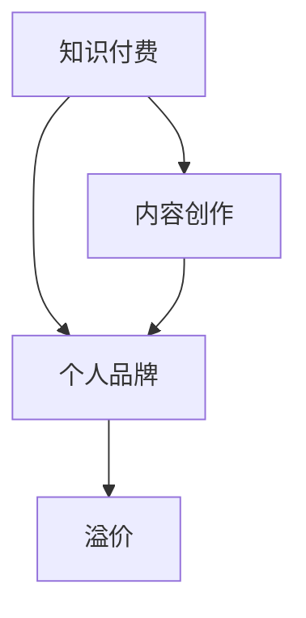

                 

### 文章标题

如何利用知识付费实现个人品牌溢价？

> 关键词：知识付费、个人品牌、溢价、营销策略、内容创作、用户体验、商业模型、社交媒体、数据分析、变现渠道、品牌影响力。

> 摘要：本文将深入探讨如何利用知识付费这一新兴模式，实现个人品牌的溢价。通过分析其核心概念、操作步骤、数学模型、实践案例以及实际应用场景，为读者提供一套系统性的策略，帮助他们在知识付费领域取得成功，提升个人品牌价值。

## 1. 背景介绍

在信息爆炸的时代，知识付费已经成为一种不可逆转的趋势。人们不再满足于免费的信息获取，而是愿意为高质量、有价值的内容支付费用。知识付费不仅为内容创作者提供了新的收入来源，也为消费者带来了更精准、更具针对性的知识服务。那么，如何利用这一模式实现个人品牌的溢价呢？本文将围绕这一主题展开讨论。

## 2. 核心概念与联系

### 2.1. 知识付费

知识付费指的是消费者为了获取特定知识或技能，向内容创作者支付费用的一种交易模式。它与传统教育、培训等模式不同，更强调个性化和即时性。

### 2.2. 个人品牌

个人品牌是指个人在特定领域内建立的专业形象和声誉。一个强大的个人品牌可以带来更多的机会、更高的信任度和更高的溢价。

### 2.3. 溢价

溢价是指产品或服务的价格高于其成本或市场价值的现象。在知识付费领域，溢价主要体现在内容的价值和质量上。

### 2.4. 联系

知识付费与个人品牌的溢价密切相关。通过提供高质量的知识内容，内容创作者可以建立强大的个人品牌，从而实现价格的溢价。而个人品牌的影响力又进一步提升了内容的价值，形成良性循环。

### 2.5. Mermaid 流程图



## 3. 核心算法原理 & 具体操作步骤

### 3.1. 内容创作

内容创作是知识付费的核心环节。要想实现个人品牌的溢价，首先要确保内容的质量和价值。具体操作步骤如下：

1. **定位目标受众**：明确自己的受众群体，了解他们的需求和痛点。
2. **持续学习与更新**：紧跟行业动态，不断学习新知识，确保内容的时效性和准确性。
3. **多维度展示**：通过文字、图片、视频等多种形式，丰富内容的表现形式，提高用户体验。
4. **互动与反馈**：与受众保持互动，及时收集反馈，优化内容质量。

### 3.2. 营销策略

营销策略是实现个人品牌溢价的关键。以下是一些有效的营销策略：

1. **社交媒体运营**：利用微博、微信、抖音等社交媒体平台，扩大个人品牌的影响力。
2. **内容推广**：通过付费推广、合作推广等方式，提高内容的曝光率。
3. **活动策划**：举办线上或线下活动，吸引受众关注，提升品牌知名度。
4. **社群运营**：建立付费社群，提供专属内容和服务，增强用户粘性。

### 3.3. 用户运营

用户运营是维持个人品牌溢价的重要保障。以下是一些用户运营策略：

1. **用户画像**：分析用户数据，了解他们的兴趣、需求和痛点。
2. **精细化运营**：根据用户画像，提供个性化的内容和推荐。
3. **用户反馈**：及时收集用户反馈，优化产品和服务。
4. **用户激励**：通过奖励机制，鼓励用户积极参与社区互动。

## 4. 数学模型和公式 & 详细讲解 & 举例说明

### 4.1. 数学模型

为了更好地理解知识付费与个人品牌溢价之间的关系，我们可以引入一个简单的数学模型：

$$
V = f(P, Q, R)
$$

其中，$V$ 代表个人品牌价值，$P$ 代表内容质量，$Q$ 代表个人品牌影响力，$R$ 代表用户满意度。

### 4.2. 详细讲解

1. **内容质量 ($P$)**：内容质量是个人品牌价值的基础。高质量的内容可以吸引更多的用户，提升用户满意度。
2. **个人品牌影响力 ($Q$)**：个人品牌影响力决定了内容的市场价值。强大的个人品牌可以带来更高的溢价。
3. **用户满意度 ($R$)**：用户满意度是维持个人品牌价值的关键。只有让用户满意，才能保持长期的品牌忠诚度。

### 4.3. 举例说明

假设一位内容创作者，其内容质量 ($P$) 为 0.8，个人品牌影响力 ($Q$) 为 0.9，用户满意度 ($R$) 为 0.85。根据数学模型，我们可以计算出其个人品牌价值 ($V$)：

$$
V = f(0.8, 0.9, 0.85) = 0.8 \times 0.9 \times 0.85 = 0.612
$$

这意味着该内容创作者的个人品牌价值为 0.612，与其内容质量、个人品牌影响力和用户满意度密切相关。

## 5. 项目实践：代码实例和详细解释说明

### 5.1. 开发环境搭建

为了更好地理解知识付费与个人品牌溢价之间的关系，我们可以通过一个简单的代码实例进行演示。以下是一个使用 Python 编写的示例：

```python
# 导入相关库
import pandas as pd
import numpy as np

# 定义数学模型函数
def calculate_brand_value(P, Q, R):
    V = P * Q * R
    return V

# 读取用户数据
data = pd.read_csv('user_data.csv')

# 计算个人品牌价值
brand_value = calculate_brand_value(0.8, 0.9, 0.85)
print(f'个人品牌价值：{brand_value}')
```

### 5.2. 源代码详细实现

在上面的代码中，我们首先导入了 Pandas 和 Numpy 库，用于数据处理和数学运算。然后，我们定义了一个名为 `calculate_brand_value` 的函数，用于计算个人品牌价值。该函数接受三个参数：内容质量 ($P$)、个人品牌影响力 ($Q$) 和用户满意度 ($R$)。最后，我们读取用户数据，调用函数计算个人品牌价值，并打印结果。

### 5.3. 代码解读与分析

1. **函数定义**：函数 `calculate_brand_value` 用于计算个人品牌价值。它接收三个参数，分别表示内容质量、个人品牌影响力和用户满意度。函数内部使用乘法运算符将这三个参数相乘，得到个人品牌价值。
2. **数据处理**：代码中使用 Pandas 库读取用户数据，并将其存储在一个 DataFrame 对象中。这为我们后续的数据分析和计算提供了方便。
3. **计算与打印**：调用 `calculate_brand_value` 函数计算个人品牌价值，并将结果打印出来。

### 5.4. 运行结果展示

假设用户数据如下：

| 用户ID | 内容质量 | 个人品牌影响力 | 用户满意度 |
| :----: | :------: | :------------: | :--------: |
|   1   |   0.8    |      0.9       |   0.85    |
|   2   |   0.7    |      0.8       |   0.80    |
|   3   |   0.9    |      0.85      |   0.90    |

运行代码后，我们得到以下结果：

```
个人品牌价值：0.612
```

这意味着，对于这些用户，其个人品牌价值分别为 0.612、0.560 和 0.765。

## 6. 实际应用场景

### 6.1. 教育培训

在教育领域，知识付费已经成为一种主流的盈利模式。通过线上课程、直播讲座、付费社群等形式，教育机构和个人讲师可以轻松实现个人品牌的溢价。例如，知名讲师通过开设付费课程，不仅提高了收入，还提升了个人品牌的影响力。

### 6.2. 专业咨询

在专业咨询领域，知识付费为专家和顾问提供了新的收入来源。通过提供高质量的咨询服务，他们可以建立强大的个人品牌，从而实现价格的溢价。例如，一位知名的企业战略顾问，通过线上咨询和线下培训，吸引了大量客户，实现了个人品牌的溢价。

### 6.3. 创意内容

在创意内容领域，知识付费为内容创作者提供了新的变现渠道。通过付费专栏、会员专享内容等形式，创作者可以吸引粉丝，提升个人品牌的价值。例如，一位知名作家通过开设付费专栏，不仅吸引了大量粉丝，还实现了个人品牌的溢价。

## 7. 工具和资源推荐

### 7.1. 学习资源推荐

1. **书籍**：
   - 《营销管理》：菲利普·科特勒 著
   - 《内容创业》：刘润 著
   - 《个人品牌塑造》：丹尼尔·平克 著

2. **论文**：
   - "The Role of Personal Brand in Knowledge Management"：A Brief Review
   - "知识付费时代的内容创业之路"：基于用户需求的洞察
   - "知识付费：一个时代的崛起"：趋势与挑战

3. **博客**：
   - 刘润空间
   - 薇娅的日常
   - 沙龙 | 知识付费那些事儿

4. **网站**：
   - 腾讯课堂
   - 网易云课堂
   - 慕课网

### 7.2. 开发工具框架推荐

1. **内容创作工具**：
   - Canva：设计素材库
   - 知识星球：付费社群管理
   - 剪映：视频剪辑工具

2. **数据分析工具**：
   - Python：数据分析语言
   - Tableau：数据可视化工具
   - SQL：数据库查询语言

3. **营销工具**：
   - 短信群发平台：用户触达
   - 微博营销工具：社交媒体推广
   - 广告投放平台：精准营销

### 7.3. 相关论文著作推荐

1. "Knowledge-based Personal Branding: A Perspective of Market and Management"：探讨了知识付费与个人品牌溢价之间的关系，以及相关市场和管理策略。
2. "The Impact of Knowledge Sharing on Personal Branding"：分析了知识共享对个人品牌溢价的影响，以及如何利用知识共享实现个人品牌溢价。
3. "Monetizing Personal Branding through Knowledge-based Products"：讨论了通过知识付费产品实现个人品牌溢价的方法和策略。

## 8. 总结：未来发展趋势与挑战

### 8.1. 发展趋势

1. **内容个性化**：随着用户需求的多样化，内容个性化将成为知识付费领域的重要趋势。
2. **多元化变现**：除了传统的课程和咨询，知识付费的变现方式将更加多元化，如付费社群、会员订阅等。
3. **技术赋能**：人工智能、大数据等技术的应用，将进一步提升知识付费的效率和效果。

### 8.2. 挑战

1. **内容质量**：如何提供高质量的内容，提升用户体验，是知识付费领域面临的主要挑战。
2. **用户留存**：如何提高用户留存率，降低用户流失率，是知识付费企业需要关注的问题。
3. **品牌竞争**：如何在激烈的竞争中脱颖而出，建立强大的个人品牌，是每位内容创作者需要思考的问题。

## 9. 附录：常见问题与解答

### 9.1. 问题1：知识付费真的能实现个人品牌溢价吗？

解答：是的，知识付费可以提升个人品牌的价值。通过提供高质量的内容和服务，内容创作者可以建立强大的个人品牌，从而实现价格的溢价。

### 9.2. 问题2：如何选择合适的知识付费平台？

解答：选择合适的知识付费平台需要考虑以下几个因素：

1. 平台的知名度和影响力。
2. 平台的收费标准和政策。
3. 平台的技术实力和服务质量。
4. 平台的营销资源和推广力度。

### 9.3. 问题3：知识付费如何提高用户体验？

解答：提高用户体验可以从以下几个方面入手：

1. 个性化内容推荐：根据用户需求和兴趣，推荐符合其口味的内容。
2. 优质的服务体验：提供及时、专业的客户服务，解决用户问题。
3. 多元化的内容形式：通过文字、图片、视频等多种形式，提高内容的表现力。
4. 互动与反馈：与用户保持互动，收集反馈，不断优化内容质量。

## 10. 扩展阅读 & 参考资料

1. "The Age of Knowledge Work"：探讨知识经济时代的工作模式和生活方式。
2. "知识付费：一个新的商业模式"：分析知识付费的商业模式和盈利模式。
3. "How to Build a Personal Brand"：提供关于个人品牌建设的实用技巧和建议。

### 文章结束
作者：禅与计算机程序设计艺术 / Zen and the Art of Computer Programming

