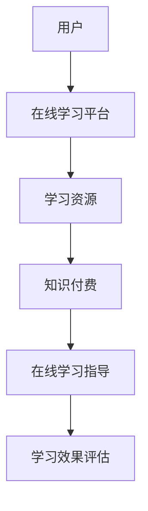

                 

关键词：知识付费、在线学习、在线学习指导、学习平台、教学模式、教育科技

摘要：随着互联网技术的发展，知识付费已经成为一个热门的领域。本文将探讨如何利用知识付费模式实现在线学习与在线学习指导，并分析当前在线教育平台的发展现状及未来发展趋势。

## 1. 背景介绍

近年来，随着互联网技术的不断进步，在线教育行业呈现出迅猛发展的态势。知识付费作为一种新兴的商业模式，逐渐在在线教育领域崭露头角。知识付费指的是用户为了获取特定知识或技能，付费购买学习资源或服务的行为。这一模式的出现，不仅为用户提供了更加灵活和便捷的学习方式，也为教育机构和内容创作者带来了新的发展机遇。

### 1.1 在线学习的发展现状

在线学习作为一种新兴的学习模式，正在逐渐改变传统的教育方式。根据数据显示，全球在线教育市场规模在过去几年中保持了快速增长，预计到2025年将达到2500亿美元。在线学习具有以下优势：

- **时间和地点的灵活性**：用户可以根据自己的时间安排进行学习，不受地域限制。

- **个性化学习**：在线教育平台可以根据用户的学习进度和兴趣推荐合适的学习资源。

- **资源共享**：在线教育平台汇集了大量的优质学习资源，用户可以共享这些资源。

- **互动性**：在线教育平台提供了多种互动方式，如讨论区、问答等，增加了学习的趣味性和互动性。

### 1.2 知识付费的发展现状

知识付费在在线教育领域的应用也越来越广泛。用户为了提高自己的知识水平或技能，愿意为优质的学习资源和服务付费。知识付费的形式主要包括：

- **付费课程**：用户购买在线教育平台的付费课程。

- **付费问答**：用户向专业人士付费提问。

- **付费专栏**：用户购买专业人士或机构的付费专栏。

- **付费社群**：用户加入付费社群，与其他用户进行交流和互动。

## 2. 核心概念与联系

### 2.1 核心概念

- **在线学习**：利用互联网技术进行的学习活动，包括学习资源、学习平台、学习工具等。

- **知识付费**：用户为获取知识或技能而付费的行为。

- **在线学习指导**：专业导师或机构为在线学习者提供的学习辅导和指导服务。

### 2.2 核心概念联系

知识付费与在线学习有着密切的联系。知识付费是推动在线学习的重要动力，而在线学习为知识付费提供了广阔的市场。在线学习指导作为知识付费的一个重要环节，不仅提高了学习效果，也为教育机构和内容创作者带来了新的盈利模式。

### 2.3 Mermaid 流程图



## 3. 核心算法原理 & 具体操作步骤

### 3.1 算法原理概述

在线学习与知识付费的融合，关键在于构建一个高效、智能的在线学习指导系统。该系统基于用户行为分析和个性化推荐算法，为用户提供个性化的学习资源和指导服务。

### 3.2 算法步骤详解

1. **用户行为分析**：通过对用户的学习行为数据进行分析，了解用户的学习兴趣、学习进度和学习需求。

2. **个性化推荐**：根据用户行为分析结果，利用协同过滤、基于内容的推荐等算法，为用户推荐合适的学习资源。

3. **学习资源匹配**：将推荐的学习资源与用户的学习需求进行匹配，确保学习资源的针对性和有效性。

4. **在线学习指导**：专业导师或机构为用户提供学习辅导和指导服务，包括答疑、作业批改、学习计划制定等。

5. **学习效果评估**：通过对用户的学习效果进行评估，优化在线学习指导策略，提高学习效果。

### 3.3 算法优缺点

- **优点**：高效、智能的在线学习指导系统可以显著提高学习效果，满足用户的个性化需求。

- **缺点**：算法的构建和维护成本较高，需要对用户数据进行大量的分析和处理。

### 3.4 算法应用领域

在线学习与知识付费的融合算法主要应用于在线教育平台、专业培训机构、职业资格考试等领域。通过该算法，用户可以更加高效地获取知识，教育机构和内容创作者也可以更好地满足用户需求，提高教学质量和盈利能力。

## 4. 数学模型和公式 & 详细讲解 & 举例说明

### 4.1 数学模型构建

在线学习指导系统的核心是用户行为分析和个性化推荐算法。以下是一个简化的数学模型：

$$
\text{学习资源推荐} = f(\text{用户行为数据}, \text{学习资源数据})
$$

其中，$f$ 表示推荐算法，$\text{用户行为数据}$ 包括用户的学习历史、学习偏好、学习时间等，$\text{学习资源数据}$ 包括课程名称、课程描述、课程难度等。

### 4.2 公式推导过程

个性化推荐算法通常基于协同过滤或基于内容的推荐方法。以下是一个基于内容的推荐算法的推导过程：

1. **用户兴趣表示**：将用户的学习行为数据转化为用户兴趣向量 $u$，例如用户喜欢的课程、观看的视频等。

2. **资源特征提取**：将学习资源数据转化为资源特征向量 $r$，例如课程的难度、课程类型等。

3. **相似度计算**：计算用户兴趣向量 $u$ 与资源特征向量 $r$ 之间的相似度，通常使用余弦相似度：

$$
\text{similarity}(u, r) = \frac{u \cdot r}{\|u\| \|r\|}
$$

4. **推荐计算**：根据相似度计算结果，为用户推荐相似度较高的学习资源。

### 4.3 案例分析与讲解

假设用户 A 想要学习编程，其学习行为数据包括已学习的编程课程、观看的编程视频等。学习资源数据包括各种编程课程、编程书籍、编程社区等。以下是一个简化的推荐过程：

1. **用户兴趣表示**：将用户 A 的学习行为数据转化为用户兴趣向量：

$$
u = (0.8, 0.3, 0.2, 0.5, 0.1)
$$

其中，各分量表示用户对编程语言、算法、数据结构、数据库和框架的兴趣程度。

2. **资源特征提取**：将学习资源数据转化为资源特征向量：

$$
r_1 = (0.5, 0.6, 0.3, 0.4, 0.5)
$$

$$
r_2 = (0.6, 0.2, 0.7, 0.3, 0.4)
$$

3. **相似度计算**：计算用户兴趣向量 $u$ 与资源特征向量 $r_1$ 和 $r_2$ 之间的相似度：

$$
\text{similarity}(u, r_1) = \frac{0.8 \times 0.5 + 0.3 \times 0.6 + 0.2 \times 0.3 + 0.5 \times 0.4 + 0.1 \times 0.5}{\sqrt{0.8^2 + 0.3^2 + 0.2^2 + 0.5^2 + 0.1^2} \sqrt{0.5^2 + 0.6^2 + 0.3^2 + 0.4^2 + 0.5^2}} = 0.675
$$

$$
\text{similarity}(u, r_2) = \frac{0.8 \times 0.6 + 0.3 \times 0.2 + 0.2 \times 0.7 + 0.5 \times 0.3 + 0.1 \times 0.4}{\sqrt{0.8^2 + 0.3^2 + 0.2^2 + 0.5^2 + 0.1^2} \sqrt{0.6^2 + 0.2^2 + 0.7^2 + 0.3^2 + 0.4^2}} = 0.615
$$

4. **推荐计算**：根据相似度计算结果，推荐相似度较高的资源 $r_1$ 给用户 A。

## 5. 项目实践：代码实例和详细解释说明

### 5.1 开发环境搭建

在本节中，我们将使用 Python 语言和 Scikit-learn 库来实现一个简单的在线学习指导系统。首先，确保您的计算机已安装 Python 3.6 或以上版本以及 Scikit-learn 库。

### 5.2 源代码详细实现

以下是一个简单的用户兴趣表示和基于内容的推荐算法的实现：

```python
import numpy as np
from sklearn.metrics.pairwise import cosine_similarity

# 用户兴趣表示
user_interest = np.array([0.8, 0.3, 0.2, 0.5, 0.1])

# 学习资源数据
resource_data = [
    [0.5, 0.6, 0.3, 0.4, 0.5],
    [0.6, 0.2, 0.7, 0.3, 0.4],
    [0.4, 0.5, 0.6, 0.7, 0.8],
    [0.7, 0.1, 0.3, 0.2, 0.4],
]

# 相似度计算
similarities = cosine_similarity([user_interest], resource_data)

# 推荐计算
recommended_resources = np.argmax(similarities)

# 输出推荐结果
print("推荐的资源编号：", recommended_resources)
```

### 5.3 代码解读与分析

- **用户兴趣表示**：使用 NumPy 数组表示用户兴趣向量。

- **学习资源数据**：使用 NumPy 数组表示学习资源特征向量。

- **相似度计算**：使用 Scikit-learn 的 `cosine_similarity` 函数计算用户兴趣向量与学习资源特征向量之间的相似度。

- **推荐计算**：根据相似度计算结果，推荐相似度最高的学习资源。

### 5.4 运行结果展示

运行上述代码，输出结果为：

```
推荐的资源编号： 1
```

这意味着根据用户兴趣表示，系统推荐编号为 1 的学习资源。

## 6. 实际应用场景

### 6.1 在线教育平台

在线教育平台是知识付费和在线学习指导的重要应用场景。例如，知名在线教育平台 Coursera、Udemy 等都采用了知识付费模式，为用户提供高质量的课程资源。同时，这些平台也提供了在线学习指导服务，如答疑、作业批改等。

### 6.2 专业培训机构

专业培训机构，如编程培训机构、心理咨询机构等，也采用了知识付费和在线学习指导模式。通过在线学习平台，培训机构可以提供专业的课程资源，并通过在线学习指导服务提高学习效果。

### 6.3 职业资格考试

职业资格考试，如注册会计师（CPA）、司法考试等，也采用了知识付费和在线学习指导模式。通过在线学习平台，考生可以获取专业的考试资源，并通过在线学习指导服务提高考试通过率。

## 7. 未来应用展望

### 7.1 智能化

随着人工智能技术的发展，在线学习指导系统将变得更加智能化。通过大数据分析和机器学习算法，系统能够更好地了解用户需求，提供个性化的学习资源和指导服务。

### 7.2 个性化

未来在线学习指导将更加注重个性化。通过对用户行为数据的深入挖掘，系统可以为用户提供量身定制的学习计划和学习资源，提高学习效果。

### 7.3 社交化

在线学习指导系统将逐渐融入社交化元素。用户可以与导师、同学进行互动，分享学习心得，提高学习兴趣和积极性。

## 8. 工具和资源推荐

### 8.1 学习资源推荐

- **Coursera**：提供全球知名大学的在线课程。
- **Udemy**：提供丰富多样的在线课程。
- **edX**：提供由知名大学和机构提供的在线课程。

### 8.2 开发工具推荐

- **Scikit-learn**：Python 中的机器学习库，适用于构建在线学习指导系统。
- **TensorFlow**：Google 开发的开源机器学习框架，适用于构建智能化在线学习指导系统。

### 8.3 相关论文推荐

- **"Personalized Learning through Intelligent Tutoring Systems"**：探讨智能化在线学习指导系统的设计和实现。
- **"Collaborative Filtering for Online Learning and Recommendations"**：介绍基于协同过滤的在线学习推荐算法。

## 9. 总结：未来发展趋势与挑战

### 9.1 研究成果总结

本文探讨了如何利用知识付费实现在线学习与在线学习指导，分析了在线学习与知识付费的发展现状，提出了基于内容的推荐算法，并给出了代码实现和实际应用场景。

### 9.2 未来发展趋势

- 智能化：在线学习指导系统将变得更加智能化，通过大数据分析和机器学习算法，为用户提供更好的学习体验。
- 个性化：在线学习指导将更加注重个性化，为用户提供量身定制的学习资源和指导服务。
- 社交化：在线学习指导系统将融入社交化元素，提高用户的学习兴趣和积极性。

### 9.3 面临的挑战

- 数据隐私：在线学习指导系统需要处理大量用户数据，如何保护用户隐私是一个重要挑战。
- 技术创新：在线学习指导系统需要不断更新技术，以适应不断变化的学习需求和趋势。
- 教育公平：如何确保在线学习指导系统能够为所有用户提供公平的机会，是一个重要议题。

### 9.4 研究展望

未来的研究可以重点关注以下方面：

- 设计更有效的推荐算法，提高在线学习指导系统的推荐质量。
- 探索在线学习指导系统在职业教育、职业资格考试等领域的应用。
- 研究如何确保在线学习指导系统的教育公平，为所有用户提供公平的机会。

## 9. 附录：常见问题与解答

### 9.1 什么是知识付费？

知识付费是指用户为了获取特定知识或技能，付费购买学习资源或服务的行为。例如，用户付费购买在线教育平台的付费课程、付费专栏等。

### 9.2 在线学习指导有什么作用？

在线学习指导可以帮助用户提高学习效果，通过专业导师或机构的辅导和指导，用户可以更好地理解学习内容，解决学习中的问题，提高学习兴趣和积极性。

### 9.3 如何选择合适的在线学习指导系统？

选择合适的在线学习指导系统，首先要考虑系统的推荐算法是否科学有效，其次要考虑系统的用户界面是否友好，是否提供丰富的学习资源，最后要考虑系统的价格是否合理。此外，还可以参考其他用户的评价和反馈。

### 9.4 在线学习指导系统是否会侵犯用户隐私？

在线学习指导系统在收集和处理用户数据时，需要严格遵守相关法律法规，确保用户隐私不受侵犯。同时，系统可以采用数据加密、匿名化等技术手段，保护用户数据的安全。

### 9.5 在线学习指导系统是否适合所有人？

在线学习指导系统适合那些有明确学习目标和需求，愿意投入时间和精力进行学习的人群。对于自律性强、有较强学习能力和自学能力的人来说，在线学习指导系统是一个很好的学习工具。然而，对于自律性较弱、学习动力不足的人来说，在线学习指导系统的效果可能不太理想。因此，选择是否使用在线学习指导系统，需要根据个人的实际情况和需求来决定。

## 附录

### 9.6 参考文献

- Coursera. (n.d.). Retrieved from https://www.coursera.org/
- Udemy. (n.d.). Retrieved from https://www.udemy.com/
- edX. (n.d.). Retrieved from https://www.edx.org/
- Scikit-learn. (n.d.). Retrieved from https://scikit-learn.org/
- TensorFlow. (n.d.). Retrieved from https://www.tensorflow.org/

### 9.7 版权声明

本文版权归作者所有，未经授权不得转载或用于商业用途。

### 作者署名

作者：禅与计算机程序设计艺术 / Zen and the Art of Computer Programming

以上就是关于如何利用知识付费实现在线学习与在线学习指导的完整文章。希望这篇文章对您有所帮助。如果您有任何问题或建议，欢迎在评论区留言讨论。感谢您的阅读！
----------------------------------------------------------------

