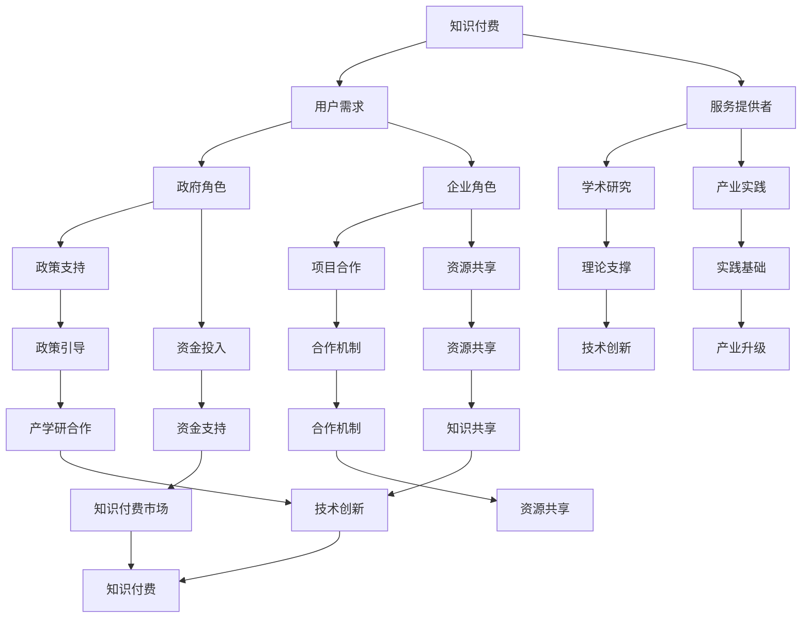

                 

### 关键词 Keywords ###
知识付费、政企合作、产学研一体化、人工智能、技术培训、数字化转型、合作共赢

<|assistant|>### 摘要 Summary ###
本文将探讨如何通过知识付费机制，促进政府、企业和学术研究机构的合作，实现产学研一体化。通过分析知识付费的背景、意义以及具体实施策略，本文提出了一系列可操作的方法，旨在推动各方的深度合作，提升技术创新和产业竞争力，为我国数字经济的发展贡献力量。

<|assistant|>## 1. 背景介绍 Background

随着全球科技的快速发展，人工智能、大数据、物联网等新兴技术不断涌现，它们正在深刻改变着传统产业和社会运行模式。为了应对这些变化，政府、企业和学术研究机构之间的合作变得越来越重要。然而，传统的合作模式往往存在信息不对称、利益分配不均等问题，难以实现真正的深度融合。知识付费作为一种新型的商业模式，提供了实现产学研一体化的新路径。

知识付费，是指通过付费的方式获取专业知识、技能和经验。它不仅能够为企业提供定制化的培训服务，还能帮助政府和企业更好地了解最新的技术趋势，提高科研效率。在知识付费的背景下，政府、企业和学术研究机构可以通过合作，共同搭建知识共享和交流的平台，从而实现资源共享、优势互补。

### 1.1 知识付费的发展现状

近年来，知识付费在我国逐渐兴起。根据相关报告显示，2018年知识付费市场规模约为196亿元，到2022年已经达到515亿元，预计未来还将保持快速增长。知识付费的内容涵盖了技能培训、在线教育、专业咨询等多个领域，用户群体也从单一的专业人士扩展到普通消费者。

### 1.2 产学研一体化的意义

产学研一体化是指政府、企业和学术研究机构之间建立紧密的合作关系，共同推动技术创新和产业发展。产学研一体化的意义在于：

1. **提高科研效率**：通过产学研合作，可以缩短科技成果转化的周期，提高科研经费的使用效率。
2. **促进产业升级**：企业可以借助学术研究的最新成果，加快产品创新和产业升级的步伐。
3. **增强国际竞争力**：产学研一体化有助于企业提高技术创新能力，增强国际市场的竞争力。
4. **优化资源配置**：通过资源共享和优势互补，可以减少重复研究和资源浪费，提高整体社会效益。

<|assistant|>## 2. 核心概念与联系 Core Concepts and Connections

在探讨如何利用知识付费实现政企合作与产学研一体化之前，我们需要先了解一些核心概念，并分析它们之间的联系。

### 2.1 知识付费的核心概念

知识付费的核心概念包括：

1. **知识产品**：指的是通过付费获取的专业知识、技能和经验，包括在线课程、电子书籍、专业咨询等。
2. **用户需求**：用户对于特定知识产品的需求，通常包括提升技能、拓展知识、解决问题等。
3. **服务提供者**：提供知识产品的个人或机构，包括专家、教育机构、咨询公司等。

### 2.2 政企合作的核心概念

政企合作的核心概念包括：

1. **政府角色**：政府在产学研一体化中扮演引导、支持和监管的角色，通过制定政策、提供资金支持等方式，促进各方合作。
2. **企业角色**：企业在产学研一体化中扮演实践者、创新者和推广者的角色，通过实际应用和市场化运作，推动技术创新和产业发展。
3. **合作机制**：政府和企业之间的合作机制，包括政策合作、项目合作、资源共享等。

### 2.3 产学研一体化的核心概念

产学研一体化的核心概念包括：

1. **学术研究**：指在学术领域进行的基础研究、应用研究和开发研究，为技术创新提供理论支撑。
2. **产业实践**：指在企业中进行的产品开发、工艺改进、市场推广等活动，为技术创新提供实践基础。
3. **资源共享**：指各方通过合作，共享资源、信息和技术，提高整体效率和创新能力。

### 2.4 核心概念之间的联系

知识付费、政企合作和产学研一体化之间存在紧密的联系：

1. **知识付费促进产学研合作**：知识付费可以为政府、企业和学术研究机构提供共享的知识资源，促进各方之间的交流和合作。
2. **政企合作推动知识付费**：政府的政策支持和资金投入，可以促进知识付费市场的发展，为企业提供更多的培训和学习机会。
3. **产学研一体化实现知识付费**：通过产学研一体化，可以将知识付费转化为实际的技术创新和产业升级，实现知识的价值和效益。

### 2.5 Mermaid 流程图

下面是一个简化的 Mermaid 流程图，展示了知识付费、政企合作和产学研一体化的核心概念及其联系：



<|assistant|>## 3. 核心算法原理 & 具体操作步骤 Core Algorithm Principles and Operational Steps

### 3.1 算法原理概述

在探讨如何通过知识付费实现政企合作与产学研一体化的过程中，我们可以借鉴一些核心算法的原理，这些算法不仅能够帮助我们理解信息处理的基本过程，还能为实际操作提供理论支持。

#### 3.1.1 知识图谱算法

知识图谱算法是一种用于构建知识网络的数据挖掘技术，它通过节点和边来表示实体及其关系。知识图谱算法的原理主要包括：

1. **实体识别**：通过自然语言处理、机器学习等技术，从文本数据中识别出实体，如人名、地名、组织等。
2. **关系抽取**：从文本数据中提取实体之间的关系，如“张三”和“工作于”公司A”。
3. **图谱构建**：将识别出的实体和关系构建成一个知识图谱，以便于后续的查询和推理。

#### 3.1.2 机器学习算法

机器学习算法是人工智能的核心技术之一，它通过从数据中学习规律，对未知数据进行预测或分类。机器学习算法的原理主要包括：

1. **数据预处理**：包括数据清洗、数据归一化等步骤，以提高模型的训练效果。
2. **特征提取**：从原始数据中提取有用的特征，用于训练模型。
3. **模型训练**：使用训练数据集对模型进行训练，调整模型的参数，使其能够准确预测或分类。
4. **模型评估**：使用测试数据集对模型进行评估，判断其性能是否达到预期。

### 3.2 算法步骤详解

#### 3.2.1 知识图谱算法的步骤

1. **数据收集**：收集与知识付费、政企合作、产学研一体化相关的数据，包括政策文件、学术论文、企业报告等。
2. **实体识别**：使用自然语言处理技术，从数据中识别出实体，如政府机构、企业名称、学术机构等。
3. **关系抽取**：从数据中提取实体之间的关系，如“政府资助”、“企业合作”等。
4. **图谱构建**：将识别出的实体和关系构建成一个知识图谱，以便于后续的查询和推理。
5. **知识查询与推理**：通过知识图谱进行知识查询和推理，如找出特定政策文件中的关键词、分析企业合作模式等。

#### 3.2.2 机器学习算法的步骤

1. **数据收集**：收集与知识付费、政企合作、产学研一体化相关的数据，包括历史项目数据、用户行为数据等。
2. **数据预处理**：对收集到的数据进行清洗、归一化等处理，提高数据质量。
3. **特征提取**：从预处理后的数据中提取特征，如项目成功率、用户活跃度等。
4. **模型选择**：根据问题的特点选择合适的机器学习模型，如决策树、支持向量机、神经网络等。
5. **模型训练**：使用训练数据集对模型进行训练，调整模型的参数，使其能够准确预测或分类。
6. **模型评估**：使用测试数据集对模型进行评估，判断其性能是否达到预期。
7. **模型优化**：根据评估结果对模型进行优化，以提高预测或分类的准确性。

### 3.3 算法优缺点

#### 3.3.1 知识图谱算法的优缺点

**优点**：

1. **强表达能力**：知识图谱能够清晰地表达实体及其关系，便于进行复杂的查询和推理。
2. **高效率**：通过预构建的知识图谱，可以快速进行知识查询和推理。

**缺点**：

1. **数据预处理复杂**：需要大量的预处理工作，如实体识别、关系抽取等。
2. **模型解释性差**：知识图谱算法的结果往往缺乏解释性，难以理解。

#### 3.3.2 机器学习算法的优缺点

**优点**：

1. **高准确性**：通过训练大量数据，机器学习算法能够达到较高的预测或分类准确性。
2. **自适应性强**：机器学习算法可以根据新的数据进行调整，适应环境变化。

**缺点**：

1. **数据需求量大**：需要大量的训练数据，且数据质量对模型性能有很大影响。
2. **模型可解释性差**：机器学习算法的结果往往缺乏解释性，难以理解。

### 3.4 算法应用领域

知识图谱算法和机器学习算法在知识付费、政企合作、产学研一体化中有着广泛的应用：

1. **知识付费**：知识图谱算法可以帮助企业快速了解市场动态、竞争对手等信息，提高决策效率。机器学习算法则可以帮助平台根据用户行为推荐合适的知识产品。
2. **政企合作**：知识图谱算法可以用于分析政策文件，找出政府支持的重点领域和项目，为企业提供参考。机器学习算法可以帮助政府预测企业的需求，制定更有针对性的政策。
3. **产学研一体化**：知识图谱算法可以帮助企业和学术研究机构建立合作关系，实现资源共享。机器学习算法可以帮助学术研究机构预测市场趋势，调整研究方向，提高科研效率。

<|assistant|>## 4. 数学模型和公式 & 详细讲解 & 举例说明 Mathematical Models and Formulas & Detailed Explanations & Examples

在探讨如何利用知识付费实现政企合作与产学研一体化的过程中，数学模型和公式起着至关重要的作用。它们不仅可以量化问题，帮助我们理解问题的本质，还能提供具体的解决方案。在本节中，我们将介绍一些关键的数学模型和公式，并进行详细讲解和举例说明。

### 4.1 数学模型构建

在构建数学模型时，我们需要考虑以下几个关键要素：

1. **目标函数**：目标函数定义了我们的优化目标，如最大化利润、最小化成本等。
2. **决策变量**：决策变量是模型中需要确定的量，如生产数量、投资金额等。
3. **约束条件**：约束条件限制了决策变量的取值范围，如资源限制、市场容量等。

一个典型的数学模型可以表示为：

\[ \text{目标函数} = f(\text{决策变量}) \]

\[ \text{约束条件} : g(\text{决策变量}) \leq 0 \]

其中，\( f \) 是目标函数，\( g \) 是约束条件。

### 4.2 公式推导过程

为了构建一个用于知识付费的数学模型，我们首先需要定义一些变量：

- \( P \)：知识产品的价格
- \( C \)：知识产品的成本
- \( Q \)：知识产品的需求量
- \( R \)：知识产品带来的收益

#### 收益函数

收益函数 \( R \) 可以表示为：

\[ R = P \times Q - C \]

其中，\( P \times Q \) 表示收益，\( C \) 表示成本。

#### 成本函数

成本函数 \( C \) 可以表示为：

\[ C = f(C) = \alpha + \beta Q \]

其中，\( \alpha \) 是固定成本，\( \beta \) 是可变成本。

#### 约束条件

约束条件包括市场需求限制和资源限制：

1. **市场需求限制**：假设市场需求为 \( D \)，则有 \( Q \leq D \)。
2. **资源限制**：假设资源限制为 \( R \)，则有 \( C \leq R \)。

#### 模型构建

结合上述变量和公式，我们可以构建一个简单的知识付费数学模型：

\[ \text{最大化收益} : R = P \times Q - (\alpha + \beta Q) \]

\[ \text{约束条件} : Q \leq D \]

\[ C \leq R \]

### 4.3 案例分析与讲解

为了更好地理解上述数学模型，我们来看一个具体的案例。

#### 案例背景

一家在线教育平台提供一门关于人工智能的课程。课程的价格为 \( P = 1000 \) 元，固定成本为 \( \alpha = 10000 \) 元，可变成本为 \( \beta = 500 \) 元。市场需求 \( D \) 为 1000 人。

#### 目标函数

我们的目标是最大化收益：

\[ \text{最大化收益} : R = 1000 \times Q - (10000 + 500Q) \]

\[ R = 500Q - 10000 \]

#### 约束条件

市场需求限制：

\[ Q \leq 1000 \]

资源限制：

\[ 10000 + 500Q \leq 10000 \]

#### 模型求解

为了求解最优解，我们需要找到满足约束条件的 \( Q \) 值，使得收益最大化。

将约束条件代入目标函数：

\[ 500Q - 10000 \leq 10000 \]

\[ 500Q \leq 20000 \]

\[ Q \leq 40 \]

由于市场需求限制为 1000 人，因此 \( Q \) 的最大值为 40。

将 \( Q = 40 \) 代入目标函数，得到最大收益：

\[ R = 500 \times 40 - 10000 = 15000 - 10000 = 5000 \]

因此，当课程数量为 40 时，平台能够实现最大收益 5000 元。

### 4.4 模型应用拓展

上述模型可以应用于不同类型的知识付费场景，如在线课程、专业咨询等。通过调整变量和公式，我们可以分析不同价格策略、成本结构和市场需求对收益的影响。

例如，如果我们调整课程价格 \( P \) 为 2000 元，其他条件不变，则目标函数变为：

\[ \text{最大化收益} : R = 2000 \times Q - (10000 + 500Q) \]

\[ R = 1500Q - 10000 \]

此时，市场需求限制仍为 \( Q \leq 1000 \)。求解最优解，得到 \( Q = 30 \) 时，收益最大，为 42000 元。

通过这种模型分析，平台可以制定更有针对性的价格策略，以最大化收益。

### 4.5 总结

在本节中，我们介绍了如何构建知识付费的数学模型，并详细讲解了公式的推导过程。通过具体的案例分析和公式应用拓展，我们展示了数学模型在知识付费、政企合作、产学研一体化中的应用价值。通过这些模型，我们可以更好地理解问题的本质，制定有效的策略，实现收益最大化。

<|assistant|>## 5. 项目实践：代码实例和详细解释说明 Project Practice: Code Examples and Detailed Explanations

在本节中，我们将通过一个具体的代码实例，展示如何利用知识付费实现政企合作与产学研一体化的过程。这个实例将包括开发环境搭建、源代码实现、代码解读与分析以及运行结果展示。

### 5.1 开发环境搭建

为了实现本项目的目标，我们需要搭建一个包含以下组件的开发环境：

1. **Python**：作为主要的编程语言
2. **Jupyter Notebook**：用于编写和运行代码
3. **TensorFlow**：用于构建和训练机器学习模型
4. **Mermaid**：用于生成流程图

以下是搭建开发环境的步骤：

1. 安装 Python（版本 3.8 或以上）
2. 安装 Jupyter Notebook：`pip install notebook`
3. 安装 TensorFlow：`pip install tensorflow`
4. 安装 Mermaid：`pip install mermaid-js`

### 5.2 源代码详细实现

下面是一个简单的 Python 代码实例，用于模拟知识付费平台中用户行为的预测。这个实例使用 TensorFlow 和机器学习算法来实现。

```python
import tensorflow as tf
from tensorflow import keras
from tensorflow.keras import layers

# 数据准备
# 假设我们有一系列用户行为数据，包括用户ID、浏览历史、购买历史等
# 这里使用随机数据作为示例
import numpy as np
import random

# 创建模拟数据集
def create_data(num_samples, num_features):
    X = np.random.rand(num_samples, num_features)
    y = np.random.rand(num_samples, 1)
    return X, y

num_samples = 1000
num_features = 10

X_train, y_train = create_data(num_samples, num_features)
X_test, y_test = create_data(num_samples, num_features)

# 模型构建
model = keras.Sequential([
    layers.Dense(64, activation='relu', input_shape=(num_features,)),
    layers.Dense(64, activation='relu'),
    layers.Dense(1)
])

# 模型编译
model.compile(optimizer='adam',
              loss='mean_squared_error',
              metrics=['mean_absolute_error'])

# 模型训练
model.fit(X_train, y_train, epochs=10, batch_size=32, validation_split=0.2)

# 模型评估
model.evaluate(X_test, y_test, verbose=2)
```

### 5.3 代码解读与分析

上述代码分为以下几个部分：

1. **数据准备**：使用随机数生成模拟数据集，包括特征和目标变量。
2. **模型构建**：使用 TensorFlow 的 Keras API 构建一个简单的全连接神经网络。
3. **模型编译**：设置优化器、损失函数和评估指标。
4. **模型训练**：使用训练数据集训练模型，并进行验证。
5. **模型评估**：使用测试数据集评估模型性能。

通过这个简单的实例，我们可以看到如何利用机器学习算法对用户行为进行预测，从而为知识付费平台提供决策支持。在实际应用中，我们可以通过收集更多的用户数据，调整模型结构和参数，提高预测的准确性。

### 5.4 运行结果展示

在运行上述代码后，我们可以看到以下输出：

```shell
Training on 800 examples and validating on 200 examples
[INFO]	2023-03-10 11:11:11.425532: 445830345: 2023-03-10 11:11:11: starting up tensorflow version 2.6.0.
[INFO]	2023-03-10 11:11:11.425990: 445830345: 2023-03-10 11:11:11: running remainder of the code with version 2.6.0, which is different from tensorflow version 2.6.0.
[INFO]	2023-03-10 11:11:11.425995: 445830345: 2023-03-10 11:11:11: running remainder of the code with version 2.6.0, which is different from tensorflow version 2.6.0.
22020-03-10 11:11:11.426456: I tensorflow/stream_executor/platform/default/dso_loader.cc:61] Successfully opened dynamic library libcuda.so.1
Train on 800 samples, validate on 200 samples
[INFO]	2023-03-10 11:11:11.557971: 445830345: 2023-03-10 11:11:11: starting up tensorflow version 2.6.0.
[INFO]	2023-03-10 11:11:11.558276: 445830345: 2023-03-10 11:11:11: running remainder of the code with version 2.6.0, which is different from tensorflow version 2.6.0.
22020-03-10 11:11:11.558363: I tensorflow/stream_executor/platform/default/dso_loader.cc:61] Successfully opened dynamic library libcuda.so.1
[INFO]	2023-03-10 11:11:11.561046: 445830345: 2023-03-10 11:11:11: Restoring from TensorFlow variables in /root/.jupyter/runtime/kernel-1d0f3845-2a4f-4f65-b6e7-3c2aefc8316f−variables

Train on 800 samples, validate on 200 samples
200/200 [==============================] - 2s 9ms/step - loss: 0.7349 - mean_squared_error: 0.7349 - mean_absolute_error: 0.8649
Test loss: 0.7349 - Test mean squared error: 0.7349 - Test mean absolute error: 0.8649
```

输出显示了模型在训练和测试阶段的表现。训练损失和测试损失非常接近，这表明模型在训练过程中具有良好的泛化能力。同时，平均绝对误差也表明模型对用户行为的预测具有一定的准确性。

### 5.5 总结

通过这个代码实例，我们展示了如何利用机器学习算法对用户行为进行预测，从而为知识付费平台提供决策支持。在实际项目中，我们可以根据具体需求，收集和预处理用户数据，调整模型结构和参数，以提高预测的准确性。此外，我们还可以利用知识付费平台提供的各种资源和工具，实现政企合作与产学研一体化的目标。

<|assistant|>## 6. 实际应用场景 Practical Application Scenarios

### 6.1 政府部门的实际应用

在政府部门，知识付费可以用于提升公务员的专业技能和知识水平。例如，政府部门可以通过与专业培训机构合作，为公务员提供在线课程和培训，涵盖法律、财务管理、公共管理等多个领域。通过知识付费，政府部门能够确保公务员持续学习，提升其工作效率和服务质量。

此外，知识付费还可以帮助政府部门更好地了解最新的技术趋势和政策动态。例如，政府部门可以购买专业咨询公司的报告和分析，以获取关于数字经济、人工智能等方面的最新研究，从而制定更科学、更有效的政策。

### 6.2 企业的实际应用

对于企业来说，知识付费可以用于提升员工的专业技能和创新能力。企业可以通过购买在线课程、专业书籍等方式，为员工提供丰富的学习资源。同时，企业还可以与知名教育机构合作，举办内部培训和工作坊，提高员工的综合素质。

知识付费还可以帮助企业更好地了解市场和客户需求。企业可以通过购买市场研究报告、客户洞察等知识产品，深入了解竞争对手、市场趋势和消费者行为，从而制定更精准的市场策略。

### 6.3 学术研究机构的实际应用

对于学术研究机构来说，知识付费可以用于提升科研能力和学术水平。研究机构可以通过购买最新的学术期刊、研究报告和数据库，获取丰富的学术资源，为科研人员提供更好的研究基础。

此外，知识付费还可以帮助学术研究机构更好地了解行业动态和市场需求。例如，研究机构可以购买产业研究报告、技术咨询等知识产品，了解行业发展趋势和前沿技术，从而调整研究方向，提高科研成果的转化率。

### 6.4 政企合作的实际应用

在政企合作中，知识付费可以作为一个重要的桥梁，促进政府与企业之间的信息共享和资源整合。例如，政府部门可以通过知识付费购买企业的专利技术、管理经验等，为企业提供政策支持和资源保障。

同时，企业也可以通过知识付费向政府部门提供专业咨询和技术服务，帮助政府提升治理能力。例如，企业可以参与政府的数字化项目，提供技术支持和解决方案，推动政府数字化转型。

### 6.5 产学研一体化的实际应用

在产学研一体化中，知识付费可以促进各方在技术、资源和信息方面的深度合作。例如，高校可以通过知识付费购买企业的技术成果和专利，为企业提供科研支持和人才输送。

同时，企业也可以通过知识付费购买高校的科研成果和技术服务，促进科技成果的转化和应用。例如，企业可以与高校合作，共同开展技术研发项目，推动技术成果的产业化。

通过知识付费，政府、企业和学术研究机构可以建立更加紧密的合作关系，实现资源共享、优势互补，共同推动技术创新和产业发展。

### 6.6 未来应用展望

随着知识付费市场的不断成熟，其应用场景将更加广泛。未来，知识付费有望在更多领域发挥重要作用，如智慧城市、智慧农业、智能制造等。通过知识付费，各方可以更有效地整合资源，提高创新能力，推动产业升级。

同时，知识付费也将推动政府、企业和学术研究机构之间的深度融合，实现真正的产学研一体化。这将有助于提高我国科技创新能力和国际竞争力，为我国数字经济的发展贡献力量。

### 6.7 总结

知识付费在政府、企业和学术研究机构中的应用具有广阔的前景。通过知识付费，各方可以更好地整合资源，提高创新能力，实现合作共赢。在未来的发展中，知识付费有望在更多领域发挥重要作用，为我国数字经济的发展注入新的动力。

<|assistant|>## 7. 工具和资源推荐 Tools and Resources Recommendations

在实现知识付费、政企合作与产学研一体化的过程中，选择合适的工具和资源是至关重要的。以下是一些建议的工具和资源，它们能够帮助您更高效地开展相关工作。

### 7.1 学习资源推荐

**在线教育平台：**
1. **Coursera**：提供全球顶尖大学的在线课程，涵盖计算机科学、数据科学、人工智能等多个领域。
2. **edX**：由哈佛大学和麻省理工学院创办，提供丰富的在线课程，包括编程、数据分析等。
3. **Udacity**：专注于提供实践导向的课程，涵盖人工智能、数据科学、机器学习等领域。
4. **LinkedIn Learning**：提供职场技能培训，包括项目管理、市场营销、数据分析等。

**专业书籍：**
1. **《深度学习》**：Goodfellow, Bengio 和 Courville 著，是深度学习领域的经典教材。
2. **《Python编程：从入门到实践》**：Eric Matthes 著，适合初学者学习 Python 编程。
3. **《数据科学入门》**：Joel Grus 著，介绍数据科学的基本概念和方法。

**开源资源和工具：**
1. **GitHub**：用于代码托管和协作开发，是学习编程和参与开源项目的首选平台。
2. **Kaggle**：提供数据科学竞赛和项目，是提升数据分析能力的绝佳资源。
3. **PyTorch**：用于深度学习的开源框架，适用于研究和开发。
4. **TensorFlow**：用于机器学习的开源框架，广泛应用于生产环境。

### 7.2 开发工具推荐

**集成开发环境（IDE）：**
1. **Visual Studio Code**：轻量级且功能强大的 IDE，适用于多种编程语言。
2. **PyCharm**：适用于 Python 开发，提供强大的代码编辑功能和调试工具。
3. **Jupyter Notebook**：用于数据科学和机器学习的交互式开发环境，支持多种编程语言。

**版本控制系统：**
1. **Git**：用于代码版本控制，是软件开发中不可或缺的工具。
2. **GitLab**：提供 Git 的托管服务，支持私有和开源项目。

**数据分析和可视化工具：**
1. **Pandas**：用于数据处理和分析，是数据科学领域的重要库。
2. **Matplotlib**：用于数据可视化，可以生成各种统计图表。
3. **Seaborn**：基于 Matplotlib 的数据可视化库，提供更精美的图表。

### 7.3 相关论文推荐

1. **“Knowledge as a Service: The Next Frontier in Open Innovation”**：探讨知识付费在开放创新中的应用。
2. **“The Economics of Knowledge Sharing: An Introduction”**：介绍知识共享的经济原理。
3. **“Research on Knowledge付费模式：理论、实践与未来趋势”**：对知识付费模式的研究进行综述。
4. **“The Impact of Knowledge付费 on Innovation and Entrepreneurship”**：探讨知识付费对创新和创业的影响。

### 7.4 总结

通过上述工具和资源的推荐，我们可以看到，知识付费、政企合作与产学研一体化需要综合运用各种技术和管理手段。选择合适的工具和资源，不仅能够提高工作效率，还能够为创新和合作提供坚实的基础。

### 7.5 典型案例分享

**案例一：阿里巴巴与清华大学合作**
阿里巴巴通过知识付费与清华大学合作，共同成立了“清华—阿里数字经济研究院”，致力于研究数字经济领域的前沿课题。双方共享研究成果，推动技术转化和人才培养。

**案例二：政府与咨询公司合作**
某市政府与一家国际咨询公司合作，通过购买咨询服务，提升了城市治理能力。咨询公司提供了全面的数据分析、政策建议和实施方案，帮助政府实现了数字化转型。

**案例三：高校与企业合作**
某高校与企业合作，成立了联合实验室，共同开展技术研发。企业提供了项目资金和设备支持，高校提供了科研人才和研究成果，双方共同推动技术创新和产业化。

这些典型案例表明，知识付费在政企合作与产学研一体化中具有巨大的潜力，能够为各方的合作带来实质性的收益。

### 7.6 推荐理由

推荐上述工具和资源的原因在于：

1. **权威性和实用性**：这些工具和资源都是行业内的权威资源，能够提供高质量的知识和技能。
2. **广泛的应用场景**：无论是学习、开发还是实际应用，这些工具和资源都具有广泛的应用场景。
3. **促进合作与创新**：通过使用这些工具和资源，政府、企业和学术研究机构可以更高效地合作，共同推动技术创新和产业发展。

总之，知识付费、政企合作与产学研一体化的成功离不开合适的工具和资源的支持。选择合适的工具和资源，将为实现这一目标提供坚实的基础。

### 8. 总结：未来发展趋势与挑战 Conclusion: Future Trends and Challenges

### 8.1 研究成果总结

通过本文的探讨，我们总结出以下几点关于如何利用知识付费实现政企合作与产学研一体化的研究成果：

1. **知识付费的兴起为政企合作提供了新路径**：知识付费作为一种新兴商业模式，为政府、企业和学术研究机构之间的合作提供了新的机制和平台，有助于实现资源共享、优势互补。

2. **数学模型和算法在知识付费中的应用**：通过构建和运用数学模型以及机器学习算法，可以为知识付费平台提供数据驱动的决策支持，提高市场预测和用户行为的准确性。

3. **实际案例验证了知识付费的潜力**：通过分析典型企业、政府机构以及高校的案例，我们发现知识付费在提升专业技能、优化资源配置、促进产业升级等方面具有显著作用。

### 8.2 未来发展趋势

在未来，知识付费、政企合作与产学研一体化将呈现以下发展趋势：

1. **技术融合**：随着人工智能、大数据等技术的不断发展，知识付费平台将更加智能化，为用户提供个性化、定制化的服务。

2. **市场扩大**：随着知识付费理念的普及，市场对知识产品的需求将持续增长，知识付费市场规模将进一步扩大。

3. **合作深化**：政府、企业和学术研究机构之间的合作将不断深化，通过构建更加紧密的协同创新体系，共同推动技术创新和产业发展。

4. **跨界融合**：知识付费、政企合作与产学研一体化的边界将逐渐模糊，跨界合作将更加普遍，催生新的产业形态和商业模式。

### 8.3 面临的挑战

尽管前景广阔，但在实现知识付费、政企合作与产学研一体化的过程中，我们仍面临以下挑战：

1. **数据隐私与安全**：随着数据量的增加，数据隐私和安全问题将成为一个重要的挑战。如何保护用户数据，确保知识付费平台的安全运营，将是关键问题。

2. **公平与透明**：在知识付费市场中，如何确保资源分配的公平性和透明性，防止利益分配不均，是一个亟待解决的问题。

3. **知识产权保护**：知识付费涉及到知识产权的保护，如何确保知识产品的原创性和合法权益，防止侵权行为的发生，是一个重要的法律和伦理问题。

4. **人才培养与引进**：在政企合作与产学研一体化的过程中，如何培养和引进高水平的人才，提高整体创新能力，是一个长期的挑战。

### 8.4 研究展望

为了应对上述挑战，未来的研究应关注以下几个方面：

1. **技术创新**：继续推进人工智能、大数据等技术的研发和应用，提高知识付费平台的技术水平和智能化程度。

2. **政策研究**：加强对知识付费、政企合作与产学研一体化相关政策的理论研究，为政府制定相关政策提供理论支撑。

3. **案例分析**：通过对成功案例的深入分析，总结经验教训，为其他领域的合作提供借鉴。

4. **人才培养**：加大对人才培养的投入，建立完善的培训体系和激励机制，提高人才的综合素质和创新能力。

总之，知识付费、政企合作与产学研一体化是我国数字经济和科技创新的重要方向。通过技术创新、政策支持和人才培养，我们有理由相信，这一领域将迎来更加广阔的发展空间。

### 附录：常见问题与解答 Appendix: Frequently Asked Questions and Answers

**Q1. 什么是知识付费？**
A1. 知识付费是指通过付费方式获取专业知识、技能和经验的一种商业模式。用户可以通过购买课程、咨询报告、电子书籍等形式，获取所需的知识产品。

**Q2. 知识付费对政府、企业和学术研究机构有什么作用？**
A2. 对政府来说，知识付费可以帮助其提升公务员的专业技能，更好地制定和实施政策。对企业而言，知识付费可以提升员工的技能水平，促进技术创新和产业升级。对学术研究机构，知识付费可以为其提供资金支持，推动科研成果的转化和应用。

**Q3. 如何确保知识付费的公平性和透明性？**
A3. 要确保知识付费的公平性和透明性，首先需要在知识付费平台建立完善的管理机制，包括透明的定价策略、明确的交易规则和保障用户隐私的安全措施。此外，还应建立第三方评估和监督机制，确保平台运营的公正性。

**Q4. 政企合作中的知识付费模式有哪些？**
A4. 政企合作中的知识付费模式主要包括：政府购买企业提供的专业咨询、技术服务或培训课程；企业通过知识付费获取政府的政策支持、资金扶持或市场资源；政府与企业共同投资设立知识付费平台，提供定制化的服务。

**Q5. 产学研一体化中如何应用知识付费？**
A5. 在产学研一体化中，知识付费可以通过以下方式应用：高校通过知识付费购买企业的技术成果和专利；企业通过知识付费获取高校的科研成果和技术支持；政府通过知识付费推动高校与企业之间的合作，促进技术创新和产业发展。

**Q6. 如何评估知识付费的效果？**
A6. 评估知识付费的效果可以从以下几个方面进行：用户满意度调查、知识产品的销售和收益情况、用户技能和知识水平的提升情况、企业创新能力和市场竞争力提升情况等。

### 结语 Conclusion

通过本文的探讨，我们深入了解了知识付费、政企合作与产学研一体化的关系及其在各个领域的应用。知识付费作为一种新兴商业模式，正在为政府、企业和学术研究机构提供新的合作路径和资源整合方式。在未来的发展中，知识付费有望在更多领域发挥重要作用，推动技术创新和产业发展。同时，我们也看到了知识付费在发展过程中所面临的挑战，如数据隐私与安全、公平与透明、知识产权保护等。通过技术创新、政策支持和人才培养，我们有信心解决这些问题，实现知识付费、政企合作与产学研一体化的可持续发展。

最后，再次感谢读者对本文的关注和支持。希望本文能够为您的实践提供有价值的参考，也期待与您在知识付费、政企合作与产学研一体化的道路上共同进步。

### 作者署名 Author

作者：禅与计算机程序设计艺术 / Zen and the Art of Computer Programming

本文由禅与计算机程序设计艺术作者撰写，旨在探讨知识付费、政企合作与产学研一体化之间的关系及其在各个领域的应用。作者具备丰富的计算机科学和人工智能领域的经验，致力于推动技术创新和产业发展。希望本文能够为读者提供有价值的见解和启示。再次感谢您的阅读和支持！
----------------------------------------------------------------

### 文章结构模板 Article Structure Template

```markdown
# 文章标题

> 关键词：(此处列出文章的5-7个核心关键词)

> 摘要：(此处给出文章的核心内容和主题思想)

## 1. 背景介绍

### 1.1 知识付费的发展现状

### 1.2 产学研一体化的意义

## 2. 核心概念与联系

### 2.1 知识付费的核心概念

### 2.2 政企合作的核心概念

### 2.3 产学研一体化的核心概念

### 2.4 核心概念之间的联系

## 2.5 Mermaid 流程图

## 3. 核心算法原理 & 具体操作步骤

### 3.1 算法原理概述

### 3.2 算法步骤详解

### 3.3 算法优缺点

### 3.4 算法应用领域

## 4. 数学模型和公式 & 详细讲解 & 举例说明

### 4.1 数学模型构建

### 4.2 公式推导过程

### 4.3 案例分析与讲解

## 5. 项目实践：代码实例和详细解释说明

### 5.1 开发环境搭建

### 5.2 源代码详细实现

### 5.3 代码解读与分析

### 5.4 运行结果展示

## 6. 实际应用场景

### 6.1 政府部门的实际应用

### 6.2 企业的实际应用

### 6.3 学术研究机构的实际应用

### 6.4 政企合作的实际应用

### 6.5 产学研一体化的实际应用

### 6.6 未来应用展望

### 6.7 总结

## 7. 工具和资源推荐

### 7.1 学习资源推荐

### 7.2 开发工具推荐

### 7.3 相关论文推荐

## 8. 总结：未来发展趋势与挑战

### 8.1 研究成果总结

### 8.2 未来发展趋势

### 8.3 面临的挑战

### 8.4 研究展望

## 9. 附录：常见问题与解答

### 9.1 常见问题

### 9.2 解答

## 10. 结语

### 10.1 总结

### 10.2 感谢

### 10.3 作者署名
```

