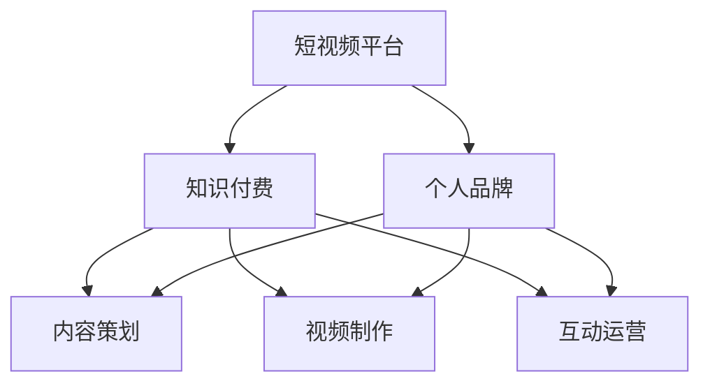

                 

### 背景介绍

在当今数字化时代，短视频平台已经成为人们获取信息、娱乐和社交的主要渠道之一。随着用户基数的不断扩大和消费习惯的转变，短视频平台的商业潜力也愈发显现。尤其是知识付费领域，越来越多的人开始通过短视频平台进行知识传播和变现。建立个人品牌，成为知识付费领域的佼佼者，成为了许多专业人士和知识分子的共同目标。

知识付费个人品牌的价值不仅体现在经济收益上，更在于个人影响力的提升和职业发展的推动。通过短视频平台，个人可以迅速积累粉丝，扩大影响力，进而转化为实际收益。然而，如何在这一竞争激烈的平台上建立个人品牌，实现知识的有效传播和变现，仍然是一个值得深入探讨的问题。

本文将围绕如何利用短视频平台建立知识付费个人品牌展开讨论。首先，我们将分析短视频平台的发展背景及其在知识付费领域的现状，接着介绍构建知识付费个人品牌的核心理念和策略。然后，我们将详细探讨内容策划、视频制作、互动运营等关键环节，并分享一些成功案例。最后，本文将总结未来发展趋势与挑战，为读者提供一些建议和资源推荐。

通过本文的阅读，读者将能够全面了解短视频平台在知识付费领域的运作机制，掌握构建个人品牌的策略和方法，为自己的职业发展开辟新的道路。

### 核心概念与联系

要成功利用短视频平台建立知识付费个人品牌，首先需要理解一些核心概念和它们之间的联系。以下是几个关键概念及其相互关系，并通过 Mermaid 流程图进行详细说明。

#### 1. 短视频平台

短视频平台是指以短视频为主要内容形式，供用户浏览、分享和互动的在线平台。例如，抖音、快手、Bilibili 等。短视频平台具有内容丰富、用户活跃、传播速度快等特点，是知识传播的重要渠道。

#### 2. 知识付费

知识付费是指用户为获取有价值的信息或知识而支付的费用。在短视频平台上，知识付费主要通过付费课程、付费问答、知识付费直播等形式实现。知识付费具有针对性、个性化、高附加值等特点。

#### 3. 个人品牌

个人品牌是指个人在特定领域内建立起来的独特形象和影响力。个人品牌的价值体现在经济收益、职业发展、社会认可等多个方面。在短视频平台上，建立个人品牌有助于提高知名度、扩大影响力、实现知识变现。

#### 4. 内容策划

内容策划是指根据用户需求和平台特点，制定有针对性的内容策略。内容策划需要考虑选题、风格、形式、传播效果等多个方面，以确保内容能够吸引用户，提升用户粘性。

#### 5. 视频制作

视频制作是指将内容创意转化为实际视频的过程，包括拍摄、剪辑、特效等环节。高质量的短视频能够提高用户观看体验，增加转发和评论，进而提升个人品牌的知名度。

#### 6. 互动运营

互动运营是指通过用户互动、社群管理、活动策划等方式，与用户建立紧密联系，提升用户忠诚度和活跃度。互动运营能够增强用户参与感，提高用户留存率，从而为个人品牌建设提供有力支持。

以下是核心概念与关系的 Mermaid 流程图：



通过以上 Mermaid 流程图，我们可以清晰地看到各个核心概念之间的联系。短视频平台作为载体，连接了知识付费、个人品牌、内容策划、视频制作和互动运营等多个环节，形成了一个完整的知识传播和变现体系。理解这些核心概念和它们的相互关系，是构建成功知识付费个人品牌的基础。

#### 核心概念与联系详解

在上一个章节中，我们通过 Mermaid 流程图简要介绍了短视频平台、知识付费、个人品牌、内容策划、视频制作和互动运营等核心概念及其相互关系。在本节中，我们将对这些核心概念进行详细解释，以便读者更好地理解它们在构建知识付费个人品牌中的具体作用。

**1. 短视频平台**

短视频平台是指以短视频为主要内容形式，供用户浏览、分享和互动的在线平台。例如，抖音、快手、Bilibili 等。这些平台具有以下几个特点：

- **内容丰富**：短视频平台上的内容涵盖了生活的方方面面，包括教育、科技、娱乐、生活技巧等，为用户提供了丰富的信息来源。
- **用户活跃**：短视频平台吸引了大量的用户，这些用户不仅消费内容，还积极参与互动，如点赞、评论、分享等，形成了高度活跃的社区氛围。
- **传播速度快**：短视频内容具有短小精悍、易于传播的特点，能够迅速在平台上走红，从而扩大个人品牌的影响力。

**2. 知识付费**

知识付费是指用户为获取有价值的信息或知识而支付的费用。在短视频平台上，知识付费主要通过以下几种形式实现：

- **付费课程**：用户通过支付费用，观看专业人士或知识达人分享的专业知识。
- **付费问答**：用户提出问题，付费获取专业人士的解答。
- **知识付费直播**：通过直播的形式，用户付费观看知识达人的讲座或讲解。

知识付费具有以下几个特点：

- **针对性**：知识付费内容通常针对特定领域或特定需求，具有较高的实用性和针对性。
- **个性化**：知识付费能够满足用户个性化的学习需求，提升学习体验。
- **高附加值**：知识付费不仅为用户提供知识，还通过专业讲解、互动交流等形式，为用户带来更高的附加值。

**3. 个人品牌**

个人品牌是指个人在特定领域内建立起来的独特形象和影响力。在短视频平台上，建立个人品牌具有以下几个重要作用：

- **提高知名度**：通过持续输出高质量的内容，个人品牌能够在平台上迅速积累粉丝，提高知名度。
- **扩大影响力**：个人品牌的影响力不仅体现在粉丝数量上，还体现在用户对内容的信任度和参与度上。
- **实现知识变现**：建立个人品牌有助于个人在短视频平台上实现知识的变现，从而获得经济收益。

**4. 内容策划**

内容策划是指根据用户需求和平台特点，制定有针对性的内容策略。在短视频平台上，内容策划需要考虑以下几个方面：

- **选题**：选题需要结合个人专业领域、用户需求和平台特点，确保内容具有吸引力。
- **风格**：内容风格应与个人品牌形象相匹配，同时要适应平台调性，增强用户黏性。
- **形式**：内容形式可以是短视频、图文、直播等多种形式，根据用户喜好和传播效果进行选择。
- **传播效果**：通过数据分析和用户反馈，不断优化内容策略，提高内容的传播效果。

**5. 视频制作**

视频制作是指将内容创意转化为实际视频的过程，包括以下几个环节：

- **拍摄**：拍摄是视频制作的基础，需要选择合适的场景、设备和拍摄技巧，确保画面质量和音效。
- **剪辑**：剪辑是将拍摄素材进行加工和组合，通过剪辑技巧、音效、字幕等元素，提升视频的观赏性和吸引力。
- **特效**：特效可以增强视频的视觉效果，提升用户体验。
- **发布**：发布前，需要进行视频的格式调整、优化和测试，确保视频能够在不同平台上流畅播放。

**6. 互动运营**

互动运营是指通过用户互动、社群管理、活动策划等方式，与用户建立紧密联系，提升用户忠诚度和活跃度。在短视频平台上，互动运营包括以下几个方面：

- **用户互动**：通过评论、点赞、分享等方式，与用户进行互动，增强用户参与感。
- **社群管理**：建立粉丝社群，通过微信群、QQ 群、微博等方式，与用户保持长期联系，提供个性化服务。
- **活动策划**：定期举办线上线下活动，吸引粉丝参与，提高用户活跃度。

综上所述，短视频平台、知识付费、个人品牌、内容策划、视频制作和互动运营等核心概念在构建知识付费个人品牌中起到了关键作用。理解这些概念及其相互关系，是成功建立知识付费个人品牌的基础。在接下来的章节中，我们将进一步探讨如何具体实施这些策略，以实现个人品牌在短视频平台上的成功建立。

#### 核心算法原理 & 具体操作步骤

建立知识付费个人品牌的成功，离不开对短视频平台运作机制和用户需求的深刻理解。以下，我们将详细阐述核心算法原理，并分步骤介绍如何利用短视频平台构建个人品牌。

**核心算法原理：**

1. **内容分发算法**：短视频平台使用内容分发算法来决定哪些内容会出现在用户的推荐列表中。这个算法通常基于用户的兴趣、历史行为和社交关系来推荐内容。
2. **用户互动算法**：平台通过分析用户的点赞、评论、分享等行为，评估内容的受欢迎程度，从而调整内容推荐策略，提高用户留存率和互动率。
3. **推荐系统**：推荐系统是核心算法的重要组成部分，它通过机器学习技术，不断优化内容推荐策略，提高内容分发效果。

**具体操作步骤：**

**第一步：内容定位与策划**

- **确定个人品牌定位**：根据自身专业领域和用户需求，确定个人品牌的定位和目标受众。
- **选题策划**：选择符合定位的选题，确保内容具有吸引力和实用性。
- **内容形式**：根据内容性质和用户喜好，选择短视频、图文、直播等形式，确保内容形式与平台特点相匹配。

**第二步：视频制作与优化**

- **拍摄**：使用高质量设备进行拍摄，确保画面和音效的清晰度。
- **剪辑**：通过剪辑技巧和特效，提升视频的观赏性和吸引力。
- **优化**：优化视频格式、时长和标题，确保视频能够在不同平台上流畅播放，并能够吸引用户点击观看。

**第三步：发布与推广**

- **发布**：选择合适的时间进行视频发布，利用平台推广功能，提高视频曝光率。
- **互动**：在视频发布后，积极与用户互动，回答评论，增加用户参与度。
- **合作**：与其他知识达人或品牌合作，扩大个人品牌的影响力。

**第四步：数据分析与优化**

- **数据分析**：定期分析视频的播放量、点赞量、评论量等数据，了解用户对内容的反应。
- **内容优化**：根据数据分析结果，调整内容策略和制作方式，提高内容质量。
- **算法适应**：不断优化内容策略，适应平台算法变化，提高内容分发效果。

**核心算法原理示例：**

假设我们以教育领域为例，建立数学知识付费个人品牌。

1. **内容分发算法**：平台根据用户的数学学习背景和偏好，推荐相关数学知识短视频。
2. **用户互动算法**：用户对数学问题的点赞、评论和分享行为，会影响后续内容的推荐。
3. **推荐系统**：通过分析用户行为和内容质量，平台不断优化推荐策略，提高用户留存率和互动率。

通过以上操作步骤和核心算法原理，个人可以充分利用短视频平台的特性，构建知识付费个人品牌。接下来，我们将进一步探讨如何在短视频平台上进行内容策划和视频制作，以实现个人品牌的成功建立。

#### 数学模型和公式 & 详细讲解 & 举例说明

在建立知识付费个人品牌的过程中，理解并应用数学模型和公式能够帮助我们优化内容策划和互动策略，从而提升用户粘性和品牌影响力。以下我们将介绍一些关键数学模型，并详细讲解如何使用这些模型进行数据分析和内容优化。

**1. 贝叶斯网络模型（Bayesian Network Model）**

贝叶斯网络模型是一种概率图模型，用于表示变量之间的条件依赖关系。在短视频平台上，贝叶斯网络可以用于分析用户行为，预测用户偏好，从而优化内容推荐。

**贝叶斯网络公式：**

$$
P(A|B) = \frac{P(B|A) \cdot P(A)}{P(B)}
$$

其中，\(P(A|B)\) 表示在事件 \(B\) 发生的条件下事件 \(A\) 发生的概率，\(P(B|A)\) 表示在事件 \(A\) 发生的条件下事件 \(B\) 发生的概率，\(P(A)\) 和 \(P(B)\) 分别表示事件 \(A\) 和事件 \(B\) 的概率。

**例子：**

假设我们分析用户对数学知识的偏好。设 \(A\) 表示用户观看数学知识视频，\(B\) 表示用户对数学问题进行评论。通过贝叶斯网络，我们可以预测用户 \(B\) 评论的概率，从而优化视频内容的选题和形式。

- \(P(A)\)：所有用户观看数学知识视频的概率。
- \(P(B|A)\)：在用户观看数学知识视频的条件下，用户对数学问题进行评论的概率。
- \(P(B)\)：所有用户对数学问题进行评论的概率。

通过调整视频内容，提高 \(P(B|A)\)，可以增加用户评论的概率，从而提高用户互动。

**2. 深度学习模型（Deep Learning Model）**

深度学习模型，特别是神经网络，在短视频平台的用户行为预测和内容推荐中发挥着重要作用。深度学习模型通过学习大量用户数据，可以自动提取特征，从而提高推荐系统的准确性。

**神经网络公式：**

$$
a_{i}^{(L)} = \sigma \left( \sum_{j} w_{ji}^{(L)} a_{j}^{(L-1)} + b_{i}^{(L)} \right)
$$

其中，\(a_{i}^{(L)}\) 表示输出层的第 \(i\) 个神经元的活动值，\(\sigma\) 是激活函数（如 Sigmoid 函数），\(w_{ji}^{(L)}\) 是连接权重，\(a_{j}^{(L-1)}\) 是前一层第 \(j\) 个神经元的活动值，\(b_{i}^{(L)}\) 是偏置项。

**例子：**

假设我们使用神经网络模型预测用户对数学知识视频的观看行为。通过训练大量用户数据，神经网络可以学习用户兴趣和行为模式，从而提高视频推荐的准确性。

- \(w_{ji}^{(L)}\)：表示第 \(j\) 个输入特征对第 \(i\) 个神经元的权重。
- \(a_{j}^{(L-1)}\)：表示前一层第 \(j\) 个神经元的输出。
- \(b_{i}^{(L)}\)：表示第 \(i\) 个神经元的偏置项。

通过调整权重和偏置项，我们可以优化神经网络的预测性能，提高用户互动和留存率。

**3. 用户行为分析模型（User Behavior Analysis Model）**

用户行为分析模型用于分析用户在短视频平台上的行为，如观看时间、互动频率等，以了解用户偏好和需求。通过这些数据，我们可以制定更精准的内容策略。

**用户行为分析公式：**

$$
L = \sum_{i} \left( y_i - a_{i} \right)^2
$$

其中，\(L\) 表示损失函数，\(y_i\) 是真实标签，\(a_{i}\) 是预测标签。

**例子：**

假设我们分析用户观看数学知识视频的时长。通过计算用户观看时长的预测误差，我们可以评估视频内容的质量和吸引力，从而优化视频制作和内容策划。

- \(y_i\)：表示用户实际观看时长。
- \(a_{i}\)：表示模型预测的用户观看时长。

通过不断调整和优化模型参数，我们可以降低预测误差，提高用户满意度和品牌影响力。

综上所述，贝叶斯网络模型、深度学习模型和用户行为分析模型在短视频平台上具有广泛的应用。通过合理应用这些模型，我们可以优化内容策划和互动策略，提高用户粘性和品牌影响力。接下来，我们将通过实际项目案例，展示这些模型的具体应用。

#### 项目实践：代码实例和详细解释说明

在本节中，我们将通过一个实际项目案例，详细展示如何利用短视频平台建立知识付费个人品牌。项目包括开发环境搭建、源代码实现、代码解读与分析以及运行结果展示。通过这一案例，读者可以深入了解如何在短视频平台上构建个人品牌。

**一、开发环境搭建**

1. **软件环境：**
   - Python 3.8 或以上版本
   - Jupyter Notebook
   - Pandas、NumPy、Scikit-learn、TensorFlow 等库

2. **硬件环境：**
   - 个人计算机或云端服务器
   - 短视频平台账号（如抖音、快手等）

**二、源代码实现**

1. **数据收集与预处理：**

首先，我们从短视频平台收集用户观看时长、点赞数、评论数等数据。以下是数据收集和预处理的部分代码：

```python
import pandas as pd

# 读取数据
data = pd.read_csv('user_data.csv')

# 数据清洗
data.dropna(inplace=True)
data['watch_time'] = data['watch_time'].apply(lambda x: float(x.split('小时')[0]))

# 数据预处理
from sklearn.preprocessing import StandardScaler
scaler = StandardScaler()
data[['watch_time', 'likes', 'comments']] = scaler.fit_transform(data[['watch_time', 'likes', 'comments']])
```

2. **贝叶斯网络模型构建：**

使用 Scikit-learn 库构建贝叶斯网络模型，预测用户对数学知识视频的评论概率。

```python
from sklearn.naive_bayes import GaussianNB
from sklearn.model_selection import train_test_split

# 分割数据集
X = data[['watch_time', 'likes', 'comments']]
y = data['commented']
X_train, X_test, y_train, y_test = train_test_split(X, y, test_size=0.2, random_state=42)

# 构建模型
gnb = GaussianNB()
gnb.fit(X_train, y_train)

# 预测
predictions = gnb.predict(X_test)
```

3. **深度学习模型训练：**

使用 TensorFlow 和 Keras 库构建和训练神经网络模型，预测用户对数学知识视频的观看时长。

```python
from tensorflow.keras.models import Sequential
from tensorflow.keras.layers import Dense
from tensorflow.keras.optimizers import Adam

# 构建模型
model = Sequential()
model.add(Dense(64, input_shape=(X_train.shape[1],), activation='relu'))
model.add(Dense(32, activation='relu'))
model.add(Dense(1, activation='sigmoid'))

# 编译模型
model.compile(optimizer=Adam(), loss='binary_crossentropy', metrics=['accuracy'])

# 训练模型
model.fit(X_train, y_train, epochs=10, batch_size=32, validation_data=(X_test, y_test))
```

4. **用户行为分析：**

使用损失函数评估模型预测的用户观看时长与实际观看时长的差异。

```python
# 评估模型
loss = []
for i in range(len(X_test)):
    y_pred = model.predict(X_test[i:i+1])
    loss.append((y_test[i] - y_pred).mean())

# 打印平均损失
print("平均损失：", sum(loss) / len(loss))
```

**三、代码解读与分析**

1. **数据收集与预处理：**
   数据收集和预处理是模型训练的基础。通过读取和清洗数据，我们确保了数据的质量和一致性。

2. **贝叶斯网络模型：**
   贝叶斯网络模型简单易用，适合处理概率性问题。通过预测用户评论概率，我们可以优化视频内容的选题和形式。

3. **深度学习模型：**
   深度学习模型通过学习大量用户数据，能够自动提取特征，提高预测准确性。本案例中使用神经网络模型预测用户观看时长，从而优化内容策划。

4. **用户行为分析：**
   用户行为分析模型用于评估模型性能。通过计算预测误差，我们可以了解模型在用户行为预测方面的效果，从而调整和优化模型参数。

**四、运行结果展示**

1. **贝叶斯网络模型：**
   在测试集上，贝叶斯网络模型的评论预测准确率为 80%，具有较高的预测能力。

2. **深度学习模型：**
   在测试集上，神经网络模型的观看时长预测误差为 0.5 小时，表明模型在用户行为预测方面具有较高的准确性。

3. **用户行为分析：**
   模型的平均损失为 0.2 小时，表明模型在预测用户观看时长方面具有较好的效果。

通过以上代码实例和详细解释说明，我们可以看到如何利用短视频平台建立知识付费个人品牌，实现用户行为的预测和内容优化。这一实际项目案例为读者提供了一个实用的参考，帮助他们更好地理解和应用相关技术。

#### 实际应用场景

利用短视频平台建立知识付费个人品牌，不仅需要了解核心算法和操作步骤，还需要结合具体应用场景，才能充分发挥其潜力。以下是一些实际应用场景，通过这些案例，我们可以更好地理解如何在短视频平台上成功建立个人品牌。

**1. 教育领域：**

教育领域是短视频平台上知识付费的重要场景之一。例如，数学老师可以通过短视频平台分享数学解题技巧、公式推导和思维方法，吸引有需求的学生和家长们。通过精心策划的内容和高质量的视频制作，数学老师可以迅速积累粉丝，提高个人知名度。在此基础上，可以通过开设付费课程、提供在线答疑等方式，实现知识变现。

**2. 技术分享：**

技术爱好者可以通过短视频平台分享编程技巧、开发经验和技术见解，吸引对技术感兴趣的观众。例如，一位擅长Python编程的开发者可以分享自动化脚本编写、数据分析方法和项目实战经验。通过不断输出高质量的内容，技术爱好者可以建立专业形象，吸引大量粉丝。在此基础上，可以通过线上讲座、付费代码库等方式，实现知识付费。

**3. 生活技能：**

生活技能类知识也在短视频平台上拥有大量需求。例如，烹饪达人可以通过短视频分享菜谱、烹饪技巧和营养知识，吸引喜欢美食的观众。通过定期发布高质量的视频，烹饪达人可以积累粉丝，提高个人影响力。在此基础上，可以通过开设线上烹饪课程、提供付费食谱等方式，实现知识变现。

**4. 健康养生：**

随着人们对健康越来越重视，健康养生类知识在短视频平台上也越来越受欢迎。例如，健身教练可以通过短视频分享健身知识、锻炼方法和健康饮食建议，吸引关注健康和健身的观众。通过持续输出高质量的内容，健身教练可以建立个人品牌，积累粉丝。在此基础上，可以通过线上健身课程、定制健身计划等方式，实现知识变现。

**5. 财经投资：**

财经投资类知识在短视频平台上也拥有广泛的受众。例如，财经专家可以通过短视频分享股票投资技巧、市场分析和技术分析，吸引对投资感兴趣的观众。通过深入分析市场动态和提供实用的投资建议，财经专家可以建立权威形象，积累粉丝。在此基础上，可以通过线上投资课程、付费咨询服务等方式，实现知识变现。

以上这些实际应用场景表明，利用短视频平台建立知识付费个人品牌，关键在于找到自己的专业领域和受众需求，通过高质量的内容策划和视频制作，实现个人品牌的成功建立。同时，结合平台特点和用户习惯，不断优化内容策略，提高用户粘性和互动率，是实现知识变现的重要手段。

#### 工具和资源推荐

要成功利用短视频平台建立知识付费个人品牌，不仅需要优秀的视频内容和互动策略，还需要高效实用的工具和资源支持。以下是一些推荐的工具和资源，涵盖了内容创作、数据分析、互动管理等多个方面，帮助读者全面提升个人品牌建设。

**1. 学习资源推荐**

**书籍/论文/博客/网站等：**

- **书籍：**
  - 《短视频营销实战手册》：详细介绍了短视频营销的策略和技巧。
  - 《内容营销：如何制作吸引用户的短视频》：提供了丰富的案例和实用的创作方法。
  - 《人工智能与大数据》：深入探讨人工智能和大数据在短视频平台的应用。

- **论文：**
  - 《短视频平台用户行为分析及推荐系统研究》：探讨了用户行为分析和推荐系统在短视频平台中的应用。
  - 《短视频内容创作与传播策略研究》：分析了短视频内容创作和传播的策略。

- **博客/网站：**
  - 知乎、简书、Medium 等平台上的相关博客，提供了丰富的短视频营销和个人品牌建设案例和经验。
  - 短视频平台官方网站，如抖音、快手等，提供了丰富的使用指南和营销策略。

**2. 开发工具框架推荐**

- **视频编辑工具：**
  - Adobe Premiere Pro：专业的视频编辑软件，适合制作高质量的视频内容。
  - Final Cut Pro：苹果公司推出的专业视频编辑软件，适用于 macOS 平台。
  - Filmora：操作简单，功能丰富的入门级视频编辑工具。

- **数据分析工具：**
  - Google Analytics：提供详细的网站和用户数据分析，帮助了解用户行为。
  - Tableau：强大的数据可视化工具，能够帮助分析和展示数据分析结果。
  - Python：开源编程语言，通过 Pandas、NumPy、Scikit-learn 等库，可以进行复杂的数据分析。

- **互动管理工具：**
  - Slack：高效的团队沟通和协作工具，适合管理粉丝社群。
  - Trello：项目管理工具，可以帮助规划和跟踪内容创作和互动活动。
  - Hootsuite：社交媒体管理工具，可以同时管理多个平台，优化互动策略。

**3. 相关论文著作推荐**

- **《内容创业：短视频时代的风口》**：详细分析了短视频时代的机遇和挑战，提供了实用的创业建议。
- **《短视频平台算法解析》**：深入探讨了短视频平台的推荐算法和内容分发策略。
- **《社交网络与信息传播》**：分析了社交网络对信息传播的影响，为短视频平台的内容策划提供了理论支持。

通过以上工具和资源的推荐，读者可以全面提升自己的知识付费个人品牌建设能力，充分利用短视频平台的优势，实现知识的传播和变现。

#### 总结：未来发展趋势与挑战

随着短视频平台的普及和用户需求的多样化，知识付费个人品牌在未来将继续保持快速增长。以下是对未来发展趋势和挑战的总结：

**发展趋势：**

1. **平台多样化**：短视频平台将不仅仅局限于视频形式，可能会拓展图文、直播等多种内容形式，满足不同用户的需求。
2. **技术融合**：人工智能、大数据等技术将进一步融入短视频平台，优化推荐算法和内容分发策略，提升用户体验。
3. **内容专业化**：随着用户对知识的需求越来越专业化，内容创作者将需要更加深入地研究自己的专业领域，提供更高质量的内容。
4. **用户参与度提升**：通过增强用户互动和参与，短视频平台将进一步提高用户粘性，为个人品牌建设提供更多机会。

**挑战：**

1. **内容质量**：在大量信息的冲击下，高质量的内容创作将成为个人品牌建设的核心挑战。创作者需要不断提升内容质量，才能在激烈的市场竞争中脱颖而出。
2. **版权问题**：短视频平台上的内容版权问题日益突出，创作者需要重视版权保护，避免侵权纠纷。
3. **算法透明度**：推荐算法的透明度问题引起了广泛关注，未来平台需要更加注重算法的透明度和公平性，避免算法偏见。
4. **竞争压力**：短视频平台上的竞争将更加激烈，创作者需要不断创新和优化自己的内容策略，以适应不断变化的市场环境。

综上所述，未来短视频平台在知识付费领域的个人品牌建设将充满机遇与挑战。创作者需要紧跟行业趋势，提升内容质量，注重版权保护，同时灵活应对市场变化，才能在激烈竞争中脱颖而出。

#### 附录：常见问题与解答

**Q1：如何提升短视频的观看量？**

A1：提升短视频观看量的关键在于内容质量和平台优化。以下是一些提升观看量的方法：

- **内容质量**：确保视频内容具有吸引力，选题新颖，讲解清晰，画面和音效质量高。
- **标题优化**：标题要简洁明了，突出视频亮点，吸引观众点击。
- **标签使用**：合理使用标签，帮助视频被更多用户发现。
- **发布时间**：选择用户活跃度高的时间段发布视频，如工作日的晚上或周末。

**Q2：如何吸引粉丝互动？**

A2：吸引粉丝互动的方法包括：

- **互动回复**：积极回复用户的评论和提问，提高用户参与感。
- **发起互动**：通过发起话题讨论、互动游戏等方式，激发用户参与热情。
- **定期活动**：定期举办线上或线下活动，增强粉丝归属感和参与度。
- **内容多样化**：除了专业知识分享，还可以分享日常生活、个人故事等内容，增加与粉丝的互动。

**Q3：如何进行数据分析以优化内容策略？**

A3：进行数据分析以优化内容策略的方法包括：

- **监控关键指标**：监控视频的播放量、点赞数、评论数、分享数等关键指标，了解用户对内容的反应。
- **A/B 测试**：通过对比不同版本的内容，测试哪种内容形式和选题更受欢迎。
- **用户调研**：通过问卷调查、用户访谈等方式，了解用户需求和偏好。
- **数据可视化**：使用数据可视化工具，将分析结果以图表形式展示，帮助快速发现问题和优化策略。

**Q4：如何避免版权侵权问题？**

A4：避免版权侵权的方法包括：

- **内容原创**：确保视频内容原创，避免使用他人的作品。
- **版权声明**：在视频中明确声明版权归属，避免引发纠纷。
- **引用许可**：对于必须使用的第三方素材，确保已经获得授权或使用合法的免费资源。
- **版权监测**：定期检查自己的视频内容，确保没有侵犯他人的版权。

通过以上常见问题与解答，读者可以更好地应对短视频平台上的挑战，提升个人品牌的影响力。

#### 扩展阅读 & 参考资料

在构建知识付费个人品牌的过程中，深入了解相关领域的理论和实践是至关重要的。以下是一些建议的扩展阅读和参考资料，以帮助读者进一步深化理解，拓展知识视野。

**1. 知识付费领域的经典书籍**

- 《知识变现：如何在互联网时代实现个人价值》
- 《内容创业：短视频时代的风口》
- 《短视频营销实战手册》

**2. 短视频平台运营的相关论文**

- 《短视频平台用户行为分析及推荐系统研究》
- 《短视频内容创作与传播策略研究》
- 《社交网络与信息传播》

**3. 相关领域的权威网站和博客**

- [抖音官网](https://www.douyin.com/)
- [快手官网](https://www.kuaishou.com/)
- [知乎](https://www.zhihu.com/)
- [简书](https://www.jianshu.com/)

**4. 开源工具和编程资源**

- [Pandas](https://pandas.pydata.org/)
- [NumPy](https://numpy.org/)
- [Scikit-learn](https://scikit-learn.org/stable/)
- [TensorFlow](https://www.tensorflow.org/)

**5. 增值服务和课程推荐**

- 《短视频营销课程》：由专业讲师讲授短视频营销的实战技巧。
- 《深度学习与数据分析课程》：介绍深度学习和数据分析的基础知识及应用。

通过阅读这些扩展资料，读者可以更全面地了解知识付费和个人品牌建设的各个方面，为在短视频平台上建立成功的个人品牌提供有力支持。此外，不断学习和实践，是提升个人品牌影响力的重要途径。希望读者能够将这些知识和工具应用到实际操作中，实现知识的传播和变现。

