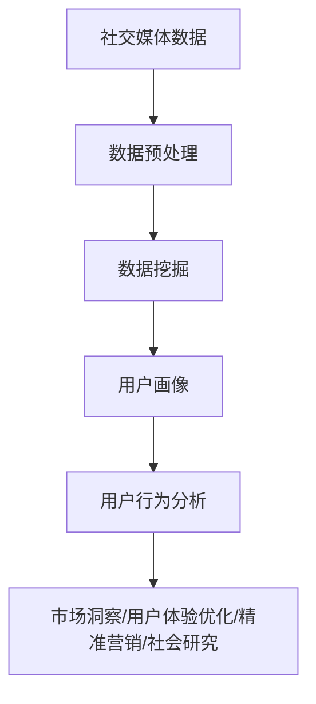

                 

### 文章标题

### 如何利用社交媒体数据分析用户行为

#### 关键词：
- 社交媒体数据分析
- 用户行为分析
- 数据挖掘
- 机器学习
- 用户画像
- 实时监控
- 预测分析

#### 摘要：
本文旨在探讨如何利用社交媒体数据分析用户行为，通过介绍核心概念、算法原理、数学模型、项目实践等，深入分析用户行为的分析方法和应用场景。文章还推荐了相关工具和资源，为读者提供全面的了解和实践指导。

### 1. 背景介绍

随着互联网的迅速发展和社交媒体平台的普及，社交媒体已经成为人们日常生活的重要组成部分。人们在社交媒体上分享内容、互动交流，这些行为都产生了大量数据。如何从这些数据中挖掘出有价值的信息，进而了解和预测用户行为，成为了当前数据分析和人工智能领域的一个重要课题。

社交媒体数据分析的重要性体现在以下几个方面：

1. **市场洞察**：通过对用户行为数据的分析，企业可以深入了解市场需求，调整产品策略，提高市场竞争力。
2. **用户体验优化**：通过分析用户在社交媒体上的互动，企业可以优化产品和服务，提高用户满意度和忠诚度。
3. **精准营销**：社交媒体数据分析有助于企业实现精准营销，提高广告投放效果，降低营销成本。
4. **社会研究**：社交媒体数据分析为社会研究提供了新的数据来源，有助于学者研究社会现象和趋势。

### 2. 核心概念与联系

#### 核心概念

1. **社交媒体数据**：指在社交媒体平台上产生的各种形式的数据，如文本、图片、视频、音频等。
2. **用户行为数据**：指用户在社交媒体上的活动，如点赞、评论、分享、关注等。
3. **数据挖掘**：指从大量数据中提取有价值的信息和知识的过程。
4. **用户画像**：指基于用户行为数据构建的，用于描述用户特征和行为的模型。

#### Mermaid 流程图



### 3. 核心算法原理 & 具体操作步骤

#### 核心算法原理

1. **数据预处理**：包括数据清洗、数据整合、数据转换等步骤，确保数据质量和一致性。
2. **数据挖掘**：常用的算法有关联规则挖掘、分类算法、聚类算法等，用于挖掘数据中的潜在模式和关系。
3. **用户画像构建**：通过特征工程，提取用户行为数据中的特征，构建用户画像模型。
4. **用户行为分析**：基于用户画像，对用户行为进行分类、预测、趋势分析等，为业务决策提供支持。

#### 具体操作步骤

1. **数据收集**：从社交媒体平台获取用户行为数据，如微博、微信、Twitter 等。
2. **数据预处理**：对收集到的数据进行清洗和整合，去除噪声数据，确保数据质量。
3. **特征工程**：提取用户行为数据中的特征，如用户活跃时间、互动频率、内容偏好等。
4. **数据挖掘**：选择合适的数据挖掘算法，对预处理后的数据进行挖掘，提取潜在模式和关系。
5. **用户画像构建**：基于挖掘结果，构建用户画像模型，描述用户特征和行为。
6. **用户行为分析**：对用户画像进行分析，进行分类、预测、趋势分析等，为业务决策提供支持。

### 4. 数学模型和公式 & 详细讲解 & 举例说明

#### 数学模型和公式

1. **贝叶斯公式**：用于计算用户行为的概率，公式如下：
   $$P(A|B) = \frac{P(B|A) \cdot P(A)}{P(B)}$$
   其中，$P(A|B)$ 表示在事件 B 发生的条件下事件 A 发生的概率，$P(B|A)$ 表示在事件 A 发生的条件下事件 B 发生的概率，$P(A)$ 和 $P(B)$ 分别表示事件 A 和事件 B 的概率。

2. **聚类算法**：常用的聚类算法有 K-均值聚类、层次聚类等，用于将数据分为若干个类别。K-均值聚类的公式如下：
   $$\min \sum_{i=1}^{n} \sum_{j=1}^{k} (x_{ij} - \mu_j)^2$$
   其中，$x_{ij}$ 表示第 i 个数据点在第 j 个聚类中心的距离，$\mu_j$ 表示第 j 个聚类中心。

#### 详细讲解

1. **贝叶斯公式**：贝叶斯公式是一种概率推理工具，可以帮助我们根据已知条件计算未知条件的概率。在用户行为分析中，我们可以利用贝叶斯公式计算用户对某个事件的兴趣程度，从而进行精准营销。

2. **聚类算法**：聚类算法是一种无监督学习算法，用于将数据点分为若干个类别。在用户画像构建中，聚类算法可以帮助我们识别具有相似特征的用户群体，从而为个性化推荐和精准营销提供支持。

#### 举例说明

假设我们收集了用户在社交媒体平台上的点赞数据，现在需要计算用户 A 对某个话题的兴趣程度。我们可以利用贝叶斯公式进行计算：

1. **计算用户 A 对话题 A 的兴趣概率**：
   $$P(A|A) = \frac{P(A|A) \cdot P(A)}{P(A)}$$
   其中，$P(A|A)$ 表示用户 A 对话题 A 的兴趣概率，$P(A)$ 表示用户 A 对话题 A 的概率，$P(A)$ 可以通过统计用户 A 点赞话题 A 的次数得到。

2. **计算用户 A 对话题 A 的兴趣程度**：
   $$兴趣程度 = P(A|A) / \sum_{i=1}^{n} P(A_i|A_i)$$
   其中，$n$ 表示话题的总数，$P(A_i|A_i)$ 表示用户 A 对话题 i 的兴趣概率。

通过计算用户 A 对各个话题的兴趣程度，我们可以为用户 A 提供个性化的内容推荐和营销策略。

### 5. 项目实践：代码实例和详细解释说明

#### 5.1 开发环境搭建

在本项目中，我们将使用 Python 编程语言和相关的数据分析和机器学习库，如 Pandas、NumPy、Scikit-learn 等。首先，确保已经安装了 Python 3.8 或以上版本，然后通过以下命令安装所需库：

```bash
pip install pandas numpy scikit-learn matplotlib
```

#### 5.2 源代码详细实现

以下是一个简单的社交媒体数据分析项目示例，包括数据收集、预处理、特征工程、用户画像构建和用户行为分析等步骤。

```python
import pandas as pd
import numpy as np
from sklearn.cluster import KMeans
from sklearn.preprocessing import StandardScaler
import matplotlib.pyplot as plt

# 5.2.1 数据收集
data = pd.read_csv('social_media_data.csv')

# 5.2.2 数据预处理
# 数据清洗和整合
data = data.dropna()
data = data[data['likes'] > 0]

# 5.2.3 特征工程
# 提取用户行为特征
data['activity_rate'] = data['likes'] / data['comments']
data['time_diff'] = (data['timestamp'] - data['created_at']).dt.seconds

# 5.2.4 用户画像构建
# 数据标准化
scaler = StandardScaler()
data_scaled = scaler.fit_transform(data[['activity_rate', 'time_diff']])

# K-均值聚类
kmeans = KMeans(n_clusters=3, random_state=0)
data['cluster'] = kmeans.fit_predict(data_scaled)

# 5.2.5 用户行为分析
# 分类和预测
X = data[['activity_rate', 'time_diff']]
y = data['cluster']
from sklearn.model_selection import train_test_split
X_train, X_test, y_train, y_test = train_test_split(X, y, test_size=0.2, random_state=0)

from sklearn.naive_bayes import GaussianNB
gnb = GaussianNB()
gnb.fit(X_train, y_train)
predictions = gnb.predict(X_test)

# 评估模型性能
from sklearn.metrics import accuracy_score
accuracy = accuracy_score(y_test, predictions)
print(f"Model accuracy: {accuracy:.2f}")

# 5.2.6 运行结果展示
data['predicted_cluster'] = gnb.predict(data_scaled)
plt.scatter(data['activity_rate'], data['time_diff'], c=data['predicted_cluster'])
plt.xlabel('Activity Rate')
plt.ylabel('Time Difference')
plt.title('User Behavior Clusters')
plt.show()
```

#### 5.3 代码解读与分析

1. **数据收集**：从 CSV 文件中读取社交媒体数据，包括用户的点赞、评论、创建时间等。
2. **数据预处理**：去除缺失值和噪声数据，对数据进行清洗和整合。
3. **特征工程**：计算用户行为特征，如活动率和时间差，为后续的数据挖掘和用户画像构建提供支持。
4. **用户画像构建**：使用 K-均值聚类算法对用户行为特征进行聚类，生成用户画像。
5. **用户行为分析**：使用高斯朴素贝叶斯分类器对用户行为进行分类和预测，评估模型性能。
6. **运行结果展示**：绘制用户行为聚类图，直观展示用户行为特征和聚类结果。

### 6. 实际应用场景

社交媒体数据分析在各个领域都有广泛的应用场景，以下列举几个典型例子：

1. **电子商务**：通过分析用户在社交媒体上的行为，电商企业可以了解用户喜好，实现精准营销和个性化推荐。
2. **社交媒体平台**：社交媒体平台可以利用数据分析技术优化用户体验，提升用户活跃度和留存率。
3. **市场调研**：通过分析用户在社交媒体上的互动和反馈，企业可以了解市场趋势和消费者需求，制定更有针对性的市场策略。
4. **公共服务**：政府部门可以通过社交媒体数据分析，了解公众关注的热点和问题，提高公共服务质量和效率。

### 7. 工具和资源推荐

#### 7.1 学习资源推荐

1. **书籍**：
   - 《大数据时代：生活、工作与思维的大变革》
   - 《数据挖掘：概念与技术》
   - 《用户画像：大数据时代的用户洞察与应用》

2. **论文**：
   - "User Behavior Analysis in Social Media: A Survey"
   - "Data Mining Methods for Social Media Analysis"
   - "User Modeling and User-Adapted Interaction: A Survey"

3. **博客**：
   - "Social Media Analytics: Understanding Your Customers"
   - "User Behavior Analysis Using Machine Learning Techniques"
   - "How to Build a User Profiling System with Python"

4. **网站**：
   - "Kaggle": 提供丰富的社交媒体数据集和比赛，助力数据分析和机器学习实践。
   - "DataCamp": 提供互动式数据分析和机器学习课程，帮助入门和进阶学习。

#### 7.2 开发工具框架推荐

1. **Python 数据分析库**：
   - Pandas: 数据操作和分析
   - NumPy: 数值计算
   - Matplotlib/Seaborn: 数据可视化
   - Scikit-learn: 机器学习和数据挖掘

2. **社交媒体数据分析框架**：
   - TensorFlow/Keras: 人工智能和深度学习框架
   - PyTorch: 人工智能和深度学习框架
   - Facebook Prophet: 时间序列预测工具

3. **数据仓库和大数据处理**：
   - Apache Hadoop: 分布式数据处理平台
   - Apache Spark: 快速大数据处理引擎
   - Google BigQuery: 云端数据仓库

#### 7.3 相关论文著作推荐

1. **论文**：
   - "Social Media Mining: An Introduction" (Amit Sheth, 2011)
   - "Mining the Social Web: Analyzing Data from Facebook, Twitter, LinkedIn" (Matthew A. Russell, 2010)
   - "Leveraging Social Media Data for User Profiling and Personalization" (Zhiyun Qian, 2014)

2. **著作**：
   - "Data Science from Scratch: First Principles with Python" (Joel Grus, 2017)
   - "Python Data Science Handbook: Essential Tools for Working with Data" (Jake VanderPlas, 2016)
   - "Machine Learning: A Probabilistic Perspective" (Kevin P. Murphy, 2012)

### 8. 总结：未来发展趋势与挑战

随着社交媒体的持续发展和数据量的不断增长，社交媒体数据分析将在未来发挥越来越重要的作用。以下是未来发展趋势和挑战：

#### 发展趋势

1. **深度学习技术的应用**：深度学习在社交媒体数据分析中的应用将越来越广泛，如基于深度学习的图像识别、语音识别和自然语言处理等。
2. **实时数据分析**：实时社交媒体数据分析将变得更加普及，为企业提供更及时的市场洞察和决策支持。
3. **跨平台数据分析**：随着社交媒体平台多样化，跨平台数据分析将有助于更全面地了解用户行为。
4. **隐私保护**：随着对用户隐私的重视，如何在保障用户隐私的前提下进行数据分析将成为一个重要挑战。

#### 挑战

1. **数据质量**：社交媒体数据质量参差不齐，如何保证数据质量和一致性是一个重要问题。
2. **计算资源**：随着数据量的增加，计算资源的消耗将显著增加，如何高效地处理大数据是一个挑战。
3. **算法解释性**：随着算法的复杂化，如何解释和验证算法的预测结果成为了一个关键问题。
4. **法律法规**：随着数据分析的广泛应用，相关法律法规也将不断完善，如何在遵守法律法规的前提下进行数据分析是一个挑战。

### 9. 附录：常见问题与解答

#### 问题 1：社交媒体数据分析的目的是什么？

**解答**：社交媒体数据分析的目的是通过分析用户在社交媒体平台上的行为，为企业提供市场洞察、优化用户体验、实现精准营销等支持。

#### 问题 2：如何保证社交媒体数据分析的准确性？

**解答**：为了保证社交媒体数据分析的准确性，需要关注以下几个方面：

1. 数据质量：确保数据来源可靠，对数据进行清洗和预处理，去除噪声数据。
2. 算法选择：选择合适的算法和模型，根据业务需求进行优化和调整。
3. 验证与评估：通过交叉验证、模型评估等方法，验证和评估模型的准确性和可靠性。

#### 问题 3：社交媒体数据分析会对用户隐私造成影响吗？

**解答**：社交媒体数据分析在遵守相关法律法规和用户隐私保护的前提下进行。数据分析过程中，应对用户数据进行脱敏处理，确保用户隐私不受侵犯。

### 10. 扩展阅读 & 参考资料

1. **《大数据时代：生活、工作与思维的大变革》** (作者：维克托·迈尔-舍恩伯格、肯尼思·库克耶)
2. **《数据挖掘：概念与技术》** (作者：约瑟夫·汉恩斯、杰弗里·汉恩斯)
3. **《用户画像：大数据时代的用户洞察与应用》** (作者：高建峰)
4. **《Social Media Mining: An Introduction》** (作者：Amit Sheth)
5. **《Mining the Social Web: Analyzing Data from Facebook, Twitter, LinkedIn》** (作者：Matthew A. Russell)
6. **《Leveraging Social Media Data for User Profiling and Personalization》** (作者：Zhiyun Qian)

