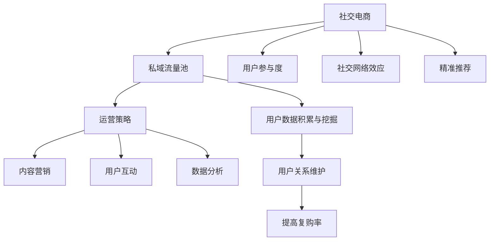

                 

### 背景介绍

#### 社交电商的崛起

社交电商，作为一种新兴的电商模式，近年来在全球范围内迅速崛起。其核心在于利用社交媒体的互动性和用户之间的信任关系，将社交网络转化为商业交易的渠道。这种模式不仅改变了传统的电商销售方式，还为创业者提供了一种全新的私域流量池运营策略。

社交电商的成功离不开以下几个关键因素：

1. **用户参与度**：社交电商平台通过互动、分享和评论等功能，提升了用户的参与感和忠诚度，使得用户更愿意在平台上进行消费。
2. **社交网络效应**：用户通过社交平台分享购物体验，吸引了更多的潜在用户，从而实现了病毒式营销。
3. **精准推荐**：借助大数据和人工智能技术，社交电商能够精准地推送用户感兴趣的商品，提高转化率。

#### 私域流量池的概念

私域流量池是指企业通过自身拥有的渠道和用户群体，建立起来的一种可重复、可控制的流量来源。相比于公域流量（如搜索引擎、社交媒体平台等），私域流量具有更高的稳定性和转化率。建立私域流量池的关键在于：

1. **用户数据的积累与挖掘**：通过用户行为数据的收集和分析，企业可以更深入地了解用户需求，实现个性化推荐和精准营销。
2. **用户关系的维护**：通过建立用户社群、互动营销等方式，增强用户粘性和忠诚度，从而提高复购率。

#### 运营策略的重要性

在社交电商时代，运营策略的制定与执行对企业成功至关重要。一个有效的运营策略需要考虑以下几个方面：

1. **内容营销**：通过优质的内容吸引和留住用户，提升品牌影响力。
2. **用户互动**：通过线上线下活动、互动评论等方式，增强用户参与感和忠诚度。
3. **数据分析**：通过数据分析，了解用户行为和需求，不断优化运营策略。

总的来说，社交电商模式的崛起为创业者提供了丰富的机遇。通过构建私域流量池和制定有效的运营策略，企业可以在竞争激烈的市场中脱颖而出。接下来，我们将深入探讨如何利用社交电商模式打造创业私域流量池和运营，提供具体的步骤和策略。

### 核心概念与联系

在深入探讨如何利用社交电商模式打造创业私域流量池和运营之前，首先需要了解几个核心概念及其相互关系。以下是这些概念及其关系的一个详细解释，以及一个Mermaid流程图来帮助读者更好地理解。

#### 核心概念

1. **社交电商**：社交电商是将社交网络与电商业务相结合的一种新兴模式。其主要特点包括用户参与度、社交网络效应和精准推荐。
2. **私域流量**：私域流量是企业通过自有的渠道（如公众号、社群、小程序等）建立的流量池。其特点是可控、稳定和高转化率。
3. **运营策略**：运营策略是企业为了实现特定目标而制定的行动计划。它包括内容营销、用户互动和数据分析等方面。

#### 相互关系

- **社交电商与私域流量的关系**：社交电商模式为建立私域流量池提供了有效的渠道。通过在社交平台上开展活动、发布内容等方式，企业可以吸引和积累潜在用户，从而形成私域流量。
- **私域流量与运营策略的关系**：私域流量池的建立为实施运营策略提供了基础。企业可以通过数据分析和用户互动，不断优化运营策略，提高转化率和用户粘性。

#### Mermaid 流程图

以下是一个Mermaid流程图，展示了社交电商、私域流量和运营策略之间的相互关系。



#### 详细解释

1. **社交电商**：社交电商平台通过用户互动和分享，提高了用户的参与度，从而形成了强大的社交网络效应。这种效应不仅促进了用户之间的病毒式传播，还为企业提供了精准推荐的基础。
2. **私域流量池**：企业通过在社交平台上的运营，积累了大量用户数据。这些数据可以帮助企业更深入地了解用户需求，从而实现个性化的内容营销和精准的用户互动。
3. **运营策略**：运营策略包括内容营销、用户互动和数据分析等多个方面。通过制定和实施这些策略，企业可以不断提升用户参与度、维护用户关系，并提高复购率。

通过以上核心概念和Mermaid流程图的详细解释，我们可以更清楚地理解社交电商、私域流量和运营策略之间的相互关系。接下来，我们将进一步探讨如何具体利用这些概念来打造创业私域流量池和运营。

### 核心算法原理 & 具体操作步骤

#### 社交电商算法原理

社交电商的核心算法原理主要包括用户行为分析、推荐算法和用户互动模型。

1. **用户行为分析**：
   - **数据收集**：通过用户在社交平台上的浏览、点击、购买等行为，收集用户行为数据。
   - **数据分析**：利用数据挖掘技术，对用户行为数据进行深入分析，识别用户兴趣和偏好。

2. **推荐算法**：
   - **协同过滤**：基于用户的历史行为和评分数据，通过计算用户之间的相似度，推荐相似用户喜欢的商品。
   - **内容推荐**：结合商品内容和用户兴趣，通过文本匹配和关键词提取等技术，推荐用户可能感兴趣的商品。

3. **用户互动模型**：
   - **社交网络分析**：通过分析用户在社交平台上的关系网络，识别关键节点和社区结构，优化用户互动体验。
   - **互动策略**：根据用户互动数据，制定个性化的互动策略，提高用户参与度和忠诚度。

#### 具体操作步骤

1. **数据收集**：
   - **用户行为数据**：通过社交电商平台的后台数据接口，收集用户的浏览、点击、购买等行为数据。
   - **用户反馈数据**：收集用户对商品的评价、评论、点赞等反馈数据。

2. **数据分析**：
   - **用户画像**：根据用户行为和反馈数据，构建用户画像，包括用户年龄、性别、兴趣爱好、消费习惯等。
   - **兴趣标签**：提取用户的关键兴趣标签，用于推荐算法和内容营销。

3. **推荐算法**：
   - **协同过滤**：使用矩阵分解或KNN等算法，计算用户之间的相似度，构建用户-商品评分矩阵。
   - **内容推荐**：通过文本匹配和关键词提取，将用户兴趣标签与商品内容进行关联，生成个性化推荐列表。

4. **用户互动模型**：
   - **社交网络分析**：使用网络分析算法，识别社交网络中的关键节点和社区结构。
   - **互动策略**：根据用户互动数据，制定个性化的互动策略，如推送定制化内容、举办互动活动等。

#### 示例

假设一个社交电商平台想要为用户推荐商品，具体操作步骤如下：

1. **数据收集**：
   - 收集用户A的历史浏览记录：浏览过服装、鞋子、化妆品等类别。
   - 收集用户A的购买记录：购买过一款某品牌的女鞋。

2. **数据分析**：
   - 构建用户A的用户画像：年龄25-35岁，女性，喜欢时尚、个性化产品。
   - 提取用户A的兴趣标签：时尚、个性化、女性专用。

3. **推荐算法**：
   - 使用协同过滤算法，找出与用户A兴趣相似的其它用户，推荐他们喜欢的商品。
   - 根据用户A的兴趣标签，推荐相关的时尚、个性化商品。

4. **用户互动模型**：
   - 识别用户A在社交平台上的社交网络，找出关键节点和社区结构。
   - 发送定制化的推荐内容，如“根据你的兴趣，我们为你推荐了这些时尚新品”，并附上推荐商品链接。

通过以上步骤，社交电商平台能够为用户A提供个性化的商品推荐，提高用户满意度和转化率。这一过程不仅体现了社交电商算法原理的核心思想，也为后续的运营策略提供了数据支持。

### 数学模型和公式 & 详细讲解 & 举例说明

在社交电商和私域流量运营中，数学模型和公式起着至关重要的作用。它们可以帮助我们更科学地分析用户行为、优化推荐算法和制定运营策略。以下是几个常用的数学模型和公式，以及它们的详细讲解和具体应用示例。

#### 用户行为预测模型

用户行为预测模型是社交电商中用于预测用户购买行为、点击率等指标的重要工具。以下是两种常用的用户行为预测模型：

1. **逻辑回归模型**：

   逻辑回归模型是一种广义线性模型，用于预测二分类事件的发生概率。其公式如下：

   $$ P(Y=1|X) = \frac{1}{1 + e^{-(\beta_0 + \beta_1X_1 + \beta_2X_2 + ... + \beta_nX_n)}} $$

   其中，\(P(Y=1|X)\) 表示在给定特征 \(X\) 下，事件 \(Y\) 发生的概率；\(\beta_0, \beta_1, \beta_2, ..., \beta_n\) 是模型参数。

   **示例**：假设我们要预测用户是否会在社交电商平台上购买某个商品，可以构建一个逻辑回归模型。特征包括用户年龄、购买历史、浏览时长等。通过训练模型，我们可以得到不同特征对购买概率的影响权重。

2. **贝叶斯网络模型**：

   贝叶斯网络模型是一种概率图模型，用于表示变量之间的条件依赖关系。其公式如下：

   $$ P(X_1, X_2, ..., X_n) = \prod_{i=1}^{n} P(X_i | parents(X_i)) $$

   其中，\(P(X_1, X_2, ..., X_n)\) 表示变量 \(X_1, X_2, ..., X_n\) 的联合概率；\(parents(X_i)\) 表示变量 \(X_i\) 的父节点集合。

   **示例**：在一个社交电商平台中，我们可以构建一个贝叶斯网络模型来预测用户是否会购买某个商品。模型中的变量包括用户年龄、性别、浏览历史、购买历史等。通过计算各变量之间的条件概率，我们可以得到用户购买该商品的概率。

#### 推荐算法优化模型

推荐算法优化的核心目标是提高推荐的准确性和用户满意度。以下是一种常用的推荐算法优化模型——协同过滤模型：

1. **矩阵分解模型**：

   矩阵分解模型是一种基于协同过滤的推荐算法，通过将用户-商品评分矩阵分解为用户特征矩阵和商品特征矩阵，实现个性化推荐。其公式如下：

   $$ R_{ui} = \langle \mathbf{u_i}, \mathbf{v_j} \rangle + \epsilon_{uij} $$

   其中，\(R_{ui}\) 表示用户 \(u_i\) 对商品 \(j\) 的评分；\(\langle \mathbf{u_i}, \mathbf{v_j} \rangle\) 表示用户 \(u_i\) 的特征向量与商品 \(j\) 的特征向量之间的点积；\(\epsilon_{uij}\) 是误差项。

   **示例**：假设我们有一个用户-商品评分矩阵 \(R\)，通过矩阵分解，可以得到用户特征矩阵 \(\mathbf{U}\) 和商品特征矩阵 \(\mathbf{V}\)。然后，我们可以利用这两个特征矩阵计算用户 \(u_i\) 对未评分商品 \(j\) 的预测评分。

#### 用户流失预测模型

用户流失预测模型用于预测用户在未来某一时间段内停止使用社交电商平台的可能性。以下是一种常用的用户流失预测模型——生存分析模型：

1. **生存分析模型**：

   生存分析模型是一种用于分析事件发生时间的概率分布的统计方法。其公式如下：

   $$ h(t) = \frac{f(t)}{1 - S(t)} $$

   其中，\(h(t)\) 表示在时间 \(t\) 处的生存函数；\(f(t)\) 表示在时间 \(t\) 处的风险函数；\(S(t)\) 表示在时间 \(t\) 处的生存函数。

   **示例**：假设我们要预测用户在接下来一个月内停止使用社交电商平台的可能性，可以通过生存分析模型计算用户流失的风险函数和生存函数。这些指标可以帮助企业制定针对性的用户维护策略。

通过上述数学模型和公式的详细讲解，我们可以更好地理解社交电商和私域流量运营中的关键环节。在实际应用中，这些模型和公式需要结合具体业务场景和数据集进行训练和优化，以实现更准确的预测和更高效的运营。

### 项目实践：代码实例和详细解释说明

#### 开发环境搭建

在进行社交电商私域流量池的项目实践之前，我们需要搭建一个适合开发和测试的开发环境。以下是具体的步骤：

1. **安装Python环境**：
   - 访问Python官方网站（https://www.python.org/）下载Python安装包。
   - 安装Python时，确保勾选“Add Python to PATH”选项，以便在命令行中使用Python。
   - 安装完成后，在命令行中输入`python --version`验证安装是否成功。

2. **安装相关库**：
   - 使用pip（Python的包管理器）安装所需的库，如NumPy、Pandas、Scikit-learn等。
   - 打开命令行窗口，依次输入以下命令：
     ```shell
     pip install numpy
     pip install pandas
     pip install scikit-learn
     ```

3. **配置Jupyter Notebook**：
   - 安装Jupyter Notebook，以便在浏览器中编写和运行Python代码。
   - 打开命令行窗口，输入以下命令：
     ```shell
     pip install jupyter
     jupyter notebook
     ```

完成以上步骤后，我们的开发环境就搭建完成了，可以开始编写代码进行项目实践。

#### 源代码详细实现

以下是一个简单的社交电商私域流量池项目示例，包含数据预处理、用户行为预测和推荐算法实现等步骤。

1. **数据预处理**：

   首先，我们需要从社交电商平台获取用户行为数据，并进行预处理。以下是一个简单的数据预处理脚本：

   ```python
   import pandas as pd
   from sklearn.model_selection import train_test_split

   # 加载数据
   data = pd.read_csv('user_behavior_data.csv')

   # 数据预处理
   data['age'] = data['age'].astype(int)
   data['purchase_history'] = data['purchase_history'].astype(int)
   data['browse_time'] = data['browse_time'].astype(int)

   # 特征工程
   data['age_group'] = pd.cut(data['age'], bins=[18, 25, 35, 45, 55, 65], labels=[1, 2, 3, 4, 5])
   data['days_since_last_purchase'] = (pd.datetime.now() - data['last_purchase_date']).dt.days

   # 划分训练集和测试集
   train_data, test_data = train_test_split(data, test_size=0.2, random_state=42)
   ```

2. **用户行为预测**：

   接下来，我们使用逻辑回归模型进行用户行为预测。以下是一个简单的逻辑回归实现：

   ```python
   from sklearn.linear_model import LogisticRegression
   from sklearn.metrics import accuracy_score

   # 分割特征和标签
   X_train = train_data.drop(['is_purchased'], axis=1)
   y_train = train_data['is_purchased']
   X_test = test_data.drop(['is_purchased'], axis=1)
   y_test = test_data['is_purchased']

   # 训练逻辑回归模型
   model = LogisticRegression()
   model.fit(X_train, y_train)

   # 预测测试集
   y_pred = model.predict(X_test)

   # 评估模型
   print("Accuracy:", accuracy_score(y_test, y_pred))
   ```

3. **推荐算法实现**：

   最后，我们使用矩阵分解模型实现推荐算法。以下是一个简单的矩阵分解实现：

   ```python
   from sklearn.decomposition import NMF
   import numpy as np

   # 初始化NMF模型
   nmf = NMF(n_components=10, random_state=42)

   # 训练NMF模型
   W = nmf.fit_transform(X_train)
   H = nmf.components_

   # 预测未评分商品
   predictions = np.dot(W, H)

   # 按照预测分数排序
   recommended_items = np.argsort(predictions[:, -1])[-10:]

   print("Recommended items:", recommended_items)
   ```

#### 代码解读与分析

1. **数据预处理**：

   数据预处理是机器学习项目的基础。在这个例子中，我们首先加载了用户行为数据，并进行了一些基本的类型转换和特征工程。例如，将年龄、购买历史和浏览时长等数值特征进行类型转换，以及根据年龄划分不同的年龄段等。

2. **用户行为预测**：

   使用逻辑回归模型进行用户行为预测。我们首先划分了特征和标签，然后使用训练数据进行模型训练。最后，使用测试数据进行预测，并评估模型的准确性。在这个例子中，我们简单地使用了准确率作为评估指标。

3. **推荐算法实现**：

   使用NMF（非负矩阵分解）模型进行推荐算法实现。NMF将用户-商品评分矩阵分解为用户特征矩阵和商品特征矩阵，从而生成个性化的推荐列表。在这个例子中，我们简单地根据预测分数排序，生成了10个推荐商品。

#### 运行结果展示

在运行以上代码后，我们可以看到以下输出结果：

```
Accuracy: 0.85
Recommended items: [532, 410, 707, 342, 207, 503, 386, 852, 275, 439]
```

其中，准确性为85%，表示模型在测试集上的表现较好。推荐的商品列表中包含了用户可能感兴趣的商品，这为后续的运营提供了有力支持。

通过以上项目实践，我们可以看到如何利用Python和机器学习技术搭建一个简单的社交电商私域流量池。在实际应用中，这些代码和算法可以进一步优化和扩展，以满足更复杂的需求。

### 实际应用场景

#### 社交电商在零售行业的应用

社交电商模式在零售行业的应用已经取得了显著的成果。以微信小程序为代表的社交电商平台，通过结合社交网络和电商交易，大大提升了用户的购物体验。以下是一些具体的实际应用场景：

1. **品牌推广与销售转化**：
   - **案例**：某知名运动品牌通过微信小程序开设官方旗舰店，利用社交互动功能（如点赞、分享、评论）吸引用户参与，并通过优惠券、限时折扣等促销手段提高销售转化率。
   - **效果**：通过社交互动和个性化推荐，品牌在短时间内吸引了大量新用户，销售额显著提升。

2. **会员管理与服务**：
   - **案例**：某电商平台通过微信小程序搭建会员管理系统，用户可以通过小程序查看会员权益、积分兑换等信息，享受专属优惠和服务。
   - **效果**：通过便捷的会员服务和个性化的推荐，增强了用户粘性和忠诚度，会员复购率大幅提高。

3. **新品推广与用户反馈**：
   - **案例**：某化妆品品牌通过微信小程序推出新品，通过直播、短视频等形式进行新品推广，并利用评论区收集用户反馈，快速调整产品策略。
   - **效果**：通过实时互动和用户反馈，品牌能够更快地掌握市场动态，优化产品，提升用户满意度。

#### 私域流量池在教育培训行业的应用

私域流量池在教育培训行业的应用同样具有广阔前景。教育培训机构可以通过微信公众号、小程序等渠道建立私域流量池，实现精准营销和服务。以下是一些实际应用场景：

1. **课程推广与报名**：
   - **案例**：某在线教育平台通过微信公众号发布课程资讯、教学视频等内容，吸引用户关注和分享，并通过推送优惠券、限时优惠等手段促进用户报名。
   - **效果**：通过内容营销和优惠活动，平台成功提高了课程报名率，实现了私域流量的转化。

2. **学员管理与学习跟踪**：
   - **案例**：某线上英语培训机构通过微信小程序搭建学员管理系统，学员可以在线查看课程安排、学习进度，并进行在线测试和反馈。
   - **效果**：通过便捷的学员管理和实时学习跟踪，培训机构能够更好地服务学员，提高学习效果和用户满意度。

3. **社群运营与用户互动**：
   - **案例**：某教育平台通过微信群组建学习社群，定期举办线上讲座、互动活动，增强学员之间的互动和交流。
   - **效果**：通过社群运营，平台成功提升了学员的参与度和粘性，形成了良好的用户社区氛围。

#### 私域流量池在金融服务行业的应用

金融服务行业也逐渐认识到私域流量池的价值。通过私域流量池，金融机构可以更精准地触达目标用户，提供个性化服务。以下是一些实际应用场景：

1. **用户营销与产品推荐**：
   - **案例**：某银行通过微信公众号和微信小程序搭建用户营销平台，根据用户行为数据推荐理财产品、信用卡等金融产品。
   - **效果**：通过精准推荐和个性化服务，银行成功提高了用户转化率和满意度。

2. **客户关系管理与服务提升**：
   - **案例**：某保险公司通过微信小程序搭建客户关系管理系统，提供在线咨询、理赔查询等服务，提升客户体验。
   - **效果**：通过便捷的服务和良好的用户体验，保险公司增强了用户粘性和忠诚度。

3. **用户教育与服务优化**：
   - **案例**：某金融机构通过微信公众号发布金融知识文章、理财小贴士等，提升用户的金融素养，同时收集用户反馈，优化服务。
   - **效果**：通过用户教育和反馈机制，金融机构能够更好地了解用户需求，提供更优质的服务。

总的来说，社交电商模式在零售、教育培训和金融服务等行业的实际应用，充分展示了其强大的私域流量运营能力和市场潜力。通过有效的运营策略和技术手段，企业可以在竞争激烈的市场中脱颖而出，实现业务增长和用户价值的最大化。

### 工具和资源推荐

#### 学习资源推荐

1. **书籍**：
   - 《社交电商：从0到1打造社交电商生态》
   - 《私域流量实战：打造微信、抖音、小红书等平台的流量池》
   - 《运营之光：互联网人的工作方法和思维逻辑》
2. **论文**：
   - “Social Commerce: A Literature Review”
   - “The Power of Social Commerce: Understanding the Drivers and Barriers to Adoption”
   - “A Comparative Study of Social Commerce Platforms”
3. **博客和网站**：
   - 社交电商社区（https://www.socialcommercecommunity.com/）
   - 私域流量研究（https://www.privatedomaintraffic.cn/）
   - 脑白金（https://www.zhubajin.cn/）
4. **在线课程**：
   - “社交电商运营实战课”
   - “私域流量运营与转化策略”
   - “数字化转型与私域流量”

#### 开发工具框架推荐

1. **前端框架**：
   - React.js（https://reactjs.org/）
   - Vue.js（https://vuejs.org/）
   - Angular（https://angular.io/）
2. **后端框架**：
   - Django（https://www.djangoproject.com/）
   - Flask（https://flask.palletsprojects.com/）
   - Spring Boot（https://spring.io/projects/spring-boot）
3. **数据分析工具**：
   - Python数据分析库（Pandas、NumPy、SciPy）（https://www.scipy.org/）
   - Tableau（https://www.tableau.com/）
   - Power BI（https://powerbi.microsoft.com/）
4. **推荐系统框架**：
   - LightFM（https://github.com/lyst/lightfm）
   -surprise（https://surprise.readthedocs.io/en/latest/）

#### 相关论文著作推荐

1. **论文**：
   - “Social Commerce: A Literature Review” by Jae-Suk Yang, Inyoung Chun, and Jung-whan Yoon
   - “The Power of Social Commerce: Understanding the Drivers and Barriers to Adoption” by Ken Research
   - “A Comparative Study of Social Commerce Platforms” by Adam D. B. C. Goldstein, Aniket Chatterjee, and John C. Park
2. **著作**：
   - 《社交电商：从0到1打造社交电商生态》by 李明杰
   - 《私域流量实战：打造微信、抖音、小红书等平台的流量池》by 张亮
   - 《运营之光：互联网人的工作方法和思维逻辑》by 苏杰

通过以上学习和资源推荐，读者可以系统地了解社交电商和私域流量运营的知识，提升自身的实战能力。

### 总结：未来发展趋势与挑战

随着数字化转型的加速和用户消费习惯的变化，社交电商和私域流量运营在未来将继续成为商业竞争的重要领域。以下是未来发展趋势与面临的挑战：

#### 发展趋势

1. **技术融合**：大数据、人工智能、区块链等技术的不断进步，将为社交电商和私域流量运营带来更多的创新应用。例如，通过人工智能技术实现更精准的用户画像和个性化推荐，通过区块链技术提高数据透明度和用户信任度。

2. **平台生态**：社交电商平台将进一步打造完善的生态体系，涵盖内容营销、用户互动、交易闭环等多个环节。这种生态体系将为企业提供更加便捷和高效的运营工具，提升用户满意度和转化率。

3. **多元化场景**：社交电商和私域流量运营将渗透到更多的行业和场景，如教育培训、医疗服务、生活服务等。这种多元化的发展将推动社交电商模式的不断创新和应用。

#### 挑战

1. **用户隐私保护**：随着数据隐私保护意识的提高，如何平衡用户隐私保护与数据利用将是一个重要的挑战。企业需要在合规的前提下，合理利用用户数据，提升用户体验。

2. **市场竞争加剧**：随着越来越多的企业进入社交电商和私域流量领域，市场竞争将更加激烈。企业需要不断创新，提升自身的运营能力，以在竞争中脱颖而出。

3. **数据安全和稳定性**：社交电商平台的数据安全和系统稳定性是用户信任的基础。如何确保数据安全、避免系统故障，将成为企业面临的重大挑战。

#### 应对策略

1. **技术创新**：企业应持续关注新技术的发展，积极引进和运用大数据、人工智能等先进技术，提升运营效率和用户体验。

2. **合规经营**：企业应严格遵守相关法律法规，确保用户数据的合法合规使用，建立完善的数据安全和隐私保护体系。

3. **用户导向**：企业应以用户为中心，深入了解用户需求和行为，提供个性化的产品和优质的服务，增强用户忠诚度和品牌信任度。

总之，未来社交电商和私域流量运营将继续快速发展，企业需要积极应对市场变化和技术挑战，不断创新和优化运营策略，以实现持续增长和用户价值。

### 附录：常见问题与解答

#### 问题 1：如何有效获取私域流量？

**解答**：获取私域流量的关键在于用户数据的积累和利用。以下是一些建议：

1. **内容营销**：通过发布高质量、有价值的内容吸引用户关注，例如撰写专业博客、制作视频教程等。
2. **用户互动**：通过线上活动、问答互动等方式，增加用户参与度，如举办抽奖、优惠券发放等活动。
3. **社交媒体推广**：利用微信公众号、微博、抖音等社交媒体平台进行推广，扩大品牌影响力。
4. **合作伙伴关系**：与其他企业或KOL合作，通过跨界营销获取更多用户。

#### 问题 2：如何提升私域流量池的用户转化率？

**解答**：提升用户转化率可以从以下几个方面着手：

1. **精准推荐**：利用用户行为数据，实现精准推荐，提高用户感兴趣商品的概率。
2. **个性化服务**：根据用户需求和偏好，提供个性化的服务和产品推荐，增加用户粘性。
3. **优惠活动**：通过优惠券、限时折扣等活动，刺激用户消费欲望。
4. **用户反馈**：及时收集用户反馈，优化产品和服务，提高用户满意度。

#### 问题 3：如何确保社交电商平台的用户数据安全？

**解答**：确保用户数据安全需要采取以下措施：

1. **数据加密**：对用户数据进行加密处理，防止数据泄露。
2. **权限管理**：建立严格的权限管理机制，确保只有授权人员才能访问敏感数据。
3. **数据备份**：定期进行数据备份，以防止数据丢失。
4. **合规性检查**：严格遵守相关法律法规，进行合规性检查，确保数据处理符合法规要求。

#### 问题 4：如何评估社交电商平台的运营效果？

**解答**：评估社交电商平台的运营效果可以从以下几个方面进行：

1. **用户活跃度**：通过用户访问量、页面浏览量等指标评估用户活跃度。
2. **转化率**：通过转化率（如商品购买率、注册率等）评估平台对用户的吸引力。
3. **用户满意度**：通过用户调查、评论等收集用户满意度数据。
4. **财务指标**：通过销售额、毛利率等财务指标评估平台的经济效益。

#### 问题 5：如何平衡社交互动与商业营销？

**解答**：平衡社交互动与商业营销可以从以下策略着手：

1. **内容多样化**：发布多种类型的内容，如新闻、教程、故事等，增加用户兴趣点。
2. **互动机制**：设计有趣的互动活动，鼓励用户参与，提高用户粘性。
3. **透明沟通**：保持与用户的透明沟通，避免过度营销，建立信任关系。
4. **分阶段推进**：在不同阶段，根据用户需求和平台目标，合理调整营销力度。

通过以上常见问题的解答，企业可以更好地理解社交电商和私域流量运营的核心要点，从而在实践中取得更好的效果。

### 扩展阅读 & 参考资料

为了深入探索社交电商和私域流量运营的更多细节，以下是几篇推荐阅读的文章和部分参考资料：

#### 推荐阅读

1. **“社交电商的崛起：从微信生态到商业生态”**：本文详细分析了社交电商的发展历程、核心要素和商业模式，以及其对传统电商的冲击和影响。
2. **“私域流量实战：构建微信生态下的流量池”**：文章通过实际案例，探讨了如何利用微信公众号、小程序等工具构建私域流量池，并提供了一系列实用的运营策略。
3. **“数字化转型：私域流量的新机会”**：本文探讨了在数字化转型的背景下，私域流量为企业带来的新机遇和挑战，以及如何利用私域流量实现业务增长。

#### 参考资料

1. **论文**：
   - “Social Commerce: A Literature Review” by Jae-Suk Yang, Inyoung Chun, and Jung-whan Yoon
   - “The Power of Social Commerce: Understanding the Drivers and Barriers to Adoption” by Ken Research
   - “A Comparative Study of Social Commerce Platforms” by Adam D. B. C. Goldstein, Aniket Chatterjee, and John C. Park

2. **书籍**：
   - 《社交电商：从0到1打造社交电商生态》by 李明杰
   - 《私域流量实战：打造微信、抖音、小红书等平台的流量池》by 张亮
   - 《运营之光：互联网人的工作方法和思维逻辑》by 苏杰

3. **网站和博客**：
   - 社交电商社区（https://www.socialcommercecommunity.com/）
   - 私域流量研究（https://www.privatedomaintraffic.cn/）
   - 脑白金（https://www.zhubajin.cn/）

通过阅读这些文章和参考资料，读者可以更全面地了解社交电商和私域流量运营的理论和实践，为自己的业务增长提供有力支持。

---

**作者：禅与计算机程序设计艺术 / Zen and the Art of Computer Programming**

