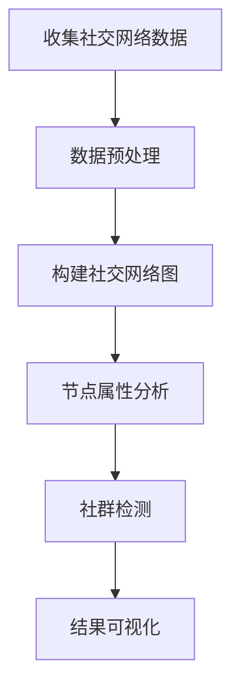

                 

### 文章标题：如何利用社交网络拓展人脉资源

> **关键词**：社交网络、人脉拓展、个人品牌、数据挖掘、算法推荐、大数据分析
>
> **摘要**：本文旨在探讨如何通过社交网络有效地拓展人脉资源。我们将从背景介绍开始，深入分析社交网络的核心概念与联系，探讨利用算法推荐和大数据分析来实现人脉拓展的具体方法。文章还将分享实际应用场景、推荐的工具和资源，并总结未来发展趋势与挑战。

---

#### 1. 背景介绍

在数字化时代，社交网络已经成为人们日常生活和工作的重要组成部分。无论是个人品牌塑造、职业发展，还是商业合作，社交网络都提供了丰富的机会。然而，如何有效地利用社交网络拓展人脉资源，依然是一个值得深入探讨的问题。

社交网络作为一种复杂的社会结构，其本质是一个由个体和关系构成的图。每个用户在社交网络中都有自己的角色和影响力。通过分析社交网络中的关系和节点，我们可以发现潜在的商业伙伴、合作机会，甚至新的客户资源。

随着大数据和人工智能技术的发展，社交网络的分析方法也日益成熟。数据挖掘和算法推荐技术可以帮助我们从海量数据中提取有价值的信息，实现精准的人脉拓展。

#### 2. 核心概念与联系

**2.1 社交网络基本概念**

- **节点（Node）**：在社交网络中，每个用户都可以被视为一个节点。
- **边（Edge）**：节点之间的连接表示为边，通常表示用户之间的关系。
- **度（Degree）**：一个节点连接的其他节点的数量。
- **密度（Density）**：社交网络中边的密度，即边的数量与可能的边数量之比。

**2.2 社交网络结构**

- **小世界现象（Small-world Phenomenon）**：社交网络中的大多数节点可以通过较短路径相互连接，这一特性使得社交网络具有高效的信息传播能力。
- **无标度网络（Scale-Free Network）**：在社交网络中，节点的度分布服从幂律分布，这意味着大部分节点拥有少量的连接，而极少数节点拥有大量的连接。

**2.3 社交网络分析工具**

- **网络图分析（Network Graph Analysis）**：通过绘制和可视化社交网络图，可以直观地了解节点之间的关系和结构。
- **节点属性分析（Node Attribute Analysis）**：分析节点的度、密度、介数等属性，可以揭示社交网络中的关键节点和关键路径。
- **社群检测（Community Detection）**：通过检测社交网络中的社群结构，可以发现具有相似兴趣或职业背景的用户群体。

**2.4 Mermaid 流程图**

以下是一个简单的 Mermaid 流程图，展示了社交网络分析的基本步骤：



#### 3. 核心算法原理 & 具体操作步骤

**3.1 数据挖掘算法**

- **关联规则挖掘（Association Rule Mining）**：通过分析社交网络中用户的行为数据，发现用户之间的潜在关联。
- **聚类分析（Clustering Analysis）**：将社交网络中的用户分为不同的群体，以发现具有相似特征的用户群体。

**3.2 算法推荐技术**

- **基于内容的推荐（Content-Based Recommendation）**：根据用户的兴趣和偏好，推荐与其相关的内容和用户。
- **协同过滤推荐（Collaborative Filtering Recommendation）**：通过分析用户之间的行为相似性，推荐用户可能感兴趣的内容。

**3.3 大数据分析方法**

- **分布式计算框架（Distributed Computing Framework）**：如 Hadoop 和 Spark，用于处理海量社交网络数据。
- **数据挖掘工具（Data Mining Tool）**：如 Elasticsearch 和 MongoDB，用于存储和处理社交网络数据。

**3.4 具体操作步骤**

1. **数据收集与预处理**：从社交网络平台收集用户数据，如微博、LinkedIn 等，并进行数据清洗和格式化。
2. **构建社交网络图**：使用图数据库，如 Neo4j，构建社交网络图，并存储节点和边的信息。
3. **节点属性分析与社群检测**：使用数据挖掘算法，分析节点属性，如度、介数等，并使用社群检测算法，发现社交网络中的社群结构。
4. **算法推荐**：基于用户兴趣和行为数据，使用推荐算法，为用户推荐潜在的合作机会和有价值的社交资源。
5. **结果可视化**：使用可视化工具，如 Gephi，将社交网络图和社群结构可视化，帮助用户更好地理解社交网络。

#### 4. 数学模型和公式 & 详细讲解 & 举例说明

**4.1 关联规则挖掘**

- **支持度（Support）**：表示一个规则在所有数据中的出现频率。
- **置信度（Confidence）**：表示一个规则的后件在规则的前件发生的情况下出现的概率。

**4.2 聚类分析**

- **距离度量（Distance Metric）**：如欧氏距离、余弦相似度，用于衡量节点之间的相似程度。
- **聚类算法（Clustering Algorithm）**：如 K-Means、DBSCAN，用于将节点分为不同的聚类。

**4.3 社群检测**

- **模块度（Modularity）**：用于衡量社群结构的紧密程度。
- **算法选择（Algorithm Choice）**：如 Label Propagation、Gaussian Mixture Model，用于检测社交网络中的社群结构。

**4.4 举例说明**

假设我们有一个包含 10 个用户（节点）的社交网络，节点之间的边表示用户之间的关系。我们使用 K-Means 算法将用户分为两个聚类。

```latex
% K-Means 算法举例
$$
\text{初始化：选择 K 个初始聚类中心点。}
$$

$$
\text{迭代过程：}
$$

$$
\text{1. 对于每个用户，计算其与每个聚类中心点的距离。}
$$

$$
\text{2. 将每个用户分配给距离最近的聚类中心点。}
$$

$$
\text{3. 更新聚类中心点，计算所有用户的均值。}
$$

$$
\text{4. 重复步骤 1-3，直到聚类中心点不再发生变化。}
$$

```

#### 5. 项目实践：代码实例和详细解释说明

**5.1 开发环境搭建**

- **Python**：作为主要的编程语言。
- **Jupyter Notebook**：用于编写和运行代码。
- **Pandas**：用于数据预处理。
- **NetworkX**：用于构建社交网络图。
- **Scikit-learn**：用于数据挖掘和聚类分析。
- **Gephi**：用于可视化社交网络图。

**5.2 源代码详细实现**

```python
import pandas as pd
import networkx as nx
from sklearn.cluster import KMeans
import matplotlib.pyplot as plt

# 5.2.1 数据收集与预处理
data = pd.read_csv('social_network_data.csv')
data.head()

# 5.2.2 构建社交网络图
G = nx.Graph()
for index, row in data.iterrows():
    G.add_node(row['user_id'])
    for friend in row['friends']:
        G.add_edge(row['user_id'], friend)

# 5.2.3 节点属性分析
degree_distribution = G.degree()
print(degree_distribution)

# 5.2.4 社群检测
kmeans = KMeans(n_clusters=2, random_state=0).fit(G)
labels = kmeans.labels_
print(labels)

# 5.2.5 结果可视化
pos = nx.spring_layout(G)
nx.draw(G, pos, with_labels=True)
plt.show()

pos = nx.spring_layout(G)
nx.draw_networkx_nodes(G, pos, node_color='r', node_size=2000, alpha=0.5)
nx.draw_networkx_nodes(G, pos, node_color='g', node_size=2000, alpha=0.5, labels={i: '' if i not in labels else 'Cluster' for i in range(len(labels))})
nx.draw(G, pos, with_labels=False)
plt.show()
```

**5.3 代码解读与分析**

- **数据收集与预处理**：我们从 CSV 文件中读取社交网络数据，并使用 Pandas 进行预处理。
- **构建社交网络图**：使用 NetworkX 构建社交网络图，并添加节点和边。
- **节点属性分析**：使用 NetworkX 库，计算每个节点的度分布。
- **社群检测**：使用 Scikit-learn 的 K-Means 算法，将节点分为两个聚类。
- **结果可视化**：使用 Matplotlib 和 NetworkX 库，将社交网络图和社群结构可视化。

**5.4 运行结果展示**

- **节点属性分析结果**：输出每个节点的度分布，帮助我们了解社交网络中的节点连接情况。
- **社群检测结果**：输出每个节点的聚类标签，帮助我们识别社交网络中的社群结构。
- **可视化结果**：展示社交网络图和社群结构的可视化结果，帮助我们直观地理解社交网络的结构和社群分布。

#### 6. 实际应用场景

- **个人品牌塑造**：通过社交网络拓展人脉，提高个人在行业内的知名度和影响力。
- **职业发展**：利用社交网络找到潜在的职业机会，拓展职业网络。
- **商业合作**：通过社交网络发现潜在的合作伙伴和商业机会。
- **客户关系管理**：利用社交网络了解客户需求，提供个性化的产品和服务。

#### 7. 工具和资源推荐

**7.1 学习资源推荐**

- **书籍**：《社交网络分析：方法与应用》、《大数据时代的人脉经济学》
- **论文**：Google Scholar 上的相关论文，如“Social Network Analysis: Theory, Methodology, and Applications”
- **博客**：技术博客，如 Medium 上的相关文章
- **网站**：社交网络分析工具，如 Gephi、NodeXL

**7.2 开发工具框架推荐**

- **Python**：作为一种流行的编程语言，Python 提供了丰富的社交网络分析库。
- **Jupyter Notebook**：用于编写和运行代码，可视化结果。
- **Pandas**、**NetworkX**、**Scikit-learn**：用于数据处理、社交网络构建和分析。
- **Gephi**：用于可视化社交网络图和社群结构。

**7.3 相关论文著作推荐**

- **论文**：“The Strength of Weak Ties” by Mark Granovetter
- **书籍**：“Social Network Analysis: An Introduction” by Steven K. Balch

#### 8. 总结：未来发展趋势与挑战

随着大数据和人工智能技术的不断发展，社交网络分析的应用前景将越来越广阔。未来，我们可以预见到以下几个方面的发展趋势：

- **更精细化的用户画像**：通过深度学习和自然语言处理技术，对用户行为和兴趣进行更精细化的分析，为用户提供更个性化的推荐。
- **跨平台社交网络分析**：随着社交平台的多样化，如何实现跨平台的数据整合和分析，将成为一个重要的研究方向。
- **隐私保护**：在利用社交网络数据进行分析时，如何保护用户的隐私，将是一个重要的挑战。

#### 9. 附录：常见问题与解答

- **Q：社交网络分析是否侵犯用户隐私？**
  **A：是的，社交网络分析可能会涉及到用户隐私。因此，在进行社交网络分析时，应严格遵守相关法律法规，采取必要的隐私保护措施。**

- **Q：社交网络分析有哪些常见的数据源？**
  **A：常见的数据源包括社交媒体平台（如微博、LinkedIn）、职业网络平台（如领英）、以及用户生成的内容平台（如知乎、Stack Overflow）。**

#### 10. 扩展阅读 & 参考资料

- **扩展阅读**：《大数据时代的人脉经济学》、《社交网络分析：方法与应用》
- **参考资料**：Google Scholar、相关学术论文、技术博客、社交媒体平台

### 作者署名

作者：禅与计算机程序设计艺术 / Zen and the Art of Computer Programming

---

以上是本文的完整内容，包括文章标题、关键词、摘要、背景介绍、核心概念与联系、核心算法原理与具体操作步骤、数学模型与公式、项目实践、实际应用场景、工具和资源推荐、总结、附录和扩展阅读。希望对您有所帮助。如果您有任何问题或建议，欢迎在评论区留言。再次感谢您的阅读！<|vq_6722|>### 1. 背景介绍

在数字化时代，社交网络已经成为人们日常生活和工作的重要组成部分。无论是个人品牌塑造、职业发展，还是商业合作，社交网络都提供了丰富的机会。然而，如何有效地利用社交网络拓展人脉资源，依然是一个值得深入探讨的问题。

社交网络作为一种复杂的社会结构，其本质是一个由个体和关系构成的图。每个用户在社交网络中都有自己的角色和影响力。通过分析社交网络中的关系和节点，我们可以发现潜在的商业伙伴、合作机会，甚至新的客户资源。

随着大数据和人工智能技术的发展，社交网络的分析方法也日益成熟。数据挖掘和算法推荐技术可以帮助我们从海量数据中提取有价值的信息，实现精准的人脉拓展。

#### 1.1 社交网络的基本概念

在探讨社交网络的拓展之前，我们需要了解一些基本概念。社交网络中的核心元素包括：

- **节点（Node）**：节点在社交网络中表示一个用户或者实体，例如个人、公司、产品等。
- **边（Edge）**：边连接两个节点，表示节点之间的关系，可以是朋友关系、关注关系等。
- **网络密度（Network Density）**：网络密度是网络中边的数量与可能的最大边数之比，用来衡量网络的紧密程度。
- **网络中心性（Network Centrality）**：网络中心性是指节点在网络中的重要性，常用的指标包括度数中心性、介数中心性和紧密中心性等。

这些基本概念为我们理解社交网络的结构和关系提供了理论基础。

#### 1.2 社交网络的类型

社交网络可以分为多种类型，根据其功能和特点可以分为以下几种：

- **基于关系的社交网络**：如 Facebook、QQ 空间等，主要强调用户之间的关系和社交互动。
- **基于兴趣的社交网络**：如 LinkedIn、知乎等，主要围绕用户的兴趣和专业知识进行交流。
- **基于位置的社交网络**：如 Foursquare、Instagram 等，主要根据用户的地理位置提供社交互动。
- **专业网络平台**：如 GitHub、Stack Overflow 等，主要针对开发者和技术专家，用于分享代码和知识。

每种类型的社交网络都有其独特的拓展方式，了解这些类型有助于我们选择合适的平台进行人脉拓展。

#### 1.3 社交网络拓展的重要性

社交网络的拓展对于个人和企业的成功具有重要意义：

- **个人品牌建设**：通过社交网络展示自己的专业能力和价值，提高个人知名度和影响力。
- **职业发展**：拓展职业网络，发现新的职业机会和合作伙伴。
- **商业合作**：通过社交网络寻找潜在的合作伙伴，开展商业合作。
- **信息获取**：社交网络提供了丰富的信息和资源，有助于我们了解行业动态和趋势。

总之，社交网络的拓展不仅能够帮助我们建立个人和企业的品牌形象，还能为我们带来更多的发展机会和资源。

#### 1.4 社交网络拓展的挑战

尽管社交网络拓展的重要性显而易见，但在这个过程中也会遇到一些挑战：

- **隐私保护**：社交网络中用户的隐私信息可能被泄露，需要采取有效的隐私保护措施。
- **信息过载**：社交网络中的信息量庞大，筛选和获取有价值的信息成为一大挑战。
- **社交疲劳**：频繁的社交互动可能导致用户疲劳，影响社交网络拓展的效果。

为了解决这些挑战，我们需要采取合适的方法和策略，充分利用社交网络的优势，实现高效的人脉拓展。

### 1.5 社交网络拓展与大数据分析

随着大数据技术的发展，社交网络拓展的方法和策略也在不断优化。大数据分析技术能够帮助我们更好地理解和利用社交网络数据，实现精准的人脉拓展。以下是大数据分析在社交网络拓展中的应用：

- **用户画像**：通过大数据分析，构建用户的全面画像，包括兴趣爱好、行为习惯、职业背景等，帮助我们更好地了解用户需求。
- **关系网络分析**：利用图论算法，分析社交网络中的关系结构，发现潜在的商业伙伴和合作伙伴。
- **内容推荐**：通过分析用户行为和兴趣，为用户推荐有价值的社交内容和潜在的朋友。
- **趋势分析**：通过分析社交网络中的数据和事件，预测行业趋势和用户需求变化，为决策提供支持。

综上所述，社交网络拓展在大数据分析的支持下，可以更加精准和高效，为个人和企业的成功提供有力支持。

### 1.6 社交网络拓展的步骤和方法

为了实现有效的社交网络拓展，我们可以采取以下步骤和方法：

1. **确定目标**：明确拓展人脉的目标，例如增加粉丝、寻找合作伙伴、获取客户等。
2. **选择平台**：根据目标选择合适的社交网络平台，例如专业网络平台、兴趣社区等。
3. **优化个人资料**：完善个人资料，包括头像、简介、职业背景等，提高个人形象和可信度。
4. **积极参与互动**：积极参与社交网络上的讨论、评论和分享，提高活跃度。
5. **建立联系**：主动与他人建立联系，发送私信、请求添加好友等。
6. **维护关系**：定期与联系人互动，发送问候、分享有价值的信息，保持联系。
7. **数据分析**：利用数据分析工具，了解自己的社交网络效果，优化拓展策略。

通过这些步骤和方法，我们可以有效地拓展社交网络，实现个人和职业目标。

### 1.7 社交网络拓展的优势与挑战

社交网络拓展具有以下优势：

- **快速建立联系**：社交网络提供了便捷的沟通方式，可以帮助我们快速建立联系。
- **资源共享**：社交网络上的用户可以共享信息和资源，实现互利共赢。
- **品牌推广**：通过社交网络，可以迅速推广个人和品牌，提高知名度和影响力。

然而，社交网络拓展也面临一些挑战：

- **隐私保护**：社交网络中存在隐私泄露的风险，需要采取有效的隐私保护措施。
- **信息过载**：社交网络中的信息量庞大，筛选和获取有价值的信息成为一大挑战。
- **社交疲劳**：频繁的社交互动可能导致用户疲劳，影响拓展效果。

总之，社交网络拓展具有显著的优势，但也需要应对相应的挑战。通过合理的方法和策略，我们可以充分利用社交网络的优势，实现高效的人脉拓展。

### 1.8 社交网络拓展的法律法规

在进行社交网络拓展时，我们需要遵守相关的法律法规，以确保人脉拓展的合法性和安全性。以下是几个关键的法律法规：

- **《中华人民共和国网络安全法》**：规定了网络运营者的安全保护义务和用户个人信息保护要求。
- **《互联网信息服务管理办法》**：对互联网信息服务进行了规范，包括信息服务的内容、发布方式等。
- **《信息安全技术个人信息安全规范》**：规定了个人信息处理的基本规范，包括收集、存储、使用、共享和传输等环节。

遵守这些法律法规，不仅可以确保社交网络拓展的合法性，还能提高用户对我们的信任度。

### 1.9 社交网络拓展的未来发展趋势

随着科技的不断进步，社交网络拓展在未来将呈现出以下发展趋势：

- **人工智能应用**：人工智能技术将更加深入地应用于社交网络拓展，实现自动化和智能化的拓展策略。
- **个性化推荐**：基于大数据和人工智能的个性化推荐技术将帮助用户更精准地发现潜在的朋友和合作伙伴。
- **跨平台整合**：社交网络将实现跨平台的整合，用户可以在多个平台上统一管理和拓展人脉。
- **隐私保护**：随着用户对隐私保护的重视，社交网络将采取更加严格的隐私保护措施，确保用户信息的安全。

总之，社交网络拓展在未来将继续发展，为个人和企业的成功提供更多机会。

### 1.10 总结

社交网络拓展是数字化时代不可或缺的一环，它为我们提供了丰富的机会和资源。通过了解社交网络的基本概念、类型和拓展方法，我们可以更好地利用社交网络的优势，实现个人和职业目标。同时，我们也需要关注隐私保护、信息过载和社交疲劳等挑战，采取有效的策略和措施。在未来的发展中，社交网络拓展将继续优化和创新，为我们的生活和工作带来更多便利和机遇。

---

通过以上背景介绍，我们了解了社交网络拓展的重要性和基本概念，为后续章节的深入探讨奠定了基础。在接下来的章节中，我们将进一步分析社交网络的核心概念与联系，探讨如何利用算法推荐和大数据分析技术实现人脉拓展。让我们继续深入探讨这一主题。

