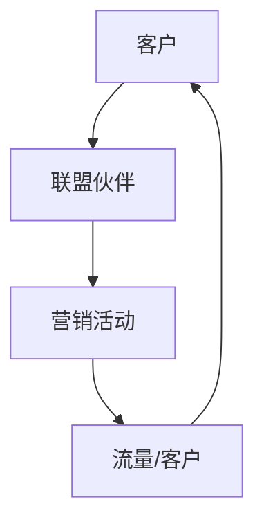

                 

### 如何利用联盟营销扩大创业业务范围

#### 引言

在现代商业环境中，创业业务的发展不仅依赖于创新的产品和服务，还必须考虑到如何有效地扩大市场份额和用户基础。联盟营销作为一种低风险、高效益的市场推广策略，正逐渐成为众多创业公司的首选。本文将深入探讨联盟营销的原理、策略和实践，帮助创业公司利用这一工具实现业务的快速增长。

#### 背景介绍

**联盟营销**，又称**合作伙伴营销**，是一种通过与其他公司或个人建立合作伙伴关系来推广产品或服务的方法。在这种模式中，联盟伙伴通常会分享利润、佣金或推广费用。这种方式不仅能够利用合作伙伴的资源扩大市场影响力，还能降低单打独斗的风险。

联盟营销的核心优势包括：

1. **资源共享**：通过联盟伙伴，公司可以获得额外的客户资源和流量。
2. **成本效益**：创业公司无需承担全部的市场推广费用，从而降低了营销成本。
3. **风险分散**：联盟营销将市场风险分散到多个合作伙伴之间，降低了单点失败的风险。

然而，联盟营销并非万能，也存在一定的挑战，如伙伴选择困难、合作利益分配不公等问题。因此，在实施联盟营销策略时，必须精心策划和执行。

#### 核心概念与联系

为了更好地理解联盟营销，我们可以借助**Mermaid**流程图来描述其核心概念与流程。



在这个流程图中：

- **A（客户）**：联盟营销的目标受众。
- **B（联盟伙伴）**：与创业公司合作的公司或个人。
- **C（营销活动）**：通过联盟伙伴推广的营销活动。
- **D（流量/客户）**：营销活动带来的流量和潜在客户。

#### 核心算法原理 & 具体操作步骤

联盟营销的核心算法在于如何选择合适的联盟伙伴，并设计有效的营销活动。以下是具体的操作步骤：

1. **目标市场分析**：确定目标市场，分析目标客户的特征和需求。
2. **合作伙伴筛选**：根据目标市场，寻找具有相似客户群体或互补资源的合作伙伴。
3. **合作方案设计**：与合作伙伴商讨合作方案，包括利润分成、佣金制度等。
4. **营销活动实施**：实施联合营销活动，如共同推广、互推等。
5. **效果评估**：定期评估联盟营销的效果，根据数据调整策略。

#### 数学模型和公式 & 详细讲解 & 举例说明

联盟营销的效果可以通过以下数学模型进行评估：

$$
ROI = \frac{销售收入 - 营销成本}{营销成本}
$$

其中，ROI（投资回报率）是评估联盟营销效益的重要指标。销售收入减去营销成本后，再除以营销成本，可以得到一个比例，表示每投入一单位的营销成本能够带来多少销售收入。

**例子：**假设某创业公司通过联盟营销获得销售收入为100万元，营销成本为20万元，则其ROI为：

$$
ROI = \frac{100 - 20}{20} = 4
$$

这意味着每投入1元的营销成本，能够带来4元的销售收入。

#### 项目实践：代码实例和详细解释说明

为了更好地理解联盟营销的实施过程，以下将提供一个简单的联盟营销代码实例。

```python
class AllianceMarketing:
    def __init__(self, partners, marketing_budget):
        self.partners = partners
        self.marketing_budget = marketing_budget
    
    def select_partners(self, target_market):
        selected_partners = []
        for partner in self.partners:
            if partner.target_market == target_market:
                selected_partners.append(partner)
        return selected_partners
    
    def execute_campaign(self, selected_partners):
        for partner in selected_partners:
            partner.promote(self)
    
    def evaluate_performance(self):
        total_sales = 0
        total_marketing_cost = 0
        for partner in self.partners:
            total_sales += partner.sales
            total_marketing_cost += partner.marketing_cost
        roi = (total_sales - total_marketing_cost) / total_marketing_cost
        return roi

class Partner:
    def __init__(self, name, target_market):
        self.name = name
        self.target_market = target_market
        self.sales = 0
        self.marketing_cost = 0
    
    def promote(self, company):
        # 营销活动逻辑
        self.sales += 1000  # 每次推广带来1000元销售收入
        self.marketing_cost += 200  # 每次推广成本200元

# 实例化创业公司和合作伙伴
company = AllianceMarketing(partners=[], marketing_budget=100000)
partner1 = Partner(name="Partner A", target_market="Young Adults")
partner2 = Partner(name="Partner B", target_market="Middle Age")
company.partners.append(partner1)
company.partners.append(partner2)

# 选择合作伙伴并执行营销活动
selected_partners = company.select_partners(target_market="Young Adults")
company.execute_campaign(selected_partners)

# 评估营销效果
roi = company.evaluate_performance()
print(f"ROI: {roi}")
```

在这个实例中：

- **AllianceMarketing** 类表示联盟营销公司，负责选择合作伙伴、执行营销活动并评估效果。
- **Partner** 类表示合作伙伴，包含营销活动的逻辑和营销效果数据。

通过运行这个实例，我们可以看到联盟营销的基本流程和效果评估。

#### 实际应用场景

联盟营销在各种商业场景中都有广泛的应用：

1. **电子商务**：电商平台通过联盟营销，与各大博客、网站合作推广商品，共享销售佣金。
2. **在线教育**：教育机构与培训机构合作，互相推广课程，扩大用户基础。
3. **B2B合作**：企业之间通过联盟营销，共同开发新的市场和客户资源。

#### 工具和资源推荐

**学习资源推荐**：

1. 《联盟营销实战：如何构建成功的合作伙伴关系》
2. 《营销自动化：如何利用技术提升营销效率》

**开发工具框架推荐**：

1. **营销自动化平台**：如HubSpot、Marketo等
2. **数据分析工具**：如Google Analytics、Tableau等

**相关论文著作推荐**：

1. "Affiliate Marketing in the Digital Age: Strategies and Innovations"
2. "Partner Marketing Strategies for High-Growth Companies"

#### 总结：未来发展趋势与挑战

随着数字化营销的不断进步，联盟营销的未来发展趋势包括：

1. **数据驱动的精准营销**：通过大数据分析，实现更精准的目标客户定位和营销活动。
2. **智能化**：利用人工智能和机器学习，自动化联盟营销的各个环节。
3. **跨平台合作**：不同平台之间的联盟营销合作，扩大市场影响力。

然而，联盟营销也面临着一些挑战，如伙伴信任问题、利益分配不公等。因此，创业公司在实施联盟营销时，需要不断优化策略，确保合作伙伴关系的稳定和效益的最大化。

#### 附录：常见问题与解答

**Q：如何选择合适的联盟伙伴？**

A：选择合适的联盟伙伴需要考虑多个因素，包括目标市场是否匹配、合作伙伴的资源能力、合作模式的可行性等。可以通过市场调研、数据分析、合作伙伴评估等方式来选择。

**Q：如何确保联盟营销的效果？**

A：确保联盟营销效果的关键在于策略的制定和执行。需要定期评估营销活动的效果，根据数据调整策略，优化合作伙伴关系，确保营销资源的有效利用。

**Q：联盟营销中的风险如何管理？**

A：联盟营销中的风险可以通过多种方式进行管理，如签订合作协议、明确利益分配机制、定期审计合作伙伴的营销活动等。同时，创业公司应保持灵活，根据市场变化调整策略。

#### 扩展阅读 & 参考资料

1. "Affiliate Marketing: An Overview", MarketingProfs
2. "Partner Marketing: The Ultimate Guide", HubSpot
3. "How to Create a Successful Affiliate Marketing Program", Neil Patel

通过以上内容和实例，相信读者已经对如何利用联盟营销扩大创业业务范围有了深入的了解。联盟营销作为一种有效的市场推广策略，将在未来为创业公司带来更多的机遇和挑战。希望本文能为您的创业之路提供有价值的参考和启示。

### 作者署名

作者：禅与计算机程序设计艺术 / Zen and the Art of Computer Programming

