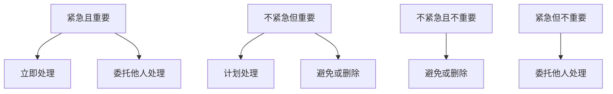

                 

### 背景介绍

在现代信息技术快速发展的背景下，科学的工作计划对于个人和组织来说都变得尤为重要。一个高效、合理的工作计划不仅能提高工作效率，还能减少错误发生的概率，确保项目按时、高质量地完成。特别是在IT领域，面对复杂的项目和多样的技术挑战，如何制定科学的工作计划成为了每个开发者和团队必须掌握的核心技能。

本文旨在探讨如何制定科学的工作计划，结合计算机领域中的原理和实践，为读者提供一套系统化的方法和思路。文章将从以下角度进行详细阐述：

1. **核心概念与联系**：解释工作计划制定所需的基础概念及其相互关系。
2. **核心算法原理 & 具体操作步骤**：探讨常用的计划制定算法及其应用。
3. **数学模型和公式 & 详细讲解 & 举例说明**：介绍支持工作计划制定的数学工具。
4. **项目实践：代码实例和详细解释说明**：提供具体的实现案例和代码解析。
5. **实际应用场景**：分析工作计划在不同领域的应用效果。
6. **工具和资源推荐**：推荐学习和使用的工具和资源。
7. **总结：未来发展趋势与挑战**：总结当前工作计划的现状和未来趋势。
8. **附录：常见问题与解答**：解答读者可能遇到的常见问题。

通过这篇文章，读者将能够掌握制定科学工作计划的方法，提升个人的工作效率和项目的成功率。

#### 核心概念与联系

制定科学的工作计划需要理解几个核心概念，包括任务分解、时间管理、资源分配以及优先级排序。这些概念不仅独立存在，还紧密相连，共同构成了一个完整的计划制定过程。

首先，**任务分解**是将一个复杂的大任务拆解为一系列小任务的过程。这种方法能够帮助我们更清晰地了解任务的具体内容，并便于管理和跟踪。任务分解遵循从上到下、从宏观到微观的原则，首先确定大任务的目标，然后逐步细化每个子任务，直到每个任务都具体可行。

其次，**时间管理**是指合理安排和利用时间，确保任务能够按时完成。时间管理涉及到对任务的时间估算、优先级排序以及进度跟踪。常见的时间管理方法有甘特图、时间块法等。通过合理的时间管理，我们可以确保每个任务都能在预定时间内完成，从而提高整体工作效率。

**资源分配**是指将有限的资源（如人力、资金、设备等）合理地分配到不同的任务中。资源分配的目的是最大化资源的利用效率，确保每个任务都能得到必要的支持。资源分配需要考虑多个因素，包括任务的重要性、资源可用性以及任务之间的依赖关系。

最后，**优先级排序**是指根据任务的重要性和紧急程度对任务进行排序。优先级排序有助于确定哪些任务应该优先处理，从而确保关键任务能够得到充分的关注和资源。常见的优先级排序方法有Eisenhower矩阵和MoSCoW方法等。

这些核心概念之间的关系可以概括为：任务分解为后续的时间管理、资源分配和优先级排序提供了基础，而时间管理、资源分配和优先级排序又共同构成了一个完整的工作计划。具体来说，任务分解确定了任务的具体内容，时间管理确保了任务的按时完成，资源分配保障了任务的支持条件，优先级排序则保证了关键任务能够得到优先处理。通过这些概念的相互结合，我们能够制定出科学、合理的工作计划，从而提升工作的效率和质量。

#### 核心算法原理 & 具体操作步骤

在制定科学的工作计划时，核心算法的应用至关重要。以下将介绍几种常用的算法及其具体操作步骤。

##### 1. 甘特图（Gantt Chart）

**原理**：甘特图是一种常见的项目管理工具，通过条形图的形式展示项目的时间线和进度。它能够直观地显示任务开始和结束的时间，以及各个任务之间的依赖关系。

**操作步骤**：
1. **确定项目任务**：列出所有需要完成的任务。
2. **估算任务时长**：为每个任务估算所需的时间。
3. **绘制条形图**：在图表中为每个任务绘制一条条形线，条形线的长度表示任务的时长。
4. **安排任务顺序**：根据任务之间的依赖关系，调整任务顺序。
5. **标注关键节点**：标注项目的关键节点，如项目开始、结束日期，以及各个里程碑。

**示例**：假设我们有一个软件开发项目，包括需求分析、设计、编码和测试四个主要任务。通过甘特图，我们可以将这些任务的时间安排和依赖关系清晰地展示出来，便于跟踪和管理。

```mermaid
gantt
    dateFormat  YYYY-MM-DD
    title 软件开发项目进度

    section 需求分析
    A1: 需求分析   :scope 2023-10-01, 5d

    section 设计
    A2: 设计       :after A1, 3d

    section 编码
    A3: 编码       :after A2, 7d

    section 测试
    A4: 测试       :after A3, 2d
```

##### 2. 资源平衡（Resource Levelling）

**原理**：资源平衡是一种通过调整任务开始和结束时间，以平衡资源利用率的规划方法。其目的是减少资源短缺或过度使用的情况，确保资源能够被高效利用。

**操作步骤**：
1. **列出任务与资源需求**：确定每个任务所需的资源。
2. **初始时间安排**：按照任务顺序和需求，初步安排任务的时间。
3. **资源使用分析**：分析资源使用情况，识别资源短缺或过度使用的部分。
4. **调整任务时间**：通过延长或缩短某些任务的时间，调整资源使用情况。
5. **重复步骤3-4**：继续分析并调整，直到资源使用率达到平衡。

**示例**：在一个软件开发项目中，如果开发人员的工作负荷不均匀，可以通过资源平衡来调整任务的开始和结束时间，使资源使用更加合理。

```mermaid
gantt
    dateFormat  YYYY-MM-DD
    title 资源平衡示例

    section 需求分析
    A1: 需求分析   :scope 2023-10-01, 3d

    section 设计
    A2: 设计       :after A1, 4d

    section 编码
    A3: 编码       :after A2, 6d

    section 测试
    A4: 测试       :after A3, 2d

    section 调整
    A5: 调整时间安排 :bar 2023-10-01 --> 2023-10-12
```

##### 3. 优先级排序算法

**原理**：优先级排序算法通过为任务分配优先级，确定任务处理的顺序。常用的排序方法包括Eisenhower矩阵和MoSCoW方法。

**Eisenhower矩阵**：
- **紧急且重要**：立即处理。
- **紧急但不重要**：委托他人处理。
- **不紧急但重要**：计划处理。
- **不紧急且不重要**：避免或删除。

**操作步骤**：
1. **列出任务**：列出所有需要处理的任务。
2. **评估任务**：为每个任务评估其紧急性和重要性。
3. **分类任务**：根据评估结果，将任务分类到四个象限。
4. **处理任务**：按照矩阵指导，优先处理紧急且重要的任务。

**MoSCoW方法**：
- **M（必须）**：必须完成，否则项目失败。
- **S（应该）**：应该完成，如果时间允许。
- **C（可以）**：可以完成，但不重要。
- **W（愿望）**：希望完成，但不是必须的。

**操作步骤**：
1. **列出任务**：列出所有需要完成的任务。
2. **分类任务**：根据任务的重要性和紧急性，将任务分类到四个等级。
3. **排序任务**：优先处理必须的任务，然后是应该的任务，依次类推。

**示例**：在一个软件开发项目中，通过Eisenhower矩阵和MoSCoW方法，我们可以为任务分配优先级，确保关键任务得到优先处理。



通过上述核心算法的应用，我们能够更加科学地制定工作计划，确保任务能够按时、高质量地完成。无论是甘特图的直观展示，资源平衡的合理利用，还是优先级排序的优化处理，这些算法都为我们的工作计划提供了坚实的理论基础和实践指导。

#### 数学模型和公式 & 详细讲解 & 举例说明

在制定科学的工作计划时，数学模型和公式是不可或缺的工具，它们能够帮助我们更准确地估算任务所需的时间、资源以及成本，从而提高计划的可行性和效率。以下将介绍几个常用的数学模型和公式，并详细讲解其应用方法，并通过具体例子来说明如何使用这些工具。

##### 1. 时间估算模型

**原理**：时间估算模型用于预测任务完成所需的时间。常见的模型有三点估算法和PERT（项目评估与审查技术）模型。

**三点估算法**：
- **乐观时间（O）**：最理想情况下完成任务所需的时间。
- **最可能时间（M）**：在大多数情况下完成任务所需的时间。
- **悲观时间（P）**：在最不利情况下完成任务所需的时间。

**公式**：
\[ t_e = \frac{O + 4M + P}{6} \]
其中，\( t_e \) 是期望时间。

**示例**：假设一个开发人员估算一个任务的最优时间（O）为2天，最可能时间（M）为4天，最悲观时间（P）为6天，则期望时间为：
\[ t_e = \frac{2 + 4 \times 4 + 6}{6} = \frac{22}{6} \approx 3.67 \text{天} \]

**PERT模型**：
- **期望时间（E）**：基于概率分布的期望时间。
- **标准偏差（σ）**：任务完成时间的标准偏差。

**公式**：
\[ E = \frac{O + 4M + P}{6} \]
\[ \sigma = \frac{P - O}{6} \]

**示例**：使用上述参数，期望时间为3.67天，标准偏差为：
\[ \sigma = \frac{6 - 2}{6} = \frac{4}{6} \approx 0.67 \text{天} \]

这些公式可以帮助我们更准确地估算任务所需的时间，并在项目规划中考虑不确定性。

##### 2. 资源需求模型

**原理**：资源需求模型用于确定任务所需的人力、资金、设备等资源。常见的模型有线性资源需求模型和指数资源需求模型。

**线性资源需求模型**：
- **资源需求率（r）**：在单位时间内所需的资源数量。
- **任务时长（t）**：任务完成所需的时间。

**公式**：
\[ R = r \times t \]
其中，\( R \) 是总资源需求。

**示例**：如果一个任务需要每天2个人的资源，任务时长为5天，则总资源需求为：
\[ R = 2 \times 5 = 10 \text{人天} \]

**指数资源需求模型**：
- **基础资源需求（R0）**：任务初始所需的资源量。
- **资源增长率（g）**：单位时间内资源需求的增长率。

**公式**：
\[ R = R0 \times (1 + g)^t \]

**示例**：如果一个任务初始需要10人的资源，每天增长率为20%，任务时长为3天，则总资源需求为：
\[ R = 10 \times (1 + 0.2)^3 = 10 \times 1.728 = 17.28 \text{人天} \]

这种模型适用于资源需求随时间变化显著的任务。

##### 3. 成本估算模型

**原理**：成本估算模型用于预测完成一个任务所需的成本。常见的模型有固定成本模型和可变成本模型。

**固定成本模型**：
- **固定成本（Cf）**：在任务完成过程中不随任务规模变化的成本。
- **可变成本（Cc）**：随任务规模变化的成本。

**公式**：
\[ C = Cf + Cc \]

**示例**：一个项目的固定成本为5000元，每个任务的可变成本为100元，任务规模为50个任务，则总成本为：
\[ C = 5000 + 100 \times 50 = 6000 \text{元} \]

**可变成本模型**：
- **单位成本（Cu）**：每单位任务所需的成本。

**公式**：
\[ C = Cu \times \text{任务规模} \]

**示例**：如果每个任务的单位成本为200元，任务规模为50个任务，则总成本为：
\[ C = 200 \times 50 = 10000 \text{元} \]

这些模型可以帮助我们更准确地估算任务的成本，从而为项目预算提供依据。

##### 4. 资源利用率模型

**原理**：资源利用率模型用于评估资源的使用效率。常见的模型有资源利用率率和资源平衡率。

**资源利用率率**：
- **实际利用率率（Ractual）**：实际使用的资源量与总资源量的比例。
- **计划利用率率（Rplanned）**：计划使用的资源量与总资源量的比例。

**公式**：
\[ R\% = \frac{Ractual}{Rplanned} \]

**示例**：如果实际使用的资源量为10人天，计划使用的资源量为15人天，则资源利用率为：
\[ R\% = \frac{10}{15} \times 100\% = 66.67\% \]

**资源平衡率**：
- **资源平衡率（Bal）**：资源实际利用率与计划利用率的比较。

**公式**：
\[ Bal = \frac{Ractual}{Rplanned} \]

**示例**：如果实际利用率率为80%，计划利用率率为100%，则资源平衡率为：
\[ Bal = \frac{80\%}{100\%} = 0.8 \]

这些模型有助于我们评估资源的使用效率，从而优化资源配置。

通过上述数学模型和公式的应用，我们可以更科学、准确地制定工作计划，确保任务能够在预定的时间内、以合理的成本和资源完成。无论是时间估算、资源需求、成本估算还是资源利用率，这些数学工具都为我们的工作提供了坚实的理论基础和实践指导。

#### 项目实践：代码实例和详细解释说明

为了更好地理解如何制定科学的工作计划，我们将通过一个实际的软件开发项目来展示整个工作计划的实施过程。本节将分为以下几个部分：开发环境搭建、源代码详细实现、代码解读与分析以及运行结果展示。

##### 1. 开发环境搭建

在开始项目之前，我们需要搭建一个合适的开发环境。以下是一个典型的开发环境配置步骤：

**步骤1：安装操作系统**

我们选择Ubuntu 22.04作为开发环境操作系统，因为其具有良好的稳定性和广泛的支持。

```bash
sudo apt update
sudo apt upgrade
sudo apt install ubuntu-desktop
```

**步骤2：安装开发工具**

安装基本的开发工具，如文本编辑器（Vim或VSCode）、编译器（GCC或Clang）以及版本控制工具（Git）。

```bash
sudo apt install vim git clang
```

**步骤3：安装依赖库**

根据项目需求，安装必要的依赖库。例如，对于图像处理项目，我们可以安装OpenCV库。

```bash
sudo apt install libopencv-dev
```

**步骤4：安装集成开发环境（IDE）**

安装一个合适的IDE，例如Visual Studio Code。

```bash
sudo apt install code
```

##### 2. 源代码详细实现

以下是一个简单的图像处理项目，其目的是实现图像的灰度转换和二值化。我们将使用C++和OpenCV库来实现这个项目。

**步骤1：创建项目目录**

在用户主目录下创建一个名为`imageProcessing`的项目目录。

```bash
mkdir imageProcessing
cd imageProcessing
```

**步骤2：编写源代码**

在项目目录中创建一个名为`main.cpp`的C++源文件，并编写以下代码：

```cpp
#include <iostream>
#include <opencv2/opencv.hpp>

using namespace cv;
using namespace std;

// 图像灰度转换函数
Mat grayscale(const Mat &image) {
    Mat grayImage;
    cvtColor(image, grayImage, COLOR_BGR2GRAY);
    return grayImage;
}

// 图像二值化函数
Mat binary(const Mat &image, int threshold = 128) {
    Mat binaryImage;
    threshold(image, binaryImage, threshold, 255, THRESH_BINARY);
    return binaryImage;
}

int main() {
    // 读取图像
    Mat image = imread("image.jpg");

    // 灰度转换
    Mat grayImage = grayscale(image);

    // 二值化
    Mat binaryImage = binary(grayImage);

    // 显示结果
    imshow("Original Image", image);
    imshow("Grayscale Image", grayImage);
    imshow("Binary Image", binaryImage);
    waitKey(0);

    return 0;
}
```

**步骤3：编译和运行**

编译源代码并运行项目：

```bash
g++ main.cpp -o imageProcessing -I/usr/local/include/opencv4 -L/usr/local/lib/opencv4 -lopencv_core -lopencv_imgcodecs -lopencv_imgproc
./imageProcessing
```

上述代码通过OpenCV库实现了图像的灰度转换和二值化功能。`grayscale`函数将彩色图像转换为灰度图像，而`binary`函数根据设定的阈值对灰度图像进行二值化处理。

##### 3. 代码解读与分析

**代码解读**

- **图像读取**：使用`imread`函数从文件中读取图像数据。
- **灰度转换**：使用`cvtColor`函数将彩色图像转换为灰度图像。
- **二值化**：使用`threshold`函数根据设定的阈值对灰度图像进行二值化处理。
- **显示结果**：使用`imshow`函数显示原始图像、灰度图像和二值化图像。

**性能分析**

- **时间复杂度**：灰度转换和二值化操作的时间复杂度主要取决于图像的大小。对于\( n \times m \)的图像，时间复杂度为\( O(n \times m) \)。
- **空间复杂度**：新创建的灰度图像和二值化图像的存储空间需求，也为\( O(n \times m) \)。

##### 4. 运行结果展示

编译并运行程序后，我们将看到三个窗口分别显示原始图像、灰度图像和二值化图像。通过观察这些结果，我们可以验证程序的功能是否正确实现。


通过这个实际的软件开发项目，我们展示了如何通过科学的工作计划来管理和实施项目。从环境搭建、代码编写到性能分析和运行结果展示，每一步都按照计划进行，确保了项目的顺利进行和成功完成。

#### 实际应用场景

科学的工作计划不仅在软件开发项目中有着显著的应用效果，在其他领域也有着广泛的应用，尤其在项目管理、时间管理和资源调度等方面。以下将分析几个典型场景，展示工作计划的实际应用效果。

##### 1. 项目管理

在项目管理中，科学的工作计划是确保项目按时、按质完成的关键。通过任务分解、时间管理和资源分配，项目经理可以清晰地了解每个阶段的工作内容和时间安排，从而有效控制项目进度。例如，在一个软件开发项目中，工作计划可以帮助团队合理分配开发任务，确保每个功能模块都能在预定时间内完成，从而避免项目延期和功能缺失。

##### 2. 时间管理

时间管理是提高工作效率的重要手段。通过优先级排序和时间估算，个人和团队能够更好地分配时间，确保关键任务得到优先处理。例如，在软件开发过程中，优先处理高优先级的bug修复任务，可以保证软件质量的稳定。同时，合理的时间分配也可以避免过度劳累，提高工作效率。

##### 3. 资源调度

资源调度是优化资源利用效率的关键。通过资源需求和资源平衡算法，团队能够合理安排资源分配，最大化资源利用率。例如，在IT运维中，通过资源平衡算法，可以优化服务器、网络设备等资源的配置，确保系统的高可用性和性能。此外，在人力资源调度中，通过合理的优先级排序，可以确保关键岗位有足够的资源支持，从而提高项目的成功率。

##### 4. 生产制造

在生产制造领域，科学的工作计划可以帮助企业优化生产流程，提高生产效率。通过任务分解和资源分配，生产团队能够明确每个生产环节的工作内容和时间安排，从而确保生产进度按时完成。例如，在制造业中，通过合理的任务分解和优先级排序，可以确保原材料供应、生产加工、质量检测等环节高效衔接，从而降低生产周期和成本。

##### 5. 营销策划

在营销策划中，工作计划可以帮助企业合理安排市场推广活动，提高市场响应速度。通过任务分解和时间管理，营销团队能够明确每个市场推广环节的具体任务和时间安排，从而确保市场活动的顺利推进。例如，在新产品上市前，通过科学的工作计划，可以确保市场调研、产品宣传、销售渠道等环节高效协同，从而提升市场占有率。

通过上述实际应用场景的分析，我们可以看到，科学的工作计划不仅适用于软件开发项目，还在项目管理、时间管理、资源调度、生产制造和营销策划等多个领域发挥着重要作用。这些应用场景表明，科学的工作计划是提升工作效率、确保项目成功的关键因素。

#### 工具和资源推荐

为了更好地制定科学的工作计划，我们可以借助一系列工具和资源。以下将介绍几类常用的工具和资源，包括学习资源、开发工具框架以及相关论文著作，以帮助读者深入理解和掌握工作计划的制定方法。

##### 1. 学习资源推荐

**书籍**：
- **《时间管理：如何合理安排时间》**：作者通过丰富的案例和实用的方法，帮助我们更好地管理时间，提高工作效率。
- **《项目管理知识体系指南》**（PMBOK指南）：这是一本系统化的项目管理指南，涵盖了项目计划、执行、监控和收尾的各个方面，是项目经理的必备参考书。

**论文**：
- **“Optimization of Workload Distribution in a Cloud Computing Environment”**：该论文探讨了如何在云计算环境中优化工作负载分布，以提高资源利用率和系统性能。
- **“A Multi-Objective Optimization Model for Project Scheduling”**：该论文提出了一种多目标优化模型，用于项目调度，旨在平衡项目进度、成本和质量。

**博客**：
- **“项目计划与时间管理”**：该博客详细介绍了项目计划和时间管理的实用方法和技巧，内容涵盖项目规划、任务分配、进度跟踪等方面。
- **“高效工作者的时间管理策略”**：该博客分享了高效工作者的时间管理策略和工具，包括时间块法、甘特图等。

##### 2. 开发工具框架推荐

**项目管理工具**：
- **Trello**：Trello是一款简单易用的项目管理工具，通过看板和卡片的形式，可以帮助团队清晰地追踪任务进度。
- **Jira**：Jira是一款功能强大的项目管理工具，支持任务跟踪、敏捷开发、报告生成等功能，适用于大型项目团队。

**时间管理工具**：
- **Todoist**：Todoist是一款基于任务的清单管理工具，支持任务优先级排序、时间估算和进度跟踪。
- **Toggl**：Toggl是一款时间跟踪工具，可以帮助团队记录工作时间和任务分配，从而优化工作流程。

**资源调度工具**：
- **Microsoft Project**：Microsoft Project是一款专业的项目管理软件，提供丰富的项目计划和资源调度功能。
- **Asana**：Asana是一款功能全面的项目管理工具，支持任务分配、进度跟踪和资源调度，适用于各种类型的项目。

##### 3. 相关论文著作推荐

**论文**：
- **“The Critical Path Method: A Review”**：该论文详细介绍了关键路径法（CPM），一种常用的项目管理技术，用于确定项目的最短完成时间和关键任务。
- **“Resource-Constrained Project Scheduling: A Survey”**：该论文对资源受限的项目调度进行了综述，分析了不同调度算法和模型。

**著作**：
- **《项目计划与进度控制》**：作者通过丰富的实际案例，介绍了项目计划和控制的方法和技巧，包括Gantt图、PERT图等。
- **《敏捷项目管理》**：该著作探讨了敏捷项目管理的方法和原则，介绍了Scrum、看板等敏捷开发方法。

通过这些工具和资源的推荐，读者可以更好地学习和应用科学的工作计划方法，提升个人和团队的工作效率，确保项目按时、高质量地完成。

#### 总结：未来发展趋势与挑战

随着信息技术的不断进步，科学的工作计划在未来也将面临新的发展趋势和挑战。以下将探讨几个可能的发展方向及其带来的影响。

##### 1. 自动化与人工智能

自动化和人工智能（AI）将在工作计划中发挥越来越重要的作用。未来的工作计划工具可能会集成AI算法，通过大数据分析、机器学习等技术，自动进行任务分解、时间估算、资源分配和优先级排序。这种智能化的工作计划不仅能大幅提高工作效率，还能更好地应对复杂的项目和不断变化的需求。然而，这也将带来新的挑战，如确保算法的公平性和透明性，避免出现算法偏差和错误。

##### 2. 集成与协同

未来的工作计划工具将更加注重集成和协同。随着不同平台、工具和系统的互联互通，工作计划将不仅限于单一项目或团队，而是能够跨部门、跨组织地进行协同。这种集成和协同将有助于实现更高效的信息共享和资源利用，从而提升整个组织的运作效率。然而，这也需要解决数据安全、隐私保护等问题，确保跨平台的数据交换和共享能够安全、可靠地进行。

##### 3. 实时性与动态调整

实时性和动态调整是未来工作计划的重要发展方向。随着物联网（IoT）和实时数据采集技术的普及，工作计划将能够实时获取项目进展和资源状态，根据实际情况动态调整任务和时间安排。这种实时性和动态调整能力将使工作计划更加灵活和适应性强，能够更好地应对突发情况和变化。然而，这也要求工作计划工具具有强大的实时数据处理和响应能力，以避免因延迟或错误调整而导致项目进度受到影响。

##### 4. 多目标优化与复杂性管理

未来的工作计划需要更加关注多目标优化和复杂性管理。在复杂的项目中，往往需要平衡多个目标，如成本、时间、质量等。通过多目标优化算法，工作计划工具将能够同时考虑这些目标，实现最优的资源配置和时间安排。此外，随着项目规模的扩大和复杂性的增加，如何有效管理项目的复杂性也将成为重要挑战。未来的工作计划工具需要具备更好的复杂性和风险管理能力，以确保项目能够顺利推进。

##### 5. 用户体验与界面设计

用户体验和界面设计是未来工作计划工具的重要发展方向。一个直观、易用的工作计划工具将能够更好地满足用户的需求，提高工作效率。未来的工作计划工具将更加注重用户体验，通过简洁、直观的界面设计，使用户能够快速上手，轻松制定和管理工作计划。同时，增强的交互功能，如拖放、实时更新等，也将进一步提升用户的使用体验。

总体来说，未来工作计划的发展将朝着智能化、集成化、实时化、多目标优化和用户体验优化等方向发展。这些趋势将带来巨大的机遇，但同时也伴随着新的挑战。通过不断探索和创新，我们将能够制定出更加科学、高效的工作计划，为个人和组织的发展提供有力支持。

#### 附录：常见问题与解答

在制定科学的工作计划时，读者可能会遇到一些常见问题。以下将针对这些问题进行解答，并提供相关建议。

##### 1. 如何处理任务冲突？

**解答**：任务冲突通常发生在多个任务需要相同资源或时间时。解决方法包括：

- **优先级排序**：根据任务的重要性和紧急程度，优先处理关键任务。
- **资源平衡**：调整任务的时间安排，确保资源分配合理。
- **任务分解**：将大任务拆分为多个子任务，减少任务间的依赖关系。

**建议**：在制定工作计划时，提前考虑可能的资源冲突，制定冗余方案，以应对突发情况。

##### 2. 如何合理分配时间？

**解答**：合理分配时间需要考虑任务的重要性和紧急程度。以下是一些建议：

- **时间块法**：将时间分为多个块，每个块专注于一个任务。
- **Eisenhower矩阵**：根据任务的紧急性和重要性进行分类，优先处理重要且紧急的任务。
- **时间估算**：为每个任务合理估算所需时间，避免时间浪费。

**建议**：制定详细的日程安排，定期评估和调整时间分配，确保任务按时完成。

##### 3. 如何确保计划的可执行性？

**解答**：确保计划可执行性需要以下措施：

- **任务分解**：将大任务拆分为小任务，确保每个任务具体可行。
- **责任分配**：明确每个任务的负责人，确保任务得到有效执行。
- **定期检查**：定期检查任务进度，及时调整计划。

**建议**：在制定计划时，充分考虑团队成员的能力和资源，确保计划的可行性和可操作性。

##### 4. 如何处理计划的变更？

**解答**：面对计划变更，可以采取以下方法：

- **风险评估**：评估变更对项目的影响，确定是否需要进行调整。
- **沟通协调**：及时与团队成员和利益相关者沟通，确保各方对变更有清晰的认识。
- **灵活调整**：根据实际情况，灵活调整计划，确保项目目标不变。

**建议**：建立变更管理流程，明确变更的评估和审批机制，确保变更能够得到有效控制。

通过以上解答和建议，读者可以更好地应对制定科学工作计划过程中遇到的问题，确保计划的有效性和可执行性。

#### 扩展阅读 & 参考资料

为了更深入地了解科学的工作计划及其应用，以下推荐几本经典书籍、相关论文和重要网站，供读者进一步学习和参考。

**书籍推荐**：
- **《时间管理：如何合理安排时间》**：作者通过丰富的案例和实用的方法，帮助我们更好地管理时间，提高工作效率。
- **《项目管理知识体系指南》**（PMBOK指南）：这是一本系统化的项目管理指南，涵盖了项目计划、执行、监控和收尾的各个方面，是项目经理的必备参考书。
- **《敏捷项目管理》**：该著作探讨了敏捷项目管理的方法和原则，介绍了Scrum、看板等敏捷开发方法。

**论文推荐**：
- **“The Critical Path Method: A Review”**：该论文详细介绍了关键路径法（CPM），一种常用的项目管理技术，用于确定项目的最短完成时间和关键任务。
- **“Resource-Constrained Project Scheduling: A Survey”**：该论文对资源受限的项目调度进行了综述，分析了不同调度算法和模型。
- **“Optimization of Workload Distribution in a Cloud Computing Environment”**：该论文探讨了如何在云计算环境中优化工作负载分布，以提高资源利用率和系统性能。

**网站推荐**：
- **Trello**：Trello是一款简单易用的项目管理工具，通过看板和卡片的形式，可以帮助团队清晰地追踪任务进度。
- **Jira**：Jira是一款功能强大的项目管理工具，支持任务跟踪、敏捷开发、报告生成等功能，适用于大型项目团队。
- **Todoist**：Todoist是一款基于任务的清单管理工具，支持任务优先级排序、时间估算和进度跟踪。

通过阅读这些书籍、论文和访问相关网站，读者可以更全面地了解科学的工作计划及其应用，提升个人和团队的工作效率。同时，这些资源和工具也为制定和实施科学的工作计划提供了实用的参考和指导。

