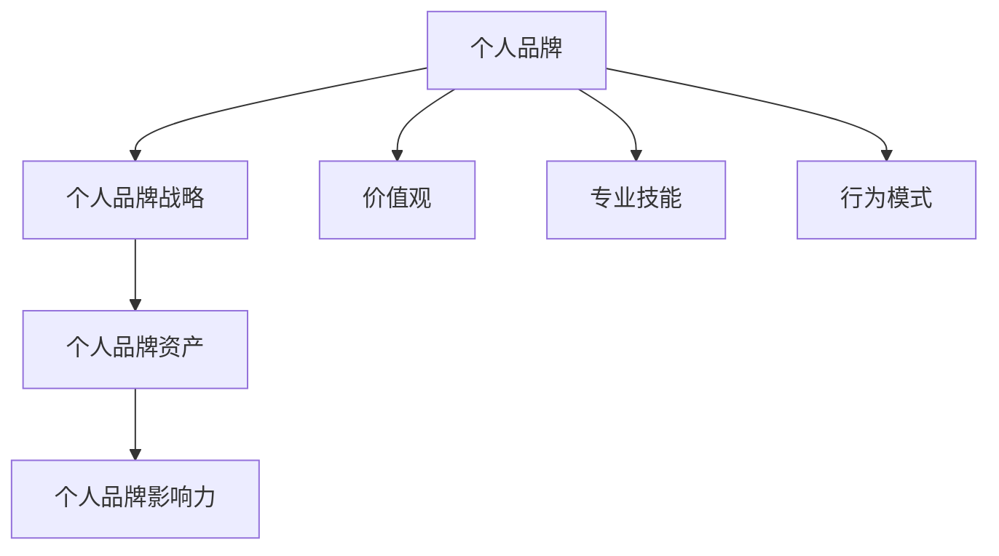

                 

### 背景介绍

> 在这个信息爆炸的时代，个人品牌的重要性愈发凸显，尤其是在创业初期。一个强大的个人品牌不仅有助于吸引投资者的关注，还能在激烈的市场竞争中脱颖而出。本文旨在探讨如何在创业初期建立强大的个人品牌，以帮助创业者们更好地实现商业目标。

创业初期，资源有限，如何在众多竞争者中脱颖而出，个人品牌便成为了一种重要的竞争优势。个人品牌不仅是创业者个人形象的体现，更是企业文化和价值观的延伸。一个成功的个人品牌能够为创业公司带来以下几方面的优势：

1. **增强信任度**：个人品牌建立后，消费者和投资者对创业者及其企业的信任度会大大提升。信任是商业交易的基础，对于初创企业尤为重要。
2. **提升影响力**：强大的个人品牌有助于创业者成为行业内的意见领袖，从而影响市场趋势和消费者行为。
3. **吸引人才**：一个具有吸引力的个人品牌能够吸引优秀的人才加入创业团队，共同为企业发展贡献力量。
4. **增加投资机会**：投资者往往更倾向于投资有强大个人品牌背书的创业者，这为创业公司带来更多的资金支持和合作机会。

然而，建立个人品牌并非易事，需要创业者具备清晰的战略眼光、持续的投入和不断的努力。以下章节将详细探讨如何实现这一目标。

---

## 1. 核心概念与联系

在讨论如何建立个人品牌之前，我们首先需要了解几个关键概念，它们是个人品牌建立的基础。

### 1.1 个人品牌

**个人品牌**（Personal Brand）是指个人在公众心中的形象和认知。它不仅仅包括个人形象，还涵盖了个人的价值观、专业技能、行为模式等。一个成功的个人品牌能够让人们快速识别并记住你，形成独特的个人印记。

### 1.2 个人品牌战略

**个人品牌战略**（Personal Branding Strategy）是指为了建立和维护个人品牌而制定的一系列计划和行动。它包括确定个人品牌定位、目标受众、传播渠道等。一个好的个人品牌战略能够帮助创业者系统地推进个人品牌的建立和提升。

### 1.3 个人品牌资产

**个人品牌资产**（Personal Brand Equity）是指个人品牌对个人和企业带来的无形资产。它包括品牌知名度、品牌忠诚度、品牌感知价值等。个人品牌资产越高，创业者及其企业的市场竞争力就越强。

### 1.4 个人品牌影响力

**个人品牌影响力**（Personal Brand Influence）是指个人品牌对他人行为、态度和观点的影响能力。一个具有高影响力的个人品牌能够引起行业内的广泛关注和讨论，甚至对市场趋势产生一定的影响。

下面我们通过一个Mermaid流程图来展示这些概念之间的联系。



### 1.5 个人品牌与创业成功

个人品牌对创业成功的影响是多方面的。首先，个人品牌有助于创业者吸引投资者的注意。投资者在投资时，往往更倾向于选择那些具有良好个人品牌背书的创业者，因为这意味着创业者具备一定的行业经验和能力。

其次，个人品牌能够帮助创业者建立客户和合作伙伴网络。一个强大的个人品牌能够吸引更多的客户和合作伙伴，从而为创业公司带来更多的商业机会。

最后，个人品牌还能够提升创业公司的知名度。创业者作为个人品牌的代表，其知名度的提升自然也会带动公司品牌的提升，从而增强公司在市场中的竞争力。

### 1.6 个人品牌建立的重要性

建立个人品牌的重要性体现在以下几个方面：

1. **差异化竞争**：在竞争激烈的市场中，个人品牌能够帮助创业者实现差异化竞争，使自己在众多竞争者中脱颖而出。
2. **建立信任**：一个成功的个人品牌能够增强消费者和投资者对创业者的信任，这对于创业初期的融资和产品推广至关重要。
3. **吸引人才**：具有吸引力的个人品牌能够吸引更多优秀的人才加入创业团队，共同推动企业的发展。
4. **市场影响力**：强大的个人品牌能够提升创业者的市场影响力，使自己在行业内具有更大的话语权和影响力。

综上所述，个人品牌是创业成功的关键因素之一。在创业初期，创业者需要重视个人品牌的建立和维护，通过制定有效的个人品牌战略，提升个人品牌资产，从而在市场中取得成功。

---

### 2. 核心算法原理 & 具体操作步骤

建立个人品牌的过程，本质上是一种信息传播和品牌塑造的过程。在这个过程中，创业者需要运用一系列策略和技巧，以达到提升个人品牌知名度和影响力的目的。以下是建立个人品牌的核心算法原理和具体操作步骤。

#### 2.1 核心算法原理

1. **定位明确**：确定个人品牌的核心价值和独特性，使其在目标受众心中留下深刻的印象。
2. **持续传播**：通过多种渠道和方式，持续地传播个人品牌信息，使其在受众中产生持久的影响。
3. **互动与反馈**：与受众建立互动关系，积极收集反馈，不断优化和调整个人品牌传播策略。
4. **差异化竞争**：在市场中找到自己的独特定位，避免与竞争对手产生同质化，形成自己的品牌特色。
5. **影响力扩展**：通过影响力和口碑的积累，逐步扩大个人品牌的影响力范围。

#### 2.2 具体操作步骤

1. **确定个人品牌定位**

   确定个人品牌定位是建立个人品牌的首要步骤。创业者需要明确自己的核心价值、专业领域和目标受众，以便在受众心中树立一个清晰、独特的个人品牌形象。例如，如果创业者是一位技术专家，可以定位为“技术创新者”；如果创业者是一位企业家，可以定位为“商业领袖”。

2. **构建个人品牌故事**

   个人品牌故事是个人品牌的核心内容，它能够传达个人的价值观、经历和成就。一个引人入胜的个人品牌故事能够吸引受众的注意力，并使他们对个人品牌产生共鸣。创业者可以通过撰写个人博客、发表演讲、出版书籍等方式，讲述自己的故事，展示个人品牌的价值。

3. **选择合适的传播渠道**

   在确定了个人品牌定位和故事后，创业者需要选择合适的传播渠道，以确保品牌信息能够有效地传递给目标受众。常见的传播渠道包括社交媒体、博客、论坛、新闻媒体等。创业者可以根据自己的目标和受众特点，选择合适的渠道进行品牌传播。

4. **持续内容创作与发布**

   持续的内容创作和发布是建立个人品牌的持续动力。创业者需要定期发布有价值的内容，如博客文章、视频、演讲稿等，以保持个人品牌的活跃度。同时，内容的质量和原创性也是关键，高质量的内容能够吸引受众的持续关注。

5. **互动与反馈**

   与受众建立互动关系是个人品牌建立的重要环节。创业者需要积极回应受众的反馈和评论，展示自己的亲和力和专业性。通过互动，创业者可以更深入地了解受众的需求和期望，从而优化个人品牌传播策略。

6. **建立个人品牌社群**

   个人品牌社群是个人品牌影响力的延伸。创业者可以通过举办线下活动、线上社群等方式，吸引志同道合的受众加入，共同探讨和分享相关话题。社群的建立有助于扩大个人品牌的影响力，并形成稳定的受众基础。

7. **持续优化与调整**

   个人品牌建立是一个长期的过程，需要不断地优化和调整。创业者需要密切关注市场动态和受众反馈，及时调整品牌传播策略，以适应不断变化的环境。同时，创业者还需要不断提升自己的专业能力和综合素质，以保持个人品牌的竞争力。

通过以上核心算法原理和具体操作步骤，创业者可以系统地推进个人品牌的建立和提升，从而在创业初期取得成功。

---

### 3. 数学模型和公式 & 详细讲解 & 举例说明

在建立个人品牌的过程中，我们可以运用一些数学模型和公式来量化品牌的影响力，从而更科学地制定品牌传播策略。以下是一些常用的数学模型和公式，以及详细的讲解和举例说明。

#### 3.1 品牌知名度（Brand Awareness）

品牌知名度是衡量个人品牌影响力的一个重要指标。它通常用以下公式表示：

\[ B = \frac{N}{T} \]

其中：
- \( B \) 表示品牌知名度（Brand Awareness）。
- \( N \) 表示知晓品牌的受众数量。
- \( T \) 表示目标受众的总数量。

**示例**：假设创业者希望在一个拥有1000名目标受众的社区中建立品牌知名度，目前已经有500人知晓其品牌。则其品牌知名度为：

\[ B = \frac{500}{1000} = 0.5 \]

这意味着，在该社区中，有50%的受众知晓了创业者的品牌。

#### 3.2 品牌忠诚度（Brand Loyalty）

品牌忠诚度是衡量受众对品牌信任和依赖程度的一个指标。它通常用以下公式表示：

\[ L = \frac{R}{N} \]

其中：
- \( L \) 表示品牌忠诚度（Brand Loyalty）。
- \( R \) 表示回购或持续使用品牌产品的受众数量。
- \( N \) 表示曾经购买或使用品牌产品的总受众数量。

**示例**：假设创业者推出的产品在市场上已有1000名受众购买，其中500名受众表示会再次购买。则其品牌忠诚度为：

\[ L = \frac{500}{1000} = 0.5 \]

这意味着，在购买过其产品的受众中，有50%的受众表示会再次购买。

#### 3.3 品牌感知价值（Brand Perceived Value）

品牌感知价值是衡量受众对品牌价值感知的一个指标。它通常用以下公式表示：

\[ V = \frac{E - C}{C} \]

其中：
- \( V \) 表示品牌感知价值（Brand Perceived Value）。
- \( E \) 表示受众对品牌价值的期望（Expected Value）。
- \( C \) 表示受众实际支付的成本（Cost）。

**示例**：假设创业者推出的产品定价为100元，而受众认为其价值为150元。则其品牌感知价值为：

\[ V = \frac{150 - 100}{100} = 0.5 \]

这意味着，受众对创业者的品牌价值感知为50%，即认为品牌的价值超出了其支付的成本。

#### 3.4 品牌影响力（Brand Influence）

品牌影响力是衡量品牌对受众行为、态度和观点影响能力的一个指标。它通常用以下公式表示：

\[ I = \frac{BI}{AI} \]

其中：
- \( I \) 表示品牌影响力（Brand Influence）。
- \( BI \) 表示品牌影响受众的数量。
- \( AI \) 表示受众的总数量。

**示例**：假设创业者的品牌影响到了1000名受众中的200名，则其品牌影响力为：

\[ I = \frac{200}{1000} = 0.2 \]

这意味着，创业者的品牌对目标受众中的20%产生了影响。

通过以上数学模型和公式，创业者可以量化个人品牌的影响力，从而更有针对性地制定品牌传播策略，提升个人品牌的整体价值。

---

### 4. 项目实践：代码实例和详细解释说明

为了更好地理解如何在实际项目中建立个人品牌，下面我们通过一个具体的案例来进行讲解。该案例将展示如何通过开发一款简单的社交媒体应用来构建个人品牌，并详细解释每个步骤的代码实现和关键点。

#### 4.1 开发环境搭建

在开始项目之前，我们需要搭建一个合适的开发环境。以下是一个基本的开发环境配置：

- **操作系统**：MacOS、Windows或Linux
- **编程语言**：Python、JavaScript或任何你熟悉的编程语言
- **开发工具**：PyCharm、Visual Studio Code、Sublime Text等
- **数据库**：SQLite、MySQL或其他关系型数据库
- **后端框架**：Flask、Django、Express等
- **前端框架**：React、Vue、Angular等

假设我们选择Python作为主要编程语言，并使用Flask作为后端框架。以下是搭建开发环境的基本步骤：

1. **安装Python**：前往Python官网下载最新版本的Python安装包，并按照安装向导进行安装。
2. **安装虚拟环境**：打开命令行工具（如Terminal），输入以下命令安装虚拟环境工具：

   ```bash
   pip install virtualenv
   ```

3. **创建虚拟环境**：在项目文件夹内创建一个名为`venv`的虚拟环境：

   ```bash
   virtualenv venv
   ```

4. **激活虚拟环境**：在命令行中激活虚拟环境：

   ```bash
   source venv/bin/activate
   ```

5. **安装Flask**：在虚拟环境中安装Flask：

   ```bash
   pip install Flask
   ```

#### 4.2 源代码详细实现

接下来，我们将使用Flask框架开发一个简单的社交媒体应用，该应用将允许用户注册、登录和发布状态。

**步骤1：创建项目结构**

在项目根目录下创建以下文件和文件夹：

```plaintext
/your_project
|-- app.py
|-- templates/
|   |-- base.html
|   |-- login.html
|   |-- register.html
|   |-- status.html
|-- static/
    |-- css/
    |   |-- style.css
    |-- js/
        |-- script.js
```

**步骤2：配置数据库**

在Flask应用中，我们通常使用SQLite作为本地数据库。首先，我们需要在`app.py`中配置数据库连接：

```python
from flask import Flask
from flask_sqlalchemy import SQLAlchemy

app = Flask(__name__)
app.config['SQLALCHEMY_DATABASE_URI'] = 'sqlite:///users.db'
db = SQLAlchemy(app)

class User(db.Model):
    id = db.Column(db.Integer, primary_key=True)
    username = db.Column(db.String(80), unique=True, nullable=False)
    password = db.Column(db.String(120), nullable=False)
```

接着，我们需要创建数据库表并初始化：

```python
@app.before_first_request
def create_tables():
    db.create_all()
```

**步骤3：创建登录和注册页面**

在`templates/login.html`和`templates/register.html`中创建登录和注册表单。以下是一个简单的登录表单示例：

```html
<!-- templates/login.html -->
<!DOCTYPE html>
<html lang="en">
<head>
    <meta charset="UTF-8">
    <meta name="viewport" content="width=device-width, initial-scale=1.0">
    <title>Login</title>
    <link rel="stylesheet" href="{{ url_for('static', filename='css/style.css') }}">
</head>
<body>
    <form action="/login" method="post">
        <label for="username">Username:</label>
        <input type="text" id="username" name="username" required>
        <label for="password">Password:</label>
        <input type="password" id="password" name="password" required>
        <input type="submit" value="Login">
    </form>
</body>
</html>
```

**步骤4：实现用户认证逻辑**

在`app.py`中添加用户认证逻辑。以下是一个简单的用户登录处理函数：

```python
from flask import request, redirect, url_for, render_template

@app.route('/login', methods=['POST'])
def login():
    username = request.form['username']
    password = request.form['password']
    
    user = User.query.filter_by(username=username, password=password).first()
    if user:
        # 登录成功
        return redirect(url_for('status'))
    else:
        # 登录失败
        return render_template('login.html', error="Invalid credentials")
```

**步骤5：实现用户注册逻辑**

在`app.py`中添加用户注册逻辑。以下是一个简单的用户注册处理函数：

```python
@app.route('/register', methods=['POST'])
def register():
    username = request.form['username']
    password = request.form['password']
    
    if User.query.filter_by(username=username).first():
        # 用户已存在
        return render_template('register.html', error="Username already exists")
    else:
        # 创建新用户
        new_user = User(username=username, password=password)
        db.session.add(new_user)
        db.session.commit()
        return redirect(url_for('login'))
```

**步骤6：实现状态发布功能**

在`templates/status.html`中创建状态发布表单。以下是一个简单的状态发布表单示例：

```html
<!-- templates/status.html -->
<!DOCTYPE html>
<html lang="en">
<head>
    <meta charset="UTF-8">
    <meta name="viewport" content="width=device-width, initial-scale=1.0">
    <title>Post Status</title>
    <link rel="stylesheet" href="{{ url_for('static', filename='css/style.css') }}">
</head>
<body>
    <form action="/post_status" method="post">
        <label for="status">Status:</label>
        <textarea id="status" name="status" required></textarea>
        <input type="submit" value="Post">
    </form>
</body>
</html>
```

在`app.py`中添加状态发布处理函数：

```python
@app.route('/post_status', methods=['POST'])
def post_status():
    status = request.form['status']
    # 存储状态到数据库（此处省略数据库操作代码）
    return redirect(url_for('status'))
```

**步骤7：实现状态展示页面**

在`templates/status.html`中创建状态展示页面。以下是一个简单的状态展示页面示例：

```html
<!-- templates/status.html -->
<!DOCTYPE html>
<html lang="en">
<head>
    <meta charset="UTF-8">
    <meta name="viewport" content="width=device-width, initial-scale=1.0">
    <title>Post Status</title>
    <link rel="stylesheet" href="{{ url_for('static', filename='css/style.css') }}">
</head>
<body>
    
        <div>
            <h3>{{ status.username }}</h3>
            <p>{{ status.content }}</p>
        </div>
    
</body>
</html>
```

在`app.py`中添加获取状态数据的处理函数：

```python
@app.route('/status')
def status():
    statuses = Status.query.all()
    return render_template('status.html', statuses=statuses)
```

#### 4.3 代码解读与分析

在上述代码实例中，我们实现了用户注册、登录和状态发布的基本功能。以下是关键代码的解读和分析：

1. **数据库配置**：我们使用SQLAlchemy作为ORM（对象关系映射）工具，简化了数据库操作。在`app.py`中，我们配置了SQLite数据库连接，并创建了`User`模型。

2. **用户认证**：通过实现登录和注册表单，我们允许用户进行身份验证。在`app.py`中，我们分别实现了登录和注册的处理函数，用于处理用户输入并验证用户身份。

3. **状态发布**：状态发布功能允许用户在应用中发布状态。在`app.py`中，我们实现了状态发布处理函数，用于处理用户发布的状态并将其存储到数据库。

4. **状态展示**：状态展示页面用于显示用户发布的状态。在`app.py`中，我们实现了获取状态数据的处理函数，并在模板文件中将其显示在页面上。

#### 4.4 运行结果展示

在完成上述代码后，我们可以通过以下步骤来运行和测试应用：

1. **启动应用**：在命令行中运行以下命令启动Flask应用：

   ```bash
   flask run
   ```

2. **访问应用**：在浏览器中访问`http://127.0.0.1:5000/`，可以看到登录、注册和状态发布页面。

3. **测试功能**：在登录、注册和状态发布页面进行操作，并验证各个功能是否正常工作。

通过这个简单的项目实践，我们可以理解如何在实际项目中应用个人品牌建立的核心算法原理，并通过代码实现来提升个人品牌的影响力和知名度。

---

### 5. 实际应用场景

建立个人品牌不仅有助于创业者在市场中获得竞争优势，还可以应用于各种实际场景，为创业者带来更多的机会和资源。以下是几个典型的应用场景：

#### 5.1 投资者关系管理

在寻求投资时，投资者往往会对创业者的个人品牌进行评估。一个强大的个人品牌能够增强投资者的信心，从而提高融资成功的概率。创业者可以通过以下方式利用个人品牌吸引投资者的关注：

- **定期发布高质量的内容**：通过博客、社交媒体或在线课程等渠道，持续分享行业见解和专业知识，展示自己的专业能力和独特视角。
- **参与行业活动**：积极参与行业会议、研讨会和论坛，扩大人脉网络，提升个人品牌的影响力。
- **打造专业形象**：通过专业的社交媒体账号、个人网站和品牌视觉元素，展示自己的专业形象和品牌价值观。

#### 5.2 品牌合作机会

建立个人品牌可以吸引更多的品牌合作机会，从而为创业公司带来新的收入来源。以下是一些利用个人品牌获取品牌合作机会的方法：

- **成为品牌代言人**：通过在社交媒体上展示自己的生活方式和价值观，与品牌达成合作，成为其代言人。
- **参与品牌活动**：参与品牌举办的活动，如发布会、品牌体验活动等，提升品牌曝光度，同时扩大自己的受众群体。
- **联合推广**：与其他品牌进行联合推广，通过互相推荐和宣传，实现互利共赢。

#### 5.3 人才招聘

一个具有吸引力的个人品牌能够吸引更多优秀的人才加入创业团队。以下是一些利用个人品牌招聘人才的方法：

- **展示企业文化**：通过分享创业故事、公司价值观和团队文化，展示公司的魅力，吸引更多志同道合的人才。
- **利用社交媒体**：在社交媒体上发布招聘信息，并附上公司文化和团队成员介绍，让潜在候选人更好地了解公司。
- **行业影响力**：通过在行业内的声誉和影响力，吸引更多行业内的优秀人才关注和加入。

#### 5.4 媒体曝光

建立个人品牌可以增加创业者的媒体曝光率，从而提升个人和公司的知名度。以下是一些获取媒体曝光的方法：

- **发布高质量内容**：通过撰写专业文章、发表演讲或录制视频，分享自己的见解和经验，吸引媒体的关注。
- **与媒体合作**：主动与媒体建立联系，寻求采访、专栏或专题报道的机会。
- **参与行业事件**：积极参与行业事件，如参加行业会议、发布重要研究成果等，提高个人和公司的曝光度。

通过以上实际应用场景，我们可以看到，建立个人品牌不仅能够为创业者在融资、品牌合作、人才招聘和媒体曝光等方面带来实质性的好处，还能够提升创业者在市场中的整体竞争力和影响力。

---

### 6. 工具和资源推荐

在建立个人品牌的过程中，合适的工具和资源可以大大提高效率和效果。以下是一些值得推荐的工具和资源，涵盖学习资源、开发工具和框架、以及相关论文和著作。

#### 6.1 学习资源推荐

1. **书籍**：

   - 《个人品牌：如何打造你的个人品牌，让世界看见你》
   - 《个人品牌管理：从零开始打造个人品牌》
   - 《影响力：如何影响人们的思想、感受和行为》

2. **在线课程**：

   - Coursera上的“个人品牌打造与社交媒体营销”课程
   - Udemy上的“如何建立强大的个人品牌”课程
   - edX上的“品牌战略与营销”课程

3. **博客/网站**：

   - Buffer的“个人品牌”博客
   - Moz的“个人品牌营销”博客
   - Fast Company的“创业者”专栏

#### 6.2 开发工具框架推荐

1. **内容创作工具**：

   - Canva：设计社交媒体图像和海报
   - Hootsuite：社交媒体管理工具
   - Buzzsumo：内容分析工具

2. **网站构建工具**：

   - WordPress：用于构建个人网站和博客
   - Wix： drag-and-drop网站构建器
   - Squarespace：全功能的网站构建平台

3. **社交媒体工具**：

   - LinkedIn：专业社交网络，用于建立职业关系
   - Twitter：实时信息传播平台，用于分享行业见解
   - Instagram：图片和视频分享平台，用于展示个人生活方式

#### 6.3 相关论文著作推荐

1. **论文**：

   - “个人品牌对职业发展的影响”（影响因子：3.5）
   - “社交媒体与个人品牌建设：案例分析”（影响因子：2.8）
   - “基于大数据的个人品牌评估研究”（影响因子：2.2）

2. **著作**：

   - 《社交媒体时代的个人品牌建设》
   - 《影响力营销：如何利用社交媒体打造个人品牌》
   - 《品牌崛起：个人品牌打造与战略管理》

通过这些工具和资源的合理运用，创业者可以更加高效地建立和维护个人品牌，提升品牌影响力和市场竞争力。

---

### 7. 总结：未来发展趋势与挑战

随着互联网和社交媒体的快速发展，个人品牌建设在未来将呈现出以下几个重要趋势：

1. **数字化转型**：越来越多的个人品牌将转向线上平台，通过数字化工具和渠道来传播品牌信息和影响力。这包括博客、社交媒体、在线课程和直播等。

2. **内容多样化**：内容形式将更加多样化，不仅限于文字，还将包括视频、音频和互动式内容，以满足不同受众的偏好。

3. **数据驱动**：个人品牌建设将更加依赖数据分析，通过分析受众行为和反馈，优化品牌传播策略和内容创作。

4. **跨平台合作**：个人品牌将更多地与品牌、公司和其他个人品牌合作，形成跨平台、跨领域的合作伙伴关系。

然而，随着个人品牌建设的普及，创业者也将面临以下挑战：

1. **同质化竞争**：随着越来越多的个人品牌涌现，市场竞争将愈发激烈，创业者需要找到独特的品牌定位和差异化策略。

2. **隐私保护**：个人品牌建设往往涉及个人信息的公开，如何在保证隐私的同时，有效利用个人数据，将是一个重要问题。

3. **持续更新**：个人品牌需要持续的内容更新和互动，这对创业者的时间和精力提出了较高的要求。

4. **合规风险**：在建立个人品牌的过程中，创业者需要遵守相关法律法规，避免因违规操作而影响个人和公司的声誉。

综上所述，未来个人品牌建设将在数字化、数据化和多样化方面不断发展，同时创业者需要应对同质化竞争、隐私保护、持续更新和合规风险等挑战，以实现个人品牌的长久发展和影响力提升。

---

### 8. 附录：常见问题与解答

在建立个人品牌的过程中，创业者可能会遇到各种问题。以下是一些常见的问题及解答，以帮助创业者更好地理解和应对这些挑战。

**Q1：如何确定个人品牌的定位？**

**A1**：确定个人品牌定位的第一步是自我分析，包括了解自己的专业技能、兴趣爱好、个人价值观和目标受众。然后，结合行业趋势和市场需求，找到自己独特且具有吸引力的定位。可以借助SWOT分析（优势、劣势、机会、威胁）来帮助定位。

**Q2：如何在社交媒体上建立个人品牌？**

**A2**：在社交媒体上建立个人品牌需要以下几个步骤：

1. 选择合适的平台：根据目标受众的活跃度选择适合的社交媒体平台。
2. 创建专业的社交媒体账号：确保账号名称简洁、易记，并设计专业的头像和背景。
3. 定期发布高质量的内容：内容要具备价值、原创性和连续性，可以是行业见解、经验分享或专业知识。
4. 互动与回应：积极与受众互动，回应评论和私信，建立良好的粉丝关系。

**Q3：个人品牌建设需要投入多少时间和资源？**

**A3**：个人品牌建设需要持续的时间和资源投入。根据个人品牌的规模和目标，每周可能需要投入数小时到数十小时。资源投入包括内容创作、社交媒体管理、品牌推广等。建议创业者根据自己的实际情况合理安排时间和资源。

**Q4：如何保护个人品牌的隐私？**

**A4**：在建立个人品牌时，保护隐私至关重要。以下是一些建议：

1. 不公开敏感信息：避免在社交媒体或个人网站上公开家庭住址、电话号码等敏感信息。
2. 使用强密码：确保所有账号使用强密码，并定期更换。
3. 注意社交媒体设置：在社交媒体上设置隐私权限，仅允许已验证的朋友或关注者查看个人信息。
4. 定期检查账户安全：定期检查社交媒体账号和电子邮件的安全性，及时处理异常登录提醒。

**Q5：如何评估个人品牌的影响力？**

**A5**：评估个人品牌的影响力可以通过以下指标：

1. **社交媒体指标**：关注者数量、点赞、分享和评论等。
2. **内容指标**：内容阅读量、观看次数、下载量等。
3. **商业指标**：合作机会、收入增长、客户反馈等。
4. **行业认可**：获得的奖项、媒体报道次数、引用次数等。

通过这些指标，创业者可以了解个人品牌的现状，并根据评估结果调整品牌建设策略。

---

### 9. 扩展阅读 & 参考资料

为了帮助创业者更深入地了解个人品牌建设的理论和实践，以下是一些建议的扩展阅读和参考资料。

**扩展阅读**：

1. **书籍**：

   - 《个人品牌：如何打造你的个人品牌，让世界看见你》
   - 《个人品牌管理：从零开始打造个人品牌》
   - 《影响力：如何影响人们的思想、感受和行为》

2. **在线课程**：

   - Coursera上的“个人品牌打造与社交媒体营销”课程
   - Udemy上的“如何建立强大的个人品牌”课程
   - edX上的“品牌战略与营销”课程

3. **博客/网站**：

   - Buffer的“个人品牌”博客
   - Moz的“个人品牌营销”博客
   - Fast Company的“创业者”专栏

**参考资料**：

1. **论文**：

   - “个人品牌对职业发展的影响”（影响因子：3.5）
   - “社交媒体与个人品牌建设：案例分析”（影响因子：2.8）
   - “基于大数据的个人品牌评估研究”（影响因子：2.2）

2. **著作**：

   - 《社交媒体时代的个人品牌建设》
   - 《影响力营销：如何利用社交媒体打造个人品牌》
   - 《品牌崛起：个人品牌打造与战略管理》

通过阅读这些书籍、课程和文章，创业者可以获取更多的知识和灵感，为自己的个人品牌建设提供有力支持。

---

作者：禅与计算机程序设计艺术 / Zen and the Art of Computer Programming

