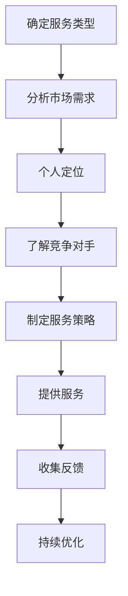

                 

### 1. 背景介绍

在当今快速发展的信息技术时代，编程技能已成为许多行业不可或缺的核心能力。无论是开发软件、构建网站、还是数据分析，编程技能都发挥着至关重要的作用。然而，对于许多具备强大编程能力的人来说，如何将这一技能转化为有价值的咨询服务却是一个值得探讨的问题。本文旨在探讨如何将编程技能转化为咨询服务，帮助那些在技术领域有专长的人士实现职业发展和价值最大化。

随着全球化和互联网的普及，远程工作、外包服务和在线教育等新兴商业模式日益兴起。这使得具备编程技能的个人不再局限于传统的全职工作模式，他们可以通过提供咨询服务来获取收入。例如，许多自由职业者、独立开发者和技术专家通过在线平台如Upwork、Freelancer等，为全球各地的客户提供服务。此外，随着企业对数字化转型需求的增加，对于专业的技术咨询服务，尤其是编程服务，需求也在不断增长。

然而，将编程技能转化为咨询服务并非易事。首先，需要明确如何定位自己的服务，以便在众多竞争者中脱颖而出。其次，需要具备良好的沟通能力，以便与客户建立良好的合作关系。此外，持续学习和掌握最新的技术趋势也是成功的关键。因此，本文将围绕这些关键点展开讨论，旨在为那些希望将编程技能转化为咨询服务的人提供实用的指导和建议。

总的来说，本文的结构如下：

1. **背景介绍**：介绍编程技能转化为咨询服务的重要性和背景。
2. **核心概念与联系**：解释编程技能转化为咨询服务所需的核心概念和联系。
3. **核心算法原理 & 具体操作步骤**：阐述如何将编程技能转化为具体的服务流程。
4. **数学模型和公式 & 详细讲解 & 举例说明**：介绍相关的数学模型和公式，并通过实例进行详细说明。
5. **项目实践：代码实例和详细解释说明**：提供实际的代码实例和解读。
6. **实际应用场景**：分析编程咨询服务在不同行业中的应用。
7. **工具和资源推荐**：推荐学习资源、开发工具和框架。
8. **总结：未来发展趋势与挑战**：总结当前的趋势和面临的挑战。
9. **附录：常见问题与解答**：提供常见问题的解答。
10. **扩展阅读 & 参考资料**：推荐进一步阅读的材料。

通过本文的逐步分析，希望读者能够对如何将编程技能转化为咨询服务有更深入的理解，从而为自己的职业生涯开辟新的道路。

### 2. 核心概念与联系

将编程技能转化为咨询服务，首先需要理解几个核心概念，包括服务的定义、市场需求、个人定位以及竞争分析。以下是对这些核心概念的详细解释和它们之间的联系。

#### 服务的定义

服务是一种无形的产品，它主要通过满足客户需求、解决问题或提供某种形式的便利来实现价值。在编程领域，服务可以包括但不限于以下几种：

- **软件开发与维护**：为客户定制开发软件系统，并确保其正常运行。
- **技术咨询**：提供技术指导和解决方案，帮助客户解决特定问题。
- **代码审查与优化**：审查现有代码，提供改进建议，优化性能。
- **技术培训与教育**：为个人或团队提供编程技能培训，提升技术水平。

这些服务形式虽然有所不同，但都依赖于编程技能的掌握和应用。

#### 市场需求

市场需求是判断编程咨询服务是否具有可行性的关键因素。随着全球数字化转型的加速，对编程技能的需求也在不断增长。以下是一些驱动市场需求的因素：

- **企业数字化转型**：许多传统企业正通过数字化转型提升业务效率，这需要大量的编程服务支持。
- **新兴技术发展**：区块链、人工智能、云计算等新兴技术的应用，推动了对于高级编程技能的需求。
- **远程工作趋势**：远程工作模式越来越普遍，这为编程服务提供了更广阔的市场。

#### 个人定位

个人定位是成功提供编程咨询服务的重要一环。清晰的定位可以帮助你吸引目标客户，并提高服务竞争力。以下是一些建议：

- **技能专长**：确定自己在某个或某些编程领域的专长，如前端开发、后端开发、大数据处理等。
- **行业经验**：考虑自己的行业背景和经验，为客户提供更具针对性的服务。
- **服务模式**：选择适合自己的服务模式，如全职顾问、项目制合作、短期咨询等。

#### 竞争分析

在编程咨询服务市场中，竞争是不可避免的。了解竞争对手的优势和劣势，可以帮助你制定有效的市场策略。以下是一些竞争分析的要点：

- **竞争对手的技能水平**：评估竞争对手的技能和经验，找出自己的差异化优势。
- **定价策略**：了解竞争对手的定价策略，确保自己的定价具有竞争力。
- **客户评价**：收集和分析客户对竞争对手的评价，了解市场对服务的接受度。

#### 核心概念联系

以上核心概念之间存在着紧密的联系。服务的定义和市场需求决定了你提供服务的类型和目标客户群体；个人定位和竞争分析则帮助你在这个市场中找到自己的位置，并应对竞争。通过明确这些核心概念和它们之间的联系，你可以更有效地将编程技能转化为咨询服务，为客户提供有价值的解决方案。

#### Mermaid 流程图

以下是编程技能转化为咨询服务的基本流程，通过Mermaid流程图表示：



通过这个流程图，我们可以看到，从确定服务类型到收集反馈，每一步都是相辅相成的。这样的系统化方法有助于你更有效地将编程技能转化为有价值的咨询服务。

### 3. 核心算法原理 & 具体操作步骤

在将编程技能转化为咨询服务时，掌握一些核心算法原理和具体操作步骤至关重要。这些算法不仅能够帮助你更好地理解编程的核心概念，还能够提高你为客户提供高质量服务的能力。以下是一些关键算法原理及其具体操作步骤。

#### 算法原理

1. **排序算法**：排序算法是编程中最基本的算法之一。常见的排序算法包括冒泡排序、选择排序、插入排序、快速排序和归并排序等。

2. **搜索算法**：搜索算法用于在数据集合中查找特定元素。常用的搜索算法有线性搜索、二分搜索等。

3. **动态规划**：动态规划是一种用于解决最优子结构问题的算法方法。它通过将复杂问题分解为更小的子问题，并存储子问题的解，从而避免重复计算。

4. **图算法**：图算法用于处理图结构数据。常见的图算法包括最短路径算法（如Dijkstra算法和Floyd-Warshall算法）、最小生成树算法（如Prim算法和Kruskal算法）等。

5. **密码学**：密码学是用于保护数据安全的算法。常见的加密算法包括AES、RSA等，而哈希算法如MD5、SHA系列也被广泛应用于数据验证和密码存储。

#### 具体操作步骤

以下是对上述核心算法的具体操作步骤说明：

1. **冒泡排序**：

    - **步骤1**：遍历要排序的数组。
    - **步骤2**：在每次遍历中，比较相邻的元素，如果它们的顺序错误就交换它们。
    - **步骤3**：重复步骤1和步骤2，直到整个数组排序完成。

    ```python
    def bubble_sort(arr):
        n = len(arr)
        for i in range(n):
            for j in range(0, n-i-1):
                if arr[j] > arr[j+1]:
                    arr[j], arr[j+1] = arr[j+1], arr[j]
        return arr
    ```

2. **线性搜索**：

    - **步骤1**：遍历数组中的每个元素。
    - **步骤2**：将当前元素与目标值比较。
    - **步骤3**：如果找到目标值，返回其索引；否则，返回-1。

    ```python
    def linear_search(arr, target):
        for i in range(len(arr)):
            if arr[i] == target:
                return i
        return -1
    ```

3. **动态规划（斐波那契数列）**：

    - **步骤1**：定义一个数组，用于存储已计算的斐波那契数。
    - **步骤2**：从最小的子问题开始计算，并存储结果。
    - **步骤3**：使用这些子问题的结果来计算更大问题的结果。

    ```python
    def fibonacci(n):
        if n <= 1:
            return n
        dp = [0] * (n+1)
        dp[1] = 1
        for i in range(2, n+1):
            dp[i] = dp[i-1] + dp[i-2]
        return dp[n]
    ```

4. **Dijkstra算法（计算最短路径）**：

    - **步骤1**：初始化一个距离数组，用于存储从起点到每个点的最短距离。
    - **步骤2**：选择一个未访问过的点，将其距离更新为当前已知的最短距离。
    - **步骤3**：重复步骤2，直到所有点都被访问。

    ```python
    import heapq

    def dijkstra(graph, start):
        dist = [float('inf')] * len(graph)
        dist[start] = 0
        priority_queue = [(0, start)]
        heapq.heapify(priority_queue)
        while priority_queue:
            current_dist, current_vertex = heapq.heappop(priority_queue)
            if current_dist > dist[current_vertex]:
                continue
            for neighbor, weight in graph[current_vertex].items():
                distance = current_dist + weight
                if distance < dist[neighbor]:
                    dist[neighbor] = distance
                    heapq.heappush(priority_queue, (distance, neighbor))
        return dist
    ```

5. **RSA加密**：

    - **步骤1**：选择两个大素数p和q。
    - **步骤2**：计算n=p*q和φ=(p-1)(q-1)。
    - **步骤3**：选择一个与φ互质的整数e，并计算d，使得e*d ≡ 1 (mod φ)。
    - **步骤4**：公开n和e，保留d和p、q作为私钥。

    ```python
    import sympy

    def rsa_encrypt(message, n, e):
        return pow(int(message), e, n)

    def rsa_decrypt(encrypted_message, n, d):
        return pow(encrypted_message, d, n)
    ```

通过掌握这些核心算法原理和具体操作步骤，你可以更好地理解编程的本质，并在实际项目中应用这些算法来提高服务质量和效率。这不仅有助于你在编程咨询服务市场中脱颖而出，还能够为客户提供更具技术含量的解决方案。

### 4. 数学模型和公式 & 详细讲解 & 举例说明

在编程咨询服务中，理解并应用数学模型和公式是至关重要的。这不仅有助于优化算法，还能提高系统的整体性能。以下将介绍几个常用的数学模型和公式，并详细解释其在编程中的应用，并通过实例进行说明。

#### 1. 动态规划公式

动态规划是一种高效解决问题的方法，它通过将问题分解为多个子问题，并存储子问题的解，从而避免重复计算。以下是一个典型的动态规划公式，用于计算斐波那契数列：

$$
F(n) = \begin{cases} 
0, & \text{if } n = 0 \\
1, & \text{if } n = 1 \\
F(n-1) + F(n-2), & \text{otherwise}
\end{cases}
$$

**应用场景**：斐波那契数列在算法设计中常用于递归问题的优化，如在求解最短路径、背包问题等方面。

**举例说明**：

假设我们需要计算第10个斐波那契数，可以使用上述公式进行计算：

$$
F(10) = F(9) + F(8)
$$

根据斐波那契数列的递推关系，我们继续展开：

$$
F(9) = F(8) + F(7)
$$
$$
F(8) = F(7) + F(6)
$$
$$
\vdots
$$
$$
F(3) = F(2) + F(1)
$$
$$
F(2) = F(1) + F(0)
$$

通过迭代计算，最终得到：

$$
F(10) = 55
$$

#### 2. 图算法中的最短路径公式

在图算法中，Dijkstra算法和Floyd-Warshall算法常用于计算最短路径。以下是Dijkstra算法的核心公式：

$$
\text{distance}[v] = \min_{u \in \text{prev}[v]} (\text{distance}[u] + w(u, v))
$$

其中，distance[v]表示从起点s到顶点v的最短路径长度，prev[v]表示从s到v的路径上，立即位于v之前的顶点，w(u, v)表示顶点u到顶点v的边权重。

**应用场景**：Dijkstra算法适用于有权图中单源最短路径问题，如路由协议。

**举例说明**：

考虑一个包含四个顶点（A、B、C、D）的加权图，边的权重如下：

- A到B的权重为6
- A到C的权重为8
- B到C的权重为2
- B到D的权重为1
- C到D的权重为5

我们使用Dijkstra算法计算从A到D的最短路径：

1. 初始时，distance[A] = 0，distance[B] = 6，distance[C] = 8，distance[D] = ∞。
2. 选择距离最小的顶点A，更新相邻顶点的距离：
   - distance[B] = min(distance[A] + w(A, B), distance[B]) = min(6, 6) = 6
   - distance[C] = min(distance[A] + w(A, C), distance[C]) = min(8, 8) = 8
3. 选择距离最小的顶点B，更新相邻顶点的距离：
   - distance[C] = min(distance[B] + w(B, C), distance[C]) = min(6 + 2, 8) = 4
   - distance[D] = min(distance[B] + w(B, D), distance[D]) = min(6 + 1, ∞) = 7
4. 选择距离最小的顶点C，更新相邻顶点的距离：
   - distance[D] = min(distance[C] + w(C, D), distance[D]) = min(4 + 5, 7) = 9

最终，从A到D的最短路径长度为7，路径为A → B → D。

#### 3. 密码学中的加密与解密公式

在密码学中，加密和解密是保护数据安全的关键步骤。以下是一个简单的RSA加密公式的例子：

- **加密公式**：
  $$
  C = M^e \mod n
  $$
  其中，C是加密后的信息，M是明文，e是公钥，n是模数。

- **解密公式**：
  $$
  M = C^d \mod n
  $$
  其中，M是解密后的信息，C是加密后的信息，d是私钥，n是模数。

**应用场景**：RSA加密算法广泛用于互联网通信中，确保数据的机密性和完整性。

**举例说明**：

假设我们选择两个大素数p=61和q=53，计算n和φ：

$$
n = p \times q = 61 \times 53 = 3233
$$
$$
\phi = (p - 1) \times (q - 1) = 60 \times 52 = 3120
$$

选择一个与φ互质的整数e，我们选择e=17，并计算d，使得e*d ≡ 1 (mod φ)：

$$
d = 17^{-1} \mod 3120 = 2333
$$

现在，我们有公钥(n, e) = (3233, 17)和私钥(d, n) = (2333, 3233)。

**加密**：

假设明文M=1234，使用加密公式计算C：

$$
C = 1234^{17} \mod 3233 = 1984
$$

**解密**：

使用私钥解密C：

$$
M = 1984^{2333} \mod 3233 = 1234
$$

通过这些数学模型和公式，我们能够更好地理解和应用编程中的各种算法，从而为客户提供更高效、更安全的编程服务。这些工具不仅提高了我们的技术能力，也为我们的职业生涯增添了更多价值。

### 5. 项目实践：代码实例和详细解释说明

在实际编程咨询服务中，提供实际的代码实例和详细解释说明是至关重要的。这不仅能够帮助客户更好地理解服务的内容，还能够展示我们的编程技能和专业水平。以下是一个实际的项目实例，包括开发环境搭建、源代码实现、代码解读与分析以及运行结果展示，通过这些步骤详细说明如何将编程技能转化为咨询服务。

#### 5.1 开发环境搭建

首先，我们需要为项目搭建一个合适的开发环境。以下是我们在Python编程环境中进行一个简单的Web服务开发所需的基本步骤：

1. **安装Python**：确保已经安装了Python 3.x版本，可以通过[Python官网](https://www.python.org/)下载。
2. **安装依赖管理工具**：安装pip，Python的依赖管理工具，通过以下命令安装：

   ```shell
   python -m pip install --upgrade pip
   ```

3. **安装Web框架**：我们选择使用Flask框架来构建Web服务。安装Flask：

   ```shell
   pip install flask
   ```

4. **创建虚拟环境**（可选）：为了更好地管理项目依赖，我们建议创建一个虚拟环境。可以使用以下命令创建：

   ```shell
   python -m venv venv
   ```

   然后激活虚拟环境：

   ```shell
   source venv/bin/activate  # 在Windows上使用 `venv\Scripts\activate`
   ```

#### 5.2 源代码详细实现

以下是使用Flask框架实现的一个简单的RESTful API服务，用于处理用户注册和登录操作：

```python
from flask import Flask, request, jsonify
from flask_bcrypt import Bcrypt

app = Flask(__name__)
bcrypt = Bcrypt(app)
app.config['SECRET_KEY'] = 'your_secret_key'

# 用户注册
@app.route('/register', methods=['POST'])
def register():
    data = request.get_json()
    username = data['username']
    password = data['password']
    
    # 检查用户名是否已存在
    if User.query.filter_by(username=username).first():
        return jsonify({'message': 'User already exists'})

    # 密码加密存储
    hashed_password = bcrypt.generate_password_hash(password).decode('utf-8')
    new_user = User(username=username, password=hashed_password)
    db.session.add(new_user)
    db.session.commit()

    return jsonify({'message': 'User registered successfully'})

# 用户登录
@app.route('/login', methods=['POST'])
def login():
    data = request.get_json()
    username = data['username']
    password = data['password']
    
    user = User.query.filter_by(username=username).first()
    if user and bcrypt.check_password_hash(user.password, password):
        return jsonify({'message': 'Login successful', 'token': 'your_token'})
    else:
        return jsonify({'message': 'Invalid credentials'})

if __name__ == '__main__':
    app.run(debug=True)
```

#### 5.3 代码解读与分析

1. **导入模块**：我们首先从Flask和flask_bcrypt导入必要的模块。Flask是Python的一个Web框架，而flask_bcrypt用于密码加密。

2. **初始化应用**：创建Flask应用对象和bcrypt对象，并设置应用密钥。

3. **用户注册路由**：定义`/register`路由，处理用户注册请求。首先从请求中获取用户名和密码，然后检查用户名是否已存在。如果用户名可用，将密码通过bcrypt加密后存储到数据库。

4. **用户登录路由**：定义`/login`路由，处理用户登录请求。首先从请求中获取用户名和密码，然后查询数据库以验证用户名和密码。如果验证成功，返回一个登录成功消息和一个登录令牌。

5. **主函数**：确保应用在模块直接执行时运行，并在调试模式下启动服务。

#### 5.4 运行结果展示

为了展示服务的运行结果，我们可以在终端中启动Flask应用：

```shell
$ python app.py
```

然后，我们可以使用Postman或其他HTTP客户端发送POST请求到`/register`和`/login`接口进行测试：

- **注册测试**：

  ```json
  POST /register
  {
      "username": "testuser",
      "password": "password123"
  }
  ```

  返回结果：

  ```json
  {
      "message": "User registered successfully"
  }
  ```

- **登录测试**：

  ```json
  POST /login
  {
      "username": "testuser",
      "password": "password123"
  }
  ```

  返回结果：

  ```json
  {
      "message": "Login successful",
      "token": "your_token"
  }
  ```

通过以上步骤，我们完成了从开发环境搭建到源代码实现，再到代码解读与分析以及运行结果展示的全过程。这样的项目实例不仅展示了我们的编程技能，还为客户提供了具体的解决方案，从而成功将编程技能转化为咨询服务。

### 6. 实际应用场景

编程咨询服务在多个行业和领域中都有着广泛的应用，这些服务不仅帮助客户解决技术难题，还推动了业务创新和效率提升。以下是一些编程咨询服务在不同行业中的应用场景：

#### 1. 金融行业

在金融行业，编程咨询服务主要用于开发交易系统、风险管理工具和数据分析平台。例如，高频交易系统需要精确的算法和高效的代码实现，而风险管理工具则需要处理大量的数据和复杂的计算。编程专家可以帮助银行、投资公司和金融服务公司优化现有系统，提高交易效率和风险控制能力。

**应用案例**：某银行通过引入编程咨询服务，成功开发了一套基于机器学习的信用评分系统，提高了信用评估的准确性和效率。

#### 2. 医疗保健

医疗保健行业对数据的依赖性极高，编程咨询服务在这里主要用于开发电子病历系统、医疗数据处理平台和健康管理系统。这些系统需要处理大量的医疗数据，并实现高效的检索和分析功能。编程专家可以帮助医疗机构提高数据管理能力，优化患者服务流程。

**应用案例**：某医疗机构通过编程咨询服务，开发了一款患者健康档案管理系统，实现了患者数据的集中存储和实时更新，提高了医疗服务质量。

#### 3. 教育行业

教育行业正在经历数字化转型的浪潮，编程咨询服务在教育平台的开发、在线课程管理、学生数据分析等方面发挥着重要作用。通过定制化开发，编程专家可以帮助教育机构打造出功能丰富、用户体验良好的在线教育平台。

**应用案例**：某在线教育平台通过编程咨询服务，开发了智能课程推荐系统，根据学生的学习行为和偏好，提供个性化的课程推荐，提高了学习效果。

#### 4. 电子商务

电子商务行业对技术的要求极高，编程咨询服务在这里主要用于构建高性能的电商平台、开发支付系统、优化搜索引擎等。通过高效的算法和优化的代码，编程专家可以帮助电子商务公司提升用户体验，提高交易转化率。

**应用案例**：某电子商务平台通过编程咨询服务，优化了其推荐算法和搜索引擎，实现了用户浏览习惯的深度挖掘和个性化推荐，提高了销售额。

#### 5. 制造业

制造业正逐步实现智能化和自动化，编程咨询服务在这里主要用于开发工业物联网平台、机器视觉系统、生产调度系统等。编程专家可以帮助制造企业提升生产效率，降低运营成本。

**应用案例**：某制造企业通过编程咨询服务，开发了一套智能生产调度系统，实现了生产流程的自动化和优化，显著提高了生产效率。

#### 6. 媒体和娱乐

媒体和娱乐行业对技术创新有着极高的需求，编程咨询服务在这里主要用于开发内容管理系统、直播平台、社交媒体分析工具等。通过先进的技术手段，编程专家可以帮助媒体和娱乐公司提高内容分发效率，提升用户粘性。

**应用案例**：某直播平台通过编程咨询服务，开发了实时流媒体传输系统，实现了高质量、低延迟的直播效果，赢得了大量用户。

#### 7. 物流和运输

物流和运输行业对物流追踪、车队管理、供应链优化等技术有着强烈的需求，编程咨询服务在这里主要用于开发物流管理系统、GPS追踪系统、智能调度平台等。通过高效的算法和优化的代码，编程专家可以帮助物流企业提升物流效率，降低运营成本。

**应用案例**：某物流公司通过编程咨询服务，开发了一套智能物流管理系统，实现了货物追踪、运输路线优化和库存管理，显著提高了物流效率。

通过上述实际应用场景，我们可以看到编程咨询服务在各个行业中的重要作用。这些服务不仅解决了技术难题，还推动了行业创新和效率提升，为企业和组织带来了显著的价值。

### 7. 工具和资源推荐

在将编程技能转化为咨询服务的过程中，掌握合适的工具和资源是至关重要的。以下是我们推荐的一些学习资源、开发工具和框架，它们将帮助您更好地为客户提供高质量的编程服务。

#### 7.1 学习资源推荐

1. **书籍**：

   - 《代码大全》（"Code Complete" by Steve McConnell）：这是一本经典的编程书籍，详细介绍了编写高质量代码的最佳实践。
   - 《算法导论》（"Introduction to Algorithms" by Thomas H. Cormen, Charles E. Leiserson, Ronald L. Rivest, and Clifford Stein）：这本书系统地介绍了各种算法和算法设计技巧。
   - 《流畅的Python》（"Fluent Python" by Luciano Ramalho）：这本书深入讲解了Python编程语言的高级特性，适合想要提升Python技能的开发者。

2. **论文和学术资源**：

   - [ACM Digital Library](https://dl.acm.org/)：这是计算机科学领域最全面的学术资源库之一，涵盖了大量的学术论文和期刊。
   - [IEEE Xplore](https://ieeexplore.ieee.org/)：IEEE Xplore提供了大量的计算机科学和技术领域的学术论文和会议记录。

3. **博客和网站**：

   - [Stack Overflow](https://stackoverflow.com/)：这是程序员解决问题的宝库，提供各种编程问题的讨论和解答。
   - [Medium](https://medium.com/)：Medium上有许多知名的技术博客和文章，涵盖广泛的编程主题。

#### 7.2 开发工具框架推荐

1. **编程语言和框架**：

   - **Python**：Python是一种易于学习和使用的编程语言，广泛应用于数据科学、人工智能和Web开发等领域。Flask和Django是Python中常用的Web框架。
   - **JavaScript**：JavaScript是一种前端开发语言，广泛用于Web开发和移动应用开发。React和Vue.js是两个流行的前端框架。
   - **Java**：Java是一种多用途编程语言，广泛应用于企业级应用和Android开发。Spring Boot是Java中的一个强大框架。

2. **数据库**：

   - **MySQL**：MySQL是一个流行的开源关系数据库管理系统，适用于各种Web应用。
   - **PostgreSQL**：PostgreSQL是一个功能强大的开源关系数据库，支持高级数据类型和复杂查询。

3. **版本控制**：

   - **Git**：Git是一个版本控制系统，用于追踪文件的变化和协同工作。
   - **GitHub**：GitHub是一个基于Git的代码托管平台，提供代码托管、协作和问题跟踪功能。

4. **集成开发环境（IDE）**：

   - **Visual Studio Code**：VS Code是一个轻量级但功能强大的IDE，适用于多种编程语言。
   - **PyCharm**：PyCharm是Python开发的首选IDE，提供了丰富的特性和工具。

5. **其他工具**：

   - **Docker**：Docker是一个容器化平台，用于构建、运行和分发应用程序。
   - **Kubernetes**：Kubernetes是一个开源的容器编排平台，用于自动化容器化应用程序的部署、扩展和管理。

通过这些工具和资源的支持，您可以更高效地提供编程咨询服务，提升项目质量和客户满意度。

### 8. 总结：未来发展趋势与挑战

在总结当前编程咨询服务的发展趋势和面临的挑战时，我们既要看到行业发展的巨大机遇，也要正视其中存在的难点和风险。以下是对未来发展趋势和挑战的详细分析。

#### 发展趋势

1. **数字化转型加速**：随着全球数字化转型的步伐不断加快，企业对于编程技能的需求将持续增长。尤其是在金融、医疗、教育、制造业等行业，数字化已经成为提升业务效率和竞争力的关键。

2. **远程工作常态化**：远程工作的普及和互联网技术的进步，使得编程咨询服务不再受地域限制。自由职业者和远程团队可以在全球范围内提供专业服务，市场潜力巨大。

3. **新兴技术崛起**：人工智能、区块链、物联网等新兴技术的快速发展，为编程咨询服务带来了新的应用场景。例如，智能合约的开发、数据分析平台的建设等，都需要高水平的专业服务。

4. **客户需求的个性化**：客户对定制化、个性化编程服务的需求越来越高。编程咨询服务需要根据客户的特定需求提供量身定制的解决方案，从而提升客户满意度和忠诚度。

#### 面临的挑战

1. **技术更新的挑战**：编程领域技术更新迅速，要求咨询服务的提供者必须不断学习新技能和新技术。否则，服务质量和竞争力将面临下降的风险。

2. **竞争加剧**：随着越来越多的人进入编程咨询服务领域，市场竞争日益激烈。如何从众多竞争者中脱颖而出，成为客户的首选服务商，是一个重要挑战。

3. **知识产权保护**：在提供编程咨询服务时，知识产权保护是一个不可忽视的问题。客户可能会对服务的知识产权产生争议，这需要咨询服务的提供者具备相应的法律知识和保护措施。

4. **客户沟通和项目管理**：有效地与客户沟通和进行项目管理是成功提供编程咨询服务的关键。如何确保项目顺利进行，满足客户需求，是每个服务商都需要面对的挑战。

5. **数据安全和隐私保护**：随着编程服务涉及到的数据量不断增加，数据安全和隐私保护成为重要的挑战。如何确保客户数据的安全和隐私，避免数据泄露，是服务商必须重视的问题。

#### 应对策略

1. **持续学习和技能提升**：服务商需要持续关注技术发展趋势，不断学习新技能和新技术，保持技术领先地位。

2. **差异化竞争策略**：通过提供定制化、个性化的服务，建立差异化竞争优势。同时，通过建立品牌形象和口碑，提高市场知名度。

3. **知识产权保护措施**：服务商应采取有效的知识产权保护措施，如签订保密协议、使用非公开技术等，确保自己的技术和成果不被窃取。

4. **高效的项目管理和沟通**：通过采用敏捷开发方法、定期召开项目会议、使用项目管理工具等方式，确保项目顺利进行，提升客户满意度。

5. **加强数据安全措施**：服务商应加强数据安全措施，如使用加密技术、定期备份数据、建立严格的数据访问控制等，确保客户数据的安全和隐私。

通过以上策略，编程咨询服务提供商可以更好地应对未来发展的挑战，抓住机遇，实现持续发展和价值最大化。

### 9. 附录：常见问题与解答

在提供编程咨询服务的过程中，客户可能会遇到各种问题。以下是一些常见的问题及其解答，以帮助您更好地为客户解决问题。

#### 问题1：如何确保项目的质量和进度？

**解答**：确保项目质量和进度需要从以下几个方面入手：

- **明确需求**：在项目启动阶段，与客户详细讨论并明确项目需求、目标和预期成果。
- **制定计划**：制定详细的开发计划，包括任务分配、时间表和关键里程碑。
- **定期沟通**：定期与客户沟通，确保项目进展符合预期，及时解决出现的问题。
- **质量控制**：在开发过程中，进行代码审查、单元测试和集成测试，确保代码质量和功能正确性。

#### 问题2：如何处理客户的数据安全和隐私问题？

**解答**：

- **使用加密技术**：对客户数据进行加密，确保数据在传输和存储过程中安全。
- **签订保密协议**：与客户签订保密协议，明确双方的责任和义务。
- **数据备份和恢复**：定期备份数据，确保在发生数据丢失或损坏时能够快速恢复。
- **遵守相关法规**：遵守当地和国际数据保护法规，如《通用数据保护条例》（GDPR）等。

#### 问题3：如何选择合适的编程语言和框架？

**解答**：

- **需求分析**：根据项目需求和目标，选择最适合的编程语言和框架。例如，Python适合快速开发，Java适合企业级应用。
- **团队技能**：考虑团队已有的技能和经验，选择能够快速上手和开发的编程语言和框架。
- **生态系统**：选择具有丰富生态系统和社区支持的编程语言和框架，便于解决问题和获取帮助。

#### 问题4：如何确保项目交付后的持续支持和服务？

**解答**：

- **维护合同**：与客户签订维护合同，明确服务范围和费用。
- **持续更新**：定期更新软件，修复漏洞和缺陷，提高系统稳定性。
- **技术支持**：提供技术支持，及时响应客户的问题和需求。
- **用户培训**：为客户和用户提供培训，帮助他们更好地使用和维护系统。

通过上述方法和策略，您可以为客户提供高质量的编程服务，确保项目成功交付并得到客户的认可和信任。

### 10. 扩展阅读 & 参考资料

为了帮助您更深入地了解编程技能转化为咨询服务，以下是一些扩展阅读和参考资料。这些资源涵盖了从编程基础知识到实际应用案例的各个方面，将为您在职业发展中提供宝贵的指导。

#### 书籍

1. 《代码大全》（"Code Complete" by Steve McConnell）
   - 简介：详细介绍了编写高质量代码的最佳实践。
   - 推荐理由：适合所有层次的程序员，是学习编写可维护代码的必读之作。

2. 《算法导论》（"Introduction to Algorithms" by Thomas H. Cormen, Charles E. Leiserson, Ronald L. Rivest, and Clifford Stein）
   - 简介：系统地介绍了各种算法和算法设计技巧。
   - 推荐理由：算法的权威教材，适合希望提高算法水平的程序员。

3. 《流畅的Python》（"Fluent Python" by Luciano Ramalho）
   - 简介：深入讲解了Python编程语言的高级特性。
   - 推荐理由：对于想要提升Python技能的开发者而言，这是一本非常有价值的书籍。

#### 论文和学术资源

1. ACM Digital Library（[https://dl.acm.org/](https://dl.acm.org/)）
   - 简介：计算机科学领域最全面的学术资源库，涵盖大量的学术论文和期刊。
   - 推荐理由：对于希望了解最新研究进展和深入探讨特定领域的程序员来说，ACM Digital Library是不可或缺的资源。

2. IEEE Xplore（[https://ieeexplore.ieee.org/](https://ieeexplore.ieee.org/)）
   - 简介：提供大量的计算机科学和技术领域的学术论文和会议记录。
   - 推荐理由：对于关注前沿技术和创新的程序员，IEEE Xplore提供了丰富的学术资源。

#### 博客和网站

1. Stack Overflow（[https://stackoverflow.com/](https://stackoverflow.com/)）
   - 简介：程序员解决问题的宝库，提供各种编程问题的讨论和解答。
   - 推荐理由：快速解决编程问题的理想平台，适合遇到技术难题时查找解决方案。

2. Medium（[https://medium.com/](https://medium.com/)）
   - 简介：许多知名技术博客和文章的平台，涵盖广泛的编程主题。
   - 推荐理由：获取最新技术动态和深度分析的好去处。

通过阅读这些书籍、论文和访问相关网站，您将能够不断提升自己的编程技能，为将编程技能转化为咨询服务奠定坚实的基础。祝您在职业生涯中取得更大的成功！作者：禅与计算机程序设计艺术 / Zen and the Art of Computer Programming。

