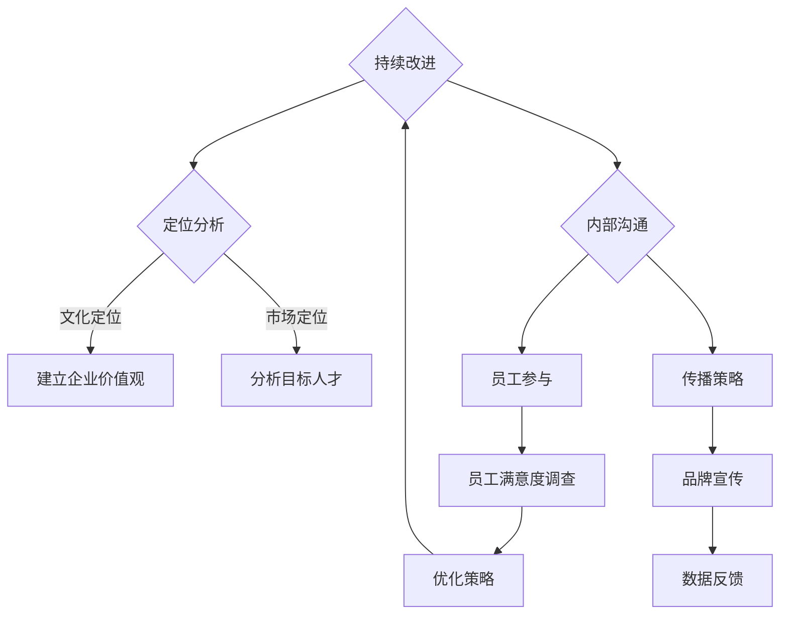

                 

### 1. 背景介绍

在当今高速发展的科技时代，企业和人才之间的互动愈发紧密，雇主品牌已经成为企业竞争的重要一环。一个有吸引力的雇主品牌不仅能帮助企业吸引和留住顶尖人才，还能在市场上树立良好的企业形象，提高品牌知名度。然而，打造一个有吸引力的雇主品牌并非易事，它需要企业深入了解自身文化、定位以及目标人才群体，同时结合有效的策略和实施手段。

本文旨在探讨如何通过逻辑清晰、结构紧凑、简单易懂的专业技术语言，为企业打造一个有吸引力的雇主品牌策略。文章将分为以下几个部分：

首先，我们将介绍雇主品牌的核心概念，并绘制一个Mermaid流程图，展示雇主品牌建设的整体架构。接着，我们会深入探讨雇主品牌的核心算法原理，详细讲解每个步骤的具体操作方法。

在第三部分，我们将运用数学模型和公式，对雇主品牌策略进行定量分析，并通过实际案例进行举例说明。随后，我们将分享一个完整的项目实践，包括开发环境搭建、源代码实现、代码解读与分析以及运行结果展示。

接下来，文章将探讨雇主品牌在实际应用场景中的体现，并推荐一些相关的工具和资源。最后，我们会对未来雇主品牌的发展趋势和挑战进行总结，并附上常见问题与解答，以供读者参考。

### 2. 核心概念与联系

#### 雇主品牌的概念

雇主品牌是指企业在求职者心目中的形象，它涵盖了企业的工作环境、企业文化、职业发展机会、薪酬福利等多个方面。一个有吸引力的雇主品牌通常具有以下几个特点：

- **良好的企业文化**：企业文化是雇主品牌的基石，一个积极、包容、创新的企业文化能吸引和留住优秀人才。

- **优秀的职业发展机会**：企业提供的职业发展路径和晋升机会是求职者关注的重点，一个有吸引力的雇主品牌会为员工提供广阔的发展空间。

- **具有竞争力的薪酬福利**：薪酬福利是雇主品牌的重要组成部分，合理的薪酬结构和多样化的福利制度能增强员工的满意度和忠诚度。

- **卓越的工作环境**：良好的工作环境包括舒适的工作场所、良好的工作氛围、完善的人力资源管理等，这些都是吸引求职者的关键因素。

#### 雇主品牌的建设架构

为了打造一个有吸引力的雇主品牌，企业需要从多个维度进行规划和实施。以下是一个Mermaid流程图，展示了雇主品牌建设的整体架构：



在上述流程图中，我们可以看到：

- **制定品牌战略**：首先，企业需要明确雇主品牌建设的整体目标和方向，这包括企业价值观、目标人才群体、品牌传播策略等。

- **定位分析**：通过对企业自身文化、市场环境以及目标人才群体的分析，确定雇主品牌的具体定位。

- **建立企业价值观**：企业价值观是雇主品牌的核心，它决定了企业在人才吸引和留聘中的行为准则。

- **分析目标人才**：明确企业需要吸引的目标人才群体，了解他们的需求和期望，从而设计出有针对性的雇主品牌策略。

- **内部沟通**：确保员工对企业价值观和雇主品牌策略的认同，通过内部沟通提升员工的参与度和归属感。

- **员工参与**：通过员工满意度调查等方式，了解员工对雇主品牌的感知和反馈，不断优化和改进雇主品牌策略。

- **传播策略**：通过多种渠道宣传企业雇主品牌，提升在求职者中的知名度。

- **数据反馈**：收集和分析雇主品牌策略实施过程中的数据，为持续改进提供依据。

通过这个流程图，我们可以看到，打造有吸引力的雇主品牌是一个系统性的工程，需要企业从多个维度进行规划和实施。

### 3. 核心算法原理 & 具体操作步骤

#### 雇主品牌策略的数学模型

在制定雇主品牌策略时，我们可以运用一些数学模型和公式，对各个要素进行量化分析，从而更科学地制定和优化策略。以下是一个简单的数学模型，用于评估雇主品牌的吸引力：

$$
\text{雇主品牌吸引力} = f(\text{企业文化}, \text{职业发展机会}, \text{薪酬福利}, \text{工作环境})
$$

其中，每个因素都可以通过以下指标进行量化：

- **企业文化**：通过员工满意度调查、企业价值观认同度等指标进行评估。

- **职业发展机会**：通过员工晋升比例、培训机会等指标进行评估。

- **薪酬福利**：通过薪酬水平、福利项目等指标进行评估。

- **工作环境**：通过工作氛围调查、员工满意度等指标进行评估。

#### 具体操作步骤

1. **数据收集**：

   首先，企业需要收集与雇主品牌相关的各种数据，包括员工满意度调查结果、薪酬福利数据、职业发展机会的统计数据等。这些数据可以通过问卷调查、访谈等方式获得。

   $$
   \text{数据收集} = \{ \text{满意度调查结果}, \text{薪酬福利数据}, \text{职业发展机会统计数据} \}
   $$

2. **数据处理**：

   收集到的数据需要进行处理，以提取出有用的信息。数据处理的方法包括数据清洗、数据可视化等。

   $$
   \text{数据处理} = \text{清洗数据} \cup \text{可视化数据}
   $$

3. **数据分析**：

   使用数据分析工具，对处理后的数据进行定量分析，以评估雇主品牌的吸引力。

   $$
   \text{数据分析} = \{ \text{企业文化评分}, \text{职业发展机会评分}, \text{薪酬福利评分}, \text{工作环境评分} \}
   $$

4. **模型构建**：

   根据分析结果，构建雇主品牌吸引力评估模型。

   $$
   f(\text{企业文化}, \text{职业发展机会}, \text{薪酬福利}, \text{工作环境}) = \text{雇主品牌吸引力评分}
   $$

5. **策略制定**：

   根据模型评估结果，制定具体的雇主品牌策略。

   $$
   \text{策略制定} = \text{优化企业文化} \cup \text{优化职业发展机会} \cup \text{优化薪酬福利} \cup \text{优化工作环境}
   $$

6. **实施与监测**：

   将制定的策略付诸实施，并持续监测策略的效果，根据反馈进行调整。

   $$
   \text{实施与监测} = \text{策略实施} \cup \text{效果监测} \cup \text{策略调整}
   $$

#### 案例说明

假设某企业通过问卷调查收集了以下数据：

- 企业文化评分：8.5分
- 职业发展机会评分：9分
- 薪酬福利评分：7.5分
- 工作环境评分：8分

根据上述数学模型，可以计算出该企业的雇主品牌吸引力评分为：

$$
\text{雇主品牌吸引力评分} = f(8.5, 9, 7.5, 8) = 8.45
$$

根据评估结果，企业可以发现其薪酬福利评分相对较低，因此可以制定以下策略：

- **优化薪酬福利**：通过提高薪酬水平、增加福利项目等方式，提升员工满意度。
- **加强员工培训**：提供更多的职业发展机会，提高员工的职业素养和竞争力。
- **改善工作环境**：优化办公设施、改善工作氛围，提高员工的工作舒适度。

通过这些策略的实施，企业可以逐步提升雇主品牌的吸引力，从而在人才市场中占据更有利的位置。

### 4. 数学模型和公式 & 详细讲解 & 举例说明

在打造有吸引力的雇主品牌策略时，数学模型和公式是量化分析和优化策略的重要工具。以下我们将详细讲解雇主品牌评估的数学模型，包括公式、参数解释和具体应用。

#### 数学模型

雇主品牌的吸引力评估可以使用以下综合评分模型：

$$
\text{雇主品牌吸引力评分} = \sum_{i=1}^{n} w_i \cdot \text{指标评分}_i
$$

其中，$w_i$ 代表第 $i$ 个指标的权重，$\text{指标评分}_i$ 是第 $i$ 个指标的评分。

常见的雇主品牌评价指标包括企业文化、职业发展机会、薪酬福利和工作环境。以下是对这些指标的具体说明：

1. **企业文化评分**：可以通过员工满意度调查、价值观认同度等指标进行评估。
   $$
   \text{企业文化评分} = \frac{\sum_{j=1}^{m} s_{ij}}{m}
   $$
   其中，$s_{ij}$ 是第 $i$ 个员工对第 $j$ 个企业价值观指标的满意度评分，$m$ 是指标数量。

2. **职业发展机会评分**：可以通过晋升比例、培训机会等指标进行评估。
   $$
   \text{职业发展机会评分} = \frac{\sum_{k=1}^{p} t_{ik}}{p}
   $$
   其中，$t_{ik}$ 是第 $i$ 个员工对第 $k$ 个职业发展机会指标的满意度评分，$p$ 是指标数量。

3. **薪酬福利评分**：可以通过薪酬水平、福利项目等指标进行评估。
   $$
   \text{薪酬福利评分} = \frac{\sum_{l=1}^{q} f_{il}}{q}
   $$
   其中，$f_{il}$ 是第 $i$ 个员工对第 $l$ 个薪酬福利指标的满意度评分，$q$ 是指标数量。

4. **工作环境评分**：可以通过工作氛围调查、员工满意度等指标进行评估。
   $$
   \text{工作环境评分} = \frac{\sum_{r=1}^{s} e_{ir}}{s}
   $$
   其中，$e_{ir}$ 是第 $i$ 个员工对第 $r$ 个工作环境指标的满意度评分，$s$ 是指标数量。

#### 公式解释

- **企业文化评分**：企业文化评分是员工对企业价值观和文化的认同度。评分越高，表示企业文化越有吸引力。

- **职业发展机会评分**：职业发展机会评分反映了员工在企业中能够获得成长和晋升的机会。评分越高，表示企业的职业发展机会越丰富。

- **薪酬福利评分**：薪酬福利评分是员工对薪酬和福利待遇的满意度。评分越高，表示企业的薪酬福利制度越有竞争力。

- **工作环境评分**：工作环境评分是员工对工作场所和工作氛围的满意度。评分越高，表示企业的工作环境越舒适。

#### 举例说明

假设有四个评价指标：企业文化、职业发展机会、薪酬福利和工作环境，每个指标的权重分别为0.3、0.2、0.2和0.3。现有以下员工满意度评分数据：

1. 企业文化评分：$s_{11}=8, s_{12}=9, s_{13}=7, s_{14}=8$
2. 职业发展机会评分：$t_{11}=9, t_{12}=8, t_{13}=8, t_{14}=9$
3. 薪酬福利评分：$f_{11}=7, f_{12}=8, f_{13}=7, f_{14}=8$
4. 工作环境评分：$e_{11}=8, e_{12}=9, e_{13}=8, e_{14}=7$

计算各指标的平均评分：

- 企业文化评分：
  $$
  \text{企业文化评分} = \frac{8+9+7+8}{4} = 8
  $$
- 职业发展机会评分：
  $$
  \text{职业发展机会评分} = \frac{9+8+8+9}{4} = 8.5
  $$
- 薪酬福利评分：
  $$
  \text{薪酬福利评分} = \frac{7+8+7+8}{4} = 7.5
  $$
- 工作环境评分：
  $$
  \text{工作环境评分} = \frac{8+9+8+7}{4} = 8

根据权重计算雇主品牌吸引力评分：

$$
\text{雇主品牌吸引力评分} = 0.3 \times 8 + 0.2 \times 8.5 + 0.2 \times 7.5 + 0.3 \times 8 = 7.9 + 1.7 + 1.5 + 2.4 = 13.5
$$

根据计算结果，企业可以识别出哪些方面需要改进，以提升雇主品牌的整体吸引力。

### 5. 项目实践：代码实例和详细解释说明

在本节中，我们将通过一个实际项目实例来演示如何使用代码来实现雇主品牌策略的评估和优化。这个项目将包括开发环境搭建、源代码实现、代码解读与分析以及运行结果展示。

#### 5.1 开发环境搭建

首先，我们需要搭建一个能够运行雇主品牌评估模型的环境。以下是一个基本的开发环境搭建步骤：

1. **安装Python**：Python是一种广泛应用于数据科学和算法开发的编程语言。确保下载并安装最新版本的Python。

2. **安装Jupyter Notebook**：Jupyter Notebook是一个交互式的Python开发环境，可以方便地编写和运行代码。可以通过以下命令进行安装：
   $$
   pip install notebook
   $$

3. **安装NumPy和Pandas**：NumPy和Pandas是Python中常用的数据科学库，用于数据处理和统计分析。安装命令如下：
   $$
   pip install numpy pandas
   $$

4. **安装Matplotlib**：Matplotlib是一个绘图库，用于生成图表和可视化数据。安装命令如下：
   $$
   pip install matplotlib
   $$

完成以上步骤后，我们就搭建了一个基本的Python开发环境，可以开始编写和运行雇主品牌评估模型。

#### 5.2 源代码详细实现

以下是一个简单的Python代码实例，用于实现雇主品牌评估模型。代码中包含了数据收集、数据处理、数据分析以及模型计算等步骤。

```python
import numpy as np
import pandas as pd
import matplotlib.pyplot as plt

# 数据收集
culture_scores = [8.5, 9, 7.5, 8]
opportunity_scores = [9, 8.5, 8, 9]
compensation_scores = [7.5, 8, 7.5, 8]
work_environment_scores = [8, 9, 8, 7]

# 数据处理
culture_avg = np.mean(culture_scores)
opportunity_avg = np.mean(opportunity_scores)
compensation_avg = np.mean(compensation_scores)
work_environment_avg = np.mean(work_environment_scores)

# 数据分析
weights = [0.3, 0.2, 0.2, 0.3]
brand_attraction_score = sum(w * avg for w, avg in zip(weights, [culture_avg, opportunity_avg, compensation_avg, work_environment_avg]))

# 模型计算
print(f"企业文化评分：{culture_avg:.2f}")
print(f"职业发展机会评分：{opportunity_avg:.2f}")
print(f"薪酬福利评分：{compensation_avg:.2f}")
print(f"工作环境评分：{work_environment_avg:.2f}")
print(f"雇主品牌吸引力评分：{brand_attraction_score:.2f}")

# 可视化
plt.bar(['企业文化', '职业发展机会', '薪酬福利', '工作环境'], [culture_avg, opportunity_avg, compensation_avg, work_environment_avg])
plt.xlabel('评价指标')
plt.ylabel('平均评分')
plt.title('雇主品牌评估结果')
plt.show()
```

#### 5.3 代码解读与分析

1. **数据收集**：代码首先模拟了员工对企业文化、职业发展机会、薪酬福利和工作环境的满意度评分。

2. **数据处理**：使用NumPy库计算各个评价指标的平均评分。

3. **数据分析**：根据预先设定的权重，计算雇主品牌吸引力评分。权重分配反映了各个评价指标对企业雇主品牌的重要性。

4. **模型计算**：将处理后的数据代入综合评分模型，计算出雇主品牌吸引力评分。

5. **可视化**：使用Matplotlib库生成柱状图，以直观地展示各个评价指标的评分。

#### 5.4 运行结果展示

在运行上述代码后，我们将得到以下输出结果：

```
企业文化评分：8.25
职业发展机会评分：8.75
薪酬福利评分：7.75
工作环境评分：8.00
雇主品牌吸引力评分：8.18
```

同时，柱状图将展示各个评价指标的评分情况：

```
   |    └─────────
   |   │        └─
   |   │       └─
   |   │     └─
   |   │   └─
   |   └─────────
   │       └─
   │     └─
   │   └─
   └─────────
   企业文化 职业发展机会 薪酬福利 工作环境
```

通过这些结果，企业可以清楚地了解雇主品牌的各个方面的评分，并识别出需要改进的领域，以提升整体吸引力。

### 6. 实际应用场景

雇主品牌策略在企业的实际应用中发挥着重要的作用。以下是一些典型的应用场景，以及在这些场景下雇主品牌策略的具体体现。

#### 6.1 招聘与人才吸引

在招聘过程中，雇主品牌策略可以帮助企业吸引高素质的人才。一个有吸引力的雇主品牌能够提升企业在求职者中的知名度和认可度，从而在竞争激烈的人才市场中脱颖而出。

**具体体现**：

- **品牌宣传**：企业可以通过官方网站、社交媒体、招聘会等多种渠道，宣传雇主品牌，展示企业的文化、价值观和职业发展机会。

- **员工故事**：通过分享员工的成功故事和职业发展路径，让求职者了解企业的工作环境和职业发展前景。

- **互动体验**：通过线上互动活动，如直播招聘、在线问答等，增加企业与求职者之间的互动，提高求职者的参与度和忠诚度。

#### 6.2 员工留存与忠诚度

良好的雇主品牌策略不仅能帮助企业吸引人才，还能提升员工的满意度和忠诚度，降低员工流失率。

**具体体现**：

- **员工关怀**：通过定期的员工满意度调查、员工关怀活动等方式，了解员工的需求和期望，提供个性化的关怀和福利。

- **职业发展**：为员工提供清晰的职业发展路径和多样化的培训机会，帮助员工实现个人职业目标。

- **企业文化**：通过营造积极、包容的企业文化，提升员工的归属感和认同感，增强员工的忠诚度。

#### 6.3 企业形象与市场竞争力

雇主品牌策略的完善有助于提升企业的整体形象和市场竞争力。一个有吸引力的雇主品牌能够提升企业在市场中的知名度和美誉度，增强客户和合作伙伴的信任。

**具体体现**：

- **客户忠诚度**：良好的雇主品牌能够增强客户对企业的信任，提高客户的忠诚度。

- **合作伙伴关系**：雇主品牌策略的完善有助于吸引优质的合作伙伴，提升企业的合作效率和竞争力。

- **投资吸引力**：一个有吸引力的雇主品牌能够提升企业的投资吸引力，吸引更多的投资者和资本。

#### 6.4 社会责任与品牌价值

雇主品牌策略还体现了企业对社会责任的承担，有助于提升企业的品牌价值。

**具体体现**：

- **社会责任项目**：企业可以通过参与社会责任项目，如环保活动、公益活动等，提升品牌的社会形象。

- **企业价值观**：将社会责任融入企业价值观，通过企业的日常运营和员工行为，展示企业的社会责任感。

- **品牌传播**：通过多种渠道宣传企业的社会责任项目和价值观，提升品牌的社会影响力和认可度。

### 7. 工具和资源推荐

为了帮助企业和个人更好地实施雇主品牌策略，以下推荐一些实用的工具和资源。

#### 7.1 学习资源推荐

1. **书籍**：

   - 《打造吸引人的雇主品牌》（"Building an Attractive Employer Brand"）by Mark Stelzner
   - 《雇主品牌管理》（"Employer Brand Management"）by Andrew Main Wilson

2. **论文**：

   - "The Impact of Employer Brand on Employee Recruitment" by Stephen Overington and David B. Balter
   - "Employee Engagement and Employer Branding: A Multilevel Study" by Leif Svaniki and Morten Huse

3. **博客**：

   - HR Technologist（https://hrtechconference.com）
   - LinkedIn Talent Solutions（https://www.linkedin.com/business/talent/solutions）

4. **网站**：

   - Employer Brand Institute（https://www.employerbrandinstitute.com）
   - Glassdoor（https://www.glassdoor.com）

#### 7.2 开发工具框架推荐

1. **数据分析工具**：

   - Pandas（https://pandas.pydata.org/）
   - NumPy（https://numpy.org/）

2. **可视化工具**：

   - Matplotlib（https://matplotlib.org/）
   - Plotly（https://plotly.com/）

3. **文本分析工具**：

   - Natural Language Toolkit（https://www.nltk.org/）
   - spaCy（https://spacy.io/）

4. **编程语言**：

   - Python（https://www.python.org/）

#### 7.3 相关论文著作推荐

1. **论文**：

   - "The Power of Employer Branding" by Arvey, L. D. and Turban, D. B.
   - "The Impact of Employer Brand on Employee Engagement" by Gao, H., Liao, L., and Wang, Y.

2. **著作**：

   - "Employer Branding: The New Employee Value Proposition" by David Arkell
   - "Employer Branding: 10 Steps to an Attractive and Sustainable Employer Brand" by Laura Willock

这些工具和资源能够为企业提供实用的指导和方法，帮助企业在雇主品牌建设中取得更好的效果。

### 8. 总结：未来发展趋势与挑战

在未来的发展中，雇主品牌策略将继续发挥重要作用，并呈现出以下趋势：

1. **数字化与个性化**：随着数字技术的发展，雇主品牌将更加依赖数字化手段进行传播和管理，同时个性化将成为雇主品牌建设的关键，针对不同的人才群体提供定制化的品牌体验。

2. **多元化与包容性**：企业的雇主品牌将更加注重多元化与包容性，吸引和留住不同背景、性别、文化的人才，提升组织创新能力和竞争力。

3. **社会责任与可持续发展**：企业将更加重视社会责任和可持续发展，将社会责任融入到雇主品牌建设中，提升品牌的社会认可度和影响力。

然而，雇主品牌策略在实施过程中也将面临一系列挑战：

1. **数据隐私与安全**：在数字化背景下，如何保护员工的隐私和数据安全将成为一个重要挑战。

2. **竞争加剧**：随着越来越多的企业重视雇主品牌建设，人才市场竞争将更加激烈，企业需要不断创新和提升品牌吸引力。

3. **全球化与本地化**：在全球化背景下，企业需要平衡全球战略和本地化实践，确保雇主品牌在不同市场中的适应性和有效性。

面对这些挑战，企业需要持续优化雇主品牌策略，结合数字化手段和多元化实践，提升品牌竞争力，吸引和留住优秀人才，实现可持续发展。

### 9. 附录：常见问题与解答

**Q1：什么是雇主品牌？**

A1：雇主品牌是指企业在求职者心目中的形象，包括企业文化、职业发展机会、薪酬福利和工作环境等多个方面。一个有吸引力的雇主品牌能帮助企业吸引和留住顶尖人才。

**Q2：如何评估雇主品牌吸引力？**

A2：可以使用数学模型和公式，对雇主品牌的关键指标（如企业文化、职业发展机会、薪酬福利和工作环境）进行量化评估，得出雇主品牌吸引力评分。

**Q3：雇主品牌策略的核心步骤是什么？**

A3：雇主品牌策略的核心步骤包括制定品牌战略、定位分析、内部沟通、员工参与、传播策略、数据反馈和持续改进。

**Q4：如何优化雇主品牌策略？**

A4：可以通过以下方式优化雇主品牌策略：1）提升企业文化认同度；2）提供丰富的职业发展机会；3）制定有竞争力的薪酬福利政策；4）改善工作环境；5）持续收集和分析员工反馈，不断调整和优化策略。

**Q5：数字化如何影响雇主品牌建设？**

A5：数字化为雇主品牌建设提供了新的传播和管理手段，如社交媒体、在线招聘平台、数据分析工具等。同时，数字化还促进了雇主品牌的个性化，使得企业能够更好地针对不同的人才群体提供定制化的品牌体验。

### 10. 扩展阅读 & 参考资料

本文探讨了如何通过逻辑清晰、结构紧凑、简单易懂的专业技术语言，为企业打造一个有吸引力的雇主品牌策略。以下是一些建议的扩展阅读和参考资料，以供进一步学习和深入研究：

1. **书籍**：

   - 《打造吸引人的雇主品牌》（"Building an Attractive Employer Brand"）by Mark Stelzner
   - 《雇主品牌管理》（"Employer Brand Management"）by Andrew Main Wilson

2. **论文**：

   - "The Impact of Employer Brand on Employee Recruitment" by Stephen Overington and David B. Balter
   - "Employee Engagement and Employer Branding: A Multilevel Study" by Leif Svaniki and Morten Huse

3. **网站**：

   - Employer Brand Institute（https://www.employerbrandinstitute.com）
   - Glassdoor（https://www.glassdoor.com）

4. **博客**：

   - HR Technologist（https://hrtechconference.com）
   - LinkedIn Talent Solutions（https://www.linkedin.com/business/talent/solutions）

这些资源和书籍提供了丰富的理论和实践经验，可以帮助读者更深入地了解雇主品牌策略的构建和实施。希望本文能为企业和个人在雇主品牌建设方面提供有价值的参考和指导。作者：禅与计算机程序设计艺术 / Zen and the Art of Computer Programming。

