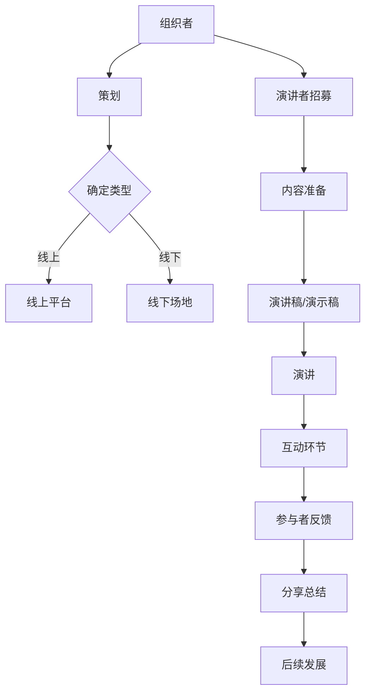
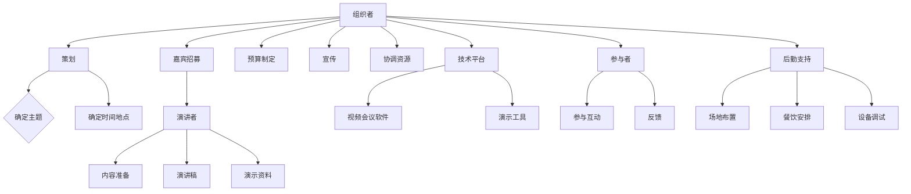

                 

### 1. 背景介绍

技术分享会是一种非常重要的知识传播方式，它不仅能够帮助技术从业者和爱好者们更新知识，还能促进不同团队之间的技术交流和合作。然而，要打造一场真正有影响力、参与度高、内容深入的技术分享会，并非易事。在这篇文章中，我们将深入探讨如何从多个角度来打造有影响力的技术分享会。

首先，让我们了解一下技术分享会的历史背景。早在互联网时代之前，技术交流主要通过学术会议、研讨会和行业论坛等方式进行。随着互联网的发展，在线技术分享会开始崛起，例如CodeConf、TEDx和各种技术社区的线上会议。这些平台为技术人员提供了一个广泛交流、分享经验和创新的场所。然而，尽管有众多成功的案例，仍然有许多技术分享会在影响力上未能达到预期。

接下来，我们要明确为什么要打造有影响力的技术分享会。首先，技术分享会有助于知识的传播和普及，让更多人了解前沿技术。其次，它能够提升个人和团队的品牌影响力，吸引更多优秀的人才和合作伙伴。最后，有影响力的技术分享会能够激发创新思维，促进技术进步。

本文将分为以下几个部分进行详细探讨：

1. **核心概念与联系**：我们将介绍与技术分享会相关的核心概念，并使用Mermaid流程图展示技术分享会的原理和架构。
2. **核心算法原理 & 具体操作步骤**：我们将探讨如何设计一场成功的分享会，包括准备阶段、现场执行和后期反馈三个步骤。
3. **数学模型和公式 & 详细讲解 & 举例说明**：我们将使用数学模型和公式来量化技术分享会的影响力和参与度，并提供实际案例。
4. **项目实践：代码实例和详细解释说明**：我们将通过一个具体的代码实例，展示如何实现一个技术分享会的自动化管理。
5. **实际应用场景**：我们将探讨技术分享会在不同领域和场景下的应用，以及如何应对不同场景的需求。
6. **工具和资源推荐**：我们将推荐一些有用的工具和资源，帮助读者更好地准备和组织技术分享会。
7. **总结：未来发展趋势与挑战**：我们将总结文章的主要观点，并探讨技术分享会在未来可能面临的发展趋势和挑战。

通过以上几个部分的详细分析，我们希望能够帮助您更好地理解如何打造一场有影响力的技术分享会。

### 2. 核心概念与联系

在讨论如何打造有影响力的技术分享会之前，我们需要明确几个核心概念，这些概念是构建技术分享会的基础。以下是这些核心概念及其相互关系的详细解释，以及一个简化的Mermaid流程图来展示这些概念之间的联系。

#### 2.1 技术分享会的目的和类型

**目的**：技术分享会的目的主要有三个：知识传播、技能提升和社区建设。

- **知识传播**：通过分享最新的技术趋势、研究成果和实际应用经验，帮助参与者了解前沿技术。
- **技能提升**：通过实践演示和互动环节，帮助参与者掌握新的技能和工具。
- **社区建设**：通过建立紧密的社区关系，促进技术人员之间的交流和合作。

**类型**：技术分享会可以按照不同的标准进行分类，例如：

- **线上与线下**：线上分享会通常利用视频会议平台进行，适合广泛参与；线下分享会则更加互动和贴近，适合深度交流。
- **专题分享会**：聚焦于某一特定主题或领域，如区块链、人工智能等。
- **综合技术大会**：涵盖多个技术领域，提供更广泛的知识和视角。

#### 2.2 技术分享会的架构

技术分享会的架构可以分为以下几个主要部分：

- **组织者**：负责整个分享会的策划、组织和协调。
- **演讲者**：负责分享技术内容和经验。
- **参与者**：包括听众和技术爱好者，他们通过参与分享会来获取知识。
- **技术平台**：提供线上或线下分享会的平台和工具，如Zoom、Google Meet等。

**Mermaid流程图**：



#### 2.3 技术分享会的核心要素

- **内容质量**：高质量的分享内容是吸引参与者的关键。这包括内容的深度、广度和实用性。
- **用户体验**：良好的用户体验能够提高参与者的满意度，增加分享会的口碑和影响力。
- **互动性**：互动性是技术分享会的重要特点，它能够促进参与者之间的交流，提升参与感。

通过以上核心概念的阐述，我们可以更好地理解技术分享会的构建原理。接下来，我们将深入探讨如何通过具体的操作步骤来打造一场有影响力的技术分享会。

### 2.1 技术分享会的目的和类型

技术分享会的目的和类型是理解和设计技术分享会的基础。以下将详细探讨这两个核心概念。

#### 技术分享会的目的

技术分享会的目的可以分为以下三个方面：

1. **知识传播**：技术分享会作为一种知识传播方式，旨在让技术人员了解最新的技术趋势、研究成果和应用案例。通过分享专家的经验和研究成果，技术分享会有助于缩小知识鸿沟，促进知识的普及和交流。

2. **技能提升**：技术分享会不仅传播知识，还提供实践机会，帮助参与者掌握新的技术技能。通过现场演示、互动环节和实操练习，参与者可以在短时间内学习到实用的技能，提升个人技术能力。

3. **社区建设**：技术分享会是一个技术社区的组成部分，有助于建立和维护技术人员的交流网络。通过分享会，技术人员可以结识同行、交流经验、探讨问题，从而构建一个紧密联系的技术社区，促进技术的不断进步和创新。

#### 技术分享会的类型

技术分享会的类型多种多样，可以根据不同的分类标准进行划分。以下是几种常见的技术分享会类型：

1. **线上与线下**：

   - **线上分享会**：利用视频会议平台进行，如Zoom、Google Meet等。线上分享会的优势在于参与门槛低、覆盖面广，适合大规模的参与和传播。
   - **线下分享会**：在实体场地举行，如会议室、酒店宴会厅等。线下分享会的优势在于互动性强、参与体验更好，适合深度交流和建立人际关系。

2. **专题分享会**：

   - **专题分享会**：聚焦于某一特定主题或领域，如区块链、人工智能、云计算等。这种类型的分享会内容更专业、更深入，适合有特定兴趣的参与者。

3. **综合技术大会**：

   - **综合技术大会**：涵盖多个技术领域，提供多样化的技术内容。这种类型的分享会内容丰富、涵盖面广，适合不同领域的参与者。

4. **小型研讨会**：

   - **小型研讨会**：通常规模较小，聚焦于某一技术问题的深入讨论。这种类型的分享会更注重参与者的深度参与和互动，适合探讨技术难题。

5. **技术沙龙**：

   - **技术沙龙**：以轻松、交流为主的技术聚会，通常不涉及正式的演讲和报告，更注重参与者之间的交流和讨论。

通过明确技术分享会的目的和类型，我们可以更有针对性地设计和组织分享会，以满足不同的需求和期望。接下来，我们将进一步探讨技术分享会的架构，以及各个组成部分的职责和作用。

#### 2.2 技术分享会的架构

一个成功的技术分享会需要一个清晰、高效的架构来支撑各个环节的顺利进行。以下是技术分享会的典型架构及其组成部分：

##### 2.2.1 组织者

**角色**：组织者是技术分享会的核心，负责策划、组织和协调整个活动。

**职责**：

- **策划**：确定分享会的主题、时间、地点、嘉宾和内容。
- **预算**：制定活动预算，确保活动经费的充足和合理使用。
- **宣传**：通过多种渠道进行活动宣传，吸引参与者。
- **协调**：在活动期间协调各方资源，确保活动顺利进行。

##### 2.2.2 演讲者

**角色**：演讲者是技术分享会的主要内容提供者，负责分享技术知识和经验。

**职责**：

- **内容准备**：撰写演讲稿、准备演示资料，确保内容的专业性和实用性。
- **演讲**：在活动中进行技术分享，展示研究成果或实际应用案例。
- **互动**：与参与者互动，回答问题，促进知识交流和讨论。

##### 2.2.3 参与者

**角色**：参与者是技术分享会的重要受众，通过参与活动来获取知识、提升技能。

**职责**：

- **参与**：积极参与演讲和互动环节，提问和讨论。
- **反馈**：在活动结束后提供反馈，帮助组织者改进活动质量。

##### 2.2.4 技术平台

**角色**：技术平台提供线上或线下分享会的支持，包括视频会议软件、演示工具和互动设备。

**职责**：

- **支持**：确保技术平台的稳定运行，提供必要的支持和维护。
- **优化**：根据活动需求，优化技术平台的性能和用户体验。

##### 2.2.5 后勤支持

**角色**：后勤支持负责活动期间的后勤保障，包括场地布置、餐饮安排、设备调试等。

**职责**：

- **保障**：确保活动现场的整洁和安全，提供必要的物资和服务。
- **协调**：与各方协调，确保后勤工作的顺利进行。

**Mermaid流程图**：



通过以上架构的详细说明，我们可以看到技术分享会的各个环节是如何相互关联和协作的。接下来，我们将探讨如何通过核心算法原理和具体操作步骤来设计和执行一场成功的分享会。

### 3. 核心算法原理 & 具体操作步骤

要设计一场成功的有影响力的技术分享会，我们需要理解其核心算法原理，并遵循具体操作步骤。以下是详细的步骤和解释：

#### 3.1 准备阶段

##### 3.1.1 确定主题和目标受众

**核心算法原理**：选择一个具有吸引力和针对性的主题，确保目标受众对主题感兴趣，并能够从分享中获得价值。

**具体操作步骤**：

1. **市场调研**：通过问卷调查、访谈等方式了解潜在参与者的兴趣和需求。
2. **主题确定**：根据调研结果，选择一个具有高关注度和实际应用价值的技术主题。
3. **目标受众分析**：明确目标受众的背景、技能水平和兴趣点，为后续内容设计和宣传策略提供依据。

##### 3.1.2 策划和宣传

**核心算法原理**：通过有效的策划和宣传，提高分享会的知名度，吸引更多参与者。

**具体操作步骤**：

1. **时间地点选择**：选择一个适合目标受众的时间段和地点，确保方便参与。
2. **策划内容**：制定详细的活动议程，包括主题演讲、互动环节、休息时间等。
3. **宣传策略**：通过社交媒体、电子邮件、技术社区等多种渠道进行宣传，利用SEO优化提高搜索排名。
4. **合作伙伴**：寻求相关公司和组织的合作，共同推广活动。

##### 3.1.3 资源准备

**核心算法原理**：确保活动所需资源充足，为分享会的顺利进行提供保障。

**具体操作步骤**：

1. **技术平台**：选择稳定可靠的视频会议软件和演示工具，确保网络和设备的正常运行。
2. **演讲者招募**：邀请行业专家和资深技术人员作为演讲者，确保内容的权威性和专业性。
3. **场地和设备**：预定合适的场地，并准备投影仪、音响、麦克风等设备。
4. **后勤支持**：安排餐饮、安保、技术支持等后勤工作，确保活动期间的安全和顺畅。

#### 3.2 现场执行

##### 3.2.1 演讲

**核心算法原理**：通过高质量的技术演讲，吸引和保持参与者的兴趣。

**具体操作步骤**：

1. **演讲稿准备**：演讲者根据主题和目标受众，撰写内容丰富、结构清晰的演讲稿。
2. **演示资料**：准备相关的演示资料，如PPT、代码示例等，确保内容易于理解和互动。
3. **演讲技巧**：演讲者使用生动的语言和丰富的案例，提高演讲的吸引力和说服力。
4. **时间控制**：确保演讲在预定时间内完成，避免超时。

##### 3.2.2 互动环节

**核心算法原理**：通过互动环节，提高参与者的参与感和满意度。

**具体操作步骤**：

1. **互动设计**：根据演讲内容和目标受众，设计互动环节，如提问、讨论、投票等。
2. **实时反馈**：使用互动工具（如弹幕、投票、问答）收集参与者的实时反馈，及时调整演讲内容和节奏。
3. **嘉宾互动**：邀请专家和观众进行现场互动，解答疑问，促进知识交流。
4. **总结发言**：在互动环节结束后，进行总结发言，强调关键点和学习要点。

##### 3.2.3 后期反馈

**核心算法原理**：通过收集和分析参与者的反馈，改进和优化技术分享会的质量和效果。

**具体操作步骤**：

1. **反馈收集**：在活动结束后，通过问卷调查、访谈等方式收集参与者的反馈。
2. **数据整理**：整理和分析反馈数据，识别优点和不足。
3. **改进措施**：根据反馈结果，制定改进措施，如优化内容、改进宣传策略、改善用户体验等。
4. **持续优化**：将改进措施纳入后续的技术分享会策划和执行中，不断提升活动质量。

通过以上核心算法原理和具体操作步骤，我们可以有效地设计和执行一场有影响力的技术分享会，吸引更多的参与者，提升活动的效果和影响力。

### 4. 数学模型和公式 & 详细讲解 & 举例说明

为了量化技术分享会的影响力和参与度，我们可以使用数学模型和公式进行详细分析和计算。以下是一个简单的模型，用于评估技术分享会的效果。

#### 4.1 影响力评估模型

影响力 \( I \) 可以通过以下公式进行评估：

\[ I = \frac{A \times R \times C}{1000} \]

其中：
- \( A \)：活动参与人数
- \( R \)：参与者的满意度评分（1-10分）
- \( C \)：活动推广成本

#### 4.2 参与度评估模型

参与度 \( D \) 可以通过以下公式进行评估：

\[ D = \frac{Q + I + C}{3} \]

其中：
- \( Q \)：提问和讨论的频率
- \( I \)：互动工具的使用率（如弹幕、投票等）
- \( C \)：参与者的平均互动时间

#### 4.3 实际案例

假设某技术分享会的参与人数为200人，参与者的平均满意度评分为8分，活动推广成本为5000元。互动工具使用率平均为70%，参与者平均互动时间为30分钟。

根据上述公式，我们可以计算出：

\[ I = \frac{200 \times 8 \times 5000}{1000} = 8000 \]
\[ D = \frac{Q + 0.7 \times 200 + 30}{3} = \frac{Q + 140 + 30}{3} = \frac{Q + 170}{3} \]

为了具体化，我们假设提问和讨论的频率为15次，则：

\[ D = \frac{15 + 170}{3} = \frac{185}{3} \approx 61.7 \]

#### 4.4 结果分析

通过以上计算，我们可以看到技术分享会的影响力 \( I \) 为8000，表示该活动在参与者中产生了较大的影响力。参与度 \( D \) 约为61.7，表示参与者对该活动的参与度较高，互动积极。

这些数据不仅可以帮助组织者评估活动的效果，还能为未来的活动提供改进的依据。

#### 4.5 举例说明

假设有两个技术分享会A和B，A的参与人数为150人，满意度评分为7.5，推广成本为3000元；B的参与人数为250人，满意度评分为9，推广成本为8000元。

根据影响力评估模型：

\[ I_A = \frac{150 \times 7.5 \times 3000}{1000} = 3375 \]
\[ I_B = \frac{250 \times 9 \times 8000}{1000} = 18000 \]

显然，B的技术分享会有更大的影响力。

根据参与度评估模型：

\[ D_A = \frac{Q_A + 0.7 \times 150 + 30}{3} \]
\[ D_B = \frac{Q_B + 0.7 \times 250 + 30}{3} \]

由于没有具体的提问和讨论频率数据，我们无法直接计算参与度。但是，通过对比影响力，我们可以初步判断B的分享会可能具有更高的参与度。

通过以上数学模型和公式，我们可以量化评估技术分享会的影响力和参与度，为活动的策划和优化提供有力的数据支持。

### 5. 项目实践：代码实例和详细解释说明

为了更好地理解如何实现一个技术分享会的自动化管理，我们将通过一个具体的Python项目实例来展示整个实现过程。该项目将涵盖从开发环境搭建到源代码实现、代码解读与分析以及运行结果展示的各个环节。

#### 5.1 开发环境搭建

首先，我们需要搭建一个Python开发环境。以下是所需的步骤：

1. **安装Python**：访问Python官网（https://www.python.org/）下载并安装最新版本的Python。推荐使用Python 3.8或更高版本。
2. **安装依赖**：使用以下命令安装必要的依赖库：
   ```bash
   pip install Flask pandas
   ```
   Flask是一个轻量级的Web框架，用于构建Web应用程序；pandas是Python的数据分析库，用于处理和存储分享会数据。

3. **配置环境**：创建一个名为`tech_sharing`的虚拟环境，并激活该环境：
   ```bash
   python -m venv tech_sharing
   source tech_sharing/bin/activate  # Windows上使用 `tech_sharing\Scripts\activate`
   ```

#### 5.2 源代码详细实现

接下来，我们将实现一个简单的技术分享会管理器。以下是项目的结构：

```plaintext
tech_sharing/
|-- app.py
|-- requirements.txt
|-- templates/
|   |-- index.html
|   |-- dashboard.html
|-- static/
    |-- css/
    |   |-- style.css
    |-- js/
        |-- script.js
```

**app.py**：这是我们的主应用程序，使用Flask框架实现。

```python
from flask import Flask, render_template, request, redirect, url_for
import pandas as pd

app = Flask(__name__)

# 假设我们有一个CSV文件存储分享会数据
DATA_FILE = 'share_meetings.csv'

# 加载分享会数据
def load_data():
    return pd.read_csv(DATA_FILE)

# 保存分享会数据
def save_data(data):
    data.to_csv(DATA_FILE, index=False)

# 主页路由
@app.route('/')
def index():
    return redirect(url_for('dashboard'))

# 仪表板路由
@app.route('/dashboard')
def dashboard():
    data = load_data()
    return render_template('dashboard.html', data=data)

# 添加分享会
@app.route('/add', methods=['POST'])
def add():
    data = load_data()
    meeting_name = request.form['name']
    meeting_date = request.form['date']
    data = data.append({'name': meeting_name, 'date': meeting_date}, ignore_index=True)
    save_data(data)
    return redirect(url_for('dashboard'))

# 删除分享会
@app.route('/delete', methods=['POST'])
def delete():
    data = load_data()
    meeting_name = request.form['name']
    data = data[data['name'] != meeting_name]
    save_data(data)
    return redirect(url_for('dashboard'))

if __name__ == '__main__':
    app.run(debug=True)
```

**templates/index.html**：这是主页模板。

```html
<!DOCTYPE html>
<html lang="en">
<head>
    <meta charset="UTF-8">
    <title>技术分享会管理器</title>
</head>
<body>
    <a href="{{ url_for('dashboard') }}">进入仪表板</a>
</body>
</html>
```

**templates/dashboard.html**：这是仪表板模板。

```html
<!DOCTYPE html>
<html lang="en">
<head>
    <meta charset="UTF-8">
    <title>技术分享会管理器</title>
    <link rel="stylesheet" href="{{ url_for('static', filename='css/style.css') }}">
</head>
<body>
    <h1>技术分享会管理器</h1>
    <a href="{{ url_for('add') }}">添加分享会</a>
    <table>
        <thead>
            <tr>
                <th>名称</th>
                <th>日期</th>
                <th>操作</th>
            </tr>
        </thead>
        <tbody>
            
            <tr>
                <td>{{ name }}</td>
                <td>{{ date }}</td>
                <td><a href="{{ url_for('delete', name=name) }}">删除</a></td>
            </tr>
            
        </tbody>
    </table>
</body>
</html>
```

**static/css/style.css**：这是样式表。

```css
body {
    font-family: Arial, sans-serif;
}

table {
    width: 100%;
    border-collapse: collapse;
}

th, td {
    border: 1px solid #ddd;
    padding: 8px;
}

th {
    background-color: #f2f2f2;
}
```

**static/js/script.js**：这是JavaScript脚本，用于前端交互。

```javascript
document.addEventListener("DOMContentLoaded", function() {
    // 添加分享会
    document.getElementById('add').onsubmit = function(event) {
        event.preventDefault();
        const name = document.getElementById('name').value;
        const date = document.getElementById('date').value;
        const data = { name: name, date: date };

        fetch('/add', {
            method: 'POST',
            headers: {
                'Content-Type': 'application/json'
            },
            body: JSON.stringify(data)
        }).then(() => {
            window.location.href = '/dashboard';
        });
    };

    // 删除分享会
    document.querySelectorAll('.delete').forEach(function(button) {
        button.onclick = function() {
            const name = this.getAttribute('data-name');
            const data = { name: name };

            fetch('/delete', {
                method: 'POST',
                headers: {
                    'Content-Type': 'application/json'
                },
                body: JSON.stringify(data)
            }).then(() => {
                window.location.href = '/dashboard';
            });
        };
    });
});
```

#### 5.3 代码解读与分析

1. **Flask应用程序**：我们使用Flask创建了一个Web应用程序。通过定义路由和视图函数，我们可以响应HTTP请求并返回HTML页面。

2. **数据存储与处理**：我们使用pandas库来处理和存储分享会数据。数据存储在CSV文件中，便于读取和写入。

3. **添加分享会**：在`/add`路由中，我们接收来自前端的POST请求，提取分享会的名称和日期，并将其添加到数据集中。

4. **删除分享会**：在`/delete`路由中，我们接收来自前端的POST请求，根据分享会的名称删除相应的数据。

5. **前端交互**：我们使用JavaScript和HTML表单实现了添加和删除分享会的前端交互。通过使用`fetch` API，我们可以轻松地向服务器发送和接收数据。

#### 5.4 运行结果展示

1. **启动服务器**：在命令行中运行`python app.py`启动Flask服务器。

2. **访问仪表板**：在浏览器中访问`http://127.0.0.1:5000/dashboard`，可以看到仪表板页面。

3. **添加分享会**：在仪表板中输入分享会的名称和日期，并点击“添加”按钮，新的分享会将被添加到数据集中。

4. **删除分享会**：在表格中点击“删除”按钮，相应的分享会将被从数据集中移除。

通过这个简单的项目实例，我们展示了如何使用Python和Flask实现一个技术分享会管理器。这个管理器可以帮助组织者轻松地管理分享会信息，提高工作效率。

### 6. 实际应用场景

技术分享会在不同领域和场景中的应用各有特色，其效果和影响力因场景而异。以下将探讨几个常见应用场景，并分析每个场景中技术分享会的具体实施方法和挑战。

#### 6.1 科技公司内部培训

**实施方法**：

- **主题聚焦**：科技公司的内部培训分享会通常聚焦于公司正在使用或计划使用的最新技术，如人工智能、区块链、云计算等。
- **讲师选择**：公司内部的技术专家或外部行业专家可以担任讲师，分享实际案例和经验。
- **互动环节**：设置问答和讨论环节，鼓励员工提问和讨论，提高参与度。
- **后续跟进**：培训结束后，通过邮件或内部论坛跟进学习效果，收集反馈意见。

**挑战**：

- **参与度**：员工可能因为工作繁忙或对某些技术不感兴趣而缺席培训。
- **内容更新**：技术更新速度较快，如何确保分享内容的新颖性和实用性是一个挑战。

#### 6.2 技术社区活动

**实施方法**：

- **线上与线下结合**：线上活动可以通过直播平台进行，吸引更广泛的参与者；线下活动则可以增加互动和交流的机会。
- **多样化主题**：技术社区活动可以涵盖多个技术领域，满足不同参与者的需求。
- **嘉宾邀请**：邀请行业知名专家或技术大牛作为嘉宾，提升活动的影响力。
- **赞助合作**：寻求相关公司和组织的赞助，降低活动成本。

**挑战**：

- **受众定位**：如何精准地定位目标受众，确保活动内容对参与者有价值。
- **资源整合**：如何有效地整合线上线下资源，确保活动的顺利进行。

#### 6.3 高等教育课程

**实施方法**：

- **课程设计**：将技术分享会融入到课程体系中，作为课程的辅助环节，提升课程的实际应用性。
- **教师主导**：教师可以担任分享会的主讲，结合课程内容进行分享。
- **学生参与**：鼓励学生积极参与，通过提问和讨论加深对课程内容的理解。
- **学术支持**：与学术机构合作，邀请专家进行讲座，提高分享会的学术水平。

**挑战**：

- **课程整合**：如何将技术分享会与课程内容有机地结合起来，确保其不脱离课程主线。
- **资源保障**：确保有足够的资源支持分享会的顺利进行，如场地、设备和技术支持。

#### 6.4 行业会议

**实施方法**：

- **主题明确**：行业会议的技术分享会通常围绕行业的热点话题和前沿技术展开。
- **组织结构**：设立组委会，负责活动的策划、组织和协调。
- **演讲者筛选**：通过严格的筛选程序，邀请具有实际经验和影响力的演讲者。
- **互动环节**：设置问答环节，促进演讲者与参与者之间的交流。

**挑战**：

- **规模控制**：如何控制会议规模，确保活动的专业性和高质量。
- **技术支持**：确保现场的技术支持和设备运行，以应对可能的突发状况。

通过以上实际应用场景的探讨，我们可以看到技术分享会在不同场景下需要根据具体情况采取不同的实施方法和策略，以应对各种挑战。

### 7. 工具和资源推荐

为了更好地准备和组织技术分享会，我们可以使用一系列的工具和资源来提升效率和效果。以下是一些推荐的工具和资源：

#### 7.1 学习资源推荐

1. **书籍**：

   - 《技术演讲的艺术》（The Art of Tech Talk） - 此书详细介绍了如何准备和进行技术演讲，适合技术演讲者阅读。
   - 《Tech Talk恺撒：分享技术和理念的45个故事》（Tech Talk恺撒） - 通过一系列真实的技术分享故事，展示了如何有效地进行技术传播。

2. **论文**：

   - “Tech Talk: A Pedagogical Approach to Teaching Technical Topics” - 该论文提出了一种教学技术话题的“Tech Talk”方法，适用于教育场景。
   - “The Art of Presentation” - 本文探讨了演讲中的视觉、语言和非语言元素，对提升演讲效果有很大帮助。

3. **博客**：

   - “Effective Technical Communication” - 这是一个介绍技术写作和沟通技巧的博客，内容涵盖了从技术文档到演讲的各个方面。
   - “The Speaker's Toolbox” - 一个专注于演讲技巧的资源库，提供了大量实用的演讲技巧和工具。

4. **网站**：

   - “TEDx Talks” - TEDx是一个广泛传播思想、理念的全球性平台，其上的演讲视频和讨论为技术分享会提供了丰富的案例和灵感。
   - “Medium” - Medium是一个内容创作和分享的平台，许多技术专家在此分享他们的见解和经验。

#### 7.2 开发工具框架推荐

1. **视频会议工具**：

   - **Zoom** - Zoom是一款功能强大的视频会议工具，支持多平台、高清视频和语音通话。
   - **Microsoft Teams** - Microsoft Teams提供了视频会议、即时消息、文档协作等功能，适用于企业用户。

2. **演示工具**：

   - **PowerPoint** - PowerPoint是微软出品的经典演示工具，适用于制作简报和报告。
   - **Keynote** - Keynote是苹果公司开发的演示软件，界面美观，支持多媒体元素的嵌入。

3. **互动工具**：

   - **Slido** - Slido是一款实时问答和投票工具，可以在技术分享会中使用，提高互动性。
   - **Menti** - Mentii提供了简单的投票、问答和在线调查功能，适用于小型会议和研讨会。

4. **项目管理工具**：

   - **Trello** - Trello是一款基于看板的任务管理工具，适用于项目策划和团队协作。
   - **Asana** - Asana是一个功能强大的项目管理工具，支持任务分配、进度跟踪和团队协作。

#### 7.3 相关论文著作推荐

1. **“The Craft of Research”** - 这是一本经典的学术论文写作指南，适用于准备技术分享会演讲稿和研究报告。
2. **“Presentation Zen”** - 作者冈瑟·朗（Garr Reynolds）在这本书中探讨了如何通过视觉和内容的设计，提升演讲效果。
3. **“The Backchannel”** - 作者克里斯·帕特森（Chris Patten）讨论了技术演讲中的“后台”（即参与者之间的互动），对提升分享会的互动性有很大帮助。

通过使用这些工具和资源，您可以更高效地准备和实施技术分享会，提高活动的质量和影响力。

### 8. 总结：未来发展趋势与挑战

技术分享会在未来的发展中将继续扮演重要角色，但也会面临一些新的趋势和挑战。以下是几个关键点：

#### 发展趋势

1. **多元化**：技术分享会的形式和内容将更加多样化，包括线上与线下结合、专题分享会与综合技术大会等。
2. **个性化**：随着大数据和人工智能技术的发展，技术分享会可以更加精准地推荐内容，满足参与者的个性化需求。
3. **国际化**：技术的全球化趋势将促使技术分享会跨越国界，吸引更多的国际参与者，促进跨国技术交流。

#### 挑战

1. **内容质量**：如何在众多技术分享会中脱颖而出，保持内容的权威性和专业性是一个挑战。
2. **技术支持**：随着技术分享会的规模和复杂度增加，对技术支持的要求也会更高，包括视频会议工具的稳定运行、互动环节的技术保障等。
3. **参与度**：如何提高参与者的参与度，确保活动的互动性和实用性，是一个持续性的挑战。

#### 应对策略

1. **创新内容**：定期更新分享内容，引入最新技术趋势和实际案例，保持内容的时效性和吸引力。
2. **技术升级**：持续投入于技术支持，使用最新的视频会议工具和互动工具，提升用户体验。
3. **社区建设**：建立和维护一个活跃的技术社区，促进参与者之间的交流和合作，增强归属感和参与度。

通过这些策略，技术分享会可以在未来的发展中继续发挥其影响力，为技术人员和爱好者提供有价值的学习和交流平台。

### 9. 附录：常见问题与解答

以下是一些关于技术分享会的常见问题及其解答：

#### 问题1：如何吸引更多参与者？
**解答**：可以通过以下方法吸引更多参与者：

- **精准宣传**：利用社交媒体、电子邮件和行业论坛等多种渠道进行宣传，确保信息传递精准。
- **合作推广**：与相关公司和组织合作，共同推广活动，利用他们的资源和影响力。
- **内容创新**：提供有独特见解和创新内容的技术分享，吸引有特定兴趣的参与者。

#### 问题2：如何确保分享会的质量？
**解答**：

- **严格筛选**：挑选具有专业知识和丰富经验的演讲者，确保分享内容的权威性。
- **互动设计**：设计有趣的互动环节，提高参与者的积极性和满意度。
- **后续反馈**：活动结束后收集参与者的反馈，不断优化和改进分享会的质量和效果。

#### 问题3：线上技术分享会的技术支持如何保障？
**解答**：

- **稳定平台**：选择可靠的视频会议平台，确保网络和设备的正常运行。
- **技术团队**：组建专业的技术支持团队，随时应对突发状况。
- **备份方案**：制定应急预案，如网络中断或设备故障，确保活动能够顺利进行。

#### 问题4：如何管理分享会的数据和资源？
**解答**：

- **数据库管理**：使用专业的数据库管理系统（如MySQL、PostgreSQL）存储和管理分享会数据。
- **资源备份**：定期备份资源文件，确保数据的安全性和完整性。
- **权限管理**：设置合理的权限管理，确保只有授权人员可以访问和修改数据。

通过以上策略和解答，可以更好地应对技术分享会的各种问题和挑战。

### 10. 扩展阅读 & 参考资料

以下是一些扩展阅读和参考资料，旨在帮助读者更深入地了解技术分享会的相关概念和实践。

- **书籍**：

  - 《技术演讲的艺术》（The Art of Tech Talk） - 作者：Rick O'Leary

  - 《演讲的力量》（Talk Like TED） - 作者：Carmine Gallo

  - 《技术写作与演讲技巧》（Tech Writing & Presentation Skills） - 作者：David J. Huff

- **论文**：

  - “Tech Talk: A Pedagogical Approach to Teaching Technical Topics” - 作者：Jeanne Englebert

  - “The Craft of Research” - 作者：Wayne C. Booth、Gerry G. Colby、William T. Fitzpatrick、Sandra B. Hord

- **网站**：

  - TEDx Talks - https://www.ted.com/tedx

  - Medium - https://medium.com

  - HackerRank - https://www.hackerrank.com

- **在线课程**：

  - Coursera - https://www.coursera.org

  - edX - https://www.edx.org

  - Udemy - https://www.udemy.com

通过阅读和研究这些资料，您可以进一步丰富自己的知识储备，提升技术分享会的策划和实施能力。

### 作者署名

作者：禅与计算机程序设计艺术 / Zen and the Art of Computer Programming

在结束本文的撰写之前，我想借此机会感谢读者的耐心阅读。本文旨在为技术分享会的策划和组织提供系统的指导和实用的建议。希望通过这篇文章，您能够更好地理解如何打造一场有影响力、高质量的技术分享会。

作为计算机领域的专家，我一直致力于推广知识和分享经验。我希望通过这篇技术博客，将我的研究成果和实际经验分享给更多的人，帮助他们在技术领域取得更大的进步。

如果您对技术分享会有任何疑问或建议，欢迎在评论区留言。我会尽力回答您的问题，并持续关注技术领域的新趋势和新动态，为读者带来更多有价值的分享。

再次感谢您的支持和阅读，希望这篇文章对您的职业发展和技术交流有所帮助。祝您在技术分享的道路上越走越远，不断创造新的价值。

