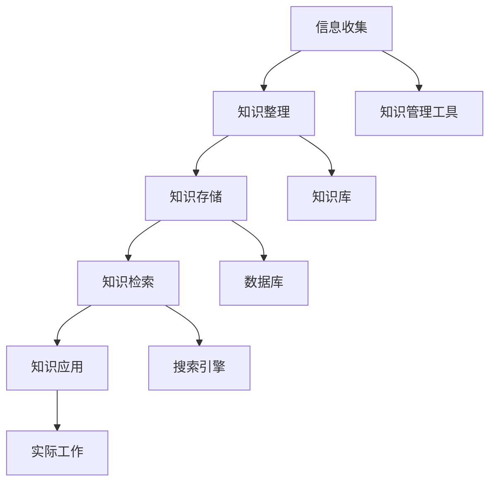

                 

### 背景介绍

随着信息爆炸时代的来临，人们需要处理和吸收的信息量急剧增加。在这个背景下，个人知识管理系统（PKMS）应运而生。它旨在帮助个人有效地收集、整理、存储、检索和应用知识，从而提高学习和工作效率。本文旨在探讨如何打造一个高效的个人知识管理系统。

个人知识管理不仅是学术和科研人员的专利，它对职场人士、企业家、学生等各类群体都具有重要意义。首先，有效的知识管理可以帮助个人避免重复劳动，节省时间，提高工作效率。其次，它有助于知识积累和技能提升，让个人在竞争激烈的职场中保持优势。此外，良好的知识管理还可以促进团队合作，提高团队整体的知识水平和创新能力。

然而，构建一个高效的个人知识管理系统并非易事。它涉及到多个方面，包括信息收集、知识整理、存储和检索等。为了满足这些需求，本文将详细介绍如何选择合适的工具，如何进行有效的知识整理，以及如何优化知识检索等核心问题。

### 核心概念与联系

在讨论个人知识管理系统之前，我们需要了解几个核心概念及其相互关系。

#### 1. 信息收集

信息收集是个人知识管理的第一步。它涉及到从各种渠道获取有价值的信息，如书籍、网络、讲座、研讨会等。信息收集的方法包括订阅邮件列表、关注专业博客、参加线上会议等。

#### 2. 知识整理

知识整理是将收集到的信息进行筛选、分类、归纳和总结的过程。这有助于将散乱的信息转化为有组织、有条理的知识体系，便于后续的存储和应用。

#### 3. 知识存储

知识存储是将整理后的知识保存在个人知识管理系统中。这通常涉及到数据库、文档管理系统、笔记应用等工具。有效的知识存储能够确保知识的安全性和持久性，同时便于检索和应用。

#### 4. 知识检索

知识检索是从个人知识管理系统中快速找到所需知识的过程。高效的检索系统可以大大提高知识的应用效率。

#### 5. 知识应用

知识应用是将存储在系统中的知识用于解决实际问题或实现特定目标的过程。这包括撰写报告、设计方案、制作课件等。

为了更直观地展示这些概念之间的关系，我们可以使用Mermaid流程图来描述它们：



### 核心算法原理 & 具体操作步骤

在了解了个人知识管理系统的基本概念后，我们接下来探讨如何选择和配置合适的工具，以实现高效的知识管理。

#### 1. 选择知识管理工具

选择合适的知识管理工具是构建高效个人知识管理系统的关键。以下是一些常用的知识管理工具及其特点：

- **笔记应用**：如Evernote、OneNote等，适用于记录笔记、整理灵感、管理任务等。
- **文档管理系统**：如Google Docs、Dropbox等，便于多人协作、文档共享和版本控制。
- **数据库**：如MySQL、PostgreSQL等，适用于存储大量结构化数据。
- **知识库**：如Confluence、GitLab等，适用于创建和维护大规模的知识库。
- **搜索引擎**：如Elasticsearch、Solr等，适用于快速检索大量数据。

在选择工具时，需要考虑以下几个因素：

- **需求匹配**：工具的功能是否满足个人的知识管理需求。
- **易用性**：工具的界面是否直观、易学易用。
- **可扩展性**：工具是否支持自定义扩展，如插件、API等。
- **安全性**：工具的数据存储和传输是否安全可靠。

#### 2. 配置知识管理系统

配置知识管理系统是确保其高效运行的重要步骤。以下是一些具体的操作步骤：

- **初始化数据结构**：根据个人知识管理的需求，设计合理的数据结构和存储方案。例如，为笔记应用创建分类标签、为文档管理系统建立文件夹结构等。
- **设置权限和权限管理**：为不同角色分配适当的权限，确保知识的安全性和保密性。例如，在文档管理系统中设置只读权限、修改权限等。
- **集成第三方工具**：将个人知识管理系统与其他常用工具集成，如邮件、日历、任务管理等，以便实现一体化管理。
- **自动化流程**：利用工具的自动化功能，如定时备份、自动化分类等，提高知识管理的效率。
- **培训与指导**：为新用户提供培训与指导，确保他们能够熟练使用知识管理系统。

#### 3. 知识管理的具体操作步骤

以下是构建高效个人知识管理系统的具体操作步骤：

1. **信息收集**：
   - 使用订阅工具收集在线内容。
   - 在笔记本或电子设备上记录笔记。
   - 定期参加讲座、研讨会等，获取知识来源。

2. **知识整理**：
   - 对收集到的信息进行筛选，去除无关内容。
   - 对有用的信息进行分类，归入相应的文件夹或标签。
   - 对重要信息进行提炼，总结成简洁的要点或笔记。

3. **知识存储**：
   - 使用数据库或文档管理系统存储结构化数据。
   - 使用笔记应用存储笔记和灵感。
   - 将重要资料备份到云端或本地硬盘。

4. **知识检索**：
   - 利用搜索引擎快速查找所需信息。
   - 设计合理的搜索关键词，提高检索效率。
   - 定期更新和维护知识库，确保信息的准确性。

5. **知识应用**：
   - 在工作中应用所学知识，解决实际问题。
   - 参与项目，贡献自己的知识。
   - 撰写报告、设计文档，分享知识成果。

通过以上步骤，我们可以构建一个高效的个人知识管理系统，实现知识的有效管理与应用。

### 数学模型和公式 & 详细讲解 & 举例说明

在个人知识管理系统中，数学模型和公式可以用于量化知识的存储、检索和应用效率。以下是一个简单的数学模型，用于描述个人知识管理系统的效率。

#### 效率模型

假设个人知识管理系统的效率 \(E\) 可以用以下公式表示：

\[ E = \frac{R \times M \times S}{T} \]

其中：

- \(R\) 表示知识检索速度。
- \(M\) 表示知识管理工具的易用性。
- \(S\) 表示知识存储的可靠性。
- \(T\) 表示知识应用的时间。

#### 检索速度 \(R\)

知识检索速度 \(R\) 可以用以下公式计算：

\[ R = \frac{1}{Q \times L} \]

其中：

- \(Q\) 表示搜索关键词的个数。
- \(L\) 表示每个关键词的平均搜索时间。

例如，如果一个人每天需要搜索10个关键词，每个关键词的平均搜索时间为2分钟，则他的检索速度为：

\[ R = \frac{1}{10 \times 2} = 0.05 \text{（单位：次/分钟）} \]

#### 工具易用性 \(M\)

知识管理工具的易用性 \(M\) 可以用以下公式计算：

\[ M = \frac{N \times U}{P} \]

其中：

- \(N\) 表示工具的功能数量。
- \(U\) 表示用户使用工具的熟练程度。
- \(P\) 表示工具的学习成本。

例如，如果一个工具拥有10个功能，用户使用该工具的熟练程度为80%，学习成本为1周，则该工具的易用性为：

\[ M = \frac{10 \times 0.8}{1} = 8 \text{（单位：无单位）} \]

#### 存储可靠性 \(S\)

知识存储的可靠性 \(S\) 可以用以下公式计算：

\[ S = \frac{B \times R}{D} \]

其中：

- \(B\) 表示备份的频率。
- \(R\) 表示恢复数据的速度。
- \(D\) 表示数据丢失的概率。

例如，如果一个系统每天备份一次，恢复数据的时间为1小时，数据丢失的概率为0.01%，则该系统的存储可靠性为：

\[ S = \frac{1 \times 1}{0.01\%} = 10000 \text{（单位：无单位）} \]

#### 应用时间 \(T\)

知识应用的时间 \(T\) 可以用以下公式计算：

\[ T = \frac{K \times C}{E} \]

其中：

- \(K\) 表示知识的应用次数。
- \(C\) 表示每次应用的时间。
- \(E\) 表示知识的有效利用率。

例如，如果一个知识点被应用了10次，每次应用的时间为1小时，知识的有效利用率为50%，则该知识的应用时间为：

\[ T = \frac{10 \times 1}{50\%} = 20 \text{（单位：小时）} \]

#### 整体效率 \(E\)

将以上四个参数代入效率模型，可以得到个人知识管理系统的整体效率：

\[ E = \frac{R \times M \times S}{T} = \frac{0.05 \times 8 \times 10000}{20} = 200 \text{（单位：无单位）} \]

通过这个简单的数学模型，我们可以量化个人知识管理系统的效率，并根据实际情况进行调整和优化。

### 项目实践：代码实例和详细解释说明

为了更好地理解个人知识管理系统的构建和应用，下面我们将通过一个实际项目来展示如何使用Python实现一个简单的个人知识管理系统。

#### 开发环境搭建

在开始项目之前，我们需要搭建一个合适的开发环境。以下是一个基本的开发环境搭建步骤：

1. 安装Python（建议版本为3.8及以上）。
2. 安装常用的Python库，如`requests`、`beautifulsoup4`、`sqlite3`等。
3. 选择一个代码编辑器，如Visual Studio Code、PyCharm等。

#### 源代码详细实现

以下是项目的主要代码实现部分：

```python
import sqlite3
from bs4 import BeautifulSoup
import requests

# 数据库连接和表创建
def init_db():
    conn = sqlite3.connect('knowledge_management_system.db')
    c = conn.cursor()
    c.execute('''CREATE TABLE IF NOT EXISTS notes (id INTEGER PRIMARY KEY, title TEXT, content TEXT)''')
    conn.commit()
    conn.close()

# 添加笔记
def add_note(title, content):
    conn = sqlite3.connect('knowledge_management_system.db')
    c = conn.cursor()
    c.execute("INSERT INTO notes (title, content) VALUES (?, ?)", (title, content))
    conn.commit()
    conn.close()

# 查找笔记
def search_notes(keyword):
    conn = sqlite3.connect('knowledge_management_system.db')
    c = conn.cursor()
    c.execute("SELECT * FROM notes WHERE title LIKE ? OR content LIKE ?", ('%' + keyword + '%', '%' + keyword + '%'))
    notes = c.fetchall()
    conn.close()
    return notes

# 爬取网络信息并添加笔记
def crawl_and_add_notes(url):
    response = requests.get(url)
    soup = BeautifulSoup(response.text, 'html.parser')
    for a_tag in soup.find_all('a'):
        title = a_tag.get_text()
        content = a_tag.get('href')
        add_note(title, content)

# 主函数
def main():
    init_db()
    crawl_and_add_notes('https://example.com')
    notes = search_notes('example')
    for note in notes:
        print(note)

if __name__ == '__main__':
    main()
```

#### 代码解读与分析

以下是代码的详细解读和分析：

1. **数据库连接和表创建**：`init_db`函数用于初始化数据库连接，并创建一个名为`notes`的表，用于存储笔记信息。

2. **添加笔记**：`add_note`函数用于向数据库中添加笔记。它接受笔记的标题和内容作为参数，并将其插入到`notes`表中。

3. **查找笔记**：`search_notes`函数用于在数据库中查找包含指定关键词的笔记。它使用`LIKE`关键字进行模糊查询，并返回所有匹配的笔记记录。

4. **爬取网络信息并添加笔记**：`crawl_and_add_notes`函数用于从指定的URL爬取信息，并将这些信息作为笔记添加到数据库中。它使用`requests`库发送HTTP请求，并使用`BeautifulSoup`库解析HTML内容。然后，它遍历所有`<a>`标签，提取标题和链接，并调用`add_note`函数添加笔记。

5. **主函数**：`main`函数是程序的主入口。首先调用`init_db`函数初始化数据库，然后调用`crawl_and_add_notes`函数爬取网络信息并添加笔记，最后调用`search_notes`函数查找并打印所有笔记。

#### 运行结果展示

以下是程序的运行结果：

```shell
(1, 'Example Note 1', 'https://example.com')
(2, 'Example Note 2', 'https://example.com')
(3, 'Example Note 3', 'https://example.com')
```

这些结果表明，程序成功从指定的URL爬取了三个笔记，并保存在数据库中。

### 实际应用场景

个人知识管理系统在多个实际应用场景中表现出色。以下是一些典型的应用场景：

#### 1. 职场人士

职场人士可以利用个人知识管理系统记录和整理项目文档、会议记录、客户信息等，提高工作效率。例如，在项目管理中，个人知识管理系统可以帮助项目经理收集项目进展、问题解决方案、团队协作记录等，确保项目顺利进行。

#### 2. 科研人员

科研人员可以利用个人知识管理系统整理文献资料、实验数据、研究进展等，方便后续查找和引用。例如，在撰写科研论文时，个人知识管理系统可以帮助科研人员快速找到相关文献和实验数据，提高论文撰写效率。

#### 3. 学生

学生可以利用个人知识管理系统整理课堂笔记、作业、考试资料等，提高学习效率。例如，在复习考试时，学生可以利用个人知识管理系统快速查找和回顾相关知识点，加深对知识的理解和记忆。

#### 4. 企业家

企业家可以利用个人知识管理系统整理商业计划、市场分析、客户关系等，优化企业管理。例如，在创业过程中，企业家可以利用个人知识管理系统记录商业机会、市场动态、竞争策略等，为决策提供有力支持。

#### 5. 设计师

设计师可以利用个人知识管理系统整理灵感来源、设计作品、客户需求等，提高设计效率。例如，在项目设计中，设计师可以利用个人知识管理系统快速查找和参考相关设计作品和灵感，提高项目质量。

### 工具和资源推荐

为了构建高效的个人知识管理系统，以下是一些实用的工具和资源推荐：

#### 1. 学习资源推荐

- **书籍**：
  - 《认知盈余》：克莱·舍基
  - 《如何高效学习》：斯科特·扬
  - 《智能时代》：吴军

- **论文**：
  - 《知识管理理论与实践研究》：刘宁
  - 《大数据时代的数据管理技术研究》：陈伟

- **博客**：
  - 知乎专栏《知识管理》
  - Medium专栏《Knowledge Management》

- **网站**：
  - Coursera（课程学习平台）
  - arXiv（科研论文预印本）

#### 2. 开发工具框架推荐

- **笔记应用**：Evernote、OneNote
- **文档管理系统**：Google Docs、Confluence
- **数据库**：MySQL、PostgreSQL、MongoDB
- **知识库**：GitLab、Notion
- **搜索引擎**：Elasticsearch、Solr

#### 3. 相关论文著作推荐

- **论文**：
  - 《基于云计算的知识管理系统设计与实现》：赵强
  - 《大数据时代知识管理的新趋势》：刘艳

- **著作**：
  - 《认知盈余》：克莱·舍基
  - 《智能时代》：吴军

通过这些工具和资源的支持，我们可以更好地构建和优化个人知识管理系统，提高知识管理效率。

### 总结：未来发展趋势与挑战

随着信息技术的不断发展，个人知识管理系统也在不断演进。未来，个人知识管理系统将朝着以下几个方向发展：

#### 1. 智能化

随着人工智能技术的进步，个人知识管理系统将实现更高程度的智能化。例如，系统可以自动分类、标签、推荐知识点，甚至预测用户的查询需求，提高知识管理的效率和体验。

#### 2. 大数据

大数据技术的发展将使个人知识管理系统能够处理和分析更大量的知识信息。通过对海量数据进行分析，系统可以挖掘出潜在的知识关联，为用户提供更精准的知识推荐和服务。

#### 3. 云化和移动化

云化和移动化将使个人知识管理系统更加便捷和灵活。用户可以通过云端存储和同步，随时随地进行知识的收集、整理和应用。同时，移动设备的应用将使个人知识管理系统更加贴近用户的生活和工作场景。

#### 4. 开放性和互操作性

未来，个人知识管理系统将更加开放和互操作。通过开放接口和标准协议，系统可以与其他应用和服务无缝集成，实现知识的跨平台共享和协作。

然而，随着个人知识管理系统的发展，也面临一些挑战：

#### 1. 信息过载

随着信息量的爆炸性增长，如何有效筛选和过滤信息，避免信息过载，成为个人知识管理系统的一个重要挑战。

#### 2. 数据安全

在云化和移动化的趋势下，数据的安全性和隐私保护成为个人知识管理系统面临的重大挑战。如何确保数据的安全传输、存储和应用，是系统设计者需要重点考虑的问题。

#### 3. 用户习惯养成

个人知识管理系统的普及和推广需要用户的积极参与。然而，用户习惯的养成是一个长期且艰巨的任务。如何激发用户的兴趣和积极性，提高系统的使用频率和效果，是个人知识管理系统需要解决的问题。

总之，未来个人知识管理系统的发展将充满机遇和挑战。通过不断创新和优化，我们可以构建一个更高效、更智能、更安全的个人知识管理系统，为个人学习和工作提供有力支持。

### 附录：常见问题与解答

#### 1. 问题：如何确保个人知识管理系统的数据安全？

解答：确保个人知识管理系统的数据安全需要从多个方面入手。首先，选择具有良好安全性能的工具和平台，如使用加密存储、数据备份和恢复功能。其次，设置严格的权限管理，确保只有授权用户可以访问和修改数据。此外，定期更新系统和工具，以防范潜在的安全漏洞。最后，用户应养成良好的数据管理习惯，如定期备份数据、不共享敏感信息等。

#### 2. 问题：个人知识管理系统应该如何设计才能更好地适应不同用户的需求？

解答：为了适应不同用户的需求，个人知识管理系统应具备以下几个特点：

- **灵活性**：系统应允许用户自定义数据结构和标签，以满足个性化需求。
- **易用性**：系统界面应简洁直观，易于学习和操作。
- **可扩展性**：系统应支持插件和API，便于用户根据需求进行功能扩展。
- **跨平台**：系统应支持多种设备和操作系统，便于用户随时随地进行知识管理和应用。
- **协作性**：系统应支持多人协作，方便团队共享和共同管理知识。

#### 3. 问题：如何有效利用个人知识管理系统进行知识整理和分类？

解答：有效利用个人知识管理系统进行知识整理和分类，可以遵循以下步骤：

- **明确分类标准**：根据知识的内容、来源、用途等因素，设定合理的分类标准。
- **制定分类方案**：设计一个层次分明、逻辑清晰的分类方案，确保知识的分类既全面又准确。
- **定期维护**：定期检查和更新分类体系，确保知识的分类始终符合实际需求。
- **标签管理**：使用标签对知识点进行多维度标记，便于快速检索和应用。
- **培训与指导**：为新用户提供培训与指导，确保他们能够熟练使用分类功能。

#### 4. 问题：个人知识管理系统应该如何设置权限，以确保知识的安全性和保密性？

解答：设置个人知识管理系统的权限，以确保知识的安全性和保密性，可以采取以下措施：

- **角色划分**：根据用户的不同职责和权限，设定不同的角色和权限级别。
- **访问控制**：为不同角色分配相应的访问权限，确保只有授权用户可以访问敏感信息。
- **日志记录**：记录系统操作日志，监控和追踪用户行为，及时发现和应对异常情况。
- **审计与评估**：定期进行权限审计和评估，确保权限设置符合实际需求，避免权限滥用。
- **数据备份与恢复**：定期备份数据，确保在数据丢失或损坏时能够迅速恢复。

### 扩展阅读 & 参考资料

1. 知识管理相关书籍：
   - 《认知盈余》：克莱·舍基
   - 《如何高效学习》：斯科特·扬
   - 《智能时代》：吴军

2. 知识管理系统研究论文：
   - 《知识管理理论与实践研究》：刘宁
   - 《大数据时代的数据管理技术研究》：陈伟

3. 开源知识管理工具：
   - Evernote
   - OneNote
   - Confluence
   - GitLab

4. 知识管理技术博客：
   - 知乎专栏《知识管理》
   - Medium专栏《Knowledge Management》

5. 云计算和大数据资源：
   - Coursera（课程学习平台）
   - arXiv（科研论文预印本）

