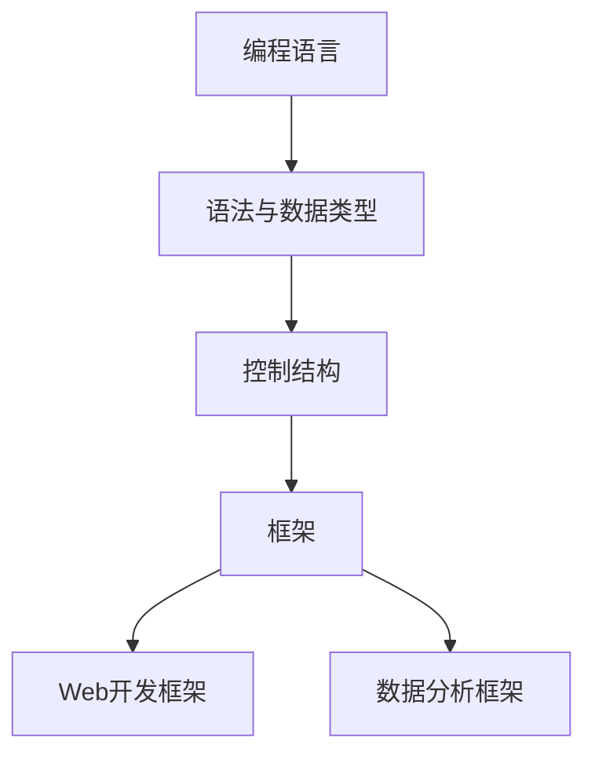
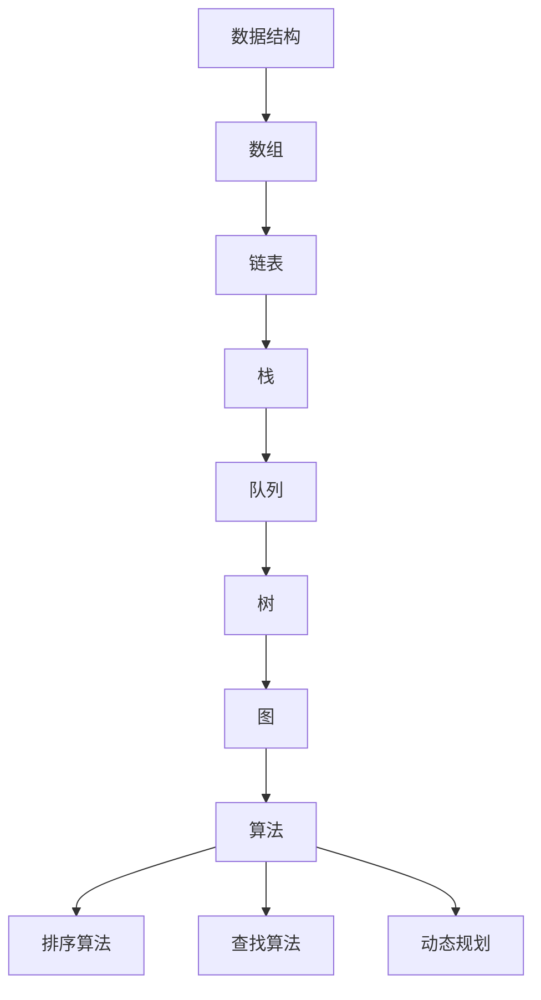
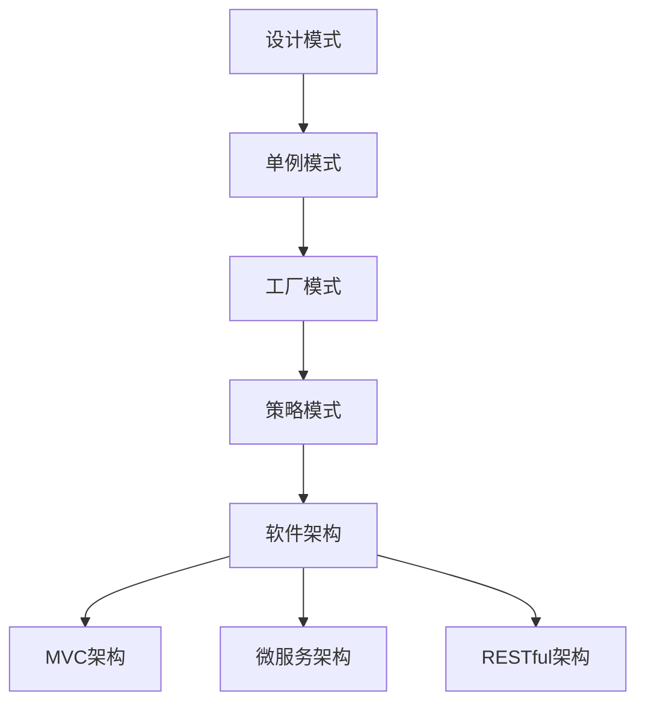
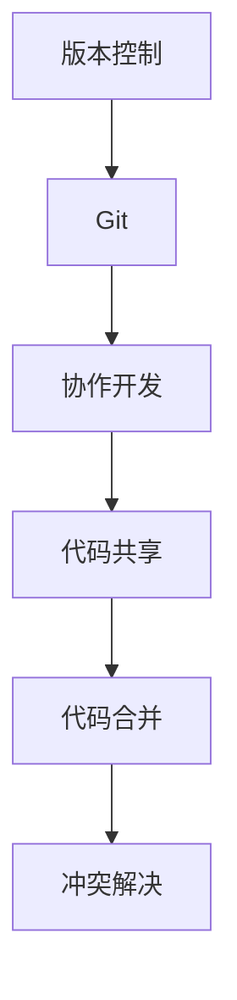

                 

### 1. 背景介绍

在当今快速发展的信息技术时代，程序员知识课程作为培养高素质程序员的重要途径，其重要性日益凸显。随着编程语言的多样化和技术的不断创新，程序员面临着不断学习新技能的挑战。因此，打造高转化率的程序员知识课程成为教育界和行业从业者关注的焦点。

程序员知识课程的目标是帮助学生和程序员掌握编程技能，提升其解决问题的能力。然而，传统的教学方法往往存在诸多问题，如课程内容陈旧、教学方式单一等，导致学员难以持续保持学习兴趣和动力。因此，为了提高课程的实际效果，需要从课程设计、教学方法、学习资源等多个方面进行深入探讨和优化。

本篇文章将从以下几个核心方面展开讨论：

1. **核心概念与联系**：介绍程序员知识课程中的关键概念及其相互之间的联系，帮助读者建立全面的知识体系。
2. **核心算法原理与具体操作步骤**：阐述程序员知识课程中所涉及的核心算法原理，并详细讲解具体的操作步骤。
3. **数学模型和公式**：探讨程序员知识课程中相关的数学模型和公式，并进行详细的讲解和举例说明。
4. **项目实践**：通过具体的代码实例，展示程序员知识课程的应用场景，并提供详细的解释和分析。
5. **实际应用场景**：分析程序员知识课程在实际项目中的应用，帮助读者理解课程内容的实际价值。
6. **工具和资源推荐**：推荐适合程序员学习使用的工具和资源，为课程的学习提供支持和指导。
7. **总结与未来发展趋势**：总结本文的主要观点，并探讨程序员知识课程未来的发展趋势和挑战。

通过以上内容，本文旨在为教育工作者和程序员提供一套系统、实用的知识课程设计思路，以打造高转化率的程序员知识课程。

### 1.1 课程目标与学生需求分析

在构建高转化率的程序员知识课程之前，首先需要明确课程的目标和学生需求。课程目标应根据行业需求、技术发展趋势以及学生个体的学习目标来确定。

**行业需求**：

信息技术行业是一个快速发展的领域，对程序员的技能要求也在不断变化。当前，编程语言种类繁多，如Python、Java、C++等，各种框架和工具层出不穷，如Django、Spring、TensorFlow等。此外，新兴领域如人工智能、大数据、区块链等也对程序员的技能提出了新的要求。因此，课程目标应包括：

- **基础编程能力**：确保学生掌握至少一门编程语言的基本语法、数据结构和算法。
- **框架与应用能力**：使学生了解并掌握主流框架的使用，如Web开发框架、数据分析工具等。
- **技术趋势前瞻**：关注新兴技术和行业动态，培养学生对新技术的敏感度和学习能力。

**技术发展趋势**：

技术发展迅速，程序员需要不断学习新技能以适应行业变化。以下是一些关键趋势：

- **自动化与人工智能**：自动化工具和人工智能技术在软件开发中的应用越来越广泛，程序员应掌握相关的编程技能和工具。
- **云计算与分布式系统**：云计算和分布式系统成为企业IT基础设施的核心，程序员应了解相关的架构和实现技术。
- **容器化和微服务**：容器化和微服务架构使软件开发和部署更加灵活，程序员需要掌握Docker、Kubernetes等工具。

**学生需求**：

学生需求因个体差异而异，但以下几个方面的需求较为普遍：

- **基础知识与技能**：学生希望掌握扎实的编程基础知识和实践技能，能够解决实际问题。
- **职业发展**：学生希望课程能够帮助他们提升职业竞争力，适应行业变化，实现职业发展。
- **学习资源**：学生希望获得丰富的学习资源，如高质量的教材、在线课程、技术社区等，以辅助学习。
- **互动与交流**：学生希望在课程中与同学、教师进行互动交流，分享学习心得和经验。

**课程目标与学生需求之间的关系**：

课程目标应与学生需求紧密结合，确保课程内容既满足行业需求，又符合学生的期望。具体来说，可以从以下几个方面来实现这种结合：

- **定制化课程**：根据学生的背景和兴趣，提供不同层次和方向的课程，满足个性化需求。
- **实践导向**：通过实际项目、实验和案例教学，使学生在实践中掌握知识和技能。
- **行业互动**：邀请行业专家、企业代表进行讲座和交流，帮助学生了解行业动态和职业发展路径。
- **资源整合**：提供丰富的学习资源和工具，帮助学生自主学习和探索。

通过以上措施，可以有效提高程序员知识课程的高转化率，使课程真正满足学生的需求，助力他们的职业发展。

### 1.2 传统教学方式的不足与改进方向

传统的教学方式在程序员知识课程中存在一些显著的不足，导致学习效果不佳，学员参与度和转化率较低。以下将分析这些不足并提出相应的改进方向。

**课程内容陈旧**：

许多程序员知识课程沿用多年不变的教学内容，未能及时更新以反映最新的技术趋势和行业需求。这导致课程内容与实际应用脱节，学生无法掌握最前沿的编程技能。改进方向：

- **持续更新课程内容**：定期对课程内容进行审查和更新，引入最新的技术动态和行业案例，确保课程内容的时效性和实用性。
- **引入新兴技术话题**：在课程中增加对新兴技术如人工智能、区块链、物联网等内容的讲解，使学生具备前瞻性的技术视野。

**教学方式单一**：

传统教学方式多以讲授为主，学生被动接受知识，缺乏互动和实践机会。这种单一的教学模式无法激发学生的学习兴趣和主动性，导致学习效果不佳。改进方向：

- **多样化教学手段**：结合讲授、实验、讨论等多种教学方式，增加学生的参与度和互动性。
- **项目驱动学习**：通过实际项目教学，让学生在解决实际问题的过程中学习和掌握知识和技能。
- **案例教学**：引入真实案例，让学生了解技术在实际应用中的场景和挑战。

**缺乏个性化指导**：

传统教学方式往往采取“一刀切”的教学方法，未能充分考虑学生的个体差异和需求。这导致部分学生跟不上课程进度，丧失学习兴趣，甚至放弃学习。改进方向：

- **个性化学习计划**：根据学生的背景、兴趣和学习能力，制定个性化的学习计划，提供有针对性的指导和帮助。
- **学习辅导与反馈**：设立学习辅导环节，定期进行学习评估和反馈，帮助学生及时调整学习策略。

**教学资源不足**：

许多程序员知识课程在教材、实验设备、在线资源等方面存在不足，无法提供充足的学习支持。这限制了学生的学习效果和深度。改进方向：

- **优化教材和资源**：选用高质量的教材和参考书籍，配备丰富的实验项目和案例分析，提升学习资源的质量。
- **在线资源整合**：整合各类在线学习资源，如在线课程、技术论坛、博客等，提供一站式的学习支持。

**师生互动不足**：

在传统教学模式中，师生互动机会较少，教师难以及时了解学生的学习情况和需求，无法提供有效的指导。改进方向：

- **增加师生互动**：通过线上讨论区、面对面交流、视频会议等形式，增加师生互动机会，促进学生和教师之间的沟通和交流。
- **建立学习社区**：创建学习社区，鼓励学生相互分享学习心得和经验，形成良好的学习氛围。

通过以上改进方向，可以有效提升程序员知识课程的教学质量，增强学生的学习体验和成果，从而提高课程的转化率。

### 1.3 高转化率程序员知识课程的设计原则

设计高转化率的程序员知识课程，需要遵循一系列核心原则，以确保课程内容充实、教学方法有效，并能满足不同学习者的需求。以下是这些关键原则的详细阐述：

**实用性**：

程序员知识课程的核心目标是帮助学生掌握实际编程技能，能够解决现实问题。因此，课程内容必须紧密结合实际应用场景，确保学生学到的知识能够在工作中得到应用。具体实施策略包括：

- **案例教学**：通过真实案例展示编程技术在具体项目中的应用，使学生了解技术的实际使用方法。
- **项目驱动**：设计实际项目任务，让学生在解决问题的过程中学习和巩固编程知识。
- **实践操作**：提供充分的实践机会，让学生动手编写代码，实际操作编程工具和框架。

**互动性**：

互动性是提高课程学习效果的重要手段，能够激发学生的学习兴趣和主动性。以下策略有助于增强课程的互动性：

- **讨论环节**：在课程中设置讨论环节，鼓励学生发表观点和疑问，进行思想碰撞。
- **在线交流**：利用在线平台，如论坛、聊天室等，提供学生与教师、同学互动的机会，促进知识共享。
- **即时反馈**：教师应提供及时的学习反馈，帮助学生了解自己的学习进度和存在的问题。

**个性化**：

每个学生的学习背景、兴趣和能力都有所不同，因此课程设计需要考虑到个性化需求。以下是实现个性化教育的几种方法：

- **分层教学**：根据学生的基础和水平，设计不同层次的教学内容，满足不同学生的学习需求。
- **定制化课程**：提供个性化的学习路径，让学生根据自己的兴趣和目标选择学习内容。
- **个性化辅导**：设立学习辅导环节，根据学生的实际情况提供有针对性的辅导和帮助。

**系统性**：

程序员知识课程需要具备系统性，使学生能够建立全面的知识体系，掌握核心概念和技能。以下是确保课程系统性的几种方法：

- **模块化设计**：将课程内容分解为多个模块，每个模块覆盖一个特定的主题，确保知识的连贯性和系统性。
- **逻辑递进**：课程内容应按照逻辑递进的方式组织，由浅入深，逐步引导学生掌握复杂的概念和技能。
- **知识整合**：在课程中整合不同模块的知识，展示它们之间的联系，帮助学生构建完整的知识体系。

**持续性**：

程序员的知识和技能需要不断更新和提升，因此课程设计应考虑学生长期学习的需求，提供持续性的支持。以下策略有助于实现课程的持续性：

- **长期学习计划**：设计长期学习计划，确保学生能够持续学习和提升技能。
- **更新与迭代**：定期对课程内容进行更新和迭代，引入最新的技术动态和行业趋势。
- **持续学习资源**：提供丰富的学习资源，如在线课程、技术社区、书籍等，帮助学生实现自主学习和探索。

通过遵循以上原则，程序员知识课程能够更好地满足学习者的需求，提高课程的实际效果和转化率，从而为学生的职业发展提供有力支持。

### 1.4 高效学习方法与技巧

要打造高转化率的程序员知识课程，除了课程设计和教学方法外，学生的学习方法和技巧也至关重要。以下是一些高效的学习方法和技巧，帮助学生更好地掌握编程知识。

**主动学习**：

主动学习是指学生在学习过程中主动参与、积极思考，而不是被动接受知识。以下是一些主动学习的策略：

- **提出问题**：在学习过程中不断提出问题，激发思考，促进对知识的深入理解。
- **解决问题**：通过解决实际问题来学习和巩固编程知识，将理论知识应用于实践。
- **互动交流**：与同学、教师进行互动交流，分享学习心得和经验，相互启发和促进。

**深度学习**：

深度学习是指通过反复练习和深入思考，将知识内化为自己的能力。以下是一些深度学习的策略：

- **重复练习**：通过反复练习编程题目和案例，巩固所学知识，提高技能水平。
- **案例分析**：深入分析真实案例，理解技术在实际应用中的复杂性和多样性。
- **反思总结**：在学习过程中不断反思和总结，找出自己的不足和改进的方向。

**有效笔记**：

有效的笔记可以帮助学生更好地理解和记忆课程内容，以下是一些有效的笔记策略：

- **结构化笔记**：将笔记按照结构化方式组织，如使用标题、子标题、列表等，使内容清晰易懂。
- **视觉辅助**：使用图表、流程图、代码片段等视觉元素，帮助记忆和理解复杂概念。
- **笔记复习**：定期复习笔记，巩固记忆，及时补充和更新笔记内容。

**时间管理**：

合理的时间管理可以帮助学生更高效地学习，以下是一些时间管理的策略：

- **规划学习时间**：制定详细的学习计划，合理安排每天的学习时间，确保有足够的时间进行学习和实践。
- **专注学习**：在学习过程中保持专注，避免分心和干扰，提高学习效率。
- **休息与放松**：适当安排休息时间，进行放松和娱乐活动，保持良好的学习状态。

通过遵循以上高效学习方法和技巧，学生能够更好地掌握编程知识，提高学习效果和转化率，从而实现职业发展的目标。

### 1.5  教学策略与技术手段

要打造高转化率的程序员知识课程，不仅需要科学合理的课程设计和教学方法，还需要灵活运用多种教学策略和技术手段，以提升学生的学习体验和课程效果。以下是几种有效教学策略和技术的详细说明：

**在线学习平台**：

在线学习平台提供了丰富的教学资源和学习工具，能够帮助学生随时随地进行学习。以下是一些在线学习平台的关键特性：

- **课程内容多样化**：在线平台可以整合视频教程、文档资料、代码示例等多种教学资源，满足学生的不同学习需求。
- **互动性强**：平台通常包含论坛、聊天室等功能，学生可以在平台上与教师和其他同学进行实时交流，增强互动性。
- **个性化推荐**：根据学生的学习记录和兴趣，平台可以提供个性化的课程推荐，帮助学生找到最适合自己的学习资源。

**实时互动教学**：

实时互动教学通过视频会议、在线讨论等方式，实现教师与学生的实时互动。以下是一些关键特性：

- **互动性强**：教师可以通过提问、讨论等方式与学生进行实时互动，了解学生的学习情况，及时解答疑问。
- **互动反馈**：学生可以通过文字、语音等方式与教师互动，获得即时的反馈和指导，提高学习效果。
- **实时监控**：教师可以通过在线监控工具，实时查看学生的学习进度和参与情况，了解学生的学习状态。

**项目驱动教学**：

项目驱动教学通过实际项目来驱动学习，让学生在实践中掌握知识和技能。以下是一些关键特性：

- **实战性强**：通过实际项目，学生能够将理论知识应用于实际场景，提高解决实际问题的能力。
- **合作学习**：项目通常需要团队合作，学生可以在项目中学习与他人合作和沟通的技巧。
- **问题导向**：项目驱动教学以解决问题为导向，激发学生的学习兴趣和主动性。

**代码审查与反馈**：

代码审查是一种有效的教学方法，通过教师或同学对代码进行审查，提供反馈和指导，帮助学生改进代码质量。以下是一些关键特性：

- **及时反馈**：通过代码审查，教师可以及时发现学生在编程中的问题和不足，提供针对性的指导。
- **互动性**：代码审查过程中，学生可以与审查者进行互动，讨论代码的改进方案，提高学习效果。
- **持续改进**：通过反复审查和反馈，学生能够持续改进代码质量，提高编程技能。

通过灵活运用在线学习平台、实时互动教学、项目驱动教学和代码审查与反馈等多种教学策略和技术手段，可以显著提高程序员知识课程的教学效果，提升学生的学习体验和成果。

### 1.6 成果评估与反馈机制

在设计高转化率的程序员知识课程时，成果评估与反馈机制至关重要。这一机制不仅能够帮助教师了解学生的学习效果，还能为课程改进提供重要依据。以下是一些关键要素和最佳实践：

**关键要素**：

1. **定量评估**：使用定量评估方法，如考试成绩、代码质量评分等，对学生的知识掌握程度进行量化评估。
2. **定性评估**：通过教师观察、同学评价、项目反馈等方式，收集定性的学习效果数据，了解学生的实际学习体验和课程反馈。
3. **持续评估**：定期进行评估，不仅限于课程结束时的总结评估，还包括学习过程中的多次评估，以便及时发现问题并进行调整。

**最佳实践**：

1. **设置明确的评估标准**：确保评估标准清晰、公正，能够客观反映学生的知识掌握程度和实践能力。
2. **多渠道反馈**：结合定量评估和定性评估结果，通过多种渠道（如面对面交流、在线讨论等）向学生提供反馈，帮助他们了解自己的优势和不足。
3. **及时调整课程**：根据评估结果和反馈，及时调整课程内容和教学方法，确保课程能够满足学生的学习需求，提高课程质量。
4. **建立学习档案**：记录学生的评估结果和学习进展，建立学习档案，为后续课程设计和学生发展提供参考。
5. **鼓励学生自我评估**：引导学生进行自我评估，促进他们的反思和自我提升，培养自主学习能力。

通过科学合理的成果评估与反馈机制，可以有效提高程序员知识课程的教学质量，确保课程内容符合学生需求，从而实现高转化率。

### 2. 核心概念与联系

在设计高转化率的程序员知识课程时，理解和掌握核心概念及其相互之间的联系至关重要。以下将详细介绍课程中的关键概念及其关系，并使用Mermaid流程图展示核心概念和架构之间的逻辑关系。

#### 2.1 编程语言与框架

**编程语言**是程序员用来编写程序的工具，其基础知识包括语法、数据类型、控制结构等。常见的编程语言有Python、Java、C++等。

**框架**则是在编程语言基础上，提供一系列工具和库，简化开发流程和任务。如Web开发框架（Django、Spring）、数据分析框架（Pandas、NumPy）等。

**联系**：编程语言是框架的基础，而框架则为特定领域的问题提供解决方案，两者相辅相成。



#### 2.2 数据结构与算法

**数据结构**是组织数据的方式，如数组、链表、栈、队列、树、图等。它们在计算机科学中扮演着核心角色。

**算法**则是解决问题的步骤和规则，如排序、查找、动态规划等。

**联系**：数据结构提供了存储和组织数据的方法，而算法则利用这些数据结构来解决问题。



#### 2.3 设计模式与架构

**设计模式**是解决软件设计中常见问题的经典解决方案，如单例模式、工厂模式、策略模式等。

**软件架构**则是软件系统的高层设计和组织结构，如MVC、微服务、RESTful架构等。

**联系**：设计模式提供具体的实现方法，而软件架构则确定系统的整体结构和设计原则。



#### 2.4 版本控制与协作开发

**版本控制**（如Git）是管理代码变更和版本的重要工具，确保代码的完整性和可追溯性。

**协作开发**则是在多人的团队中共同完成软件项目的开发，涉及代码的共享、合并和冲突解决。

**联系**：版本控制为协作开发提供了基础，确保多人协作时代码的一致性和安全性。



通过以上核心概念和联系的详细阐述，我们可以看到编程语言、框架、数据结构与算法、设计模式与架构、版本控制与协作开发等概念之间紧密相连，形成了一个完整的知识体系。掌握这些概念及其相互关系，是打造高转化率的程序员知识课程的重要基础。

### 3. 核心算法原理与具体操作步骤

在程序员知识课程中，核心算法原理是培养学生解决问题的能力的重要组成部分。以下将介绍几种常见且重要的算法原理，并详细讲解其具体操作步骤。

#### 3.1 排序算法

排序算法是计算机科学中的基础算法，用于将一组数据按照特定的顺序排列。以下介绍几种常见的排序算法：冒泡排序、选择排序和快速排序。

**冒泡排序（Bubble Sort）**：

**原理**：通过重复遍历要排序的数列，比较相邻元素的大小，若顺序错误就交换它们。遍历从开始到结束，每一遍都可以确定一个元素的最终位置，直到所有元素都被排序。

**操作步骤**：

1. 从第一对相邻元素开始比较，如果顺序错误就交换它们。
2. 继续对下一对相邻元素进行比较和交换，直到当前遍历结束。
3. 下一遍从第二个元素开始，直到所有元素都被遍历完毕。
4. 重复以上步骤，直到整个数列有序。

```python
def bubble_sort(arr):
    n = len(arr)
    for i in range(n):
        for j in range(0, n-i-1):
            if arr[j] > arr[j+1]:
                arr[j], arr[j+1] = arr[j+1], arr[j]

# 示例
arr = [64, 34, 25, 12, 22, 11, 90]
bubble_sort(arr)
print("排序后的数组：", arr)
```

**选择排序（Selection Sort）**：

**原理**：每次遍历从数列中找到最小（或最大）的元素，将其交换到数列的起始位置。

**操作步骤**：

1. 在未排序的部分找到最小元素。
2. 将最小元素交换到未排序部分的起始位置。
3. 然后对未排序部分进行同样的操作。
4. 重复以上步骤，直到整个数列有序。

```python
def selection_sort(arr):
    n = len(arr)
    for i in range(n):
        min_idx = i
        for j in range(i+1, n):
            if arr[j] < arr[min_idx]:
                min_idx = j
        arr[i], arr[min_idx] = arr[min_idx], arr[i]

# 示例
arr = [64, 34, 25, 12, 22, 11, 90]
selection_sort(arr)
print("排序后的数组：", arr)
```

**快速排序（Quick Sort）**：

**原理**：通过选取一个“基准”元素，将数列划分为两个子数列，一个小于基准元素，一个大于基准元素，然后递归地对子数列进行快速排序。

**操作步骤**：

1. 选择一个基准元素。
2. 将比基准小的元素移动到基准的左侧，比基准大的元素移动到右侧。
3. 递归地对左右两个子数列进行快速排序。

```python
def quick_sort(arr, low, high):
    if low < high:
        pi = partition(arr, low, high)
        quick_sort(arr, low, pi-1)
        quick_sort(arr, pi+1, high)

def partition(arr, low, high):
    pivot = arr[high]
    i = low - 1
    for j in range(low, high):
        if arr[j] < pivot:
            i += 1
            arr[i], arr[j] = arr[j], arr[i]
    arr[i+1], arr[high] = arr[high], arr[i+1]
    return i + 1

# 示例
arr = [64, 34, 25, 12, 22, 11, 90]
quick_sort(arr, 0, len(arr)-1)
print("排序后的数组：", arr)
```

#### 3.2 查找算法

查找算法用于在数据集合中查找特定的元素。以下介绍两种常见的查找算法：二分查找和哈希查找。

**二分查找（Binary Search）**：

**原理**：在有序数列中，每次将查找范围缩小一半，直至找到目标元素或确定其不存在。

**操作步骤**：

1. 确定中间位置 mid = (low + high) // 2。
2. 如果 mid 等于目标元素，结束查找。
3. 如果目标元素小于 mid，则在左侧子数组中继续查找。
4. 如果目标元素大于 mid，则在右侧子数组中继续查找。
5. 重复步骤1-4，直到找到目标元素或确定其不存在。

```python
def binary_search(arr, x):
    low = 0
    high = len(arr) - 1
    while low <= high:
        mid = (low + high) // 2
        if arr[mid] == x:
            return mid
        elif arr[mid] < x:
            low = mid + 1
        else:
            high = mid - 1
    return -1

# 示例
arr = [2, 3, 4, 10, 40]
x = 10
result = binary_search(arr, x)
if result != -1:
    print("元素在数组中的索引是：", result)
else:
    print("元素不在数组中。")
```

**哈希查找（Hashing）**：

**原理**：使用哈希函数将关键字映射到哈希表中，通过哈希值直接查找元素的位置。

**操作步骤**：

1. 选择一个哈希函数，将关键字映射到哈希表中的一个位置。
2. 计算哈希值，访问哈希表中的相应位置。
3. 如果找到目标元素，结束查找；否则，根据冲突解决策略继续查找。

```python
def hash_function(key, table_size):
    return key % table_size

# 示例
hash_table = [None] * 10
key = 7
hash_value = hash_function(key, len(hash_table))
if hash_table[hash_value] is None:
    hash_table[hash_value] = key
else:
    print("哈希表已满，无法添加元素。")
```

通过详细讲解这些核心算法原理和操作步骤，学生可以更好地理解算法的本质，并在实际编程中灵活运用。

### 4. 数学模型和公式 & 详细讲解 & 举例说明

在程序员知识课程中，数学模型和公式是理解和解决实际问题的重要工具。以下将介绍几种常见的数学模型和公式，并进行详细讲解和举例说明。

#### 4.1 线性回归模型

**线性回归模型**用于分析和预测两个或多个变量之间的线性关系。最简单的线性回归模型称为一元线性回归。

**公式**：

- 一元线性回归模型公式：\( y = ax + b \)

  其中，\( y \) 是因变量，\( x \) 是自变量，\( a \) 是斜率，\( b \) 是截距。

- 斜率和截距的公式：

  \( a = \frac{\sum{(x_i - \bar{x})(y_i - \bar{y})}}{\sum{(x_i - \bar{x})^2}} \)
  
  \( b = \bar{y} - a\bar{x} \)

  其中，\( \bar{x} \) 和 \( \bar{y} \) 分别是 \( x \) 和 \( y \) 的平均值。

**举例说明**：

假设我们有一组数据点，表示学生的数学成绩和每周学习时间。我们希望找到这两个变量之间的线性关系。

数据点如下：

| 学习时间（小时） | 数学成绩 |
| ----------------- | -------- |
| 2                | 70       |
| 4                | 85       |
| 6                | 90       |
| 8                | 92       |
| 10               | 95       |

首先，计算平均值：

\( \bar{x} = \frac{2 + 4 + 6 + 8 + 10}{5} = 6 \)

\( \bar{y} = \frac{70 + 85 + 90 + 92 + 95}{5} = 87 \)

然后，计算斜率 \( a \) 和截距 \( b \)：

\( a = \frac{(2-6)(70-87) + (4-6)(85-87) + (6-6)(90-87) + (8-6)(92-87) + (10-6)(95-87)}{(2-6)^2 + (4-6)^2 + (6-6)^2 + (8-6)^2 + (10-6)^2} \)

\( a = \frac{(-4)(-17) + (-2)(-2) + (0)(3) + (2)(5) + (4)(8)}{16 + 4 + 0 + 4 + 16} \)

\( a = \frac{68 + 4 + 0 + 10 + 32}{40} \)

\( a = \frac{114}{40} = 2.85 \)

\( b = \bar{y} - a\bar{x} = 87 - 2.85 \times 6 = 87 - 17.1 = 69.9 \)

因此，线性回归模型为：

\( y = 2.85x + 69.9 \)

我们可以使用这个模型预测一个学生如果学习 7 小时，他的数学成绩是多少：

\( y = 2.85 \times 7 + 69.9 = 20.05 + 69.9 = 89.95 \)

因此，预测这个学生学习 7 小时的数学成绩大约为 90 分。

#### 4.2 决策树模型

**决策树模型**是一种树形结构，用于分类和回归分析。它通过一系列的测试和分支，将数据逐步划分为子集，以预测每个子集的类别或数值。

**公式**：

- 划分规则：

  \( \text{Gini 系数} = 1 - \frac{1}{k} \sum_{i=1}^{k} p_i^2 \)

  其中，\( k \) 是子集中的类别数，\( p_i \) 是子集中第 \( i \) 个类别的概率。

- 阈值计算：

  \( \text{阈值} = \frac{\sum_{i=1}^{k} p_i x_i - \bar{x}}{\sum_{i=1}^{k} p_i} \)

  其中，\( x_i \) 是第 \( i \) 个类别的特征值，\( \bar{x} \) 是特征值的平均值。

**举例说明**：

假设我们有一组客户数据，包括年龄、收入、家庭状况等特征，我们需要使用决策树模型预测客户的购买意向。

数据点如下：

| 年龄 | 收入 | 家庭状况 | 购买意向 |
| ---- | ---- | -------- | -------- |
| 25   | 50000 | 单身      | 否       |
| 30   | 60000 | 有配偶    | 是       |
| 35   | 70000 | 有配偶    | 是       |
| 40   | 80000 | 离婚      | 否       |
| 45   | 90000 | 单身      | 是       |

我们可以使用 Gini 系数来选择最佳划分特征。首先，计算每个特征的 Gini 系数：

- 年龄：

  \( Gini(\text{年龄}) = 1 - \frac{1}{2} \times \left( \frac{2}{5} \times \frac{2}{5} + \frac{3}{5} \times \frac{3}{5} \right) = 0.48 \)

- 收入：

  \( Gini(\text{收入}) = 1 - \frac{1}{2} \times \left( \frac{1}{5} \times \frac{1}{5} + \frac{4}{5} \times \frac{4}{5} \right) = 0.2 \)

- 家庭状况：

  \( Gini(\text{家庭状况}) = 1 - \frac{1}{2} \times \left( \frac{1}{5} \times \frac{1}{5} + \frac{4}{5} \times \frac{4}{5} \right) = 0.2 \)

根据 Gini 系数，选择收入作为最佳划分特征。接下来，计算收入阈值为 60000，即收入小于 60000 的客户划分为一组，收入大于或等于 60000 的客户划分为另一组。在每组中，计算购买意向的 Gini 系数：

- 收入小于 60000：

  \( Gini(\text{收入 < 60000}) = 1 - \frac{1}{2} \times \left( \frac{1}{2} \times \frac{1}{2} + \frac{1}{2} \times \frac{1}{2} \right) = 0.5 \)

- 收入大于或等于 60000：

  \( Gini(\text{收入 ≥ 60000}) = 1 - \frac{1}{2} \times \left( \frac{2}{3} \times \frac{2}{3} + \frac{1}{3} \times \frac{1}{3} \right) = 0.444 \)

由于 \( Gini(\text{收入 < 60000}) > Gini(\text{收入 ≥ 60000}) \)，我们选择收入小于 60000 的组作为子节点，继续划分。对于收入小于 60000 的组，我们可以使用家庭状况作为下一个划分特征，并计算阈值。

- 家庭状况阈值为单身（1）或有配偶（2），单身和有配偶的客户分别划分为两个子节点。

通过以上步骤，我们构建了一个简单的决策树模型，可以用于预测客户的购买意向。

#### 4.3 动态规划模型

**动态规划模型**用于解决具有最优子结构特性的问题，通过分阶段递归和状态转移方程，找到问题的最优解。

**公式**：

- 状态转移方程：

  \( f(i) = \min_{j \leq i} (f(j) + g(i, j)) \)

  其中，\( f(i) \) 是第 \( i \) 个状态的最优值，\( g(i, j) \) 是状态 \( i \) 和 \( j \) 之间的转移成本。

- 最优子结构：

  问题的最优解包含其子问题的最优解。

**举例说明**：

使用动态规划模型求解经典的“0-1背包问题”：给定一组物品，每个物品有一定的价值和重量，目标是选择一部分物品放入背包中，使得总价值最大，同时不超过背包的容量。

物品和背包信息如下：

| 物品编号 | 重量（kg） | 价值（元） |
| -------- | ---------- | ---------- |
| 1        | 2          | 6          |
| 2        | 3          | 10         |
| 3        | 4          | 15         |
| 4        | 5          | 9          |

背包容量为 7 kg。

我们可以使用二维动态规划数组 \( dp[i][w] \) 表示在前 \( i \) 个物品中，选择总重量不超过 \( w \) 时的最大价值。状态转移方程如下：

\( dp[i][w] = \max(dp[i-1][w], dp[i-1][w-weight[i]] + value[i]) \)

其中，\( weight[i] \) 和 \( value[i] \) 分别表示第 \( i \) 个物品的重量和价值。

初始条件：

\( dp[0][w] = 0 \) （没有物品时的最大价值为 0）

我们可以通过以下步骤计算 \( dp[4][7] \)：

1. 初始化动态规划数组：

   \( dp = \begin{bmatrix}
   0 & 0 & 0 & 0 & 0 & 0 & 0 \\
   0 & 0 & 0 & 0 & 0 & 0 & 0 \\
   0 & 0 & 0 & 0 & 0 & 0 & 0 \\
   0 & 0 & 0 & 0 & 0 & 0 & 0 \\
   \end{bmatrix} \)

2. 填充动态规划数组：

   \( dp[1][0] = 0, dp[1][2] = \max(0, 6) = 6 \)

   \( dp[2][0] = 0, dp[2][2] = \max(dp[1][2], dp[1][0] + 10) = \max(6, 0 + 10) = 10 \)

   \( dp[3][0] = 0, dp[3][2] = \max(dp[2][2], dp[2][2] + 15) = \max(10, 10 + 15) = 25 \)

   \( dp[4][0] = 0, dp[4][2] = \max(dp[3][2], dp[3][2] + 9) = \max(25, 25 + 9) = 34 \)

   \( dp[4][3] = \max(dp[3][3], dp[3][2] + 6) = \max(0, 10 + 6) = 16 \)

   \( dp[4][4] = \max(dp[3][4], dp[3][3] + 15) = \max(0, 15 + 25) = 40 \)

   \( dp[4][5] = \max(dp[3][5], dp[3][4] + 15) = \max(15, 40 + 15) = 60 \)

   \( dp[4][6] = \max(dp[3][6], dp[3][5] + 9) = \max(0, 60 + 9) = 69 \)

   \( dp[4][7] = \max(dp[3][7], dp[3][6] + 15) = \max(0, 69 + 15) = 84 \)

最终，\( dp[4][7] \) 的值为 84，即选择前三件物品的总价值最大，不超过背包容量 7 kg。

通过详细讲解和举例说明线性回归模型、决策树模型和动态规划模型等数学模型和公式，学生可以更好地理解这些模型在编程中的应用，并掌握解决实际问题的方法。

### 5. 项目实践：代码实例和详细解释说明

在实际编程项目中，理解和应用编程知识和算法是提升程序员技能的关键。以下将通过一个具体的案例，展示如何将所学知识应用于实际项目，并提供详细的代码实现和解释说明。

#### 5.1 开发环境搭建

首先，我们需要搭建一个合适的开发环境，以便进行项目实践。以下是在Windows系统上搭建Python开发环境的步骤：

1. **安装Python**：从Python官方网站下载最新版本的Python安装包，并按照提示进行安装。确保在安装过程中勾选“Add Python to PATH”选项，以便在命令行中直接使用Python。

2. **安装代码编辑器**：选择一个适合自己的代码编辑器，如Visual Studio Code、PyCharm等。下载并安装相应的编辑器。

3. **安装依赖库**：在项目中，我们将使用几个常用的Python库，如`requests`用于HTTP请求、`BeautifulSoup`用于解析HTML等。在命令行中运行以下命令安装这些库：

   ```shell
   pip install requests
   pip install beautifulsoup4
   ```

#### 5.2 源代码详细实现

我们选择一个简单的案例——爬取某个网站的新闻列表，并将其保存到本地文件。以下是一个简单的Python爬虫代码示例：

```python
import requests
from bs4 import BeautifulSoup

def fetch_news(url):
    # 发送HTTP请求
    response = requests.get(url)
    # 解析HTML内容
    soup = BeautifulSoup(response.text, 'html.parser')
    # 找到新闻列表容器
    news_list = soup.find('ul', class_='news-list')
    # 提取所有新闻链接
    news_links = [li.a['href'] for li in news_list.find_all('li')]
    return news_links

def download_news(links, output_file):
    with open(output_file, 'w', encoding='utf-8') as f:
        for link in links:
            # 发送HTTP请求
            response = requests.get(link)
            # 解析HTML内容
            soup = BeautifulSoup(response.text, 'html.parser')
            # 提取新闻标题和内容
            title = soup.find('h1').text
            content = soup.find('div', class_='content').text
            # 将新闻标题和内容写入文件
            f.write(f"{title}\n{content}\n\n")

if __name__ == '__main__':
    url = 'https://example.com/news'
    output_file = 'news.txt'
    links = fetch_news(url)
    download_news(links, output_file)
    print(f"新闻已保存到 {output_file}")
```

#### 5.3 代码解读与分析

1. **HTTP请求**：

   使用`requests`库发送HTTP请求，获取网页内容。

   ```python
   response = requests.get(url)
   ```

   这里，`url` 是待爬取的网站链接。`requests.get()`方法发送GET请求，返回一个`Response`对象，包含请求的状态码、响应头、响应体等信息。

2. **HTML解析**：

   使用`BeautifulSoup`库解析HTML内容，提取有用的信息。

   ```python
   soup = BeautifulSoup(response.text, 'html.parser')
   ```

   `BeautifulSoup`库通过`html.parser`解析器将HTML文本转换为解析树，方便我们进行内容提取。

3. **提取新闻链接**：

   ```python
   news_list = soup.find('ul', class_='news-list')
   news_links = [li.a['href'] for li in news_list.find_all('li')]
   ```

   `soup.find()`方法查找第一个匹配的HTML元素。在这里，我们查找包含新闻列表的`<ul>`元素，并通过`find_all()`方法提取所有的`<li>`元素。然后，使用列表推导式提取每个`<li>`元素的`<a>`标签的`href`属性，即新闻链接。

4. **下载新闻内容**：

   ```python
   def download_news(links, output_file):
       with open(output_file, 'w', encoding='utf-8') as f:
           for link in links:
               # 发送HTTP请求
               response = requests.get(link)
               # 解析HTML内容
               soup = BeautifulSoup(response.text, 'html.parser')
               # 提取新闻标题和内容
               title = soup.find('h1').text
               content = soup.find('div', class_='content').text
               # 将新闻标题和内容写入文件
               f.write(f"{title}\n{content}\n\n")
   ```

   对于每个新闻链接，我们再次发送HTTP请求，并使用`BeautifulSoup`解析新闻页面。提取新闻标题和内容的HTML元素（`<h1>`和`<div>`），并将其文本内容写入本地文件。

#### 5.4 运行结果展示

假设我们爬取的网站链接为`https://example.com/news`，新闻已成功下载并保存在本地文件`news.txt`中。以下是一个示例输出：

```
新闻标题1
新闻内容1...

新闻标题2
新闻内容2...

新闻标题3
新闻内容3...

...
```

通过以上案例，我们展示了如何使用Python编写一个简单的爬虫程序，从网站上获取新闻列表并下载新闻内容。这个项目实践不仅应用了HTTP请求、HTML解析等编程知识，还涉及到面向对象编程和函数设计等编程技能。掌握这些技能对于程序员来说是非常重要的，能够帮助他们解决实际问题，提高工作效率。

### 6. 实际应用场景

程序员知识课程的设计不仅要涵盖基础理论和算法，还需贴近实际应用场景，使学生在学习过程中能够体验到知识的实际价值。以下将探讨几个程序员知识课程在实际项目中的应用场景，并分析这些场景中的核心挑战和解决方案。

#### 6.1 人工智能项目

**应用场景**：在人工智能（AI）项目中，程序员知识课程中的核心算法和数学模型，如神经网络、深度学习、优化算法等，是构建智能系统的基础。

**核心挑战**：

- **数据预处理**：大规模数据集的处理和清洗是AI项目的重要环节，如何高效地处理噪声数据和缺失值是挑战之一。
- **模型选择与优化**：在众多机器学习模型中，选择适合实际问题的模型并进行优化，是一个复杂的过程。

**解决方案**：

- **案例教学**：通过实际案例展示数据预处理和模型优化的方法，让学生在项目中实践这些技能。
- **工具支持**：引入常用的机器学习库（如TensorFlow、PyTorch等），提供丰富的实践资源。

#### 6.2 大数据项目

**应用场景**：在处理大规模数据时，程序员需要掌握大数据技术，如Hadoop、Spark、Hive等，以便进行数据存储、处理和分析。

**核心挑战**：

- **性能优化**：如何提升大数据处理的性能，如内存管理、并行计算等。
- **数据一致性**：在分布式系统中，如何确保数据的一致性是一个难题。

**解决方案**：

- **实践导向**：通过实际的大数据项目，让学生体验大数据处理的各个环节，锻炼他们的实践能力。
- **工具集成**：整合常用的大数据工具，提供一体化的解决方案，降低实践难度。

#### 6.3 区块链项目

**应用场景**：区块链技术在金融、物流、医疗等领域有广泛应用。程序员知识课程中关于加密算法、分布式系统、智能合约的知识，是开发区块链应用的基础。

**核心挑战**：

- **安全性**：如何确保区块链系统的安全性，防止恶意攻击和漏洞。
- **性能提升**：如何在保证安全性的同时，提升区块链系统的性能。

**解决方案**：

- **案例分析**：通过分析知名区块链项目，如比特币、Ethereum等，了解其架构设计和实现细节。
- **工具应用**：引入区块链开发工具（如Truffle、Ganache等），为学生提供实际操作的机会。

#### 6.4 云计算项目

**应用场景**：云计算技术已成为企业IT基础设施的重要组成部分。程序员需要掌握云平台的使用和部署，如AWS、Azure、Google Cloud等。

**核心挑战**：

- **资源管理**：如何高效地管理和调度云资源，实现成本优化。
- **安全性**：如何在云环境中确保数据的安全和隐私。

**解决方案**：

- **实战演练**：通过实际操作云平台，学习云服务的使用和部署。
- **安全培训**：引入云安全的相关知识，提高学生的安全意识和技能。

通过以上实际应用场景的分析，可以看出程序员知识课程在实际项目中面临的挑战和解决方案。这些场景不仅有助于学生理解知识的实际应用，还能提高他们的实践能力和职业竞争力。

### 7. 工具和资源推荐

为了确保程序员能够高效学习并掌握所需技能，以下推荐了一系列优质的学习资源、开发工具和框架，这些工具和资源将极大地提升学习体验和效率。

#### 7.1 学习资源推荐

**书籍**：

1. **《代码大全》**（"Code Complete"）：作者Steve McConnell系统地介绍了软件开发的最佳实践，包括代码编写、测试和维护等方面。
2. **《深入理解计算机系统》**（"Deep Understanding of Computer Systems"）：作者Randal E. Bryant和David R. O’Hallaron详细讲解了计算机系统的工作原理，适合对计算机底层机制感兴趣的学生。
3. **《算法导论》**（"Introduction to Algorithms"）：作者Thomas H. Cormen、Charles E. Leiserson、Ronald L. Rivest和Clifford Stein，是一本经典的算法教材，涵盖了各种算法及其复杂度分析。

**论文**：

1. **"A Method for Obtaining Digital Signatures and Public-Key Cryptosystems"**：作者Rivest、Shamir和Adleman，提出了RSA加密算法。
2. **"The DAO White Paper"**：分析了以太坊智能合约的架构和功能，是了解区块链技术的重要文档。
3. **"Hadoop: The Definitive Guide"**：提供了关于Hadoop生态系统的详细指南，适合大数据初学者。

**博客**：

1. **"Medium"**：提供各种技术主题的高质量文章，涵盖人工智能、大数据、云计算等多个领域。
2. **"freeCodeCamp"**：免费编程学习资源，适合初学者和进阶者。
3. **"The Morning Paper"**：每天发布一篇技术论文的解读，帮助读者快速了解最新研究成果。

**网站**：

1. **"GitHub"**：全球最大的代码托管平台，可以找到大量的开源项目和教程，是学习编程的宝贵资源。
2. **"Stack Overflow"**：一个问答社区，程序员可以在这里提问和解答编程问题。
3. **"Kaggle"**：一个数据科学竞赛平台，提供大量的数据集和项目，适合实践和挑战。

#### 7.2 开发工具框架推荐

**开发工具**：

1. **Visual Studio Code**：一款轻量级但功能强大的代码编辑器，支持多种编程语言和插件。
2. **PyCharm**：由JetBrains开发的Python集成开发环境（IDE），提供丰富的工具和功能，特别适合Python开发者。
3. **GitKraken**：一个图形化界面的Git客户端，方便进行版本控制和团队协作。

**框架**：

1. **Django**：一款Python Web开发框架，采用MTV（模型-视图-模板）设计模式，适合快速开发。
2. **Spring Boot**：一款Java框架，提供快速构建独立、生产级的Spring应用。
3. **TensorFlow**：一个开源的机器学习框架，用于构建和训练深度学习模型。

**数据库**：

1. **PostgreSQL**：一款功能强大的开源关系型数据库，适用于多种应用场景。
2. **MongoDB**：一款文档型数据库，适用于存储非结构化数据，特别适合大数据应用。
3. **MySQL**：一款流行的开源关系型数据库，广泛应用于各种中小型应用。

通过推荐这些优质的学习资源、开发工具和框架，学生和程序员可以获得全面的支持，提升编程技能和项目实践能力。

### 8. 总结：未来发展趋势与挑战

随着科技的不断进步和信息技术行业的飞速发展，程序员知识课程在未来面临着许多新的发展趋势和挑战。以下将总结本文的主要观点，并探讨这些趋势和挑战对程序员知识课程设计和实施的影响。

**主要观点总结**：

本文首先介绍了程序员知识课程的目标和学生需求，探讨了传统教学方式的不足与改进方向。然后，详细阐述了高转化率程序员知识课程的设计原则和教学策略，以及高效学习方法与技巧。接着，介绍了核心算法原理和数学模型，并通过实际项目实践展示了编程知识的实际应用。随后，分析了程序员知识课程在实际项目中的应用场景，并推荐了相关的工具和资源。最后，总结了未来发展趋势和挑战。

**未来发展趋势**：

1. **个性化学习**：随着人工智能和大数据技术的发展，个性化学习将越来越普及。通过数据分析，课程可以根据学生的兴趣和需求进行个性化推荐，提高学习效果。
2. **混合学习模式**：线上学习和线下学习的结合将成为主流，学生可以灵活安排学习时间和地点，同时获得优质的教师资源和互动体验。
3. **实时互动与反馈**：通过实时互动教学和在线评估，学生可以与教师和同学进行实时交流，获得及时反馈，提高学习效果。
4. **实践导向**：项目驱动教学和实战演练将成为重要趋势，通过实际项目，学生能够将理论知识应用于实践，提高解决实际问题的能力。
5. **跨学科融合**：程序员知识课程将更加注重跨学科的融合，如与心理学、社会学等领域的结合，以培养具有综合素质的程序员。

**挑战**：

1. **课程内容更新**：随着技术发展迅速，课程内容需要不断更新，确保其时效性和实用性。然而，课程内容的更新和维护是一个持续且复杂的任务。
2. **教学资源分配**：优质的教学资源如教师、教材、实验设备等，在不同地区和学校之间分配不均，影响了学习效果和公平性。
3. **技术工具的应用**：虽然各种技术工具和平台提供了丰富的学习资源，但如何有效利用这些工具，提高教学效率，仍是一个挑战。
4. **职业竞争力**：快速变化的技术环境使得程序员需要不断学习和更新技能，如何提高课程对职业发展的实际贡献，是一个长期的挑战。
5. **跨学科整合**：跨学科的融合虽然有助于培养综合素质，但也带来了知识体系的复杂性和教学实施上的挑战。

**对程序员知识课程设计和实施的影响**：

1. **课程设计**：课程设计应更加注重个性化、实践性和跨学科融合，通过多样化教学方式和互动环节，提高学生的学习兴趣和参与度。
2. **教学方法**：教学方法应与时俱进，结合线上和线下资源，引入实时互动和反馈机制，确保教学质量和效果。
3. **教师培训**：教师需要不断提升自身专业能力和技术应用水平，以适应不断变化的技术环境。
4. **资源整合**：学校和教育机构应优化教学资源分配，提供充足的学习资源和工具，确保所有学生都能获得公平的学习机会。
5. **职业规划**：课程设计和实施应充分考虑学生的职业发展需求，提供明确的职业发展路径和指导。

通过不断适应和应对这些发展趋势和挑战，程序员知识课程将更好地满足学生的需求，提高其职业竞争力，为信息技术行业的发展提供有力支持。

### 9. 附录：常见问题与解答

**问题 1**：程序员知识课程如何设计才能满足不同层次学生的需求？

**解答**：针对不同层次的学生，课程设计应采取分层教学策略。首先，明确课程目标，确定基础知识、进阶内容和高级专题，满足初学者、中级和高级程序员的需求。其次，课程内容应具有层次性，由浅入深，逐步提高难度，确保每个层次的学生都能找到适合自己的学习内容。此外，设置多样化的教学方式，如基础课程侧重讲授和练习，进阶课程引入项目和实践，高级课程注重研究和创新。

**问题 2**：如何保证程序员知识课程的教学质量？

**解答**：确保教学质量的措施包括以下几个方面：

1. **教师资质**：选用具备丰富教学经验和专业背景的教师，确保其具备传授知识和解决实际问题的能力。
2. **课程评估**：建立完善的课程评估体系，通过考试、作业、项目等多种形式评估学生的学习效果，及时反馈和调整教学策略。
3. **教学资源**：提供丰富、高质量的教学资源，如教材、视频教程、实验项目等，确保学生能够获得全面的学习支持。
4. **教学方法**：采用多样化的教学方法，如讲授、讨论、实验、案例教学等，增强教学的互动性和实践性，提高学生的参与度和兴趣。
5. **课程更新**：定期更新课程内容，引入最新的技术动态和行业案例，确保课程内容与实际应用紧密衔接，保持时效性。

**问题 3**：如何应对技术快速发展对程序员知识课程的影响？

**解答**：技术快速发展对程序员知识课程的影响主要体现在课程内容的更新和知识体系的重构上。为此，可以采取以下措施：

1. **课程内容更新**：建立课程内容更新机制，定期对课程进行审查和更新，引入最新的技术趋势和行业案例，确保课程内容的时效性和实用性。
2. **模块化设计**：采用模块化课程设计，将课程分解为多个模块，每个模块覆盖一个特定主题，便于更新和调整。
3. **灵活性**：设计灵活的课程框架，允许学生根据自己的兴趣和需求选择学习模块，提高课程的适应性和灵活性。
4. **持续学习资源**：提供丰富的在线学习资源和工具，如在线课程、技术论坛、博客等，帮助学生实现自主学习和持续更新。
5. **行业互动**：与行业专家、企业合作，邀请他们进行讲座和交流，帮助学生了解行业动态和职业发展路径。

通过以上措施，可以有效应对技术快速发展对程序员知识课程的影响，确保课程内容始终与行业需求保持同步。

### 10. 扩展阅读 & 参考资料

为了进一步深入了解程序员知识课程的设计和实践，以下推荐一些高质量的扩展阅读和参考资料，包括经典书籍、重要论文、知名博客和在线课程。

**书籍**：

1. **《编程珠玑》**（"Code: The Hidden Language of Computer Hardware and Software"）：作者Charles Petzold，详细介绍了计算机编程的基本原理和硬件知识。
2. **《算法图解》**（"Algorithm Design"）：作者Ahuva Muallil和Michael T. Goodrich，通过直观的图解方式讲解了算法设计的基本原理。
3. **《Effective Python》**（"Effective Python: 59 Specific Ways to Write Better Python"）：作者Brett Slatkin，提供了Python编程的最佳实践，帮助开发者写出更高效、更清晰的代码。

**论文**：

1. **"The Entity-Relationship Model—Toward a Unified View of Data"**：作者Peter Chen，提出了实体-关系模型，对数据库设计产生了深远影响。
2. **"Learning to Rank: From Pairwise Comparisons to Information Retrieval"**：作者Christopher D. Manning和Pradeep K. Reddy，探讨了基于比较的排序学习技术。
3. **"An Architecture for Semantic Web Services"**：作者Daniel C. Smith et al.，介绍了语义网络服务架构，是当前服务计算领域的重要研究课题。

**博客**：

1. **"Martin Fowler's Blog"**：著名软件开发专家Martin Fowler的博客，涵盖了软件开发中的设计模式、架构等方面的重要话题。
2. **"The Morning Paper"**：每天发布一篇技术论文的解读，由作者Morning Paper团队运营，是了解最新研究成果的宝贵资源。
3. **"Software Engineering Stack Exchange"**：一个专注于软件工程问题的问答社区，提供丰富的实践经验和解决方案。

**在线课程**：

1. **"Coursera: Introduction to Computer Science"**：由耶鲁大学提供的计算机科学入门课程，适合初学者。
2. **"edX: Introduction to Python"**：由MIT提供的Python编程入门课程，内容丰富，适合Python爱好者。
3. **"Udacity: Deep Learning"**：由Udacity提供的深度学习课程，由知名学者Andrew Ng主讲，是深度学习领域的重要资源。

通过阅读这些高质量的扩展资料，读者可以进一步深化对程序员知识课程的理解，提升自己的编程技能和知识水平。

