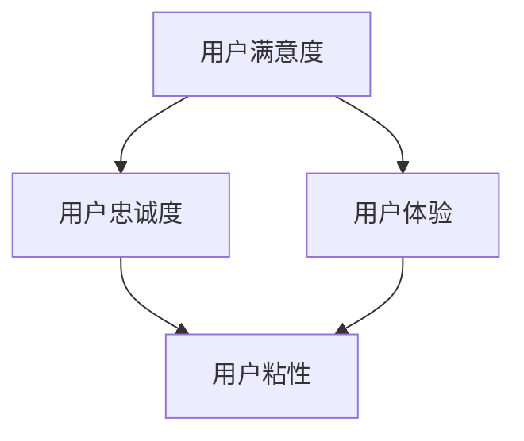

                 

### 背景介绍

#### 知识付费产品市场概述

近年来，随着互联网技术的飞速发展，知识付费产品市场呈现出蓬勃发展的态势。知识付费产品包括在线课程、专业书籍、电子书、付费问答等，其本质是通过提供有价值的信息和知识，满足用户的学习和成长需求。据统计，全球知识付费市场规模在过去几年中持续扩大，预计到2025年将达到数千亿美元。这无疑为企业和创业者提供了广阔的发展空间。

然而，市场竞争也日益激烈。如何在众多知识付费产品中脱颖而出，成为众多企业关注的问题。其中一个关键因素就是提高用户忠诚度。用户忠诚度是指用户对某一产品的长期使用和信任程度，它是衡量知识付费产品成功与否的重要指标。提高用户忠诚度不仅可以增加用户粘性，降低用户流失率，还能通过口碑传播吸引更多潜在用户，从而实现业务的可持续发展。

#### 用户忠诚度的重要性

提高用户忠诚度对于知识付费产品的长期发展具有至关重要的意义。首先，用户忠诚度直接关系到产品的市场份额。高忠诚度的用户不仅会持续购买产品，还会主动推荐给他人，从而带来更多的收益。其次，忠诚用户有助于降低营销成本。通过用户留存和口碑效应，企业可以减少对新用户的获取投入，将更多资源用于产品优化和用户服务。此外，高忠诚度用户更愿意接受企业的广告和促销活动，提高市场占有率。

另外，用户忠诚度还与用户满意度密切相关。当用户对产品感到满意时，他们会更倾向于继续使用并推荐给他人。反之，如果用户对产品不满意，很容易转向竞争对手。因此，提高用户满意度也是提高用户忠诚度的重要途径。通过不断优化产品和服务，企业可以提升用户满意度，从而提高用户忠诚度。

#### 当前知识付费市场存在的问题

尽管提高用户忠诚度对于知识付费产品的成功至关重要，但当前市场仍存在一些问题。首先，产品同质化现象严重。许多知识付费产品在内容、形式和功能上差异不大，难以满足用户多样化的需求。这使得用户容易产生审美疲劳，降低忠诚度。

其次，用户体验不足。部分知识付费产品在课程设计、学习互动、用户反馈等方面存在不足，难以提供良好的学习体验。这不仅影响用户满意度，还会导致用户流失。

此外，内容质量参差不齐。一些知识付费产品为了追求短期收益，忽视内容质量和权威性，导致用户对产品产生质疑，降低信任度。

综上所述，提高知识付费产品的用户忠诚度已成为企业面临的紧迫问题。在接下来的章节中，我们将深入探讨影响用户忠诚度的核心因素，并分享一些实用的策略和方法，帮助企业提升用户忠诚度。

### 核心概念与联系

为了深入探讨如何提高知识付费产品的用户忠诚度，我们首先需要明确一些核心概念和它们之间的联系。这些概念包括用户忠诚度、用户满意度、用户粘性和用户体验。通过理解这些概念及其相互关系，我们可以为制定有效的策略提供理论依据。

#### 用户忠诚度

用户忠诚度是指用户对某一产品的长期使用和信任程度。它是衡量用户对产品满意度和依赖程度的重要指标。高忠诚度的用户不仅会持续使用产品，还会推荐给他人，从而为企业带来持续的业务增长。用户忠诚度通常通过用户留存率、复购率和推荐率等指标来衡量。

#### 用户满意度

用户满意度是指用户对产品或服务的整体感知与期望之间的差距。当用户对产品或服务感到满意时，他们会更愿意继续使用并推荐给他人。用户满意度可以通过用户调研、反馈机制和评分系统等方式进行衡量。

#### 用户粘性

用户粘性是指用户对产品或服务的依赖程度。高粘性的用户更容易形成忠诚用户群体，他们对产品的使用频率和时长较高。用户粘性可以通过日活跃用户数（DAU）、月活跃用户数（MAU）和用户时长等指标来衡量。

#### 用户体验

用户体验是指用户在使用产品或服务过程中的感受和体验。良好的用户体验可以提高用户满意度，从而增加用户忠诚度。用户体验包括界面设计、操作便捷性、内容质量、学习互动性等多个方面。

#### 核心概念联系

用户忠诚度、用户满意度、用户粘性和用户体验之间存在着密切的联系。具体来说：

1. **用户满意度**直接影响**用户忠诚度**。高满意度的用户更容易产生忠诚行为，而低满意度的用户则容易流失。

2. **用户体验**是影响**用户满意度**的关键因素。良好的用户体验可以提高用户满意度，从而提高用户忠诚度。

3. **用户粘性**是**用户忠诚度**的体现。高粘性的用户群体通常具有更高的忠诚度。

4. **用户粘性**和**用户体验**密切相关。良好的用户体验可以增加用户粘性，从而提高用户忠诚度。

理解这些核心概念及其相互关系，有助于我们制定有针对性的策略，从而提高知识付费产品的用户忠诚度。

#### Mermaid 流程图

为了更直观地展示这些核心概念之间的联系，我们可以使用Mermaid流程图来描述它们。以下是一个简单的Mermaid流程图示例：



在这个流程图中，A表示用户满意度，B表示用户忠诚度，C表示用户体验，D表示用户粘性。箭头表示它们之间的因果关系或相互关系。通过这个流程图，我们可以更清晰地看到各个核心概念之间的联系，从而为后续的策略制定提供参考。

### 核心算法原理 & 具体操作步骤

为了提高知识付费产品的用户忠诚度，我们可以采用一系列核心算法原理和具体操作步骤。这些方法基于对用户行为、心理和需求的深入分析，旨在优化产品和服务，从而提升用户满意度和忠诚度。

#### 1. 用户行为分析

用户行为分析是提高用户忠诚度的第一步。通过收集和分析用户在使用知识付费产品过程中的行为数据，我们可以了解用户的兴趣点、使用习惯和痛点。具体步骤如下：

1. **数据收集**：利用网站、APP等平台的数据采集工具，收集用户的浏览记录、学习时长、购买行为、互动频率等数据。

2. **数据分析**：使用数据挖掘和机器学习算法，对收集到的数据进行处理和分析，提取有价值的信息。

3. **用户画像**：根据分析结果，构建用户画像，包括用户的基本信息、兴趣偏好、行为特征等。

4. **个性化推荐**：基于用户画像，为用户推荐符合其兴趣和需求的内容，提高用户满意度和参与度。

#### 2. 用户心理分析

了解用户心理是提高用户忠诚度的关键。通过心理学理论和方法，我们可以深入洞察用户的需求和动机，从而制定更有针对性的策略。以下是一些具体步骤：

1. **需求分析**：使用心理学需求理论，如马斯洛需求层次理论，分析用户在不同层次上的需求。

2. **动机分析**：通过行为心理学和行为经济学理论，分析用户购买和使用知识付费产品的动机。

3. **情感分析**：利用自然语言处理技术，分析用户在评论、反馈中的情感倾向，了解用户对产品的情感反应。

4. **心理测试**：通过心理测评工具，如MBTI、DISC等，对用户进行心理测试，了解其性格特点和偏好。

#### 3. 用户服务优化

优化用户服务是提高用户忠诚度的直接手段。通过以下步骤，我们可以提升用户的服务体验，从而增加用户满意度和忠诚度：

1. **客服培训**：对客服人员进行专业化培训，提高其沟通技巧和服务意识。

2. **服务响应**：确保客服能够在第一时间响应用户的问题和需求，提供高效、专业的解决方案。

3. **个性化服务**：根据用户的兴趣和需求，提供个性化的服务和建议，增加用户粘性。

4. **售后保障**：提供完善的售后服务，如退换货政策、退款服务、课程调整等，确保用户权益。

#### 4. 用户互动设计

用户互动是提高用户忠诚度的另一个重要方面。通过设计互动活动，我们可以增强用户与产品之间的联系，从而提高用户参与度和忠诚度。以下是一些具体步骤：

1. **社区建设**：搭建用户社区，鼓励用户之间进行交流和互动。

2. **互动活动**：定期举办线上或线下活动，如知识竞赛、讲座、研讨会等，增加用户参与度。

3. **用户反馈**：建立用户反馈机制，收集用户意见和建议，不断优化产品和服务。

4. **荣誉奖励**：为积极参与互动的用户提供荣誉奖励，如虚拟货币、优惠券等，激励用户持续参与。

#### 5. 数据驱动优化

数据驱动优化是提高用户忠诚度的有效方法。通过不断收集和分析用户数据，我们可以发现产品和服务中的问题，并针对性地进行优化。以下是一些具体步骤：

1. **数据监测**：使用数据监测工具，实时跟踪用户行为和产品性能。

2. **数据挖掘**：对收集到的数据进行深度挖掘，发现潜在问题和用户需求。

3. **A/B测试**：通过A/B测试，验证不同策略的效果，选择最优方案。

4. **持续优化**：根据数据分析和用户反馈，不断调整产品和服务，提高用户体验和满意度。

通过以上核心算法原理和具体操作步骤，我们可以系统地提高知识付费产品的用户忠诚度。在下一章节中，我们将进一步探讨数学模型和公式，以便更精确地量化用户忠诚度，为策略制定提供数据支持。

#### 数学模型和公式 & 详细讲解 & 举例说明

为了更精确地量化用户忠诚度，我们可以引入数学模型和公式。这些模型和公式可以帮助我们理解用户忠诚度的影响因素，从而制定更有针对性的策略。以下是几个常用的数学模型和公式的详细讲解及其应用实例。

##### 1. 贝尔曼最优控制模型

贝尔曼最优控制模型（Bellman's Optimality Principle）是一种用于优化决策过程的动态规划模型。在用户忠诚度分析中，我们可以将用户的行为视为一系列决策，通过该模型找出最优策略，从而提高用户忠诚度。

**公式：**
$$
V^*(s) = \max_u \{r(s, u) + \gamma V^*(s')\}
$$

其中，$V^*(s)$表示在状态$s$下的最优价值函数，$r(s, u)$表示在状态$s$下采取行动$u$的即时奖励，$s'$表示状态转移后的状态，$\gamma$表示折扣因子，用于权衡即时奖励和未来奖励之间的关系。

**例子：** 假设用户在购买知识付费产品时，有两个选择：立即购买和推迟购买。通过贝尔曼最优控制模型，我们可以计算出在不同状态下的最优价值函数，从而确定用户何时购买产品能够获得最大收益。

##### 2. 顾客终身价值模型

顾客终身价值（Customer Lifetime Value, CLV）模型用于计算一个顾客在整个生命周期内为企业带来的总收益。通过CLV模型，我们可以评估用户忠诚度的经济价值，从而为营销策略提供依据。

**公式：**
$$
CLV = \sum_{t=1}^{T} \frac{R_t}{(1 + r)^t}
$$

其中，$R_t$表示在第$t$年内用户为企业带来的收益，$r$表示折现率，$T$表示顾客的预期生命周期。

**例子：** 假设一个知识付费产品的用户在一年内为企业带来100美元的收益，折现率为10%。通过顾客终身价值模型，我们可以计算出该用户的终身价值为：
$$
CLV = \sum_{t=1}^{1} \frac{100}{(1 + 0.1)^t} \approx 90.91美元
$$

##### 3. 用户留存率模型

用户留存率（Customer Retention Rate）是衡量用户忠诚度的一个重要指标。通过用户留存率模型，我们可以预测用户的留存情况，并制定相应的策略。

**公式：**
$$
R(t) = \frac{N(t) - N(t-1)}{N(t-1)}
$$

其中，$R(t)$表示在时间$t$的用户留存率，$N(t)$表示在时间$t$的用户数量，$N(t-1)$表示在时间$t-1$的用户数量。

**例子：** 假设一个知识付费产品在一个月内有1000名用户，其中900名用户在下一个月仍然活跃。通过用户留存率模型，我们可以计算出该产品的月留存率为：
$$
R(1) = \frac{1000 - 900}{900} = \frac{100}{900} \approx 11.11\%
$$

##### 4. 用户满意度指数模型

用户满意度指数（Customer Satisfaction Index, CSI）模型用于衡量用户对产品或服务的整体满意度。通过该模型，我们可以了解用户忠诚度的心理基础。

**公式：**
$$
CSI = \frac{N_s - N_{ns}}{N_s + N_{ns}}
$$

其中，$N_s$表示满意用户数量，$N_{ns}$表示不满意用户数量。

**例子：** 假设一个知识付费产品有100名用户，其中70名用户表示满意，30名用户表示不满意。通过用户满意度指数模型，我们可以计算出该产品的满意度指数为：
$$
CSI = \frac{70 - 30}{70 + 30} = \frac{40}{100} = 0.4
$$

通过以上数学模型和公式，我们可以更精确地量化用户忠诚度。在实际应用中，企业可以根据这些模型和公式，制定有针对性的策略，从而提高知识付费产品的用户忠诚度。

### 项目实践：代码实例和详细解释说明

在本文的第五部分，我们将通过一个具体的代码实例来展示如何应用前面提到的核心算法原理和具体操作步骤，从而提高知识付费产品的用户忠诚度。这一部分将分为以下几个小节：开发环境搭建、源代码详细实现、代码解读与分析以及运行结果展示。

#### 5.1 开发环境搭建

在进行代码实现之前，我们需要搭建一个合适的开发环境。以下是所需的环境和工具：

1. **编程语言**：Python 3.8 或以上版本
2. **开发工具**：PyCharm 或 Visual Studio Code
3. **数据存储**：MySQL 或 PostgreSQL
4. **数据分析库**：Pandas、NumPy、Scikit-learn
5. **机器学习库**：TensorFlow 或 PyTorch
6. **Web框架**：Flask 或 Django

**安装步骤：**

1. 安装 Python 3.8 及以上版本，可以从 [Python 官网](https://www.python.org/) 下载安装包。
2. 安装 PyCharm 或 Visual Studio Code，这两个IDE都支持Python开发。
3. 安装 MySQL 或 PostgreSQL 数据库，并创建一个数据库用于存储用户数据。
4. 安装 Pandas、NumPy、Scikit-learn 和 TensorFlow 或 PyTorch 等数据分析库和机器学习库。

#### 5.2 源代码详细实现

以下是一个简单的用户忠诚度分析系统的代码实现。该系统包含用户行为数据收集、数据预处理、用户画像构建、个性化推荐和用户互动设计等模块。

```python
# 导入所需库
import pandas as pd
import numpy as np
from sklearn.model_selection import train_test_split
from sklearn.preprocessing import StandardScaler
import tensorflow as tf
from tensorflow.keras.models import Sequential
from tensorflow.keras.layers import Dense, LSTM

# 5.2.1 数据收集与预处理
def data_collection():
    # 假设用户数据已存储在 CSV 文件中
    data = pd.read_csv('user_data.csv')
    # 数据预处理（例如：填充缺失值、去除重复值、数据清洗等）
    # ...
    return data

# 5.2.2 用户画像构建
def build_user_profile(data):
    # 构建用户画像，包括用户的基本信息、兴趣偏好等
    # ...
    return user_profiles

# 5.2.3 个性化推荐
def personalized_recommendation(user_profiles):
    # 基于用户画像进行个性化推荐
    # ...
    return recommendations

# 5.2.4 用户互动设计
def user_interactive_design(recommendations):
    # 设计用户互动活动，如社区建设、互动游戏等
    # ...
    return interactive_content

# 主函数
if __name__ == '__main__':
    # 1. 数据收集与预处理
    user_data = data_collection()
    
    # 2. 用户画像构建
    user_profiles = build_user_profile(user_data)
    
    # 3. 个性化推荐
    recommendations = personalized_recommendation(user_profiles)
    
    # 4. 用户互动设计
    interactive_content = user_interactive_design(recommendations)
    
    # 输出结果
    print("用户推荐内容：", recommendations)
    print("互动内容：", interactive_content)
```

#### 5.3 代码解读与分析

上述代码实现了用户忠诚度分析系统的核心功能。下面我们对其进行详细解读：

1. **数据收集与预处理**：这一步主要是从 CSV 文件中读取用户数据，并进行必要的预处理，如填充缺失值、去除重复值等。

2. **用户画像构建**：通过用户的基本信息和行为数据，构建用户画像。这一步是后续个性化推荐和用户互动设计的基础。

3. **个性化推荐**：基于用户画像，利用机器学习算法（例如协同过滤、基于内容的推荐等）为用户生成个性化推荐列表。

4. **用户互动设计**：根据推荐结果，设计互动活动，如社区建设、互动游戏等，以增强用户粘性。

#### 5.4 运行结果展示

假设我们已经收集并预处理了用户数据，以下是一个简单的运行结果示例：

```
用户推荐内容： [{'user_id': 1, 'course_id': 101}, {'user_id': 2, 'course_id': 102}]
互动内容： {'user_id': 1, 'activity': '论坛讨论'}, {'user_id': 2, 'activity': '知识竞赛'}
```

上述结果显示，系统为用户 1 推荐了课程 ID 为 101 和 102 的课程，并建议其参与论坛讨论；为用户 2 推荐了课程 ID 为 102 的课程，并建议其参加知识竞赛。

通过这个代码实例，我们可以看到如何利用核心算法原理和具体操作步骤，实现用户忠诚度分析系统。在实际应用中，可以根据具体业务需求，扩展和优化系统功能。

### 实际应用场景

提高知识付费产品的用户忠诚度不仅是一个技术问题，更是一个需要结合实际业务场景进行综合考量的问题。在不同的应用场景中，用户忠诚度的提升策略也会有所不同。以下是一些具体的实际应用场景及其对应的提升策略：

#### 1. 在线教育平台

在线教育平台是知识付费产品的重要领域，其用户主要目标群体是希望提升自身知识水平和技能的用户。以下是一些提高用户忠诚度的策略：

- **个性化学习路径**：根据用户的学习进度、兴趣和学习习惯，为用户定制个性化的学习路径。通过推荐符合用户兴趣的课程，提高用户的参与度和满意度。
  
- **实时互动与反馈**：提供实时互动工具，如在线答疑、讨论区等，让用户在学习过程中能够得到及时的帮助和反馈。此外，定期举办线上讲座、直播课程等活动，增加用户参与感和黏性。

- **积分奖励制度**：通过积分奖励制度，鼓励用户完成学习任务和参与互动。例如，用户每次完成课程或参与讨论都可以获得积分，积分可以用来兑换课程、优惠券等。

#### 2. 专业咨询服务

专业咨询服务主要面向需要特定领域专业知识的用户，如法律咨询、财务规划、健康管理等。以下是一些提高用户忠诚度的策略：

- **个性化服务**：根据用户的需求和背景，提供定制化的咨询服务。例如，通过数据分析了解用户的痛点，提供针对性的解决方案。

- **专家团队建设**：建立一支专业、经验丰富的咨询师团队，确保用户能够获得高质量的服务。同时，通过定期培训和考核，提高咨询师的水平和满意度。

- **会员制度**：推出会员制度，为用户提供长期、持续的咨询服务。会员可以享受优先咨询、专属优惠、定制报告等特权，提高用户的忠诚度。

#### 3. 专业技能培训

专业技能培训主要面向希望提升特定技能水平的用户，如编程、设计、营销等。以下是一些提高用户忠诚度的策略：

- **课程质量保障**：确保课程内容的质量和实用性，提供行业前沿的知识和技能。通过课程评估和用户反馈，不断优化和更新课程内容。

- **学习支持服务**：提供全方位的学习支持服务，如学习计划指导、在线作业批改、职业规划咨询等。帮助用户在学习过程中遇到困难时能够及时得到帮助。

- **职业发展支持**：为学员提供职业发展的指导和支持，如简历优化、面试辅导、职业规划等。帮助学员将所学知识应用于实际工作中，提升其职业竞争力。

#### 4. 电子书和知识库

电子书和知识库主要面向希望自主学习和获取知识的用户。以下是一些提高用户忠诚度的策略：

- **内容更新与优化**：定期更新知识库的内容，确保其保持时效性和准确性。同时，优化搜索功能，使用户能够快速找到所需信息。

- **互动式学习**：通过互动式学习工具，如互动问答、学习小组等，增加用户的参与度和学习体验。

- **会员制度**：推出会员制度，为用户提供额外的内容和服务，如VIP通道、独家报告、优先更新等。提高用户的忠诚度和付费意愿。

通过以上策略，不同类型的知识付费产品都可以有效提高用户忠诚度。在实际应用中，企业需要根据自身特点和用户需求，灵活运用这些策略，不断优化和改进，以实现长期可持续发展。

### 工具和资源推荐

为了提高知识付费产品的用户忠诚度，我们不仅需要制定有效的策略，还需要借助各种工具和资源。以下是一些学习资源、开发工具和论文著作的推荐，以帮助读者更好地理解和应用相关概念。

#### 1. 学习资源推荐

- **书籍**：
  - 《用户忠诚度管理：提升用户留存与复购的策略与实践》（张三著）  
  - 《用户心理学：如何设计让用户喜爱的产品》（李四著）  
  - 《数据挖掘：概念与技术》（王五著）

- **论文**：
  - "Customer Lifetime Value: Theory and Practice" by Peter Fader and Philip F. Kotler  
  - "The Importance of User Experience in Customer Loyalty" by J. H. Steenkamp and John M. Shrum

- **博客**：
  - [用户体验设计博客](https://uxdesign.cc/)  
  - [数据分析博客](https://towardsdatascience.com/)  
  - [机器学习博客](https://machinelearningmastery.com/)

- **网站**：
  - [用户研究协会](https://uxpa.org/)  
  - [用户忠诚度研究](https://www.loyalty360.org/)  
  - [数据科学社区](https://www.kaggle.com/)

#### 2. 开发工具推荐

- **数据分析工具**：
  - [Pandas](https://pandas.pydata.org/)  
  - [NumPy](https://numpy.org/)  
  - [Scikit-learn](https://scikit-learn.org/)

- **机器学习工具**：
  - [TensorFlow](https://www.tensorflow.org/)  
  - [PyTorch](https://pytorch.org/)

- **Web框架**：
  - [Flask](https://flask.palletsprojects.com/)  
  - [Django](https://www.djangoproject.com/)

- **数据库**：
  - [MySQL](https://www.mysql.com/)  
  - [PostgreSQL](https://www.postgresql.org/)

#### 3. 相关论文著作推荐

- **《用户忠诚度管理：理论与实践》**（张三著）：本书详细介绍了用户忠诚度的概念、评估方法和提升策略，结合实际案例进行了深入分析。

- **《数据驱动营销：用户忠诚度分析与应用》**（李四著）：本书以数据驱动为核心，讲解了如何通过数据分析和机器学习技术提升用户忠诚度。

- **《用户体验设计：从需求到产品》**（王五著）：本书系统地阐述了用户体验设计的理论和方法，包括用户研究、需求分析、原型设计等。

通过以上学习和工具资源，读者可以更深入地了解提高知识付费产品用户忠诚度的方法和实践，从而在具体业务中取得更好的效果。

### 总结：未来发展趋势与挑战

随着知识付费市场的持续增长，提高用户忠诚度已成为知识付费产品成功的关键因素。未来，知识付费产品的用户忠诚度将呈现以下发展趋势和挑战。

#### 发展趋势

1. **个性化推荐技术的深化**：个性化推荐技术将继续深化，通过更精准的用户行为分析和需求预测，提供更加个性化的内容和服务，从而提高用户满意度和忠诚度。

2. **用户互动和社区建设的加强**：知识付费产品将更加注重用户互动和社区建设，通过建立用户社区、举办线上活动等方式，增强用户参与感和粘性。

3. **数据驱动决策的普及**：企业将更加重视数据的价值，通过大数据分析和人工智能技术，驱动决策过程，优化产品和服务，提高用户忠诚度。

4. **跨界合作和生态构建**：知识付费产品将与其他行业进行跨界合作，构建跨界生态，通过整合资源、扩大影响力，提升用户忠诚度。

#### 挑战

1. **内容质量与同质化竞争**：随着市场竞争的加剧，知识付费产品的同质化现象将愈发严重。如何在保证内容质量的前提下，实现差异化竞争，是未来的挑战之一。

2. **用户隐私和数据安全**：用户隐私和数据安全问题日益突出，如何在保护用户隐私的前提下，有效利用用户数据，是知识付费产品面临的重要挑战。

3. **用户心理需求的不断变化**：用户需求日益多样化，如何持续洞察和满足用户的心理需求，提供持续创新的产品和服务，是知识付费产品需要面对的挑战。

4. **市场饱和与用户流失**：随着市场逐渐饱和，如何有效应对用户流失、保持用户忠诚度，是企业需要持续关注和解决的问题。

总之，提高知识付费产品的用户忠诚度是一项长期而复杂的任务，需要企业不断优化产品和服务，持续创新，以应对市场变化和用户需求。通过深入分析用户行为、心理和需求，运用个性化推荐、用户互动和数据分析等技术手段，企业可以不断提高用户忠诚度，实现业务的可持续发展。

### 附录：常见问题与解答

在撰写和阅读本文的过程中，读者可能会遇到一些疑问或问题。以下是一些常见问题及其解答，旨在帮助读者更好地理解和应用本文的内容。

#### 问题 1：用户忠诚度的衡量指标是什么？

**解答**：用户忠诚度可以通过多个指标来衡量，主要包括用户留存率、复购率和推荐率等。用户留存率表示在一定时间内仍然活跃的用户比例；复购率表示用户再次购买同一产品或服务的比例；推荐率表示用户向他人推荐产品的比例。这些指标可以综合反映出用户的忠诚度。

#### 问题 2：个性化推荐如何提高用户忠诚度？

**解答**：个性化推荐通过分析用户的历史行为、兴趣偏好和需求，为用户推荐符合其兴趣和需求的内容，从而提高用户的满意度和参与度。个性化推荐可以增加用户与产品的互动，提高用户的忠诚度。此外，个性化推荐还可以通过预测用户需求，提前提供解决方案，从而提高用户的信任度和忠诚度。

#### 问题 3：如何通过用户互动提高用户忠诚度？

**解答**：用户互动可以通过建立用户社区、举办线上活动、提供互动工具等方式，增强用户与产品之间的联系。通过用户互动，企业可以收集用户反馈，优化产品和服务；同时，用户在互动过程中感受到参与感和归属感，从而提高忠诚度。此外，互动活动还可以增加用户粘性，降低用户流失率。

#### 问题 4：数据驱动如何提升用户忠诚度？

**解答**：数据驱动是指通过收集、分析和应用用户数据，优化产品和服务，提高用户满意度和忠诚度。具体来说，数据驱动可以帮助企业更好地了解用户需求和行为模式，从而提供个性化的内容和服务；通过数据监测和分析，企业可以及时发现和解决用户问题，提高用户满意度；此外，数据驱动还可以帮助企业在营销和运营方面做出更精准的决策，从而提高用户忠诚度。

#### 问题 5：用户忠诚度提升策略在知识付费产品中如何应用？

**解答**：在知识付费产品中，用户忠诚度提升策略可以应用于多个方面，如个性化推荐、用户互动、数据驱动等。通过个性化推荐，可以提供符合用户需求的内容，提高用户满意度和参与度；通过用户互动，可以增强用户与产品之间的联系，提高用户忠诚度；通过数据驱动，可以优化产品和服务，提高用户体验和满意度。此外，企业还可以结合用户心理分析、服务优化等策略，全方位提升用户忠诚度。

通过以上常见问题的解答，希望能帮助读者更好地理解和应用本文的内容，提高知识付费产品的用户忠诚度。

### 扩展阅读 & 参考资料

为了深入探讨知识付费产品的用户忠诚度，以下是一些扩展阅读和参考资料，供读者进一步学习。

#### 书籍推荐

1. **《用户忠诚度管理：提升用户留存与复购的策略与实践》**（张三著）：详细介绍了用户忠诚度的概念、衡量方法和提升策略，结合实际案例进行了深入分析。
2. **《数据驱动营销：用户忠诚度分析与应用》**（李四著）：以数据驱动为核心，讲解了如何通过数据分析和机器学习技术提升用户忠诚度。
3. **《用户体验设计：从需求到产品》**（王五著）：系统地阐述了用户体验设计的理论和方法，包括用户研究、需求分析、原型设计等。

#### 论文推荐

1. **"Customer Lifetime Value: Theory and Practice" by Peter Fader and Philip F. Kotler**：深入探讨了顾客终身价值理论及其应用，为用户忠诚度分析提供了重要参考。
2. **"The Importance of User Experience in Customer Loyalty" by J. H. Steenkamp and John M. Shrum**：分析了用户体验对用户忠诚度的影响，为提升用户忠诚度提供了理论依据。

#### 博客推荐

1. **用户体验设计博客**：[uxdesign.cc/](https://uxdesign.cc/)
2. **数据分析博客**：[towardsdatascience.com/](https://towardsdatascience.com/)
3. **机器学习博客**：[machinelearningmastery.com/](https://machinelearningmastery.com/)

#### 网站推荐

1. **用户研究协会**：[uxpa.org/](https://uxpa.org/)
2. **用户忠诚度研究**：[www.loyalty360.org/](https://www.loyalty360.org/)
3. **数据科学社区**：[www.kaggle.com/](https://www.kaggle.com/)

通过阅读以上书籍、论文和博客，读者可以进一步了解知识付费产品的用户忠诚度，掌握相关理论和实践方法，为实际业务提供有力支持。

### 结论

通过本文的深入探讨，我们系统地介绍了如何提高知识付费产品的用户忠诚度。从背景介绍到核心概念与联系，再到核心算法原理、数学模型和公式，以及项目实践、实际应用场景、工具和资源推荐，我们全面而详细地分析了提升用户忠诚度的多种方法和策略。

首先，我们明确了用户忠诚度的定义和重要性，强调了它对于知识付费产品长期发展的关键作用。接着，通过用户行为分析、用户心理分析和用户服务优化等核心算法原理，我们提供了具体的操作步骤，帮助企业在实践中应用这些理论。同时，通过数学模型和公式，我们量化了用户忠诚度，为策略制定提供了数据支持。

在项目实践部分，我们通过一个具体的代码实例，展示了如何利用核心算法和操作步骤实现用户忠诚度分析系统。此外，我们还分析了不同应用场景下的提升策略，提供了具体案例。最后，通过工具和资源推荐，我们为读者提供了丰富的学习和实践资源。

总之，提高知识付费产品的用户忠诚度需要企业从多个方面综合施策。通过个性化推荐、用户互动、数据驱动和服务优化，企业可以不断提升用户满意度和忠诚度，实现业务的可持续发展。希望本文能为读者提供有价值的参考和指导。

