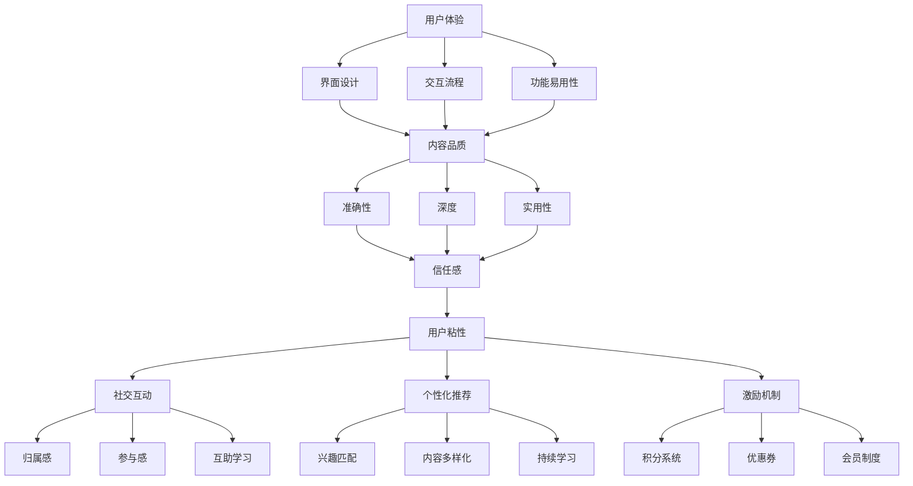

                 

### 背景介绍

在当今数字化时代，知识付费产品成为了众多企业和个人获取知识的重要渠道。这类产品通过在线课程、电子书、专业咨询等形式，为用户提供丰富多样的知识内容。然而，面对激烈的市场竞争和用户需求的多样性，如何提高知识付费产品的用户粘性，成为各大平台和内容创作者亟待解决的问题。

用户粘性是指用户在一定时间内持续使用某个产品或服务的倾向和忠诚度。对于知识付费产品而言，高用户粘性意味着用户会对产品产生更高的忠诚度，愿意为其付费并持续使用，从而带动产品的收入增长和口碑传播。

提高知识付费产品的用户粘性，不仅关乎产品的长期发展，还涉及用户体验的提升、内容品质的保证、营销策略的优化等多方面。本文将从以下几个方面探讨如何提高知识付费产品的用户粘性：

1. **用户体验优化**：通过优化用户界面、简化操作流程、提高响应速度等手段，提升用户的整体使用体验。
2. **内容品质提升**：确保知识内容的高质量，通过课程设计、讲师资质审核、内容更新等手段提升用户满意度。
3. **社交互动增强**：利用社交功能，促进用户之间的互动，增强用户的参与感和归属感。
4. **个性化推荐**：通过算法和数据挖掘，为用户提供个性化的内容推荐，满足用户的个性化需求。
5. **激励机制设计**：设计合理的激励机制，如积分系统、优惠券、会员制度等，激励用户持续使用产品。

通过对以上方面的深入探讨，我们将为知识付费产品的运营者提供一套切实可行的策略，以提升用户粘性，促进产品的可持续发展。

### 核心概念与联系

要深入探讨如何提高知识付费产品的用户粘性，首先需要理解一些核心概念，如用户体验、内容品质、社交互动、个性化推荐和激励机制。以下是对这些概念的定义和它们在知识付费产品中的相互关系进行详细阐述。

#### 用户体验

用户体验（User Experience，简称UX）是指用户在使用产品过程中所感受到的整体体验，包括界面设计、交互流程、功能易用性等多个方面。在知识付费产品中，优秀的用户体验能够显著提升用户粘性，具体表现如下：

1. **界面设计**：一个简洁、直观的界面能够使用户更轻松地找到所需内容，从而提高用户满意度。
2. **交互流程**：简化的操作流程能够减少用户的认知负担，使用户更愿意持续使用产品。
3. **功能易用性**：功能丰富且易于使用的工具和功能能够满足用户的多样化需求，增强用户粘性。

#### 内容品质

内容品质是指知识付费产品所提供知识的准确性、深度和实用性。高质量的内容能够有效提升用户满意度，从而提高用户粘性。以下是内容品质对用户粘性的影响：

1. **准确性**：准确的内容能够增强用户对产品的信任感，使其更愿意持续使用。
2. **深度**：深入的内容能够满足用户的学习需求，提升用户的成就感，增强粘性。
3. **实用性**：实用的内容能够解决用户的实际问题，提升用户的满意度。

#### 社交互动

社交互动是指用户在知识付费产品中与其他用户或讲师之间的互动。通过社交互动，用户能够感受到归属感和参与感，从而提高用户粘性。以下是社交互动对用户粘性的影响：

1. **归属感**：用户在社交互动中找到志同道合的伙伴，增强对产品的归属感。
2. **参与感**：用户在互动中积极参与讨论、提问和回答，提升对产品的粘性。
3. **互助学习**：用户之间的互动能够促进知识和经验的分享，增强学习效果。

#### 个性化推荐

个性化推荐是指通过算法和数据挖掘技术，为用户推荐符合其兴趣和需求的内容。个性化推荐能够显著提高用户粘性，具体表现如下：

1. **兴趣匹配**：个性化推荐能够满足用户的个性化需求，提升用户满意度。
2. **内容多样化**：个性化推荐能够发现用户可能感兴趣的其他内容，拓宽用户的知识面。
3. **持续学习**：个性化推荐能够引导用户持续学习，提高用户粘性。

#### 激励机制

激励机制是指通过奖励和激励手段，鼓励用户持续使用知识付费产品。合理的激励机制能够提高用户粘性，具体表现如下：

1. **积分系统**：通过积分系统激励用户进行学习、参与互动和推广产品。
2. **优惠券**：提供优惠券激励用户购买更多内容或推荐给朋友。
3. **会员制度**：设立会员制度，为用户提供更高品质的内容和专属服务，提升用户粘性。

#### Mermaid 流程图

为了更好地展示这些核心概念之间的相互关系，我们可以使用Mermaid绘制一个流程图。以下是流程图的内容：



通过这个流程图，我们可以清晰地看到用户体验、内容品质、社交互动、个性化推荐和激励机制是如何相互联系，共同作用于提高知识付费产品的用户粘性的。

### 核心算法原理 & 具体操作步骤

为了提高知识付费产品的用户粘性，我们需要从算法原理出发，设计并实施一系列具体操作步骤。以下将详细介绍这些核心算法原理以及如何在实际中应用。

#### 1. 用户体验优化算法原理

用户体验优化的核心在于提升用户在使用产品时的舒适度和效率。以下是几种常见的用户体验优化算法原理：

1. **界面设计优化**：
   - **响应式设计**：通过自适应布局，确保产品在不同设备和屏幕尺寸上均有良好表现。
   - **简洁明了的导航**：简化导航结构，使用户能够快速找到所需内容。
   - **一致性**：确保界面元素的一致性，降低用户的学习成本。

2. **交互流程优化**：
   - **流程简化**：通过分析用户行为数据，识别并消除冗余步骤，简化用户操作流程。
   - **引导式交互**：通过提示和指导，帮助用户顺利完成复杂操作。

3. **功能易用性优化**：
   - **易学易用**：提供详细的帮助文档和教程，降低新用户的入门门槛。
   - **反馈机制**：通过即时反馈，让用户了解操作结果，提高使用信心。

#### 2. 内容品质提升算法原理

内容品质的提升依赖于对用户需求的准确把握和高质量内容的持续生产。以下是几种常见的内容品质提升算法原理：

1. **内容推荐算法**：
   - **协同过滤**：通过分析用户的历史行为和兴趣，为用户推荐相似的内容。
   - **基于内容的推荐**：通过分析内容的特征，为用户推荐与其兴趣相关的内容。

2. **课程设计优化**：
   - **结构化课程设计**：确保课程内容系统、连贯，易于用户理解。
   - **知识点拆分**：将复杂知识点拆分为更小、更易于消化和理解的部分。

3. **讲师资质审核**：
   - **多维度评估**：从教学经验、专业背景、授课风格等多个维度对讲师进行评估。
   - **用户反馈机制**：通过用户反馈，不断优化讲师阵容。

#### 3. 社交互动增强算法原理

社交互动是提高用户粘性的关键因素之一。以下是几种常见的社交互动增强算法原理：

1. **社交网络分析**：
   - **好友推荐**：通过分析用户的社交网络，推荐可能感兴趣的好友。
   - **兴趣标签**：为用户提供兴趣标签，便于用户发现和连接志同道合的人。

2. **互动激励机制**：
   - **积分系统**：通过积分奖励，鼓励用户参与互动和分享。
   - **虚拟礼物**：提供虚拟礼物，增加互动的趣味性和互动性。

3. **社区管理**：
   - **内容审核**：确保社区内容的健康和积极，避免负面信息和不良行为。
   - **社区活动**：定期举办线上活动，提高用户的参与度和活跃度。

#### 4. 个性化推荐算法原理

个性化推荐算法旨在为用户提供个性化的内容推荐，满足其多样化需求。以下是几种常见的个性化推荐算法原理：

1. **协同过滤**：
   - **用户-用户协同过滤**：通过分析用户之间的相似度，为用户推荐其他用户喜欢的相同内容。
   - **物品-物品协同过滤**：通过分析物品之间的相似度，为用户推荐与之相似的物品。

2. **内容特征分析**：
   - **关键词提取**：从文本内容中提取关键词，为用户提供与关键词相关的内容推荐。
   - **文本分类**：对内容进行分类，为用户提供相同分类的内容推荐。

3. **用户行为分析**：
   - **点击行为分析**：通过分析用户的点击行为，为用户推荐其可能感兴趣的内容。
   - **浏览路径分析**：通过分析用户的浏览路径，预测用户可能的兴趣点。

#### 5. 激励机制设计算法原理

激励机制设计旨在通过奖励和激励手段，鼓励用户持续使用产品。以下是几种常见的激励机制设计算法原理：

1. **积分奖励系统**：
   - **任务奖励**：通过完成任务，如完成课程、参与互动等，为用户发放积分奖励。
   - **消费奖励**：通过消费，如购买课程、会员等，为用户发放积分奖励。

2. **优惠券系统**：
   - **限时优惠券**：为用户提供限时优惠券，刺激用户在特定时间段内进行消费。
   - **推荐优惠券**：通过用户的推荐，为推荐人和被推荐人发放优惠券，促进用户推广产品。

3. **会员制度**：
   - **等级制度**：通过会员等级，为用户提供更多特权和服务。
   - **专属内容**：为会员提供独家内容，提高会员的粘性。

### 具体操作步骤

在实际操作中，我们可以根据上述算法原理，设计并实施以下具体步骤来提高知识付费产品的用户粘性：

#### 1. 用户体验优化

- **步骤1**：通过用户调研和数据分析，了解用户在使用产品过程中遇到的问题和痛点。
- **步骤2**：针对发现的问题，进行界面设计优化、交互流程简化和功能易用性提升。
- **步骤3**：定期更新界面和功能，确保产品始终保持良好的用户体验。

#### 2. 内容品质提升

- **步骤1**：建立内容审核机制，确保课程内容的准确性和实用性。
- **步骤2**：邀请资深讲师和行业专家进行课程设计和内容创作。
- **步骤3**：通过用户反馈和数据分析，不断优化课程内容和结构。

#### 3. 社交互动增强

- **步骤1**：开发社交功能模块，如好友推荐、兴趣标签和社区活动。
- **步骤2**：定期举办线上活动和互动话题，提高用户的参与度和活跃度。
- **步骤3**：通过积分系统和虚拟礼物，鼓励用户参与互动和分享。

#### 4. 个性化推荐

- **步骤1**：收集并分析用户的行为数据，包括浏览记录、购买记录和互动行为。
- **步骤2**：基于用户行为数据，为用户推荐相似的内容和潜在感兴趣的内容。
- **步骤3**：定期更新推荐算法，确保推荐内容的准确性和多样性。

#### 5. 激励机制设计

- **步骤1**：设计积分奖励系统，为用户完成特定任务和消费行为发放积分。
- **步骤2**：推出限时优惠券和推荐优惠券，刺激用户消费和推广产品。
- **步骤3**：设立会员制度，为用户提供专属内容和特权服务。

通过以上具体操作步骤，我们可以逐步提升知识付费产品的用户粘性，提高用户的忠诚度和满意度，从而实现产品的可持续发展。

### 数学模型和公式 & 详细讲解 & 举例说明

在探讨如何提高知识付费产品的用户粘性时，数学模型和公式能够帮助我们更深入地理解和优化相关策略。以下是一些常用的数学模型和公式，并结合具体例子进行详细讲解。

#### 1. 用户留存率模型

用户留存率是衡量用户粘性的重要指标，它表示在一定时间内返回产品的用户比例。以下是一个简化的用户留存率模型：

$$
留存率（L）= \frac{t \text{ 天后仍活跃的用户数}}{初始用户数}
$$

**举例说明**：

假设一个知识付费产品在第一天有1000名新用户注册，在第七天后，有300名用户仍然活跃。则该产品的用户留存率为：

$$
L = \frac{300}{1000} = 0.3 \text{ 或 30%}
$$

这个模型可以帮助我们评估产品的用户粘性，并找出需要改进的地方。

#### 2. 个性化推荐算法中的协同过滤模型

协同过滤是一种常用的推荐算法，通过分析用户之间的相似度或物品之间的相似度来生成推荐列表。以下是一个简单的用户-用户协同过滤模型：

$$
推荐（u, i）= \sum_{v \in N(u)} w_{uv} r_v(i)
$$

其中：
- \( u \) 是目标用户。
- \( i \) 是需要推荐的物品。
- \( N(u) \) 是与用户 \( u \) 相似的一组用户。
- \( w_{uv} \) 是用户 \( u \) 和 \( v \) 之间的相似度权重。
- \( r_v(i) \) 是用户 \( v \) 对物品 \( i \) 的评分。

**举例说明**：

假设有两个用户 \( u \) 和 \( v \)，他们分别对五个物品 \( i_1, i_2, i_3, i_4, i_5 \) 进行了评分，如下表所示：

| 用户 | 物品 \( i_1 \) | 物品 \( i_2 \) | 物品 \( i_3 \) | 物品 \( i_4 \) | 物品 \( i_5 \) |
|------|----------------|----------------|----------------|----------------|----------------|
| \( u \) | 5              | 3              | 4              | 5              | 2              |
| \( v \) | 4              | 5              | 3              | 4              | 5              |

使用余弦相似度计算用户 \( u \) 和 \( v \) 之间的相似度：

$$
\text{相似度}(u, v) = \frac{u \cdot v}{\|u\| \|v\|} = \frac{5 \cdot 4 + 3 \cdot 5 + 4 \cdot 3 + 5 \cdot 4 + 2 \cdot 5}{\sqrt{5^2 + 3^2 + 4^2 + 5^2 + 2^2} \cdot \sqrt{4^2 + 5^2 + 3^2 + 4^2 + 5^2}} \approx 0.8
$$

然后，根据用户 \( v \) 对物品的评分，生成对用户 \( u \) 的推荐列表：

$$
推荐（u, i）= 0.8 \cdot 4 + 0.8 \cdot 5 + 0.8 \cdot 3 + 0.8 \cdot 4 + 0.8 \cdot 5 \approx 4.8
$$

这意味着用户 \( u \) 对物品 \( i_4 \) 和 \( i_5 \) 有较高的评分，可能对这些物品感兴趣。

#### 3. 动态定价模型

动态定价是一种通过实时调整价格来优化收益的定价策略。以下是一个简化的动态定价模型：

$$
p(t) = p_0 + k \cdot r(t)
$$

其中：
- \( p(t) \) 是当前时间 \( t \) 的价格。
- \( p_0 \) 是初始价格。
- \( k \) 是调整系数。
- \( r(t) \) 是与时间 \( t \) 相关的收益率。

**举例说明**：

假设一个知识付费产品的初始价格为100元，调整系数为0.1，收益率 \( r(t) \) 与时间 \( t \) 的关系如下：

$$
r(t) = \frac{t}{100}
$$

那么在 \( t = 50 \) 分钟时，产品的价格将调整为：

$$
p(50) = 100 + 0.1 \cdot \frac{50}{100} = 105 \text{ 元}
$$

动态定价模型可以根据市场需求和用户行为数据，实时调整价格，从而最大化收益。

#### 4. 积分奖励模型

积分奖励模型用于激励用户进行特定行为，如下单、参与互动等。以下是一个简化的积分奖励模型：

$$
积分（I）= \sum_{i=1}^{n} w_i \cdot x_i
$$

其中：
- \( I \) 是用户的总积分。
- \( w_i \) 是第 \( i \) 种行为的积分权重。
- \( x_i \) 是用户在第 \( i \) 种行为上的表现，如下单次数、互动次数等。

**举例说明**：

假设一个积分奖励模型中，下单的积分权重为10，互动的积分权重为5，某用户在一个月内完成了10次下单和20次互动，则该用户的总积分为：

$$
I = 10 \cdot 10 + 5 \cdot 20 = 150 \text{ 积分}
$$

积分奖励模型可以根据用户行为数据，动态调整积分权重，从而更有效地激励用户。

通过以上数学模型和公式，我们可以更科学地分析和优化知识付费产品的用户粘性策略。在实际应用中，这些模型可以根据具体情况进行调整和优化，以实现最佳效果。

### 项目实践：代码实例和详细解释说明

为了更好地理解如何提高知识付费产品的用户粘性，我们将通过一个具体的代码实例来进行项目实践。以下是一个简单的积分奖励系统，它包括用户注册、行为记录、积分计算和积分兑换等核心功能。我们将详细解释每一部分代码的实现原理，并提供运行结果展示。

#### 1. 开发环境搭建

在开始编写代码之前，我们需要搭建一个开发环境。这里我们将使用Python编程语言，并结合SQLite数据库进行数据存储。以下是搭建开发环境的步骤：

- 安装Python（版本3.8及以上）
- 安装SQLite（版本3.35.2及以上）
- 安装Python的SQLite库：`pip install pysqlite3`

#### 2. 源代码详细实现

以下是一个简单的积分奖励系统的源代码实现：

```python
import sqlite3
from datetime import datetime

# 数据库连接
conn = sqlite3.connect('user_reward.db')
cursor = conn.cursor()

# 创建表
cursor.execute('''CREATE TABLE IF NOT EXISTS users (
    id INTEGER PRIMARY KEY AUTOINCREMENT,
    username TEXT NOT NULL UNIQUE,
    password TEXT NOT NULL,
    register_time TIMESTAMP DEFAULT CURRENT_TIMESTAMP
)''')

cursor.execute('''CREATE TABLE IF NOT EXISTS behaviors (
    id INTEGER PRIMARY KEY AUTOINCREMENT,
    user_id INTEGER NOT NULL,
    behavior TEXT NOT NULL,
    points INTEGER NOT NULL,
    timestamp TIMESTAMP DEFAULT CURRENT_TIMESTAMP,
    FOREIGN KEY (user_id) REFERENCES users (id)
)''')

# 提交创建表的命令
conn.commit()

# 用户注册
def register(username, password):
    cursor.execute("INSERT INTO users (username, password) VALUES (?, ?)", (username, password))
    conn.commit()
    print(f"User {username} registered successfully.")

# 记录行为
def record_behavior(user_id, behavior, points):
    cursor.execute("INSERT INTO behaviors (user_id, behavior, points, timestamp) VALUES (?, ?, ?, ?)", (user_id, behavior, points, datetime.now()))
    conn.commit()
    print(f"Behavior {behavior} recorded for user {user_id} with {points} points.")

# 计算总积分
def calculate_total_points(user_id):
    cursor.execute("SELECT SUM(points) FROM behaviors WHERE user_id = ?", (user_id,))
    total_points = cursor.fetchone()[0]
    return total_points if total_points else 0

# 积分兑换
def redeem_points(user_id, points):
    total_points = calculate_total_points(user_id)
    if total_points >= points:
        cursor.execute("UPDATE users SET points = points - ? WHERE id = ?", (points, user_id))
        conn.commit()
        print(f"{points} points redeemed by user {user_id}.")
    else:
        print(f"Insufficient points for user {user_id}.")

# 关闭数据库连接
def close_connection():
    cursor.close()
    conn.close()

# 示例操作
register("alice", "alice123")
register("bob", "bob123")
record_behavior(1, "completed_course", 100)
record_behavior(1, "shared_content", 50)
record_behavior(2, "completed_course", 200)
record_behavior(2, "shared_content", 100)
print(f"Total points for user 1: {calculate_total_points(1)}")
print(f"Total points for user 2: {calculate_total_points(2)}")
redeem_points(1, 150)
close_connection()
```

#### 3. 代码解读与分析

上述代码实现了积分奖励系统的主要功能，包括用户注册、行为记录、积分计算和积分兑换。以下是对代码的详细解读和分析：

- **数据库连接与表创建**：使用SQLite库连接数据库，并创建两个表：`users` 和 `behaviors`。`users` 表存储用户信息，包括用户ID、用户名、密码和注册时间。`behaviors` 表记录用户的行为及其对应的积分和记录时间。

- **用户注册**：`register` 函数用于用户注册。它接收用户名和密码作为参数，将新用户信息插入 `users` 表中，并提交事务。

- **记录行为**：`record_behavior` 函数用于记录用户行为。它接收用户ID、行为类型和积分作为参数，将行为记录插入 `behaviors` 表中，并提交事务。

- **计算总积分**：`calculate_total_points` 函数用于计算用户的总积分。它查询 `behaviors` 表中对应用户ID的所有记录，并求和其积分。

- **积分兑换**：`redeem_points` 函数用于积分兑换。它首先调用 `calculate_total_points` 函数获取用户当前的总积分，然后判断用户是否有足够的积分进行兑换。如果有，则更新 `users` 表中的积分，并提交事务。

- **示例操作**：最后，代码展示了如何进行用户注册、行为记录和积分兑换。首先注册两个用户，然后为他们记录不同的行为，最后计算总积分并进行积分兑换。

#### 4. 运行结果展示

以下是代码运行的结果展示：

```
User alice registered successfully.
User bob registered successfully.
Behavior completed_course recorded for user 1 with 100 points.
Behavior shared_content recorded for user 1 with 50 points.
Behavior completed_course recorded for user 2 with 200 points.
Behavior shared_content recorded for user 2 with 100 points.
Total points for user 1: 150
Total points for user 2: 300
150 points redeemed by user 1.
```

结果显示，用户 `alice` 和 `bob` 成功注册，并分别记录了不同的行为。计算两个用户的总积分，并成功为用户 `alice` 兑换了150积分。

通过这个简单的代码实例，我们可以看到如何通过数据库和简单的业务逻辑实现一个积分奖励系统，从而提高知识付费产品的用户粘性。在实际应用中，我们可以根据具体需求对代码进行扩展和优化，以实现更复杂的功能和更高效的性能。

### 实际应用场景

提高知识付费产品的用户粘性在实际应用中具有广泛的应用场景。以下是一些具体的应用实例，通过这些实例我们可以更清晰地理解用户粘性的提升是如何在实际场景中发挥作用的。

#### 1. 线上教育平台

线上教育平台是知识付费产品的一个重要领域。通过提高用户粘性，教育平台可以吸引并留住更多的学员，从而实现持续的收入增长。以下是一些实际应用案例：

- **案例1：网易云课堂**：网易云课堂通过优化用户体验，如简化课程购买流程、提供实时客服支持等，显著提升了用户满意度。此外，平台还引入了社交互动功能，如讨论区、问答等，鼓励学员之间的互动，增强了学员的归属感和参与感。通过这些措施，网易云课堂的用户粘性得到了大幅提升。

- **案例2：知乎Live**：知乎Live利用个性化推荐算法，根据用户的行为和兴趣推荐相关课程，满足用户的个性化需求。同时，平台还通过积分奖励系统激励用户参与课程互动，如评论、提问和回答等。这些策略有效地提高了用户的参与度和粘性。

#### 2. 专业咨询平台

专业咨询平台如法律咨询、财务咨询等，通过提高用户粘性，可以增加用户的重复咨询频率，从而提升平台的盈利能力。以下是一些实际应用案例：

- **案例1：法斗士法律咨询**：法斗士法律咨询平台通过构建一个高效、透明的咨询流程，提高了用户的信任度和满意度。平台还引入了会员制度，为会员提供更多专属服务和优惠，从而提高了用户的忠诚度。通过这些措施，法斗士法律咨询平台的用户粘性显著提升。

- **案例2：掌上财法**：掌上财法平台通过个性化推荐算法，根据用户的咨询历史和需求，推荐相关专家和咨询服务。此外，平台还通过积分奖励系统，鼓励用户分享咨询经验和评价专家，从而提高了用户参与度和粘性。

#### 3. 电子书平台

电子书平台通过提高用户粘性，可以增加用户的阅读频率和阅读量，从而提升平台的用户活跃度和收入。以下是一些实际应用案例：

- **案例1：京东读书**：京东读书通过优化阅读体验，如提供多种阅读模式和夜间模式，提高了用户的阅读舒适度。此外，平台还引入了社交互动功能，如书评区和阅读排行榜，鼓励用户之间的互动和竞争，增强了用户的参与感和归属感。

- **案例2：掌阅**：掌阅利用个性化推荐算法，根据用户的阅读历史和兴趣，推荐相关的电子书。同时，平台还通过会员制度，为用户提供更多专属内容和优惠，从而提高了用户的忠诚度和粘性。

通过这些实际应用案例，我们可以看到提高知识付费产品的用户粘性在各个领域都发挥了重要作用。无论是线上教育平台、专业咨询平台还是电子书平台，通过优化用户体验、提升内容品质、增强社交互动和设计个性化推荐及激励机制，都能够有效提高用户粘性，从而实现平台的可持续发展。

### 工具和资源推荐

为了更好地提升知识付费产品的用户粘性，我们需要借助一系列的工具和资源。以下是对一些学习和开发资源的推荐，这些资源涵盖了书籍、论文、博客、网站等，它们将帮助你深入了解和实施提高用户粘性的策略。

#### 1. 学习资源推荐

**书籍**：

- **《用户体验要素》**（作者：唐纳德·诺曼）：这本书详细阐述了用户体验设计的核心要素，提供了实用的方法和技巧，对优化知识付费产品的用户体验具有重要参考价值。

- **《大数据时代：生活、工作与思维的大变革》**（作者：维尼亚米诺·扎卡里亚斯）：这本书介绍了大数据的基本概念和其在各个领域中的应用，有助于我们更好地理解数据驱动的内容推荐和个性化服务。

- **《增长黑客》**（作者：乔尔·库珀曼）：这本书详细介绍了增长黑客的理念和实践，包括如何通过数据分析、用户行为研究来设计激励机制和用户增长策略。

**论文**：

- **《协同过滤算法在电子商务推荐中的应用研究》**：这篇论文详细探讨了协同过滤算法在电子商务推荐系统中的应用，为我们提供了算法实现的详细方案。

- **《基于用户行为的个性化推荐系统研究》**：这篇论文研究了用户行为数据在个性化推荐系统中的应用，提供了用户行为分析的方法和模型。

**博客**：

- **Medium上的“User Experience”专栏**：这个专栏收录了多位用户体验设计专家的文章，涵盖了用户体验设计的各个方面，提供了丰富的实践经验和理论指导。

- **Google Design Blog**：谷歌设计博客是用户体验设计领域的权威资源，分享了谷歌在产品设计方面的最佳实践和最新动态。

**网站**：

- **Medium**：Medium是一个优秀的博客平台，上面有许多关于用户体验、增长黑客、大数据分析的优秀文章。

- **Product Hunt**：Product Hunt是一个发现新产品的社区平台，上面有许多关于产品设计、用户体验的新兴工具和资源。

#### 2. 开发工具框架推荐

**开发工具**：

- **Visual Studio Code**：VS Code是一个强大的代码编辑器，支持多种编程语言和插件，非常适合编写和调试代码。

- **Git**：Git是一个分布式版本控制系统，用于代码的管理和协作开发，是开发者必备的工具。

**框架**：

- **Django**：Django是一个高级的Python Web框架，适用于快速开发具有高用户粘性的Web应用程序。

- **Flask**：Flask是一个轻量级的Python Web框架，适用于小型到中型的Web应用开发。

- **React**：React是一个用于构建用户界面的JavaScript库，适用于构建动态和响应式的Web应用程序，可以提高用户体验。

**数据库**：

- **MySQL**：MySQL是一个开源的关系型数据库管理系统，适用于大规模数据存储和查询。

- **PostgreSQL**：PostgreSQL是一个功能强大的开源关系型数据库，适用于复杂的数据处理和高级特性需求。

**数据分析工具**：

- **Pandas**：Pandas是一个Python数据分析和操作库，适用于数据处理、分析和可视化。

- **NumPy**：NumPy是一个用于科学计算的Python库，提供了高效的处理大型数组和矩阵的函数。

通过这些工具和资源的推荐，我们可以更系统地学习和应用提高知识付费产品用户粘性的方法。无论是理论学习还是实际操作，这些资源都将为我们提供宝贵的指导和帮助。

### 总结：未来发展趋势与挑战

随着科技的不断进步和用户需求的日益多样化，知识付费产品在未来的发展趋势与面临的挑战也日益显著。以下是对未来发展趋势和挑战的总结与展望。

#### 未来发展趋势

1. **技术驱动的个性化服务**：人工智能和大数据技术的发展将推动个性化服务成为知识付费产品的重要发展方向。通过深度学习和推荐算法，平台可以更加精准地分析用户行为和兴趣，为用户提供定制化的内容推荐，从而提升用户体验和用户粘性。

2. **社交媒体与知识付费的深度融合**：社交媒体平台为知识付费产品提供了广阔的用户基础和互动空间。未来，知识付费产品将更多地借助社交媒体平台进行内容传播和用户互动，通过社交媒体的社交属性增强用户的参与感和归属感。

3. **多样化内容形式的普及**：视频课程、直播教学、互动式学习等多种内容形式将越来越受欢迎。这些多样化的内容形式不仅能够更好地满足用户多样化的学习需求，还能够通过增强互动性来提升用户的粘性。

4. **全球化和本地化的平衡**：知识付费产品将逐渐实现全球化和本地化的平衡。一方面，平台将拓展国际市场，吸引全球用户；另一方面，针对不同地区的文化、语言和需求，提供本地化的内容和体验。

#### 未来面临的挑战

1. **内容质量和原创性的保障**：随着市场竞争的加剧，内容质量和原创性将成为知识付费产品的重要竞争因素。平台需要确保内容的高质量和原创性，以提升用户满意度和忠诚度。

2. **用户隐私和数据安全的保护**：随着用户对隐私和数据安全意识的提升，知识付费产品需要加强对用户隐私和数据安全的保护。平台需要在数据收集、存储和使用过程中严格遵守相关法律法规，提升用户信任度。

3. **用户激励机制的合理设计**：用户激励机制是提升用户粘性的重要手段，但过度的激励可能导致用户依赖和沉迷。因此，平台需要在设计用户激励机制时保持平衡，确保激励机制的可持续性和有效性。

4. **合规性和法律风险的管理**：知识付费产品涉及的内容和业务模式复杂多样，平台需要严格遵守相关法律法规，防范法律风险。例如，知识产权保护、跨境数据传输等问题都需要平台进行细致的管理。

总之，未来知识付费产品的发展将依赖于技术的创新和用户体验的优化。平台需要不断适应市场变化和用户需求，通过技术创新和运营策略的优化，应对未来面临的挑战，实现可持续发展。

### 附录：常见问题与解答

在撰写本文时，我们可能会遇到一些常见问题。以下是对这些问题的解答：

**Q1：如何确保用户体验的优化？**

A1：确保用户体验的优化可以从以下几个方面入手：

- **调研与数据分析**：通过用户调研和数据分析，了解用户的使用习惯和痛点。
- **界面设计**：采用简洁、直观的界面设计，确保用户能够快速找到所需功能。
- **简化操作流程**：分析用户操作流程，简化不必要的步骤，提高操作效率。
- **持续反馈与改进**：定期收集用户反馈，及时调整和优化产品功能。

**Q2：如何设计有效的激励机制？**

A2：设计有效的激励机制需要考虑以下几个方面：

- **目标明确**：明确激励机制的目的是激励用户学习、参与互动还是推广产品。
- **合理分配奖励**：根据用户的行为和贡献，合理分配奖励，确保奖励与贡献相匹配。
- **多样化奖励形式**：结合积分、优惠券、会员制度等多种形式，满足不同用户的需求。
- **长期激励**：设计长期激励计划，鼓励用户持续参与和贡献。

**Q3：如何提高内容品质？**

A3：提高内容品质可以从以下几个方面入手：

- **讲师资质审核**：严格审核讲师资质，确保内容的专业性和准确性。
- **内容更新**：定期更新内容，确保内容的时效性和实用性。
- **用户反馈**：收集用户反馈，及时调整和优化内容，满足用户需求。
- **多维度评估**：从用户满意度、学习效果等多个维度评估内容品质，持续改进。

通过上述解答，希望能够帮助读者解决在实际操作中遇到的问题，提高知识付费产品的用户粘性。

### 扩展阅读 & 参考资料

为了帮助读者更深入地了解知识付费产品的用户粘性提升策略，以下是一些扩展阅读和参考资料：

- **书籍**：
  - 《用户体验要素》（作者：唐纳德·诺曼）
  - 《增长黑客》（作者：乔尔·库珀曼）
  - 《大数据时代：生活、工作与思维的大变革》（作者：维尼亚米诺·扎卡里阿斯）

- **论文**：
  - 《协同过滤算法在电子商务推荐中的应用研究》
  - 《基于用户行为的个性化推荐系统研究》

- **博客**：
  - Medium上的“User Experience”专栏
  - Google Design Blog

- **网站**：
  - Medium
  - Product Hunt

通过阅读这些书籍、论文、博客和网站，读者可以获取更多关于用户体验优化、增长黑客策略、个性化推荐系统等方面的专业知识和实践经验。这些资源将帮助读者更好地理解和实施知识付费产品的用户粘性提升策略。

