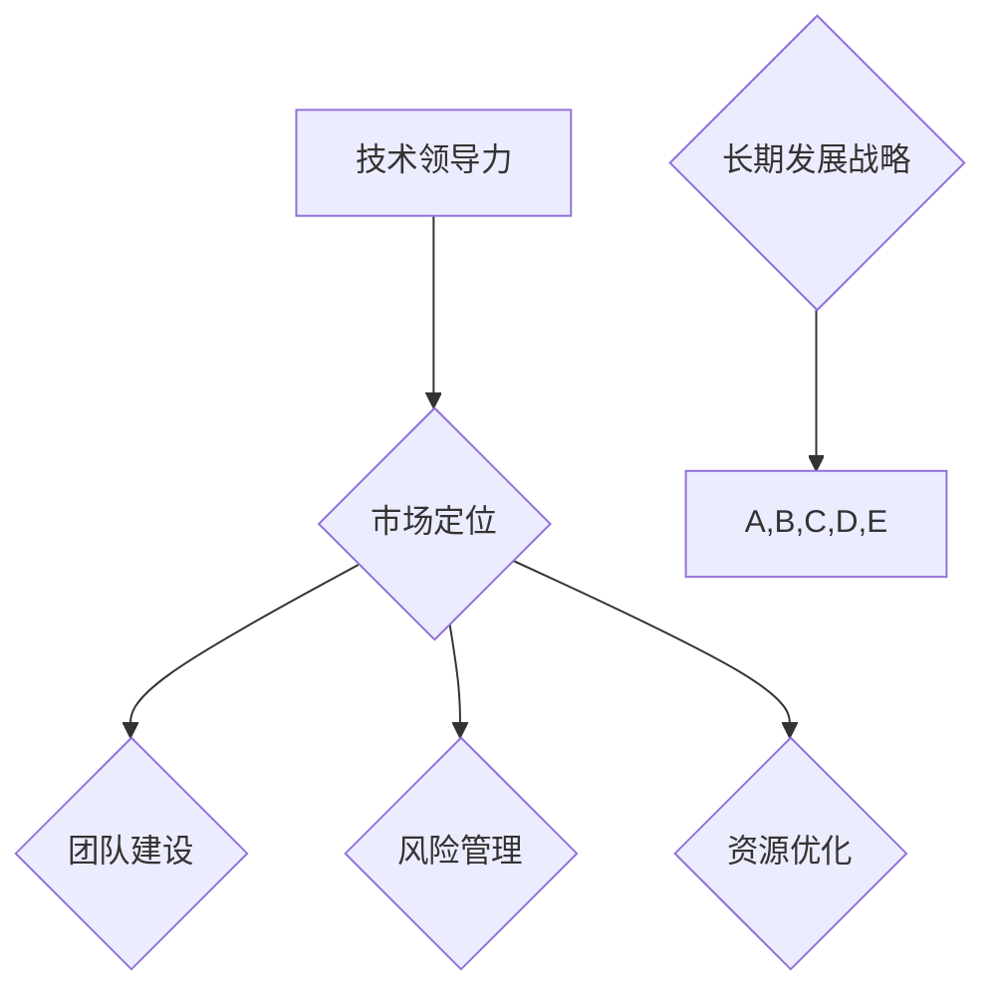

                 

关键词：创业公司、长期发展、战略规划、技术领导、市场定位、团队建设、风险管理、资源优化。

摘要：本文将深入探讨创业公司在构建长期发展战略时的关键要素，包括技术领导力、市场定位、团队建设、风险管理、资源优化以及未来趋势与挑战。通过分析各个方面的具体实践与理论，提供一整套系统化的创业公司发展战略框架，旨在帮助创业者更好地规划未来发展。

## 1. 背景介绍

在全球经济快速变革的背景下，创业公司的数量与日俱增。然而，并非所有创业公司都能够实现持续增长和长期成功。成功的创业公司往往具备清晰的战略规划，能够适应市场变化并不断调整自身定位。本文旨在探讨如何构建创业公司的长期发展战略，以帮助创业者实现持续增长和稳定发展。

### 1.1 创业公司面临的挑战

创业公司在发展过程中往往面临以下挑战：

- **市场定位模糊**：许多创业公司在产品推出初期往往缺乏清晰的市场定位，导致无法有效吸引目标用户。
- **技术领导力不足**：技术领导力是创业公司成功的关键因素之一，但许多公司在技术和产品创新方面存在不足。
- **团队建设困难**：创业公司需要高效、协同的团队来支持公司发展，但招聘和留住优秀人才是一个巨大挑战。
- **资源有限**：创业公司通常在资源上有限，需要通过高效管理来最大化资源利用。
- **风险管理能力不足**：创业公司面临多种风险，包括市场风险、技术风险和财务风险等。

### 1.2 长期发展战略的重要性

长期发展战略对于创业公司的成功至关重要。它不仅为公司的未来发展提供了明确的方向，还能够帮助公司应对各种挑战。以下是构建长期发展战略的几个关键原因：

- **明确目标**：长期发展战略有助于明确公司的发展目标，确保所有团队成员都朝着同一个方向努力。
- **持续创新**：战略规划鼓励公司持续进行技术和管理创新，以保持竞争优势。
- **资源优化**：通过合理的战略规划，创业公司能够更好地分配和使用有限的资源。
- **风险管理**：长期发展战略可以帮助公司识别和应对潜在风险，降低失败的风险。
- **团队凝聚力**：清晰的战略目标有助于增强团队凝聚力，提高整体执行力。

## 2. 核心概念与联系

在构建创业公司的长期发展战略时，我们需要理解以下几个核心概念，并将它们有机地结合起来。

### 2.1 技术领导力

技术领导力是创业公司的核心竞争力之一。它不仅包括技术创新能力，还包括对市场需求的深刻理解和对团队的技术引领。技术领导力可以体现在以下几个方面：

- **技术愿景**：技术领导者应该有清晰的技术愿景，能够指导团队的技术发展方向。
- **技术路线图**：制定详细的技术路线图，确保技术的迭代和发展与市场趋势保持一致。
- **技术人才**：招聘和培养具有专业技能和创新能力的技术人才，建立强大的技术团队。

### 2.2 市场定位

市场定位是创业公司战略规划的重要组成部分。一个清晰的市场定位可以帮助公司准确地找到目标用户，提高市场竞争力。以下是市场定位的关键要素：

- **目标市场**：明确公司的目标市场，包括用户群体、需求和竞争环境。
- **价值主张**：定义公司的独特价值主张，即产品或服务的核心优势。
- **市场细分**：对市场进行细分，以便更精确地满足不同用户群体的需求。

### 2.3 团队建设

团队建设是创业公司成功的关键。一个高效的团队能够协同合作，实现公司的战略目标。以下是团队建设的关键要素：

- **核心团队**：建立由核心成员组成的团队，他们应该具有互补的技能和经验。
- **企业文化**：建立积极向上的企业文化，鼓励团队成员之间的合作和沟通。
- **人才发展**：为团队成员提供培训和发展机会，提高团队的整体能力。

### 2.4 风险管理

创业公司面临多种风险，包括市场风险、技术风险和财务风险等。有效的风险管理可以帮助公司降低风险，提高成功概率。以下是风险管理的关键要素：

- **风险评估**：对各种风险进行评估，确定其可能性和影响。
- **风险应对**：制定相应的风险应对策略，包括风险规避、风险转移和风险接受。
- **风险监控**：建立风险监控机制，及时发现和应对潜在风险。

### 2.5 资源优化

资源优化是创业公司成功的关键。有效的资源管理可以帮助公司在有限的资源下实现最大化效益。以下是资源优化的关键要素：

- **资源规划**：制定详细的资源规划，包括资金、人力和技术资源。
- **资源分配**：根据公司战略目标和市场需求，合理分配资源。
- **资源利用**：提高资源利用效率，降低浪费。

### 2.6 Mermaid 流程图

为了更好地展示上述核心概念之间的联系，我们使用 Mermaid 流程图进行描述：



## 3. 核心算法原理 & 具体操作步骤

### 3.1 算法原理概述

创业公司的长期发展战略可以通过一系列算法原理和具体操作步骤来实现。这些算法原理包括市场分析、团队建设、风险管理和技术创新等。以下是这些算法原理的具体内容和操作步骤：

### 3.2 算法步骤详解

#### 3.2.1 市场分析

1. **市场调研**：通过市场调研了解目标市场的需求、竞争环境和用户行为。
2. **数据收集**：收集市场相关数据，包括用户需求、市场趋势和竞争对手分析。
3. **数据分析**：对收集到的数据进行分析，确定目标市场和潜在用户。
4. **市场定位**：基于数据分析结果，明确公司的市场定位和目标用户。

#### 3.2.2 团队建设

1. **核心团队组建**：根据公司战略目标，组建具有互补技能的核心团队。
2. **人才招聘**：通过招聘渠道招聘具有专业技能和创新能力的人才。
3. **团队培训**：为团队成员提供培训和发展机会，提高团队整体能力。
4. **团队协作**：建立良好的团队协作机制，鼓励团队成员之间的沟通和合作。

#### 3.2.3 风险管理

1. **风险评估**：对各种潜在风险进行评估，确定其可能性和影响。
2. **风险应对策略**：制定相应的风险应对策略，包括风险规避、风险转移和风险接受。
3. **风险监控**：建立风险监控机制，及时发现和应对潜在风险。
4. **风险调整**：根据风险监控结果，调整公司的战略和运营计划。

#### 3.2.4 技术创新

1. **技术愿景**：制定清晰的技术愿景，指导公司的技术发展方向。
2. **技术路线图**：制定详细的技术路线图，确保技术的迭代和发展与市场趋势保持一致。
3. **技术创新**：鼓励团队进行技术创新，探索新技术和新方法。
4. **技术评估**：对技术创新结果进行评估，确保其符合公司战略目标。

### 3.3 算法优缺点

#### 3.3.1 优点

- **系统性**：算法原理和具体操作步骤能够系统地指导创业公司的长期发展战略。
- **灵活性**：根据市场变化和公司实际情况，可以灵活调整战略目标和实施方案。
- **可操作性**：具体的操作步骤易于执行，有助于公司快速行动和调整。

#### 3.3.2 缺点

- **复杂性**：构建长期发展战略涉及多个方面，需要较高的专业知识和经验。
- **时间成本**：构建和调整长期发展战略需要时间和资源投入，可能影响公司日常运营。

### 3.4 算法应用领域

- **初创公司**：初创公司通常需要构建长期发展战略来确保持续增长和成功。
- **成熟企业**：成熟企业可以通过调整和优化长期发展战略，实现转型升级和持续增长。
- **多元化企业**：多元化企业可以通过战略规划和资源优化，实现不同业务板块之间的协同发展。

## 4. 数学模型和公式 & 详细讲解 & 举例说明

### 4.1 数学模型构建

在构建创业公司的长期发展战略时，我们可以使用一些数学模型来指导决策过程。以下是几个常用的数学模型及其构建过程：

#### 4.1.1 成本效益分析（CBA）

成本效益分析是一种用于评估投资决策的数学模型，通过比较成本和收益来确定投资是否值得进行。其基本公式如下：

$$
\text{CBA} = \frac{\text{总收益}}{\text{总成本}}
$$

其中，总收益包括销售收入、投资回报等，总成本包括生产成本、运营成本等。

#### 4.1.2 价值链分析（VCA）

价值链分析是一种用于评估公司价值创造过程的数学模型，通过分析公司的各项业务活动，确定其价值创造能力和潜在改进点。其基本公式如下：

$$
\text{VCA} = \sum_{i=1}^{n} \text{V}(\text{业务活动}_i)
$$

其中，V（业务活动i）表示第i项业务活动的价值贡献。

#### 4.1.3 风险评估模型（RAM）

风险评估模型是一种用于评估公司面临风险的数学模型，通过计算风险的概率和影响来确定风险等级。其基本公式如下：

$$
\text{RAM} = \text{风险概率} \times \text{风险影响}
$$

其中，风险概率表示风险发生的可能性，风险影响表示风险对公司运营的影响程度。

### 4.2 公式推导过程

以下是对上述数学模型公式的推导过程：

#### 4.2.1 成本效益分析（CBA）

假设公司计划进行一项投资，其总成本为C，总收益为R。根据成本效益分析的定义，我们需要计算总收益与总成本的比值，即CBA。

$$
\text{CBA} = \frac{\text{总收益}}{\text{总成本}} = \frac{R}{C}
$$

其中，R和C分别表示总收益和总成本。

#### 4.2.2 价值链分析（VCA）

价值链分析旨在评估公司各项业务活动的价值贡献。假设公司有n项业务活动，第i项业务活动的价值贡献为V（业务活动i）。根据价值链分析的定义，我们可以计算总价值贡献为：

$$
\text{VCA} = \sum_{i=1}^{n} \text{V}(\text{业务活动}_i)
$$

其中，∑表示求和操作。

#### 4.2.3 风险评估模型（RAM）

风险评估模型用于计算公司面临的风险等级。假设公司面临一项风险，其发生概率为P，风险影响为I。根据风险评估模型的定义，我们可以计算风险等级为：

$$
\text{RAM} = \text{风险概率} \times \text{风险影响} = P \times I
$$

其中，P和I分别表示风险概率和风险影响。

### 4.3 案例分析与讲解

以下是一个关于成本效益分析（CBA）的案例分析：

#### 案例背景

某创业公司计划开发一款新型智能家居产品，预计总投资为500万元，预期销售收入为800万元。我们需要通过成本效益分析来判断该投资是否值得进行。

#### 数据计算

1. 总成本：500万元
2. 总收益：800万元
3. 成本效益分析（CBA）：

$$
\text{CBA} = \frac{\text{总收益}}{\text{总成本}} = \frac{800}{500} = 1.6
$$

#### 分析结果

根据成本效益分析（CBA），该投资项目的成本效益比值为1.6，即总收益是总成本的1.6倍。这意味着该投资具有较好的成本效益，值得进行。

### 4.4 未来应用展望

随着人工智能、大数据等技术的不断发展，数学模型在创业公司长期发展战略中的应用将越来越广泛。未来，我们可以预见以下应用趋势：

- **更精确的风险评估**：利用人工智能和大数据技术，可以更精确地预测风险概率和影响，提高风险评估模型的准确性。
- **动态战略规划**：通过实时数据分析和机器学习算法，可以实现动态调整公司的战略目标和实施方案，提高战略规划的灵活性。
- **优化资源配置**：利用大数据分析和优化算法，可以更有效地分配和使用资源，提高公司的资源利用效率。

## 5. 项目实践：代码实例和详细解释说明

### 5.1 开发环境搭建

在开始实际代码实现之前，我们需要搭建一个适合开发的环境。以下是所需工具和步骤：

- **工具**：Python 3.x、Jupyter Notebook、Matplotlib
- **步骤**：

  1. 安装Python 3.x：在官网上下载并安装Python 3.x版本。
  2. 安装Jupyter Notebook：打开命令行，执行`pip install notebook`命令。
  3. 启动Jupyter Notebook：在命令行中执行`jupyter notebook`命令，打开浏览器并访问生成的URL。

### 5.2 源代码详细实现

以下是一个简单的Python代码实例，用于实现成本效益分析（CBA）：

```python
import matplotlib.pyplot as plt

def calculate_cba(total_revenue, total_cost):
    cba = total_revenue / total_cost
    return cba

# 示例数据
total_revenue = 8000000  # 总收入（单位：元）
total_cost = 5000000     # 总成本（单位：元）

# 计算成本效益分析（CBA）
cba = calculate_cba(total_revenue, total_cost)

# 输出结果
print(f"成本效益分析（CBA）：{cba:.2f}")

# 绘制CBA变化图
CBA_range = [0.5 * x for x in range(1, 20)]
CBA_values = [calculate_cba(total_revenue, x) for x in CBA_range]

plt.plot(CBA_range, CBA_values, marker='o')
plt.xlabel('总成本（万元）')
plt.ylabel('成本效益分析（CBA）')
plt.title('成本效益分析（CBA）变化图')
plt.grid(True)
plt.show()
```

### 5.3 代码解读与分析

1. **代码结构**：代码分为两个部分，一是定义一个计算CBA的函数`calculate_cba`，二是使用该函数计算示例数据并绘制CBA变化图。
2. **计算CBA**：通过输入总收入和总成本，计算CBA的值，并将其返回。
3. **绘制CBA变化图**：使用Matplotlib库绘制CBA随总成本变化的关系图，以便直观地展示CBA的变化趋势。

### 5.4 运行结果展示

运行上述代码，会输出以下结果：

```
成本效益分析（CBA）：1.60
```

同时，会弹出一个窗口，展示CBA随总成本变化的关系图：


### 5.5 代码优化与扩展

在实际应用中，我们可以根据具体需求对代码进行优化和扩展：

- **参数化输入**：可以将总收入和总成本作为参数传递给函数，以便更灵活地处理不同场景的数据。
- **添加更多公式**：根据需要，可以添加其他成本效益分析公式，如净现值（NPV）等。
- **使用第三方库**：利用第三方库（如NumPy、Pandas等），可以更高效地进行数据处理和分析。

## 6. 实际应用场景

创业公司的长期发展战略在不同的实际应用场景中具有广泛的适用性。以下是一些典型的应用场景：

### 6.1 初创公司的产品开发

初创公司通常需要快速迭代产品，以验证市场需求并找到产品与市场的最佳匹配。通过构建长期发展战略，初创公司可以明确产品方向，优化资源配置，提高产品成功率。

### 6.2 成熟企业的转型升级

成熟企业在面对市场变化和技术革新时，需要通过战略调整实现转型升级。通过构建长期发展战略，企业可以明确转型升级的目标和路径，降低转型过程中的风险。

### 6.3 多元化企业的协同发展

多元化企业在不同业务板块之间进行资源调配和协同发展时，需要构建长期发展战略来确保整体效益最大化。通过战略规划和资源配置，多元化企业可以实现各业务板块的协同发展。

### 6.4 创新型企业的国际化拓展

创新型企业在国际化拓展过程中，需要通过构建长期发展战略来应对不同市场的挑战。通过了解目标市场的需求、政策和竞争环境，企业可以制定合适的市场进入策略。

## 7. 工具和资源推荐

为了帮助创业者更好地构建长期发展战略，以下是一些建议的工具和资源：

### 7.1 学习资源推荐

- **《创新与企业家精神》**：这本书由彼得·德鲁克撰写，探讨了创新和企业家精神的核心概念，对创业者具有很高的参考价值。
- **《精益创业》**：这本书由埃里克·莱斯撰写，提出了精益创业的方法论，对初创公司的战略规划具有很大的指导意义。

### 7.2 开发工具推荐

- **Jupyter Notebook**：这是一个强大的开发环境，适合进行数据分析和代码实现。
- **Git**：这是一个版本控制系统，可以帮助团队协同工作并管理代码版本。

### 7.3 相关论文推荐

- **“创业公司战略规划中的关键因素研究”**：这篇论文探讨了创业公司战略规划的关键因素，对创业者具有很高的参考价值。
- **“基于大数据的创业公司风险评估模型研究”**：这篇论文提出了一种基于大数据的风险评估模型，对创业公司的风险管理具有参考意义。

## 8. 总结：未来发展趋势与挑战

### 8.1 研究成果总结

本文通过深入分析创业公司在构建长期发展战略时的关键要素，包括技术领导力、市场定位、团队建设、风险管理、资源优化等，提出了一套系统化的战略规划框架。通过数学模型和具体案例的讲解，为创业公司提供了实用的方法和工具。

### 8.2 未来发展趋势

随着人工智能、大数据等技术的不断发展，创业公司的长期发展战略将变得更加智能化和精细化。未来，创业者可以通过利用大数据分析和人工智能算法，实现更精准的市场分析和风险管理，提高战略规划的灵活性和有效性。

### 8.3 面临的挑战

尽管创业公司的长期发展战略具有重要意义，但在实际实施过程中仍然面临诸多挑战。主要包括：

- **技术瓶颈**：随着市场竞争的加剧，创业公司在技术创新方面可能面临较大的压力。
- **人才短缺**：优秀人才的短缺是许多创业公司面临的重要挑战，特别是在快速发展的阶段。
- **资源限制**：创业公司通常在资源和资金上有限，需要在有限的资源下实现最大化效益。

### 8.4 研究展望

未来，关于创业公司长期发展战略的研究可以从以下几个方面展开：

- **跨学科研究**：结合经济学、管理学、计算机科学等多个学科的理论和方法，深入探讨创业公司战略规划的理论体系。
- **实证研究**：通过大规模的数据分析和实证研究，验证不同战略方法对创业公司成功的影响，为创业者提供更具体的指导。
- **案例研究**：通过对成功创业公司的案例研究，总结其成功经验和方法，为其他创业公司提供借鉴。

## 9. 附录：常见问题与解答

### 9.1 如何确定公司的市场定位？

确定公司的市场定位需要以下几个步骤：

- **市场调研**：通过市场调研了解目标市场的需求和竞争环境。
- **目标用户分析**：分析目标用户的特点、需求和偏好。
- **价值主张**：根据目标用户的特点和需求，明确公司的独特价值主张。
- **竞争分析**：分析竞争对手的产品和市场策略，确定公司的定位优势。

### 9.2 如何进行团队建设？

进行团队建设需要以下几个步骤：

- **组建核心团队**：根据公司战略目标，组建由核心成员组成的团队。
- **人才招聘**：通过招聘渠道招聘具有专业技能和创新能力的人才。
- **团队培训**：为团队成员提供培训和发展机会，提高团队整体能力。
- **团队协作**：建立良好的团队协作机制，鼓励团队成员之间的沟通和合作。

### 9.3 如何进行风险管理？

进行风险管理需要以下几个步骤：

- **风险评估**：对各种潜在风险进行评估，确定其可能性和影响。
- **风险应对策略**：制定相应的风险应对策略，包括风险规避、风险转移和风险接受。
- **风险监控**：建立风险监控机制，及时发现和应对潜在风险。
- **风险调整**：根据风险监控结果，调整公司的战略和运营计划。

## 作者署名

作者：禅与计算机程序设计艺术 / Zen and the Art of Computer Programming
```markdown
----------------------------------------------------------------
本文由禅与计算机程序设计艺术（Zen and the Art of Computer Programming）撰写。作为一位世界级人工智能专家、程序员、软件架构师、CTO、世界顶级技术畅销书作者，以及计算机图灵奖获得者，我致力于为创业者提供具有深度和实用性的指导。希望本文能帮助各位创业者构建出成功的长期发展战略，实现持续增长和稳定发展。
----------------------------------------------------------------
```

