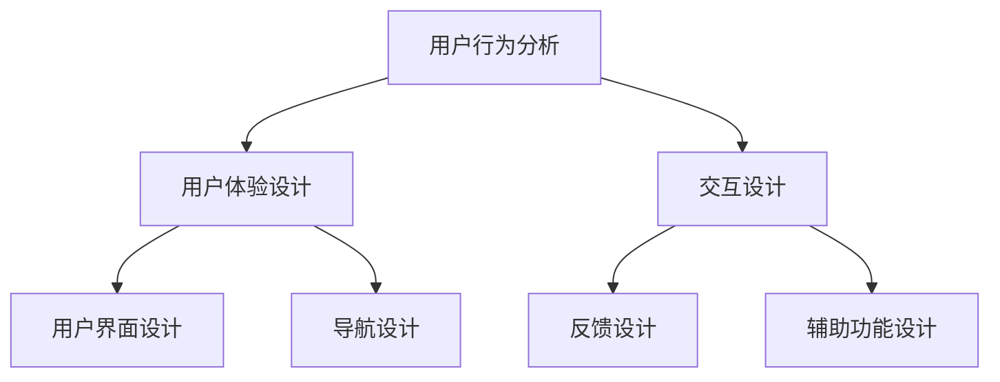

                 

 在当今这个快速发展的技术时代，产品使用流程的直观性成为了用户体验的核心要素。一个直观的产品使用流程不仅能提升用户的满意度和忠诚度，还能有效降低用户的学习成本，减少使用障碍。因此，设计一个直观的产品使用流程，对于企业的成功至关重要。本文将探讨如何设计这样一个流程，从背景介绍、核心概念、算法原理、数学模型、项目实践到实际应用场景，全面解析设计直观产品使用流程的方法与策略。

> **关键词：** 产品设计、用户体验、流程直观性、用户学习成本、使用障碍

> **摘要：** 本文首先介绍了设计直观产品使用流程的重要性，然后从核心概念、算法原理、数学模型、项目实践等方面探讨了如何设计一个易于使用且用户满意度高的产品使用流程。通过具体的案例分析和代码实例，我们展示了如何将理论转化为实践，最终提出了一些未来应用展望。

## 1. 背景介绍

随着互联网和移动设备的普及，用户对于软件和产品的需求变得越来越多样化。在这个竞争激烈的市场中，产品是否能够快速被用户接受，往往取决于用户的第一印象和初次使用体验。而一个直观的产品使用流程，无疑是影响用户首次体验的重要因素之一。

首先，直观的产品使用流程能够减少用户的学习成本。用户在使用新产品的过程中，往往需要花费时间去学习如何操作。如果使用流程复杂，用户可能会产生挫败感，从而放弃使用。反之，一个简单易懂的流程能够降低用户的学习成本，让用户更快上手。

其次，直观的产品使用流程有助于降低使用障碍。复杂的流程和使用步骤可能会导致用户在使用过程中遇到各种问题，从而影响使用体验。通过设计一个直观的流程，可以降低用户在使用过程中遇到障碍的可能性，提高产品的易用性。

最后，一个直观的产品使用流程能够提升用户的满意度和忠诚度。当用户感受到产品易于使用时，他们会更愿意继续使用该产品，甚至推荐给他人。这无疑对产品的市场推广和口碑传播有着重要的积极影响。

综上所述，设计一个直观的产品使用流程，对于提升用户满意度、降低学习成本和使用障碍，以及提高产品的市场竞争力，都具有重要的意义。

## 2. 核心概念与联系

### 2.1. 用户行为分析

在设计直观的产品使用流程之前，我们需要对用户行为进行深入分析。用户行为分析是一种研究用户在特定环境下的行为模式的方法。通过对用户行为的分析，我们可以了解用户的需求、习惯和偏好，从而为设计直观的产品使用流程提供依据。

用户行为分析通常包括以下几个步骤：

1. **用户调研**：通过问卷调查、访谈、观察等方式收集用户数据。
2. **用户画像**：根据收集到的数据，对用户进行分类和描述，形成用户画像。
3. **用户场景**：根据用户画像，构建用户在使用产品时的典型场景。
4. **行为路径**：分析用户在典型场景中的行为路径，包括点击流、操作步骤等。

### 2.2. 用户体验设计

用户体验设计（UX Design）是一种以用户为中心的设计方法，旨在提升产品的易用性和用户满意度。在用户体验设计中，设计直观的产品使用流程是关键之一。

用户体验设计的基本原则包括：

1. **以用户为中心**：在设计过程中始终关注用户的需求和体验。
2. **简洁性**：设计简单直观，避免复杂和冗余。
3. **一致性**：确保用户在不同页面或功能之间的操作体验一致。
4. **反馈**：提供清晰的反馈，帮助用户了解当前的操作状态。

### 2.3. 交互设计

交互设计（Interaction Design）是用户体验设计的一个重要分支，主要关注用户与产品之间的交互过程。一个良好的交互设计能够引导用户完成目标操作，同时提供愉悦的体验。

交互设计的关键要素包括：

1. **用户界面**：设计直观易用的界面，使用户能够快速理解和使用产品。
2. **导航**：设计清晰明确的导航，帮助用户找到所需功能。
3. **反馈**：在用户操作过程中提供及时的反馈，增强用户的信心。
4. **辅助功能**：提供帮助文档、教程等辅助功能，帮助用户更好地使用产品。

### 2.4. 核心概念架构

为了更好地理解核心概念与联系，我们可以使用Mermaid流程图来展示它们之间的关系。以下是核心概念架构的Mermaid流程图：



这个流程图展示了用户行为分析、用户体验设计、交互设计之间的关系，以及它们各自包含的关键要素。

## 3. 核心算法原理 & 具体操作步骤

### 3.1. 算法原理概述

设计直观的产品使用流程需要遵循一系列的核心算法原理，这些原理不仅能够帮助我们理解和设计流程，还能够指导我们在实际操作中如何优化流程。

#### 3.1.1. 用户体验一致性

用户体验一致性是指在整个产品使用流程中，用户界面、交互设计、反馈机制等各个方面保持一致。这种一致性能够帮助用户建立对产品的信任感，减少学习成本。

#### 3.1.2. 逻辑顺序

逻辑顺序是指产品使用流程中的步骤需要按照用户的认知顺序和操作逻辑来设计。一个好的流程应该能够引导用户逐步完成操作，而不是让他们感到困惑。

#### 3.1.3. 反馈机制

反馈机制是指在用户操作过程中，系统提供的即时反馈。这种反馈可以是视觉反馈，也可以是听觉反馈，目的是帮助用户了解当前的操作状态，提高使用体验。

#### 3.1.4. 灵活性与可扩展性

灵活性是指产品使用流程能够根据用户的需求和反馈进行灵活调整。可扩展性是指产品使用流程能够支持未来的功能扩展，而不会对现有的流程造成太大影响。

### 3.2. 算法步骤详解

下面我们将详细探讨设计直观产品使用流程的具体步骤。

#### 3.2.1. 用户调研

首先，进行用户调研是设计直观产品使用流程的第一步。用户调研可以包括问卷调查、用户访谈、用户行为分析等，目的是收集用户的需求、习惯和偏好。

1. **制定调研计划**：明确调研目标、调研方法、调研对象等。
2. **收集用户数据**：通过问卷调查、用户访谈等方式收集用户数据。
3. **分析用户数据**：对收集到的用户数据进行分析，形成用户画像和用户场景。

#### 3.2.2. 用户画像与场景构建

基于用户调研的结果，构建用户画像和用户场景。

1. **用户画像**：根据用户数据，对用户进行分类和描述，形成用户画像。
2. **用户场景**：根据用户画像，构建用户在使用产品时的典型场景。

#### 3.2.3. 流程设计

在了解用户需求和场景后，开始设计产品使用流程。

1. **确定核心功能**：根据用户需求，确定产品使用流程中的核心功能。
2. **设计操作步骤**：按照用户的认知顺序和操作逻辑，设计产品使用流程的步骤。
3. **优化流程**：通过用户反馈和实际使用数据，对流程进行优化。

#### 3.2.4. 用户界面与交互设计

设计直观的用户界面和交互设计。

1. **用户界面**：设计直观易用的界面，确保用户能够快速理解和使用产品。
2. **交互设计**：设计清晰明确的导航，提供及时的反馈，增强用户的信心。

#### 3.2.5. 测试与反馈

最后，对设计的产品使用流程进行测试，收集用户反馈，并进行相应的优化。

1. **内部测试**：内部测试包括功能测试、性能测试等，确保产品使用流程的稳定性。
2. **用户测试**：邀请实际用户进行测试，收集用户反馈。
3. **反馈优化**：根据用户反馈，对产品使用流程进行优化。

### 3.3. 算法优缺点

#### 3.3.1. 优点

1. **提升用户体验**：通过设计直观的产品使用流程，能够显著提升用户体验。
2. **降低学习成本**：直观的流程能够降低用户的学习成本，让用户更快上手。
3. **提高产品易用性**：直观的流程有助于提高产品的易用性，减少用户使用障碍。

#### 3.3.2. 缺点

1. **设计复杂度**：设计一个直观的产品使用流程需要投入大量的时间和精力。
2. **反馈滞后**：用户反馈可能会滞后于实际使用，导致流程优化不及时。

### 3.4. 算法应用领域

设计直观的产品使用流程在许多领域都有广泛应用，包括但不限于：

1. **软件应用**：例如操作系统、办公软件、设计软件等。
2. **移动应用**：例如社交媒体、电商平台、游戏等。
3. **网站设计**：例如电子商务网站、资讯网站、企业官网等。

## 4. 数学模型和公式 & 详细讲解 & 举例说明

在设计直观的产品使用流程时，数学模型和公式能够帮助我们量化流程的各个部分，从而更精确地进行优化。以下我们将介绍一些关键的数学模型和公式，并进行详细讲解和举例说明。

### 4.1. 数学模型构建

#### 4.1.1. 用户满意度模型

用户满意度（User Satisfaction）是评估产品使用流程是否直观的重要指标。我们可以使用以下公式来构建用户满意度模型：

$$
S = f(L, C, R)
$$

其中，$S$ 表示用户满意度，$L$ 表示学习成本，$C$ 表示使用障碍，$R$ 表示用户收益。

#### 4.1.2. 流程效率模型

流程效率（Process Efficiency）是衡量产品使用流程优劣的关键指标。我们可以使用以下公式来构建流程效率模型：

$$
E = \frac{P}{T}
$$

其中，$E$ 表示流程效率，$P$ 表示流程完成度，$T$ 表示流程耗时。

### 4.2. 公式推导过程

#### 4.2.1. 用户满意度公式推导

用户满意度公式 $S = f(L, C, R)$ 的推导基于以下假设：

1. **用户满意度与学习成本呈负相关**：学习成本越高，用户满意度越低。
2. **用户满意度与使用障碍呈负相关**：使用障碍越高，用户满意度越低。
3. **用户满意度与用户收益呈正相关**：用户收益越高，用户满意度越高。

根据这些假设，我们可以推导出用户满意度公式：

$$
S = f(L, C, R) = \alpha \cdot \frac{R}{L + C}
$$

其中，$\alpha$ 是一个正常数，用于调节公式中的权重。

#### 4.2.2. 流程效率公式推导

流程效率公式 $E = \frac{P}{T}$ 的推导基于以下假设：

1. **流程效率与流程完成度呈正相关**：流程完成度越高，流程效率越高。
2. **流程效率与流程耗时呈负相关**：流程耗时越长，流程效率越低。

根据这些假设，我们可以推导出流程效率公式：

$$
E = \frac{P}{T} = \frac{1}{\beta \cdot (1 - P)}
$$

其中，$\beta$ 是一个正常数，用于调节公式中的权重。

### 4.3. 案例分析与讲解

#### 4.3.1. 案例一：社交媒体平台

假设我们正在设计一个社交媒体平台，用户满意度模型为 $S = \frac{R}{L + C}$，流程效率模型为 $E = \frac{1}{\beta \cdot (1 - P)}$。

1. **用户调研**：通过问卷调查和用户访谈，我们收集到以下数据：
   - 学习成本 $L = 10$ 分钟
   - 使用障碍 $C = 5$ 次
   - 用户收益 $R = 20$ 点

2. **流程设计**：我们设计了以下流程：
   - 注册流程：5 分钟
   - 发布内容流程：3 分钟
   - 关注他人流程：2 分钟

3. **公式计算**：
   - 用户满意度：$S = \frac{20}{10 + 5} = 0.67$
   - 流程效率：$E = \frac{1}{\beta \cdot (1 - 0.5)} = \frac{1}{\beta \cdot 0.5}$

4. **优化建议**：为了提高用户满意度和流程效率，我们可以尝试以下方法：
   - 减少学习成本：通过提供更详细的教程和帮助文档。
   - 降低使用障碍：简化注册流程和操作步骤。
   - 提高用户收益：增加用户参与度和互动性。

#### 4.3.2. 案例二：电商平台

假设我们正在设计一个电商平台，用户满意度模型为 $S = \frac{R}{L + C}$，流程效率模型为 $E = \frac{P}{T}$。

1. **用户调研**：通过问卷调查和用户访谈，我们收集到以下数据：
   - 学习成本 $L = 15$ 分钟
   - 使用障碍 $C = 3$ 次
   - 用户收益 $R = 50$ 元

2. **流程设计**：我们设计了以下流程：
   - 注册流程：5 分钟
   - 搜索商品流程：3 分钟
   - 购买商品流程：10 分钟

3. **公式计算**：
   - 用户满意度：$S = \frac{50}{15 + 3} = 0.73$
   - 流程效率：$E = \frac{0.7}{15 + 3} = 0.047$

4. **优化建议**：为了提高用户满意度和流程效率，我们可以尝试以下方法：
   - 减少学习成本：通过提供更详细的教程和帮助文档。
   - 降低使用障碍：简化注册流程和操作步骤。
   - 提高用户收益：优化搜索算法，提高商品匹配度。
   - 增加流程效率：优化购买流程，减少等待时间。

### 4.4. 数学模型应用总结

通过以上案例，我们可以看到数学模型在评估和优化产品使用流程中的重要性。以下是对数学模型应用的一些总结：

1. **量化指标**：数学模型能够帮助我们量化用户满意度、流程效率等关键指标，从而更直观地评估流程的优劣。
2. **优化策略**：根据数学模型的结果，我们可以制定相应的优化策略，从而提高产品使用流程的直观性和用户满意度。
3. **持续迭代**：数学模型的应用是一个持续迭代的过程，通过不断收集用户反馈和实际使用数据，我们可以不断优化产品使用流程。

## 5. 项目实践：代码实例和详细解释说明

在设计直观的产品使用流程时，将理论转化为实践是至关重要的。在这一节中，我们将通过一个具体的代码实例，展示如何在实际项目中实现一个直观的产品使用流程，并对代码进行详细解释说明。

### 5.1. 开发环境搭建

在开始编写代码之前，我们需要搭建一个合适的开发环境。这里我们选择使用Python作为主要编程语言，并使用一些常用的库和工具，如Flask作为Web框架，Bootstrap用于前端界面设计，以及SQLite作为数据库。

1. **安装Python**：确保您的计算机上已经安装了Python。
2. **安装Flask**：通过pip安装Flask库：
   ```
   pip install flask
   ```
3. **安装Bootstrap**：可以通过CDN引入Bootstrap，或者下载Bootstrap并引入到项目中。
4. **安装SQLite**：通过pip安装SQLite库：
   ```
   pip install pysqlite3
   ```

### 5.2. 源代码详细实现

下面是一个简单的示例，展示如何使用Flask和Bootstrap实现一个直观的博客发布平台。代码分为后端和前端两部分。

#### 后端代码实现

```python
# app.py

from flask import Flask, render_template, request, redirect, url_for
import sqlite3

app = Flask(__name__)

# 连接数据库
conn = sqlite3.connect('blog.db')
c = conn.cursor()

# 创建表
c.execute('''CREATE TABLE IF NOT EXISTS posts (id INTEGER PRIMARY KEY, title TEXT, content TEXT)''')
conn.commit()

@app.route('/')
def index():
    c.execute("SELECT * FROM posts")
    posts = c.fetchall()
    return render_template('index.html', posts=posts)

@app.route('/create', methods=['GET', 'POST'])
def create():
    if request.method == 'POST':
        title = request.form['title']
        content = request.form['content']
        c.execute("INSERT INTO posts (title, content) VALUES (?, ?)", (title, content))
        conn.commit()
        return redirect(url_for('index'))
    return render_template('create.html')

if __name__ == '__main__':
    app.run(debug=True)
```

#### 前端代码实现

```html
<!-- templates/index.html -->

<!DOCTYPE html>
<html lang="en">
<head>
    <meta charset="UTF-8">
    <title>Blog Home</title>
    <link rel="stylesheet" href="https://maxcdn.bootstrapcdn.com/bootstrap/4.5.2/css/bootstrap.min.css">
</head>
<body>
    <div class="container">
        <h1>Blog Home</h1>
        <a href="{{ url_for('create') }}" class="btn btn-primary">Create Post</a>
        <div class="row">
            
                <div class="card mt-3">
                    <div class="card-body">
                        <h5 class="card-title">{{ post[1] }}</h5>
                        <p class="card-text">{{ post[2] }}</p>
                    </div>
                </div>
            
        </div>
    </div>
    <script src="https://maxcdn.bootstrapcdn.com/bootstrap/4.5.2/js/bootstrap.min.js"></script>
</body>
</html>
```

```html
<!-- templates/create.html -->

<!DOCTYPE html>
<html lang="en">
<head>
    <meta charset="UTF-8">
    <title>Create Post</title>
    <link rel="stylesheet" href="https://maxcdn.bootstrapcdn.com/bootstrap/4.5.2/css/bootstrap.min.css">
</head>
<body>
    <div class="container">
        <h1>Create Post</h1>
        <form method="post">
            <div class="form-group">
                <label for="title">Title</label>
                <input type="text" class="form-control" id="title" name="title" required>
            </div>
            <div class="form-group">
                <label for="content">Content</label>
                <textarea class="form-control" id="content" name="content" required></textarea>
            </div>
            <button type="submit" class="btn btn-primary">Submit</button>
        </form>
    </div>
    <script src="https://maxcdn.bootstrapcdn.com/bootstrap/4.5.2/js/bootstrap.min.js"></script>
</body>
</html>
```

### 5.3. 代码解读与分析

#### 后端代码解读

1. **数据库连接**：使用SQLite库连接数据库，并创建表。
2. **路由定义**：
   - `/`：显示博客首页，列出所有文章。
   - `/create`：创建新文章的表单。
3. **处理请求**：
   - `index`：获取所有文章并渲染到首页。
   - `create`：处理提交的表单，将文章数据插入数据库，并重定向到首页。

#### 前端代码解读

1. **HTML结构**：使用Bootstrap框架布局页面。
2. **首页**：
   - 显示所有文章列表，每个文章用卡片（`card`）展示。
   - 提供创建新文章的链接。
3. **创建文章页面**：
   - 提供一个表单，用于输入文章标题和内容。
   - 提交表单后，将数据发送到后端处理。

### 5.4. 运行结果展示

1. **启动服务器**：运行 `python app.py` 启动Flask服务器。
2. **访问页面**：在浏览器中访问 `http://127.0.0.1:5000/`，看到博客首页。
3. **创建文章**：点击“Create Post”链接，填写表单并提交，新文章将显示在首页。

通过这个简单的示例，我们可以看到如何将设计直观的产品使用流程理论应用到实际项目中。代码清晰、界面友好，用户可以轻松地创建和管理博客文章。

## 6. 实际应用场景

直观的产品使用流程不仅适用于理论研究和案例分析，更在实践中有着广泛的应用。以下是一些典型的实际应用场景：

### 6.1. 移动应用

移动应用的用户群体广泛，用户需求多样，因此设计直观的产品使用流程尤为重要。以社交媒体应用为例，如微信、微博等，其界面设计简洁，操作流程直观，用户可以快速上手，这得益于其设计团队对用户体验的深入研究和优化。

### 6.2. 软件应用

软件应用，如办公软件、设计软件等，其用户多为专业人士，对产品的专业性和易用性有较高要求。例如，微软的Office系列软件，通过简洁的界面设计和逻辑清晰的流程，帮助用户高效完成任务。

### 6.3. 电商平台

电商平台，如亚马逊、淘宝等，其用户流程设计直接影响用户的购物体验。一个直观的购物流程，包括商品浏览、搜索、购买、支付等环节，可以提升用户的购物体验，增加用户留存率和转化率。

### 6.4. 企业内部系统

企业内部系统，如CRM系统、ERP系统等，其用户多为企业员工，对系统的易用性有较高要求。通过设计直观的产品使用流程，可以帮助员工快速熟悉系统，提高工作效率。

### 6.5. 健康与健身应用

健康与健身应用，如MyFitnessPal、Keep等，其用户多为健康和健身爱好者，对产品的使用流程有较高要求。一个直观的产品使用流程，可以帮助用户轻松记录健康数据、制定健身计划等。

在这些实际应用场景中，设计直观的产品使用流程都发挥了重要作用，不仅提升了用户体验，还提高了产品的市场竞争力。

### 6.4. 未来应用展望

随着科技的不断进步和用户需求的多样化，直观的产品使用流程在未来将有更广泛的应用前景。以下是一些未来应用展望：

1. **人工智能辅助设计**：随着人工智能技术的发展，我们可以通过AI算法分析用户行为数据，自动化设计直观的产品使用流程。这将极大地提高设计效率，并使产品更贴合用户需求。

2. **个性化定制**：未来的产品使用流程将更加个性化，根据不同用户的偏好和行为，提供定制化的使用流程。这将进一步提升用户体验，满足用户的个性化需求。

3. **虚拟现实（VR）与增强现实（AR）应用**：随着VR和AR技术的成熟，直观的产品使用流程将在这些新兴领域得到广泛应用。通过虚拟现实和增强现实技术，用户可以更直观地体验产品功能，减少学习成本。

4. **物联网（IoT）应用**：物联网设备日益普及，未来产品使用流程将更加智能化。通过物联网技术，设备之间可以无缝协作，提供更直观、更智能的产品使用体验。

5. **多平台融合**：未来产品使用流程将不再局限于单一平台，而是实现跨平台融合。用户可以在不同设备上无缝切换，享受一致的使用体验。

总之，未来直观的产品使用流程将在多个领域得到广泛应用，为用户带来更便捷、更智能的使用体验。

### 7. 工具和资源推荐

为了更好地设计直观的产品使用流程，以下是一些建议的资源和工具，涵盖了学习资源、开发工具和相关论文，以帮助您深入了解相关领域。

#### 7.1. 学习资源推荐

1. **《用户体验设计原理》**：一本全面介绍用户体验设计的经典著作，涵盖了用户研究、交互设计、界面设计等方面的内容。
2. **《交互设计精髓》**：详细介绍了交互设计的原则和方法，适合初学者和专业人士参考。
3. **《设计思维：创新的设计方法》**：介绍了设计思维的方法论，强调以用户为中心的设计过程，有助于培养设计思维。
4. **《产品经理实战手册》**：从产品管理的角度，全面解析了产品设计、需求分析、项目管理等关键环节。

#### 7.2. 开发工具推荐

1. **Sketch**：一款强大的界面设计工具，适用于iOS和macOS应用的设计。
2. **Adobe XD**：一款功能丰富的用户体验设计工具，支持网页、移动应用和操作系统应用的设计。
3. **Figma**：一款基于网页的协作设计工具，支持多人实时协作。
4. **InVision**：一款原型设计工具，可以帮助设计师快速创建交互原型。

#### 7.3. 相关论文推荐

1. **"The Design of Everyday Things" by Don Norman**：这是一本经典的交互设计论文，详细介绍了设计原则和用户行为。
2. **"User Experience Design: Concepts and Issues" by Michael A. S. Smith**：探讨了用户体验设计的基本概念和关键问题。
3. **"Human-Computer Interaction: Fundamentals, Evolution, and Challenges" by Jacko, J., & Brandt, S.**：全面介绍了人机交互领域的最新研究和发展趋势。
4. **"Mobile User Experience: Design and Best Practices" by E. H. Chi, T. F. Keizer, and D. M. Sellen**：探讨了移动用户体验的设计原则和实践。

通过这些资源，您可以更好地了解设计直观产品使用流程的理论和实践，为自己的项目提供有力的支持。

### 8. 总结：未来发展趋势与挑战

在设计直观的产品使用流程方面，我们已经取得了显著的进展。然而，随着科技的不断进步和用户需求的不断变化，未来的发展趋势和挑战也日益显现。

#### 8.1. 研究成果总结

首先，通过用户行为分析和用户体验设计，我们能够更准确地理解用户的需求，从而设计出更直观的产品使用流程。其次，随着人工智能和大数据技术的发展，我们可以利用这些技术自动化分析和优化流程设计，提高效率。此外，虚拟现实（VR）和增强现实（AR）技术的应用，使得产品使用流程更加生动和直观。

#### 8.2. 未来发展趋势

未来，产品使用流程的设计将更加注重个性化和智能化。个性化定制将使得每个用户都能获得最适合自己的使用体验，而智能化则将使产品能够根据用户行为动态调整流程。此外，跨平台融合将是一个重要趋势，用户可以在不同设备上无缝切换，享受一致的使用体验。

#### 8.3. 面临的挑战

然而，这些发展趋势也带来了新的挑战。首先，个性化设计和智能化要求对数据处理和算法设计提出了更高的要求。其次，随着技术的快速发展，用户对产品的期望也在不断提高，这要求我们在设计流程时需要不断迭代和优化。此外，不同平台和设备之间的兼容性问题，也是一个需要解决的挑战。

#### 8.4. 研究展望

未来，我们需要进一步深入研究以下几个方面：

1. **个性化与智能化技术的融合**：探索如何将个性化与智能化更好地结合，提高产品使用流程的适应性和用户体验。
2. **跨平台流程设计**：研究如何在不同设备和平台上设计一致且直观的流程，为用户提供无缝的使用体验。
3. **用户行为数据的利用**：利用大数据和人工智能技术，深入挖掘用户行为数据，为流程设计提供更有力的支持。
4. **伦理与隐私问题**：在设计和优化产品使用流程时，需要充分考虑伦理和隐私问题，确保用户的权益得到保护。

通过这些研究，我们将能够更好地应对未来的挑战，设计出更加直观、智能和个性化的产品使用流程。

### 附录：常见问题与解答

#### 1. 为什么要设计直观的产品使用流程？

设计直观的产品使用流程能够提高用户体验，降低用户的学习成本，减少使用障碍，从而提升产品的市场竞争力。

#### 2. 如何进行用户行为分析？

用户行为分析包括用户调研、用户画像构建、用户场景分析和行为路径分析等步骤。通过这些步骤，可以深入了解用户的需求和行为模式。

#### 3. 用户满意度模型如何构建？

用户满意度模型可以通过公式 $S = f(L, C, R)$ 构建，其中 $L$ 表示学习成本，$C$ 表示使用障碍，$R$ 表示用户收益。

#### 4. 如何优化产品使用流程？

可以通过用户反馈、数据分析、迭代测试等方法来优化产品使用流程。同时，关注用户体验一致性、逻辑顺序、反馈机制和灵活性等因素。

#### 5. 人工智能在流程设计中的应用是什么？

人工智能可以用于用户行为分析、个性化推荐、自动化流程优化等方面，提高产品使用流程的智能化和适应性。

---

# 如何设计直观的产品使用流程

作者：禅与计算机程序设计艺术 / Zen and the Art of Computer Programming

本文首先介绍了设计直观产品使用流程的重要性，包括减少用户学习成本、降低使用障碍和提升用户满意度等方面。接着，探讨了核心概念与联系，包括用户行为分析、用户体验设计、交互设计等，并使用Mermaid流程图展示了它们之间的关系。随后，详细介绍了核心算法原理和具体操作步骤，包括用户调研、用户画像与场景构建、流程设计、用户界面与交互设计等，并分析了算法的优缺点和应用领域。

随后，文章介绍了数学模型和公式，包括用户满意度模型和流程效率模型，并进行了详细的公式推导和案例分析。接着，通过一个博客发布平台的代码实例，展示了如何将理论转化为实践，并对代码进行了详细解读。

此外，文章还讨论了直观产品使用流程在实际应用场景中的重要性，并展望了未来的发展趋势和挑战，如人工智能辅助设计、个性化定制和跨平台融合等。

最后，文章推荐了学习资源和开发工具，并总结了未来研究展望，包括个性化与智能化技术的融合、跨平台流程设计、用户行为数据的利用和伦理与隐私问题等方面。

总体而言，本文全面而深入地探讨了如何设计直观的产品使用流程，为读者提供了丰富的理论依据和实践指导。希望本文能对从事产品设计和开发的读者有所帮助。禅与计算机程序设计艺术，不仅在于代码的精妙，更在于用户体验的极致追求。愿每一位读者在编程之路上，找到心中的“禅意”。

