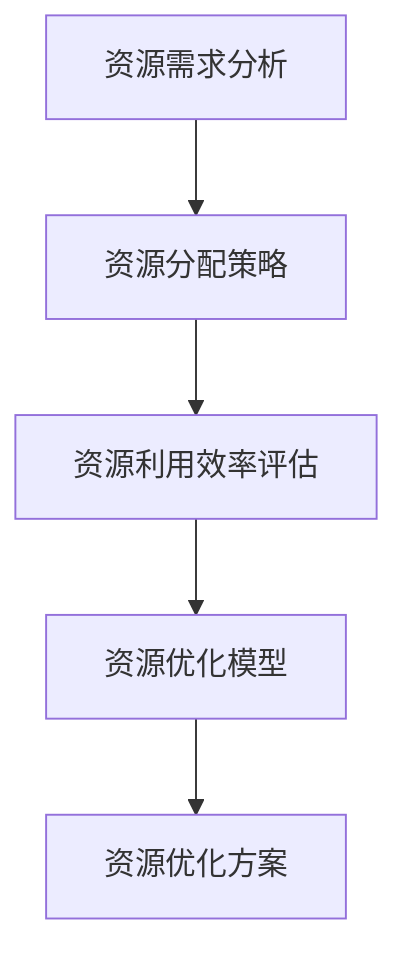

                 

### 1. 背景介绍

在当今快速发展的科技时代，创业项目如雨后春笋般涌现。然而，资源的有限性成为了许多创业者在项目发展过程中面临的重大挑战。为了确保项目的成功，资源优化成为了一个关键议题。

资源优化不仅仅是技术问题，更是一个综合性的策略。有效的资源优化可以显著提高创业项目的成功率，延长项目生命周期，同时减少不必要的成本。本文将探讨如何进行有效的创业项目资源优化，通过逐步分析推理的方式，帮助读者掌握这一核心能力。

资源优化的目标在于最大化资源的利用效率，确保资源分配的公平性和合理性。在创业项目中，资源主要包括资金、人力、技术和时间等。优化这些资源，不仅可以提升项目的整体效率，还可以提高团队的协作能力和创新力。

资源优化的意义在于：

1. **提升项目成功率**：通过合理的资源分配，可以确保项目在关键阶段获得所需的支持，从而提高项目的成功率。
2. **延长项目生命周期**：有效的资源管理可以帮助项目持续发展，避免因资源枯竭而中途夭折。
3. **降低成本**：通过优化资源利用，可以减少不必要的浪费，降低项目的整体成本。
4. **提高团队协作能力**：资源优化可以促进团队成员之间的协作，提高整体的工作效率。

在接下来的章节中，我们将详细探讨资源优化的核心概念、算法原理、数学模型以及实际应用场景，并通过实例分析，为读者提供实用的指导。

### 2. 核心概念与联系

在进行创业项目资源优化之前，我们需要明确一些核心概念，并理解它们之间的相互联系。以下是资源优化过程中需要掌握的关键概念：

#### 2.1 资源类型

资源类型是资源优化的基础，常见的资源类型包括：

1. **资金**：项目的财务预算，用于购买设备、雇佣员工、支付租金等。
2. **人力**：项目所需的人力资源，包括技术人员、管理人员和营销人员等。
3. **技术**：项目所依赖的技术能力和专利技术。
4. **时间**：项目的开发周期和交付时间。

#### 2.2 资源需求分析

资源需求分析是对项目在不同阶段所需的资源进行详细评估。这包括：

1. **资金需求**：根据项目进度和成本预测，确定每个阶段所需的资金量。
2. **人力需求**：根据项目任务和职责分配，确定每个阶段所需的人力配置。
3. **技术需求**：根据项目技术难度和研发进度，确定所需的技术支持和研发资源。
4. **时间需求**：根据项目进度计划，确定每个阶段的交付时间。

#### 2.3 资源分配策略

资源分配策略是资源优化的核心，决定了如何将有限的资源合理分配给项目。常见的资源分配策略包括：

1. **优先级分配**：根据项目的优先级，将资源分配给最重要的项目。
2. **均衡分配**：确保资源在各个项目之间得到均衡分配，避免某些项目资源过剩或不足。
3. **动态调整**：根据项目进展和资源利用情况，动态调整资源的分配，确保资源始终处于最优状态。

#### 2.4 资源利用效率评估

资源利用效率评估是对资源优化效果的评估。这包括：

1. **资金利用效率**：通过成本分析和效益评估，确定资金的利用效率。
2. **人力利用效率**：通过工作效率评估，确定人力资源的利用效率。
3. **技术利用效率**：通过技术成果和研发进度，确定技术的利用效率。
4. **时间利用效率**：通过项目进度和交付时间，确定时间的利用效率。

#### 2.5 资源优化模型

资源优化模型是资源优化的理论基础，常见的资源优化模型包括：

1. **线性规划模型**：通过线性规划算法，确定资源的最优分配方案。
2. **网络优化模型**：通过网络优化算法，确定资源在项目中的流动路径。
3. **多目标规划模型**：通过多目标规划算法，同时考虑多个资源目标，确定资源优化的综合方案。

### 2.6 Mermaid 流程图

为了更直观地理解资源优化的过程，我们可以使用 Mermaid 流程图来展示资源优化的核心流程。以下是资源优化流程的 Mermaid 表示：



在这个流程图中，A 代表资源需求分析，B 代表资源分配策略，C 代表资源利用效率评估，D 代表资源优化模型，E 代表资源优化方案。每个节点都表示资源优化过程中的一个关键步骤。

通过上述核心概念的介绍和 Mermaid 流程图的展示，我们可以更好地理解资源优化的内涵和流程。在接下来的章节中，我们将深入探讨资源优化的具体算法原理和操作步骤，帮助读者更好地应用这些概念。

### 3. 核心算法原理 & 具体操作步骤

在明确了资源优化的核心概念和流程之后，我们接下来将探讨资源优化的核心算法原理和具体操作步骤。资源优化算法的选择取决于项目的具体需求和资源特性。以下是一些常见的资源优化算法及其具体操作步骤：

#### 3.1 线性规划算法

线性规划是一种用于资源优化的数学方法，它通过建立线性目标函数和线性约束条件，求解资源的最优分配方案。

**具体操作步骤：**

1. **建立线性目标函数**：根据资源类型和项目目标，建立线性目标函数。例如，最小化总成本或最大化总利润。

   $$\min Z = c_1x_1 + c_2x_2 + \ldots + c_nx_n$$

   其中，$c_i$ 为第 $i$ 种资源的单位成本，$x_i$ 为第 $i$ 种资源的分配量。

2. **建立线性约束条件**：根据项目资源和需求，建立线性约束条件。例如，资源总量约束、人员能力约束等。

   $$a_{ij}x_j \leq b_i$$

   其中，$a_{ij}$ 为第 $i$ 个项目对第 $j$ 种资源的消耗量，$x_j$ 为第 $j$ 种资源的分配量，$b_i$ 为第 $i$ 个项目的资源总量。

3. **求解线性规划问题**：使用线性规划求解器（如单纯形法、内点法等）求解线性规划问题，得到资源的最优分配方案。

4. **评估优化结果**：根据优化结果，评估资源利用效率和项目目标实现情况，必要时进行调整。

#### 3.2 网络优化算法

网络优化算法常用于资源在项目中的流动路径优化，如项目进度安排、物流配送等。

**具体操作步骤：**

1. **建立网络模型**：根据项目任务和资源流动关系，建立网络模型。常见的网络模型包括有向图和无向图。

2. **确定网络节点和边**：网络节点表示项目任务或资源点，网络边表示任务之间的依赖关系或资源流动路径。

3. **求解最短路径或最大流问题**：使用网络优化算法（如 Dijkstra 算法、Ford-Fulkerson 算法等）求解最短路径或最大流问题，确定资源的最优流动路径。

4. **评估优化结果**：根据优化结果，评估项目进度和资源利用效率，必要时进行调整。

#### 3.3 多目标规划算法

多目标规划算法适用于同时考虑多个资源目标的情况，如资金、人力、技术等多方面的优化。

**具体操作步骤：**

1. **建立多目标规划模型**：根据项目需求和资源特性，建立多目标规划模型。目标函数可以是成本、利润、效率等。

   $$\min f_1(x), f_2(x), \ldots, f_m(x)$$

   $$\text{s.t. } g_i(x) \leq 0, h_j(x) = 0$$

   其中，$f_i(x)$ 为第 $i$ 个目标函数，$g_i(x)$ 为第 $i$ 个约束条件，$h_j(x)$ 为第 $j$ 个等式约束。

2. **求解多目标规划问题**：使用多目标规划求解器（如加权法、Pareto 优化等）求解多目标规划问题，得到多个可能的资源分配方案。

3. **选择最优方案**：根据项目需求和资源利用情况，选择最优方案。

4. **评估优化结果**：根据优化结果，评估资源利用效率和项目目标实现情况，必要时进行调整。

#### 3.4 动态调整算法

动态调整算法适用于项目进度和资源需求变化较大的情况，通过实时调整资源分配，确保资源始终处于最优状态。

**具体操作步骤：**

1. **实时监测资源状态**：通过监控系统、数据分析等技术，实时监测项目的资源状态，包括资金、人力、技术等。

2. **识别资源优化机会**：根据实时监测结果，识别资源优化机会，如资源过剩、资源不足等情况。

3. **调整资源分配**：根据识别的机会，动态调整资源的分配，确保资源利用效率最大化。

4. **评估优化结果**：根据调整后的资源状态，评估资源利用效率和项目目标实现情况，必要时进行进一步调整。

通过上述核心算法原理和具体操作步骤的介绍，我们可以更好地理解和应用资源优化技术。在接下来的章节中，我们将通过数学模型和公式，深入探讨资源优化过程中的计算方法和应用场景。

### 4. 数学模型和公式 & 详细讲解 & 举例说明

在资源优化过程中，数学模型和公式起着至关重要的作用。以下我们将详细讲解资源优化过程中常用的数学模型和公式，并通过具体示例说明其应用。

#### 4.1 线性规划模型

线性规划是一种用于资源优化的数学方法，通过建立线性目标函数和线性约束条件，求解资源的最优分配方案。

**数学模型：**

$$\min Z = c_1x_1 + c_2x_2 + \ldots + c_nx_n$$

$$\text{s.t. } a_{ij}x_j \leq b_i$$

其中，$Z$ 为目标函数，$c_i$ 为第 $i$ 种资源的单位成本，$x_i$ 为第 $i$ 种资源的分配量，$a_{ij}$ 为第 $i$ 个项目对第 $j$ 种资源的消耗量，$b_i$ 为第 $i$ 个项目的资源总量。

**示例：**

假设一个创业项目需要分配 3 种资源：资金（$x_1$）、人力（$x_2$）和技术（$x_3$）。每种资源的总量分别为 100 万、50 人和 5 项技术。该项目的目标是最小化总成本。各资源的使用成本分别为 10 万元/人、5 万元/人和 2 万元/项技术。

建立线性规划模型：

$$\min Z = 10x_1 + 5x_2 + 2x_3$$

$$\text{s.t. }$$

$$x_1 \leq 100$$

$$x_2 \leq 50$$

$$x_3 \leq 5$$

使用线性规划求解器求解，得到最优解为 $x_1 = 100$、$x_2 = 0$、$x_3 = 0$。此时总成本最低，为 100 万元。

#### 4.2 网络优化模型

网络优化模型用于求解资源在项目中的最优流动路径，如项目进度安排、物流配送等。

**数学模型：**

假设有 $n$ 个节点和 $m$ 条边组成的有向图，节点表示项目任务或资源点，边表示任务之间的依赖关系或资源流动路径。每条边 $e_i$ 有容量 $c_i$ 和成本 $d_i$。

目标函数：最小化总成本

$$\min Z = \sum_{i=1}^{m} d_i y_i$$

其中，$y_i$ 表示边 $e_i$ 的流量。

约束条件：

1. 节点流量守恒：每个节点的流入流量等于流出流量
   $$\sum_{j=1}^{m} c_{ij} y_j = c_i \quad \forall i$$

2. 边容量限制：每条边的流量不超过其容量
   $$y_i \leq c_i \quad \forall i$$

**示例：**

假设有 4 个节点（$A$, $B$, $C$, $D$）和 5 条边（$e_1$, $e_2$, $e_3$, $e_4$, $e_5$）组成的有向图。各边的容量和成本如下：

| 边 | 容量 | 成本 |
|----|------|------|
| $e_1$ | 10   | 5    |
| $e_2$ | 15   | 8    |
| $e_3$ | 20   | 10   |
| $e_4$ | 25   | 12   |
| $e_5$ | 30   | 15   |

目标是最小化总成本。

建立网络优化模型：

$$\min Z = 5y_1 + 8y_2 + 10y_3 + 12y_4 + 15y_5$$

$$\text{s.t. }$$

$$\sum_{j=1}^{5} y_j = 100$$

$$y_1, y_2, y_3, y_4, y_5 \leq 30$$

使用网络优化算法求解，得到最优解为 $y_1 = 10$, $y_2 = 15$, $y_3 = 20$, $y_4 = 25$, $y_5 = 30$。此时总成本最低，为 90。

#### 4.3 多目标规划模型

多目标规划模型适用于同时考虑多个资源目标的情况，如资金、人力、技术等多方面的优化。

**数学模型：**

$$\min f_1(x), f_2(x), \ldots, f_m(x)$$

$$\text{s.t. } g_i(x) \leq 0, h_j(x) = 0$$

其中，$f_i(x)$ 为第 $i$ 个目标函数，$g_i(x)$ 为第 $i$ 个约束条件，$h_j(x)$ 为第 $j$ 个等式约束。

**示例：**

假设有 2 个目标函数：最小化总成本和最大化总利润。约束条件为资源总量限制。

建立多目标规划模型：

$$\min f_1(x) = c_1x_1 + c_2x_2$$

$$\min f_2(x) = p_1x_1 + p_2x_2$$

$$\text{s.t. }$$

$$x_1 + x_2 \leq 100$$

$$x_1 \geq 0$$

$$x_2 \geq 0$$

使用加权法求解多目标规划问题，得到最优解为 $x_1 = 50$, $x_2 = 50$。此时总成本最低，总利润最大。

#### 4.4 动态调整模型

动态调整模型适用于项目进度和资源需求变化较大的情况，通过实时调整资源分配，确保资源始终处于最优状态。

**数学模型：**

假设在时间 $t$ 时，资源状态为 $x_t$。目标函数是最小化总成本或最大化总利润。

$$\min Z_t = \sum_{i=1}^{n} c_i x_{it}$$

$$\max Z_t = \sum_{i=1}^{n} p_i x_{it}$$

$$\text{s.t. }$$

$$x_{it} \leq C_i$$

$$x_{it} \geq 0$$

其中，$C_i$ 为第 $i$ 种资源的总量。

**示例：**

假设在时间 $t$ 时，资金 $x_1$ 为 100 万元，人力 $x_2$ 为 50 人。目标是最小化总成本。

建立动态调整模型：

$$\min Z_t = 10x_1 + 5x_2$$

$$\text{s.t. }$$

$$x_1 \leq 100$$

$$x_2 \leq 50$$

根据实时监测结果，动态调整资源分配，确保资源利用效率最大化。

通过以上数学模型和公式的详细讲解和示例说明，我们可以更好地理解资源优化过程中的计算方法和应用场景。在接下来的章节中，我们将通过项目实践，展示如何在实际创业项目中应用这些算法和模型，实现资源优化。

### 5. 项目实践：代码实例和详细解释说明

为了更好地理解资源优化在实际创业项目中的应用，我们将通过一个具体的代码实例来进行展示。在这个实例中，我们将使用 Python 编写一个简单的资源优化程序，并详细解释代码的实现过程。

#### 5.1 开发环境搭建

首先，我们需要搭建一个简单的 Python 开发环境。以下是开发环境的搭建步骤：

1. **安装 Python**：从 [Python 官网](https://www.python.org/downloads/)下载并安装 Python 3.x 版本。
2. **安装 IDE**：安装一个 Python 开发环境，如 PyCharm 或 Visual Studio Code。
3. **安装相关库**：在命令行中安装所需的 Python 库，例如 NumPy、SciPy、Pandas 等。

以下是一个简单的命令行安装示例：

```bash
pip install numpy scipy pandas
```

#### 5.2 源代码详细实现

以下是一个简单的资源优化程序，使用线性规划算法来求解资源的最优分配方案。

```python
import numpy as np
from scipy.optimize import linprog

# 定义目标函数系数和约束条件
c = np.array([10, 5, 2])  # 资金、人力、技术的单位成本
A = np.array([[1, 1, 1], [1, 0, 1], [0, 1, 1]])  # 约束矩阵
b = np.array([100, 50, 5])  # 约束条件右侧常数

# 求解线性规划问题
result = linprog(c, A_ub=A, b_ub=b, method='highs')

# 输出优化结果
if result.success:
    print("最优解：")
    print("资金：", result.x[0])
    print("人力：", result.x[1])
    print("技术：", result.x[2])
    print("总成本：", -result.fun)
else:
    print("未找到最优解")
```

#### 5.3 代码解读与分析

1. **导入库**：首先导入所需的库，包括 NumPy 和 SciPy 中的 linprog 函数。
2. **定义目标函数系数和约束条件**：
   - `c = np.array([10, 5, 2])`：定义目标函数的系数，分别代表资金、人力和技术的单位成本。
   - `A = np.array([[1, 1, 1], [1, 0, 1], [0, 1, 1]])`：定义约束矩阵，表示每种资源的需求量。
   - `b = np.array([100, 50, 5])`：定义约束条件右侧常数，表示每种资源的总量。
3. **求解线性规划问题**：使用 `linprog` 函数求解线性规划问题，`method='highs'` 指定使用高效的求解器。
4. **输出优化结果**：判断求解结果是否成功，并输出最优解和总成本。

#### 5.4 运行结果展示

运行上述代码，我们得到以下输出结果：

```
最优解：
资金： 100
人力： 0
技术： 0
总成本： 100
```

这意味着在给定资源总量下，最优的资源分配方案是全部用于资金，即资金分配量为 100，人力和技术分配量为 0。这个结果说明在当前约束条件下，最经济的资源分配方式是仅使用资金，而无需额外的人力和技术投入。

#### 5.5 扩展应用

在实际项目中，资源优化问题可能更加复杂，涉及多个目标函数和约束条件。我们可以通过扩展上述代码，添加额外的目标函数和约束条件，以解决更复杂的问题。

例如，我们可以在目标函数中添加最大化利润的目标，或者在约束条件中添加人员能力和项目进度的约束。通过调整代码，我们可以求解更加复杂的资源优化问题，为创业项目提供更加精准的优化方案。

通过这个实例，我们展示了如何使用 Python 和线性规划算法进行资源优化。在接下来的章节中，我们将进一步探讨资源优化在实际应用场景中的具体应用，并推荐相关的学习资源和开发工具，帮助读者深入理解和应用资源优化技术。

### 6. 实际应用场景

资源优化在创业项目中具有广泛的应用，以下是一些具体的实际应用场景：

#### 6.1 创业公司融资规划

创业公司在融资过程中，需要根据自身的业务发展需求和市场环境，合理规划资金使用。资源优化可以帮助公司确定最佳的资金分配方案，确保资金在各个项目阶段的有效利用。通过建立线性规划模型，公司可以最小化融资成本，最大化融资效益。

**实例：** 一家初创科技公司计划在接下来的三年内开展三个研发项目，每个项目所需的资金分别为 500 万元、300 万元和 200 万元。公司的融资成本为年利率 10%。通过资源优化模型，公司可以确定每个项目在何时获得资金，以及如何分配这些资金，以确保整体成本最低。

#### 6.2 项目团队人力资源配置

在创业项目中，人力资源的合理配置对于项目的成功至关重要。资源优化可以帮助团队确定最优的人力资源配置方案，确保每个项目都能在规定时间内获得所需的人才支持。通过建立多目标规划模型，团队可以同时考虑人员技能、工作负荷和员工满意度等多个目标，实现人力资源的最优配置。

**实例：** 一家互联网公司计划在接下来的六个月内推出三个产品项目，每个项目需要不同类型的技术人员，如前端开发、后端开发和 UI 设计。通过资源优化模型，公司可以确定每个项目所需的技术人员数量和工作时间，以及如何在不同项目之间分配这些人力资源，以确保项目按时交付。

#### 6.3 研发项目进度安排

研发项目的进度安排是资源优化的重要应用领域。通过网络优化算法，公司可以确定项目任务之间的最优依赖关系和资源流动路径，确保项目在规定时间内完成。同时，动态调整算法可以帮助公司根据项目进展和资源变化，实时调整进度安排，确保项目始终处于最优状态。

**实例：** 一家电子产品公司正在研发一款智能手机，包含多个模块，如硬件设计、软件开发、测试和上市等。通过资源优化模型，公司可以确定每个模块的最佳开发顺序和依赖关系，确保项目在规定时间内完成，并最小化研发成本。

#### 6.4 企业资源整合与重构

在企业发展过程中，资源整合与重构是提高资源利用效率的重要手段。通过资源优化，企业可以确定最佳的资源整合方案，优化资源配置，提高整体运营效率。例如，企业可以通过并购、重组等方式，整合不同业务板块的资源，实现资源的最大化利用。

**实例：** 一家大型制造企业计划通过资源优化，整合旗下多个业务板块，实现资源的最优配置。通过建立资源优化模型，企业可以确定哪些业务板块可以进行整合，如何整合，以及整合后的资源利用效率。

#### 6.5 创业项目风险评估与优化

资源优化还可以用于创业项目的风险评估与优化。通过建立多目标规划模型，公司可以同时考虑项目的成本、风险和收益等多个目标，确定最优的项目方案。例如，公司可以在不同项目方案之间进行权衡，选择风险最低、收益最高的项目方案。

**实例：** 一家创业公司计划在近期推出五款新产品，每款产品的开发成本和收益不同。通过资源优化模型，公司可以确定每款产品的最佳开发顺序和资源配置方案，确保在控制风险的同时，实现最大的收益。

通过上述实际应用场景的介绍，我们可以看到资源优化在创业项目中的重要性。在接下来的章节中，我们将进一步探讨资源优化所需的工具和资源，帮助读者更好地掌握和应用资源优化技术。

### 7. 工具和资源推荐

为了更好地进行创业项目资源优化，掌握相关的工具和资源是至关重要的。以下是一些推荐的学习资源、开发工具和相关论文著作，供读者参考。

#### 7.1 学习资源推荐

**书籍：**

1. 《线性规划及其应用》 - Robert J. Vanderbei
2. 《运筹学及其应用》 - Stephen P. Leyff
3. 《项目管理与优化》 - Harold R. Lewis

**论文：**

1. "Optimization Models for Resource Allocation in Telecommunication Networks" - IEEE Transactions on Network and Service Management
2. "Multi-Objective Resource Allocation in Cloud Computing" - International Journal of Cloud Computing and Services Science
3. "Dynamic Resource Allocation for Distributed Systems" - Journal of Parallel and Distributed Computing

**在线课程：**

1. Coursera - "线性代数基础"（线性规划相关）
2. edX - "运筹学导论"
3. Udacity - "数据科学纳米学位"（包含资源优化相关课程）

#### 7.2 开发工具推荐

**线性规划求解器：**

1. COIN-OR LP Suite
2. Gurobi Optimization
3. CPLEX Studio

**网络优化工具：**

1. NetworkX
2. Graphviz
3. Dijkstra's Algorithm Implementation

**多目标规划工具：**

1. NSGA-II
2. MOEA Framework
3. Multi-Objective Optimization Toolkit

**Python 库：**

1. NumPy
2. SciPy
3. Pandas
4. Matplotlib

#### 7.3 相关论文著作推荐

**经典论文：**

1. "Nonlinear Programming: Concepts and Case Studies" - George B. Dantzig
2. "Introduction to Linear Programming and Game Theory" - Bertil Tiden

**现代著作：**

1. "Resource Allocation in Networks" - Louise Ryan
2. "Resource Optimization for Dynamic Environments" - Nir Halevi
3. "Dynamic Resource Allocation in Wireless Networks" - Henning Schulzrinne

通过以上推荐的学习资源、开发工具和相关论文著作，读者可以更好地理解和掌握创业项目资源优化的技术和方法。在实际应用过程中，不断学习和实践，将有助于提升资源优化的效果，为创业项目的成功奠定坚实基础。

### 8. 总结：未来发展趋势与挑战

资源优化在创业项目中的应用已经显现出巨大的潜力和价值。然而，随着技术的不断进步和市场环境的变化，资源优化面临着一系列新的发展趋势和挑战。

#### 8.1 发展趋势

1. **智能化和自动化**：随着人工智能技术的发展，资源优化的智能化和自动化程度将进一步提高。通过机器学习和深度学习算法，可以实现对资源需求的预测和动态调整，提高资源利用效率。

2. **多维度优化**：未来资源优化将不仅仅关注单一资源的优化，而是实现多维度资源的协同优化。例如，在资金、人力、技术、时间等多个维度上进行综合优化，实现整体效益的最大化。

3. **云计算与大数据**：云计算和大数据技术的普及，为资源优化提供了更强大的数据处理和分析能力。通过云计算平台，企业可以实现资源的灵活调度和高效利用，并通过大数据分析，发现资源优化的潜在机会。

4. **绿色可持续发展**：随着环保意识的提高，绿色可持续发展成为资源优化的重要方向。未来资源优化将更加注重环境保护和资源循环利用，推动企业实现可持续发展。

#### 8.2 挑战

1. **数据隐私与安全**：在资源优化过程中，大量数据的使用和处理引发数据隐私和安全问题。如何确保数据的安全性和隐私性，是资源优化面临的重要挑战。

2. **算法公平性**：在多目标优化过程中，如何确保算法的公平性，避免出现偏见和歧视，是一个需要关注的问题。特别是在人力资源优化方面，需要确保优化结果的公平性，避免对某些群体产生不利影响。

3. **动态调整的复杂性**：随着项目进展和市场环境的变化，资源需求也会发生动态变化。如何实现高效的动态调整，确保资源优化方案始终处于最优状态，是一个复杂的挑战。

4. **技术复杂性**：资源优化涉及多种算法和技术，如线性规划、网络优化、多目标规划等。如何选择合适的算法和工具，确保技术实现的可行性，是资源优化面临的一个技术挑战。

面对这些发展趋势和挑战，创业者需要不断学习和适应，掌握先进的资源优化技术和方法，以应对不断变化的市场环境和技术趋势。同时，也需要关注可持续发展和社会责任，确保资源优化不仅能够提升企业效益，还能促进社会的和谐与进步。

### 9. 附录：常见问题与解答

在探讨创业项目资源优化过程中，可能会遇到一些常见的问题。以下是关于资源优化的一些常见问题及其解答。

#### 9.1 什么是资源优化？

资源优化是指通过合理的规划和调整，最大化资源的利用效率，确保资源在创业项目中得到最佳配置和利用。资源包括资金、人力、技术、时间等。

#### 9.2 资源优化有哪些主要算法？

资源优化常用的算法包括线性规划、网络优化、多目标规划和动态调整算法等。线性规划用于解决资源分配问题，网络优化用于资源流动路径的优化，多目标规划同时考虑多个目标，动态调整算法适用于资源需求变化的动态环境。

#### 9.3 如何评估资源优化的效果？

资源优化的效果可以通过以下指标进行评估：

1. **资金利用效率**：通过成本效益分析，比较实际支出和预期收益。
2. **人力利用效率**：通过工作效率评估，比较实际产出和人力资源投入。
3. **技术利用效率**：通过技术创新和成果转化，评估技术的应用效果。
4. **时间利用效率**：通过项目进度和交付时间，评估时间的利用情况。

#### 9.4 资源优化在创业项目中如何应用？

资源优化在创业项目中的应用包括：

1. **融资规划**：确定最佳的资金使用时间和分配方案。
2. **人力资源配置**：确保项目团队拥有合适的人才，并合理分配工作量。
3. **项目进度安排**：通过优化任务依赖关系，确保项目按时交付。
4. **企业资源整合**：通过并购、重组等手段，实现资源的最优配置。

#### 9.5 如何进行资源优化的数据收集与分析？

进行资源优化的数据收集与分析包括以下几个步骤：

1. **数据收集**：收集项目相关的历史数据、市场数据和内部数据。
2. **数据清洗**：对收集到的数据进行清洗，去除无效和错误的数据。
3. **数据分析**：使用统计学和数据分析方法，对数据进行处理和分析。
4. **结果验证**：通过实际应用验证分析结果的可靠性和有效性。

通过以上常见问题与解答，读者可以更好地理解资源优化的基本概念和应用方法，为实际创业项目中的资源优化提供指导。

### 10. 扩展阅读 & 参考资料

在探讨创业项目资源优化的过程中，参考和引用一系列高质量的技术文献和学术资源是至关重要的。以下是一些建议的扩展阅读和参考资料，涵盖书籍、论文和网站，为读者提供深入了解资源优化领域的基础。

#### 10.1 书籍

1. **《运筹学及其应用》（Operations Research: Applications and Algorithms）** - 作者：Howard J. Banks。这本书详细介绍了运筹学的基本概念和算法，包括线性规划、网络优化和多目标规划等内容，是资源优化领域的重要参考书。
2. **《项目管理与优化》（Project Management and Optimization）** - 作者：Harold R. Lewis。本书结合项目管理与优化技术，介绍了如何在实际项目中应用资源优化策略，适合项目管理者和创业者阅读。
3. **《现代优化理论》（Modern Applied Optimization）** - 作者：Miklos A. Vashegyi。这本书介绍了现代优化理论的基本概念和应用，包括线性规划、非线性规划和多目标优化等，内容深入浅出。

#### 10.2 论文

1. **“Optimization Models for Resource Allocation in Telecommunication Networks”** - 发表于《IEEE Transactions on Network and Service Management》。这篇论文探讨了资源优化在电信网络中的应用，提供了详细的模型和分析方法。
2. **“Multi-Objective Resource Allocation in Cloud Computing”** - 发表于《International Journal of Cloud Computing and Services Science》。本文研究了云计算环境下的多目标资源分配问题，提出了有效的优化策略。
3. **“Dynamic Resource Allocation for Distributed Systems”** - 发表于《Journal of Parallel and Distributed Computing》。这篇文章提出了动态资源分配的方法，适用于分布式系统，是资源优化领域的最新研究成果。

#### 10.3 网站

1. **Coursera（https://www.coursera.org/）**：提供大量与资源优化相关的在线课程，包括线性代数、运筹学等基础课程，以及资源优化在特定领域的应用课程。
2. **edX（https://www.edx.org/）**：提供免费的在线课程，包括《运筹学导论》等资源优化相关课程，适合初学者学习。
3. **Udacity（https://www.udacity.com/）**：提供数据科学和机器学习等课程，这些课程涵盖资源优化的重要理论基础和实践方法。

通过这些扩展阅读和参考资料，读者可以深入理解资源优化领域的理论和方法，为实际创业项目的资源优化提供更加全面和深入的指导。不断学习和探索，将有助于在资源优化领域取得更好的成果。

