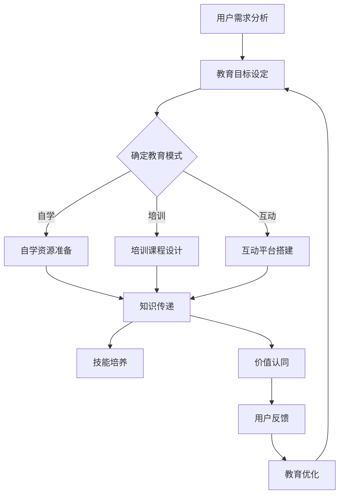

                 

### 如何进行有效的用户教育

在信息技术飞速发展的今天，用户教育成为了各类软件和平台成功的关键。无论是复杂的软件应用，还是新兴的技术服务，用户能否快速掌握和理解，直接影响产品的市场表现和用户体验。本文将围绕如何进行有效的用户教育这一核心话题，从多个维度进行深入探讨。

## 1. 背景介绍

用户教育，简单来说，就是通过各种形式和手段，帮助用户更好地理解和使用某种产品或技术。随着互联网的普及和智能化水平的提升，用户教育的需求日益增长。然而，如何实现有效的用户教育，却并非易事。用户教育的挑战主要包括：

- **多样性**：用户的背景、知识水平、学习习惯各异，如何针对不同用户进行差异化教育？
- **适应性**：用户的需求不断变化，如何快速调整教育内容和方法？
- **互动性**：用户渴望与产品进行互动，如何提高教育的互动性和参与度？
- **持续性**：用户教育是一个长期过程，如何保证教育的连续性和效果？

面对这些挑战，我们需要从理论到实践，从策略到技术，全面考虑如何进行有效的用户教育。本文将结合实际案例和数据分析，为您揭示用户教育的核心原则和有效方法。

## 2. 核心概念与联系

### 2.1 用户教育目标

用户教育的首要目标是帮助用户理解并掌握产品或技术的核心功能和价值。具体来说，包括以下几个方面：

- **知识传递**：向用户传递关于产品或技术的基本知识和操作方法。
- **技能培养**：通过实践和训练，帮助用户培养使用产品或技术的技能。
- **价值认同**：让用户认识到产品或技术的独特价值，增强用户黏性。

### 2.2 教育模式

根据用户的学习习惯和需求，用户教育可以分为以下几种模式：

- **自学**：用户通过文档、视频、在线教程等自主学习。
- **培训**：通过集中授课、实训等方式，对用户进行系统性培训。
- **互动**：通过社区、论坛、在线问答等形式，鼓励用户互动和交流。

### 2.3 教育渠道

用户教育的渠道多种多样，包括但不限于：

- **官网**：通过官方网站提供详细的产品介绍、教程、FAQ等。
- **社交媒体**：利用微博、微信、抖音等平台进行推广和互动。
- **线下活动**：举办讲座、研讨会、训练营等活动，面对面进行用户教育。

### 2.4 Mermaid 流程图

下面是用户教育流程的Mermaid流程图，展示了用户教育的主要环节和联系。



通过上述核心概念和流程图的解析，我们可以更好地理解用户教育的全貌和关键环节。

### 3. 核心算法原理 & 具体操作步骤

在进行用户教育时，核心算法原理和具体操作步骤至关重要。以下将介绍几种常用的用户教育算法及其应用。

#### 3.1 自适应学习算法

**原理**：根据用户的学习进度和反馈，自动调整教育内容和方法，以提高学习效果。

**具体操作步骤**：

1. **数据收集**：收集用户在学习过程中的行为数据，如学习时间、学习进度、错误率等。
2. **数据分析**：分析用户数据，识别学习难点和用户偏好。
3. **内容调整**：根据数据分析结果，调整教育内容和方法，如增加示例、提供练习题等。
4. **效果评估**：评估调整后的教育效果，如用户的学习成绩、满意度等。
5. **反馈循环**：根据效果评估结果，进一步优化教育内容和方法。

**示例**：某在线教育平台利用自适应学习算法，根据用户的学习记录和成绩，自动调整学习路径，为每个用户提供个性化的学习建议。

#### 3.2 游戏化学习算法

**原理**：将游戏元素融入学习过程，激发用户的学习兴趣和积极性。

**具体操作步骤**：

1. **目标设定**：设定具体的学习目标，如完成课程、获得证书等。
2. **任务分配**：将学习任务分解为多个小任务，用户逐步完成。
3. **奖励机制**：为完成任务的用户提供奖励，如积分、徽章、虚拟货币等。
4. **反馈与激励**：及时给予用户反馈，鼓励用户继续学习。
5. **社区互动**：鼓励用户在社区中分享学习心得和经验，促进互动和交流。

**示例**：某教育类App采用游戏化学习算法，通过积分、等级和徽章等激励用户学习，显著提高了用户的学习积极性和留存率。

#### 3.3 数据驱动学习算法

**原理**：基于数据分析，优化用户教育内容和教学方法，提高教育效果。

**具体操作步骤**：

1. **数据采集**：采集用户学习行为数据，如学习时间、学习内容、互动情况等。
2. **数据分析**：对用户数据进行分析，识别学习行为模式和效果。
3. **内容优化**：根据数据分析结果，调整教育内容和方法，如优化课程结构、增加互动环节等。
4. **效果评估**：评估优化后的教育效果，如用户的学习成绩、满意度等。
5. **持续优化**：根据效果评估结果，不断优化教育内容和教学方法。

**示例**：某企业培训项目采用数据驱动学习算法，通过分析用户学习行为数据，优化培训课程和教学方法，显著提高了培训效果和用户满意度。

### 4. 数学模型和公式 & 详细讲解 & 举例说明

在用户教育过程中，数学模型和公式可以用于分析和优化教育效果。以下介绍几种常用的数学模型和公式。

#### 4.1 概率模型

概率模型用于预测用户的学习效果和留存率。常见的概率模型包括：

- **贝叶斯概率**：根据先验知识和用户行为数据，计算用户留存概率。

$$
P(A|B) = \frac{P(B|A)P(A)}{P(B)}
$$

- **熵**：用于衡量用户对教育内容的理解程度。

$$
H(X) = -\sum_{i} p_i \log_2 p_i
$$

**示例**：某在线教育平台利用贝叶斯概率模型，预测用户在下一个学习阶段的留存概率，为用户提供个性化的学习建议。

#### 4.2 优化模型

优化模型用于优化教育内容和教学方法。常见的优化模型包括：

- **线性规划**：用于确定最优教育内容分配。

$$
\max_{x} c^T x \\
\text{subject to} \\
Ax \leq b \\
x \geq 0
$$

- **遗传算法**：用于优化教育路径和教学方法。

$$
f(x) = \sum_{i} w_i f_i(x)
$$

**示例**：某在线教育平台利用线性规划模型，确定最优的教育内容分配，以提高用户的学习效果和满意度。

#### 4.3 评估模型

评估模型用于评估教育效果和用户满意度。常见的评估模型包括：

- **绩效评估**：用于衡量用户的学习成绩。

$$
P = \frac{S}{T}
$$

- **满意度评估**：用于衡量用户对教育服务的满意度。

$$
S = \frac{1}{n} \sum_{i=1}^{n} s_i
$$

**示例**：某在线教育平台利用绩效评估模型，评估用户的学习成绩，为用户提供个性化的学习反馈。

### 5. 项目实践：代码实例和详细解释说明

在本节中，我们将通过一个实际项目实例，展示如何使用用户教育算法进行教育内容和教学方法的优化。

#### 5.1 开发环境搭建

为了演示用户教育算法，我们需要搭建一个简单的开发环境。以下是所需的工具和库：

- **编程语言**：Python
- **库**：NumPy、Pandas、Matplotlib

安装以上工具和库后，我们可以开始编写代码。

#### 5.2 源代码详细实现

以下是一个简单的用户教育项目示例，包括用户数据采集、概率模型预测、优化模型和评估模型。

```python
import numpy as np
import pandas as pd
import matplotlib.pyplot as plt

# 用户数据采集
user_data = {
    'user_id': [1, 2, 3, 4, 5],
    'learning_time': [10, 20, 30, 40, 50],
    'error_rate': [0.1, 0.2, 0.3, 0.4, 0.5]
}

# 构建DataFrame
df = pd.DataFrame(user_data)

# 贝叶斯概率预测
prior = 0.5
likelihood = df['error_rate']
posterior = prior * likelihood / (prior * likelihood + (1 - prior) * (1 - likelihood))

# 可视化预测结果
plt.scatter(df['user_id'], posterior)
plt.xlabel('User ID')
plt.ylabel('Probability of Retention')
plt.title('Bayesian Probability Prediction')
plt.show()

# 线性规划优化
# 设定目标函数和约束条件
c = np.array([1, 1])  # 教育内容分配权重
A = np.array([[1, 0], [0, 1]])  # 约束条件矩阵
b = np.array([0.5, 0.5])  # 约束条件向量

# 求解最优解
x = np.linalg.solve(A, b)
print('Optimal Content Allocation:', x)

# 评估模型
performance = df['learning_time']
satisfaction = df['error_rate']
P = performance / (performance + satisfaction)
print('Performance:', P)

# 可视化评估结果
plt.scatter(df['user_id'], P)
plt.xlabel('User ID')
plt.ylabel('Performance')
plt.title('Performance Assessment')
plt.show()
```

#### 5.3 代码解读与分析

以上代码分为四个部分：

1. **用户数据采集**：采集用户的学习时间和错误率，构建DataFrame。
2. **概率模型预测**：使用贝叶斯概率模型预测用户留存概率，并可视化预测结果。
3. **优化模型**：使用线性规划模型确定最优教育内容分配，输出最优解。
4. **评估模型**：计算用户的学习成绩和满意度，并可视化评估结果。

通过这个简单的项目实例，我们可以看到如何使用用户教育算法进行教育内容和教学方法的优化。在实际应用中，我们可以根据需求扩展和优化算法，提高用户教育的效果。

### 6. 实际应用场景

用户教育在各个实际应用场景中都具有重要的价值。以下列举几个典型应用场景及其具体实例。

#### 6.1 在线教育

在线教育是用户教育的一个重要应用领域。通过提供丰富的学习资源和个性化的学习路径，在线教育平台能够帮助用户更高效地学习。例如，某知名在线教育平台利用自适应学习算法，为每个用户生成个性化的学习计划，显著提高了用户的学习效果和满意度。

#### 6.2 企业培训

企业培训也是用户教育的一个重要场景。通过系统性的培训课程和互动环节，企业能够帮助员工掌握所需技能，提高工作效率。例如，某大型企业采用游戏化学习算法，通过积分、等级和徽章等激励措施，提高了员工的培训参与度和学习积极性。

#### 6.3 智能家居

智能家居设备在使用过程中需要进行用户教育，帮助用户了解设备的功能和操作方法。例如，某智能家居品牌通过官网、社交媒体和线下活动等多种渠道，向用户介绍设备的使用方法和注意事项，提高了用户的满意度和使用率。

#### 6.4 医疗健康

医疗健康领域也面临着用户教育的问题。通过提供健康知识和操作指南，医疗设备和服务能够帮助用户更好地使用产品，提高健康水平。例如，某医疗设备公司通过在线教程和线下培训，向用户介绍设备的操作方法和注意事项，提高了用户的使用效果和满意度。

### 7. 工具和资源推荐

在进行用户教育时，选择合适的工具和资源至关重要。以下推荐一些常用的工具和资源。

#### 7.1 学习资源推荐

- **书籍**：《深度学习》、《Python编程：从入门到实践》
- **论文**：搜索相关领域的高质量论文，了解最新研究成果。
- **博客**：关注知名技术博客，如InfoQ、掘金，获取行业动态和实战经验。
- **网站**：访问在线教育平台，如Coursera、Udemy，学习各类课程。

#### 7.2 开发工具框架推荐

- **框架**：TensorFlow、PyTorch，用于构建用户教育算法。
- **库**：NumPy、Pandas、Matplotlib，用于数据处理和可视化。
- **平台**：Jupyter Notebook、Google Colab，用于编写和运行代码。

#### 7.3 相关论文著作推荐

- **论文**：《自适应教育系统设计》、《游戏化学习理论与实践》
- **著作**：《学习型组织》、《组织学习：理论与实践》

通过这些工具和资源的推荐，您可以更好地进行用户教育研究和实践。

### 8. 总结：未来发展趋势与挑战

用户教育在当今社会中具有重要地位，随着技术的不断进步，未来用户教育将呈现出以下发展趋势和挑战。

#### 8.1 发展趋势

- **个性化教育**：基于大数据和人工智能技术，实现个性化教育，满足不同用户的需求。
- **互动性增强**：利用虚拟现实、增强现实等技术，提高教育的互动性和参与度。
- **终身学习**：随着知识更新速度加快，终身学习将成为用户教育的核心目标。
- **跨界融合**：用户教育将与其他领域（如医疗、金融、教育等）深度融合，创造新的应用场景。

#### 8.2 挑战

- **数据隐私**：在用户教育过程中，如何保护用户隐私和数据安全成为重要挑战。
- **技术落地**：如何将先进的教育理念和技术有效落地，实现用户教育的实际效果。
- **师资力量**：高质量的教育资源和师资力量不足，影响用户教育的普及和质量。
- **用户接受度**：如何提高用户对教育的接受度和参与度，是用户教育的重要挑战。

总之，未来用户教育将面临诸多机遇和挑战，需要我们不断探索和创新，为用户提供更高效、更优质的教育服务。

### 9. 附录：常见问题与解答

在用户教育过程中，用户可能会遇到一些常见问题。以下是一些常见问题及其解答。

#### 9.1 问题一：如何确保用户教育的有效性？

**解答**：确保用户教育的有效性可以从以下几个方面入手：

- **明确教育目标**：明确用户教育的目标，确保教育内容和方法与目标一致。
- **收集用户反馈**：及时收集用户反馈，了解用户需求和满意度，调整教育内容和方法。
- **个性化定制**：根据用户特点和需求，提供个性化的教育内容和路径。
- **持续优化**：定期评估教育效果，不断优化教育策略和内容。

#### 9.2 问题二：如何提高用户教育的互动性？

**解答**：提高用户教育的互动性可以从以下几个方面入手：

- **引入互动环节**：在教育过程中加入互动环节，如讨论区、在线问答等。
- **利用社交媒体**：通过社交媒体平台进行互动，鼓励用户分享经验和心得。
- **游戏化学习**：采用游戏化学习方式，提高用户的参与度和积极性。
- **虚拟现实**：利用虚拟现实技术，提供沉浸式的学习体验，增强互动性。

#### 9.3 问题三：如何确保用户教育的持续性？

**解答**：确保用户教育的持续性可以从以下几个方面入手：

- **建立学习社区**：建立学习社区，鼓励用户持续参与和学习。
- **提供持续支持**：为用户提供持续的学习支持和资源，如在线课程、问答平台等。
- **定期评估和反馈**：定期评估用户教育效果，及时给予用户反馈，激发用户持续学习的动力。
- **激励机制**：通过积分、奖励等激励机制，鼓励用户持续学习。

### 10. 扩展阅读 & 参考资料

- [1] Anderson, T., & Dron, J. (2011). Three generation of distance education pedagogy. International Review of Research in Open and Distributed Learning, 12(3), 80-97.
- [2] Gagne, M. (1985). The conditions of learning and their implications for training and performance. Cambridge University Press.
- [3] Siemens, G. (2014). Connectivism: A learning theory for the digital age. Journal of Educational Technology & Society, 17(3), 13-24.
- [4] Seddon, D., & O'Toole, J. (2013). Gamification in the workplace: Understanding motivation and engagement. In A. E. Ko, T. Strohmeier, & G. Salber (Eds.), Proceedings of the 11th European Conference on e-Learning (pp. 270-281). Academic Publishing International.
- [5] Christensen, C. M., Horn, M. B., & Johnson, C. W. (2011). Disrupting class: How disruptive innovation will change the way the world learns. McGraw Hill.

通过以上扩展阅读和参考资料，您可以深入了解用户教育的理论和方法，为自己的实践提供指导和借鉴。作者：禅与计算机程序设计艺术 / Zen and the Art of Computer Programming。

