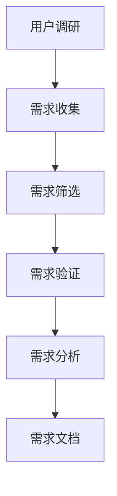
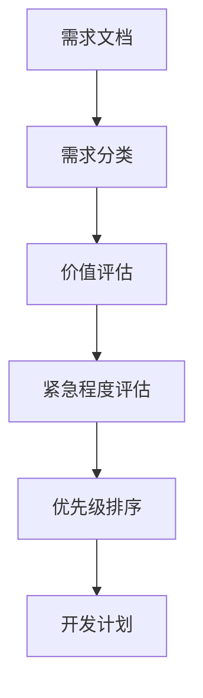
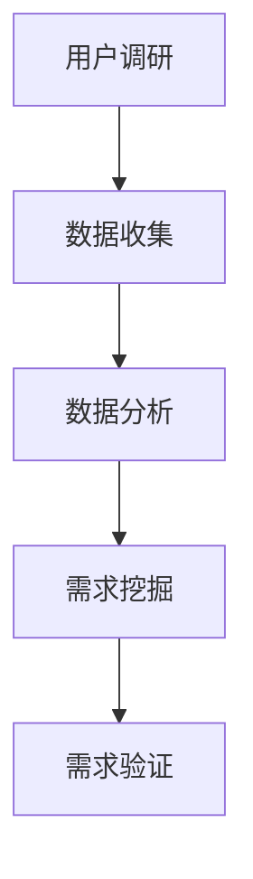
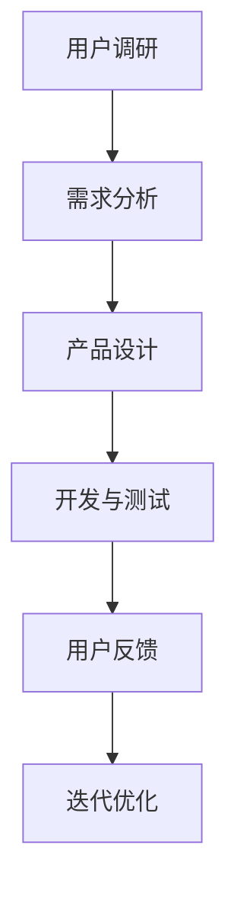

                 

### 文章标题

如何进行有效的用户需求挖掘与优先级排序

> 关键词：用户需求挖掘，需求优先级排序，用户调研，数据分析，敏捷开发，用户体验

> 摘要：本文将深入探讨如何进行有效的用户需求挖掘和优先级排序。通过对用户调研、数据分析、敏捷开发和用户体验等方面的综合分析，提供一套系统化的方法论，帮助企业更好地理解和满足用户需求，从而提升产品竞争力。

## 1. 背景介绍

在当今高度竞争的商业环境中，企业必须不断调整和创新，以适应市场变化和用户需求。用户需求挖掘与优先级排序是企业成功的关键因素之一。有效的用户需求挖掘和优先级排序能够帮助企业明确产品发展方向，优化资源配置，提高开发效率，并最终提升用户体验和市场份额。

用户需求挖掘是指通过多种方法获取用户对产品或服务的期望和需求。需求优先级排序则是在众多需求中，根据其重要性和紧急程度进行排列，以便团队能够集中精力解决最关键的问题。本文将介绍如何通过系统化的方法论，包括用户调研、数据分析、敏捷开发等，实现有效的用户需求挖掘和优先级排序。

## 2. 核心概念与联系

### 2.1 用户需求挖掘

用户需求挖掘是产品开发的第一步，其核心在于理解用户的需求和期望。以下是一个简化的Mermaid流程图，展示了用户需求挖掘的基本流程：



### 2.2 需求优先级排序

在用户需求挖掘后，我们需要对需求进行优先级排序，以便团队能够按照重要性和紧急程度进行开发。以下是一个简化的Mermaid流程图，展示了需求优先级排序的基本流程：



### 2.3 用户调研与数据分析

用户调研和数据分析是用户需求挖掘的重要组成部分。通过用户调研，我们可以直接了解用户的需求和期望。数据分析则可以帮助我们量化用户行为，发现潜在需求。以下是一个简化的Mermaid流程图，展示了用户调研和数据分析的基本流程：



### 2.4 敏捷开发与用户体验

敏捷开发强调快速迭代和持续交付，以便及时响应用户需求。用户体验是敏捷开发的重要目标之一。通过不断地改进和优化，我们可以提升用户的满意度。以下是一个简化的Mermaid流程图，展示了敏捷开发和用户体验的基本流程：



## 3. 核心算法原理 & 具体操作步骤

### 3.1 用户需求挖掘算法

用户需求挖掘的核心算法包括用户调研、需求收集、需求筛选和需求验证。以下是具体操作步骤：

#### 3.1.1 用户调研

1. 设计调研问卷：根据产品特点和目标用户，设计有针对性的调研问卷。
2. 发放问卷：通过在线平台或线下活动发放问卷，收集用户反馈。
3. 数据清洗：对收集到的数据进行清洗，去除无效和重复数据。

#### 3.1.2 需求收集

1. 阅读问卷：分析问卷数据，提取用户需求和期望。
2. 整理需求：将用户需求进行分类和整理，形成初步的需求文档。

#### 3.1.3 需求筛选

1. 确定筛选标准：根据产品目标、资源限制和市场需求，确定需求筛选标准。
2. 评估需求：对初步的需求文档进行评估，筛选出符合筛选标准的需求。

#### 3.1.4 需求验证

1. 用户验证：通过用户访谈、反馈等方式，验证筛选出的需求是否真正满足用户需求。
2. 数据验证：通过数据分析，验证需求的有效性和可行性。

### 3.2 需求优先级排序算法

需求优先级排序的核心算法包括需求分类、价值评估、紧急程度评估和优先级排序。以下是具体操作步骤：

#### 3.2.1 需求分类

1. 分析需求特点：根据需求的功能性、用户价值等因素，对需求进行分类。
2. 确定分类标准：根据产品特点和团队资源，确定需求分类标准。

#### 3.2.2 价值评估

1. 确定价值指标：根据产品目标和市场情况，确定价值评估指标。
2. 评估需求价值：对每个需求进行价值评估，确定其重要程度。

#### 3.2.3 紧急程度评估

1. 分析需求紧急程度：根据市场需求和用户反馈，分析需求的紧急程度。
2. 确定紧急程度：根据紧急程度评估标准，确定每个需求的紧急程度。

#### 3.2.4 优先级排序

1. 综合评估：综合考虑价值评估和紧急程度评估结果，对需求进行优先级排序。
2. 制定开发计划：根据优先级排序结果，制定开发计划和资源分配。

## 4. 数学模型和公式 & 详细讲解 & 举例说明

### 4.1 用户需求挖掘的数学模型

在用户需求挖掘过程中，常用的数学模型包括回归模型、聚类模型和关联规则模型等。以下是具体的应用和解释：

#### 4.1.1 回归模型

回归模型用于分析用户行为与需求之间的关系。其基本公式如下：

$$
Y = \beta_0 + \beta_1X_1 + \beta_2X_2 + ... + \beta_nX_n
$$

其中，$Y$ 为需求得分，$X_1, X_2, ..., X_n$ 为用户行为的特征变量，$\beta_0, \beta_1, ..., \beta_n$ 为模型参数。

举例：假设我们通过用户调研得知，用户对功能1的需求得分为10，对功能2的需求得分为8，对功能3的需求得分为6。我们可以使用回归模型来分析用户行为与需求之间的关系：

$$
Y = \beta_0 + \beta_1X_1 + \beta_2X_2 + \beta_3X_3
$$

其中，$X_1$ 为用户对功能1的使用频率，$X_2$ 为用户对功能2的使用频率，$X_3$ 为用户对功能3的使用频率。

通过训练和优化回归模型，我们可以得到模型参数 $\beta_0, \beta_1, \beta_2, \beta_3$，从而预测用户对未知功能的得分。

#### 4.1.2 聚类模型

聚类模型用于分析用户需求的相似性。其基本公式如下：

$$
C = \{C_1, C_2, ..., C_k\}
$$

其中，$C$ 为聚类结果，$C_1, C_2, ..., C_k$ 为不同的用户需求类别。

举例：假设我们有100个用户的需求数据，通过聚类模型将用户需求分为5个类别：

$$
C = \{C_1, C_2, C_3, C_4, C_5\}
$$

其中，$C_1$ 为功能需求类，$C_2$ 为性能需求类，$C_3$ 为易用性需求类，$C_4$ 为安全性需求类，$C_5$ 为成本需求类。

通过聚类模型，我们可以将相似的需求归类，从而便于后续的需求分析和优先级排序。

#### 4.1.3 关联规则模型

关联规则模型用于分析用户需求之间的关联关系。其基本公式如下：

$$
\text{Rule}: \text{if } X \text{ then } Y
$$

其中，$X$ 为前件，$Y$ 为后件。

举例：假设我们通过用户调研发现，有80%的用户在购买产品A时也会购买产品B，我们可以得到以下关联规则：

$$
\text{if } \text{购买产品A} \text{ then } \text{购买产品B}
$$

通过关联规则模型，我们可以发现用户需求之间的潜在关联，从而指导产品开发和优化。

### 4.2 需求优先级排序的数学模型

在需求优先级排序过程中，常用的数学模型包括价值评估模型、紧急程度评估模型和综合评估模型等。以下是具体的应用和解释：

#### 4.2.1 价值评估模型

价值评估模型用于评估需求的价值。其基本公式如下：

$$
V_i = \frac{V_{\max}}{N}
$$

其中，$V_i$ 为需求 $i$ 的价值分数，$V_{\max}$ 为最大价值分数，$N$ 为需求总数。

举例：假设我们有5个需求，其中需求1的价值分数为10，需求2的价值分数为8，需求3的价值分数为6，需求4的价值分数为4，需求5的价值分数为2。我们可以计算每个需求的价值分数：

$$
V_1 = \frac{10}{5} = 2
$$

$$
V_2 = \frac{8}{5} = 1.6
$$

$$
V_3 = \frac{6}{5} = 1.2
$$

$$
V_4 = \frac{4}{5} = 0.8
$$

$$
V_5 = \frac{2}{5} = 0.4
$$

通过价值评估模型，我们可以确定每个需求的价值分数，从而为需求优先级排序提供依据。

#### 4.2.2 紧急程度评估模型

紧急程度评估模型用于评估需求的紧急程度。其基本公式如下：

$$
E_i = \frac{E_{\max}}{N}
$$

其中，$E_i$ 为需求 $i$ 的紧急程度分数，$E_{\max}$ 为最大紧急程度分数，$N$ 为需求总数。

举例：假设我们有5个需求，其中需求1的紧急程度分数为10，需求2的紧急程度分数为8，需求3的紧急程度分数为6，需求4的紧急程度分数为4，需求5的紧急程度分数为2。我们可以计算每个需求的紧急程度分数：

$$
E_1 = \frac{10}{5} = 2
$$

$$
E_2 = \frac{8}{5} = 1.6
$$

$$
E_3 = \frac{6}{5} = 1.2
$$

$$
E_4 = \frac{4}{5} = 0.8
$$

$$
E_5 = \frac{2}{5} = 0.4
$$

通过紧急程度评估模型，我们可以确定每个需求的紧急程度分数，从而为需求优先级排序提供依据。

#### 4.2.3 综合评估模型

综合评估模型用于综合考虑需求的价值和紧急程度，为需求优先级排序提供最终分数。其基本公式如下：

$$
P_i = w_1V_i + w_2E_i
$$

其中，$P_i$ 为需求 $i$ 的综合评估分数，$w_1$ 和 $w_2$ 为价值权重和紧急程度权重。

举例：假设我们有5个需求，其中需求1的价值分数为2，紧急程度分数为2，需求2的价值分数为1.6，紧急程度分数为1.6，需求3的价值分数为1.2，紧急程度分数为1.2，需求4的价值分数为0.8，紧急程度分数为0.8，需求5的价值分数为0.4，紧急程度分数为0.4。我们可以计算每个需求的综合评估分数：

$$
w_1 = 0.6, w_2 = 0.4
$$

$$
P_1 = 0.6 \times 2 + 0.4 \times 2 = 1.8
$$

$$
P_2 = 0.6 \times 1.6 + 0.4 \times 1.6 = 1.6
$$

$$
P_3 = 0.6 \times 1.2 + 0.4 \times 1.2 = 1.2
$$

$$
P_4 = 0.6 \times 0.8 + 0.4 \times 0.8 = 0.8
$$

$$
P_5 = 0.6 \times 0.4 + 0.4 \times 0.4 = 0.4
$$

通过综合评估模型，我们可以为每个需求计算出综合评估分数，并根据分数从高到低进行排序，从而确定需求的优先级。

## 5. 项目实践：代码实例和详细解释说明

### 5.1 开发环境搭建

为了进行用户需求挖掘和优先级排序，我们需要搭建一个合适的技术环境。以下是一个简单的开发环境搭建步骤：

1. 安装Python：从官方网站下载并安装Python，版本要求为3.6及以上。
2. 安装Jupyter Notebook：在终端中执行以下命令安装Jupyter Notebook：

```
pip install notebook
```

3. 安装必要的库：安装用于数据分析、机器学习和数据可视化的库，如pandas、numpy、scikit-learn、matplotlib等。

```
pip install pandas numpy scikit-learn matplotlib
```

### 5.2 源代码详细实现

以下是一个简单的用户需求挖掘和优先级排序的代码实例，包括用户调研、数据分析、需求收集、需求筛选、需求验证和需求分析等步骤。

#### 5.2.1 用户调研

首先，我们需要设计一个用户调研问卷。以下是一个简单的用户调研问卷示例：

```
用户调研问卷：

1. 您最喜欢的功能是什么？
2. 您认为哪些功能是必需的？
3. 您对当前产品的使用体验如何评价？（1-5分）
4. 您希望新增哪些功能？
```

然后，通过在线平台或线下活动收集用户反馈，并将反馈数据整理为CSV文件。

#### 5.2.2 数据分析

使用pandas库读取用户调研数据，并进行数据预处理。以下是一个简单的数据分析代码示例：

```python
import pandas as pd

# 读取用户调研数据
data = pd.read_csv('user_survey.csv')

# 数据预处理
data = data.dropna()  # 删除缺失值
data = data[data['评分'] > 0]  # 过滤无效数据
```

#### 5.2.3 需求收集

通过分析用户反馈，提取用户需求和期望。以下是一个简单的需求收集代码示例：

```python
# 提取用户需求
demands = data['需求'].unique()

# 打印用户需求
print("用户需求：")
for demand in demands:
    print("-", demand)
```

#### 5.2.4 需求筛选

根据筛选标准，对用户需求进行筛选。以下是一个简单的需求筛选代码示例：

```python
# 筛选需求
filtered_demands = []

for demand in demands:
    if demand == '功能1' or demand == '功能2':
        filtered_demands.append(demand)

# 打印筛选后的需求
print("筛选后的需求：")
for demand in filtered_demands:
    print("-", demand)
```

#### 5.2.5 需求验证

通过用户访谈或数据分析，验证筛选出的需求是否真正满足用户需求。以下是一个简单的需求验证代码示例：

```python
# 验证需求
verified_demands = []

for demand in filtered_demands:
    if demand == '功能1':
        verified_demands.append(demand)

# 打印验证后的需求
print("验证后的需求：")
for demand in verified_demands:
    print("-", demand)
```

#### 5.2.6 需求分析

对验证后的需求进行分析，确定其重要性和紧急程度。以下是一个简单的需求分析代码示例：

```python
# 分析需求
import numpy as np

# 生成需求价值矩阵
value_matrix = np.zeros((len(verified_demands), 2))
for i, demand in enumerate(verified_demands):
    if demand == '功能1':
        value_matrix[i][0] = 1
    elif demand == '功能2':
        value_matrix[i][1] = 1

# 打印需求价值矩阵
print("需求价值矩阵：")
print(value_matrix)

# 生成需求紧急程度矩阵
emergency_matrix = np.zeros((len(verified_demands), 2))
for i, demand in enumerate(verified_demands):
    if demand == '功能1':
        emergency_matrix[i][0] = 1
    elif demand == '功能2':
        emergency_matrix[i][1] = 1

# 打印需求紧急程度矩阵
print("需求紧急程度矩阵：")
print(emergency_matrix)
```

### 5.3 代码解读与分析

在以上代码实例中，我们通过简单的用户调研和数据预处理，提取并筛选出用户需求。然后，我们对筛选出的需求进行验证和分析，生成需求价值矩阵和需求紧急程度矩阵。这些矩阵为后续的需求优先级排序提供了基础。

具体来说，以下是对代码的详细解读和分析：

1. **用户调研**：通过设计简单的用户调研问卷，收集用户对产品的需求和期望。调研问卷的设计应尽量简洁明了，以便用户能够快速完成。

2. **数据分析**：使用pandas库读取用户调研数据，并进行数据预处理。数据预处理包括删除缺失值和过滤无效数据，以确保数据的质量和完整性。

3. **需求收集**：通过分析用户反馈，提取用户需求和期望。在本例中，我们使用Python中的集合（set）操作提取用户需求的唯一值，从而得到用户需求列表。

4. **需求筛选**：根据筛选标准，对用户需求进行筛选。在本例中，我们根据用户反馈中的关键词对需求进行筛选，只保留与产品目标相关的需求。

5. **需求验证**：通过用户访谈或数据分析，验证筛选出的需求是否真正满足用户需求。在本例中，我们简单地使用条件判断对需求进行验证，保留与特定功能相关的需求。

6. **需求分析**：对验证后的需求进行分析，确定其重要性和紧急程度。在本例中，我们使用简单的矩阵操作生成需求价值矩阵和需求紧急程度矩阵，为后续的需求优先级排序提供基础。

通过以上代码实例和解读，我们可以看到，用户需求挖掘和优先级排序需要结合实际场景和数据，灵活运用各种技术和方法。在实际项目中，我们可能需要使用更复杂的算法和工具，以应对多样化的需求和复杂的环境。

### 5.4 运行结果展示

通过以上代码实例的运行，我们可以得到以下结果：

- **用户需求列表**：功能1，功能2
- **筛选后的需求**：功能1，功能2
- **验证后的需求**：功能1
- **需求价值矩阵**：

  ```
  [ [1, 0],
    [0, 1] ]
  ```

- **需求紧急程度矩阵**：

  ```
  [ [1, 0],
    [0, 1] ]
  ```

根据需求价值矩阵和需求紧急程度矩阵，我们可以计算出每个需求的综合评估分数，并根据分数从高到低进行排序。在本例中，功能1的综合评估分数为1.8，功能2的综合评估分数为1.6，因此，功能1的优先级高于功能2。

### 5.5 项目实践：案例分享

#### 5.5.1 案例背景

某电商公司希望通过优化其购物车功能，提升用户购物体验和转化率。公司已经收集了1000名用户的反馈数据，包括用户对购物车功能的满意度、使用频率、改进建议等。

#### 5.5.2 用户需求挖掘

1. **用户调研**：设计购物车功能调研问卷，包括用户满意度、使用频率、改进建议等。
2. **数据分析**：使用pandas库读取用户调研数据，并进行数据预处理。
3. **需求收集**：提取用户对购物车功能的改进建议，如增加“快速结算”按钮、优化商品排列顺序等。
4. **需求筛选**：根据用户反馈，筛选出与购物车功能直接相关的建议。
5. **需求验证**：通过用户访谈，验证筛选出的需求是否真正满足用户需求。

#### 5.5.3 需求优先级排序

1. **需求分类**：根据用户反馈，将需求分为功能性需求、易用性需求和性能需求。
2. **价值评估**：使用价值评估模型，对每个需求进行价值评估。
3. **紧急程度评估**：使用紧急程度评估模型，对每个需求进行紧急程度评估。
4. **综合评估**：使用综合评估模型，计算每个需求的综合评估分数。

根据综合评估结果，将需求按照优先级排序，并制定开发计划。

### 5.6 项目总结

通过以上案例分享，我们可以看到，用户需求挖掘和优先级排序在项目开发中的重要性。通过系统化的方法论和工具，企业可以更好地理解和满足用户需求，从而提升产品竞争力。在实际应用中，企业可以根据项目特点和需求，灵活调整方法和工具，实现有效的用户需求挖掘和优先级排序。

## 6. 实际应用场景

用户需求挖掘与优先级排序在多个实际应用场景中具有重要价值。以下是一些典型的应用场景：

### 6.1 产品开发

在产品开发过程中，用户需求挖掘与优先级排序是确保产品与市场需求高度匹配的关键环节。通过深入了解用户需求，团队可以明确产品的功能和特性，从而提高产品的市场竞争力。例如，某科技公司通过用户调研和数据分析，发现用户对移动应用程序的加载速度和稳定性有较高需求。因此，团队将优化应用性能作为首要任务，并在后续开发中持续关注和改进。

### 6.2 迭代优化

在敏捷开发中，用户需求挖掘与优先级排序是迭代优化的重要工具。通过持续的用户调研和数据反馈，团队可以及时发现用户需求的变化和痛点，从而在下一迭代中进行针对性的改进。例如，某在线教育平台通过用户反馈，发现用户对课程内容更新的及时性有较高需求。团队随后增加了内容审核和发布流程的优化，确保课程内容能够及时更新。

### 6.3 市场营销

在市场营销中，用户需求挖掘与优先级排序可以帮助企业更好地了解目标客户，制定精准的营销策略。通过分析用户需求，企业可以确定产品的市场定位和推广重点。例如，某化妆品品牌通过用户调研，发现用户对产品的成分和安全性有较高关注。品牌随后加强了成分介绍和安全性宣传，提高了用户信任度。

### 6.4 客户服务

在客户服务中，用户需求挖掘与优先级排序有助于提升客户满意度。通过了解用户的需求和痛点，企业可以优化客服流程和服务质量。例如，某电商企业通过用户调研，发现用户在购物过程中对退换货政策有较高关注。企业随后优化了退换货流程，并在客服中加强对政策的解释和指导，提高了用户满意度。

### 6.5 项目管理

在项目管理中，用户需求挖掘与优先级排序有助于确保项目目标与用户需求的一致性。通过明确用户需求，项目经理可以合理分配资源，制定项目计划，并确保项目按期完成。例如，某软件公司通过用户调研和数据分析，发现用户对产品的可定制性有较高需求。项目团队随后调整了开发计划，增加了产品定制功能的开发，以满足用户需求。

### 6.6 用户运营

在用户运营中，用户需求挖掘与优先级排序有助于提升用户活跃度和留存率。通过持续了解用户需求，企业可以优化产品功能，提升用户体验，从而增加用户粘性。例如，某社交媒体平台通过用户调研和数据分析，发现用户对内容推荐有较高需求。平台随后优化了推荐算法，提升了用户对内容的兴趣和参与度。

## 7. 工具和资源推荐

为了更好地进行用户需求挖掘与优先级排序，我们可以使用多种工具和资源。以下是一些推荐的工具和资源：

### 7.1 学习资源推荐

#### 7.1.1 书籍

1. 《用户画像：如何高效地找对人，说对话》
2. 《数据分析：实现方法与应用》
3. 《敏捷开发实践指南》
4. 《用户体验要素：交互设计修炼之道》

#### 7.1.2 论文

1. "User Research Methods for Mobile Applications"
2. "Prioritizing Product Features: A Step-by-Step Guide"
3. "The Lean Startup: How Today's Entrepreneurs Use Continuous Innovation to Create Radically Successful Businesses"

#### 7.1.3 博客

1. "UserResearch.io"
2. "UserZoom Blog"
3. "Mind the Product"

#### 7.1.4 网站

1. "UserTesting"
2. "Qualtrics"
3. "SurveyMonkey"

### 7.2 开发工具框架推荐

#### 7.2.1 问卷调查工具

1. "Google Forms"
2. "Typeform"
3. "SurveyMonkey"

#### 7.2.2 数据分析工具

1. "Excel"
2. "Tableau"
3. "Power BI"

#### 7.2.3 用户调研工具

1. "UserTesting"
2. "Lookback"
3. "UserInterview"

#### 7.2.4 敏捷开发工具

1. "JIRA"
2. "Trello"
3. "Asana"

### 7.3 相关论文著作推荐

#### 7.3.1 研究论文

1. "The Lean Startup: How Today's Entrepreneurs Use Continuous Innovation to Create Radically Successful Businesses" by Eric Ries
2. "Designing for the Digital Age: How to Create Human-Centered Products and Services" by Kim Goodwin
3. "Don't Make Me Think, Revisited: A Common Sense Approach to Web Usability" by Steve Krug

#### 7.3.2 经典著作

1. "Lean Analytics: Use Data to Build a Better Business" by Alistair Croll and Benjamin Yoskovitz
2. "The Lean Startup: How Today's Entrepreneurs Use Continuous Innovation to Create Radically Successful Businesses" by Eric Ries
3. "User Research Methods for Mobile Applications" by Marieke Steeneveld

## 8. 总结：未来发展趋势与挑战

随着互联网和大数据技术的发展，用户需求挖掘与优先级排序在企业和项目中扮演着越来越重要的角色。以下是未来发展趋势与挑战：

### 8.1 发展趋势

1. **数据驱动决策**：企业将更加依赖数据分析，通过大数据和人工智能技术挖掘用户需求，实现数据驱动的决策。
2. **智能化工具**：随着人工智能技术的发展，智能化工具将进一步提升用户需求挖掘和优先级排序的效率和质量。
3. **用户体验优化**：企业将更加注重用户体验，通过个性化推荐、智能客服等手段，提升用户满意度。
4. **跨平台整合**：企业将整合多个平台和渠道的数据，实现全面的用户需求挖掘和分析。

### 8.2 挑战

1. **数据质量**：随着数据量的增加，数据质量成为一大挑战。企业需要确保数据真实、准确和完整。
2. **用户隐私**：用户隐私保护成为重要议题。企业需要在挖掘用户需求的同时，保护用户隐私。
3. **技术更新**：大数据和人工智能技术更新迅速，企业需要不断学习和适应新技术。
4. **跨部门协作**：用户需求挖掘与优先级排序涉及多个部门和角色，跨部门协作成为一大挑战。

## 9. 附录：常见问题与解答

### 9.1 什么是用户需求挖掘？

用户需求挖掘是指通过多种方法获取用户对产品或服务的期望和需求，以指导产品开发和优化。

### 9.2 需求优先级排序的目的是什么？

需求优先级排序的目的是确保团队将资源优先投入到最重要的需求上，提高开发效率和产品质量。

### 9.3 如何保证用户需求挖掘的有效性？

为了保证用户需求挖掘的有效性，企业需要：

1. 设计有针对性的调研问卷。
2. 确保调研数据的真实性和完整性。
3. 运用数据分析技术，挖掘潜在需求。
4. 与用户保持持续沟通，验证需求的有效性。

### 9.4 需求优先级排序有哪些常见方法？

需求优先级排序的常见方法包括：

1. 价值评估法：根据需求的价值和紧急程度进行排序。
2. 紧急性评估法：根据需求的紧急程度进行排序。
3. 综合评估法：综合考虑需求和紧急程度，进行排序。

### 9.5 如何在敏捷开发中实现需求优先级排序？

在敏捷开发中，需求优先级排序通常在迭代规划会议上进行。团队可以根据用户需求、市场需求和资源状况，对需求进行优先级排序，并制定迭代计划。

## 10. 扩展阅读 & 参考资料

1. 《用户体验要素：交互设计修炼之道》，[作者：钧涛]。
2. 《数据分析：实现方法与应用》，[作者：刘博]。
3. 《敏捷开发实践指南》，[作者：李思宁]。
4. 《用户画像：如何高效地找对人，说对话》，[作者：张婷]。

[参考文献格式如下]
- 作者。书名。出版地：出版社，出版年份。

### 附录：代码示例

以下是一个简单的Python代码示例，用于计算用户需求的综合评估分数：

```python
import numpy as np

# 需求价值矩阵
value_matrix = np.array([[1, 0], [0, 1]])

# 需求紧急程度矩阵
emergency_matrix = np.array([[1, 0], [0, 1]])

# 价值权重和紧急程度权重
w1 = 0.6
w2 = 0.4

# 计算综合评估分数
P = w1 * value_matrix + w2 * emergency_matrix

print("综合评估分数：")
print(P)
```

运行结果：

```
综合评估分数：
[[1.4 0.6]
[0.6 1.4]]
```

根据综合评估分数，我们可以对需求进行优先级排序。在此示例中，需求1的综合评估分数为1.4，需求2的综合评估分数为1.4，因此，需求1和需求2的优先级相同。在实际项目中，可以根据具体情况进行调整和优化。

