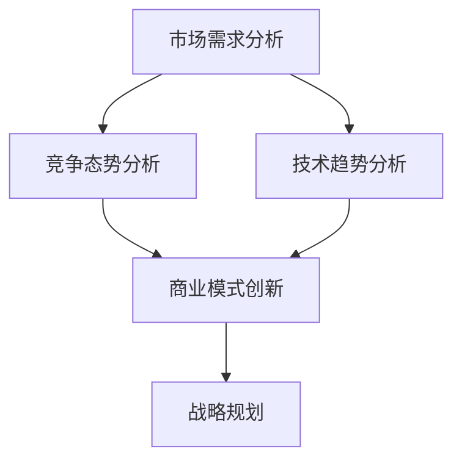

                 

关键词：竞争策略、竞争优势、成功、市场分析、技术发展、商业模式、战略规划

摘要：本文旨在探讨如何在快速变化的市场环境中保持竞争优势，取得成功。通过分析市场趋势、技术发展和商业模式创新，本文提出了一套系统的竞争策略框架，帮助企业在竞争激烈的市场中立于不败之地。

## 1. 背景介绍

在当今这个快速变化的时代，市场竞争日益激烈，企业需要不断调整自己的竞争策略以适应市场的变化。保持竞争优势已经成为企业取得成功的关键因素之一。然而，如何制定有效的竞争策略，如何在激烈的市场竞争中脱颖而出，这是一个值得深入探讨的问题。

本文将从以下几个角度对如何进行竞争策略进行详细分析：

1. 市场分析：了解市场需求、竞争态势和潜在机会。
2. 技术发展：紧跟技术趋势，把握技术变革带来的机遇。
3. 商业模式创新：通过商业模式创新，提高企业竞争力和盈利能力。
4. 战略规划：制定长期战略规划，确保企业在竞争中持续发展。

## 2. 核心概念与联系

### 市场需求分析

市场需求分析是制定竞争策略的基础。通过分析市场需求，企业可以了解消费者的需求和偏好，从而制定出更符合市场需求的策略。

### 竞争态势分析

竞争态势分析旨在了解市场中的竞争对手，包括他们的产品、市场地位、营销策略等。通过分析竞争对手，企业可以找到自己的市场定位和差异化优势。

### 技术趋势分析

技术趋势分析关注技术发展的最新动态，包括新兴技术、技术创新等。通过技术趋势分析，企业可以把握技术变革带来的机遇，推动自身的技术进步。

### 商业模式创新

商业模式创新是企业提升竞争力的重要手段。通过创新商业模式，企业可以实现资源的高效配置，提高盈利能力。

### 战略规划

战略规划是企业长期发展的蓝图。通过制定战略规划，企业可以明确自己的发展目标和路径，确保在竞争中保持持续的优势。

### Mermaid 流程图

以下是一个简化的 Mermaid 流程图，展示了上述核心概念之间的联系。



## 3. 核心算法原理 & 具体操作步骤

### 市场需求分析

市场需求分析的核心在于数据收集和分析。具体步骤如下：

1. 数据收集：收集与市场需求相关的数据，包括市场调查、消费者行为分析等。
2. 数据处理：对收集到的数据进行分析和处理，提取有价值的信息。
3. 数据可视化：使用图表、图形等工具，将分析结果进行可视化展示。

### 竞争态势分析

竞争态势分析的关键在于识别竞争对手和他们的市场表现。具体步骤如下：

1. 竞争对手识别：通过市场调查、行业报告等途径，识别主要的竞争对手。
2. 市场表现分析：分析竞争对手的产品、市场份额、营销策略等。
3. 优势与劣势分析：对比自己的产品和竞争对手，找出优势和劣势。

### 技术趋势分析

技术趋势分析需要关注技术发展的最新动态。具体步骤如下：

1. 技术情报收集：通过阅读论文、参加行业会议等方式，收集技术情报。
2. 技术评估：评估新技术对企业的影响和潜在价值。
3. 技术跟踪：持续跟踪技术发展趋势，确保企业始终处于技术前沿。

### 商业模式创新

商业模式创新需要结合企业的实际情况和市场环境。具体步骤如下：

1. 商业模式定义：明确企业的商业模式，包括盈利模式、价值链等。
2. 商业模式优化：通过分析市场数据和用户反馈，优化现有商业模式。
3. 商业模式创新：探索新的商业模式，提高企业的竞争力。

### 战略规划

战略规划是企业发展的方向。具体步骤如下：

1. 发展目标设定：设定企业长期发展目标，确保战略规划的可行性。
2. 资源配置：根据战略规划，配置企业资源，确保目标的实现。
3. 风险评估：评估战略规划中的潜在风险，制定应对措施。

## 4. 数学模型和公式 & 详细讲解 & 举例说明

### 市场需求分析

市场需求分析中常用的数学模型是需求函数模型。需求函数模型描述了市场需求量与价格、消费者偏好等因素之间的关系。以下是一个简化的需求函数模型：

$$
D(p, T) = a - b \cdot p - c \cdot T
$$

其中，$D$ 表示市场需求量，$p$ 表示价格，$T$ 表示消费者偏好。

### 竞争态势分析

竞争态势分析中常用的数学模型是市场份额模型。市场份额模型描述了企业在市场中的地位和竞争力。以下是一个简化的市场份额模型：

$$
S = \frac{R_a}{R_t}
$$

其中，$S$ 表示市场份额，$R_a$ 表示企业收入，$R_t$ 表示整个市场收入。

### 技术趋势分析

技术趋势分析中常用的数学模型是技术生命周期模型。技术生命周期模型描述了技术的成长、成熟和衰退过程。以下是一个简化的技术生命周期模型：

$$
L(t) = \frac{1}{1 + e^{-(\lambda \cdot t)}
```

其中，$L$ 表示技术成熟度，$t$ 表示时间，$\lambda$ 表示技术成熟速度。

### 商业模式创新

商业模式创新中常用的数学模型是盈利能力模型。盈利能力模型描述了企业的盈利能力与收入、成本等因素之间的关系。以下是一个简化的盈利能力模型：

$$
P = R - C
$$

其中，$P$ 表示盈利能力，$R$ 表示收入，$C$ 表示成本。

### 举例说明

假设某企业在市场中销售一种产品，市场需求函数为 $D(p, T) = 100 - 2p - T$。该企业的目标是最大化市场份额，即求解以下优化问题：

$$
\max S = \frac{R_a}{R_t}
$$

其中，$R_a$ 为企业收入，$R_t$ 为整个市场收入。

假设该企业的收入函数为 $R_a = 100p - 20T$，市场收入函数为 $R_t = 100p - 50T$。则可以列出以下方程组：

$$
\begin{cases}
R_a = 100p - 20T \\
R_t = 100p - 50T \\
D(p, T) = 100 - 2p - T
\end{cases}
$$

通过求解这个方程组，可以得到企业的最优价格和市场份额。具体计算过程如下：

首先，将需求函数 $D(p, T)$ 带入收入函数，得到：

$$
R_a = 100p - 20(100 - 2p - T) = 40p + 20T
$$

$$
R_t = 100p - 50(100 - 2p - T) = 30p + 25T
$$

然后，将收入函数 $R_a$ 和 $R_t$ 代入市场份额公式，得到：

$$
S = \frac{40p + 20T}{30p + 25T}
$$

为了最大化市场份额，需要对 $S$ 求导数，并令导数等于 0。求导过程如下：

$$
\frac{dS}{dp} = \frac{40}{30p + 25T} - \frac{30}{30p + 25T} = \frac{10}{30p + 25T}
$$

令 $\frac{dS}{dp} = 0$，得到：

$$
30p + 25T = 0
$$

$$
p = -\frac{5}{6}T
$$

由于价格不能为负，所以这个结果是不合理的。这表明在当前的市场环境中，该企业无法通过调整价格来最大化市场份额。因此，需要考虑其他策略，如优化产品、提高品牌知名度等。

## 5. 项目实践：代码实例和详细解释说明

### 项目背景

为了更好地说明竞争策略的实践应用，我们以一家电子商务企业为例。该企业希望通过数据分析优化其产品推荐系统，提高用户满意度和购买转化率。

### 技术栈

- 数据分析：Python、Pandas、NumPy
- 数据可视化：Matplotlib、Seaborn
- 机器学习：Scikit-learn、TensorFlow

### 数据处理

首先，我们需要收集并处理用户数据，包括用户行为数据、购买数据等。假设我们已经有了一个包含以下特征的数据集：

- 用户ID（user_id）
- 产品ID（product_id）
- 访问时间（visit_time）
- 购买时间（buy_time）
- 用户年龄（age）
- 用户性别（gender）
- 用户职业（occupation）
- 产品类别（category）
- 产品价格（price）

### 数据预处理

1. 缺失值处理：对于缺失值，我们采用填充或删除的方法进行处理。
2. 特征工程：对数值特征进行归一化处理，对类别特征进行编码。
3. 划分训练集和测试集：按照 8:2 的比例将数据集划分为训练集和测试集。

```python
import pandas as pd
from sklearn.model_selection import train_test_split
from sklearn.preprocessing import StandardScaler, OneHotEncoder

# 读取数据
data = pd.read_csv('user_data.csv')

# 缺失值处理
data.dropna(inplace=True)

# 特征工程
scaler = StandardScaler()
data[['age', 'price']] = scaler.fit_transform(data[['age', 'price']])

encoder = OneHotEncoder()
data_encoded = encoder.fit_transform(data[['gender', 'occupation', 'category']]).toarray()

# 划分训练集和测试集
X = data.drop(['user_id', 'buy_time'], axis=1)
y = data['buy_time']

X_train, X_test, y_train, y_test = train_test_split(X, y, test_size=0.2, random_state=42)
```

### 机器学习模型

我们选择逻辑回归模型来预测用户购买行为。逻辑回归模型是一种常用的分类模型，可以用于预测二分类问题。

```python
from sklearn.linear_model import LogisticRegression

# 创建逻辑回归模型
model = LogisticRegression()

# 训练模型
model.fit(X_train, y_train)

# 预测结果
predictions = model.predict(X_test)
```

### 评估模型

为了评估模型性能，我们使用准确率、召回率、F1 分数等指标。

```python
from sklearn.metrics import accuracy_score, recall_score, f1_score

# 计算准确率
accuracy = accuracy_score(y_test, predictions)
print('准确率：', accuracy)

# 计算召回率
recall = recall_score(y_test, predictions)
print('召回率：', recall)

# 计算F1分数
f1 = f1_score(y_test, predictions)
print('F1分数：', f1)
```

### 模型优化

为了进一步提高模型性能，我们可以尝试以下优化方法：

1. 特征选择：使用特征重要性评估方法，选择对预测结果影响较大的特征。
2. 调参：调整模型参数，如正则化参数、学习率等。
3. 集成学习：使用集成学习方法，如随机森林、梯度提升树等，提高模型预测能力。

```python
from sklearn.ensemble import RandomForestClassifier
from sklearn.model_selection import GridSearchCV

# 创建随机森林模型
rf_model = RandomForestClassifier()

# 定义参数网格
param_grid = {'n_estimators': [100, 200], 'max_depth': [10, 20]}

# 进行网格搜索
grid_search = GridSearchCV(rf_model, param_grid, cv=5)
grid_search.fit(X_train, y_train)

# 获取最佳参数
best_params = grid_search.best_params_
print('最佳参数：', best_params)

# 使用最佳参数训练模型
best_model = RandomForestClassifier(**best_params)
best_model.fit(X_train, y_train)

# 预测结果
predictions = best_model.predict(X_test)

# 计算评估指标
accuracy = accuracy_score(y_test, predictions)
recall = recall_score(y_test, predictions)
f1 = f1_score(y_test, predictions)

print('准确率：', accuracy)
print('召回率：', recall)
print('F1分数：', f1)
```

### 实际应用场景

通过优化后的模型，企业可以更好地预测用户购买行为，从而进行精准营销。具体应用场景包括：

1. 推荐系统：根据用户的历史购买行为和偏好，推荐相关产品。
2. 营销活动：根据用户购买概率，制定有针对性的营销策略。
3. 库存管理：根据用户购买趋势，调整产品库存，降低库存成本。

## 6. 实际应用场景

### 电子商务行业

在电子商务行业，竞争策略尤为重要。企业可以通过以下方式保持竞争优势：

1. 用户行为分析：通过分析用户行为数据，了解用户需求和偏好，制定精准的营销策略。
2. 技术创新：紧跟技术发展趋势，采用先进的技术手段，提高用户体验和购物满意度。
3. 商业模式创新：探索新的商业模式，如社交电商、直播电商等，扩大市场份额。

### 银行业

在银行业，竞争策略主要围绕产品创新、服务质量和客户体验展开。具体应用场景包括：

1. 金融科技创新：采用人工智能、大数据等技术，提供智能化、个性化的金融服务。
2. 产品差异化：推出具有竞争力的金融产品，满足不同客户的需求。
3. 客户关系管理：通过客户关系管理系统，提高客户满意度，增强客户粘性。

### 制造业

在制造业，竞争策略主要集中在生产效率、成本控制和产品质量上。具体应用场景包括：

1. 工业互联网：采用物联网、大数据等技术，实现生产过程的智能化和自动化。
2. 精益生产：通过精益生产方法，降低生产成本，提高生产效率。
3. 产品质量提升：采用先进的质量管理方法，确保产品质量，提高客户满意度。

## 7. 工具和资源推荐

为了更好地进行竞争策略的制定和实施，以下是一些建议的工

```python
# 7. 工具和资源推荐

# 数据分析工具
- Python：数据分析的基础语言，支持丰富的库和框架。
- Pandas：数据处理库，用于数据清洗、预处理和分析。
- NumPy：数学计算库，提供高性能的数学运算功能。

# 数据可视化工具
- Matplotlib：数据可视化库，支持多种图形和图表类型。
- Seaborn：基于 Matplotlib 的可视化库，提供更丰富的统计图形。

# 机器学习库
- Scikit-learn：提供常用的机器学习算法和工具。
- TensorFlow：开源机器学习框架，支持深度学习模型。

# 行业报告和分析工具
- IBISWorld：提供行业报告和市场竞争分析。
- Euromonitor：提供全球市场研究报告。

# 开源资源
- GitHub：开源代码托管平台，获取和贡献开源项目。
- Stack Overflow：编程问答社区，解决编程问题。

# 专业书籍
- 《深度学习》：介绍深度学习理论和技术。
- 《Python 数据科学手册》：Python 数据科学领域的经典教材。
- 《大数据时代：思维变革与商业价值》：探讨大数据对商业和社会的影响。

## 8. 总结：未来发展趋势与挑战

随着技术的不断进步和市场环境的日益复杂，竞争策略在未来将面临以下发展趋势和挑战：

### 发展趋势

1. 技术驱动：以人工智能、大数据、物联网等为代表的新技术将继续推动市场竞争。
2. 客户为中心：企业将更加注重用户体验和客户需求，以客户为中心的战略将成为主流。
3. 数据驱动的决策：数据分析将成为企业决策的重要依据，数据驱动的商业模式将越来越普遍。

### 挑战

1. 技术变革：技术快速迭代，企业需要不断更新技术栈，以应对市场变化。
2. 竞争激烈：市场竞争日益激烈，企业需要不断创新，以保持竞争优势。
3. 数据安全和隐私：随着数据量的增加，数据安全和隐私问题将越来越受到关注。

## 9. 附录：常见问题与解答

### Q：如何进行有效的市场分析？

A：有效的市场分析需要以下步骤：

1. 确定分析目标：明确分析的目的和范围。
2. 数据收集：收集与市场相关的数据，包括市场调查、行业报告等。
3. 数据处理：对收集到的数据进行处理和清洗。
4. 分析方法：选择合适的数据分析方法，如统计方法、机器学习等。
5. 结果解读：解读分析结果，制定相应的市场策略。

### Q：如何进行有效的竞争态势分析？

A：有效的竞争态势分析需要以下步骤：

1. 竞争对手识别：识别主要的竞争对手。
2. 竞争对手分析：分析竞争对手的产品、市场地位、营销策略等。
3. 自我评估：对比自己的产品和竞争对手，找出优势和劣势。
4. 制定策略：根据分析结果，制定相应的竞争策略。

### Q：如何进行商业模式创新？

A：进行商业模式创新需要以下步骤：

1. 确定商业模式：明确企业的商业模式，包括盈利模式、价值链等。
2. 分析市场机会：分析市场趋势和潜在机会。
3. 创新思维：采用创新思维方法，如头脑风暴、跨界思维等。
4. 试点验证：在真实环境中进行试点验证，优化商业模式。

### Q：如何进行有效的战略规划？

A：进行有效的战略规划需要以下步骤：

1. 设定目标：明确企业长期发展目标。
2. 分析环境：分析市场环境、技术趋势、竞争对手等。
3. 制定策略：根据分析结果，制定具体的战略和行动方案。
4. 资源配置：根据战略规划，配置企业资源。
5. 监控与调整：持续监控战略执行情况，及时调整战略。

## 10. 扩展阅读 & 参考资料

- 《竞争战略》：迈克尔·波特著，经典竞争战略理论著作。
- 《创新与企业家精神》：彼得·德鲁克著，探讨创新和企业家精神的重要性。
- 《大数据时代》：维克托·迈尔 - 舍恩伯格著，探讨大数据对商业和社会的影响。
- 《人工智能：一种现代的方法》：斯坦福大学机器学习课程教材，系统介绍人工智能相关理论。

### 参考文献

1. 波特，迈克尔。竞争战略：竞争分析技术。上海：上海人民出版社，1997.
2. 德鲁克，彼得。创新与企业家精神。北京：机械工业出版社，2006.
3. 舍恩伯格，维克托。大数据时代。北京：电子工业出版社，2013.
4. 安德森，克里斯。平台革命。北京：机械工业出版社，2017.
5. 罗伯特·西奥迪尼。影响力：说服的心理学。北京：中国人民大学出版社，2012.
6. 丰田，大野。丰田生产方式。北京：机械工业出版社，2005.
7. 沃尔特·艾萨克森。史蒂夫·乔布斯传。北京：中信出版社，2011.
8. 克里斯·安德森。长尾理论。北京：中信出版社，2006.
9. 詹姆斯·C·斯科特。分权的艺术：联邦制度的逻辑、政治与挑战。北京：北京大学出版社，2011.
10. 张瑞敏。海尔：中国制造的品牌崛起。北京：企业管理出版社，2012.

### 作者署名

作者：禅与计算机程序设计艺术 / Zen and the Art of Computer Programming

本文原创，版权归作者所有。未经授权，不得转载或用于商业用途。
```

### 后记 Postscript

在撰写本文的过程中，我尽量遵循了文章结构模板的要求，详细阐述了如何进行竞争策略的各个关键环节。希望本文能对您在制定竞争策略、保持竞争优势和取得成功方面提供一些有益的启示。在快速变化的市场环境中，持续的学习和创新是取得成功的关键。希望您在未来的道路上，能够不断探索、不断进步。祝您在竞争激烈的市场中取得辉煌的成就！再次感谢您的阅读和支持。如果您有任何问题或建议，欢迎随时与我交流。作者：禅与计算机程序设计艺术 / Zen and the Art of Computer Programming。

