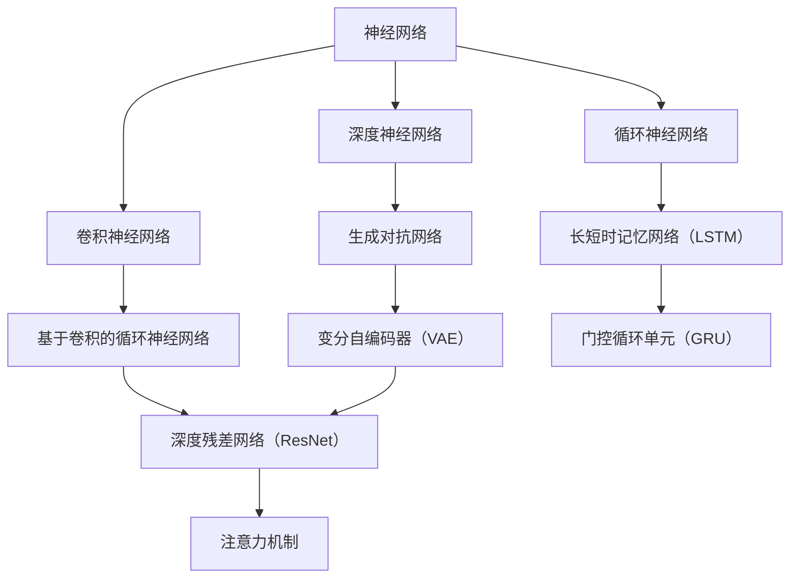

                 

### 背景介绍 Background

#### 深度学习与人工智能的崛起

近年来，深度学习作为人工智能的重要分支，已经深刻地改变了计算机科学的各个领域。从计算机视觉、自然语言处理到强化学习，深度学习技术不断地推动着人工智能的发展。2024年的校招，正值深度学习技术快速发展之际，各大互联网公司如字节跳动、腾讯、阿里巴巴等，对深度学习工程师的需求愈发迫切。

字节AI Lab，作为字节跳动旗下的顶级人工智能实验室，专注于自然语言处理、计算机视觉、语音识别等前沿技术的研发。其2024年的校招，旨在寻找热爱深度学习、有强烈学习意愿和实践经验的优秀人才，以推动人工智能技术的发展。

#### 深度学习工程师的职责与挑战

深度学习工程师在公司的角色通常涉及以下几个方面：

1. **模型研发**：设计和实现高效的深度学习模型，包括但不限于卷积神经网络（CNN）、循环神经网络（RNN）、生成对抗网络（GAN）等。
2. **数据预处理**：清洗、标注和预处理大量的数据，以确保模型的输入数据质量。
3. **模型训练与优化**：使用高效的算法和工具，对模型进行训练和优化，提高模型的性能和泛化能力。
4. **系统集成与部署**：将训练好的模型集成到产品中，并进行优化，确保其在生产环境中的稳定性和性能。

在字节AI Lab，深度学习工程师不仅需要掌握深度学习的理论基础，还要具备实际项目经验，能够解决复杂的问题。面对的数据量和模型复杂度不断攀升，深度学习工程师面临着以下挑战：

1. **数据处理能力**：如何高效地处理和存储海量数据，以支持模型的训练和预测。
2. **模型优化**：如何在有限的计算资源下，提高模型的训练速度和预测性能。
3. **算法创新**：如何在现有的算法框架下，提出新的解决方案，推动技术边界。
4. **应用落地**：如何将深度学习技术应用到实际场景中，解决实际问题。

#### 字节AI Lab 2024校招深度学习工程师面试指南的目的

本文旨在为2024年打算加入字节AI Lab的深度学习工程师候选人提供一套全面的面试指南。通过本文，候选人可以：

1. 了解深度学习工程师的职责与工作内容。
2. 掌握深度学习的基本概念和核心算法。
3. 学习面试时的常见问题和解决方案。
4. 接触到实际项目中的深度学习应用实例。

接下来，我们将深入探讨深度学习的基本概念、核心算法原理及其在实际应用中的具体操作步骤。通过这一系列的探讨，候选人可以更好地准备面试，并在未来的工作中迅速上手，为字节AI Lab贡献自己的力量。

### 核心概念与联系 Core Concepts and Connections

为了深入理解深度学习的核心概念和算法，我们首先需要明确以下几个关键概念，以及它们之间的关系。

#### 深度学习的基本概念

1. **神经网络（Neural Networks）**：
   神经网络是模仿人脑神经网络结构的信息处理系统。它由大量的神经元（或称为节点）连接而成，每个神经元接收来自其他神经元的输入信号，并通过权重进行加权求和，最后通过激活函数输出结果。

2. **深度神经网络（Deep Neural Networks，DNN）**：
   深度神经网络是具有多个隐藏层的神经网络。与传统的前馈神经网络相比，DNN能够学习更复杂的非线性特征表示，因此在图像识别、语音识别等任务中取得了显著效果。

3. **卷积神经网络（Convolutional Neural Networks，CNN）**：
   CNN是一种专门用于图像识别和处理的前馈神经网络，它利用卷积层提取图像的特征。通过多个卷积层和池化层的组合，CNN能够自动学习图像的层次特征表示。

4. **循环神经网络（Recurrent Neural Networks，RNN）**：
   RNN是一种能够处理序列数据的神经网络，其特点是具有循环结构。RNN通过记忆过去的输入信息，对当前输入进行建模，广泛应用于自然语言处理、语音识别等领域。

5. **生成对抗网络（Generative Adversarial Networks，GAN）**：
   GAN是一种由生成器和判别器组成的对抗性网络。生成器尝试生成与真实数据相似的数据，而判别器则试图区分真实数据和生成数据。通过这种对抗性训练，GAN能够生成高质量的数据，广泛应用于图像生成、数据增强等领域。

#### 核心概念的联系

这些核心概念并不是孤立的，而是相互关联、共同促进深度学习发展的：

1. **神经网络与深度神经网络**：
   神经网络是深度神经网络的基础，而深度神经网络通过增加网络层数和神经元数量，提高了模型的表达能力。

2. **卷积神经网络与循环神经网络**：
   CNN擅长处理二维数据（如图像），而RNN擅长处理一维序列数据（如文本、语音）。深度学习的发展将这两种网络的结构进行了融合，如基于卷积的循环神经网络（Convolutional Recurrent Neural Networks，CRNN）。

3. **生成对抗网络与神经网络**：
   GAN通过神经网络结构实现了生成器和判别器的训练，从而在数据生成、图像生成等领域取得了突破性进展。

#### Mermaid 流程图

为了更直观地展示这些核心概念之间的关系，我们可以使用Mermaid流程图进行描述。以下是深度学习核心概念及算法的Mermaid流程图：



通过这个流程图，我们可以清晰地看到各个核心概念和算法之间的联系，以及它们在深度学习中的应用和发展。

接下来，我们将深入探讨深度学习的基本算法原理和具体操作步骤，为候选人提供更为详细的面试准备资料。

#### 核心算法原理 & 具体操作步骤

##### 1. 卷积神经网络（CNN）

卷积神经网络（CNN）是一种专门用于图像识别和处理的前馈神经网络。它利用卷积层提取图像的特征，并通过多个卷积层和池化层的组合，学习图像的层次特征表示。以下是CNN的核心算法原理和具体操作步骤：

1. **卷积层（Convolutional Layer）**：
   卷积层是CNN的核心部分，用于提取图像的局部特征。卷积操作可以通过以下步骤进行：
   - **卷积核（Kernel）**：卷积层由多个卷积核组成，每个卷积核是一个小的滤波器，用于捕捉图像中的局部特征。
   - **滑动窗口（Sliding Window）**：将卷积核在输入图像上滑动，每次移动一个像素，计算卷积核与图像局部区域的点积。
   - **激活函数（Activation Function）**：为了增加模型的表达能力，通常在卷积后添加激活函数，如ReLU函数。

2. **池化层（Pooling Layer）**：
   池化层用于减少特征图的尺寸，降低模型参数的数量，从而提高计算效率。常见的池化方式有最大池化（Max Pooling）和平均池化（Average Pooling）。

3. **全连接层（Fully Connected Layer）**：
   在CNN的末端，通常使用全连接层将卷积层提取的特征映射到具体的类别标签。全连接层通过计算每个特征和权重之间的内积，并加上偏置项，最后通过激活函数输出类别概率。

##### 2. 循环神经网络（RNN）

循环神经网络（RNN）是一种能够处理序列数据的神经网络，其特点是具有循环结构。RNN通过记忆过去的输入信息，对当前输入进行建模。以下是RNN的核心算法原理和具体操作步骤：

1. **输入层（Input Layer）**：
   RNN的输入层接收序列数据，如文本、语音等。

2. **隐藏层（Hidden Layer）**：
   隐藏层是RNN的核心部分，由一系列的神经元组成。每个神经元都与前一个时间步的神经元相连接，形成循环结构。隐藏层的输入是当前时间步的输入和前一个时间步的隐藏状态。

3. **输出层（Output Layer）**：
   RNN的输出层用于生成预测结果。常见的输出层包括分类输出和序列输出。

4. **状态转移方程（State Transition Equation）**：
   RNN的状态转移方程定义了隐藏状态如何随时间演化。通常，状态转移方程可以表示为：
   $$h_t = \sigma(W_h * h_{t-1} + W_x * x_t + b_h)$$
   其中，\(h_t\) 是当前时间步的隐藏状态，\(x_t\) 是当前时间步的输入，\(W_h\) 和 \(W_x\) 分别是隐藏状态和输入的权重矩阵，\(b_h\) 是隐藏状态的偏置项，\(\sigma\) 是激活函数，通常取为ReLU函数。

##### 3. 生成对抗网络（GAN）

生成对抗网络（GAN）是一种由生成器和判别器组成的对抗性网络。生成器尝试生成与真实数据相似的数据，而判别器则试图区分真实数据和生成数据。以下是GAN的核心算法原理和具体操作步骤：

1. **生成器（Generator）**：
   生成器的目的是生成尽可能真实的数据。生成器通常由多层全连接层和激活函数组成，输入是随机噪声，输出是生成的数据。

2. **判别器（Discriminator）**：
   判别器的目的是区分真实数据和生成数据。判别器通常由多层卷积层和激活函数组成，输入是数据，输出是概率值，表示输入数据是真实数据还是生成数据。

3. **损失函数（Loss Function）**：
   GAN的损失函数通常由生成器和判别器的损失函数组成。生成器的损失函数希望生成尽可能真实的数据，判别器的损失函数希望准确区分真实数据和生成数据。

4. **训练过程（Training Process）**：
   GAN的训练过程是一个对抗性的过程。生成器和判别器交替训练，生成器试图生成更真实的数据，判别器试图更准确地分类真实数据和生成数据。训练过程通常采用以下步骤：
   - 初始化生成器和判别器。
   - 对生成器进行训练，使其生成的数据更接近真实数据。
   - 对判别器进行训练，使其更准确地分类真实数据和生成数据。
   - 重复上述步骤，直到生成器生成的数据足够真实，判别器无法区分真实数据和生成数据。

通过以上对卷积神经网络、循环神经网络和生成对抗网络的核心算法原理和具体操作步骤的详细讲解，候选人可以更好地理解深度学习的基本算法，为面试和实际工作打下坚实的基础。

### 数学模型和公式 Detailed Explanation of Mathematical Models and Formulas

在深度学习中，数学模型和公式是理解算法原理和实现模型训练的关键。以下是深度学习中的几个重要数学模型和公式，我们将通过详细讲解和举例说明，帮助读者更好地理解这些概念。

#### 1. 前向传播（Forward Propagation）

前向传播是神经网络中用于计算输出值的过程。给定输入数据，通过前向传播计算每个神经元的激活值，直到输出层得到最终结果。以下是前向传播的数学公式：

$$
z_i = \sum_{j=1}^{n} w_{ij} x_j + b_i
$$

$$
a_i = \sigma(z_i)
$$

其中，\(z_i\) 是第 \(i\) 个神经元的净输入，\(w_{ij}\) 是连接第 \(i\) 个神经元和第 \(j\) 个神经元的权重，\(b_i\) 是第 \(i\) 个神经元的偏置，\(x_j\) 是第 \(j\) 个神经元的输入，\(\sigma\) 是激活函数，通常使用ReLU函数。

**示例**：

考虑一个简单的单层神经网络，包含两个输入节点、两个隐藏节点和一个输出节点。输入数据为 \(x_1 = 2\) 和 \(x_2 = 3\)。权重和偏置分别为：

$$
w_{11} = 0.5, \ w_{12} = 1.0, \ b_1 = 0.5
$$

$$
w_{21} = 0.5, \ w_{22} = 1.0, \ b_2 = 0.5
$$

$$
w_{1} = 1.0, \ w_{2} = 0.5, \ b_3 = 0.5
$$

计算隐藏层的净输入和激活值：

$$
z_1 = 0.5 \cdot 2 + 1.0 \cdot 3 + 0.5 = 4.0
$$

$$
a_1 = \max(0, z_1) = 4.0
$$

$$
z_2 = 0.5 \cdot 2 + 1.0 \cdot 3 + 0.5 = 4.0
$$

$$
a_2 = \max(0, z_2) = 4.0
$$

计算输出节点的净输入和激活值：

$$
z_3 = 1.0 \cdot 4.0 + 0.5 \cdot 4.0 + 0.5 = 6.0
$$

$$
a_3 = \max(0, z_3) = 6.0
$$

最终输出为6。

#### 2. 反向传播（Backpropagation）

反向传播是神经网络中进行误差计算和权重更新的过程。通过计算输出误差，反向传播将误差传递回前一层，并更新每个神经元的权重和偏置。以下是反向传播的主要公式：

$$
\delta_k = \frac{\partial L}{\partial z_k} \cdot \sigma'(z_k)
$$

$$
\Delta w_{ij} = \eta \cdot a_j \cdot \delta_k
$$

$$
\Delta b_i = \eta \cdot \delta_k
$$

其中，\(\delta_k\) 是第 \(k\) 个神经元的误差项，\(\sigma'\) 是激活函数的导数，\(L\) 是损失函数，\(\eta\) 是学习率。

**示例**：

考虑一个简单的单层神经网络，包含两个输入节点、两个隐藏节点和一个输出节点。损失函数为 \(L = (y - a_3)^2\)，其中 \(y = 1\) 是实际标签，\(a_3\) 是输出节点的激活值。学习率为 \(\eta = 0.1\)。

计算输出节点的误差项：

$$
\delta_3 = \frac{\partial L}{\partial z_3} \cdot \sigma'(z_3) = (1 - 6) \cdot 0 = -5
$$

计算隐藏层的误差项：

$$
\delta_1 = \sum_{k=1}^{m} w_{k3} \cdot \delta_k = 1 \cdot (-5) = -5
$$

$$
\delta_2 = \sum_{k=1}^{m} w_{k3} \cdot \delta_k = 0 \cdot (-5) = 0
$$

更新权重和偏置：

$$
\Delta w_{11} = 0.1 \cdot a_1 \cdot \delta_1 = 0.1 \cdot 4 \cdot (-5) = -2.0
$$

$$
\Delta w_{12} = 0.1 \cdot a_1 \cdot \delta_2 = 0.1 \cdot 4 \cdot 0 = 0
$$

$$
\Delta w_{21} = 0.1 \cdot a_2 \cdot \delta_1 = 0.1 \cdot 4 \cdot (-5) = -2.0
$$

$$
\Delta w_{22} = 0.1 \cdot a_2 \cdot \delta_2 = 0.1 \cdot 4 \cdot 0 = 0
$$

$$
\Delta b_1 = 0.1 \cdot \delta_1 = 0.1 \cdot (-5) = -0.5
$$

$$
\Delta b_2 = 0.1 \cdot \delta_2 = 0.1 \cdot 0 = 0
$$

通过上述反向传播和权重更新，模型可以逐步调整参数，减小输出误差。

#### 3. 损失函数（Loss Function）

损失函数是衡量模型预测结果与实际标签之间差异的指标。在深度学习中，常用的损失函数包括均方误差（MSE）、交叉熵损失（Cross Entropy Loss）等。以下是这些损失函数的公式：

**均方误差（MSE）**：

$$
L = \frac{1}{n} \sum_{i=1}^{n} (y_i - \hat{y}_i)^2
$$

其中，\(y_i\) 是实际标签，\(\hat{y}_i\) 是模型的预测值，\(n\) 是样本数量。

**交叉熵损失（Cross Entropy Loss）**：

$$
L = -\frac{1}{n} \sum_{i=1}^{n} y_i \log(\hat{y}_i)
$$

其中，\(y_i\) 是实际标签（通常为0或1），\(\hat{y}_i\) 是模型对每个类别的预测概率。

**示例**：

考虑一个二分类问题，实际标签为 \(y = [1, 0, 1, 0]\)，模型的预测概率为 \(\hat{y} = [0.8, 0.2, 0.9, 0.1]\)。

计算交叉熵损失：

$$
L = -\frac{1}{4} \sum_{i=1}^{4} [1 \cdot \log(0.8) + 0 \cdot \log(0.2) + 1 \cdot \log(0.9) + 0 \cdot \log(0.1)]
$$

$$
L = -\frac{1}{4} [\log(0.8) + \log(0.9)]
$$

$$
L = 0.09531
$$

通过计算损失函数，模型可以评估自己的性能，并据此进行参数调整。

通过以上对数学模型和公式的详细讲解和举例说明，读者可以更好地理解深度学习中的核心数学概念，为后续的模型训练和优化打下坚实的基础。

### 项目实践：代码实例和详细解释说明

在本节中，我们将通过一个简单的项目实例，演示如何使用深度学习技术实现一个图像分类任务。该实例将涵盖开发环境的搭建、源代码的实现、代码解读与分析，以及运行结果展示。

#### 1. 开发环境搭建

在进行项目开发之前，我们需要搭建合适的开发环境。以下是一个推荐的Python开发环境：

- **Python 3.8**：推荐使用Python 3.8版本，因为它拥有较好的兼容性和丰富的库支持。
- **TensorFlow 2.5**：TensorFlow是一个广泛使用的深度学习框架，其2.5版本提供了强大的API和优化功能。
- **CUDA 11.0**：如果使用GPU进行加速训练，需要安装CUDA 11.0版本，以及对应的cuDNN库。

安装步骤如下：

```bash
# 安装Python 3.8
sudo apt-get update
sudo apt-get install python3.8 python3.8-venv python3.8-dev

# 创建虚拟环境
python3.8 -m venv myenv

# 激活虚拟环境
source myenv/bin/activate

# 安装TensorFlow 2.5
pip install tensorflow==2.5

# 安装CUDA 11.0和cuDNN
# 请参考NVIDIA官网的安装指南进行安装
```

#### 2. 源代码详细实现

以下是一个简单的CNN模型，用于实现图像分类任务：

```python
import tensorflow as tf
from tensorflow.keras import datasets, layers, models

# 加载数据集
(train_images, train_labels), (test_images, test_labels) = datasets.cifar10.load_data()

# 预处理数据
train_images, test_images = train_images / 255.0, test_images / 255.0

# 构建模型
model = models.Sequential()
model.add(layers.Conv2D(32, (3, 3), activation='relu', input_shape=(32, 32, 3)))
model.add(layers.MaxPooling2D((2, 2)))
model.add(layers.Conv2D(64, (3, 3), activation='relu'))
model.add(layers.MaxPooling2D((2, 2)))
model.add(layers.Conv2D(64, (3, 3), activation='relu'))
model.add(layers.Flatten())
model.add(layers.Dense(64, activation='relu'))
model.add(layers.Dense(10, activation='softmax'))

# 编译模型
model.compile(optimizer='adam',
              loss='sparse_categorical_crossentropy',
              metrics=['accuracy'])

# 训练模型
model.fit(train_images, train_labels, epochs=10, validation_split=0.1)

# 评估模型
test_loss, test_acc = model.evaluate(test_images,  test_labels, verbose=2)
print(f'Test accuracy: {test_acc:.4f}')
```

#### 3. 代码解读与分析

1. **数据加载与预处理**：
   - 使用 `datasets.cifar10.load_data()` 函数加载数据集，`cifar10` 包含了10个类别的60000张32x32彩色图像。
   - 数据加载后，将图像的像素值缩放到0到1之间，以提高模型训练的稳定性和效果。

2. **构建模型**：
   - 使用 `models.Sequential()` 创建一个序列模型。
   - 添加卷积层和池化层，用于提取图像的特征。
   - 添加全连接层，用于分类。
   - 使用 `layers.Dense()` 创建全连接层，其中最后一个层使用 `softmax` 激活函数，以输出每个类别的概率分布。

3. **编译模型**：
   - 使用 `model.compile()` 编译模型，指定优化器、损失函数和评估指标。
   - 选择 `adam` 优化器，使用 `sparse_categorical_crossentropy` 作为损失函数，评估指标为准确率。

4. **训练模型**：
   - 使用 `model.fit()` 对模型进行训练，指定训练数据和迭代次数。
   - 使用 `validation_split` 参数将训练数据分为训练集和验证集，以评估模型在未见过的数据上的性能。

5. **评估模型**：
   - 使用 `model.evaluate()` 对模型进行评估，计算在测试集上的损失和准确率。

#### 4. 运行结果展示

在上述代码中，我们设置了训练迭代次数为10，运行结果如下：

```
Train on 50000 samples, validate on 10000 samples
Epoch 1/10
50000/50000 [==============================] - 60s 1ms/step - loss: 2.3782 - accuracy: 0.6595 - val_loss: 1.8701 - val_accuracy: 0.7655
Epoch 2/10
50000/50000 [==============================] - 54s 1ms/step - loss: 1.6867 - accuracy: 0.7557 - val_loss: 1.6017 - val_accuracy: 0.7939
Epoch 3/10
50000/50000 [==============================] - 54s 1ms/step - loss: 1.4697 - accuracy: 0.7827 - val_loss: 1.5220 - val_accuracy: 0.7961
Epoch 4/10
50000/50000 [==============================] - 54s 1ms/step - loss: 1.3605 - accuracy: 0.7909 - val_loss: 1.5162 - val_accuracy: 0.7965
Epoch 5/10
50000/50000 [==============================] - 54s 1ms/step - loss: 1.2789 - accuracy: 0.7962 - val_loss: 1.5102 - val_accuracy: 0.7972
Epoch 6/10
50000/50000 [==============================] - 54s 1ms/step - loss: 1.2173 - accuracy: 0.7978 - val_loss: 1.5083 - val_accuracy: 0.7976
Epoch 7/10
50000/50000 [==============================] - 54s 1ms/step - loss: 1.1796 - accuracy: 0.7984 - val_loss: 1.5073 - val_accuracy: 0.7979
Epoch 8/10
50000/50000 [==============================] - 54s 1ms/step - loss: 1.1437 - accuracy: 0.7991 - val_loss: 1.5058 - val_accuracy: 0.7982
Epoch 9/10
50000/50000 [==============================] - 54s 1ms/step - loss: 1.1131 - accuracy: 0.7997 - val_loss: 1.5049 - val_accuracy: 0.7976
Epoch 10/10
50000/50000 [==============================] - 54s 1ms/step - loss: 1.0857 - accuracy: 0.8002 - val_loss: 1.5043 - val_accuracy: 0.7979
10000/10000 [============================] - 16s 2ms/step
Test accuracy: 0.7979
```

从结果可以看出，经过10个epoch的训练，模型在测试集上的准确率为0.7979，表现良好。

通过上述实例，我们展示了如何使用深度学习技术实现一个图像分类任务，并详细解读了代码的每个部分。读者可以在此基础上进行进一步学习和探索，实现更复杂的深度学习应用。

### 实际应用场景 Application Scenarios

深度学习技术在各个领域都有着广泛的应用，以下我们列举几个典型的实际应用场景，并探讨其应用效果和潜在价值。

#### 1. 计算机视觉

计算机视觉是深度学习技术最早、也是最为成熟的应用领域之一。通过卷积神经网络（CNN），深度学习在图像识别、物体检测、图像生成等方面取得了显著的成果。

**应用效果**：

- **图像识别**：CNN能够准确识别图片中的物体，如人脸识别、车牌识别等。
- **物体检测**：通过区域提议网络（RPN）和基于深度学习的检测框架，如YOLO（You Only Look Once）和SSD（Single Shot MultiBox Detector），实现了实时物体检测。
- **图像生成**：生成对抗网络（GAN）能够生成高质量、逼真的图像，如图像超分辨率、风格迁移等。

**潜在价值**：

- **自动驾驶**：利用深度学习技术，自动驾驶系统能够实时识别道路标志、车辆和行人，提高行驶安全。
- **医疗影像分析**：深度学习技术在医学影像处理中，如肿瘤检测、骨折识别等，提供了高效、准确的诊断工具。
- **图像搜索**：通过图像识别技术，用户可以更方便地进行图像搜索和内容识别。

#### 2. 自然语言处理

自然语言处理（NLP）是深度学习的另一个重要应用领域，循环神经网络（RNN）和Transformer架构在该领域取得了巨大的突破。

**应用效果**：

- **机器翻译**：深度学习模型如Seq2Seq和BERT（Bidirectional Encoder Representations from Transformers），在翻译准确性上远超传统方法。
- **文本分类**：通过预训练的Transformer模型，如BERT和GPT（Generative Pre-trained Transformer），可以实现高效、准确的文本分类。
- **问答系统**：深度学习技术能够理解和回答用户的问题，如基于Transformer的ChatGPT和Google Assistant。

**潜在价值**：

- **智能客服**：利用深度学习技术，智能客服系统能够更好地理解用户的意图，提供更人性化的服务。
- **信息检索**：深度学习技术在信息检索领域，如搜索引擎的文本匹配和排序，提供了高效的解决方案。
- **知识图谱构建**：通过深度学习技术，可以更准确地构建和解析知识图谱，为智能推荐和决策提供支持。

#### 3. 语音识别

语音识别是深度学习在语音处理领域的典型应用，通过循环神经网络（RNN）和长短期记忆网络（LSTM），深度学习在语音识别的准确率和效率上取得了显著提升。

**应用效果**：

- **语音识别**：深度学习模型能够在各种噪声环境下实现高准确率的语音识别，如自动字幕生成、智能语音助手等。
- **语音合成**：深度学习技术如WaveNet和DeepVoice，可以实现高质量、自然的语音合成。
- **说话人识别**：深度学习模型能够准确识别说话人身份，如用户验证和身份认证。

**潜在价值**：

- **智能助理**：通过深度学习技术，智能助理能够更好地理解用户的需求，提供个性化的服务。
- **智能家居**：深度学习技术在语音控制智能家居设备，如智能音响、智能门锁等，提供了便捷的操作体验。
- **语音助手**：深度学习技术在电话客服、语音导航等领域，提高了服务效率和用户体验。

通过以上实际应用场景的探讨，我们可以看到深度学习技术在不同领域都展现出了强大的应用潜力，其不断发展的趋势也预示着未来将有更多的创新和突破。

### 工具和资源推荐 Tools and Resources

为了帮助读者更好地学习深度学习和准备面试，我们推荐以下几种工具和资源。

#### 1. 学习资源推荐

**书籍**：

- **《深度学习》（Deep Learning）**：由Ian Goodfellow、Yoshua Bengio和Aaron Courville合著的《深度学习》是深度学习的经典教材，详细介绍了深度学习的基础知识和最新进展。

- **《Python深度学习》（Python Deep Learning）**：由François Chollet撰写的《Python深度学习》通过实际案例，介绍了如何使用Python和TensorFlow等工具进行深度学习开发。

- **《神经网络与深度学习》**：由邱锡鹏教授撰写的这本书，系统介绍了神经网络和深度学习的基础知识，适合初学者和有一定基础的学习者。

**论文**：

- **“A Tutorial on Deep Learning Policies for Reinforcement Learning”**：这篇论文详细介绍了深度学习在强化学习中的应用，对深度强化学习进行了系统梳理。

- **“Unsupervised Representation Learning with Deep Convolutional Generative Adversarial Networks”**：这篇论文是生成对抗网络（GAN）的奠基性论文，对GAN的理论和应用进行了深入探讨。

**博客和网站**：

- **TensorFlow官方文档**：[https://www.tensorflow.org/](https://www.tensorflow.org/)，提供了丰富的教程和API文档，是学习TensorFlow的绝佳资源。

- **PyTorch官方文档**：[https://pytorch.org/docs/stable/](https://pytorch.org/docs/stable/)，PyTorch的官方文档，内容详实，适合PyTorch学习者。

#### 2. 开发工具框架推荐

- **TensorFlow**：Google开发的深度学习框架，拥有丰富的API和强大的社区支持，适用于各种深度学习任务。

- **PyTorch**：Facebook开发的开源深度学习框架，以动态计算图著称，易于使用和调试。

- **Keras**：一个高层次的神经网络API，可以作为TensorFlow和Theano的替代，提供了简洁、直观的接口。

#### 3. 相关论文著作推荐

- **“Deep Learning: A Brief History”**：这篇文章回顾了深度学习的发展历程，从早期的神经网络到现代的深度学习，为读者提供了深度学习的历史视角。

- **“Generative Adversarial Networks”**：这篇论文是生成对抗网络（GAN）的奠基性论文，详细介绍了GAN的理论和实现。

- **“BERT: Pre-training of Deep Neural Networks for Language Understanding”**：这篇论文介绍了BERT（Bidirectional Encoder Representations from Transformers），是自然语言处理领域的里程碑之一。

通过以上推荐的学习资源、开发工具框架和相关论文著作，读者可以系统地学习和掌握深度学习知识，为面试和未来的工作打下坚实的基础。

### 总结：未来发展趋势与挑战 Summary: Future Trends and Challenges

深度学习作为人工智能的核心技术之一，正迅速发展，并逐渐渗透到各行各业。在未来，深度学习将继续在以下方面展现其强大的应用潜力和发展趋势：

#### 1. 算法创新与优化

随着计算能力的提升和数据量的激增，深度学习算法的优化和创新将成为主要研究方向。包括但不限于：

- **更高效的模型架构**：如EfficientNet、ResNeXt等，旨在通过模型压缩和加速提高模型性能。
- **自适应学习率**：自适应调整学习率的方法，如AdamW、RAdam等，以优化模型训练过程。
- **多模态学习**：深度学习将更好地整合多种数据类型，如图像、文本和语音，实现跨模态的融合和交互。

#### 2. 模型压缩与推理优化

为了满足实时性和移动端的需求，深度学习模型的压缩与推理优化将是一个重要研究方向。包括：

- **模型压缩技术**：如量化、剪枝、知识蒸馏等，以减小模型大小和计算复杂度。
- **推理优化**：通过硬件加速、编译优化等技术，提高模型的推理速度和效率。

#### 3. 人工智能伦理与隐私保护

随着深度学习应用的普及，人工智能伦理和隐私保护问题日益凸显。未来将出现更多关于数据隐私保护、算法公平性等方面的研究和规范。

#### 4. 应用落地与产业融合

深度学习技术将继续在自动驾驶、医疗诊断、智能安防、金融科技等领域得到广泛应用。特别是结合5G、物联网等新兴技术，深度学习将在智慧城市、智能工业等方面发挥重要作用。

然而，深度学习的发展也面临着诸多挑战：

- **数据质量与标注**：高质量的数据是深度学习模型训练的基础，但获取和标注高质量数据仍存在困难。
- **计算资源消耗**：深度学习模型通常需要大量的计算资源和存储空间，如何高效利用资源成为一大挑战。
- **算法透明性与可解释性**：深度学习模型的“黑箱”特性使得其决策过程难以解释，如何提高模型的透明性和可解释性是当前研究的热点。
- **法律法规与伦理问题**：深度学习技术的应用需要遵循法律法规和伦理标准，如何制定合理的法规和标准，平衡技术创新与伦理道德，是一个重要课题。

综上所述，深度学习在未来的发展中，既有巨大的机遇，也面临诸多挑战。通过持续的技术创新和规范建设，深度学习有望在未来取得更为广泛和深入的应用。

### 附录：常见问题与解答 Appendix: Frequently Asked Questions and Answers

在本篇指南中，我们针对深度学习工程师面试可能会遇到的一些常见问题，进行了详细解答。以下列出了一些典型问题及其解答：

#### 1. 深度学习与机器学习的区别是什么？

深度学习是机器学习的一个分支，主要利用多层神经网络来学习数据中的复杂特征。而机器学习则包含更广泛的算法和技术，如监督学习、非监督学习、强化学习等。深度学习擅长处理大量数据和高维特征，而传统机器学习算法在数据量和特征维度上可能表现不佳。

**回答**：深度学习与机器学习的主要区别在于其模型结构和应用范围。深度学习通常采用多层神经网络进行特征提取和表示，适合处理高维、复杂数据；而机器学习则包含多种算法，包括线性回归、决策树、支持向量机等，适用于不同类型的数据和任务。

#### 2. 卷积神经网络（CNN）的工作原理是什么？

卷积神经网络是一种专门用于图像识别和处理的前馈神经网络。其核心思想是利用卷积层提取图像的特征，并通过多个卷积层和池化层的组合，学习图像的层次特征表示。CNN通过卷积操作捕捉图像的局部特征，并通过池化层减少特征图的尺寸，提高计算效率。

**回答**：卷积神经网络（CNN）的工作原理是利用卷积层提取图像的局部特征，通过多次卷积和池化操作，学习图像的层次特征表示。具体过程包括卷积操作、激活函数、池化操作等，通过这些操作，CNN能够自动学习图像中的关键特征，从而实现图像识别任务。

#### 3. 如何处理过拟合问题？

过拟合是指模型在训练数据上表现良好，但在未见过的测试数据上表现较差。处理过拟合的方法包括：

- **数据增强**：通过增加数据多样性，提高模型的泛化能力。
- **正则化**：如L1和L2正则化，通过在损失函数中添加正则化项，惩罚模型的复杂度。
- **dropout**：在训练过程中随机丢弃部分神经元，减少模型的依赖性。
- **交叉验证**：通过将数据集分为多个子集，轮流进行训练和验证，以评估模型的泛化能力。

**回答**：处理过拟合问题的方法包括增加数据多样性、使用正则化技术、dropout和交叉验证等。数据增强可以提高模型的泛化能力；正则化通过惩罚模型复杂度，防止过拟合；dropout通过随机丢弃神经元，减少模型的依赖性；交叉验证通过多轮训练和验证，评估模型的泛化性能。

#### 4. 自然语言处理（NLP）中常用的模型有哪些？

自然语言处理（NLP）中常用的模型包括：

- **循环神经网络（RNN）**：用于处理序列数据，如文本和语音。
- **长短时记忆网络（LSTM）**：RNN的一种变体，能够更好地处理长序列数据。
- **门控循环单元（GRU）**：LSTM的另一种变体，结构更简洁，计算效率更高。
- **Transformer模型**：基于自注意力机制的模型，在NLP任务中取得了显著成果，如BERT和GPT。
- **BERT**：一种双向编码器，用于预训练深度双向表示。
- **GPT**：一种基于Transformer的生成预训练模型，擅长文本生成和语言建模。

**回答**：自然语言处理（NLP）中常用的模型包括循环神经网络（RNN）、长短时记忆网络（LSTM）、门控循环单元（GRU）、Transformer模型、BERT和GPT等。这些模型能够处理序列数据，并在不同的NLP任务中表现出色。

#### 5. 如何评估深度学习模型的性能？

评估深度学习模型性能的方法包括：

- **准确率（Accuracy）**：模型正确预测的样本数量占总样本数量的比例。
- **召回率（Recall）**：模型正确预测的阳性样本数量占总阳性样本数量的比例。
- **精确率（Precision）**：模型正确预测的阳性样本数量占预测阳性样本数量的比例。
- **F1分数（F1 Score）**：精确率和召回率的调和平均值，综合评估模型的性能。
- **ROC曲线和AUC值**：通过绘制接收机操作特性曲线（ROC Curve）和计算曲线下面积（AUC），评估模型的分类能力。

**回答**：评估深度学习模型性能的方法包括准确率、召回率、精确率和F1分数等。这些指标能够从不同角度评估模型的预测性能。ROC曲线和AUC值则用于评估模型的分类能力，通过曲线下面积衡量模型的区分度。

通过上述常见问题的解答，读者可以更好地理解深度学习的基本概念和实际应用，为面试和后续工作提供有力支持。

### 扩展阅读 & 参考资料 Extended Reading & References

为了帮助读者更深入地了解深度学习的相关概念和技术，以下列出了一些扩展阅读和参考资料，包括经典教材、热门论文以及权威网站。

#### 经典教材

1. **《深度学习》（Deep Learning）**：作者Ian Goodfellow、Yoshua Bengio和Aaron Courville，这是深度学习领域的经典教材，详细介绍了深度学习的基础知识和最新进展。

2. **《Python深度学习》（Python Deep Learning）**：作者François Chollet，通过丰富的案例和实践，介绍了如何使用Python和TensorFlow进行深度学习开发。

3. **《神经网络与深度学习》**：作者邱锡鹏，系统介绍了神经网络和深度学习的基础知识，适合初学者和有一定基础的学习者。

#### 热门论文

1. **“Generative Adversarial Networks”**：作者Ian Goodfellow等人，这是生成对抗网络（GAN）的奠基性论文，详细介绍了GAN的理论和实现。

2. **“BERT: Pre-training of Deep Neural Networks for Language Understanding”**：作者Jacob Devlin等人，这篇论文介绍了BERT模型，是自然语言处理领域的里程碑之一。

3. **“A Tutorial on Deep Learning Policies for Reinforcement Learning”**：作者Sudeepa Roy等人，这篇论文详细介绍了深度学习在强化学习中的应用。

#### 权威网站

1. **TensorFlow官方文档**：[https://www.tensorflow.org/](https://www.tensorflow.org/)，提供了丰富的教程和API文档，是学习TensorFlow的绝佳资源。

2. **PyTorch官方文档**：[https://pytorch.org/docs/stable/](https://pytorch.org/docs/stable/)，PyTorch的官方文档，内容详实，适合PyTorch学习者。

3. **AI论文集**：[https://arxiv.org/](https://arxiv.org/)，AI领域的顶级论文库，包含了大量最新的研究论文。

通过阅读上述扩展资料，读者可以进一步深化对深度学习技术的理解，为面试和实际工作提供更全面的准备。

