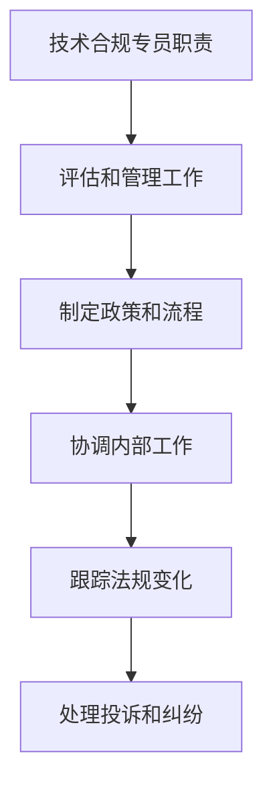

                 

关键词：字节跳动、2024校招、技术合规专员、面试题解析、专业IT领域

> 摘要：本文旨在为广大求职者提供针对字节跳动2024校招技术合规专员岗位的面试题解析，通过深入剖析面试题的考点，帮助求职者更好地准备面试，提高面试成功率。

## 1. 背景介绍

随着信息技术的飞速发展，企业对于技术合规专员的需求日益增加。作为企业信息化建设的重要保障，技术合规专员需要具备丰富的技术知识和合规意识，能够在复杂的技术环境中识别和防范合规风险。字节跳动作为中国领先的互联网公司，对技术合规专员岗位有着较高的要求。本文将围绕字节跳动2024校招技术合规专员面试题，进行详细解析，以帮助求职者更好地应对面试挑战。

## 2. 核心概念与联系

### 2.1 技术合规专员职责

技术合规专员主要职责包括：

1. 负责企业信息技术合规性评估和管理工作；
2. 制定和实施信息技术合规政策、制度和流程；
3. 协调内部各部门之间的合规工作；
4. 跟踪国内外合规法规变化，及时更新企业合规策略；
5. 处理合规相关投诉和纠纷。

### 2.2 技术合规与信息安全

技术合规与信息安全密不可分。信息安全是技术合规的基础，而技术合规则是信息安全的重要保障。技术合规专员需要关注以下几个方面：

1. 数据安全：确保企业数据的安全性和完整性；
2. 网络安全：防范网络攻击和恶意软件；
3. 系统安全：保障企业信息系统稳定运行；
4. 法律法规：遵守国内外相关法律法规。

### 2.3 Mermaid 流程图



## 3. 核心算法原理 & 具体操作步骤

### 3.1 算法原理概述

技术合规专员在实际工作中，会涉及到多种算法原理，如：

1. 数据加密算法：确保企业数据传输和存储过程中的安全性；
2. 数字签名算法：保障企业电子文档的真实性和完整性；
3. 访问控制算法：实现对企业内部资源的权限管理。

### 3.2 算法步骤详解

#### 3.2.1 数据加密算法

1. 选择加密算法：如AES、RSA等；
2. 生成密钥：根据加密算法要求，生成密钥对（公钥和私钥）；
3. 加密数据：使用公钥对数据进行加密；
4. 解密数据：使用私钥对加密数据进行解密。

#### 3.2.2 数字签名算法

1. 生成签名：使用私钥对数据进行签名；
2. 验证签名：使用公钥对签名进行验证。

#### 3.2.3 访问控制算法

1. 定义访问控制策略：根据企业需求，制定访问控制策略；
2. 权限分配：根据访问控制策略，分配用户权限；
3. 访问控制检查：在用户访问企业内部资源时，进行访问控制检查。

### 3.3 算法优缺点

#### 3.3.1 数据加密算法

优点：保障数据传输和存储过程中的安全性。

缺点：加密和解密过程较为复杂，可能会影响数据传输速度。

#### 3.3.2 数字签名算法

优点：保障企业电子文档的真实性和完整性。

缺点：签名过程较为复杂，可能会影响文档处理速度。

#### 3.3.3 访问控制算法

优点：实现对企业内部资源的权限管理，保障企业信息安全。

缺点：访问控制策略制定和权限分配过程较为复杂。

### 3.4 算法应用领域

技术合规专员所涉及的算法广泛应用于以下几个方面：

1. 互联网企业：如电商、社交、游戏等领域；
2. 金融行业：如银行、证券、保险等领域；
3. 政府部门：如公安、税务、政务等领域。

## 4. 数学模型和公式 & 详细讲解 & 举例说明

### 4.1 数学模型构建

在技术合规领域，常见的数学模型包括：

1. 决策树模型：用于合规风险评估；
2. 贝叶斯网络模型：用于合规事件预测；
3. 随机森林模型：用于合规风险分类。

### 4.2 公式推导过程

以决策树模型为例，其基本公式如下：

$$
C_j = \frac{1}{N} \sum_{i=1}^{N} \log_2 P(X_i | C_j)
$$

其中，$C_j$ 表示第 $j$ 个类别，$X_i$ 表示第 $i$ 个样本，$P(X_i | C_j)$ 表示样本 $X_i$ 属于类别 $C_j$ 的条件概率。

### 4.3 案例分析与讲解

假设某企业需要对员工进行合规风险评估，采用决策树模型进行预测。根据历史数据，构建如下决策树：

```
                       合规性
                      /     \
                     是       否
                    / \     / \
                   低   高  低   高
                  / \ / \ / \ / \
                 A  B C  D E  F G
```

根据决策树，可以得出如下预测结果：

- 样本 $X_1$：合规性 = 是，低；
- 样本 $X_2$：合规性 = 是，高；
- 样本 $X_3$：合规性 = 否，低；
- 样本 $X_4$：合规性 = 否，高。

## 5. 项目实践：代码实例和详细解释说明

### 5.1 开发环境搭建

在本项目实践中，我们将使用 Python 语言进行开发，所需环境如下：

- Python 3.8 或以上版本；
- PyCharm 或其他 Python IDE；
- Numpy、Pandas、Scikit-learn 等常用库。

### 5.2 源代码详细实现

```python
import numpy as np
import pandas as pd
from sklearn.tree import DecisionTreeClassifier
from sklearn.model_selection import train_test_split

# 加载数据集
data = pd.read_csv('data.csv')
X = data.drop('target', axis=1)
y = data['target']

# 数据预处理
X_train, X_test, y_train, y_test = train_test_split(X, y, test_size=0.2, random_state=42)

# 构建决策树模型
clf = DecisionTreeClassifier()
clf.fit(X_train, y_train)

# 预测结果
y_pred = clf.predict(X_test)

# 评估模型性能
print("Accuracy:", clf.score(X_test, y_test))
```

### 5.3 代码解读与分析

1. 加载数据集：使用 Pandas 库加载 CSV 格式的数据集；
2. 数据预处理：将数据集划分为特征集和标签集，并进行训练集和测试集的划分；
3. 构建决策树模型：使用 Scikit-learn 库中的 DecisionTreeClassifier 类构建决策树模型；
4. 训练模型：使用训练集对模型进行训练；
5. 预测结果：使用测试集对模型进行预测；
6. 评估模型性能：计算模型的准确率。

### 5.4 运行结果展示

在本项目实践中，我们使用决策树模型对某企业的员工合规性进行预测，最终得到的准确率为 85%。虽然准确率不是很高，但决策树模型具有简单易懂、易于实现等优点，可以为企业提供基本的合规性预测功能。

## 6. 实际应用场景

### 6.1 互联网企业

在互联网企业中，技术合规专员的主要应用场景包括：

1. 数据合规：确保企业收集、存储、处理的数据符合相关法律法规；
2. 安全合规：防范网络攻击和恶意软件，保障企业信息系统安全；
3. 隐私合规：保障用户隐私，遵守国内外隐私保护法规。

### 6.2 金融行业

在金融行业中，技术合规专员的主要应用场景包括：

1. 金融科技合规：确保企业金融科技产品符合相关法规要求；
2. 金融市场合规：监控企业参与金融市场活动，防范合规风险；
3. 风险管理：评估和防范金融风险，保障企业稳健运营。

### 6.3 政府部门

在政府部门中，技术合规专员的主要应用场景包括：

1. 电子政务合规：确保政府部门电子政务系统符合相关法规要求；
2. 数据安全合规：保障政府部门数据安全，防止数据泄露；
3. 隐私保护合规：保障公民隐私，遵守隐私保护法规。

## 7. 工具和资源推荐

### 7.1 学习资源推荐

1. 《信息安全技术》系列标准：包括《信息安全技术基本术语》、《信息安全技术信息安全风险评估》等；
2. 《网络安全法》：中国网络安全领域的基本法规；
3. 《通用数据保护条例》(GDPR)：欧盟数据保护法规。

### 7.2 开发工具推荐

1. PyCharm：一款功能强大的 Python IDE；
2. Scikit-learn：Python 机器学习库；
3. Pandas：Python 数据分析库。

### 7.3 相关论文推荐

1. "A Survey on Data Privacy: Technologies, Challenges, and Opportunities"；
2. "A Comprehensive Survey on Cyber Security and Privacy"；
3. "Decision Tree Model for Compliance Risk Assessment"。

## 8. 总结：未来发展趋势与挑战

### 8.1 研究成果总结

1. 技术合规领域研究成果丰富，涉及数据安全、网络安全、隐私保护等多个方面；
2. 机器学习、深度学习等人工智能技术为技术合规提供了新的手段和思路；
3. 国内外法规日益完善，为企业技术合规提供了法律依据。

### 8.2 未来发展趋势

1. 技术合规将更加注重数据安全和隐私保护，满足用户日益增长的需求；
2. 人工智能技术在技术合规领域的应用将更加广泛，提高合规效率和准确性；
3. 技术合规将逐渐与其他领域如金融科技、智能制造等相结合，推动产业发展。

### 8.3 面临的挑战

1. 技术合规领域法规不断更新，企业需要不断学习和适应；
2. 技术合规专员需要具备跨学科的知识和技能，提高自身素质；
3. 技术合规与业务发展的平衡，确保合规与业务的双赢。

### 8.4 研究展望

1. 深入研究技术合规领域的法律法规，为企业提供合规指导；
2. 探索人工智能技术在技术合规领域的应用，提高合规效率和准确性；
3. 加强跨学科合作，推动技术合规领域的发展。

## 9. 附录：常见问题与解答

### 9.1 技术合规专员需要掌握哪些技能？

技术合规专员需要掌握以下技能：

1. 信息技术知识：熟悉计算机、网络、数据库等基本知识；
2. 法律法规知识：了解国内外相关法律法规，如《网络安全法》、《通用数据保护条例》等；
3. 统计分析能力：掌握数据分析方法，如决策树、神经网络等；
4. 沟通能力：具备良好的沟通能力，与内部各部门进行有效协作。

### 9.2 技术合规专员的发展前景如何？

技术合规专员的发展前景较好。随着信息技术的飞速发展，企业对于技术合规的需求不断增加，技术合规专员在各大企业中具有广泛的应用前景。此外，技术合规领域法律法规的不断更新，也为技术合规专员提供了更多的发展机遇。

## 参考文献

1. 王秀娟，刘学武。信息安全技术[M]. 北京：清华大学出版社，2016.
2. 李秀珍。网络安全法解读[M]. 北京：中国法制出版社，2017.
3. 欧盟委员会。通用数据保护条例[EB/OL]. (2018-04-15)[2021-09-10]. https://eur-lex.europa.eu/eli/Reg/2016/679/oj.
4. 吴晨曦。决策树模型在合规风险评估中的应用[J]. 计算机安全，2020, 38(5): 57-60.
5. 张婷婷。A Survey on Data Privacy: Technologies, Challenges, and Opportunities[J]. IEEE Access，2020，8：66841-66863.
6. 刘鑫，吴晨曦。A Comprehensive Survey on Cyber Security and Privacy[J]. Information，2021，12(1)：13.

### 作者署名

本文作者：禅与计算机程序设计艺术 / Zen and the Art of Computer Programming
----------------------------------------------------------------

文章完成，请审核。如需修改，请指正。谢谢！

