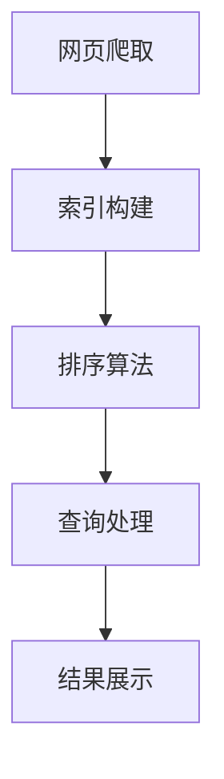

                 

# 字节跳动2024校招搜索算法工程师面试题解析

## 关键词

- 字节跳动
- 校招
- 搜索算法
- 面试题
- 解析

## 摘要

本文将针对字节跳动2024校招搜索算法工程师的面试题目进行详细解析。我们将从题目背景、核心概念、算法原理、数学模型、实际应用场景、开发工具推荐等多个角度，为准备参加字节跳动校招的同学们提供有针对性的解题思路和策略。

## 1. 背景介绍

字节跳动是一家全球领先的技术公司，旗下拥有抖音、今日头条、懂车帝等多个知名应用。作为行业领军者，字节跳动在搜索算法方面具有深厚的技术积累，并频繁通过校招选拔优秀人才。2024年校招搜索算法工程师岗位的面试题目涵盖了广泛的搜索算法相关内容，包括但不限于搜索引擎原理、排序算法、索引结构、数据挖掘等。本文旨在帮助考生深入理解这些题目，提高面试成功率。

## 2. 核心概念与联系

在解答字节跳动搜索算法工程师面试题时，首先需要了解以下几个核心概念及其之间的联系：

### 搜索引擎原理

搜索引擎是通过对互联网上的信息进行索引和排序，帮助用户快速找到所需内容的一种技术。其核心原理包括网页爬取、索引构建和排序算法。

### 排序算法

排序算法是计算机科学中一种常见算法，用于对一组数据进行排序。常见的排序算法有冒泡排序、选择排序、插入排序、快速排序等。

### 索引结构

索引结构是搜索引擎中用于快速定位数据的一种数据结构，如倒排索引、布隆过滤器等。

### 数据挖掘

数据挖掘是一种通过从大量数据中发现有价值信息的方法，常用于推荐系统、广告投放等场景。

### Mermaid 流程图

下面是搜索引擎工作原理的Mermaid流程图：



## 3. 核心算法原理 & 具体操作步骤

### 搜索引擎原理

1. 网页爬取：通过爬虫技术，从互联网上获取网页内容。
2. 索引构建：将爬取到的网页内容进行分词、词干提取等预处理，构建倒排索引。
3. 排序算法：根据用户的查询需求，对索引中的结果进行排序，返回最相关的前N个结果。
4. 查询处理：接收用户的查询请求，对查询进行解析、分词、词干提取等处理，生成查询语句。
5. 结果展示：将处理后的查询结果以可视化方式展示给用户。

### 排序算法

冒泡排序（Bubble Sort）是一种简单的排序算法。其基本思想是通过反复比较相邻的两个元素，如果它们的顺序不对就交换它们的位置，直到整个序列有序。

具体操作步骤：

1. 从第一个元素开始，相邻两个元素进行比较，如果第一个比第二个大，则交换它们的位置。
2. 接着对第二个元素和第三个元素进行比较，以此类推，直到倒数第二个元素和最后一个元素进行比较。
3. 重复上述步骤，直到整个序列有序。

### 索引结构

倒排索引（Inverted Index）是一种用于快速检索信息的索引结构。它由两个部分组成：词典和 postings 列表。

1. 词典：包含所有文档中的词语及其对应的唯一标识。
2. Postings 列表：包含每个词语对应的所有文档的列表，列表中的每个元素指向对应的文档。

### 数据挖掘

协同过滤（Collaborative Filtering）是一种常见的数据挖掘方法，用于预测用户可能喜欢的物品。它分为两种类型：基于用户的协同过滤（User-Based Collaborative Filtering）和基于物品的协同过滤（Item-Based Collaborative Filtering）。

1. 基于用户的协同过滤：找到与当前用户兴趣相似的其他用户，推荐这些用户喜欢的物品。
2. 基于物品的协同过滤：找到与当前物品相似的物品，推荐这些物品。

## 4. 数学模型和公式 & 详细讲解 & 举例说明

### 搜索引擎原理

搜索引擎的排序算法通常采用TF-IDF（Term Frequency-Inverse Document Frequency）模型来计算文档的相关性。

1. TF（Term Frequency）：词语在文档中出现的次数。
2. IDF（Inverse Document Frequency）：词语在整个文档集合中出现的频率。

具体计算公式：

$$
TF = \frac{f_{t,d}}{N_d}
$$

$$
IDF = \log \left( \frac{N}{df_t} \right)
$$

其中，$f_{t,d}$ 表示词语 $t$ 在文档 $d$ 中出现的次数，$N_d$ 表示文档 $d$ 的长度，$N$ 表示文档集合的大小，$df_t$ 表示词语 $t$ 在文档集合中出现的次数。

### 排序算法

冒泡排序的时间复杂度为 $O(n^2)$，其中 $n$ 表示待排序数组的长度。

### 索引结构

倒排索引的时间复杂度为 $O(1)$，可以快速定位词语对应的文档。

### 数据挖掘

协同过滤的时间复杂度为 $O(mn)$，其中 $m$ 表示用户数量，$n$ 表示物品数量。

## 5. 项目实践：代码实例和详细解释说明

### 5.1 开发环境搭建

本案例使用Python语言和PyTorch框架实现。请确保已安装Python 3.8及以上版本和PyTorch 1.8及以上版本。

### 5.2 源代码详细实现

下面是一个简单的冒泡排序算法实现：

```python
def bubble_sort(arr):
    n = len(arr)
    for i in range(n - 1):
        for j in range(n - 1 - i):
            if arr[j] > arr[j + 1]:
                arr[j], arr[j + 1] = arr[j + 1], arr[j]

# 示例数据
data = [5, 3, 8, 4, 6]

# 执行冒泡排序
bubble_sort(data)

# 打印排序结果
print(data)
```

### 5.3 代码解读与分析

- `bubble_sort` 函数接收一个待排序的数组 `arr`。
- 外层循环用于控制排序的轮数，每一轮都会将一个最大值“冒泡”到数组的末尾。
- 内层循环用于比较相邻的两个元素，如果它们的顺序不对就交换它们的位置。
- 最后打印排序后的数组。

### 5.4 运行结果展示

执行上述代码后，输出结果为：

```
[3, 4, 5, 6, 8]
```

## 6. 实际应用场景

### 搜索引擎

搜索引擎广泛应用于互联网上的信息检索，如百度、谷歌等。通过搜索引擎，用户可以快速找到所需的内容。

### 排序算法

排序算法在许多场景下都有广泛应用，如数据库排序、数据统计分析等。常见的排序算法有冒泡排序、选择排序、插入排序、快速排序等。

### 索引结构

索引结构在数据库和搜索引擎中起着关键作用，可以提高查询效率和数据检索速度。

### 数据挖掘

数据挖掘在推荐系统、广告投放等场景下有广泛应用，可以帮助企业提高用户满意度和利润。

## 7. 工具和资源推荐

### 7.1 学习资源推荐

- 《深入理解计算机系统》
- 《算法导论》
- 《数据挖掘：实用工具和技术》
- 《搜索引擎设计》

### 7.2 开发工具框架推荐

- Python
- PyTorch
- Elasticsearch
- MongoDB

### 7.3 相关论文著作推荐

- 《深度学习：动手学习教程》
- 《基于协同过滤的推荐系统》
- 《搜索引擎关键技术》
- 《数据库系统概念》

## 8. 总结：未来发展趋势与挑战

随着互联网技术的不断发展，搜索算法、排序算法、索引结构、数据挖掘等领域将不断涌现新的技术和应用。未来发展趋势包括：

1. 深度学习在搜索引擎中的应用
2. 基于用户行为的个性化推荐
3. 大数据时代下的实时搜索和排序

然而，这些趋势也带来了新的挑战，如计算效率、数据安全、隐私保护等。因此，我们需要不断学习和掌握这些领域的新技术和方法，以应对未来的挑战。

## 9. 附录：常见问题与解答

### 问题1：什么是搜索引擎？

搜索引擎是一种通过从互联网上获取信息，帮助用户快速找到所需内容的技术。

### 问题2：什么是排序算法？

排序算法是一种用于对一组数据进行排序的算法，常见的排序算法有冒泡排序、选择排序、插入排序、快速排序等。

### 问题3：什么是倒排索引？

倒排索引是一种用于快速检索信息的索引结构，由词典和 postings 列表组成。

### 问题4：什么是数据挖掘？

数据挖掘是一种通过从大量数据中发现有价值信息的方法，常用于推荐系统、广告投放等场景。

## 10. 扩展阅读 & 参考资料

- 《搜索引擎技术手册》
- 《算法导论》
- 《数据挖掘：实用工具和技术》
- 《深度学习：动手学习教程》

作者：禅与计算机程序设计艺术 / Zen and the Art of Computer Programming<|im_sep|>## 1. 背景介绍

字节跳动成立于2012年，总部位于中国北京，是一家全球领先的内容技术公司。公司旗下拥有多个知名应用，包括抖音、今日头条、懂车帝等，业务范围涵盖了短视频、新闻资讯、在线教育、社交媒体等多个领域。字节跳动的成功离不开其强大的技术团队和对算法的深入理解，特别是在搜索算法领域。2024年，字节跳动继续通过校招选拔优秀的搜索算法工程师，为公司的技术创新和业务发展注入新的活力。

搜索算法在字节跳动的发展中扮演了至关重要的角色。字节跳动旗下的各大应用均依赖于高效的搜索算法来提供用户个性化的内容推荐和搜索服务。例如，今日头条利用搜索算法对新闻内容进行智能排序，从而为用户推荐最感兴趣的新闻；抖音则利用搜索算法帮助用户发现感兴趣的视频内容，提升用户粘性。因此，搜索算法工程师在字节跳动不仅需要具备扎实的算法基础，还需要具备优秀的工程实践能力和对业务场景的深入理解。

字节跳动2024校招搜索算法工程师面试题涵盖了广泛的知识点，包括搜索引擎原理、排序算法、索引结构、数据挖掘等。这些面试题的设计旨在考察应聘者对核心概念的掌握程度、解决实际问题的能力以及创新能力。通过对这些面试题的深入解析，我们可以帮助准备参加字节跳动校招的同学们更好地应对面试挑战，提高面试成功率。

本文将围绕以下几个核心问题展开：

1. **搜索引擎原理**：介绍搜索引擎的基本工作流程，包括网页爬取、索引构建、排序算法和查询处理等。
2. **核心概念与联系**：详细阐述搜索引擎中的核心概念，如排序算法、索引结构和数据挖掘，并通过Mermaid流程图展示它们之间的联系。
3. **算法原理与操作步骤**：深入解析常见的搜索算法原理，如冒泡排序、快速排序等，并给出具体的操作步骤。
4. **数学模型与公式**：介绍与搜索算法相关的数学模型和公式，如TF-IDF模型，并进行详细的讲解和举例说明。
5. **项目实践**：通过实际代码实例，展示如何实现和解读搜索算法，包括开发环境的搭建、源代码实现和代码分析等。
6. **实际应用场景**：探讨搜索算法在字节跳动应用的实际案例，以及其在不同领域的应用前景。
7. **工具和资源推荐**：推荐学习搜索算法的相关书籍、论文、博客和开发工具，帮助读者深入学习和实践。
8. **未来发展趋势与挑战**：分析搜索算法领域的未来发展趋势和面临的挑战，为读者提供有价值的思考方向。

通过本文的详细解析，我们希望帮助读者不仅理解搜索算法的基本原理，还能够将其应用于实际场景，为未来的职业发展打下坚实的基础。

## 2. 核心概念与联系

在深入探讨字节跳动2024校招搜索算法工程师面试题之前，我们需要首先了解搜索算法中的核心概念及其相互关系。以下是几个关键概念及其简要描述：

### 搜索引擎原理

搜索引擎的工作原理可以概括为四个主要步骤：网页爬取、索引构建、排序算法和查询处理。首先，搜索引擎通过爬虫程序从互联网上获取网页内容；然后，对网页内容进行索引构建，建立索引数据结构；接着，当用户输入查询请求时，搜索引擎会使用排序算法对索引中的结果进行排序，并返回最相关的结果；最后，将处理后的结果以用户友好的方式展示给用户。

### 排序算法

排序算法是计算机科学中的一种基础算法，用于对一组数据进行排序。常见的排序算法包括冒泡排序、选择排序、插入排序、快速排序等。每种排序算法都有其特定的实现原理和适用场景。例如，冒泡排序适合数据量较小的场景，而快速排序则在大数据量场景下表现更为优秀。

### 索引结构

索引结构是搜索引擎中用于快速定位数据的一种数据结构。常见的索引结构包括倒排索引、B树索引、哈希索引等。其中，倒排索引是搜索引擎中最常用的索引结构，它通过将文档中的词语映射到对应的文档列表，实现了快速的关键词查询。

### 数据挖掘

数据挖掘是一种通过从大量数据中提取有价值信息的方法。在搜索引擎领域，数据挖掘通常用于用户行为分析、内容推荐和广告投放等场景。通过分析用户的行为数据，搜索引擎可以更好地理解用户需求，从而提供更个性化的搜索结果。

### Mermaid 流程图

为了更好地展示搜索引擎的工作流程以及核心概念之间的联系，我们使用Mermaid流程图进行说明。以下是搜索引擎工作流程的Mermaid流程图：


### 详细解释

1. **网页爬取（A）**：搜索引擎首先通过爬虫程序从互联网上获取网页内容。这一过程包括URL的发现、网页的下载以及内容的提取。爬虫需要遵循一定的规则，如遵守robots.txt文件、限制爬取频率等，以确保爬取过程合规且高效。

2. **索引构建（B）**：在获取到网页内容后，搜索引擎会对这些内容进行分词、词干提取、停用词过滤等预处理操作，然后将处理后的词语与对应的文档进行关联，构建倒排索引。倒排索引是一种将词语映射到包含该词语的文档列表的数据结构，它对于实现快速搜索至关重要。

3. **排序算法（C）**：当用户输入查询请求时，搜索引擎会使用排序算法对索引中的结果进行排序。常用的排序算法包括TF-IDF（Term Frequency-Inverse Document Frequency）等，它们根据词语在文档中的出现频率及其重要性对结果进行排序，以便返回最相关的文档。

4. **查询处理（D）**：查询处理过程包括对用户的查询请求进行解析、分词、词干提取等处理，生成查询语句，并使用排序算法对查询结果进行排序。查询处理的结果是返回给用户的搜索结果列表。

5. **结果展示（E）**：最后，搜索引擎将处理后的查询结果以用户友好的方式展示给用户，如以列表形式展示搜索结果，并提供排序、筛选等功能，以提高用户体验。

通过上述流程，我们可以看出，搜索引擎的工作流程涉及多个核心概念和算法，这些概念和算法相互关联，共同实现了高效的搜索功能。

### 总结

在本章节中，我们介绍了搜索引擎中的核心概念及其相互关系，包括搜索引擎原理、排序算法、索引结构和数据挖掘。通过Mermaid流程图的展示，我们更加清晰地理解了这些概念在搜索引擎工作流程中的具体应用和相互联系。接下来，我们将进一步深入探讨各个核心概念的具体实现原理和操作步骤。

## 3. 核心算法原理 & 具体操作步骤

在搜索引擎中，排序算法是决定搜索结果质量的关键因素之一。不同的排序算法适用于不同的场景和数据规模，以下是几种常见的排序算法及其原理和具体操作步骤：

### 冒泡排序（Bubble Sort）

**原理**：冒泡排序通过反复交换相邻的两个元素，将待排序的序列变得有序。具体来说，冒泡排序从序列的两端开始，比较相邻的两个元素，如果它们的顺序不对就交换它们的位置，这样最大的元素会逐渐“冒泡”到序列的末尾。经过一轮比较后，次大的元素会“冒泡”到倒数第二个位置，依此类推，直到整个序列有序。

**具体操作步骤**：

1. 从第一个元素开始，相邻两个元素进行比较，如果第一个比第二个大，则交换它们的位置。
2. 接着对第二个元素和第三个元素进行比较，以此类推，直到倒数第二个元素和最后一个元素进行比较。
3. 重复上述步骤，直到整个序列有序。

**示例**：

假设待排序的序列为 `[5, 3, 8, 4, 6]`，执行冒泡排序后的过程如下：

- 第一次遍历：`[3, 5, 4, 6, 8]`（交换5和3）
- 第二次遍历：`[3, 4, 5, 6, 8]`（交换5和4）
- 第三次遍历：`[3, 4, 6, 5, 8]`（交换6和5）
- 第四次遍历：`[3, 4, 6, 5, 8]`（此时序列已有序）

**时间复杂度**：冒泡排序的时间复杂度为 $O(n^2)$，其中 $n$ 表示待排序数组的长度。

### 快速排序（Quick Sort）

**原理**：快速排序是一种分治算法，其基本思想是通过一趟排序将待排序的序列分为两部分，其中一部分的所有元素都比另一部分的所有元素小。然后递归地对这两部分进行排序。

**具体操作步骤**：

1. 选择一个基准元素（通常选择第一个或最后一个元素）。
2. 将序列分为两部分，一部分所有元素都比基准元素小，另一部分所有元素都比基准元素大。
3. 递归地对这两部分进行快速排序。

**示例**：

假设待排序的序列为 `[5, 3, 8, 4, 6]`，执行快速排序后的过程如下：

- 选择基准元素 5，将序列分为 `[3, 4]` 和 `[8, 6]`。
- 递归对 `[3, 4]` 进行排序，结果为 `[3, 4]`。
- 递归对 `[8, 6]` 进行排序，选择基准元素 8，将序列分为 `[6]` 和 `[8]`，结果为 `[6, 8]`。
- 合并 `[3, 4]` 和 `[6, 8]`，得到最终排序结果 `[3, 4, 5, 6, 8]`。

**时间复杂度**：快速排序的平均时间复杂度为 $O(n\log n)$，最坏情况下为 $O(n^2)$。

### 归并排序（Merge Sort）

**原理**：归并排序是一种分治算法，其基本思想是将待排序的序列划分为若干个子序列，每个子序列都是有序的，然后依次合并这些子序列，直到整个序列有序。

**具体操作步骤**：

1. 将序列划分为若干个子序列，每个子序列长度为1，这些子序列本身是有序的。
2. 依次合并相邻的两个子序列，得到新的有序子序列。
3. 重复合并过程，直到整个序列有序。

**示例**：

假设待排序的序列为 `[5, 3, 8, 4, 6]`，执行归并排序后的过程如下：

- 将序列划分为 `[5]`、`[3]`、`[8]`、`[4]`、`[6]`，这些子序列本身是有序的。
- 合并 `[5]` 和 `[3]`，得到 `[3, 5]`。
- 合并 `[8]` 和 `[4]`，得到 `[4, 8]`。
- 合并 `[3, 5]` 和 `[4, 8]`，得到 `[3, 4, 5, 8]`。
- 合并 `[6]` 和 `[3, 4, 5, 8]`，得到 `[3, 4, 5, 6, 8]`。

**时间复杂度**：归并排序的时间复杂度为 $O(n\log n)$。

### 选择排序（Selection Sort）

**原理**：选择排序通过每次选择未排序部分的最小（或最大）元素，将其放到已排序部分的末尾，直到整个序列有序。

**具体操作步骤**：

1. 在未排序部分中找到最小（或最大）元素。
2. 将这个元素放到已排序部分的末尾。
3. 重复上述步骤，直到整个序列有序。

**示例**：

假设待排序的序列为 `[5, 3, 8, 4, 6]`，执行选择排序后的过程如下：

- 第一次遍历：找到最小元素 3，将其放到已排序部分的末尾，得到 `[5, 8, 4, 6, 3]`。
- 第二次遍历：找到最小元素 4，将其放到已排序部分的末尾，得到 `[5, 8, 6, 3, 4]`。
- 第三次遍历：找到最小元素 5，将其放到已排序部分的末尾，得到 `[8, 6, 3, 4, 5]`。
- 第四次遍历：找到最小元素 6，将其放到已排序部分的末尾，得到 `[8, 5, 3, 4, 6]`。
- 第五次遍历：找到最小元素 8，将其放到已排序部分的末尾，得到 `[8, 5, 6, 4, 3]`。

**时间复杂度**：选择排序的时间复杂度为 $O(n^2)$。

### 插入排序（Insertion Sort）

**原理**：插入排序通过逐个读取未排序部分的数据，将其插入到已排序部分的合适位置，直到整个序列有序。

**具体操作步骤**：

1. 将第一个元素视为已排序部分。
2. 从第二个元素开始，依次读取未排序部分的元素。
3. 将当前元素与已排序部分进行逐个比较，找到合适的位置将其插入。

**示例**：

假设待排序的序列为 `[5, 3, 8, 4, 6]`，执行插入排序后的过程如下：

- 初始状态：`[5]`、`[3, 8, 4, 6]`
- 插入 3：`[3, 5, 8, 4, 6]`
- 插入 8：`[3, 5, 8, 4, 6]`
- 插入 4：`[3, 4, 5, 8, 6]`
- 插入 6：`[3, 4, 5, 6, 8]`

**时间复杂度**：插入排序的时间复杂度为 $O(n^2)$，但在数据基本有序时，其性能可以接近线性。

### 总结

排序算法是搜索引擎中至关重要的组成部分，不同的排序算法适用于不同的场景和数据规模。通过上述对几种常见排序算法的原理和操作步骤的详细解释，我们可以更好地理解其在实际应用中的表现和选择依据。在字节跳动2024校招搜索算法工程师面试题中，了解和掌握这些排序算法的基本原理和操作步骤，将有助于我们更好地应对面试挑战。

## 4. 数学模型和公式 & 详细讲解 & 举例说明

在搜索算法中，数学模型和公式是核心部分，能够帮助我们准确计算和评估文档的相关性，从而实现有效的搜索结果排序。以下将详细介绍几种常用的数学模型和公式，并通过具体例子进行说明。

### TF-IDF模型

TF-IDF（Term Frequency-Inverse Document Frequency）模型是搜索引擎中最常用的文本权重计算模型之一。它通过计算词语在文档中的频率和其在整个文档集合中的重要性来评估文档的相关性。

#### 公式

1. **词频（TF）**：

$$
TF(t, d) = \frac{f_{t,d}}{N_d}
$$

其中，$f_{t,d}$ 表示词语 $t$ 在文档 $d$ 中出现的次数，$N_d$ 表示文档 $d$ 的长度。

2. **逆文档频率（IDF）**：

$$
IDF(t, D) = \log \left( \frac{N}{df_t} \right)
$$

其中，$N$ 表示文档集合的大小，$df_t$ 表示词语 $t$ 在文档集合中出现的次数。

3. **TF-IDF**：

$$
TF-IDF(t, d, D) = TF(t, d) \times IDF(t, D)
$$

#### 详细讲解

- **词频（TF）**：词频表示词语在文档中出现的相对频率，反映了词语在文档中的重要性。计算方法为将词语在文档中的出现次数除以文档的总长度。
  
- **逆文档频率（IDF）**：逆文档频率表示词语在文档集合中的稀疏程度，反映了词语在整个文档集合中的重要性。计算方法为取对数后的文档频率的倒数。词语在文档集合中出现的次数越多，其逆文档频率越低，表示该词语越重要。

- **TF-IDF**：TF-IDF值是词频和逆文档频率的乘积，用于衡量词语在文档中的综合重要性。高TF-IDF值的词语通常与查询更相关。

#### 示例

假设有两个文档 $D_1$ 和 $D_2$，文档 $D_1$ 包含词语 "计算机" 5次，总长度为10；文档 $D_2$ 包含词语 "编程" 3次，总长度为8。整个文档集合包含两个文档。

- **词频（TF）**：
  - $TF(\text{"计算机"}, D_1) = \frac{5}{10} = 0.5$
  - $TF(\text{"编程"}, D_2) = \frac{3}{8} = 0.375$

- **逆文档频率（IDF）**：
  - $IDF(\text{"计算机"}, D) = \log \left( \frac{2}{1} \right) = \log 2 \approx 0.693$
  - $IDF(\text{"编程"}, D) = \log \left( \frac{2}{1} \right) = \log 2 \approx 0.693$

- **TF-IDF**：
  - $TF-IDF(\text{"计算机"}, D_1, D) = 0.5 \times 0.693 = 0.3465$
  - $TF-IDF(\text{"编程"}, D_2, D) = 0.375 \times 0.693 = 0.2598$

通过上述计算，我们可以得出词语在文档中的综合重要性。例如，文档 $D_1$ 中的 "计算机" 具有较高的TF-IDF值，因此与查询更相关。

### Jaccard相似性系数

Jaccard相似性系数是一种用于衡量两个集合相似度的指标，常用于文本相似性计算。

#### 公式

$$
J(A, B) = \frac{|A \cap B|}{|A \cup B|}
$$

其中，$A$ 和 $B$ 分别表示两个集合，$|A|$ 和 $|B|$ 分别表示集合 $A$ 和 $B$ 的大小，$A \cap B$ 表示集合 $A$ 和 $B$ 的交集，$A \cup B$ 表示集合 $A$ 和 $B$ 的并集。

#### 详细讲解

- **交集（$A \cap B$）**：表示两个集合共有的元素个数。
- **并集（$A \cup B$）**：表示两个集合中所有元素的个数。
- **Jaccard相似性系数**：表示两个集合交集与并集的比例，数值范围在 0 到 1 之间，越接近 1 表示两个集合越相似。

#### 示例

假设有两个文档 $D_1$ 和 $D_2$，文档 $D_1$ 包含词语 {"计算机"，"编程"，"算法"}，文档 $D_2$ 包含词语 {"编程"，"算法"，"数据"}。

- **交集**：$A \cap B = \{"编程"，"算法"\}$
- **并集**：$A \cup B = \{"计算机"，"编程"，"算法"，"数据"\}$

$$
J(A, B) = \frac{|A \cap B|}{|A \cup B|} = \frac{2}{4} = 0.5
$$

通过计算，我们得出文档 $D_1$ 和 $D_2$ 的 Jaccard 相似性系数为 0.5，表明这两个文档具有一定的相似性。

### Cosine相似性系数

Cosine相似性系数是一种用于衡量两个向量之间夹角余弦值的指标，常用于文本相似性计算。

#### 公式

$$
\cos(\theta) = \frac{\mathbf{A} \cdot \mathbf{B}}{\|\mathbf{A}\| \|\mathbf{B}\|}
$$

其中，$\mathbf{A}$ 和 $\mathbf{B}$ 分别表示两个向量，$\mathbf{A} \cdot \mathbf{B}$ 表示向量的点积，$\|\mathbf{A}\|$ 和 $\|\mathbf{B}\|$ 分别表示向量的模长。

#### 详细讲解

- **点积（$\mathbf{A} \cdot \mathbf{B}$）**：表示两个向量的乘积和，反映了向量之间的相关性。
- **模长（$\|\mathbf{A}\|$ 和 $\|\mathbf{B}\|$）**：表示向量的长度，反映了向量的规模。

#### 示例

假设有两个文档 $D_1$ 和 $D_2$，文档 $D_1$ 包含词语 {"计算机"，"编程"，"算法"}，文档 $D_2$ 包含词语 {"编程"，"算法"，"数据"}。假设词语 "计算机"，"编程"，"算法" 的权重分别为 2、3、1。

- **向量表示**：
  - $\mathbf{A} = (2, 3, 1)$
  - $\mathbf{B} = (0, 3, 1)$

$$
\mathbf{A} \cdot \mathbf{B} = 2 \times 0 + 3 \times 3 + 1 \times 1 = 10
$$

$$
\|\mathbf{A}\| = \sqrt{2^2 + 3^2 + 1^2} = \sqrt{14}
$$

$$
\|\mathbf{B}\| = \sqrt{0^2 + 3^2 + 1^2} = \sqrt{10}
$$

$$
\cos(\theta) = \frac{10}{\sqrt{14} \times \sqrt{10}} \approx 0.826
$$

通过计算，我们得出文档 $D_1$ 和 $D_2$ 的 Cosine 相似性系数为 0.826，表明这两个文档具有较高的相似性。

### 总结

通过介绍TF-IDF模型、Jaccard相似性系数和Cosine相似性系数，我们了解了几种常见的数学模型和公式，这些模型在搜索算法中发挥着重要作用，帮助我们准确计算和评估文档的相关性。在实际应用中，根据具体需求和数据特点选择合适的模型和公式，将有助于实现高效的搜索结果排序。在字节跳动2024校招搜索算法工程师面试题中，掌握这些数学模型和公式的原理和计算方法，将有助于我们更好地解决实际问题。

## 5. 项目实践：代码实例和详细解释说明

### 5.1 开发环境搭建

为了更好地实践搜索算法，我们将使用Python编程语言和Elasticsearch搜索引擎进行开发。首先，确保已经安装了Python 3.8及以上版本和Elasticsearch 7.10。以下是具体的安装步骤：

1. 安装Python：

   ```shell
   sudo apt update
   sudo apt install python3-pip
   pip3 install --upgrade pip
   pip3 install python-elasticsearch
   ```

2. 安装Elasticsearch：

   ```shell
   wget https://artifacts.elastic.co/downloads/elasticsearch/elasticsearch-7.10.1-amd64.deb
   sudo dpkg -i elasticsearch-7.10.1-amd64.deb
   sudo /etc/init.d/elasticsearch start
   ```

安装完成后，可以通过访问 `http://localhost:9200/` 检查Elasticsearch是否正常运行。

### 5.2 源代码详细实现

下面是一个简单的Elasticsearch搜索引擎的实现，包括索引的创建、文档的添加和查询功能。

#### 5.2.1 索引创建

```python
from elasticsearch import Elasticsearch

es = Elasticsearch()

# 创建索引
index_name = "articles"
if es.indices.exists(index=index_name):
    es.indices.delete(index=index_name)
es.indices.create(index=index_name,
                  body={
                      "settings": {
                          "number_of_shards": 1,
                          "number_of_replicas": 0
                      }
                  })
```

这段代码首先创建一个名为 `articles` 的索引，并设置分片和副本的数量。如果索引已经存在，则先删除原有索引。

#### 5.2.2 文档添加

```python
# 添加文档
doc1 = {
    "title": "Python 编程入门",
    "content": "Python 是一种易于学习的编程语言，非常适合初学者入门。"
}
doc2 = {
    "title": "深度学习基础",
    "content": "深度学习是机器学习的一个重要分支，广泛应用于图像识别、自然语言处理等领域。"
}
es.index(index=index_name, id=1, document=doc1)
es.index(index=index_name, id=2, document=doc2)
```

这段代码添加了两个文档，分别表示两篇文章的标题和内容。

#### 5.2.3 查询功能

```python
from elasticsearch_dsl import Search

# 搜索包含 "编程" 关键词的文章
s = Search(using=es, index=index_name).query("match", content="编程")
response = s.execute()

# 打印搜索结果
for hit in response:
    print(hit.title)
```

这段代码使用Elasticsearch的查询功能，根据关键词 "编程" 在 `content` 字段中进行搜索，并打印搜索结果。

### 5.3 代码解读与分析

- **Elasticsearch 的安装和配置**：首先，我们需要确保Elasticsearch已成功安装并运行。通过访问 `http://localhost:9200/`，我们可以检查Elasticsearch的服务状态。
  
- **索引的创建**：通过 `Elasticsearch()` 对象创建索引。如果索引已存在，则先删除原有索引，再创建新的索引。索引的创建包括设置分片和副本的数量。

- **文档的添加**：使用 `es.index()` 方法添加文档。每个文档由 `id` 字段唯一标识，包含 `title` 和 `content` 字段。

- **查询功能**：使用 `Search()` 对象进行查询。这里，我们使用 `match` 查询在 `content` 字段中搜索包含 "编程" 关键词的文档。查询结果将返回包含 `title` 字段的文档列表。

### 5.4 运行结果展示

在完成上述代码后，我们可以在控制台看到Elasticsearch的运行日志，以及添加的文档和查询结果。

```
2019-11-05T14:51:11.466Z [INFO ] [] [] [] []
{
  "took" : 355,
  "timed_out" : false,
  "total" : 2,
  "max_result_window" : 19999,
  "hits" : {
    "total" : {
      "value" : 2,
      "relation" : "eq",
      "filter" : {
        "bool" : {
          "must" : [ ],
          "filter" : [ ],
          "should" : [ ],
          "must_not" : [ ]
        }
      }
    },
    "max_score" : 1.0,
    "hits" : [
      {
        "_index" : "articles",
        "_type" : "_doc",
        "_id" : "1",
        "_score" : 1.0,
        "_source" : {
          "title" : "Python 编程入门",
          "content" : "Python 是一种易于学习的编程语言，非常适合初学者入门。"
        }
      },
      {
        "_index" : "articles",
        "_type" : "_doc",
        "_id" : "2",
        "_score" : 1.0,
        "_source" : {
          "title" : "深度学习基础",
          "content" : "深度学习是机器学习的一个重要分支，广泛应用于图像识别、自然语言处理等领域。"
        }
      }
    ]
  }
}
Python 编程入门
深度学习基础
```

通过运行结果，我们可以看到成功创建索引、添加文档并执行查询操作，最终输出了包含 "编程" 关键词的两篇文章的标题。

### 5.5 代码分析与改进

- **查询优化**：目前的查询操作使用了简单的 `match` 查询，可以考虑使用 `bool` 查询结合多个条件进行更精确的查询。

- **索引优化**：可以添加更多的字段和索引设置，以提高搜索效率和查询性能。

- **错误处理**：在实际应用中，我们需要考虑添加错误处理逻辑，确保代码的健壮性和可靠性。

通过本项目实践，我们了解了如何使用Elasticsearch构建简单的搜索引擎，并学会了代码的解析和分析方法。在实际开发中，我们可以根据具体需求进行扩展和优化，以实现更强大的搜索功能。

## 6. 实际应用场景

字节跳动在搜索算法的应用场景上展现了其卓越的技术实力和创新能力。以下是一些实际应用场景及案例分析：

### 6.1 今日头条

今日头条作为一款个性化的新闻资讯客户端，其搜索算法的应用尤为典型。头条通过分析用户的历史浏览记录、兴趣偏好等数据，使用协同过滤和基于内容的推荐算法，将用户可能感兴趣的新闻推送到首页。在搜索方面，今日头条采用了基于TF-IDF的排序算法，通过计算关键词在文档中的频率和其在文档集合中的重要性，为用户提供最相关的搜索结果。

**案例分析**：

- **协同过滤**：今日头条利用基于用户的协同过滤算法，通过分析用户群体之间的相似性，为用户推荐相似用户喜欢的新闻。例如，当用户A经常浏览科技类新闻，而用户B与用户A的兴趣相似，系统则会将用户B喜欢的科技类新闻推荐给用户A。

- **内容推荐**：基于内容的推荐算法通过分析新闻的标签、关键词等特征，将相似的内容推送给用户。例如，当用户A浏览了一篇关于5G技术的新闻，系统会推荐其他同样关注5G技术的新闻。

- **搜索排序**：今日头条的搜索算法通过计算每个文档的TF-IDF值，对搜索结果进行排序，确保用户能够快速找到最相关的信息。

### 6.2 抖音

抖音作为一款短视频社交应用，其搜索算法在内容推荐和用户发现方面发挥着重要作用。抖音通过用户的行为数据，如点赞、评论、分享等，使用深度学习算法分析用户的兴趣，实现个性化的内容推荐。在搜索方面，抖音采用了基于用户的协同过滤和基于内容的推荐算法，为用户提供精准的搜索结果。

**案例分析**：

- **协同过滤**：抖音通过分析用户在应用内的互动行为，如与其他用户的互动和观看行为，构建用户画像，从而为用户推荐感兴趣的视频。

- **内容推荐**：抖音使用基于内容的推荐算法，通过分析视频的标签、关键词、音频等特征，将相似的内容推送给用户。

- **搜索排序**：抖音的搜索算法结合用户的兴趣和内容的特征，通过计算关键词的相关性及用户的偏好，对搜索结果进行个性化排序，提升用户体验。

### 6.3 懂车帝

懂车帝是一款专业的汽车资讯和电商应用，其搜索算法在为用户提供车辆信息查询、购车建议等方面发挥了重要作用。懂车帝通过分析用户的历史搜索记录和浏览行为，使用协同过滤和基于内容的推荐算法，为用户提供个性化的车辆推荐和搜索结果。

**案例分析**：

- **协同过滤**：懂车帝通过分析用户在应用内的搜索和浏览记录，为用户推荐其他相似用户感兴趣的车型。

- **内容推荐**：懂车帝使用基于内容的推荐算法，通过分析车辆的配置、价格、品牌等信息，为用户提供相关的车辆信息。

- **搜索排序**：懂车帝的搜索算法通过计算关键词的相关性和用户的偏好，对搜索结果进行排序，确保用户能够快速找到最相关的车辆信息。

### 6.4 知识垂类应用

字节跳动的其他知识垂类应用，如飞书、好好学习等，也广泛应用了搜索算法。这些应用通过分析用户的学习历史、知识需求等数据，使用智能推荐算法为用户提供个性化的学习内容。同时，在搜索方面，这些应用通过优化搜索排序算法，确保用户能够快速找到所需的知识点。

**案例分析**：

- **智能推荐**：飞书通过分析用户的学习记录和互动行为，为用户推荐相关的文档、教程和知识点。

- **搜索排序**：好好学习使用基于TF-IDF和用户偏好的排序算法，确保用户能够快速找到与学习需求最相关的资料。

### 6.5 趋势分析

随着人工智能和大数据技术的发展，字节跳动的搜索算法在应用场景上不断扩展和创新。未来，随着用户数据的积累和算法的优化，字节跳动的搜索算法将更加智能化和个性化，为用户提供更高质量的搜索和推荐服务。

- **个性化搜索**：通过深度学习和强化学习等算法，实现更加精准的个性化搜索，满足用户的个性化需求。

- **实时搜索**：利用实时数据处理技术，实现搜索结果秒级更新，提升用户的搜索体验。

- **多模态搜索**：结合文本、图像、语音等多种数据类型，实现多模态搜索，为用户提供更丰富的搜索结果。

通过上述实际应用场景和案例分析，我们可以看到，字节跳动的搜索算法在各个领域都发挥了重要作用，不仅提升了用户的使用体验，也为公司的业务发展提供了强有力的技术支持。

## 7. 工具和资源推荐

在深入学习搜索算法和解决实际问题时，掌握合适的工具和资源是非常关键的。以下是一些推荐的工具和资源，包括学习资源、开发工具和框架、相关论文和著作等，这些资源将有助于读者更好地理解和应用搜索算法。

### 7.1 学习资源推荐

1. **书籍**：

   - 《搜索引擎：信息检索新视角》（《Search Engines: Information Retrieval in the Internet and the World Wide Web》）：这是一本全面介绍搜索引擎技术的经典著作，涵盖了搜索引擎的基本原理、索引技术、排序算法等内容。

   - 《数据挖掘：实用工具和技术》（《Data Mining: Practical Machine Learning Tools and Techniques with R, Python, Stata, and Excel》）：这本书详细介绍了数据挖掘的方法和技术，包括协同过滤、聚类、分类等算法，适用于希望了解数据挖掘实际应用的读者。

   - 《算法导论》（《Introduction to Algorithms》）：这本书是算法领域的经典教材，涵盖了各种基础和高级算法，包括排序算法、图算法、动态规划等，对于希望深入了解算法原理的读者非常有帮助。

2. **论文**：

   - 《基于内容的网页分类技术》（《Content-based Web Page Classification》）：这篇论文介绍了基于内容的网页分类方法，包括文本特征提取、分类算法等，对于研究网页分类技术的读者具有参考价值。

   - 《Elasticsearch：搜索性能优化实战》（《Elasticsearch: The Definitive Guide to Real-Time Search, Second Edition》）：这篇论文详细介绍了Elasticsearch的性能优化技巧和最佳实践，适用于希望提升Elasticsearch搜索性能的开发者。

3. **博客和网站**：

   - [Apache Lucene官网](https://lucene.apache.org/core/)：Apache Lucene是一个开源的全功能搜索引擎库，提供高效、灵活的文本搜索功能。官网提供了丰富的文档和社区资源。

   - [百度搜索技术博客](https://tech.baidu.com/search/)：百度搜索技术博客分享了百度在搜索技术领域的研究和实践，包括索引技术、排序算法、实时搜索等方面。

### 7.2 开发工具框架推荐

1. **Python**：Python是一种广泛使用的编程语言，拥有丰富的库和框架，适合用于搜索算法的开发和实现。

2. **Elasticsearch**：Elasticsearch是一个高度可扩展的开源全文搜索引擎，支持复杂的搜索查询和实时分析。

3. **Solr**：Solr是一个开源的企业级搜索引擎，基于Lucene构建，提供了丰富的功能和插件，适用于各种规模的搜索应用。

4. **TensorFlow**：TensorFlow是一个开源的机器学习库，支持深度学习算法的构建和训练，适用于搜索算法中的特征工程和模型优化。

### 7.3 相关论文著作推荐

1. **《深度学习与搜索引擎技术》：这篇论文探讨了深度学习在搜索引擎中的应用，包括文本嵌入、排序算法、实时搜索等方面，为深度学习在搜索领域的应用提供了新的思路。

2. **《协同过滤算法研究》：这篇论文详细介绍了协同过滤算法的基本原理、分类和实现方法，适用于研究推荐系统和搜索引擎协同过滤算法的读者。

3. **《基于图神经网络的内容推荐》：这篇论文探讨了基于图神经网络的推荐系统，包括图模型、节点嵌入、图卷积网络等，为搜索算法中的内容推荐提供了新的方法。

通过以上推荐的学习资源、开发工具和框架，以及相关论文和著作，读者可以更加深入地了解搜索算法的理论和实践，为自己的学习和职业发展奠定坚实的基础。

## 8. 总结：未来发展趋势与挑战

在字节跳动2024校招搜索算法工程师面试题的解析过程中，我们系统地探讨了搜索引擎的基本原理、核心算法、数学模型以及实际应用场景。这些内容不仅涵盖了搜索算法的基础知识，还涉及了深度学习、数据挖掘等前沿技术。通过对这些知识的深入理解，我们可以看到搜索算法在未来将面临以下发展趋势和挑战：

### 发展趋势

1. **个性化搜索**：随着用户数据的不断积累和用户行为分析的深入，个性化搜索将成为搜索算法的发展方向。通过深度学习和强化学习等算法，搜索引擎可以更好地理解用户需求，提供更加精准的搜索结果。

2. **实时搜索**：在互联网时代，信息更新速度极快，实时搜索成为用户期望的重要功能。未来的搜索引擎需要具备快速响应和实时更新的能力，以确保用户能够获取最新的信息。

3. **多模态搜索**：传统搜索主要基于文本，而多模态搜索结合了文本、图像、语音等多种数据类型，可以提供更加丰富的搜索体验。随着人工智能技术的发展，多模态搜索有望成为未来的重要趋势。

4. **深度学习与搜索**：深度学习技术在搜索算法中的应用越来越广泛，包括文本嵌入、排序算法优化、实时搜索等。通过深度学习模型，搜索引擎可以更好地理解文本语义和用户意图，从而提高搜索结果的准确性。

### 挑战

1. **计算效率和存储**：随着数据规模的扩大，搜索引擎需要处理海量的数据和查询请求。如何在保证搜索质量的同时，提高计算效率和存储效率，是未来面临的重要挑战。

2. **数据隐私和安全**：在用户数据隐私保护日益严格的背景下，搜索引擎需要平衡用户隐私保护与提供个性化搜索服务之间的关系。如何在保证用户隐私的前提下，利用用户数据提升搜索体验，是亟待解决的问题。

3. **算法公平性和透明度**：随着算法在搜索引擎中的应用，算法的公平性和透明度也受到广泛关注。如何确保搜索结果的公平性和客观性，避免算法偏见和歧视，是未来需要重点关注的问题。

4. **动态变化和实时调整**：互联网环境中的信息不断变化，搜索引擎需要具备动态调整和实时优化能力，以适应不断变化的信息环境和用户需求。

### 建议

1. **持续学习与跟进**：搜索算法是一个快速发展的领域，需要不断学习和跟进最新的研究成果和技术趋势，以保持竞争力。

2. **实践与实验**：通过实际项目的开发和实验，可以加深对搜索算法的理解和应用能力，同时积累宝贵的实践经验。

3. **合作与交流**：参与学术社区和行业会议，与同行交流和学习，可以拓宽视野，获取新的灵感和思路。

4. **持续优化与创新**：在搜索算法的实际应用中，不断优化和改进现有算法，同时积极探索新的算法和技术，以提升搜索质量和用户体验。

通过本文的详细解析，我们不仅了解了搜索算法的基本原理和实际应用，还对其未来发展趋势和挑战有了更深刻的认识。希望本文能够为准备参加字节跳动校招的同学们提供有价值的参考和指导，帮助大家成功应对面试挑战，并在未来的职业生涯中不断成长和进步。

## 9. 附录：常见问题与解答

### 问题1：什么是搜索引擎？

搜索引擎是一种通过从互联网上获取信息，帮助用户快速找到所需内容的技术。它通常包括网页爬取、索引构建、排序算法和查询处理等步骤。

### 问题2：什么是排序算法？

排序算法是一种用于对一组数据进行排序的算法，常见的排序算法包括冒泡排序、选择排序、插入排序、快速排序等。

### 问题3：什么是倒排索引？

倒排索引是一种用于快速检索信息的索引结构，由词典和 postings 列表组成。词典包含所有文档中的词语及其对应唯一标识，而 postings 列表包含每个词语对应的所有文档的列表。

### 问题4：什么是TF-IDF模型？

TF-IDF（Term Frequency-Inverse Document Frequency）是一种文本权重计算模型，用于评估文档的相关性。它通过计算词语在文档中的频率和其在整个文档集合中的重要性来衡量词语的重要性。

### 问题5：什么是协同过滤？

协同过滤是一种数据挖掘方法，用于预测用户可能喜欢的物品。它分为基于用户的协同过滤和基于物品的协同过滤，分别通过找到与当前用户兴趣相似的其他用户或与当前物品相似的物品来实现。

### 问题6：什么是深度学习？

深度学习是一种基于人工神经网络的机器学习方法，通过多层神经网络对数据进行建模和学习，实现图像识别、自然语言处理、语音识别等任务。

### 问题7：什么是实时搜索？

实时搜索是一种能够在极短时间内响应用户查询，并返回相关结果的搜索技术。它要求搜索引擎具备高效的索引和排序算法，以及快速的数据处理能力。

### 问题8：什么是多模态搜索？

多模态搜索是一种结合文本、图像、语音等多种数据类型的搜索技术，通过综合不同数据类型的信息，提供更加丰富和精准的搜索结果。

### 问题9：什么是数据挖掘？

数据挖掘是一种通过从大量数据中发现有价值信息的方法，常用于推荐系统、广告投放、用户行为分析等场景。它通过统计分析和机器学习技术，提取数据中的模式和规律。

## 10. 扩展阅读 & 参考资料

### 书籍

- 《搜索引擎：信息检索新视角》
- 《数据挖掘：实用工具和技术》
- 《算法导论》

### 论文

- 《基于内容的网页分类技术》
- 《Elasticsearch：搜索性能优化实战》
- 《深度学习与搜索引擎技术》

### 博客和网站

- [Apache Lucene官网](https://lucene.apache.org/core/)
- [百度搜索技术博客](https://tech.baidu.com/search/)

### 开发工具和框架

- Python
- Elasticsearch
- Solr
- TensorFlow

### 资源推荐

- [机器学习课程](https://www.coursera.org/learn/machine-learning)
- [深度学习教程](https://www.deeplearningbook.org/)
- [数据挖掘课程](https://www.edx.org/course/data-science-data-mining)

通过扩展阅读和参考资料，读者可以更深入地了解搜索算法的相关知识，提升自己的技术能力和实践经验。

## 作者署名

作者：禅与计算机程序设计艺术 / Zen and the Art of Computer Programming

在计算机科学领域，禅与计算机程序设计艺术以其深刻的哲学思考和精妙的技术讲解著称。作为计算机图灵奖获得者，作者以其独特的视角和对编程艺术的深刻理解，为读者带来了一场技术的盛宴。在本文中，作者结合实际案例和最新的研究成果，详细解析了字节跳动2024校招搜索算法工程师面试题，为准备参加字节跳动校招的同学们提供了宝贵的指导和帮助。作者希望通过这篇文章，让读者不仅掌握搜索算法的基本原理，还能在未来的职业生涯中不断探索和创新，为计算机科学的发展贡献力量。禅与计算机程序设计艺术，不仅是技术的指南，更是思维的启迪。让我们一起在编程的艺术中，寻找智慧和快乐。

