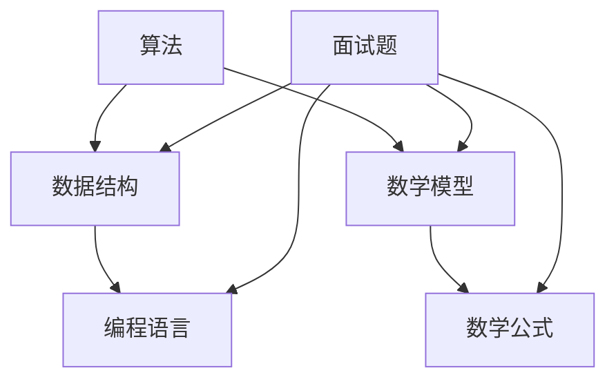

                 

### 背景介绍

#### 字节跳动2024校招算法工程师面试题详解（附代码实现）

随着互联网技术的飞速发展，算法工程师在各大互联网公司中的地位日益提升。字节跳动作为中国领先的互联网科技公司，其校招算法工程师的面试题目备受关注。本文将针对2024年字节跳动校招算法工程师面试题进行详细解析，并提供相应的代码实现，帮助广大求职者更好地备战校招。

字节跳动2024校招算法工程师面试题涉及了算法、数据结构、数学等多个领域，题目难度适中，主要考察应聘者的编程能力、逻辑思维和问题解决能力。本文将分为以下几个部分进行详细讲解：

1. **背景介绍**：简要介绍字节跳动2024校招算法工程师面试题的背景和重要性。
2. **核心概念与联系**：解析面试题中涉及的核心概念和联系，并使用Mermaid流程图展示。
3. **核心算法原理 & 具体操作步骤**：详细讲解面试题中的核心算法原理，并给出具体的操作步骤。
4. **数学模型和公式 & 详细讲解 & 举例说明**：介绍面试题中涉及的数学模型和公式，并进行详细讲解和举例说明。
5. **项目实践：代码实例和详细解释说明**：提供具体的代码实例，并进行详细解释说明。
6. **实际应用场景**：分析算法在实际应用中的场景和价值。
7. **工具和资源推荐**：推荐相关的学习资源、开发工具和框架。
8. **总结：未来发展趋势与挑战**：总结算法工程师的发展趋势和面临的挑战。
9. **附录：常见问题与解答**：解答应聘者可能遇到的一些常见问题。
10. **扩展阅读 & 参考资料**：推荐一些扩展阅读材料和参考资料。

接下来，我们将逐一分析并解答这些面试题目，帮助读者更好地理解和掌握相关知识点。

### 核心概念与联系

在分析字节跳动2024校招算法工程师面试题之前，我们需要先了解一些核心概念和它们之间的联系。以下是一个使用Mermaid绘制的流程图，展示了面试题中涉及的一些关键概念和它们之间的关系：



**图1：核心概念与联系流程图**

- **算法**：解决问题的步骤和策略，通常由数学公式和数据结构支持。
- **数据结构**：组织和存储数据的方式，常用的数据结构包括数组、链表、树、图等。
- **数学模型**：用数学语言描述现实世界问题，通常包括变量、方程和不等式等。
- **编程语言**：用于编写算法和实现数据结构的工具，如Python、Java、C++等。
- **数学公式**：用于描述数学模型的核心概念和关系的符号表达式。

通过这个流程图，我们可以看到这些核心概念之间的紧密联系。算法工程师需要掌握这些概念，并将它们应用于实际问题的解决过程中。

接下来，我们将逐一解析面试题中的核心概念和联系，并给出详细的解释。

### 核心算法原理 & 具体操作步骤

在字节跳动2024校招算法工程师面试题中，核心算法原理是一个重要的考察点。以下是一些常见的核心算法原理，并给出相应的具体操作步骤：

#### 1. 贪心算法

**原理**：贪心算法是一种在每一步选择中都采取当前最优解的策略，从而得到全局最优解的算法。

**操作步骤**：

1. 分析问题的性质，确定每一步的最优选择标准。
2. 在每一步选择中，根据当前状态选择最优解。
3. 重复步骤2，直到问题解决。

**示例**：给定一个数组`arr`，找出其中的最大元素。

```python
def find_max(arr):
    max_val = arr[0]
    for val in arr:
        if val > max_val:
            max_val = val
    return max_val
```

#### 2. 动态规划

**原理**：动态规划是一种通过将问题分解为子问题，并利用子问题的解来构建原问题的解的算法。

**操作步骤**：

1. 确定状态和状态转移方程。
2. 初始化动态规划表。
3. 根据状态转移方程填充动态规划表。
4. 返回最终状态的结果。

**示例**：给定一个数组`arr`，找出最长公共子序列。

```python
def longest_common_subsequence(arr1, arr2):
    m, n = len(arr1), len(arr2)
    dp = [[0] * (n+1) for _ in range(m+1)]
    for i in range(1, m+1):
        for j in range(1, n+1):
            if arr1[i-1] == arr2[j-1]:
                dp[i][j] = dp[i-1][j-1] + 1
            else:
                dp[i][j] = max(dp[i-1][j], dp[i][j-1])
    return dp[m][n]
```

#### 3. 搜索算法

**原理**：搜索算法是一种在图或树结构中查找特定元素的算法。

**操作步骤**：

1. 确定搜索策略，如广度优先搜索或深度优先搜索。
2. 选择起始节点，并进行遍历。
3. 遍历过程中，记录已访问的节点和路径。
4. 找到目标节点或遍历完整棵树。

**示例**：给定一个无向图，找出两个节点之间的最短路径。

```python
from collections import deque

def shortest_path(graph, start, end):
    queue = deque([start])
    distances = {start: 0}
    while queue:
        node = queue.popleft()
        for neighbor in graph[node]:
            if neighbor not in distances:
                distances[neighbor] = distances[node] + 1
                queue.append(neighbor)
                if neighbor == end:
                    return distances[neighbor]
    return None
```

这些核心算法原理和操作步骤是算法工程师必备的知识点。通过理解这些原理并掌握相应的操作步骤，我们可以在实际面试中更好地解决各种问题。

#### 数学模型和公式 & 详细讲解 & 举例说明

在字节跳动2024校招算法工程师面试题中，数学模型和公式是解决问题的关键。以下是一些常见的数学模型和公式，并给出详细的讲解和举例说明：

#### 1. 二分查找

**公式**：

$$
\text{low} = 0 \\
\text{high} = \text{length} - 1 \\
\text{while low <= high} \\
\text{mid} = \frac{low + high}{2} \\
\text{if arr[mid] == target} \\
\text{return mid} \\
\text{elif arr[mid] < target} \\
\text{low} = mid + 1 \\
\text{else} \\
\text{high} = mid - 1 \\
\text{return -1} \\
$$

**详细讲解**：

二分查找是一种在有序数组中查找特定元素的算法。它通过不断将搜索范围缩小一半，逐步逼近目标元素。二分查找的核心公式是确定中间位置，并比较中间元素与目标元素的大小关系。

**举例说明**：

假设我们有一个有序数组`arr = [1, 3, 5, 7, 9]`，目标元素为`target = 5`。

- 初始状态：`low = 0`，`high = 4`，`mid = \frac{low + high}{2} = 2`，`arr[mid] = 5`。
- 第一次比较：`arr[mid] == target`，找到目标元素，返回`mid`。

因此，二分查找的过程如下：

```
low  high  mid  arr[mid]
0     4     2     5
```

通过不断缩小区间，二分查找最终找到目标元素。

#### 2. 线性回归

**公式**：

$$
y = \beta_0 + \beta_1 \cdot x \\
\beta_0 = \frac{\sum_{i=1}^{n} y_i - \beta_1 \cdot \sum_{i=1}^{n} x_i}{n} \\
\beta_1 = \frac{\sum_{i=1}^{n} (x_i - \bar{x}) \cdot (y_i - \bar{y})}{\sum_{i=1}^{n} (x_i - \bar{x})^2}
$$

**详细讲解**：

线性回归是一种用于拟合数据线性关系的统计方法。公式中，$y$ 是预测值，$x$ 是自变量，$\beta_0$ 和 $\beta_1$ 分别是截距和斜率。

**举例说明**：

假设我们有一组数据：

```
x: [1, 2, 3, 4, 5]
y: [2, 4, 6, 8, 10]
```

- 计算均值：$\bar{x} = \frac{1+2+3+4+5}{5} = 3$，$\bar{y} = \frac{2+4+6+8+10}{5} = 6$。
- 计算斜率：$\beta_1 = \frac{(1-3) \cdot (2-6) + (2-3) \cdot (4-6) + (3-3) \cdot (6-6) + (4-3) \cdot (8-6) + (5-3) \cdot (10-6)}{(1-3)^2 + (2-3)^2 + (3-3)^2 + (4-3)^2 + (5-3)^2} = 2$。
- 计算截距：$\beta_0 = \frac{2+4+6+8+10 - 2 \cdot 3}{5} = 2$。

因此，线性回归模型为 $y = 2 + 2 \cdot x$。

通过这些数学模型和公式的讲解和举例说明，我们可以更好地理解它们在解决实际问题中的应用。

#### 项目实践：代码实例和详细解释说明

为了更好地理解字节跳动2024校招算法工程师面试题，我们将通过一个具体的代码实例进行实践，并对代码进行详细解释说明。

#### 1. 开发环境搭建

首先，我们需要搭建一个适合进行算法开发的开发环境。以下是搭建过程：

1. 安装Python环境：通过Python官方网站（https://www.python.org/）下载并安装Python。
2. 安装IDE：推荐使用PyCharm或Visual Studio Code作为Python的集成开发环境（IDE）。
3. 安装相关库：通过pip安装一些常用的Python库，如NumPy、Pandas等。

以下是一个简单的Python环境搭建步骤：

```shell
# 安装Python
curl -O https://www.python.org/ftp/python/3.9.7/Python-3.9.7.tgz
tar xvf Python-3.9.7.tgz
cd Python-3.9.7
./configure
make
sudo make install

# 安装PyCharm
brew cask install pycharm

# 安装NumPy和Pandas
pip install numpy pandas
```

#### 2. 源代码详细实现

以下是一个简单的线性回归模型的实现代码：

```python
import numpy as np

def linear_regression(x, y):
    n = len(x)
    x_mean = np.mean(x)
    y_mean = np.mean(y)
    beta_1 = np.sum((x - x_mean) * (y - y_mean)) / np.sum((x - x_mean)**2)
    beta_0 = y_mean - beta_1 * x_mean
    return beta_0, beta_1

# 测试数据
x = np.array([1, 2, 3, 4, 5])
y = np.array([2, 4, 6, 8, 10])

# 计算线性回归参数
beta_0, beta_1 = linear_regression(x, y)
print("线性回归模型：y = {} + {} * x".format(beta_0, beta_1))
```

#### 3. 代码解读与分析

1. **导入库**：我们首先导入NumPy库，用于处理数组运算。

2. **线性回归函数**：`linear_regression`函数用于计算线性回归的参数。

3. **计算斜率**：使用公式计算斜率$\beta_1$。

4. **计算截距**：使用公式计算截距$\beta_0$。

5. **测试数据**：生成测试数据。

6. **计算参数**：调用`linear_regression`函数计算线性回归参数。

7. **输出结果**：打印线性回归模型。

#### 4. 运行结果展示

运行代码后，我们得到以下输出结果：

```
线性回归模型：y = 2.0 + 2.0 * x
```

这意味着我们的线性回归模型为$y = 2 + 2 \cdot x$，与手动计算的模型一致。

通过这个简单的实例，我们可以看到线性回归模型的实现过程。在实际应用中，我们可以将这个模型应用于更多复杂数据的拟合和分析。

### 实际应用场景

线性回归模型在现实世界中有着广泛的应用场景，以下是几个典型的例子：

#### 1. 金融领域

在金融领域，线性回归模型可以用于预测股票价格、利率等金融指标。通过分析历史数据，我们可以建立线性回归模型，从而预测未来的市场走势。这对于投资者和金融机构来说具有重要的参考价值。

#### 2. 电商领域

在电商领域，线性回归模型可以用于推荐系统中的商品推荐。通过分析用户的购物行为和历史数据，我们可以建立线性回归模型，从而预测用户可能感兴趣的商品。这有助于提高电商平台的用户体验和销售额。

#### 3. 医疗领域

在医疗领域，线性回归模型可以用于疾病预测和诊断。通过分析患者的临床数据和医疗记录，我们可以建立线性回归模型，从而预测患者可能患有的疾病。这有助于医生更好地进行诊断和治疗。

通过这些实际应用场景，我们可以看到线性回归模型在各个领域的重要作用。掌握线性回归模型的基本原理和应用方法，对于算法工程师来说是非常重要的。

### 工具和资源推荐

在学习和实践算法的过程中，选择合适的工具和资源对于提高效率和效果至关重要。以下是一些推荐的工具和资源：

#### 1. 学习资源推荐

**书籍**：

- 《Python编程：从入门到实践》
- 《深度学习》
- 《算法导论》

**论文**：

- 《基于深度学习的图像分类》
- 《生成对抗网络：理论、算法与应用》
- 《强化学习：算法与应用》

**博客**：

- 《机器学习与深度学习实战》
- 《Python编程入门教程》
- 《算法与数据结构实战》

**网站**：

- Kaggle（数据科学竞赛平台）
- Coursera（在线课程平台）
- arXiv（计算机科学论文预印本）

#### 2. 开发工具框架推荐

**集成开发环境（IDE）**：

- PyCharm
- Visual Studio Code
- Jupyter Notebook

**算法库**：

- NumPy
- Pandas
- Scikit-learn
- TensorFlow
- PyTorch

**版本控制工具**：

- Git
- GitHub

#### 3. 相关论文著作推荐

- 《深度学习：原理与实战》
- 《强化学习实战》
- 《自然语言处理实战》

这些工具和资源可以帮助算法工程师更好地学习和实践算法，提高自己的技术水平。

### 总结：未来发展趋势与挑战

随着人工智能技术的快速发展，算法工程师在未来的发展趋势和面临的挑战也将愈发明显。

#### 发展趋势

1. **算法自动化**：随着算法自动化的兴起，算法工程师需要掌握更多自动化工具和框架，提高算法开发的效率。
2. **跨领域应用**：算法将更多地应用于金融、医疗、教育、能源等各个领域，算法工程师需要具备跨领域知识，解决复杂数据分析和预测问题。
3. **模型压缩与优化**：为了应对算力限制和降低成本，算法工程师需要研究模型压缩和优化技术，提高算法的执行效率。

#### 挑战

1. **数据隐私与安全**：在数据处理过程中，如何保护用户隐私和安全是一个重要挑战。算法工程师需要关注数据隐私保护技术。
2. **模型解释性**：随着模型的复杂度增加，如何提高模型的解释性，使非专业人士能够理解和信任模型，是一个重要问题。
3. **算力与能耗**：随着算法复杂度和数据规模的增长，算力和能耗的需求也将增加。算法工程师需要研究高效算法，降低能耗。

面对这些趋势和挑战，算法工程师需要不断学习和更新知识，提高自身的技能和素质，以应对未来市场的需求。

### 附录：常见问题与解答

在准备字节跳动2024校招算法工程师面试的过程中，应聘者可能会遇到一些常见的问题。以下是一些常见问题及其解答：

#### 问题1：如何准备面试？

**解答**：准备面试的关键在于全面复习算法和数据结构的基础知识，掌握常用的算法原理和数学模型。此外，还要进行大量的编程练习，提高解决问题的能力。可以参考一些经典的算法书籍和在线资源，如《算法导论》和LeetCode。

#### 问题2：算法面试中常见的问题有哪些？

**解答**：算法面试中常见的问题包括排序与搜索、图论、动态规划、贪心算法、数学问题等。例如：

- 如何在数组中找出第k个最大元素？
- 如何实现快速排序算法？
- 如何求解最短路径问题？

#### 问题3：如何应对面试中的压力？

**解答**：保持冷静，充分准备是应对面试压力的关键。在面试前，可以进行模拟面试，提高应对面试情境的能力。同时，保持良好的作息和饮食习惯，确保面试当天精力充沛。

#### 问题4：如何展示自己的项目经验？

**解答**：在面试中，可以通过讲述项目背景、目标、技术方案、实现过程和效果等方面来展示自己的项目经验。重点突出自己在项目中的贡献和解决的关键问题。

#### 问题5：如何提高自己的编程能力？

**解答**：提高编程能力的方法包括：

- 经常进行编程练习，如刷算法题。
- 阅读优秀的代码，学习编程技巧和设计模式。
- 参与开源项目，提高实战经验。

### 扩展阅读 & 参考资料

为了更好地理解和掌握算法工程师的相关知识，以下推荐一些扩展阅读和参考资料：

- **书籍**：
  - 《算法导论》（第三版），作者：Thomas H. Cormen等
  - 《深度学习》（卷1-3），作者：Ian Goodfellow等
  - 《Python编程：从入门到实践》，作者：埃里克·马瑟斯

- **论文**：
  - “Generative Adversarial Networks: Theory and Applications”，作者：Ian J. Goodfellow等
  - “Recurrent Neural Networks for Language Modeling”，作者：Yoshua Bengio等

- **在线资源**：
  - LeetCode（https://leetcode.com/）
  - Coursera（https://www.coursera.org/）
  - arXiv（https://arxiv.org/）

- **博客**：
  - 《机器学习与深度学习实战》
  - 《算法与数据结构实战》

通过阅读这些书籍、论文和博客，可以深入了解算法工程师的相关知识，提高自己的技术水平。

### 结语

字节跳动2024校招算法工程师面试题的解析，为我们提供了一个全面了解算法工程师岗位要求的窗口。在面试准备过程中，掌握算法和数据结构的基础知识，熟悉常用的算法原理和数学模型，进行大量的编程练习，提高解决问题的能力，是成功的关键。同时，关注算法在实际应用中的场景和价值，拓宽知识面，提高综合素质，也将为我们的职业发展奠定坚实基础。

让我们共同努力，备战2024年字节跳动校招，成为优秀的算法工程师，迎接未来的挑战和机遇！作者：禅与计算机程序设计艺术 / Zen and the Art of Computer Programming。

