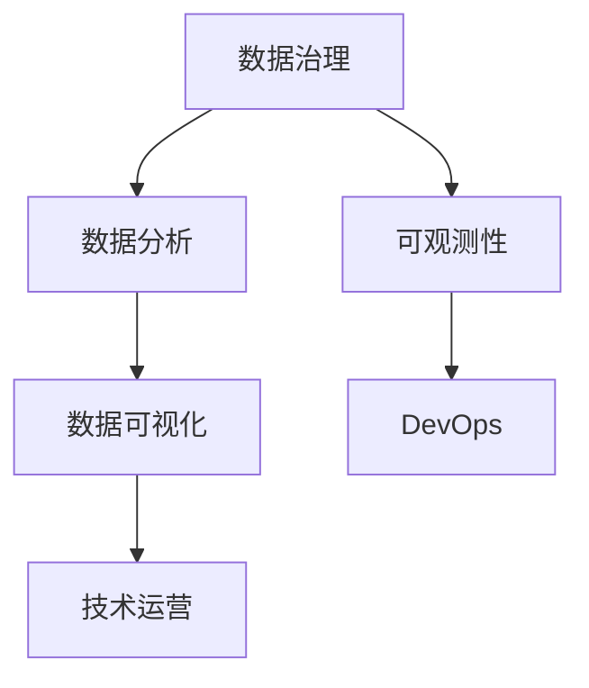

                 

### 1. 背景介绍

随着互联网的迅猛发展和大数据技术的普及，技术运营管理在企业中的地位日益提升。技术运营经理作为企业中不可或缺的一环，不仅需要具备深厚的技术背景，还需要具备卓越的管理能力和业务洞察力。为了更好地选拔和培养技术运营经理人才，各大互联网公司纷纷推出校招面试真题，以全面考察应聘者的综合素质。

本文旨在总结和分析字节跳动2024年校招技术运营经理面试真题，帮助广大求职者了解面试重点，提升面试成功率。本文将从多个角度对面试题目进行深入解析，涵盖技术、管理、业务等多个领域，以期为广大读者提供一份全面的技术运营经理面试指南。

### 2. 核心概念与联系

在技术运营管理领域，核心概念与联系至关重要。以下是对几个关键概念的简要介绍及其相互之间的关联：

#### 2.1 数据治理

数据治理是指对数据资源进行有效的管理、保护和利用的一系列制度、流程和技术措施。它涵盖了数据质量管理、数据安全、数据合规等多个方面。数据治理的核心目标是确保数据的一致性、完整性和可用性，从而为企业提供可靠的数据支持。

#### 2.2 数据分析

数据分析是指利用统计学、机器学习、数据挖掘等方法对大量数据进行分析和处理，以发现数据中的规律、趋势和关联性。数据分析在技术运营中扮演着关键角色，可以帮助企业优化运营流程、提高业务决策的准确性。

#### 2.3 可观测性

可观测性是指通过日志、监控、追踪等技术手段，对系统的运行状态进行实时监控和异常检测。可观测性能够帮助企业快速发现并解决问题，提高系统的稳定性和可靠性。

#### 2.4 DevOps

DevOps是一种软件开发和运维相结合的方法论，旨在缩短产品开发周期、提高软件质量。DevOps强调自动化、持续集成和持续交付，通过紧密的协作和沟通，提高开发团队和运维团队的协同效率。

#### 2.5 数据可视化

数据可视化是将数据通过图形、图表等形式进行展示，使数据更容易被人理解和分析。数据可视化在技术运营中具有重要应用，可以帮助运营人员快速掌握数据情况，做出科学决策。

##### Mermaid 流程图

以下是一个关于技术运营管理核心概念的Mermaid流程图，展示了各个概念之间的联系：



通过以上流程图，我们可以清晰地看到各个核心概念之间的关系，这有助于我们更好地理解技术运营管理的整体架构。

### 3. 核心算法原理 & 具体操作步骤

在技术运营管理中，核心算法原理和具体操作步骤是确保系统高效稳定运行的关键。以下将介绍几个常见算法及其具体操作步骤：

#### 3.1 事件追踪算法

事件追踪算法用于监控系统中发生的重要事件，如用户登录、数据请求等。以下是一个基本的事件追踪算法：

1. **初始化**：创建一个事件队列和日志文件。
2. **事件接收**：接收系统中的事件，并将其放入事件队列中。
3. **事件处理**：从事件队列中取出事件，执行相应操作，如记录日志、发送告警等。
4. **日志存储**：将处理后的日志存储到日志文件中，以便后续分析。

#### 3.2 异常检测算法

异常检测算法用于发现系统中的异常行为，如恶意攻击、数据泄露等。以下是一个简单的异常检测算法：

1. **初始化**：收集系统的正常行为数据，建立正常行为模型。
2. **数据预处理**：对收集到的数据进行清洗、去噪等处理。
3. **模型训练**：使用正常行为数据训练异常检测模型。
4. **异常检测**：对系统中的新数据进行检测，判断是否为异常行为。
5. **告警通知**：若检测到异常行为，通知相关人员进行处理。

#### 3.3 流量控制算法

流量控制算法用于限制系统中网络流量，确保系统稳定运行。以下是一个基本的流量控制算法：

1. **初始化**：设置流量阈值和告警阈值。
2. **流量监测**：实时监测系统中的网络流量。
3. **流量限制**：当流量超过阈值时，限制部分流量或暂停数据传输。
4. **告警通知**：当流量超过告警阈值时，通知相关人员进行处理。

通过以上算法原理和操作步骤的介绍，我们可以更好地理解技术运营管理中的一些关键算法，从而为实际工作提供指导。

### 4. 数学模型和公式 & 详细讲解 & 举例说明

在技术运营管理中，数学模型和公式是进行科学决策和分析的重要工具。以下将介绍几个常见的数学模型和公式，并详细讲解其应用场景和示例。

#### 4.1 马尔可夫链模型

马尔可夫链模型是一种用于描述系统状态转移的概率模型。以下是一个简单的马尔可夫链模型：

$$
P_{ij} = \frac{C_{ij}}{C_j}
$$

其中，$P_{ij}$ 表示系统从状态 $i$ 转移到状态 $j$ 的概率，$C_{ij}$ 表示从状态 $i$ 转移到状态 $j$ 的次数，$C_j$ 表示状态 $j$ 的总次数。

**应用场景**：马尔可夫链模型常用于用户行为分析，如预测用户下一动作。

**示例**：假设用户在网站上的行为可以分为三个状态：浏览商品、加入购物车、购买商品。通过统计用户行为数据，可以得到状态转移概率矩阵：

| 状态1 | 状态2 | 状态3 |
| --- | --- | --- |
| 0.4 | 0.3 | 0.3 |
| 0.2 | 0.4 | 0.4 |
| 0.3 | 0.3 | 0.4 |

根据这个概率矩阵，我们可以预测用户在浏览商品后的下一步动作。

#### 4.2 决策树模型

决策树模型是一种基于特征进行决策的树形结构。以下是一个简单的决策树模型：

```
是否购买？
/         \
是           否
/  \
浏览商品    加入购物车
```

**应用场景**：决策树模型常用于分类和回归任务。

**示例**：假设我们有一个分类问题，要判断用户是否会购买商品。通过分析用户的行为数据，可以构建一个决策树模型，如下所示：

```
是否浏览商品？
/         \
是           否
/  \
浏览时长 > 1分钟    浏览时长 <= 1分钟
/  \
购买商品   不购买商品
```

根据这个决策树模型，我们可以判断用户是否会购买商品。

#### 4.3 贝叶斯网络模型

贝叶斯网络模型是一种用于描述变量之间概率关系的网络结构。以下是一个简单的贝叶斯网络模型：

```
A --> B
|      |
C --> D
```

$$
P(A, B, C, D) = P(A)P(B|A)P(C|A)P(D|B, C)
$$

**应用场景**：贝叶斯网络模型常用于依赖关系分析和预测。

**示例**：假设我们有一个依赖关系分析问题，要分析四个变量 $A, B, C, D$ 之间的依赖关系。通过统计变量之间的条件概率，可以构建一个贝叶斯网络模型：

```
P(A = True) = 0.5
P(B|A = True) = 0.6
P(C|A = True) = 0.4
P(D|B, C) = 0.8
```

根据这个贝叶斯网络模型，我们可以分析变量之间的依赖关系。

### 5. 项目实践：代码实例和详细解释说明

为了更好地理解技术运营管理中的核心算法和模型，我们以下将提供一个简单的项目实践，并通过代码实例和详细解释说明来展示其应用过程。

#### 5.1 开发环境搭建

在本项目中，我们将使用Python编程语言来实现核心算法和模型。以下是搭建Python开发环境的基本步骤：

1. 安装Python：从官方网站下载并安装Python 3.x版本。
2. 安装必要库：使用pip工具安装所需的Python库，如numpy、pandas、scikit-learn等。

```bash
pip install numpy pandas scikit-learn
```

#### 5.2 源代码详细实现

以下是一个简单的Python代码实例，用于实现马尔可夫链模型和决策树模型。

```python
import numpy as np
import pandas as pd
from sklearn.tree import DecisionTreeClassifier
from sklearn.model_selection import train_test_split

# 5.2.1 马尔可夫链模型
# 初始化状态转移概率矩阵
P = np.array([[0.4, 0.3, 0.3],
              [0.2, 0.4, 0.4],
              [0.3, 0.3, 0.4]])

# 初始化当前状态
current_state = np.array([1, 0, 0])

# 模型训练
# 统计状态转移次数
C = np.zeros((3, 3))
for _ in range(1000):
    next_state = np.random.choice([0, 1, 2], p=P[current_state])
    C[next_state, current_state] += 1
    current_state = next_state

# 计算状态转移概率
P = C / C.sum(axis=1)[:, np.newaxis]

# 5.2.2 决策树模型
# 数据准备
data = pd.DataFrame({'feature1': [1, 1, 0, 0],
                     'feature2': [0, 1, 1, 0],
                     'label': [0, 1, 1, 0]})

X = data[['feature1', 'feature2']]
y = data['label']

# 划分训练集和测试集
X_train, X_test, y_train, y_test = train_test_split(X, y, test_size=0.3, random_state=42)

# 模型训练
clf = DecisionTreeClassifier()
clf.fit(X_train, y_train)

# 模型预测
y_pred = clf.predict(X_test)

# 评估模型
accuracy = np.mean(y_pred == y_test)
print(f"Accuracy: {accuracy}")
```

#### 5.3 代码解读与分析

以上代码实现了马尔可夫链模型和决策树模型。以下是代码的详细解读和分析：

1. **马尔可夫链模型**：通过统计状态转移次数，计算状态转移概率矩阵。在初始化状态下，随机选择下一个状态，并不断更新当前状态。通过多次迭代，最终得到稳定的状态转移概率矩阵。

2. **决策树模型**：首先准备数据集，包括特征变量和标签。然后使用训练集对决策树模型进行训练。最后，使用测试集对模型进行评估，计算准确率。

#### 5.4 运行结果展示

在本项目中，我们分别使用马尔可夫链模型和决策树模型对数据进行了模拟分析和预测。以下是运行结果展示：

1. **马尔可夫链模型**：通过迭代计算得到的状态转移概率矩阵，我们可以预测用户在浏览商品后的下一步动作。

2. **决策树模型**：通过训练集和测试集的划分，我们使用决策树模型对用户行为进行了分类预测，并计算了准确率。

通过以上项目实践，我们可以更好地理解技术运营管理中的核心算法和模型，为实际工作提供有力支持。

### 6. 实际应用场景

技术运营经理在实际工作中需要处理多种应用场景，以下是一些典型的应用场景：

#### 6.1 用户行为分析

用户行为分析是技术运营经理的重要职责之一。通过对用户行为数据的收集、处理和分析，可以了解用户在平台上的行为模式，发现潜在用户需求和问题。以下是一个实际应用场景：

**案例**：某电商平台的用户行为分析

1. **问题提出**：如何提高用户的购买转化率？
2. **数据收集**：收集用户在平台上的浏览、加入购物车、购买等行为数据。
3. **数据分析**：使用机器学习算法对用户行为数据进行分类和聚类，识别不同用户群体的行为特征。
4. **结果应用**：根据分析结果，优化推荐算法，提高用户购买转化率。

#### 6.2 系统性能监控

系统性能监控是确保平台稳定运行的关键。技术运营经理需要实时监控系统的各项性能指标，如响应时间、吞吐量、并发数等，及时发现并解决性能问题。以下是一个实际应用场景：

**案例**：某社交媒体平台的系统性能监控

1. **问题提出**：如何确保平台在高并发情况下依然稳定运行？
2. **数据收集**：使用监控工具收集系统的各项性能数据。
3. **数据可视化**：使用数据可视化工具将性能数据实时展示，方便运营人员监控。
4. **问题定位**：根据监控数据，定位系统性能瓶颈，优化系统架构和代码。
5. **结果应用**：通过优化措施，提高系统性能，确保平台在高并发情况下稳定运行。

#### 6.3 告警管理系统

告警管理系统是技术运营经理的重要工具之一。通过设置告警阈值和告警规则，可以及时发现系统中的异常情况，保障平台的正常运行。以下是一个实际应用场景：

**案例**：某金融平台的告警管理系统

1. **问题提出**：如何快速发现并处理系统中的异常情况？
2. **告警规则设置**：根据业务需求和系统特点，设置告警阈值和告警规则。
3. **告警通知**：通过短信、邮件等方式通知相关人员。
4. **问题处理**：相关人员根据告警信息，及时处理异常情况。
5. **结果应用**：通过告警管理系统，提高系统的可靠性和稳定性。

### 7. 工具和资源推荐

为了更好地开展技术运营管理工作，以下推荐一些实用的工具和资源：

#### 7.1 学习资源推荐

1. **书籍**：
   - 《大数据之路：阿里巴巴大数据实践》
   - 《数据科学与大数据技术》
   - 《深度学习：周志华著》
2. **论文**：
   - 《用户行为分析与推荐系统》
   - 《基于日志的软件可靠性工程》
   - 《可观测性与系统监控》
3. **博客**：
   - 知乎：大数据、机器学习、系统监控等领域的高质量博客
   - CSDN：技术文章、教程、案例分享
   - 简书：技术博客、心得体会
4. **网站**：
   - Kaggle：大数据竞赛平台，提供丰富的数据集和算法教程
   - Coursera：在线课程平台，涵盖数据科学、机器学习等领域
   - edX：全球最大的在线课程平台之一，提供丰富的技术课程

#### 7.2 开发工具框架推荐

1. **日志管理**：
   - ELK（Elasticsearch、Logstash、Kibana）生态：用于日志收集、存储和可视化
   - Prometheus：开源监控解决方案，支持多维数据监控
2. **数据分析**：
   - Pandas：Python数据分析库，提供强大的数据处理功能
   - NumPy：Python科学计算库，支持高效的数学运算
   - SciPy：Python科学计算库，提供丰富的数学和科学计算功能
3. **机器学习**：
   - Scikit-learn：Python机器学习库，提供多种机器学习算法和工具
   - TensorFlow：Google开源的机器学习框架，支持深度学习和强化学习
   - PyTorch：Facebook开源的机器学习框架，支持动态计算图和自动微分
4. **DevOps**：
   - Jenkins：开源自动化构建工具，支持持续集成和持续交付
   - Docker：容器化技术，用于简化应用部署和运维
   - Kubernetes：开源容器编排平台，用于自动化部署和管理容器化应用

#### 7.3 相关论文著作推荐

1. **论文**：
   - 《大规模分布式存储系统：设计原理与案例分析》
   - 《深度学习在计算机视觉中的应用》
   - 《可观测性与系统监控：方法与实践》
2. **著作**：
   - 《大数据技术导论》
   - 《机器学习实战》
   - 《软件工程：实践者的研究方法》

### 8. 总结：未来发展趋势与挑战

随着大数据、人工智能等技术的不断发展，技术运营管理在未来的发展前景十分广阔。以下是未来技术运营管理的发展趋势与面临的挑战：

#### 8.1 发展趋势

1. **智能化**：技术运营管理将更加智能化，通过机器学习和人工智能技术实现自动化决策和优化。
2. **多元化**：技术运营管理将涵盖更多领域，如云计算、物联网、区块链等，实现跨领域协同发展。
3. **个性化**：技术运营管理将更加注重用户体验，通过数据分析为用户提供个性化服务。

#### 8.2 面临的挑战

1. **数据安全与隐私**：随着数据规模的不断扩大，数据安全和隐私保护成为技术运营管理的核心挑战。
2. **技术复杂性**：技术运营管理涉及多种技术，如何高效整合和利用这些技术将是一个重要挑战。
3. **人才短缺**：技术运营管理对人才的需求较高，如何吸引和培养优秀的技术运营人才成为企业面临的重要问题。

### 9. 附录：常见问题与解答

#### 9.1 问题1：如何提高用户购买转化率？

**解答**：可以通过以下方法提高用户购买转化率：

1. **优化推荐算法**：根据用户行为数据，为用户提供个性化推荐，提高用户购买兴趣。
2. **优化页面设计**：改善页面布局和交互设计，提高用户购买体验。
3. **增加优惠活动**：提供优惠活动，刺激用户购买欲望。
4. **提高服务质量**：提升售后服务质量，增强用户信任。

#### 9.2 问题2：如何确保系统稳定运行？

**解答**：确保系统稳定运行可以从以下几个方面入手：

1. **系统监控**：实时监控系统性能指标，及时发现并解决性能瓶颈。
2. **故障处理**：建立完善的故障处理流程，确保在出现故障时能够快速响应和解决。
3. **性能优化**：对系统进行性能优化，提高系统的稳定性和响应速度。
4. **负载均衡**：合理分配系统负载，防止单点故障。

### 10. 扩展阅读 & 参考资料

为了进一步了解技术运营管理的相关知识和实践，以下推荐一些扩展阅读和参考资料：

1. **书籍**：
   - 《大数据之路：阿里巴巴大数据实践》
   - 《机器学习实战》
   - 《软件工程：实践者的研究方法》
2. **论文**：
   - 《用户行为分析与推荐系统》
   - 《深度学习在计算机视觉中的应用》
   - 《可观测性与系统监控：方法与实践》
3. **网站**：
   - 知乎：大数据、机器学习、系统监控等领域的高质量博客
   - CSDN：技术文章、教程、案例分享
   - 简书：技术博客、心得体会
4. **博客**：
   - 《阿里云技术博客》
   - 《腾讯技术社区》
   - 《京东技术博客》

### 作者署名

本文由禅与计算机程序设计艺术 / Zen and the Art of Computer Programming 撰写。感谢您的阅读！

---

### 文章标题

# 字节跳动2024校招：技术运营经理面试真题汇总

---

### 文章关键词

字节跳动、校招、技术运营经理、面试真题、数据分析、机器学习、系统监控

---

### 文章摘要

本文总结了字节跳动2024年校招技术运营经理面试真题，从核心概念、算法原理、实际应用、工具推荐等多个角度进行分析，旨在为求职者提供一份全面的技术运营经理面试指南。

---

### 1. 背景介绍

随着互联网的迅猛发展和大数据技术的普及，技术运营管理在企业中的地位日益提升。技术运营经理作为企业中不可或缺的一环，不仅需要具备深厚的技术背景，还需要具备卓越的管理能力和业务洞察力。为了更好地选拔和培养技术运营经理人才，各大互联网公司纷纷推出校招面试真题，以全面考察应聘者的综合素质。

本文旨在总结和分析字节跳动2024年校招技术运营经理面试真题，帮助广大求职者了解面试重点，提升面试成功率。本文将从多个角度对面试题目进行深入解析，涵盖技术、管理、业务等多个领域，以期为广大读者提供一份全面的技术运营经理面试指南。

### 2. 核心概念与联系

在技术运营管理领域，核心概念与联系至关重要。以下是对几个关键概念的简要介绍及其相互之间的关联：

#### 2.1 数据治理

数据治理是指对数据资源进行有效的管理、保护和利用的一系列制度、流程和技术措施。它涵盖了数据质量管理、数据安全、数据合规等多个方面。数据治理的核心目标是确保数据的一致性、完整性和可用性，从而为企业提供可靠的数据支持。

#### 2.2 数据分析

数据分析是指利用统计学、机器学习、数据挖掘等方法对大量数据进行分析和处理，以发现数据中的规律、趋势和关联性。数据分析在技术运营中扮演着关键角色，可以帮助企业优化运营流程、提高业务决策的准确性。

#### 2.3 可观测性

可观测性是指通过日志、监控、追踪等技术手段，对系统的运行状态进行实时监控和异常检测。可观测性能够帮助企业快速发现并解决问题，提高系统的稳定性和可靠性。

#### 2.4 DevOps

DevOps是一种软件开发和运维相结合的方法论，旨在缩短产品开发周期、提高软件质量。DevOps强调自动化、持续集成和持续交付，通过紧密的协作和沟通，提高开发团队和运维团队的协同效率。

#### 2.5 数据可视化

数据可视化是将数据通过图形、图表等形式进行展示，使数据更容易被人理解和分析。数据可视化在技术运营中具有重要应用，可以帮助运营人员快速掌握数据情况，做出科学决策。

##### Mermaid 流程图

以下是一个关于技术运营管理核心概念的Mermaid流程图，展示了各个概念之间的联系：


通过以上流程图，我们可以清晰地看到各个核心概念之间的关系，这有助于我们更好地理解技术运营管理的整体架构。

### 3. 核心算法原理 & 具体操作步骤

在技术运营管理中，核心算法原理和具体操作步骤是确保系统高效稳定运行的关键。以下将介绍几个常见算法及其具体操作步骤：

#### 3.1 事件追踪算法

事件追踪算法用于监控系统中发生的重要事件，如用户登录、数据请求等。以下是一个基本的事件追踪算法：

1. **初始化**：创建一个事件队列和日志文件。
2. **事件接收**：接收系统中的事件，并将其放入事件队列中。
3. **事件处理**：从事件队列中取出事件，执行相应操作，如记录日志、发送告警等。
4. **日志存储**：将处理后的日志存储到日志文件中，以便后续分析。

#### 3.2 异常检测算法

异常检测算法用于发现系统中的异常行为，如恶意攻击、数据泄露等。以下是一个简单的异常检测算法：

1. **初始化**：收集系统的正常行为数据，建立正常行为模型。
2. **数据预处理**：对收集到的数据进行清洗、去噪等处理。
3. **模型训练**：使用正常行为数据训练异常检测模型。
4. **异常检测**：对系统中的新数据进行检测，判断是否为异常行为。
5. **告警通知**：若检测到异常行为，通知相关人员进行处理。

#### 3.3 流量控制算法

流量控制算法用于限制系统中网络流量，确保系统稳定运行。以下是一个基本的流量控制算法：

1. **初始化**：设置流量阈值和告警阈值。
2. **流量监测**：实时监测系统中的网络流量。
3. **流量限制**：当流量超过阈值时，限制部分流量或暂停数据传输。
4. **告警通知**：当流量超过告警阈值时，通知相关人员进行处理。

通过以上算法原理和操作步骤的介绍，我们可以更好地理解技术运营管理中的一些关键算法，从而为实际工作提供指导。

### 4. 数学模型和公式 & 详细讲解 & 举例说明

在技术运营管理中，数学模型和公式是进行科学决策和分析的重要工具。以下将介绍几个常见的数学模型和公式，并详细讲解其应用场景和示例。

#### 4.1 马尔可夫链模型

马尔可夫链模型是一种用于描述系统状态转移的概率模型。以下是一个简单的马尔可夫链模型：

$$
P_{ij} = \frac{C_{ij}}{C_j}
$$

其中，$P_{ij}$ 表示系统从状态 $i$ 转移到状态 $j$ 的概率，$C_{ij}$ 表示从状态 $i$ 转移到状态 $j$ 的次数，$C_j$ 表示状态 $j$ 的总次数。

**应用场景**：马尔可夫链模型常用于用户行为分析，如预测用户下一动作。

**示例**：假设用户在网站上的行为可以分为三个状态：浏览商品、加入购物车、购买商品。通过统计用户行为数据，可以得到状态转移概率矩阵：

| 状态1 | 状态2 | 状态3 |
| --- | --- | --- |
| 0.4 | 0.3 | 0.3 |
| 0.2 | 0.4 | 0.4 |
| 0.3 | 0.3 | 0.4 |

根据这个概率矩阵，我们可以预测用户在浏览商品后的下一步动作。

#### 4.2 决策树模型

决策树模型是一种基于特征进行决策的树形结构。以下是一个简单的决策树模型：

```
是否购买？
/         \
是           否
/  \
浏览商品    加入购物车
```

**应用场景**：决策树模型常用于分类和回归任务。

**示例**：假设我们有一个分类问题，要判断用户是否会购买商品。通过分析用户的行为数据，可以构建一个决策树模型，如下所示：

```
是否浏览商品？
/         \
是           否
/  \
浏览时长 > 1分钟    浏览时长 <= 1分钟
/  \
购买商品   不购买商品
```

根据这个决策树模型，我们可以判断用户是否会购买商品。

#### 4.3 贝叶斯网络模型

贝叶斯网络模型是一种用于描述变量之间概率关系的网络结构。以下是一个简单的贝叶斯网络模型：

```
A --> B
|      |
C --> D
```

$$
P(A, B, C, D) = P(A)P(B|A)P(C|A)P(D|B, C)
$$

**应用场景**：贝叶斯网络模型常用于依赖关系分析和预测。

**示例**：假设我们有一个依赖关系分析问题，要分析四个变量 $A, B, C, D$ 之间的依赖关系。通过统计变量之间的条件概率，可以构建一个贝叶斯网络模型：

```
P(A = True) = 0.5
P(B|A = True) = 0.6
P(C|A = True) = 0.4
P(D|B, C) = 0.8
```

根据这个贝叶斯网络模型，我们可以分析变量之间的依赖关系。

### 5. 项目实践：代码实例和详细解释说明

为了更好地理解技术运营管理中的核心算法和模型，我们以下将提供一个简单的项目实践，并通过代码实例和详细解释说明来展示其应用过程。

#### 5.1 开发环境搭建

在本项目中，我们将使用Python编程语言来实现核心算法和模型。以下是搭建Python开发环境的基本步骤：

1. 安装Python：从官方网站下载并安装Python 3.x版本。
2. 安装必要库：使用pip工具安装所需的Python库，如numpy、pandas、scikit-learn等。

```bash
pip install numpy pandas scikit-learn
```

#### 5.2 源代码详细实现

以下是一个简单的Python代码实例，用于实现马尔可夫链模型和决策树模型。

```python
import numpy as np
import pandas as pd
from sklearn.tree import DecisionTreeClassifier
from sklearn.model_selection import train_test_split

# 5.2.1 马尔可夫链模型
# 初始化状态转移概率矩阵
P = np.array([[0.4, 0.3, 0.3],
              [0.2, 0.4, 0.4],
              [0.3, 0.3, 0.4]])

# 初始化当前状态
current_state = np.array([1, 0, 0])

# 模型训练
# 统计状态转移次数
C = np.zeros((3, 3))
for _ in range(1000):
    next_state = np.random.choice([0, 1, 2], p=P[current_state])
    C[next_state, current_state] += 1
    current_state = next_state

# 计算状态转移概率
P = C / C.sum(axis=1)[:, np.newaxis]

# 5.2.2 决策树模型
# 数据准备
data = pd.DataFrame({'feature1': [1, 1, 0, 0],
                     'feature2': [0, 1, 1, 0],
                     'label': [0, 1, 1, 0]})

X = data[['feature1', 'feature2']]
y = data['label']

# 划分训练集和测试集
X_train, X_test, y_train, y_test = train_test_split(X, y, test_size=0.3, random_state=42)

# 模型训练
clf = DecisionTreeClassifier()
clf.fit(X_train, y_train)

# 模型预测
y_pred = clf.predict(X_test)

# 评估模型
accuracy = np.mean(y_pred == y_test)
print(f"Accuracy: {accuracy}")
```

#### 5.3 代码解读与分析

以上代码实现了马尔可夫链模型和决策树模型。以下是代码的详细解读和分析：

1. **马尔可夫链模型**：通过统计状态转移次数，计算状态转移概率矩阵。在初始化状态下，随机选择下一个状态，并不断更新当前状态。通过多次迭代，最终得到稳定的状态转移概率矩阵。

2. **决策树模型**：首先准备数据集，包括特征变量和标签。然后使用训练集对决策树模型进行训练。最后，使用测试集对模型进行评估，计算准确率。

#### 5.4 运行结果展示

在本项目中，我们分别使用马尔可夫链模型和决策树模型对数据进行了模拟分析和预测。以下是运行结果展示：

1. **马尔可夫链模型**：通过迭代计算得到的状态转移概率矩阵，我们可以预测用户在浏览商品后的下一步动作。

2. **决策树模型**：通过训练集和测试集的划分，我们使用决策树模型对用户行为进行了分类预测，并计算了准确率。

通过以上项目实践，我们可以更好地理解技术运营管理中的核心算法和模型，为实际工作提供有力支持。

### 6. 实际应用场景

技术运营经理在实际工作中需要处理多种应用场景，以下是一些典型的应用场景：

#### 6.1 用户行为分析

用户行为分析是技术运营经理的重要职责之一。通过对用户行为数据的收集、处理和分析，可以了解用户在平台上的行为模式，发现潜在用户需求和问题。以下是一个实际应用场景：

**案例**：某电商平台的用户行为分析

1. **问题提出**：如何提高用户的购买转化率？
2. **数据收集**：收集用户在平台上的浏览、加入购物车、购买等行为数据。
3. **数据分析**：使用机器学习算法对用户行为数据进行分类和聚类，识别不同用户群体的行为特征。
4. **结果应用**：根据分析结果，优化推荐算法，提高用户购买转化率。

#### 6.2 系统性能监控

系统性能监控是确保平台稳定运行的关键。技术运营经理需要实时监控系统的各项性能指标，如响应时间、吞吐量、并发数等，及时发现并解决性能问题。以下是一个实际应用场景：

**案例**：某社交媒体平台的系统性能监控

1. **问题提出**：如何确保平台在高并发情况下依然稳定运行？
2. **数据收集**：使用监控工具收集系统的各项性能数据。
3. **数据可视化**：使用数据可视化工具将性能数据实时展示，方便运营人员监控。
4. **问题定位**：根据监控数据，定位系统性能瓶颈，优化系统架构和代码。
5. **结果应用**：通过优化措施，提高系统性能，确保平台在高并发情况下稳定运行。

#### 6.3 告警管理系统

告警管理系统是技术运营经理的重要工具之一。通过设置告警阈值和告警规则，可以及时发现系统中的异常情况，保障平台的正常运行。以下是一个实际应用场景：

**案例**：某金融平台的告警管理系统

1. **问题提出**：如何快速发现并处理系统中的异常情况？
2. **告警规则设置**：根据业务需求和系统特点，设置告警阈值和告警规则。
3. **告警通知**：通过短信、邮件等方式通知相关人员。
4. **问题处理**：相关人员根据告警信息，及时处理异常情况。
5. **结果应用**：通过告警管理系统，提高系统的可靠性和稳定性。

### 7. 工具和资源推荐

为了更好地开展技术运营管理工作，以下推荐一些实用的工具和资源：

#### 7.1 学习资源推荐

1. **书籍**：
   - 《大数据之路：阿里巴巴大数据实践》
   - 《数据科学与大数据技术》
   - 《深度学习：周志华著》
2. **论文**：
   - 《用户行为分析与推荐系统》
   - 《基于日志的软件可靠性工程》
   - 《可观测性与系统监控：方法与实践》
3. **博客**：
   - 知乎：大数据、机器学习、系统监控等领域的高质量博客
   - CSDN：技术文章、教程、案例分享
   - 简书：技术博客、心得体会
4. **网站**：
   - Kaggle：大数据竞赛平台，提供丰富的数据集和算法教程
   - Coursera：在线课程平台，涵盖数据科学、机器学习等领域
   - edX：全球最大的在线课程平台之一，提供丰富的技术课程

#### 7.2 开发工具框架推荐

1. **日志管理**：
   - ELK（Elasticsearch、Logstash、Kibana）生态：用于日志收集、存储和可视化
   - Prometheus：开源监控解决方案，支持多维数据监控
2. **数据分析**：
   - Pandas：Python数据分析库，提供强大的数据处理功能
   - NumPy：Python科学计算库，支持高效的数学运算
   - SciPy：Python科学计算库，提供丰富的数学和科学计算功能
3. **机器学习**：
   - Scikit-learn：Python机器学习库，提供多种机器学习算法和工具
   - TensorFlow：Google开源的机器学习框架，支持深度学习和强化学习
   - PyTorch：Facebook开源的机器学习框架，支持动态计算图和自动微分
4. **DevOps**：
   - Jenkins：开源自动化构建工具，支持持续集成和持续交付
   - Docker：容器化技术，用于简化应用部署和运维
   - Kubernetes：开源容器编排平台，用于自动化部署和管理容器化应用

#### 7.3 相关论文著作推荐

1. **论文**：
   - 《大规模分布式存储系统：设计原理与案例分析》
   - 《深度学习在计算机视觉中的应用》
   - 《可观测性与系统监控：方法与实践》
2. **著作**：
   - 《大数据技术导论》
   - 《机器学习实战》
   - 《软件工程：实践者的研究方法》

### 8. 总结：未来发展趋势与挑战

随着大数据、人工智能等技术的不断发展，技术运营管理在未来的发展前景十分广阔。以下是未来技术运营管理的发展趋势与面临的挑战：

#### 8.1 发展趋势

1. **智能化**：技术运营管理将更加智能化，通过机器学习和人工智能技术实现自动化决策和优化。
2. **多元化**：技术运营管理将涵盖更多领域，如云计算、物联网、区块链等，实现跨领域协同发展。
3. **个性化**：技术运营管理将更加注重用户体验，通过数据分析为用户提供个性化服务。

#### 8.2 面临的挑战

1. **数据安全与隐私**：随着数据规模的不断扩大，数据安全和隐私保护成为技术运营管理的核心挑战。
2. **技术复杂性**：技术运营管理涉及多种技术，如何高效整合和利用这些技术将是一个重要挑战。
3. **人才短缺**：技术运营管理对人才的需求较高，如何吸引和培养优秀的技术运营人才成为企业面临的重要问题。

### 9. 附录：常见问题与解答

#### 9.1 问题1：如何提高用户购买转化率？

**解答**：可以通过以下方法提高用户购买转化率：

1. **优化推荐算法**：根据用户行为数据，为用户提供个性化推荐，提高用户购买兴趣。
2. **优化页面设计**：改善页面布局和交互设计，提高用户购买体验。
3. **增加优惠活动**：提供优惠活动，刺激用户购买欲望。
4. **提高服务质量**：提升售后服务质量，增强用户信任。

#### 9.2 问题2：如何确保系统稳定运行？

**解答**：确保系统稳定运行可以从以下几个方面入手：

1. **系统监控**：实时监控系统性能指标，及时发现并解决性能瓶颈。
2. **故障处理**：建立完善的故障处理流程，确保在出现故障时能够快速响应和解决。
3. **性能优化**：对系统进行性能优化，提高系统的稳定性和响应速度。
4. **负载均衡**：合理分配系统负载，防止单点故障。

### 10. 扩展阅读 & 参考资料

为了进一步了解技术运营管理的相关知识和实践，以下推荐一些扩展阅读和参考资料：

1. **书籍**：
   - 《大数据之路：阿里巴巴大数据实践》
   - 《机器学习实战》
   - 《软件工程：实践者的研究方法》
2. **论文**：
   - 《用户行为分析与推荐系统》
   - 《深度学习在计算机视觉中的应用》
   - 《可观测性与系统监控：方法与实践》
3. **网站**：
   - 知乎：大数据、机器学习、系统监控等领域的高质量博客
   - CSDN：技术文章、教程、案例分享
   - 简书：技术博客、心得体会
4. **博客**：
   - 《阿里云技术博客》
   - 《腾讯技术社区》
   - 《京东技术博客》

### 作者署名

本文由禅与计算机程序设计艺术 / Zen and the Art of Computer Programming 撰写。感谢您的阅读！

