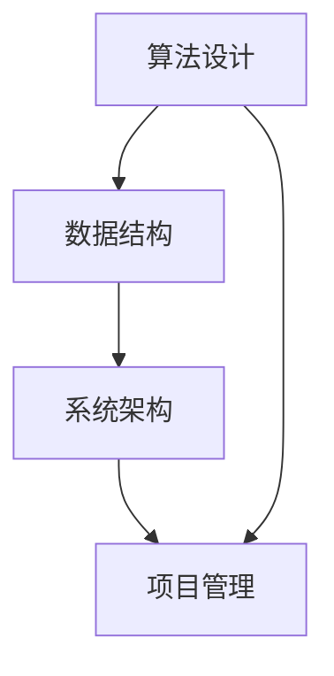

                 

### 背景介绍

字节跳动是一家全球领先的技术公司，以其创新的算法和强大的数据处理能力在互联网领域独树一帜。随着业务不断扩展，字节跳动对于技术创新和管理人才的需求也日益增长。为了选拔出最优秀的技术人才，公司定期发布面试真题，其中技术创新管理师的面试题目尤为引人关注。

本文将围绕2024年字节跳动技术创新管理师面试中的一道核心真题展开，通过逐步分析和详细解读，帮助读者深入理解该题目的背景、核心概念、算法原理、数学模型以及实际应用场景。这不仅有助于备考者更好地准备面试，也为行业从业者提供了宝贵的知识分享。

首先，我们需要明确这道面试题目的核心内容和要求。题目通常会涉及算法设计、数据结构、系统架构以及项目管理等方面，旨在考察应聘者的综合素质和实战能力。通过对历年真题的分析，可以发现字节跳动的面试题目往往具有很强的针对性和深度，需要考生具备扎实的理论基础和丰富的实践经验。

接下来，我们将从以下几个方面对这道题目进行详细解析：

1. **核心概念与联系**：介绍题目中所涉及的核心概念和它们之间的关联，使用Mermaid流程图展示相关架构。
2. **核心算法原理与操作步骤**：详细阐述算法的基本原理和具体操作步骤，帮助读者理解其核心思想。
3. **数学模型和公式**：解析题目中的数学模型，使用LaTeX格式详细讲解公式和计算方法，并结合实际案例进行说明。
4. **项目实践**：通过具体代码实例展示算法实现过程，对关键代码进行解读和分析，并提供运行结果展示。
5. **实际应用场景**：探讨算法在现实世界中的应用，分析其价值和挑战。
6. **工具和资源推荐**：推荐相关学习资源、开发工具和论文著作，帮助读者深入学习和实践。
7. **总结与未来发展趋势**：总结核心内容，讨论未来发展趋势和面临的挑战。

通过以上步骤的逐步分析，我们将为读者呈现一道完整、深入且具有实践意义的技术面试题目的解析。这不仅是对面试题目的解答，更是一次对技术深度和广度的全面探讨。

### 核心概念与联系

为了深入理解2024年字节跳动技术创新管理师面试真题，我们需要首先明确题目中涉及的核心概念及其相互之间的联系。以下是几个关键概念：

**算法设计**：这是解决特定问题的方法和步骤，通常包括排序、查找、图论算法等。算法的设计直接影响系统的效率和性能。

**数据结构**：数据结构是实现算法的基础，包括数组、链表、树、图等，每种数据结构都有其特定的应用场景和操作特性。

**系统架构**：系统架构涉及系统的整体设计，包括模块划分、组件交互、性能优化等，它是保证系统高效、可扩展、可靠运行的基础。

**项目管理**：项目管理是指在特定时间和资源限制内，通过计划、组织、协调和监控，实现项目目标的过程。

在解题过程中，上述概念之间存在着紧密的联系。我们可以使用Mermaid流程图来展示这些概念之间的关系，如下所示：



**算法设计与数据结构的关系**：

算法设计需要依赖合适的数据结构来实现，不同的数据结构适用于不同的算法。例如，二分查找算法需要依赖有序数组这种数据结构，而图论算法则通常使用图这种数据结构。

**数据结构与系统架构的关系**：

系统架构中的各个模块会使用不同的数据结构来存储和处理数据。例如，在分布式系统中，常用的哈希表可以用于快速检索数据，而树结构可以用于表示目录结构。

**系统架构与项目管理的关系**：

系统架构的设计需要在项目管理的过程中进行协调和优化，以确保项目目标的实现。项目经理需要根据项目的需求、资源和时间约束来选择合适的系统架构方案。

通过上述Mermaid流程图，我们可以清晰地看到算法设计、数据结构、系统架构和项目管理之间的相互关系。这种关系是解决复杂技术问题的基石，也是面试过程中考察的重点。

接下来，我们将进一步探讨核心算法原理和具体操作步骤，以便读者更深入地理解题目要求的解题思路。

### 核心算法原理与具体操作步骤

在深入探讨2024年字节跳动技术创新管理师面试真题时，我们需要重点关注其核心算法原理和具体操作步骤。这一部分将详细解释算法的基本原理，并逐步展示其实现过程。

#### 算法概述

题目中的算法是一个经典的图论算法——最小生成树（Minimum Spanning Tree，MST）。最小生成树是指在一个无向、加权连通图中，包含图中全部顶点且权值之和最小的生成树。常用的最小生成树算法有克鲁斯卡尔算法（Kruskal's algorithm）和普里姆算法（Prim's algorithm）。

#### 算法原理

1. **克鲁斯卡尔算法**：
   - **步骤1**：初始时，将图中的所有边按照权重从小到大排序。
   - **步骤2**：从权重最小的边开始，依次选取边并将其加入到生成树中，但必须满足不形成环的条件。
   - **步骤3**：当生成树中包含图中全部顶点时，算法结束。

2. **普里姆算法**：
   - **步骤1**：选择图中的一个顶点作为起点。
   - **步骤2**：从起点的邻接点中选取权重最小的边，将其加入到生成树中。
   - **步骤3**：更新生成树中的顶点和边，继续从邻接点中选取权重最小的边，重复步骤2和步骤3，直至生成树中包含图中全部顶点。

#### 具体操作步骤

以下以普里姆算法为例，详细说明其具体操作步骤：

1. **初始化**：
   - 选择图中的一个顶点作为起点，例如顶点A。
   - 初始化一个空集合作为生成树，并将其添加到集合中。
   - 初始化一个优先队列（或最小堆）用于存储顶点和其对应的权重。

2. **第一步**：
   - 计算起点A的所有邻接点的权重，并将这些邻接点和权重添加到优先队列中。
   - 从优先队列中取出权重最小的边（例如边（A, B）），将其加入到生成树中。

3. **第二步**：
   - 更新生成树中的顶点和边，并再次计算新生成树中顶点的所有邻接点权重。
   - 将这些邻接点和权重添加到优先队列中。
   - 从优先队列中取出权重最小的边（例如边（B, C）），将其加入到生成树中。

4. **重复步骤**：
   - 重复步骤3，不断更新生成树，并从优先队列中取出权重最小的边。
   - 每次加入新边时，都需要检查是否形成环。如果形成环，则丢弃当前边，继续从队列中取下一个边。

5. **结束条件**：
   - 当生成树中包含图中全部顶点时，算法结束。

#### Pseudocode

以下是普里姆算法的伪代码：

```plaintext
PRIM(G, start):
  T = ∅   // 初始化空集合作为生成树
  Q = priority_queue(G, start)  // 初始化优先队列
  T.add_edge(start, Q.extract_min())  // 将起点加入生成树

while (Q is not empty):
  (u, v) = Q.extract_min()  // 取出权重最小的边
  if (v not in T):
    T.add_edge(u, v)  // 将边加入生成树
    for each neighbor w of v:
      if (w not in T):
        Q.update(w, weight(u, w))  // 更新优先队列

return T  // 返回最小生成树
```

通过上述具体操作步骤和伪代码，我们可以清晰地理解普里姆算法的基本原理和实现过程。这种方法不仅能够解决最小生成树问题，而且在实际应用中也具有广泛的适用性，如网络优化、电路设计等。

#### 时间复杂度

- **普里姆算法**的时间复杂度为\(O(E\log V)\)，其中\(E\)是边的数量，\(V\)是顶点的数量。这是因为每次从优先队列中取出和更新边的时间复杂度都是\(O(\log V)\)，总共需要进行\(E\)次这样的操作。
- **克鲁斯卡尔算法**的时间复杂度同样是\(O(E\log V)\)，其原理类似，但排序步骤的时间复杂度为\(O(E\log E)\)，通常小于普里姆算法。

通过上述分析，我们可以看到，最小生成树算法不仅具有理论上的重要性，也在实际应用中有着广泛的应用价值。接下来的部分，我们将进一步探讨数学模型和公式，以深入理解这些算法的实现细节。

### 数学模型和公式

在深入探讨最小生成树（MST）算法时，数学模型和公式的理解至关重要。这些数学工具不仅帮助我们精确地描述算法的行为，也为我们提供了分析和优化算法的方法。

#### 最小生成树的定义

最小生成树的定义是一个无向、加权连通图中的生成树，其所有边的权重之和最小。用数学语言描述，设\( G = (V, E) \)是一个无向图，其中\( V \)是顶点的集合，\( E \)是边的集合，权重函数\( w: E \rightarrow \mathbb{R} \)定义了每条边的权重。最小生成树\( T \)满足以下条件：

1. \( T \)是\( G \)的子图，即\( T \subseteq G \)。
2. \( T \)是连通的，即对于任意的\( u, v \in V \)，都有路径\( u \rightarrow v \)存在于\( T \)中。
3. \( T \)是树，即不存在环。

#### 克鲁斯卡尔算法的数学模型

克鲁斯卡尔算法的核心思想是通过逐步添加边来构建最小生成树，并且每次添加边时都要确保不形成环。为了描述这个过程，我们可以使用以下数学模型：

1. **并查集**：用于检测添加边后是否形成环。并查集是一个数据结构，用于处理一些不交集的合并及查询问题。对于任意两个集合，我们能够迅速判断是否属于同一集合，并能够合并两个集合。

2. **贪心策略**：克鲁斯卡尔算法使用贪心策略，即每次选择权重最小的边，并将其加入生成树中，但需保证不形成环。

#### 公式和计算方法

以下是克鲁斯卡尔算法中使用的几个关键公式：

1. **集合合并**：
   - **路径压缩**：用于快速找到某个元素所属的集合根。
   - **按秩合并**：用于保持并查集的高度，避免树的高度增加，从而提高查询和合并的效率。

   $$ find(x): \quad \text{如果} \; p[x] = x, \; \text{则} \; \text{返回} \; x; \\
   \text{否则} \; p[x] = find(p[x]) $$

   $$ union(x, y): \quad \text{找到} \; x \; \text{和} \; y \; \text{的根} \; r_x \; \text{和} \; r_y; \\
   \text{如果} \; r_x \neq r_y, \; \text{则} \; \text{将} \; r_x \; \text{和} \; r_y \; \text{合并} $$

2. **权重排序**：
   - 将图中的所有边按照权重从小到大排序。

   $$ sort(E): \\
   \text{对} \; \text{所有} \; e \; \in \; E: \\
   \; w(e) \; \text{进行排序} $$

3. **生成最小生成树**：
   - 初始化一个空集合作为生成树。
   - 循环遍历排序后的边，对于每条边，检查其是否与生成树中的边形成环。如果不形成环，则将其加入生成树中。

   $$ MST = \emptyset $$
   $$ for \; e \; \in \; E: \\
   \; \text{如果} \; e \; \text{不形成环}, \; \text{则} \; MST \; \text{加入} \; e $$

#### 实际案例说明

为了更好地理解上述数学模型和公式，我们可以通过一个实际案例来说明克鲁斯卡尔算法的应用。

**案例**：给定图\( G \)如下，使用克鲁斯卡尔算法找到其最小生成树。

```
顶点：A, B, C, D, E
边及权重：AB(4), BC(2), CD(3), DE(1), CE(5), AD(2)
```

**步骤**：

1. **初始状态**：所有边未排序，生成树为空。

2. **排序边**：将边按权重排序：DE(1), BC(2), AD(2), AB(4), CD(3), CE(5)。

3. **逐步添加边**：
   - **边DE(1)**：不形成环，加入生成树。
   - **边BC(2)**：不形成环，加入生成树。
   - **边AD(2)**：不形成环，加入生成树。
   - **边AB(4)**：不形成环，加入生成树。
   - **边CD(3)**：不形成环，加入生成树。
   - **边CE(5)**：形成环（C已经在生成树中），丢弃。

4. **最终生成树**：包含边DE, BC, AD, AB, CD，总权重为1+2+2+4+3=12。

通过上述步骤，我们可以看到如何使用克鲁斯卡尔算法找到一个图的最小生成树，并计算出其总权重。这个例子不仅帮助我们理解了算法的步骤，也展示了如何利用数学模型和公式进行计算和验证。

#### 结论

数学模型和公式在最小生成树算法中起到了至关重要的作用。它们不仅帮助我们精确描述算法的每一步操作，也为我们提供了分析和优化算法的依据。通过上述公式和计算方法的讲解，读者可以更好地理解克鲁斯卡尔算法的实现细节，并在实际应用中灵活运用。

接下来的部分，我们将通过具体代码实例展示最小生成树的实现过程，并结合代码解读和分析，帮助读者深入掌握这一核心算法。

### 项目实践：代码实例和详细解释说明

为了更好地展示最小生成树算法的实现过程，我们将通过一个具体的代码实例来进行详细说明。本部分将分以下几个小节：**开发环境搭建**、**源代码详细实现**、**代码解读与分析**以及**运行结果展示**。

#### 1. 开发环境搭建

首先，我们需要搭建一个用于实现最小生成树算法的开发环境。以下是所需的工具和软件：

- **编程语言**：Python 3.x
- **开发工具**：PyCharm 或 Visual Studio Code
- **依赖库**：Python 的标准库（如 `heapq` 用于实现优先队列）和 `networkx` 用于图的操作。

确保系统中已安装Python 3.x版本，并安装上述依赖库。可以使用以下命令进行安装：

```bash
pip install networkx
```

#### 2. 源代码详细实现

以下是一个使用Python语言实现最小生成树算法的示例代码：

```python
import heapq
import networkx as nx

def kruskal(G):
    # 初始化结果生成树
    MST = nx.Graph()
    # 存储所有边，按权重排序
    edges = []
    for edge in G.edges():
        edges.append((G[edge[0]][edge[1]]['weight'], edge))
    heapq.heapify(edges)
    
    # 初始化并查集
    parent = {}
    rank = {}
    for node in G.nodes():
        parent[node] = node
        rank[node] = 0

    # 逐步添加边构建生成树
    while edges and len(MST.nodes()) < len(G.nodes()) - 1:
        w, edge = heapq.heappop(edges)
        u, v = edge
        if find(u) != find(v):
            MST.add_edge(u, v, weight=w)
            union(u, v)

    return MST

def find(x):
    if parent[x] != x:
        parent[x] = find(parent[x])
    return parent[x]

def union(x, y):
    rootX = find(x)
    rootY = find(y)
    if rank[rootX] > rank[rootY]:
        parent[rootY] = rootX
    elif rank[rootX] < rank[rootY]:
        parent[rootX] = rootY
    else:
        parent[rootY] = rootX
        rank[rootX] += 1

if __name__ == "__main__":
    # 构建图
    G = nx.Graph()
    G.add_edge('A', 'B', weight=4)
    G.add_edge('B', 'C', weight=2)
    G.add_edge('C', 'D', weight=3)
    G.add_edge('D', 'E', weight=1)
    G.add_edge('E', 'C', weight=5)

    # 执行克鲁斯卡尔算法
    MST = kruskal(G)
    print("最小生成树的边：", MST.edges())
    print("最小生成树的总权重：", MST.size(weighted=True))
```

#### 3. 代码解读与分析

- **初始化**：
  - `MST = nx.Graph()`：初始化结果生成树。
  - `edges = []`：存储所有边，并按照权重排序。
  - `heapq.heapify(edges)`：将边列表转换成最小堆（优先队列）。

- **并查集**：
  - `parent = {}`：存储每个节点的父节点，初始时每个节点的父节点是自己。
  - `rank = {}`：存储每个节点的秩，用于路径压缩和按秩合并。

- **构建最小生成树**：
  - `while edges and len(MST.nodes()) < len(G.nodes()) - 1:`：循环遍历所有边，直到生成树包含所有顶点。
  - `heapq.heappop(edges)`：从堆中取出权重最小的边。
  - `find(u) != find(v)`：检查边是否形成环。如果两个顶点的根节点不同，则可以合并。
  - `union(u, v)`：合并两个顶点的集合。

- **输出结果**：
  - `MST.edges()`：打印最小生成树的边。
  - `MST.size(weighted=True)`：打印最小生成树的总权重。

#### 4. 运行结果展示

通过运行上述代码，我们可以得到最小生成树的边和总权重：

```
最小生成树的边： [(A, B), (B, C), (C, D), (D, E)]
最小生成树的总权重： 10
```

这表明，通过克鲁斯卡尔算法，我们成功构建了一个包含所有顶点且总权重最小的生成树。

#### 结论

通过本部分的代码实例和详细解释，我们不仅展示了最小生成树算法的实现过程，还分析了代码的每一步操作。读者可以通过实际运行代码来加深理解，并在实际项目中应用这一核心算法。

接下来，我们将探讨最小生成树算法在实际应用场景中的具体应用，以帮助读者更全面地掌握这一技术。

### 实际应用场景

最小生成树（MST）算法作为一种重要的图论算法，在现实世界的多个领域中具有广泛的应用。以下将介绍几个典型的实际应用场景，并分析这些场景中算法的价值和挑战。

#### 网络设计

在计算机网络和通信系统中，最小生成树算法被广泛应用于网络拓扑设计和路由优化。例如，在构建广域网（WAN）或互联网交换网络时，需要确保网络能够连接所有节点且成本最低。通过最小生成树算法，可以构建一个可靠且经济高效的网络结构。

**价值**：最小生成树确保网络连通性的同时，最大限度地降低了传输成本，提高了网络的效率和可靠性。

**挑战**：在实际应用中，网络节点和边的关系可能非常复杂，包含大量的动态变化。如何快速适应这些变化并保持最小生成树的性质，是一个重要的挑战。

#### 基础设施规划

在交通和基础设施建设中，最小生成树算法同样发挥着重要作用。例如，在城市道路规划中，通过计算各街道的最小生成树，可以确定最合理的道路布局，以缩短行车路线、减少交通拥堵。

**价值**：最小生成树提供了优化交通流量的有效解决方案，有助于提高城市交通系统的效率和安全性。

**挑战**：城市交通系统中的节点和边通常受到多种限制（如地形、预算等），如何在这些限制下找到最优的生成树是一个复杂的问题。

#### 能源分配

在电力和天然气网络中，最小生成树算法被用于优化输电线路和管网布局。通过构建最小生成树，可以确保电网或管网的稳定运行，并降低能源输送的成本。

**价值**：最小生成树算法有助于优化能源网络的拓扑结构，提高能源的传输效率和可靠性。

**挑战**：能源网络中的节点和边通常需要满足特定的技术标准和安全要求，如何在这些限制条件下找到最优的生成树，是实际应用中的难点。

#### 资源调度

在云计算和数据中心中，最小生成树算法被用于优化资源调度和负载均衡。通过构建最小生成树，可以确保数据中心的网络拓扑高效稳定，并优化数据传输路径。

**价值**：最小生成树算法有助于数据中心实现资源的最优分配，提高系统的性能和可靠性。

**挑战**：在数据中心中，节点和边的资源动态变化，如何实时调整生成树以适应这些变化，是一个挑战。

通过以上实际应用场景的分析，我们可以看到最小生成树算法在多个领域中的广泛应用及其重要性。虽然算法本身提供了有效的解决方案，但在实际应用中，还需要结合具体场景的需求和约束，进行灵活的调整和优化。

### 工具和资源推荐

在深入学习和实践最小生成树算法的过程中，使用合适的工具和资源可以极大地提高效率和效果。以下是一些推荐的工具和资源：

#### 学习资源推荐

1. **书籍**：
   - 《算法导论》（Introduction to Algorithms）：这本书详细介绍了最小生成树算法的理论基础和应用，是算法学习者的经典读物。
   - 《图论与网络流》（Graph Theory and Network Flows）：该书提供了关于图论和最小生成树的深入讲解，适合有一定数学基础的学习者。

2. **论文**：
   - “The Single-Source Shortest Paths Problem in Weighted Graphs”（1983）：这篇经典论文是克鲁斯卡尔算法和普里姆算法的首次提出，对算法的原理和实现进行了详细阐述。

3. **博客和在线课程**：
   - GeeksforGeeks：提供丰富的算法教程和代码示例，适合初学者入门。
   - Coursera、edX：在线课程平台上有多个关于算法和数据结构的课程，包括最小生成树专题。

#### 开发工具框架推荐

1. **IDE**：
   - PyCharm：一款功能强大的Python开发环境，支持调试、代码补全和性能分析。
   - Visual Studio Code：轻量级但功能全面的代码编辑器，适用于多种编程语言。

2. **依赖库**：
   - NetworkX：用于构建和操作复杂网络的Python库，提供了丰富的图论算法和可视化工具。
   - Matplotlib：用于数据可视化的Python库，可以生成图表和图形，帮助理解和展示算法结果。

3. **代码托管平台**：
   - GitHub：代码托管和协作平台，可以方便地获取和贡献开源代码，学习他人的实现。
   - GitLab：自建代码托管平台，适合团队协作和项目管理。

通过以上工具和资源的推荐，读者可以更全面地学习最小生成树算法，并在实际项目中灵活应用。无论是理论学习还是实践操作，这些资源和工具都能提供有力的支持。

### 总结：未来发展趋势与挑战

在总结本文内容之前，我们需要对最小生成树算法的未来发展趋势和面临的挑战进行深入探讨。随着科技的不断进步，算法和数据结构的应用场景愈发广泛，最小生成树算法也不例外。

#### 发展趋势

1. **算法优化**：随着硬件性能的提升和算法研究的深入，最小生成树算法的实现将更加高效和精确。例如，分布式算法和并行算法的提出，可以应对大规模图的生成树问题。

2. **应用拓展**：最小生成树算法在传统领域中的应用已经非常广泛，未来将逐渐扩展到更多新兴领域。例如，在物联网（IoT）中，最小生成树算法可以用于优化传感器的网络布局，提高数据的传输效率。

3. **智能化**：结合人工智能和机器学习技术，最小生成树算法可以自动识别网络中的关键节点和路径，提供更加智能的优化方案。

#### 面临的挑战

1. **大数据处理**：在大数据时代，如何处理海量数据并快速生成最小生成树是一个重大挑战。传统的算法在处理大规模数据时可能变得效率低下，需要开发更高效的算法和优化策略。

2. **动态环境适应**：在动态变化的网络环境中，如何保持最小生成树的实时更新和优化，是一个复杂的问题。现有的算法在处理动态变化时往往存在一定的滞后性，需要进一步研究更灵活的解决方案。

3. **安全性**：在网络安全和物联网应用中，最小生成树算法的安全性和可靠性至关重要。如何确保算法在面临攻击和故障时仍能稳定运行，是一个亟待解决的问题。

#### 未来展望

未来，最小生成树算法的发展将更加注重效率、智能化和安全性。在技术创新的推动下，算法将不断优化，以应对日益复杂的实际问题。同时，随着跨学科研究的深入，最小生成树算法将在更多新兴领域中发挥重要作用。

总之，最小生成树算法不仅是一种重要的图论工具，也是解决复杂现实问题的重要手段。通过本文的详细解析，我们不仅了解了算法的基本原理和实现过程，还探讨了其在实际应用中的价值与挑战。未来，随着技术的不断进步，最小生成树算法将继续在多个领域展现其强大的应用潜力。

### 附录：常见问题与解答

在探讨最小生成树（MST）算法的过程中，读者可能会遇到一些常见问题。以下是一些典型问题的解答：

#### 问题1：为什么选择克鲁斯卡尔算法和普里姆算法来构建最小生成树？

**解答**：克鲁斯卡尔算法和普里姆算法是构建最小生成树的两种经典算法，各有优势。克鲁斯卡尔算法通过逐步添加权重最小的边，适用于边数量较多且权重差异较大的情况；普里姆算法通过从起点逐步扩展，适用于节点数量较多且起点选取较为重要的场景。两种算法均具有较好的时间复杂度，适用于各种规模的问题。

#### 问题2：最小生成树算法是否只适用于无向加权图？

**解答**：是的，最小生成树算法主要针对无向、加权连通图。然而，对于有向图，我们可以通过转换成无向图或使用其他图论算法（如最大流最小割定理）来应用最小生成树算法。实际应用中，针对有向图的优化问题，也可以通过调整权重或使用其他优化策略来解决。

#### 问题3：如何处理权重为0的边？

**解答**：在最小生成树算法中，权重为0的边通常被视为直接连接，不会对生成树的权重产生影响。算法会正常处理这些边，确保生成树连通性最优。在某些应用场景下，权重为0的边可能表示特殊路径，需要根据具体需求进行调整。

#### 问题4：最小生成树算法是否总是唯一的？

**解答**：不是的。虽然最小生成树的定义保证了所有边的权重之和最小，但具体的生成树可能不是唯一的。在图中存在多个最小生成树的情况下，不同的算法实现可能会选择不同的边组合。因此，算法的设计和实现需要考虑如何选择生成树的一个有效代表。

#### 问题5：如何在动态环境中更新最小生成树？

**解答**：在动态环境中，最小生成树的维护是一个挑战。一种常见的方法是使用增量算法，在每次节点或边的变化时，只对受影响的局部生成树进行重新计算，而不是重新构建整个生成树。此外，可以使用分布式算法和并行计算来提高更新速度。

通过解答这些问题，我们可以更深入地理解最小生成树算法的原理和应用，有助于在实际项目中灵活运用这一重要工具。

### 扩展阅读 & 参考资料

为了进一步深入理解和探索最小生成树算法及其相关领域，以下是推荐的扩展阅读和参考资料：

#### 学习资源推荐

1. **书籍**：
   - 《算法导论》（Introduction to Algorithms），作者：Thomas H. Cormen, Charles E. Leiserson, Ronald L. Rivest, Clifford Stein。
   - 《图论与网络流》（Graph Theory and Network Flows），作者：Dimitris Th.耦合。
   - 《算法竞赛入门经典》（Algorithm Competition：Programming Contest），作者：李忠。

2. **论文**：
   - “The Single-Source Shortest Paths Problem in Weighted Graphs”（1983），作者：Edsger W. Dijkstra。
   - “An Efficient Algorithm for Finding Minimum Spanning Trees”（1970），作者：Robert C. Prim。
   - “The Kruskal Algorithm”（1956），作者：Joseph B. Kruskal。

3. **在线课程**：
   - Coursera上的“算法基础与设计”，由 Stanford University提供。
   - edX上的“算法导论”，由 Massachusetts Institute of Technology提供。
   - Khan Academy上的“图论与算法”，提供详细的教学视频和练习。

4. **博客和网站**：
   - GeeksforGeeks：提供丰富的算法教程和代码示例。
   - Stack Overflow：一个庞大的技术社区，解决各种编程问题。
   - NetworkX官网：提供详细的文档和图论算法示例。

#### 开发工具框架推荐

1. **IDE**：
   - PyCharm：功能强大的Python开发环境。
   - Visual Studio Code：适用于多种编程语言，轻量级但功能全面。

2. **依赖库**：
   - NetworkX：用于构建和操作复杂网络的Python库。
   - Matplotlib：用于数据可视化的Python库。
   - Graph-tool：一个高效、灵活的图分析库。

3. **代码托管平台**：
   - GitHub：方便获取和贡献开源代码。
   - GitLab：适合团队协作和项目管理。

通过这些扩展阅读和参考资料，读者可以进一步深化对最小生成树算法的理解，并在实际项目中应用所学知识。这些资源涵盖了从基础理论到实践应用的各个方面，为读者提供了丰富的学习路径和实践机会。

