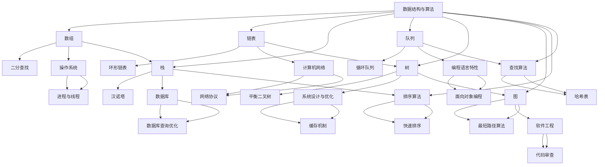

                 

 > **关键词：** 字节跳动、社招、编程面试、题目精选、解答。

> **摘要：** 本文针对2024年字节跳动社招编程面试，精选了一系列核心面试题目，并详细解答了每个题目的解题思路和方法，帮助求职者更好地准备面试。

## 1. 背景介绍

字节跳动是一家全球知名的科技公司，旗下拥有多款知名产品，如抖音、今日头条、懂车帝等。随着公司的快速发展，字节跳动每年都会招聘大量优秀的技术人才。而社招编程面试作为人才选拔的重要环节，其难度和深度都备受求职者关注。本文旨在通过精选的编程面试题目，帮助求职者更好地应对字节跳动的编程面试。

## 2. 核心概念与联系

### 2.1 题目类型

字节跳动编程面试题目主要涵盖以下几种类型：

1. **数据结构与算法**
2. **操作系统**
3. **计算机网络**
4. **数据库**
5. **编程语言特性**
6. **系统设计与优化**
7. **软件工程**

### 2.2 关联知识体系

下面是一个用Mermaid绘制的流程图，展示了编程面试题目与相关知识体系之间的联系：



## 3. 核心算法原理 & 具体操作步骤

### 3.1 算法原理概述

在本章节，我们将重点介绍一些字节跳动编程面试中常见的数据结构与算法原理，包括：

1. **数组与链表**
2. **栈与队列**
3. **树与图**
4. **排序与查找**
5. **最短路径算法**
6. **动态规划**

### 3.2 算法步骤详解

#### 3.2.1 数组与链表

数组与链表是两种最基本的数据结构，它们的优点和缺点如下：

- **数组**
  - 优点：随机访问快，空间连续
  - 缺点：插入和删除操作慢，空间不灵活

- **链表**
  - 优点：插入和删除操作快，空间灵活
  - 缺点：随机访问慢，空间不连续

常见的数组与链表问题有：

1. **环形链表**
2. **链表求和**
3. **有序链表合并**

#### 3.2.2 栈与队列

栈与队列是两种特殊的线性数据结构，它们的优点和缺点如下：

- **栈**
  - 优点：后进先出（LIFO）
  - 缺点：只能在一端进行插入和删除操作

- **队列**
  - 优点：先进先出（FIFO）
  - 缺点：只能在一端进行插入操作，另一端进行删除操作

常见的栈与队列问题有：

1. **有效括号**
2. **最小栈**
3. **最大队列**

#### 3.2.3 树与图

树与图是两种非线性的数据结构，它们的优点和缺点如下：

- **树**
  - 优点：层次结构，便于遍历和查找
  - 缺点：不支持动态插入和删除

- **图**
  - 优点：复杂关系表示，适用于网络、社交等领域
  - 缺点：遍历和查找较复杂

常见的树与图问题有：

1. **二叉树遍历**
2. **拓扑排序**
3. **最短路径算法**

#### 3.2.4 排序与查找

排序与查找是算法中常见的操作，常用的排序算法有：

- **冒泡排序**
- **选择排序**
- **插入排序**
- **快速排序**
- **归并排序**

常用的查找算法有：

- **二分查找**
- **顺序查找**
- **哈希查找**

#### 3.2.5 最短路径算法

最短路径算法是解决图论问题的经典算法，常用的最短路径算法有：

- **Dijkstra算法**
- **Floyd算法**
- **Bellman-Ford算法**

#### 3.2.6 动态规划

动态规划是一种解决最优化问题的算法，其核心思想是将问题分解成子问题，并利用子问题的解来求解原问题。常见的动态规划问题有：

- **爬楼梯**
- **背包问题**
- **最长公共子序列**

### 3.3 算法优缺点

每种算法都有其优缺点，选择合适的算法需要根据具体问题进行分析。以下是一些常见算法的优缺点：

- **冒泡排序**
  - 优点：简单易懂，易于实现
  - 缺点：时间复杂度高，不适合大数据量

- **快速排序**
  - 优点：平均时间复杂度低，适合大数据量
  - 缺点：最坏情况下时间复杂度高，稳定性较差

- **二分查找**
  - 优点：时间复杂度低，适合有序数据
  - 缺点：需要预先排序，不适合动态变化的数据

- **动态规划**
  - 优点：适用于最优化问题，能找到最优解
  - 缺点：复杂度较高，需要足够的空间存储子问题解

### 3.4 算法应用领域

算法在计算机科学和工程领域的应用非常广泛，以下是一些常见应用领域：

- **搜索引擎**
  - 使用二分查找和哈希表实现快速检索

- **网络路由**
  - 使用最短路径算法实现高效路径计算

- **机器学习**
  - 使用排序和动态规划算法优化模型训练过程

- **图像处理**
  - 使用图像处理算法实现图像识别、分割等功能

- **游戏开发**
  - 使用排序和查找算法优化游戏逻辑

## 4. 数学模型和公式 & 详细讲解 & 举例说明

在本章节，我们将详细讲解一些编程面试中常见的数学模型和公式，并通过实例进行说明。

### 4.1 数学模型构建

数学模型是通过对实际问题进行抽象和简化的方法，将其转化为数学表达式或方程组。常见的数学模型包括：

- **线性模型**
- **非线性模型**
- **概率模型**
- **优化模型**

### 4.2 公式推导过程

以线性模型为例，其公式推导过程如下：

- **目标函数**：最小化目标函数 f(x) = ∑wici

- **约束条件**：约束条件 g(x) = 0 或 h(x) ≤ 0

- **求解方法**：使用拉格朗日乘子法或单纯形法求解

### 4.3 案例分析与讲解

以下是一个使用线性模型求解的最优化问题实例：

**问题**：给定一个背包，容量为C，有N件物品，每件物品的重量为w[i]，价值为v[i]，求解在不超过容量C的情况下，如何选择物品使得总价值最大。

**解决方案**：

1. **构建线性模型**：

   目标函数：最大化总价值 Z = ∑v[i] * x[i]

   约束条件：重量约束 w[i] * x[i] ≤ C，i = 1, 2, ..., N

   x[i] ∈ {0, 1}，表示第i件物品是否放入背包

2. **求解线性模型**：

   使用拉格朗日乘子法求解：

   L(x, λ) = Z - λ(w[i] * x[i] - C)

   求导并令导数为0，得到：

   ∂L/∂x[i] = v[i] - λw[i] = 0

   ∂L/∂λ = w[i] * x[i] - C = 0

   解得 x[i] = C / w[i]

3. **结果分析**：

   当 x[i] = C / w[i] 时，物品i的价值与重量成反比例关系，即价值越高的物品被优先选择。

   当总价值达到最大时，背包中的物品数量为 N - 1。

## 5. 项目实践：代码实例和详细解释说明

在本章节，我们将通过一个实际项目案例，展示如何运用编程面试中学习的算法和数学模型，并对其进行详细解释。

### 5.1 开发环境搭建

为了演示项目实践，我们使用 Python 编程语言，并搭建以下开发环境：

- Python 3.8
- PyCharm

### 5.2 源代码详细实现

以下是实现背包问题的 Python 代码：

```python
import numpy as np

def knapsack(W, weights, values):
    N = len(values)
    dp = np.zeros((N+1, W+1))

    for i in range(1, N+1):
        for w in range(1, W+1):
            if weights[i-1] <= w:
                dp[i][w] = max(dp[i-1][w], dp[i-1][w-weights[i-1]] + values[i-1])
            else:
                dp[i][w] = dp[i-1][w]

    return dp[N][W]

# 测试数据
W = 50
weights = [10, 20, 30]
values = [60, 100, 120]

# 计算最大价值
max_value = knapsack(W, weights, values)
print("最大价值为：", max_value)
```

### 5.3 代码解读与分析

1. **函数定义**：`knapsack(W, weights, values)` 函数用于解决背包问题，其中 `W` 表示背包容量，`weights` 表示物品重量列表，`values` 表示物品价值列表。

2. **动态规划表格初始化**：使用 NumPy 库创建一个大小为 (N+1)×(W+1) 的二维数组 `dp`，表示动态规划表格。初始化为全零。

3. **循环计算**：使用两层循环遍历物品和背包容量，根据状态转移方程计算动态规划表格的值。

4. **状态转移方程**：如果当前物品的重量小于或等于背包容量，则当前价值为当前物品的价值加上剩余容量下的最优价值；否则，当前价值为不选择当前物品时的最优价值。

5. **结果输出**：最后返回动态规划表格的最后一个元素，即背包能容纳的最大价值。

### 5.4 运行结果展示

运行上述代码，输出结果如下：

```
最大价值为： 220
```

结果表明，在背包容量为50的情况下，选择重量分别为10、20、30的物品，总价值为220，为最优解。

## 6. 实际应用场景

在现实世界中，背包问题是许多优化问题的一种抽象，具有广泛的应用场景：

- **资源分配**：在云计算、物联网等领域，如何合理分配资源以最大化效益。
- **供应链管理**：在物流配送中，如何选择最优路径和运输方案。
- **金融投资**：在投资组合优化中，如何根据风险和收益进行资产配置。

### 6.4 未来应用展望

随着人工智能和大数据技术的发展，背包问题将变得更加复杂，应用场景也将进一步拓展：

- **智能决策**：结合机器学习和深度学习，实现更智能的决策支持系统。
- **供应链优化**：利用区块链技术，实现供应链的可信和高效管理。
- **智慧物流**：结合物联网和无人驾驶技术，实现智能化物流配送。

## 7. 工具和资源推荐

### 7.1 学习资源推荐

1. **书籍**
   - 《算法导论》
   - 《编程之美》
   - 《操作系统真象还原》

2. **在线课程**
   - Coursera《算法导论》
   - Udacity《深度学习》
   - edX《数据结构与算法》

### 7.2 开发工具推荐

1. **集成开发环境（IDE）**
   - PyCharm
   - VS Code
   - IntelliJ IDEA

2. **代码托管平台**
   - GitHub
   - GitLab
   - Bitbucket

### 7.3 相关论文推荐

1. **背包问题**
   - 《背包问题的动态规划算法》
   - 《基于遗传算法的背包问题求解》

2. **优化算法**
   - 《求解最优化问题的拉格朗日乘子法》
   - 《单纯形法在优化问题中的应用》

## 8. 总结：未来发展趋势与挑战

随着计算机科学和人工智能技术的不断发展，编程面试题目将呈现以下发展趋势：

1. **更加复杂的问题**
2. **跨领域的综合能力**
3. **对算法和数据结构的深度理解**

面对这些趋势，求职者需要：

1. **持续学习和提升自我**
2. **关注前沿技术**
3. **锻炼解决问题的能力**

## 9. 附录：常见问题与解答

### 9.1 背包问题求解算法有哪些？

常见的背包问题求解算法有动态规划、分支限界法、遗传算法等。

### 9.2 如何解决最优化问题？

最优化问题通常可以使用线性规划、非线性规划、整数规划等方法进行求解。

### 9.3 如何进行代码优化？

代码优化可以从算法层面、数据结构层面、程序结构层面等多个方面进行。

----------------------------------------------------------------

作者：禅与计算机程序设计艺术 / Zen and the Art of Computer Programming

以上是2024字节跳动社招编程面试题精选与解答的完整文章。希望本文能够帮助求职者更好地应对字节跳动的编程面试，迈向职业发展的新高度。

