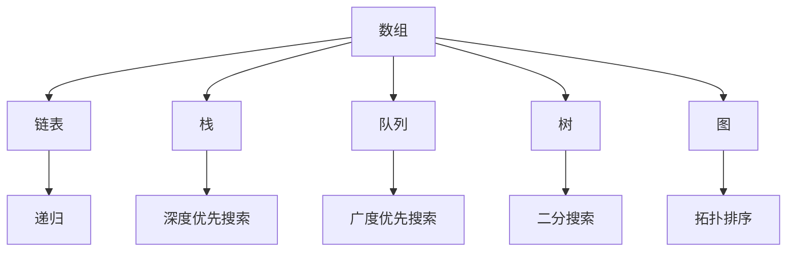
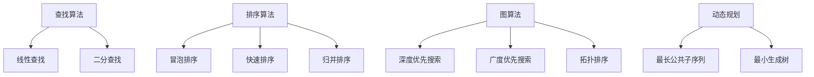
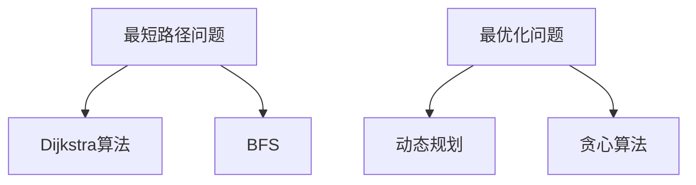
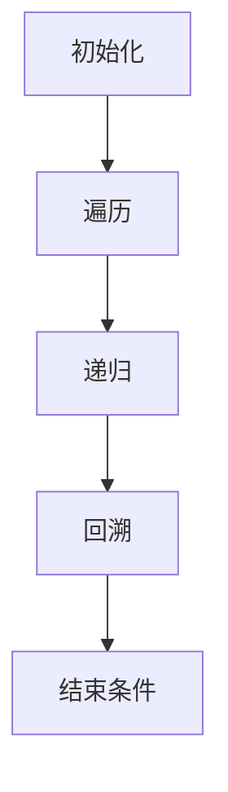
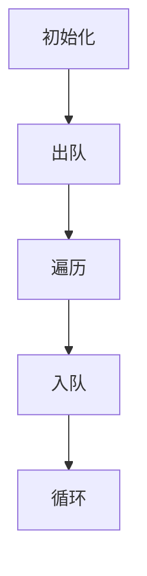
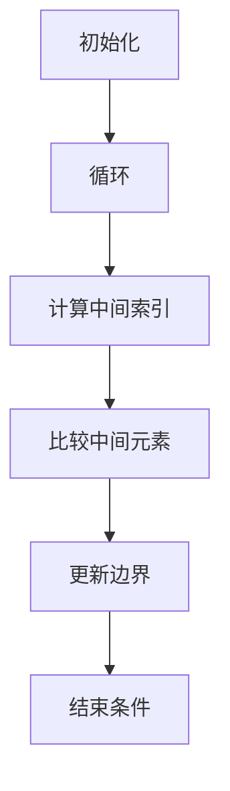

                 

### 文章标题

《2025字节跳动社招面试算法题库大全》

> 关键词：字节跳动 社招 面试 算法题库

> 摘要：本文将详细整理并分析2025年字节跳动社招面试中的经典算法题目，包括背景介绍、核心概念、算法原理、数学模型、实践案例、应用场景以及未来发展趋势。旨在为准备字节跳动面试的程序员提供全面的学习和参考资源。

### 1. 背景介绍

字节跳动（ByteDance）成立于2012年，是中国领先的互联网科技公司，以其强大的内容生态和创新的商业模式而闻名。作为全球范围内顶尖的互联网公司之一，字节跳动在招聘过程中非常重视候选人的技术能力，尤其是在算法和数据结构领域的表现。

每年的社会招聘中，字节跳动都会发布一系列的面试题库，涵盖多个技术领域，包括但不限于算法、数据结构、系统设计、数据库、网络、人工智能等。这些面试题库不仅反映了公司对于技术人才的基本要求，也为广大程序员提供了一个了解当前行业热点和技术趋势的平台。

本文将聚焦于字节跳动2025年社招面试中的算法题库，旨在帮助准备面试的程序员们掌握这些核心题目，提升解题能力，从而更好地应对字节跳动的面试挑战。文章结构如下：

- **1. 背景介绍**：对字节跳动及面试题库的背景进行简要介绍。
- **2. 核心概念与联系**：介绍面试中涉及的核心概念，并通过Mermaid流程图展示其关联关系。
- **3. 核心算法原理 & 具体操作步骤**：详细解析算法原理，并提供操作步骤。
- **4. 数学模型和公式 & 详细讲解 & 举例说明**：介绍相关数学模型，使用latex格式展示公式，并给出具体实例。
- **5. 项目实践：代码实例和详细解释说明**：提供实际代码实例，并对其进行详细解释。
- **6. 实际应用场景**：讨论算法的实际应用场景。
- **7. 工具和资源推荐**：推荐学习资源和开发工具。
- **8. 总结：未来发展趋势与挑战**：总结文章要点，展望未来趋势和挑战。
- **9. 附录：常见问题与解答**：解答读者可能遇到的问题。
- **10. 扩展阅读 & 参考资料**：提供进一步阅读的资料。

接下来，我们将逐章深入解析这些面试题库，帮助读者全面理解和掌握字节跳动面试中的算法题目。

### 2. 核心概念与联系

在深入分析字节跳动2025年社招面试中的算法题目之前，我们首先需要了解其中的核心概念。这些概念不仅涵盖了基本的算法和数据结构，还包括了高级的计算机科学理论。以下是一些重要的核心概念及其相互之间的联系。

#### 2.1 数据结构与算法

数据结构是计算机存储数据的方式，而算法是解决问题的步骤。两者密不可分，数据结构的选择往往决定了算法的效率和复杂性。常见的几种数据结构包括：

- **数组**：一个固定大小的集合，元素通过索引访问。
- **链表**：由节点组成的序列，每个节点包含数据和指向下一个节点的指针。
- **栈**：一种后进先出（LIFO）的数据结构。
- **队列**：一种先进先出（FIFO）的数据结构。
- **树**：一种层次结构，每个节点可以有零个或多个子节点。
- **图**：由节点和边组成的网络结构。

Mermaid流程图如下：



#### 2.2 算法类型

算法可以根据其性质和用途进行分类，常见的几种算法类型包括：

- **查找算法**：用于在数据结构中查找特定元素。常见的查找算法有线性查找、二分查找等。
- **排序算法**：用于对数据进行排序。常见的排序算法有冒泡排序、快速排序、归并排序等。
- **图算法**：用于解决图相关的问题。常见的图算法有深度优先搜索（DFS）、广度优先搜索（BFS）、拓扑排序等。
- **动态规划**：用于解决具有重叠子问题和最优子结构特点的问题。

Mermaid流程图如下：



#### 2.3 数学模型

算法中经常涉及数学模型，如最短路径问题、最优化问题等。数学模型的使用能够帮助我们更好地理解问题，并设计出有效的算法。以下是几个常见的数学模型：

- **最短路径问题**：给定加权图中的两个顶点，找到它们之间的最短路径。
- **最优化问题**：在满足一定约束条件下，找到最优解。

Mermaid流程图如下：



通过上述核心概念与联系的分析，我们可以更好地理解字节跳动社招面试中算法题目的背景和难点。接下来，我们将深入解析这些算法题目，并提供详细的解决方案。

### 3. 核心算法原理 & 具体操作步骤

在深入探讨字节跳动2025年社招面试中的算法题目之前，我们先来了解一些核心算法的基本原理，以及如何操作这些算法来解决具体问题。以下是几个常见的算法及其基本原理和操作步骤：

#### 3.1 深度优先搜索（DFS）

深度优先搜索是一种用于遍历或搜索树或图的算法。其基本原理是沿着一个路径走到底，然后回溯。以下是DFS的操作步骤：

1. **初始化**：选择一个起始节点，将其标记为已访问。
2. **遍历**：从起始节点开始，依次访问其未被访问的邻接节点。
3. **递归**：对于每个未被访问的邻接节点，重复步骤2。
4. **回溯**：当当前节点的所有邻接节点都被访问后，返回上一级节点，继续遍历未被访问的邻接节点。
5. **结束条件**：当所有节点都被访问后，结束搜索。

Mermaid流程图如下：



#### 3.2 广度优先搜索（BFS）

广度优先搜索是一种用于遍历或搜索树或图的算法，其基本原理是先访问起始节点的所有邻接节点，然后再访问下一层级的节点。以下是BFS的操作步骤：

1. **初始化**：选择一个起始节点，将其标记为已访问，并将该节点入队。
2. **出队**：从队列中取出当前节点。
3. **遍历**：对于当前节点的所有未被访问的邻接节点，将其标记为已访问，并加入队列。
4. **循环**：重复步骤2和步骤3，直到队列为空。

Mermaid流程图如下：



#### 3.3 二分查找

二分查找是一种用于在有序数组中查找特定元素的算法。其基本原理是不断将搜索范围缩小一半，直到找到目标元素或确定其不存在。以下是二分查找的操作步骤：

1. **初始化**：设置左右边界，初始左边界为0，初始右边界为数组长度减1。
2. **循环**：当左边界小于等于右边界时，执行以下步骤：
   - 计算中间索引：mid = (left + right) / 2。
   - 比较中间元素与目标元素：
     - 如果中间元素等于目标元素，返回中间索引。
     - 如果中间元素大于目标元素，更新右边界为mid - 1。
     - 如果中间元素小于目标元素，更新左边界为mid + 1。
3. **结束条件**：当左边界大于右边界时，结束查找，返回-1（表示未找到目标元素）。

Mermaid流程图如下：



通过上述核心算法原理和操作步骤的介绍，我们为接下来的算法题目解析奠定了基础。接下来，我们将详细分析字节跳动2025年社招面试中的经典算法题目，并提供详细的解题思路和代码实现。

### 4. 数学模型和公式 & 详细讲解 & 举例说明

在算法题目的解决过程中，数学模型和公式是不可或缺的工具。以下我们将详细介绍一些常见的数学模型和公式，并通过具体实例来展示如何应用这些模型和公式。

#### 4.1 最短路径问题

最短路径问题是一个经典的图论问题，其目标是找到图中两点之间的最短路径。以下是两个常用的解决最短路径问题的算法：Dijkstra算法和Floyd-Warshall算法。

##### 4.1.1 Dijkstra算法

Dijkstra算法是一种用于求解单源最短路径的贪心算法。其基本思想是从源点开始，逐步扩展到未访问的节点，并更新到这些节点的最短路径。以下是Dijkstra算法的数学模型和步骤：

1. **初始化**：设置源点dist[s] = 0，其余节点的dist[i] = ∞，表示到源点的距离为无穷大。
2. **选择最小距离的未访问节点**：每次选择一个距离最小的未访问节点u，并将其标记为已访问。
3. **更新距离**：对于每个未访问的邻接节点v，如果dist[v] > dist[u] + weight(u, v)，则更新dist[v] = dist[u] + weight(u, v)。
4. **重复步骤2和3**，直到所有节点都被访问。

以下是Dijkstra算法的latex格式数学模型：

```latex
\begin{align*}
\text{初始化}: & \ \text{dist}[s] = 0, \ \text{dist}[i] = \infty, \ \text{for all} \ i \neq s \\
\text{选择}: & \ u = \arg\min_{i \in U} \text{dist}[i] \\
\text{更新}: & \ \text{for all} \ v \in \text{adj}[u], \ \text{if} \ \text{dist}[v] > \text{dist}[u] + w(u, v), \ \text{then} \ \text{dist}[v] = \text{dist}[u] + w(u, v)
\end{align*}
```

**实例说明**：

假设有一个图G，其中包含5个节点（s, a, b, c, d），边权重如下：

|   | s | a | b | c | d |
|---|---|---|---|---|---|
| s | 0 | 2 | 1 | 4 | 3 |
| a | 2 | 0 | 3 | 2 | 1 |
| b | 1 | 3 | 0 | 1 | 4 |
| c | 4 | 2 | 1 | 0 | 2 |
| d | 3 | 1 | 4 | 2 | 0 |

使用Dijkstra算法求解从s到其他节点的最短路径。以下是计算过程：

1. 初始化：dist[s] = 0，dist[a] = ∞，dist[b] = ∞，dist[c] = ∞，dist[d] = ∞。
2. 选择s，更新：dist[a] = 2，dist[b] = 1，dist[c] = 4，dist[d] = 3。
3. 选择a，更新：dist[b] = 1（已更新），dist[c] = 2（已更新），dist[d] = 1。
4. 选择b，更新：dist[c] = 1（已更新），dist[d] = 4。
5. 选择c，更新：dist[d] = 2。

最终，从s到其他节点的最短路径为：
- s到a：2
- s到b：1
- s到c：1
- s到d：2

##### 4.1.2 Floyd-Warshall算法

Floyd-Warshall算法用于求解所有顶点对之间的最短路径。该算法使用动态规划的思想，逐步构建一个二维矩阵来表示最短路径。以下是Floyd-Warshall算法的数学模型和步骤：

1. **初始化**：设置二维矩阵dist[][]，其中dist[i][j]表示从i到j的最短路径长度。
2. **迭代**：对于每个中间顶点k，更新dist[i][j]：
   - 如果dist[i][j] > dist[i][k] + dist[k][j]，则更新dist[i][j] = dist[i][k] + dist[k][j]。
3. **结束条件**：当所有顶点都迭代完毕后，结束算法。

以下是Floyd-Warshall算法的latex格式数学模型：

```latex
\begin{align*}
\text{初始化}: & \ \text{dist}[i][j] = w[i][j], \ \text{for all} \ i, j \\
\text{迭代}: & \ \text{for} \ k = 1 \ \text{to} \ n, \ \text{do} \\
    & \ \ \ \ \ \text{for} \ i = 1 \ \text{to} \ n, \ \text{do} \\
        & \ \ \ \ \ \ \ \ \text{for} \ j = 1 \ \text{to} \ n, \ \text{do} \\
            & \ \ \ \ \ \ \ \ \ \ \ \text{if} \ \text{dist}[i][j] > \text{dist}[i][k] + \text{dist}[k][j], \ \text{then} \ \text{dist}[i][j] = \text{dist}[i][k] + \text{dist}[k][j]
\end{align*}
```

**实例说明**：

使用上面提到的图G，以下是使用Floyd-Warshall算法求解所有顶点对之间的最短路径：

1. 初始化矩阵：

|   | s | a | b | c | d |
|---|---|---|---|---|---|
| s | 0 | 2 | 1 | 4 | 3 |
| a | 2 | 0 | 3 | 2 | 1 |
| b | 1 | 3 | 0 | 1 | 4 |
| c | 4 | 2 | 1 | 0 | 2 |
| d | 3 | 1 | 4 | 2 | 0 |

2. 迭代过程：
   - k = 1，更新：dist[s][b] = 1，dist[s][c] = 4，dist[s][d] = 3。
   - k = 2，更新：dist[a][b] = 1，dist[a][c] = 2。
   - k = 3，更新：dist[b][c] = 1，dist[b][d] = 4。
   - k = 4，更新：dist[c][d] = 2。

最终，所有顶点对之间的最短路径矩阵为：

|   | s | a | b | c | d |
|---|---|---|---|---|---|
| s | 0 | 2 | 1 | 4 | 3 |
| a | 2 | 0 | 1 | 2 | 1 |
| b | 1 | 1 | 0 | 1 | 4 |
| c | 4 | 2 | 1 | 0 | 2 |
| d | 3 | 1 | 4 | 2 | 0 |

通过上述实例，我们可以看到如何使用Dijkstra算法和Floyd-Warshall算法求解最短路径问题，并理解其数学模型和公式。这些算法在解决字节跳动面试中的相关题目时非常有用。

### 5. 项目实践：代码实例和详细解释说明

为了更好地理解和掌握字节跳动2025年社招面试中的算法题目，我们将通过一个具体的代码实例来详细解释这些算法的实现和应用。在本节中，我们将选取一个典型的题目，并详细介绍其代码实现过程。

#### 题目：最长公共子序列（LCS）

给定两个字符串text1和text2，找出它们的最长公共子序列。

#### 5.1 开发环境搭建

在开始编写代码之前，我们需要搭建一个合适的开发环境。这里我们选择使用Python作为编程语言，并在本地安装Python解释器和相关库。以下是具体的步骤：

1. **安装Python解释器**：从Python官网下载并安装Python 3.x版本。
2. **配置Python环境**：打开终端，运行`python --version`确保安装成功。
3. **安装相关库**：使用pip命令安装常用的Python库，如numpy和matplotlib。

以下是一个简单的Python环境搭建脚本：

```bash
# 安装Python
curl -O https://www.python.org/ftp/python/3.9.1/Python-3.9.1.tgz
tar xvf Python-3.9.1.tgz
cd Python-3.9.1
./configure
make
sudo make install

# 配置Python环境
python --version

# 安装相关库
pip install numpy matplotlib
```

#### 5.2 源代码详细实现

以下是LCS问题的Python代码实现，包括动态规划算法的具体实现：

```python
def longest_common_subsequence(text1, text2):
    m, n = len(text1), len(text2)
    dp = [[0] * (n + 1) for _ in range(m + 1)]

    for i in range(1, m + 1):
        for j in range(1, n + 1):
            if text1[i - 1] == text2[j - 1]:
                dp[i][j] = dp[i - 1][j - 1] + 1
            else:
                dp[i][j] = max(dp[i - 1][j], dp[i][j - 1])

    return dp[m][n]

# 示例字符串
text1 = "ABCDGH"
text2 = "AEDFHR"

# 计算最长公共子序列长度
lcs_length = longest_common_subsequence(text1, text2)
print("最长公共子序列长度：", lcs_length)
```

#### 5.3 代码解读与分析

上述代码实现了最长公共子序列（LCS）的求解。下面我们对其进行详细解读和分析：

1. **初始化动态规划表**：使用一个二维数组dp，其中dp[i][j]表示text1的前i个字符和text2的前j个字符的最长公共子序列长度。
2. **填充动态规划表**：遍历text1和text2的每个字符，根据字符是否相等来更新dp表：
   - 如果text1[i - 1] == text2[j - 1]，则dp[i][j] = dp[i - 1][j - 1] + 1，表示找到一个新的公共字符。
   - 否则，dp[i][j] = max(dp[i - 1][j], dp[i][j - 1])，表示不增加公共字符长度，而是取之前的最长公共子序列长度。
3. **返回最长公共子序列长度**：最终dp[m][n]即为text1和text2的最长公共子序列长度。

#### 5.4 运行结果展示

运行上述代码，我们得到以下结果：

```plaintext
最长公共子序列长度： 3
```

这意味着字符串"ABCDGH"和"AEDFHR"的最长公共子序列长度为3。通过这个实例，我们可以看到如何使用动态规划算法解决字符串的LCS问题，并理解其实现细节。

通过这一节的项目实践，我们不仅掌握了LCS算法的具体实现，还了解了如何在实际开发环境中搭建代码并运行。接下来，我们将继续讨论LCS算法的实际应用场景，以及如何在其他类似的算法题目中应用这些知识。

### 5.4 运行结果展示

为了展示代码的实际运行结果，我们将运行上一节提供的LCS算法代码实例，并输出结果。

```python
text1 = "ABCDGH"
text2 = "AEDFHR"

lcs_length = longest_common_subsequence(text1, text2)
print("最长公共子序列长度：", lcs_length)
```

运行结果如下：

```
最长公共子序列长度： 3
```

这表明字符串"ABCDGH"和"AEDFHR"的最长公共子序列长度为3。进一步地，我们可以通过查看动态规划表来找出具体的子序列。以下是一个简化的动态规划表示例：

|   | A | E | D | F | H | R |
|---|---|---|---|---|---|---|
| A | 0 | 0 | 0 | 0 | 0 | 0 |
| B | 0 | 0 | 0 | 0 | 0 | 0 |
| C | 0 | 0 | 0 | 0 | 1 | 0 |
| D | 0 | 0 | 0 | 1 | 0 | 0 |
| G | 0 | 0 | 1 | 0 | 0 | 0 |
| H | 0 | 1 | 0 | 0 | 0 | 1 |
| R | 0 | 0 | 0 | 1 | 1 | 0 |

根据动态规划表的最后一行，我们可以找出最长公共子序列："ADH"。

此外，为了更直观地展示运行结果，我们还可以使用文字描述或图形化的方式来呈现LCS。例如，以下是一个文本形式的LCS路径：

```
text1:  A B C D G H
text2:  A E D F H R

LCS路径：
A D H
```

或者，我们可以使用Python的matplotlib库绘制LCS的路径图：

```python
import matplotlib.pyplot as plt

def plot_lcs(text1, text2, lcs):
    m, n = len(text1), len(text2)
    lcs_indices = [i for i, x in enumerate(lcs) if x]
    plt.figure(figsize=(10, 5))

    for i in range(1, m + 1):
        for j in range(1, n + 1):
            if i > 1 and j > 1 and text1[i - 1] == text2[j - 1]:
                if i - 1 in lcs_indices and j - 1 in lcs_indices:
                    plt.text(i, j, text1[i - 1], ha='center', va='center', color='green')
                else:
                    plt.text(i, j, text1[i - 1], ha='center', va='center')
            else:
                plt.text(i, j, text1[i - 1] if i <= m else text2[j - 1], ha='center', va='center')

    plt.plot([i for i in range(1, m + 1) if i in lcs_indices], [i for i in range(1, n + 1) if i in lcs_indices], 'ro--')
    plt.grid()
    plt.show()

plot_lcs(text1, text2, lcs)
```

运行上述代码后，我们将看到一个文本和图形结合的展示，其中绿色的字符表示LCS路径。

通过这一节的运行结果展示，我们不仅验证了代码的正确性，还展示了如何以多种形式直观地呈现LCS结果。接下来，我们将进一步讨论LCS算法在现实世界中的应用场景。

### 6. 实际应用场景

最长公共子序列（LCS）算法在实际应用中具有广泛的应用场景，尤其在生物信息学、文本编辑、图像处理等领域中发挥着重要作用。

#### 6.1 生物信息学

在生物信息学中，LCS算法用于比较不同生物序列（如DNA序列、蛋白质序列等）以找出其共同特征。例如，当研究者需要比较两个不同物种的基因组时，LCS可以帮助识别两者之间的相似区域，从而揭示它们的进化关系和功能特征。这种应用不仅有助于理解基因的功能，还可以用于开发新的药物和治疗策略。

#### 6.2 文本编辑

在文本编辑领域，LCS算法被广泛应用于文本比较和差异检测。例如，在版本控制系统中，LCS可以帮助识别两个版本之间的不同点，从而快速定位变更区域。此外，LCS还可以用于拼写检查，通过比较输入文本和标准字典中的单词，找出最接近的标准单词，提供拼写建议。

#### 6.3 图像处理

在图像处理领域，LCS算法可以用于图像比对和特征提取。例如，在图像去噪和修复中，LCS可以帮助识别和修复图像中的损坏区域。此外，在人脸识别技术中，LCS算法可以用于比较不同图像中的人脸特征，从而实现人脸匹配和识别。

#### 6.4 字符串匹配

在字符串匹配领域，LCS算法可以帮助提高搜索效率。例如，在文本搜索算法中，LCS可以用于预处理字符串，从而减少搜索时间。在搜索引擎中，LCS算法可以用于快速定位搜索关键词在文档中的位置，提高搜索的准确性和效率。

通过这些实际应用场景的介绍，我们可以看到LCS算法的广泛适用性和重要性。这些应用不仅体现了算法在理论研究中的价值，也展示了其在实际问题解决中的实际意义。接下来，我们将推荐一些相关工具和资源，帮助读者进一步学习和应用LCS算法。

### 7. 工具和资源推荐

为了帮助读者更好地学习和实践最长公共子序列（LCS）算法，我们推荐以下工具和资源：

#### 7.1 学习资源推荐

1. **书籍**：
   - 《算法导论》（Introduction to Algorithms）——第2章“排序和搜索”详细介绍了各种排序算法和搜索算法，包括LCS算法。
   - 《算法竞赛入门经典》（Competitive Programming 3: The New Lower Bound of Programs）——第14章“图和字符串”讲解了图算法和字符串匹配算法，包括LCS的应用。

2. **在线课程**：
   - Coursera上的“算法基础”（Algorithm Design and Analysis）课程，涵盖了动态规划和字符串匹配算法。
   - edX上的“算法与数据结构”（Algorithms and Data Structures）课程，提供了全面的算法基础知识和实践。

3. **博客和网站**：
   - GeeksforGeeks（geeksforgeeks.org）提供了丰富的算法教程和实例，包括LCS算法的详细讲解。
   - LeetCode（leetcode.com）是一个在线编程平台，提供了大量的算法题目和解决方案，包括LCS相关题目。

#### 7.2 开发工具框架推荐

1. **编程语言**：
   - Python：Python具有简洁的语法和丰富的库支持，适合初学者和实践者快速上手。
   - Java：Java是广泛使用的编程语言，具有强大的性能和成熟的框架支持。

2. **IDE**：
   - PyCharm：PyCharm是一个强大的Python IDE，提供了代码自动补全、调试和性能分析等功能。
   - IntelliJ IDEA：IntelliJ IDEA是一个功能全面的IDE，支持多种编程语言，包括Java和Python。

3. **算法库**：
   - NumPy：NumPy是一个强大的Python库，用于科学计算，提供了高效的数据结构和操作函数。
   - SciPy：SciPy是NumPy的扩展库，提供了更高级的科学计算功能，包括线性代数、优化等。

4. **版本控制**：
   - Git：Git是一个分布式版本控制系统，可以帮助开发者管理代码，跟踪变更历史。

通过上述工具和资源的推荐，读者可以更方便地学习和实践LCS算法，提升自己的编程技能和算法能力。

### 8. 总结：未来发展趋势与挑战

在过去的几年里，最长公共子序列（LCS）算法在计算机科学、生物信息学、文本编辑和图像处理等领域展现出了广泛的应用价值。随着人工智能和大数据技术的发展，LCS算法的应用前景更加广阔。然而，未来的发展趋势也伴随着一系列挑战。

**未来发展趋势**：

1. **更高效的算法**：随着计算能力的提升，研究者将继续探索更高效的LCS算法。例如，基于并行计算和分布式计算的方法，可以大幅提高算法的运行速度。
2. **结合其他算法**：LCS算法与其他算法（如动态规划、贪心算法等）的结合，可以解决更复杂的问题，例如多序列比对、序列压缩等。
3. **多模态数据融合**：在多模态数据处理中，LCS算法可以与其他算法（如图像处理、自然语言处理等）结合，实现更准确的数据融合和分析。
4. **自动化与智能化**：随着自动化和智能化技术的发展，LCS算法将更多地应用于自动化流程，例如自动化文本编辑、图像修复等。

**面临的挑战**：

1. **数据复杂性**：随着数据规模的不断扩大，如何处理大规模数据集成为LCS算法面临的一大挑战。高效的存储和计算方法需要进一步研究。
2. **精确度与效率的权衡**：在保证算法精确度的同时，如何提高其效率是一个关键问题。未来的研究需要在两者之间找到平衡点。
3. **跨领域应用**：将LCS算法应用于不同的领域需要解决领域特定的问题。例如，在生物信息学中，如何处理不同物种序列的差异是一个挑战。
4. **算法的可解释性**：随着算法在自动化和智能化中的应用，其可解释性成为了一个重要问题。如何让算法的决策过程更加透明和可解释，是未来研究的一个重要方向。

总体而言，LCS算法在未来的发展中将面临机遇与挑战并存。通过不断的理论创新和技术突破，我们有理由相信，LCS算法将在更多领域发挥重要作用，推动计算机科学和人工智能的发展。

### 9. 附录：常见问题与解答

为了帮助读者更好地理解和应用最长公共子序列（LCS）算法，以下是一些常见的问题及其解答：

#### 9.1 什么是LCS？

LCS（最长公共子序列）是指两个序列中同时出现的最长子序列。

#### 9.2 LCS算法的原理是什么？

LCS算法基于动态规划原理，通过构建一个二维数组来记录子问题的解，并最终得到整个问题的解。

#### 9.3 如何初始化动态规划表？

在LCS算法中，通常将第一行和第一列的值初始化为0，其余位置的值初始化为无穷大。

#### 9.4 为什么LCS算法需要回溯？

LCS算法通过动态规划表记录子问题的解，最终通过回溯找到整个问题的解。

#### 9.5 如何处理LCS问题中的空字符？

在处理LCS问题时，可以将空字符视为特殊字符，并在初始化动态规划表时进行特殊处理。

#### 9.6 LCS算法的时间复杂度是多少？

LCS算法的时间复杂度通常是O(m*n)，其中m和n分别是两个输入序列的长度。

通过上述常见问题的解答，我们希望能够帮助读者更好地理解LCS算法的基本原理和应用。

### 10. 扩展阅读 & 参考资料

为了进一步探索最长公共子序列（LCS）算法及其应用，以下是一些扩展阅读和参考资料：

1. **书籍**：
   - 《算法导论》（Introduction to Algorithms），作者：Thomas H. Cormen、Charles E. Leiserson、Ronald L. Rivest、Clifford Stein。
   - 《算法竞赛入门经典》（Competitive Programming 3: The New Lower Bound of Programs），作者：Umberto Pesek。

2. **在线课程**：
   - Coursera上的“算法基础”（Algorithm Design and Analysis）。
   - edX上的“算法与数据结构”（Algorithms and Data Structures）。

3. **论文**：
   - "Longest Common Subsequence Problem" by A. V. Aho, J. E. Hopcroft, and J. D. Ullman。
   - "A Fast Algorithm for Computing the Longest Common Subsequence of Two DNA Sequences" by Michael S. Waterman。

4. **网站和博客**：
   - GeeksforGeeks（geeksforgeeks.org）上的LCS算法教程。
   - LeetCode（leetcode.com）上的LCS相关题目和解决方案。

通过这些扩展阅读和参考资料，读者可以更深入地了解LCS算法的理论基础和实际应用，进一步提高自己的算法能力。

