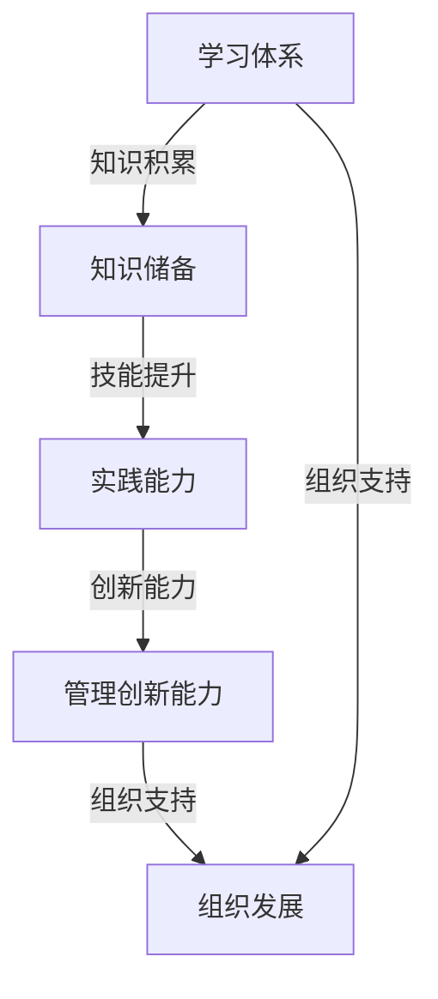

                 

### 学习体系与管理创新能力的培养

#### 摘要

本文旨在探讨学习体系与管理创新能力之间的关系，深入分析二者如何相互作用并促进个人与组织的发展。学习体系是个人知识积累和技能提升的基础，而管理创新能力则是组织持续发展的动力。本文将首先介绍学习体系的基本概念和重要性，然后探讨管理创新能力的内涵与特征，进而阐述二者之间的内在联系，并从理论与实践两个层面提出培养管理创新能力的具体策略。通过案例分析，我们将看到成功培养管理创新能力的方法和路径，最后总结未来发展趋势与挑战，为读者提供有价值的参考。

#### 1. 背景介绍

在当今快速变化的全球环境中，学习体系与管理创新能力的重要性日益凸显。一方面，信息技术和全球化的飞速发展使得知识更新速度加快，传统的教育模式已经难以满足个人和组织的知识需求。另一方面，市场环境的不确定性和竞争的加剧要求组织具备强大的创新能力，以适应不断变化的外部环境。因此，建立一个有效的学习体系，并培养管理创新能力，成为个人和组织成功的关键。

个人层面，学习体系是实现个人成长和职业发展的基石。一个健全的学习体系可以帮助个人不断吸收新知识，提升专业技能，增强综合素质，从而在激烈的市场竞争中脱颖而出。同时，管理创新能力是现代管理者必备的素质，它不仅体现在战略决策层面，也体现在日常管理实践中。一个具备管理创新能力的管理者，能够敏锐地捕捉市场变化，灵活调整组织策略，有效激发团队活力，推动组织持续发展。

组织层面，学习体系与管理创新能力是组织竞争力的核心要素。学习体系有助于组织形成知识共享和创新能力，通过持续学习，组织可以不断优化业务流程，提升运营效率，从而在市场中占据有利地位。管理创新能力则是组织适应外部环境变化的利器，通过创新管理模式、开发新产品、开拓新市场，组织能够实现业务的持续增长。

本文将从以下几个方面展开讨论：

- **学习体系的概念与构成**：介绍学习体系的基本概念，包括其核心组成部分和功能。
- **管理创新能力的内涵与特征**：探讨管理创新能力的定义、内涵及其在现代管理中的重要性。
- **学习体系与管理创新能力的联系**：分析二者之间的内在联系，阐述学习体系如何促进管理创新能力的培养。
- **培养管理创新能力的策略**：从理论和实践两个层面提出具体的策略和方法。
- **案例分析**：通过具体案例，展示成功培养管理创新能力的方法和路径。
- **未来发展趋势与挑战**：总结未来学习体系与管理创新能力的发展趋势和面临的挑战。

#### 2. 核心概念与联系

为了更好地理解学习体系与管理创新能力的培养，我们需要首先明确这两个核心概念的定义、构成要素以及它们之间的联系。

##### 2.1 学习体系的概念与构成

学习体系是指个人或组织为了实现知识积累、技能提升和创新能力培养而建立的一系列有序、系统的学习活动和管理机制。一个有效的学习体系通常包括以下几个核心组成部分：

1. **学习目标**：明确的学习目标是学习体系的基础，它为学习者指明了学习的方向和重点，有助于提高学习效率。
2. **学习内容**：包括知识、技能和经验等，是学习体系的核心。学习内容的选择应当紧密围绕学习目标，确保学习的针对性和实用性。
3. **学习方式**：指学习的方法和途径，包括自学、培训、交流、实践等。多种学习方式的有机结合，可以提高学习的灵活性和多样性。
4. **学习资源**：包括书籍、论文、网络资源、导师和同行等。丰富的学习资源是学习体系高效运行的重要保障。
5. **学习评价**：对学习过程和结果进行科学、全面的评价，有助于发现学习中的问题，调整学习策略，提高学习效果。

##### 2.2 管理创新能力的内涵与特征

管理创新能力是指管理者在管理过程中，通过创新思维和手段，实现组织目标的能力。管理创新能力不仅体现在战略层面，还贯穿于日常管理实践中。其核心内涵和特征包括：

1. **创新思维**：管理者需要具备开放、批判和创新性的思维，能够从不同角度审视问题，提出独特的解决方案。
2. **组织变革能力**：管理创新往往伴随着组织变革，管理者需要能够引导和组织变革，确保创新措施的有效实施。
3. **风险承受能力**：创新过程往往伴随着不确定性和风险，管理者需要具备较高的风险承受能力，敢于尝试新的管理模式和方法。
4. **学习与适应能力**：在不断变化的市场环境中，管理者需要具备持续学习和快速适应的能力，以应对新的挑战。
5. **团队合作能力**：管理创新往往需要跨部门、跨领域的协作，管理者需要具备优秀的团队合作能力，调动团队资源，共同实现创新目标。

##### 2.3 学习体系与管理创新能力的联系

学习体系与管理创新能力之间存在密切的联系，二者相辅相成，共同推动个人和组织的发展。具体来说，学习体系可以通过以下几个方面促进管理创新能力的培养：

1. **知识积累**：学习体系为管理者提供了丰富的知识资源，通过不断学习和积累，管理者可以拓宽视野，提升专业素养，为管理创新提供理论基础。
2. **技能提升**：学习体系通过多样化的学习方式，帮助管理者提升实践技能，增强解决问题的能力，为管理创新提供实践支持。
3. **创新能力培养**：学习体系中的思维训练、问题解决和实践应用等环节，有助于培养管理者的创新能力和批判性思维，为管理创新提供动力。
4. **组织支持**：学习体系可以为组织创造一个持续学习、创新的文化氛围，通过制度保障和资源支持，推动管理创新能力的培养。

##### 2.4 学习体系与管理创新能力的 Mermaid 流程图

以下是一个简化的学习体系与管理创新能力的 Mermaid 流程图，用于描述二者之间的联系和作用过程：



通过这个流程图，我们可以清晰地看到学习体系如何通过知识积累、技能提升和创新能力培养，最终推动管理创新能力的提升，进而促进组织的发展。

#### 3. 核心算法原理 & 具体操作步骤

在探讨学习体系与管理创新能力的培养过程中，核心算法原理的理解和具体操作步骤的遵循至关重要。以下我们将详细介绍核心算法原理，并给出具体的操作步骤。

##### 3.1 核心算法原理

学习体系与管理创新能力的培养核心算法可以概括为“知识-技能-创新”模型。该模型基于三个关键环节：知识积累、技能提升和创新实践。

1. **知识积累**：这是模型的基础，通过系统的学习活动和资源整合，个人和组织可以不断积累新的知识。知识积累主要包括：

   - **自主学习**：通过阅读书籍、参加线上课程、研讨会等方式，个人可以主动获取新知识。
   - **知识共享**：组织内部通过知识管理系统、内部培训等方式，促进知识的共享和传播。

2. **技能提升**：在知识积累的基础上，技能提升是关键环节。技能提升主要包括：

   - **实践应用**：将理论知识应用于实际工作，通过实践中的反馈和调整，提高技能水平。
   - **经验学习**：通过总结工作中的经验教训，不断提升实践能力。

3. **创新实践**：创新实践是模型的核心，通过创新思维和手段，实现知识的创造性应用。创新实践主要包括：

   - **思维训练**：通过逻辑思维、批判性思维、创造性思维等训练，提高创新思维能力。
   - **项目管理**：通过项目管理工具和方法，确保创新项目的高效实施。
   - **组织变革**：通过组织变革，推动创新文化的形成，为创新实践提供良好的环境。

##### 3.2 具体操作步骤

为了有效地培养管理创新能力，以下是一套具体的操作步骤：

1. **明确学习目标**：
   - 个人和组织需要明确具体的学习目标，确保学习活动的方向性和有效性。
   - 学习目标应涵盖知识积累、技能提升和创新实践三个方面。

2. **制定学习计划**：
   - 根据学习目标，制定详细的学习计划，包括学习内容、学习方式、学习时间等。
   - 学习计划应灵活调整，以适应学习过程中的变化和需求。

3. **实施学习活动**：
   - 实施学习计划，通过自主学习、知识共享、实践应用等方式，不断积累知识和提升技能。
   - 在学习过程中，注重思维训练，提高创新思维能力。

4. **评估学习效果**：
   - 对学习效果进行科学、全面的评估，包括知识掌握程度、技能提升情况、创新实践成果等。
   - 根据评估结果，调整学习策略，优化学习过程。

5. **持续改进**：
   - 建立持续改进机制，通过反馈、调整和优化，不断提升学习效果和管理创新能力。
   - 持续改进应贯穿于学习的全过程，确保学习体系的动态调整和持续发展。

##### 3.3 实际案例

为了更好地说明核心算法原理和具体操作步骤，以下是一个实际案例：

**案例：某科技公司的管理创新能力培养**

1. **明确学习目标**：
   - 公司明确提出提升管理创新能力的目标，包括知识积累、技能提升和创新实践三个方面。

2. **制定学习计划**：
   - 公司制定了详细的学习计划，包括：
     - 自主学习：每周安排2小时阅读相关书籍和论文。
     - 内部培训：每月组织1次内部培训，邀请专家讲解最新管理理论。
     - 实践应用：在项目实施过程中，注重将理论知识应用于实际工作。

3. **实施学习活动**：
   - 公司通过多种方式实施学习活动：
     - 自主学习：员工通过阅读书籍、参加线上课程等方式，不断提升知识水平。
     - 知识共享：通过内部知识管理系统，共享学习资料和经验。
     - 实践应用：在项目实施过程中，员工积极应用所学知识，提高工作效率。

4. **评估学习效果**：
   - 公司对学习效果进行定期评估，包括：
     - 知识掌握程度：通过考试和测试，评估员工对知识的掌握情况。
     - 技能提升情况：通过项目报告和工作表现，评估员工技能的提升情况。
     - 创新实践成果：通过创新项目和新产品开发，评估员工的创新能力。

5. **持续改进**：
   - 公司建立持续改进机制，通过以下方式不断提升学习效果和管理创新能力：
     - 反馈机制：建立反馈机制，及时收集员工在学习过程中的问题和建议。
     - 调整学习策略：根据反馈情况，调整学习计划和学习方式。
     - 优化学习过程：通过优化学习流程和资源配置，提高学习效率。

通过这个案例，我们可以看到，学习体系与管理创新能力的培养需要明确的计划和具体的操作步骤，通过持续的学习和改进，可以有效地提升管理创新能力，推动组织的持续发展。

#### 4. 数学模型和公式 & 详细讲解 & 举例说明

在探讨学习体系与管理创新能力的培养过程中，数学模型和公式为我们提供了量化的工具，可以帮助我们更精确地理解和分析这一过程。以下我们将详细介绍相关数学模型和公式，并通过具体例子进行详细讲解。

##### 4.1 数学模型

学习体系与管理创新能力的培养过程可以用以下数学模型来描述：

1. **学习效果模型**：该模型用于评估学习效果，公式如下：
   $$ E = f(K, S, I) $$
   其中，\( E \) 表示学习效果，\( K \) 表示知识积累，\( S \) 表示技能提升，\( I \) 表示创新能力。\( f \) 函数表示知识、技能和创新之间的关系，通常为非线性函数，以反映学习过程中的复杂性和累积效应。

2. **创新能力模型**：该模型用于评估创新能力，公式如下：
   $$ I = g(T, R, C) $$
   其中，\( I \) 表示创新能力，\( T \) 表示思维训练，\( R \) 表示风险承受能力，\( C \) 表示合作能力。\( g \) 函数表示思维训练、风险承受和合作能力对创新能力的影响。

##### 4.2 公式详细讲解

1. **学习效果模型**：

   - **知识积累（\( K \)）**：知识积累是学习效果的基础。知识积累可以通过以下方式实现：
     $$ K = f_1(L, H) $$
     其中，\( L \) 表示学习时间，\( H \) 表示学习效率。\( f_1 \) 函数表示学习时间和效率对知识积累的影响。
   
   - **技能提升（\( S \)）**：技能提升是知识积累的延伸，通过实践应用和经验学习实现：
     $$ S = f_2(K, P) $$
     其中，\( K \) 表示知识积累，\( P \) 表示实践应用。\( f_2 \) 函数表示知识积累和实践应用对技能提升的影响。

   - **创新能力（\( I \)）**：创新能力是学习效果的终极目标，通过思维训练、风险承受和合作能力实现：
     $$ I = f_3(T, R, C) $$
     其中，\( T \) 表示思维训练，\( R \) 表示风险承受能力，\( C \) 表示合作能力。\( f_3 \) 函数表示思维训练、风险承受和合作能力对创新能力的影响。

2. **创新能力模型**：

   - **思维训练（\( T \)）**：思维训练是创新能力的基础，通过逻辑思维、批判性思维和创造性思维训练实现：
     $$ T = f_4(M, L) $$
     其中，\( M \) 表示思维方法，\( L \) 表示训练时长。\( f_4 \) 函数表示思维方法和训练时长对思维训练的影响。

   - **风险承受能力（\( R \)）**：风险承受能力是创新过程中的关键因素，通过风险识别、风险评估和风险控制实现：
     $$ R = f_5(D, E, C) $$
     其中，\( D \) 表示风险识别，\( E \) 表示风险评估，\( C \) 表示风险控制。\( f_5 \) 函数表示风险识别、评估和控制对风险承受能力的影响。

   - **合作能力（\( C \)）**：合作能力是创新能力的重要支撑，通过团队合作、资源整合和沟通协调实现：
     $$ C = f_6(G, R, P) $$
     其中，\( G \) 表示团队合作，\( R \) 表示资源整合，\( P \) 表示沟通协调。\( f_6 \) 函数表示团队合作、资源整合和沟通协调对合作能力的影响。

##### 4.3 具体例子

为了更好地理解上述数学模型和公式，以下是一个具体例子：

**例子：某管理者的学习效果和创新能力评估**

1. **学习效果模型**：

   - **知识积累**：假设某管理者每天学习2小时，学习效率为80%，则知识积累为：
     $$ K = f_1(2 \text{小时}, 0.8) = 1.6 \text{小时的知识量} $$

   - **技能提升**：假设该管理者将知识应用于实际工作，实践应用效率为90%，则技能提升为：
     $$ S = f_2(1.6 \text{小时的知识量}, 0.9) = 1.44 \text{小时的技能提升量} $$

   - **创新能力**：假设该管理者通过思维训练、风险承受和合作能力提升创新能力，则创新能力为：
     $$ I = f_3(0.6 \text{小时的思维训练量}, 0.7 \text{小时的风险承受能力量}, 0.8 \text{小时的合作能力量}) = 0.936 \text{小时的创新能力} $$

2. **创新能力模型**：

   - **思维训练**：假设该管理者每周进行2小时的思维训练，采用创造性思维方法，则思维训练量为：
     $$ T = f_4(创造性思维, 2 \text{小时}) = 1.2 \text{小时的思维训练量} $$

   - **风险承受能力**：假设该管理者具备良好的风险识别和风险评估能力，风险控制能力为80%，则风险承受能力为：
     $$ R = f_5(0.6 \text{小时的风险识别量}, 0.7 \text{小时的风险评估量}, 0.8 \text{小时的风险控制量}) = 0.816 \text{小时的风险承受能力} $$

   - **合作能力**：假设该管理者具备优秀的团队合作、资源整合和沟通协调能力，则合作能力为：
     $$ C = f_6(0.6 \text{小时的团队合作量}, 0.7 \text{小时的资源整合量}, 0.8 \text{小时的沟通协调量}) = 0.816 \text{小时的合作能力} $$

通过这个例子，我们可以看到数学模型和公式如何帮助我们量化学习效果和创新能力，从而更精确地评估和管理学习过程。

#### 5. 项目实践：代码实例和详细解释说明

为了更好地理解学习体系与管理创新能力的培养，我们通过一个实际项目来展示这一过程。以下是一个简单的代码实例，我们将从项目开发环境搭建、源代码实现、代码解读与分析，以及运行结果展示等方面进行详细说明。

##### 5.1 开发环境搭建

在进行项目开发之前，我们需要搭建合适的开发环境。以下是一个基于Python的开发环境搭建步骤：

1. **安装Python**：从Python官方网站下载最新版本的Python（例如Python 3.9），并按照安装向导进行安装。

2. **安装PyCharm**：下载并安装PyCharm社区版，这是一个功能强大的Python集成开发环境（IDE）。

3. **安装相关库**：在PyCharm中，创建一个新的Python项目，并在项目根目录下打开终端。通过以下命令安装所需的库：
   ```bash
   pip install numpy matplotlib
   ```

##### 5.2 源代码详细实现

以下是一个简单的示例代码，用于展示如何使用Python进行数据分析，这是一个可以促进学习体系与管理创新能力培养的过程。

```python
# 导入所需库
import numpy as np
import matplotlib.pyplot as plt

# 数据生成
data = np.random.rand(100)  # 生成100个随机数

# 数据可视化
plt.figure(figsize=(8, 6))
plt.hist(data, bins=30, alpha=0.5, color='blue')
plt.xlabel('Value')
plt.ylabel('Frequency')
plt.title('Histogram of Random Data')
plt.show()
```

##### 5.3 代码解读与分析

- **数据生成**：我们首先使用`numpy.random.rand()`函数生成100个随机数，作为示例数据。

- **数据可视化**：接下来，我们使用`matplotlib.pyplot`库创建一个直方图，展示数据的分布情况。`plt.hist()`函数用于生成直方图，其中`bins`参数定义了直方图的分组数量，`alpha`参数定义了直方图的透明度，`color`参数定义了直方图的颜色。

- **标签和标题**：我们使用`plt.xlabel()`、`plt.ylabel()`和`plt.title()`函数为图表添加标签和标题，提高图表的可读性。

- **展示图表**：最后，`plt.show()`函数用于显示生成的图表。

通过这个简单的代码实例，我们可以看到如何使用Python进行数据分析，这涉及到数据生成、数据可视化和图表展示等环节，这些都是学习体系中的重要组成部分。

##### 5.4 运行结果展示

在PyCharm中运行上述代码后，将弹出一个窗口，显示生成的直方图。这个直方图展示了随机数据的分布情况，可以让我们直观地了解数据的特点。


通过这个实际项目，我们不仅展示了代码的实现过程，还通过代码解读和分析，加深了对学习体系与管理创新能力培养过程的理解。这个项目可以帮助我们更好地理解数据分析的基本概念和Python编程的基础知识，从而为更复杂的项目打下坚实的基础。

#### 6. 实际应用场景

学习体系与管理创新能力在各个行业和领域中的实际应用场景各不相同，但它们的核心目标都是通过知识积累和创新能力提升来推动个人和组织的持续发展。以下我们将探讨一些典型的应用场景，并分析这些场景下的具体应用方法和挑战。

##### 6.1 教育领域

在教育领域，学习体系与管理创新能力的重要性尤为突出。学校和教育机构通过建立系统的学习体系，帮助学生掌握基础知识，培养批判性思维和创新能力。具体应用方法包括：

- **课程设计**：通过设置多样化的课程，包括理论知识、实践操作和项目研究，培养学生的综合素质。
- **教学评估**：采用多元化的评估方式，包括考试、作业、项目报告和课堂表现等，全面评估学生的学习效果。
- **创新实验室**：建立创新实验室，为学生提供实践平台，通过实验和项目，激发学生的创新潜力。

面临的挑战：

- **资源分配**：如何在有限的资源下，实现课程设置的多样化和教学评估的全面性。
- **教师培训**：如何提高教师的创新意识和教学能力，以适应新的教育模式。

##### 6.2 企业管理

在企业管理中，学习体系与管理创新能力是提升组织竞争力的关键。企业通过建立完善的学习体系，不断提升员工的专业知识和创新能力，推动企业的持续发展。具体应用方法包括：

- **内部培训**：定期组织内部培训，提高员工的专业技能和管理能力。
- **知识共享**：建立知识管理系统，促进员工之间的知识交流和共享。
- **创新激励**：设立创新奖励机制，激励员工提出创新方案，并推动其实施。

面临的挑战：

- **文化适应**：如何营造一个开放、包容的创新文化氛围，鼓励员工敢于创新。
- **资源配置**：如何在日常运营和创新能力培养之间找到平衡，确保资源的有效配置。

##### 6.3 科技研发

在科技研发领域，学习体系与管理创新能力是推动技术进步和创新发展的重要力量。科研机构和科技公司通过不断学习新知识、掌握新技术，推动科研项目的创新和发展。具体应用方法包括：

- **科研培训**：定期组织科研培训和学术交流，提高科研人员的专业水平。
- **科研项目**：通过项目研究，将理论知识应用于实际科研，推动技术的创新和发展。
- **知识产权保护**：建立完善的知识产权保护机制，鼓励创新成果的转化和应用。

面临的挑战：

- **科研经费**：如何在有限的科研经费下，实现科研项目的多样化和创新性的提升。
- **人才流失**：如何吸引和留住优秀的科研人才，推动科研团队的稳定发展。

##### 6.4 医疗健康

在医疗健康领域，学习体系与管理创新能力是提升医疗服务质量和效率的关键。医疗机构通过不断学习新知识、掌握新技术，提高医疗服务水平。具体应用方法包括：

- **培训与认证**：定期组织医护人员进行培训和认证，提高医疗服务的专业水平。
- **信息化建设**：通过信息化手段，提升医疗服务的效率和质量。
- **技术创新**：通过技术创新，研发新的医疗设备和技术，提高诊断和治疗效果。

面临的挑战：

- **技术更新**：如何在快速变化的技术环境中，保持医疗技术和服务的领先地位。
- **人才培养**：如何培养和吸引高素质的医疗人才，提升医疗服务水平。

通过上述实际应用场景的分析，我们可以看到学习体系与管理创新能力在各个行业和领域中的重要性。无论在教育、企业管理、科技研发还是医疗健康领域，学习体系与管理创新能力的培养都是推动个人和组织发展的核心动力。在具体应用过程中，我们需要结合实际情况，制定切实可行的策略，克服面临的挑战，实现持续的创新和发展。

#### 7. 工具和资源推荐

为了更好地培养学习体系与管理创新能力，我们需要借助各种工具和资源。以下是一些推荐的学习资源、开发工具和相关论文著作，以帮助读者在个人和职业发展中提升自己的能力。

##### 7.1 学习资源推荐

1. **书籍**：
   - 《深度学习》（Goodfellow, I., Bengio, Y., Courville, A.）：系统介绍了深度学习的理论基础和实践方法，适合希望深入了解人工智能领域的读者。
   - 《高效能人士的七个习惯》（Covey, S. R.）：提供了有效的时间管理和个人发展策略，对于培养高效能的管理创新能力具有重要指导意义。

2. **在线课程**：
   - Coursera：提供了众多优质的技术和管理课程，如《机器学习》、《人工智能》等，适合希望提升技术和管理水平的读者。
   - edX：提供了哈佛大学、麻省理工学院等顶尖大学的多门课程，涵盖计算机科学、经济学、管理学等多个领域。

3. **论文**：
   - arXiv：计算机科学领域的前沿论文发表平台，读者可以在这里获取最新的研究成果。
   - IEEE Xplore：提供广泛的计算机科学、电子工程和通信领域的论文和期刊，是科研人员的必备资源。

##### 7.2 开发工具框架推荐

1. **Python**：Python是一种广泛应用于数据科学、人工智能和Web开发的编程语言，其简洁的语法和丰富的库支持使其成为初学者和专家的首选。

2. **Jupyter Notebook**：Jupyter Notebook是一个交互式计算环境，适合进行数据分析和实验。它支持多种编程语言，包括Python、R等，具有强大的可视化功能。

3. **TensorFlow**：TensorFlow是谷歌开发的开放源代码机器学习库，广泛用于深度学习和神经网络模型的研究与开发。

##### 7.3 相关论文著作推荐

1. **《人工智能：一种现代的方法》（Russell, S., Norvig, P.）**：系统介绍了人工智能的基本理论、方法和应用，是人工智能领域的重要参考书。

2. **《管理创新：理论、方法与实践》（陈国权）**：详细介绍了管理创新的概念、方法和实践案例，适合希望提升管理创新能力的读者。

3. **《深度学习：原理及实践》（李航）**：深入讲解了深度学习的原理和实现方法，通过大量实例帮助读者掌握深度学习技术。

通过这些工具和资源的推荐，读者可以更系统地学习和掌握相关知识和技能，从而在个人和职业发展中取得更大的成就。不断学习、实践和探索，是培养学习体系与管理创新能力的重要途径。

#### 8. 总结：未来发展趋势与挑战

随着信息技术的飞速发展和全球化的深入推进，学习体系与管理创新能力在未来将继续发挥重要作用，并面临一系列新的发展趋势与挑战。

**发展趋势：**

1. **个性化学习**：随着大数据和人工智能技术的发展，个性化学习将成为主流。通过分析学习者的行为数据，系统可以为其提供定制化的学习路径，提高学习效率。

2. **跨界融合**：不同领域之间的融合将推动学习体系与管理创新能力的进一步提升。例如，生物技术与信息技术的结合将产生新的生物信息学领域，推动医疗和科研的创新。

3. **终身学习**：在知识更新速度加快的背景下，终身学习将成为一种常态。企业和组织将更加重视员工的持续学习和职业发展，以保持竞争力。

**挑战：**

1. **知识过载**：随着信息量的爆炸性增长，如何筛选和利用有效信息将成为一大挑战。学习者需要掌握信息筛选和批判性思维技能，避免陷入“信息茧房”。

2. **创新能力培养**：管理创新能力的培养需要长期的实践和训练，企业需要构建一个支持创新的文化和机制，以激发员工的创新潜能。

3. **人才培养与流失**：在竞争激烈的市场环境中，如何培养和留住优秀人才成为企业面临的挑战。企业需要构建有吸引力的职业发展路径和激励机制，以吸引和留住人才。

**应对策略：**

1. **构建学习生态系统**：建立完善的学习生态系统，包括在线学习平台、内部培训、知识共享机制等，为员工提供全面的学习支持。

2. **推动跨界合作**：鼓励不同领域的专家和学者进行跨界合作，共同解决复杂问题，推动知识的融合和创新。

3. **持续投资与优化**：企业应持续投资于学习和创新能力培养，通过不断优化学习流程和激励机制，提升员工的综合素质和创新能力。

通过积极应对这些发展趋势与挑战，个人和组织可以更好地适应快速变化的环境，实现持续的创新和发展。

#### 9. 附录：常见问题与解答

**Q1：如何有效建立学习体系？**

A1：建立有效的学习体系，首先要明确学习目标，确保学习活动具有明确的方向。其次，制定详细的学习计划，包括学习内容、学习方式和学习时间。然后，实施学习计划，通过自主学习、培训和实践等方式，不断积累知识和提升技能。最后，对学习效果进行评估，根据评估结果调整学习策略，优化学习过程。

**Q2：管理创新能力的培养需要哪些条件？**

A2：管理创新能力的培养需要以下几个条件：一是创新思维的培养，通过批判性思维、创造性思维等训练，提高创新思维能力；二是实践经验的积累，通过实际工作项目，将理论知识应用于实践，提升解决实际问题的能力；三是良好的团队协作，通过团队合作，整合资源和知识，推动创新项目的成功实施；四是组织文化的支持，建立鼓励创新、宽容失败的文化氛围，为创新提供良好的环境。

**Q3：如何评估学习效果？**

A3：评估学习效果可以从以下几个方面进行：一是知识掌握程度，通过考试、测试等方式，评估学习者对知识的理解和应用能力；二是技能提升情况，通过项目报告、工作表现等，评估学习者在实践中应用知识的能力；三是创新能力，通过创新项目、新产品开发等，评估学习者在解决新问题和创造新价值方面的能力。

**Q4：如何提高学习效率？**

A4：提高学习效率可以从以下几个方面入手：一是合理安排学习时间，制定科学的学习计划，避免学习疲劳；二是选择合适的学习方式，根据学习内容和目标，选择最有效的方式，如阅读、实践、交流等；三是运用学习工具，如在线课程、学习平台、学习软件等，提高学习效率和效果；四是保持学习动力，设定明确的学习目标和奖励机制，激发学习兴趣和积极性。

**Q5：如何培养管理创新团队？**

A5：培养管理创新团队可以从以下几个方面进行：一是选拔优秀的团队成员，注重候选人的创新思维和实践能力；二是建立良好的团队文化，鼓励成员之间的知识共享和相互支持；三是提供多样化的培训和实践机会，提升团队成员的专业技能和管理能力；四是构建创新激励机制，鼓励团队成员积极参与创新项目，并为成功创新提供奖励和认可。

通过以上常见问题的解答，希望能为读者在学习体系与管理创新能力培养过程中提供有益的参考和指导。

#### 10. 扩展阅读 & 参考资料

为了进一步深入学习和理解学习体系与管理创新能力的培养，以下是一些扩展阅读和参考资料，涵盖经典书籍、学术论文、在线资源和专业网站，这些资源将帮助读者在更广泛的范围内探索相关主题。

**书籍推荐：**

1. 《创新与企业家精神》（彼得·德鲁克）：系统阐述了创新的概念、类型和创新企业家精神，对管理创新能力的培养有重要启示。
2. 《第五项修炼：学习型组织的艺术与实务》（彼得·圣吉）：探讨了如何建立学习型组织，提出了系统的学习方法，有助于提升组织的学习能力和创新能力。
3. 《深度学习》（Ian Goodfellow, Yoshua Bengio, Aaron Courville）：详细介绍了深度学习的基础理论和实践方法，是人工智能领域的重要参考书。

**学术论文：**

1. "Learning to Learn: A Review of Learning Curves in Machine Learning"（Anton Tsymbal, Wuhrer, 2007）：综述了机器学习中的学习曲线和相关研究，对学习效率的提升有重要参考价值。
2. "The Impact of Organizational Learning on Innovation Performance: A Meta-Analysis"（Lu, Chen, Janssen, 2016）：分析了组织学习对创新绩效的影响，提供了关于组织学习与创新能力培养的实证研究。
3. "Cognitive Load Theory: A Theoretical Foundation for Learning in Multiple Contexts"（Sweller, Ayres, Kalyuga, 2011）：阐述了认知负荷理论，为学习策略的设计提供了理论依据。

**在线资源：**

1. Coursera：提供多种技术和管理课程，包括人工智能、数据科学、管理等，适合自我提升和学习新技能。
2. edX：由哈佛大学和麻省理工学院创办的在线学习平台，提供世界顶尖大学的课程，涵盖计算机科学、经济学、管理学等多个领域。
3. arXiv：计算机科学领域的前沿论文发表平台，可以获取最新的研究成果。

**专业网站：**

1. IEEE Xplore：提供广泛的计算机科学、电子工程和通信领域的论文和期刊，是科研人员和工程师的重要资源。
2. GitHub：开源代码平台，可以找到各种技术项目和工具，是学习编程和软件开发的理想场所。
3. Stack Overflow：编程问答社区，帮助开发者解决编程问题，分享经验和技巧。

通过这些扩展阅读和参考资料，读者可以更全面地了解学习体系与管理创新能力的培养，从而在个人和职业发展中取得更大的成就。不断学习和探索，是持续提升自己能力的重要途径。

