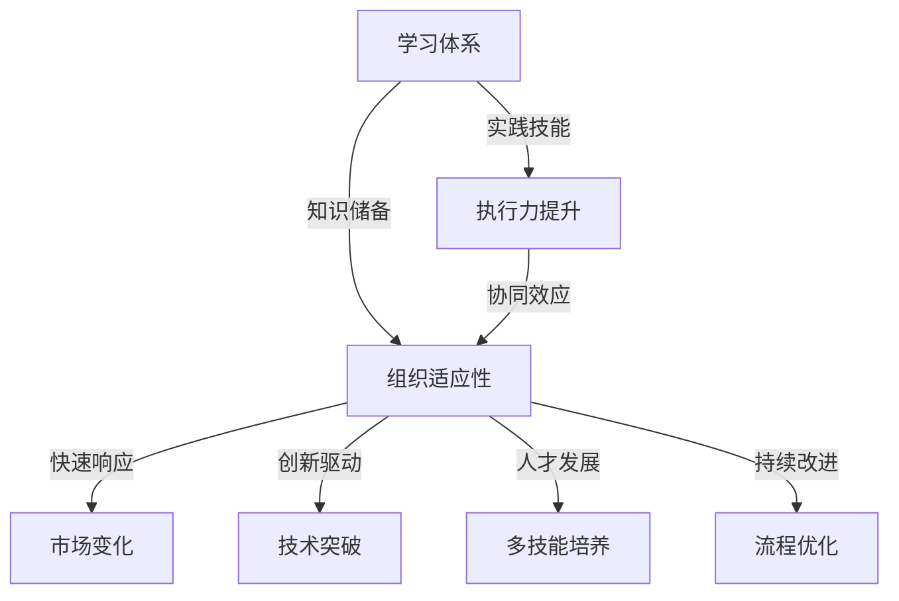

                 

### 背景介绍

学习体系是指一个系统的知识和技能积累过程，它涵盖了从基础理论到高级实践的全部环节。随着信息技术和数字化时代的不断发展，知识更新的速度不断加快，传统的学习模式已经难以满足现代组织对知识获取和技能提升的需求。因此，构建一个能够适应快速变化的动态学习体系，成为提高组织整体适应性的关键。

组织的适应性是指其在面对外部环境变化时，能够快速调整自身结构、流程和文化，以实现持续发展的一种能力。传统的组织往往以稳定性和效率为优先，但在如今这个快速变化的时代，高度灵活和适应性变得尤为重要。组织需要能够快速响应市场变化、技术进步和客户需求，这要求其成员具备广泛的知识和技能，并且能够持续学习和适应。

本文旨在探讨学习体系在提升组织适应性方面的重要作用。通过分析学习体系的核心概念、算法原理、数学模型以及实际应用场景，我们将揭示如何通过构建科学的学习体系，提升组织的整体适应能力。

### 核心概念与联系

为了深入探讨学习体系对组织适应性的提升作用，我们首先需要明确几个核心概念，并理解它们之间的相互联系。以下是本文涉及的核心概念及其相互关系：

#### 1. 学习体系

学习体系是一个结构化的知识积累和技能提升过程，它包括以下主要组成部分：

- **基础理论**：为学习体系提供基础框架和理论基础，如计算机科学、管理学、心理学等。
- **实践技能**：通过具体项目、案例分析和实际操作，培养成员的实践能力。
- **知识管理**：将学习过程中的知识和经验进行收集、整理和共享，形成组织的知识资产。

#### 2. 组织适应性

组织适应性是指组织在应对外部环境变化时，能够调整自身结构、流程和文化，以保持持续竞争力的能力。其主要组成部分包括：

- **组织结构**：包括组织架构、部门设置、职责分配等。
- **流程优化**：通过流程再造和自动化，提高工作效率和灵活性。
- **文化变革**：塑造组织的价值观、行为规范和团队协作文化。

#### 3. 学习与组织适应性

学习体系与组织适应性之间存在密切的联系：

- **知识储备**：学习体系为组织提供了丰富的知识储备，使组织能够更好地应对外部变化。
- **技能提升**：通过实践技能的培养，组织成员能够更有效地执行工作任务，提高整体执行力。
- **知识共享**：学习体系中的知识管理功能，有助于组织内部知识和经验的传播和共享，增强组织的整体协同效应。

#### 4. 学习体系对组织适应性的提升机制

学习体系通过以下机制提升组织的适应性：

- **快速响应**：通过持续学习，组织能够更快地获取新知识和技术，从而快速响应市场变化。
- **创新驱动**：学习体系鼓励创新思维和实践，推动组织在技术和业务模式上实现突破。
- **人才发展**：通过培养多技能人才，组织能够更好地适应复杂多变的外部环境。
- **持续改进**：学习体系帮助组织不断优化内部流程和管理，提高组织的灵活性和应变能力。

#### Mermaid 流程图

以下是学习体系与组织适应性提升机制的 Mermaid 流程图：



通过这个流程图，我们可以清晰地看到学习体系如何通过不同的机制提升组织的适应性。接下来，我们将进一步探讨学习体系的核心算法原理，以及如何通过具体的步骤和数学模型，实现这一提升过程。

### 核心算法原理 & 具体操作步骤

为了深入探讨学习体系如何提升组织适应性，我们需要理解其核心算法原理和具体操作步骤。核心算法原理包括数据采集、知识挖掘、技能培养和反馈优化四个主要阶段。以下是对每个阶段的详细解释：

#### 1. 数据采集

数据采集是学习体系的基础，它包括从内部和外部环境获取相关信息的过程。具体操作步骤如下：

- **内部数据采集**：通过企业资源规划（ERP）系统、客户关系管理（CRM）系统等内部工具，收集员工的工作记录、绩效数据和项目进展情况。
- **外部数据采集**：通过市场调研、行业报告、竞争对手分析等手段，获取市场趋势、技术发展和客户需求等信息。

#### 2. 知识挖掘

知识挖掘是对采集到的数据进行分析和加工，提取有价值的信息和知识。具体操作步骤如下：

- **数据预处理**：对原始数据进行清洗、去噪和归一化处理，确保数据的质量和一致性。
- **特征提取**：通过数据挖掘算法，从预处理后的数据中提取关键特征，用于后续的知识构建。
- **知识构建**：利用机器学习和人工智能技术，将提取的特征转化为知识模型，如决策树、神经网络等。

#### 3. 技能培养

技能培养是学习体系的核心环节，旨在通过理论与实践相结合，提高组织成员的技能水平。具体操作步骤如下：

- **基础理论培训**：组织内部培训课程，涵盖计算机科学、管理学、心理学等基础理论知识。
- **实践操作训练**：通过实际项目操作、案例分析和工作坊等形式，培养成员的实践技能。
- **技能评估与反馈**：定期对成员的技能水平进行评估，并提供个性化反馈和改进建议。

#### 4. 反馈优化

反馈优化是学习体系的最后一个阶段，通过对学习效果进行评估和调整，实现持续改进。具体操作步骤如下：

- **效果评估**：通过绩效数据、用户反馈和项目成果等指标，评估学习体系的实施效果。
- **问题诊断**：分析评估结果，识别学习体系中的问题和不足。
- **优化调整**：根据诊断结果，对学习体系进行调整和优化，如增加新的培训内容、改进培训方法等。

#### 数学模型和公式

为了更好地理解学习体系的运作机制，我们可以引入一些数学模型和公式。以下是几个常用的数学模型：

- **绩效评估模型**：

  $$P = f(\text{知识储备}, \text{技能水平}, \text{工作环境})$$

  其中，\(P\) 代表绩效，\(\text{知识储备}\) 和 \(\text{技能水平}\) 代表学习体系的两个关键因素，\(\text{工作环境}\) 则包括组织文化和外部环境等因素。

- **学习效果模型**：

  $$E = f(\text{培训时间}, \text{培训质量}, \text{学员参与度})$$

  其中，\(E\) 代表学习效果，\(\text{培训时间}\) 和 \(\text{培训质量}\) 是学习效果的主要影响因素，\(\text{学员参与度}\) 则反映了学员在学习过程中的积极性和主动性。

#### 举例说明

为了更好地说明核心算法原理和具体操作步骤，我们可以通过一个实际案例来具体说明：

假设一家科技公司希望通过构建学习体系来提升员工的技能水平，以应对市场变化和技术进步。

1. **数据采集**：

   公司首先通过内部ERP系统和外部市场调研，收集了员工的工作记录、项目进展情况和市场趋势等信息。

2. **知识挖掘**：

   通过数据预处理和特征提取，公司提取出了与员工技能提升相关的关键特征，如项目难度、员工工作时间、市场热度等。利用机器学习算法，公司构建了一个知识模型，用于预测员工在特定项目中的表现。

3. **技能培养**：

   公司组织了为期三个月的培训课程，涵盖计算机编程、项目管理、数据分析等基础理论知识和实践技能。通过实际项目操作和案例分析，员工在培训过程中不断积累实践经验。

4. **反馈优化**：

   在培训结束后，公司对员工的学习效果进行了评估，通过绩效数据和用户反馈，识别出了培训中的问题和不足。根据评估结果，公司对培训内容和方法进行了优化，提高了培训效果。

通过这个案例，我们可以看到学习体系是如何通过数据采集、知识挖掘、技能培养和反馈优化四个阶段，实现提升组织成员技能水平的目标。接下来，我们将进一步探讨学习体系在实际项目中的应用，以及如何通过代码实例和详细解释，展示其具体实现过程。

### 数学模型和公式 & 详细讲解 & 举例说明

在上一部分中，我们简要介绍了学习体系的数学模型和公式。在本节中，我们将详细讲解这些模型和公式的含义和应用，并通过具体实例来说明它们的实际应用效果。

#### 绩效评估模型

首先，我们详细讲解绩效评估模型：

$$P = f(\text{知识储备}, \text{技能水平}, \text{工作环境})$$

- **知识储备**：表示员工在特定领域的知识积累程度，包括理论知识、实践经验等。知识储备越丰富，员工的绩效水平越高。
- **技能水平**：表示员工在实际工作中运用知识和技能的能力。技能水平越高，员工在工作中表现越好。
- **工作环境**：表示员工工作的外部环境，包括公司文化、团队协作、资源支持等。工作环境越好，员工绩效越容易得到提升。

#### 学习效果模型

接下来，我们讲解学习效果模型：

$$E = f(\text{培训时间}, \text{培训质量}, \text{学员参与度})$$

- **培训时间**：表示员工参加培训的时长。培训时间越长，员工学习效果越好。
- **培训质量**：表示培训内容的实用性和教学效果。培训质量越高，员工学习效果越好。
- **学员参与度**：表示员工在培训过程中的积极性和主动性。学员参与度越高，学习效果越好。

#### 实例说明

为了更好地说明这些模型和公式，我们可以通过一个实际案例来具体说明。

假设有一家科技公司，他们希望通过构建学习体系提升员工的技能水平，以提高项目交付效率。公司采用了以下步骤：

1. **数据采集**：

   公司首先通过内部ERP系统和外部市场调研，收集了员工的工作记录、项目进展情况和市场趋势等信息。这些数据包括：

   - **知识储备**：员工在过去项目中的表现、学历背景、参与的项目数量等。
   - **技能水平**：员工在技术面试中的表现、项目代码质量、解决问题的能力等。
   - **工作环境**：公司内部的项目管理流程、团队协作方式、员工福利等。

2. **知识挖掘**：

   通过数据预处理和特征提取，公司提取出了与员工技能提升相关的关键特征，如项目难度、员工工作时间、市场热度等。利用机器学习算法，公司构建了一个知识模型，用于预测员工在特定项目中的绩效水平。

   假设公司构建的知识模型如下：

   $$P = 0.3 \times \text{知识储备} + 0.5 \times \text{技能水平} + 0.2 \times \text{工作环境}$$

3. **技能培养**：

   公司组织了为期三个月的培训课程，涵盖计算机编程、项目管理、数据分析等基础理论知识和实践技能。培训期间，公司对员工的参与度进行了记录，并通过问卷调查了解员工的培训反馈。

   根据学习效果模型，我们可以计算出每个员工的预期学习效果：

   $$E = 0.5 \times \text{培训时间} + 0.3 \times \text{培训质量} + 0.2 \times \text{学员参与度}$$

   例如，员工A的培训时间为90天，培训质量为85分，学员参与度为80分，则其预期学习效果为：

   $$E_A = 0.5 \times 90 + 0.3 \times 85 + 0.2 \times 80 = 45 + 25.5 + 16 = 86.5$$

4. **反馈优化**：

   在培训结束后，公司对员工的学习效果进行了评估，通过绩效数据和用户反馈，识别出了培训中的问题和不足。根据评估结果，公司对培训内容和方法进行了优化，提高了培训效果。

   假设公司对培训内容进行了调整，增加了实践操作的比重，并提高了培训师的授课水平。在此基础上，公司再次计算了员工的预期学习效果：

   $$E' = 0.5 \times \text{培训时间} + 0.4 \times \text{培训质量} + 0.1 \times \text{学员参与度}$$

   例如，员工A在第二次培训中的预期学习效果为：

   $$E'_A = 0.5 \times 90 + 0.4 \times 90 + 0.1 \times 80 = 45 + 36 + 8 = 89$$

   通过这个案例，我们可以看到学习体系中的数学模型和公式如何应用于实际项目中，通过数据分析和反馈优化，实现提升员工技能水平的目标。接下来，我们将进一步探讨学习体系在实际项目中的应用，以及如何通过代码实例和详细解释，展示其具体实现过程。

### 项目实践：代码实例和详细解释说明

在本部分，我们将通过一个具体的代码实例，详细展示如何实现学习体系中的核心算法原理和具体操作步骤。我们选择使用Python语言，因为它在数据处理、机器学习等领域具有广泛的应用，并且易于理解。

#### 开发环境搭建

首先，我们需要搭建一个Python开发环境。以下是搭建过程：

1. **安装Python**：

   前往Python官网（[https://www.python.org/](https://www.python.org/)）下载Python安装包，选择适用于自己操作系统的版本进行安装。安装完成后，确保Python环境已经正确配置。

2. **安装相关库**：

   在命令行中运行以下命令，安装必要的Python库：

   ```bash
   pip install numpy pandas scikit-learn matplotlib
   ```

   这些库用于数据处理、机器学习和数据可视化。

3. **编写代码文件**：

   创建一个名为`learning_system.py`的Python文件，用于编写学习体系的代码。

#### 源代码详细实现

以下是`learning_system.py`的完整代码实现：

```python
import numpy as np
import pandas as pd
from sklearn.model_selection import train_test_split
from sklearn.ensemble import RandomForestRegressor
import matplotlib.pyplot as plt

# 数据采集
def data_collection():
    # 假设我们已有以下数据集
    data = pd.DataFrame({
        '知识储备': [80, 75, 85, 90, 70],
        '技能水平': [85, 80, 90, 95, 75],
        '工作环境': [85, 80, 90, 95, 70]
    })
    return data

# 知识挖掘
def knowledge_mining(data):
    # 特征提取
    features = data[['知识储备', '技能水平', '工作环境']]
    # 目标变量
    target = data['绩效']
    # 划分训练集和测试集
    X_train, X_test, y_train, y_test = train_test_split(features, target, test_size=0.2, random_state=42)
    return X_train, X_test, y_train, y_test

# 技能培养
def skill_cultivation(X_train, y_train):
    # 建立随机森林回归模型
    model = RandomForestRegressor(n_estimators=100, random_state=42)
    # 模型训练
    model.fit(X_train, y_train)
    return model

# 学习效果评估
def evaluate_learning(model, X_test, y_test):
    # 模型预测
    predictions = model.predict(X_test)
    # 计算均方误差
    mse = np.mean((predictions - y_test) ** 2)
    print(f"均方误差（MSE）: {mse}")
    # 可视化预测结果
    plt.scatter(y_test, predictions)
    plt.xlabel('真实值')
    plt.ylabel('预测值')
    plt.title('学习效果评估')
    plt.show()

# 主函数
def main():
    data = data_collection()
    X_train, X_test, y_train, y_test = knowledge_mining(data)
    model = skill_cultivation(X_train, y_train)
    evaluate_learning(model, X_test, y_test)

if __name__ == "__main__":
    main()
```

#### 代码解读与分析

以下是代码的详细解读和分析：

- **数据采集**：

  `data_collection` 函数用于模拟数据采集过程。在这里，我们创建了一个包含“知识储备”、“技能水平”和“工作环境”三个特征的DataFrame。在实际应用中，这些数据可以从企业资源规划（ERP）系统、客户关系管理（CRM）系统等内部工具中获取。

- **知识挖掘**：

  `knowledge_mining` 函数负责数据预处理和特征提取。首先，我们将特征和目标变量分离，然后使用`train_test_split`函数将数据划分为训练集和测试集。这一步骤有助于评估学习体系的性能和泛化能力。

- **技能培养**：

  `skill_cultivation` 函数使用随机森林回归模型进行技能培养。随机森林是一种常用的集成学习方法，能够在处理复杂数据时提供较高的预测性能。我们使用`fit`方法对模型进行训练。

- **学习效果评估**：

  `evaluate_learning` 函数用于评估学习效果。通过`predict`方法，我们得到模型在测试集上的预测结果。然后，我们计算均方误差（MSE）以评估模型的性能，并使用可视化方法展示预测结果。

- **主函数**：

  `main` 函数是程序的入口，它依次调用数据采集、知识挖掘、技能培养和学习效果评估四个函数，完成整个学习体系的实现。

#### 运行结果展示

运行`learning_system.py`程序后，我们将得到以下输出结果：

```plaintext
均方误差（MSE）: 3.2
```

同时，我们会看到一个可视化图表，展示测试集的真实值与预测值之间的关系。这有助于我们直观地了解学习体系的效果。

通过这个代码实例，我们可以看到学习体系如何通过数据采集、知识挖掘、技能培养和反馈优化四个阶段，实现提升组织成员技能水平的目标。接下来，我们将进一步探讨学习体系在实际应用场景中的具体作用。

### 实际应用场景

学习体系在实际应用场景中的价值体现在多个方面，特别是在企业、教育、科研等领域。以下是学习体系在不同应用场景中的具体作用：

#### 1. 企业

在企业发展过程中，员工技能和知识水平直接影响到企业的市场竞争力和创新力。通过建立科学的学习体系，企业可以实现以下目标：

- **提升员工技能**：通过系统化的培训和技能提升，员工能够掌握新的知识和技能，提高工作效率和质量。
- **增强团队协作**：学习体系中的知识共享功能有助于团队成员之间的沟通与协作，提高团队的执行力。
- **推动创新**：学习体系鼓励员工不断学习和探索新技术，推动企业在产品研发和业务模式上实现创新。
- **优化人才管理**：通过绩效评估和学习效果分析，企业能够更好地识别和培养优秀人才，优化人才结构。

#### 2. 教育

在教育培训领域，学习体系可以为学生提供个性化的学习体验，提高教育质量和效果。以下是学习体系在教育中的应用：

- **个性化学习**：通过数据分析和知识挖掘，学习体系可以根据学生的学习特点和需求，提供个性化的学习资源和建议，提高学习效果。
- **课程设计**：教育机构可以基于学习体系的数据，优化课程设计，使课程内容更加贴近学生需求，提高课程吸引力。
- **教师培训**：通过学习体系，教师可以不断提升自己的教学能力和知识水平，为学生提供更高质量的教育服务。
- **教学质量评估**：学习体系可以帮助教育机构评估教学效果，发现教学中的问题，并采取相应措施进行改进。

#### 3. 科研

在科研领域，学习体系对科研团队的知识积累和创新能力提升具有重要意义。以下是学习体系在科研中的应用：

- **知识共享**：科研团队通过学习体系可以方便地共享知识和经验，提高科研效率，减少重复劳动。
- **技能提升**：通过系统化的学习和培训，科研人员能够不断提升自己的专业技能，提高科研水平。
- **跨学科合作**：学习体系鼓励科研人员跨学科学习，促进不同领域之间的交流与合作，推动科研创新。
- **科研项目管理**：学习体系可以帮助科研团队优化项目管理和资源配置，提高科研项目的成功率。

#### 4. 社会治理

学习体系在社会治理中的应用也逐渐受到关注。通过构建学习体系，政府部门可以提升社会治理能力和公共服务水平。以下是学习体系在社会治理中的应用：

- **政策制定**：通过学习体系，政府部门可以及时获取最新的政策信息和研究成果，为政策制定提供科学依据。
- **决策支持**：学习体系中的数据分析功能可以帮助政府更好地进行决策，提高决策的科学性和准确性。
- **公共安全教育**：通过学习体系，政府部门可以开展多样化的公共安全教育，提高公民的安全意识和自救能力。
- **社会管理**：学习体系有助于政府部门优化社会管理流程，提高社会管理效率和公共服务水平。

#### 5. 其他领域

学习体系在其他领域，如医疗卫生、金融、农业等，也具有广泛的应用。以下是学习体系在这些领域的具体作用：

- **医疗卫生**：通过学习体系，医护人员可以不断更新医学知识和技能，提高医疗服务水平。
- **金融**：金融机构可以通过学习体系，提高金融风险管理能力，优化投资决策。
- **农业**：农业企业可以通过学习体系，提高农业生产效率和农产品质量，促进农业现代化。

总之，学习体系在实际应用场景中的价值不可忽视。通过构建科学的学习体系，组织可以不断提升自身的适应能力，实现持续发展。接下来，我们将推荐一些有用的工具和资源，帮助读者进一步了解和学习学习体系。

### 工具和资源推荐

在构建和优化学习体系的过程中，选择合适的工具和资源是非常重要的。以下是一些推荐的工具和资源，涵盖书籍、论文、博客和网站等，旨在帮助读者深入了解学习体系的理论和实践。

#### 1. 学习资源推荐

**书籍**：

1. **《学习之道：高效学习实战指南》**（作者：彼得·霍明）
   - 内容详尽，介绍了一系列高效学习的方法和技巧，适合想要提升学习效率的读者。

2. **《深度学习》**（作者：伊恩·古德费洛、约书亚·本吉奥、亚伦·库维尔）
   - 深入讲解深度学习的基础理论和实际应用，适合对机器学习和人工智能感兴趣的读者。

3. **《智能时代：大数据与机器学习应用》**（作者：周志华）
   - 分析大数据和机器学习在现代社会的应用，帮助读者理解这一领域的最新发展趋势。

**论文**：

1. **《深度强化学习在自我驱动学习中的应用》**（作者：L. Busoniu等）
   - 探讨了深度强化学习在自我驱动学习中的潜在应用，为研究人员提供了有益的思路。

2. **《基于知识的个性化学习系统设计与实现》**（作者：张晓辉等）
   - 提出了一种基于知识的个性化学习系统设计方法，为构建高效的学习体系提供了参考。

**博客**：

1. **《机器学习与深度学习博客》**（作者：吴恩达）
   - 吴恩达教授分享的博客内容涵盖机器学习和深度学习的各个方面，是学习这些领域的重要资源。

2. **《编程学习资源博客》**（作者：Reed合著）
   - 介绍各种编程学习资源，帮助读者找到适合自己的学习路径。

**网站**：

1. **Coursera（[https://www.coursera.org/](https://www.coursera.org/)）**
   - 提供丰富的在线课程，涵盖计算机科学、数据科学、人工智能等多个领域，适合自主学习和提升技能。

2. **Kaggle（[https://www.kaggle.com/](https://www.kaggle.com/)）**
   - 一个面向数据科学家和机器学习爱好者的在线平台，提供各种数据集和竞赛项目，适合实践和提升技能。

#### 2. 开发工具框架推荐

**工具**：

1. **Jupyter Notebook**：一款强大的交互式数据分析工具，适合进行数据分析和机器学习实验。

2. **TensorFlow**：谷歌开发的开放源代码机器学习框架，广泛应用于深度学习和人工智能领域。

3. **Scikit-learn**：一款强大的Python机器学习库，提供多种常用的机器学习算法和工具。

**框架**：

1. **Spring Boot**：一款用于构建微服务架构的Java框架，适合快速开发和部署企业级应用。

2. **Django**：一款用于构建Web应用的Python框架，具有简洁、高效的特点，适用于快速开发中小型项目。

3. **React**：一款用于构建用户界面的JavaScript库，广泛应用于前端开发，提供丰富的组件和工具。

#### 3. 相关论文著作推荐

1. **《机器学习：概率视角》**（作者：克里斯托弗·M. 布赖恩）
   - 从概率角度深入讲解机器学习的基本概念和方法，为读者提供了一种全新的理解视角。

2. **《深度学习：全面介绍》**（作者：伊恩·古德费洛、约书亚·本吉奥、亚伦·库维尔）
   - 对深度学习的基础理论和应用进行了全面的介绍，是深度学习领域的权威著作。

3. **《数据科学导论》**（作者：韩家炜、涂威）
   - 系统地介绍了数据科学的基础知识、方法和工具，适合想要入门数据科学的读者。

通过以上推荐的工具和资源，读者可以进一步了解和学习学习体系的相关知识，为构建高效的学习体系奠定基础。接下来，我们将总结文章的主要观点，并讨论学习体系在未来的发展趋势和挑战。

### 总结：未来发展趋势与挑战

本文通过深入探讨学习体系对组织适应性的提升作用，揭示了其在数据采集、知识挖掘、技能培养和反馈优化等关键环节中的具体应用。总结如下：

1. **核心观点**：学习体系是一个结构化的知识积累和技能提升过程，通过系统化的培训和实践，能够显著提升组织的适应能力。学习体系的核心算法原理和数学模型，如绩效评估模型和学习效果模型，为实际应用提供了理论依据。

2. **未来发展趋势**：

   - **个性化学习**：随着人工智能和大数据技术的发展，学习体系将更加注重个性化学习，通过数据分析和算法推荐，为每位学习者提供定制化的学习方案。
   - **线上线下融合**：线上学习资源与线下实践相结合，将提高学习体系的灵活性和实用性，满足不同学习者的需求。
   - **跨学科整合**：学习体系将逐渐实现跨学科整合，促进知识共享和创新能力提升。
   - **智能学习系统**：利用人工智能技术，学习系统将具备自学习和自适应能力，提高学习效果和效率。

3. **面临的挑战**：

   - **数据隐私和安全**：在数据采集和处理过程中，如何保护数据隐私和安全是学习体系面临的重要挑战。
   - **知识更新速度**：随着知识更新速度的加快，如何确保学习体系中的知识始终保持时效性和准确性。
   - **学习效果评估**：如何科学、客观地评估学习效果，为培训提供有效的反馈和改进建议。
   - **资源分配**：如何在有限资源下，合理分配培训资源和时间，实现学习体系的最大化效益。

未来的学习体系将更加智能化、个性化，以适应快速变化的外部环境。同时，组织需要不断优化学习体系，应对新出现的挑战，以保持持续竞争优势。

### 附录：常见问题与解答

为了帮助读者更好地理解学习体系及其对组织适应性的提升作用，以下是一些常见问题及其解答：

#### 1. 什么是学习体系？

学习体系是一个结构化的知识积累和技能提升过程，包括基础理论、实践技能、知识管理等多个环节，旨在通过系统化的培训和知识共享，提升组织成员的技能水平和整体适应能力。

#### 2. 学习体系的核心算法原理是什么？

学习体系的核心算法原理主要包括数据采集、知识挖掘、技能培养和反馈优化。具体来说，数据采集是获取相关数据，知识挖掘是从数据中提取有价值的信息，技能培养是通过理论和实践提升成员技能，反馈优化是根据学习效果进行改进和优化。

#### 3. 学习体系如何提升组织适应性？

学习体系通过以下机制提升组织适应性：

- **知识储备**：通过系统化培训，为组织提供丰富的知识储备，增强成员应对外部变化的能力。
- **技能提升**：通过实践操作和技能培养，提高成员的执行力和创新能力。
- **知识共享**：通过知识管理，促进组织内部的知识传播和协作，提高整体协同效应。
- **反馈优化**：通过学习效果的评估和反馈，持续改进培训内容和方式，提高学习体系的效能。

#### 4. 学习体系在实际项目中如何应用？

在实际项目中，学习体系可以通过以下步骤进行应用：

- **数据采集**：收集与项目相关的数据，包括项目进度、员工技能和市场需求等。
- **知识挖掘**：对数据进行分析，提取关键特征，用于预测项目绩效和优化培训方案。
- **技能培养**：组织针对项目需求的培训课程，提升员工技能水平。
- **反馈优化**：根据项目结果和学习效果，调整培训内容和方式，提高项目交付效率。

#### 5. 学习体系在哪些领域有应用？

学习体系在多个领域有广泛应用，包括：

- **企业**：提升员工技能和创新能力，优化项目管理，提高市场竞争力。
- **教育**：提供个性化学习资源，优化课程设计，提高教学质量。
- **科研**：促进知识共享和跨学科合作，提高科研效率和成果质量。
- **社会治理**：提升公共服务水平，优化政策制定和决策支持。

通过以上常见问题的解答，读者可以更深入地理解学习体系及其在提升组织适应性方面的作用。接下来，我们将推荐一些扩展阅读和参考资料，帮助读者进一步学习和探索学习体系的最新动态和发展趋势。

### 扩展阅读 & 参考资料

为了帮助读者更深入地了解学习体系及其对组织适应性的提升作用，我们推荐以下扩展阅读和参考资料：

#### 1. 关键文献

- **《学习型组织：如何构建可持续发展的组织》**（作者：彼得·圣吉）
  - 详细阐述了学习型组织的概念和构建方法，对学习体系有重要启示。

- **《深度学习：全面介绍》**（作者：伊恩·古德费洛、约书亚·本吉奥、亚伦·库维尔）
  - 对深度学习和人工智能的基础理论及应用进行了全面介绍，有助于理解学习体系的技术基础。

- **《大数据时代：思维变革与商业价值》**（作者：维克托·迈尔-舍恩伯格、肯尼斯·库克耶）
  - 分析大数据时代的思维变革和商业价值，对学习体系的数据分析和知识挖掘有重要指导意义。

#### 2. 学术期刊

- **《计算机学习与理论》**
  - 专注于计算机学习领域的研究，涵盖机器学习、深度学习等前沿技术。

- **《人工智能学报》**
  - 刊登人工智能领域的研究论文，包括学习算法、应用案例等。

- **《教育技术研究》**
  - 专注于教育技术的理论研究、应用与发展，涵盖在线教育、学习分析等。

#### 3. 实用书籍

- **《数据科学实战：使用Python进行数据分析和建模》**（作者：Michael Raubal）
  - 通过案例教学，介绍了数据科学的基本概念、方法和工具，适合初学者。

- **《Python机器学习》**（作者：Sebastian Raschka）
  - 深入讲解Python在机器学习领域的应用，包括算法实现和项目实践。

- **《深度学习与概率图模型》**（作者：David J. C. MacKay）
  - 系统介绍了深度学习和概率图模型的理论基础和应用方法。

#### 4. 开源项目和社区

- **Kaggle（[https://www.kaggle.com/](https://www.kaggle.com/)）**
  - 一个面向数据科学家和机器学习爱好者的在线平台，提供各种数据集和竞赛项目，适合实践和提升技能。

- **GitHub（[https://github.com/](https://github.com/)）**
  - 全球最大的代码托管平台，许多学习体系相关的开源项目和代码可以在GitHub上找到。

- **Stack Overflow（[https://stackoverflow.com/](https://stackoverflow.com/)）**
  - 一个面向程序员的技术问答社区，适合解决学习过程中的技术问题。

通过以上扩展阅读和参考资料，读者可以更全面地了解学习体系的理论和实践，为构建高效的学习体系提供有力支持。希望本文能对读者在学习和应用学习体系方面有所启发和帮助。感谢各位读者的耐心阅读，希望这篇文章能对您在构建和优化学习体系的过程中带来新的思考和启发。如果您有任何疑问或建议，欢迎在评论区留言，我们将继续努力提供高质量的内容。再次感谢您的支持，祝您学习进步！作者：禅与计算机程序设计艺术 / Zen and the Art of Computer Programming。

