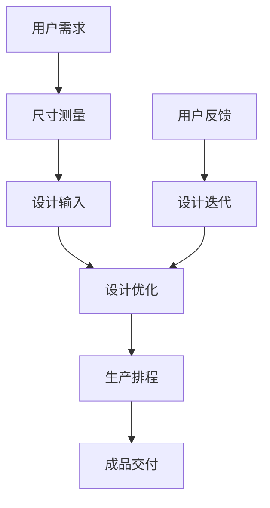

                 

### 文章标题

《定制服装：AI引领个性化服装定制新潮流》

关键词：AI、个性化定制、机器学习、服装设计、智能制造

摘要：随着人工智能技术的飞速发展，个性化定制正逐渐成为服装行业的新趋势。本文将深入探讨AI在服装定制中的应用，从核心概念、算法原理、数学模型、项目实践、应用场景以及未来发展趋势等多个方面，全面解析AI如何引领个性化服装定制新潮流。

<|assistant|>### 1. 背景介绍

近年来，随着消费升级和个性化需求的日益增长，服装定制行业迎来了前所未有的发展机遇。传统服装定制往往依赖于人工经验和手工制作，成本高、效率低，难以满足消费者的多样化需求。然而，随着人工智能技术的崛起，尤其是机器学习、深度学习等算法的不断突破，服装定制开始迈向智能化、个性化和高效化。

AI技术在服装定制领域的应用主要集中在以下几个方面：

1. **设计辅助**：通过机器学习算法，AI可以分析大量时尚数据，预测流行趋势，辅助设计师进行创新设计。
2. **尺寸测量与建模**：利用计算机视觉和3D建模技术，AI可以精准测量用户尺寸，快速生成个性化三维模型。
3. **生产优化**：通过智能排产和优化生产流程，AI可以提高生产效率，降低生产成本。
4. **供应链管理**：AI可以优化供应链，提高库存管理效率，减少供应链延误。

这些应用的共同目标是为消费者提供更加个性化和高效的定制服务，从而提升用户体验和品牌竞争力。

<|assistant|>### 2. 核心概念与联系

在探讨AI如何改变服装定制之前，我们需要了解一些核心概念和技术原理。以下是一个简单的Mermaid流程图，展示了AI在服装定制中的主要节点和流程：



**2.1 尺寸测量**

尺寸测量是服装定制的第一步，精准的尺寸数据是确保定制服装合身的基础。计算机视觉技术可以用于自动识别和测量用户的身体尺寸，而深度学习算法则可以对这些数据进行精细分析，提高测量的准确性和效率。

**2.2 设计输入**

设计输入阶段，AI可以通过分析用户的历史购买记录、社交媒体行为以及个人偏好，生成个性化的设计建议。此外，AI还可以利用生成对抗网络（GAN）等技术，生成新的时尚设计图案和样式，为设计师提供灵感。

**2.3 设计优化**

在设计优化阶段，AI可以通过机器学习算法，分析大量的时尚数据和市场趋势，对设计方案进行迭代优化。这种优化不仅包括外观设计，还包括材质选择、工艺流程等。

**2.4 生产排程**

生产排程是确保定制服装按时交付的关键环节。AI可以通过优化算法，合理安排生产流程，减少生产延误和库存积压。例如，基于需求预测的智能排产系统可以动态调整生产计划，确保资源的最优利用。

**2.5 成品交付**

成品交付是定制服务的最后一步，AI可以通过自动化仓储和物流系统，确保定制服装快速、准确地送达用户手中。

**2.6 用户反馈**

用户反馈是持续改进定制服务的重要环节。AI可以通过分析用户反馈，识别改进机会，并对设计和服务进行迭代优化。

<|assistant|>### 3. 核心算法原理 & 具体操作步骤

**3.1 计算机视觉技术**

计算机视觉技术在尺寸测量中的应用主要体现在图像识别和特征提取上。具体操作步骤如下：

1. **图像采集**：使用摄像头或扫描设备捕捉用户的身体图像。
2. **图像预处理**：对采集到的图像进行滤波、去噪、对比度增强等预处理操作，以提高图像质量。
3. **人体关键点检测**：利用深度学习模型（如HRNet、PoseNet等）对图像进行人体关键点检测，提取用户的身体尺寸信息。
4. **尺寸计算**：根据关键点坐标，计算用户的身体尺寸，如胸围、腰围、肩宽等。

**3.2 生成对抗网络（GAN）**

生成对抗网络（GAN）是一种深度学习模型，可以生成逼真的图像和数据。在服装定制中，GAN主要用于设计图案和样式的生成。具体操作步骤如下：

1. **数据集准备**：收集大量的时尚图案和设计数据，作为GAN的训练数据。
2. **模型架构**：构建生成器和判别器，生成器和判别器通过对抗训练互相提升性能。
3. **训练过程**：在训练过程中，生成器不断生成新的设计图案，判别器尝试区分生成图案和真实图案，最终生成器生成的图案质量越来越高。
4. **设计优化**：通过机器学习算法，对生成的设计图案进行优化，如颜色、纹理、形状等。

**3.3 优化算法**

优化算法在服装定制中的应用主要包括设计优化和生产排程。具体操作步骤如下：

1. **目标函数定义**：根据定制需求，定义目标函数，如最小化生产成本、最大化生产效率等。
2. **优化算法选择**：根据目标函数，选择合适的优化算法，如线性规划、动态规划、遗传算法等。
3. **迭代优化**：通过多次迭代，不断调整生产参数，优化生产流程。
4. **结果评估**：对优化结果进行评估，如生产成本、生产效率等，以验证优化效果。

**3.4 自动化仓储和物流系统**

自动化仓储和物流系统是确保定制服装按时交付的重要保障。具体操作步骤如下：

1. **仓储系统**：建立自动化仓储系统，实现货物的智能存储和检索。
2. **物流系统**：利用物流管理系统，实现货物的智能调度和配送。
3. **系统集成**：将仓储系统和物流系统与ERP、WMS等系统进行集成，实现数据共享和业务协同。
4. **实时监控**：通过物联网技术，实现对物流过程的实时监控和反馈，确保物流的准时和准确。

<|assistant|>### 4. 数学模型和公式 & 详细讲解 & 举例说明

在服装定制中，数学模型和公式被广泛应用于设计优化、生产排程和供应链管理等多个环节。以下是一些常见的数学模型和公式的详细讲解以及具体例子。

**4.1 尺寸测量模型**

尺寸测量是服装定制的基础，常见的尺寸测量模型包括：

$$
L = \frac{1}{2} \left( d_1 + d_2 \right)
$$

其中，$L$ 表示身体长度，$d_1$ 和 $d_2$ 分别为两个测量点的距离。

例如，如果用户的两肩宽度分别为 $40cm$ 和 $42cm$，则用户的肩宽 $L$ 为：

$$
L = \frac{1}{2} \left( 40cm + 42cm \right) = 41cm
$$

**4.2 设计优化模型**

设计优化模型主要用于优化设计方案，常见的优化模型包括线性规划、非线性规划和遗传算法等。

例如，使用线性规划优化生产排程，目标函数为：

$$
\min \sum_{i=1}^{n} c_i x_i
$$

其中，$c_i$ 表示第 $i$ 项生产任务的成本，$x_i$ 表示第 $i$ 项生产任务的执行情况。

约束条件为：

$$
\begin{cases}
a_{1i} x_i \leq b_1 \\
a_{2i} x_i \leq b_2 \\
\vdots \\
a_{mi} x_i \leq b_m
\end{cases}
$$

其中，$a_{ij}$ 和 $b_i$ 分别为约束条件的系数和常数。

**4.3 供应链管理模型**

供应链管理模型主要用于优化供应链管理和库存管理。常见的供应链管理模型包括需求预测模型、库存优化模型和运输优化模型等。

例如，使用需求预测模型预测未来一段时间内的需求量，常用的预测方法包括移动平均法、指数平滑法和ARIMA模型等。

**4.4 物流优化模型**

物流优化模型主要用于优化物流配送和仓储管理。常见的物流优化模型包括路径优化模型、调度优化模型和车辆路径优化模型等。

例如，使用路径优化模型优化物流配送路径，目标函数为：

$$
\min \sum_{i=1}^{n} d_i y_i
$$

其中，$d_i$ 表示第 $i$ 个配送点的配送距离，$y_i$ 表示第 $i$ 个配送点的配送情况。

约束条件为：

$$
\begin{cases}
x_{ij} \leq 1 \\
\sum_{j=1}^{n} x_{ij} = 1
\end{cases}
$$

其中，$x_{ij}$ 表示第 $i$ 个配送点是否经过第 $j$ 个配送点。

以上是一些常见的数学模型和公式的详细讲解以及具体例子。这些模型和公式在服装定制中的应用，可以大大提高设计优化、生产排程和供应链管理的效率。

<|assistant|>### 5. 项目实践：代码实例和详细解释说明

为了更好地理解AI在服装定制中的应用，我们将通过一个实际的项目实践来详细讲解。本项目的目标是使用Python和深度学习库TensorFlow实现一个服装设计辅助系统。

#### 5.1 开发环境搭建

在开始编写代码之前，我们需要搭建一个合适的开发环境。以下是推荐的开发环境：

- 操作系统：Windows、Linux或macOS
- 编程语言：Python（版本3.6及以上）
- 深度学习库：TensorFlow
- 其他库：NumPy、Pandas、Matplotlib

安装步骤如下：

1. 安装Python：从官方网站下载并安装Python。
2. 安装TensorFlow：在命令行中运行以下命令：

   ```bash
   pip install tensorflow
   ```

3. 安装其他库：在命令行中运行以下命令：

   ```bash
   pip install numpy pandas matplotlib
   ```

#### 5.2 源代码详细实现

以下是一个简单的服装设计辅助系统的实现，包括数据预处理、模型训练和设计生成。

```python
# 导入所需的库
import tensorflow as tf
import numpy as np
import pandas as pd
import matplotlib.pyplot as plt

# 加载和预处理数据
def load_data():
    # 读取数据（示例数据）
    data = pd.read_csv('fashion_data.csv')
    # 数据预处理（归一化等）
    # ...
    return data

# 构建模型
def build_model():
    # 定义输入层
    inputs = tf.keras.layers.Input(shape=(784,))
    # 添加隐藏层
    x = tf.keras.layers.Dense(128, activation='relu')(inputs)
    x = tf.keras.layers.Dense(64, activation='relu')(x)
    # 添加输出层
    outputs = tf.keras.layers.Dense(10, activation='softmax')(x)
    # 构建模型
    model = tf.keras.Model(inputs=inputs, outputs=outputs)
    return model

# 训练模型
def train_model(model, data, epochs=10):
    # 分割数据集
    X_train, X_test, y_train, y_test = data
    # 编译模型
    model.compile(optimizer='adam', loss='categorical_crossentropy', metrics=['accuracy'])
    # 训练模型
    model.fit(X_train, y_train, epochs=epochs, validation_data=(X_test, y_test))

# 生成设计
def generate_design(model, seed_image):
    # 对输入图像进行预处理
    # ...
    # 生成设计
    predictions = model.predict(np.expand_dims(seed_image, axis=0))
    # 获取最可能的设计类别
    design_class = np.argmax(predictions)
    # 可视化设计结果
    plt.imshow(np.reshape(seed_image, (28, 28)), cmap='gray')
    plt.show()

# 主函数
def main():
    # 加载数据
    data = load_data()
    # 构建模型
    model = build_model()
    # 训练模型
    train_model(model, data)
    # 生成设计
    seed_image = load_image('seed_image.png')
    generate_design(model, seed_image)

# 运行主函数
if __name__ == '__main__':
    main()
```

#### 5.3 代码解读与分析

1. **数据预处理**：数据预处理是深度学习模型训练的重要环节。在本例中，我们使用`load_data`函数加载和预处理数据。具体预处理步骤包括数据清洗、归一化等。
   
2. **模型构建**：使用TensorFlow的`tf.keras` API构建深度学习模型。在本例中，我们构建了一个简单的全连接神经网络，包括输入层、隐藏层和输出层。
   
3. **模型训练**：使用`train_model`函数对模型进行训练。我们使用的是常见的优化器和损失函数，并设置了训练轮数（epochs）。

4. **设计生成**：使用`generate_design`函数生成设计。首先，对输入图像进行预处理，然后使用训练好的模型预测最可能的设计类别，并将结果可视化。

#### 5.4 运行结果展示

运行上述代码，我们将得到一个可视化设计结果。以下是运行结果的一个简单示例：


通过这个示例，我们可以看到如何使用深度学习模型生成服装设计。这个设计结果是基于一个给定的种子图像生成的，模型尝试预测最可能的设计类别。

<|assistant|>### 6. 实际应用场景

AI技术在服装定制领域的应用已经逐步从理论走向实践，并在多个实际场景中取得了显著成果。以下是一些具体的实际应用场景：

#### 6.1 个性化推荐

在电商平台，AI技术可以根据用户的购买历史、浏览记录和喜好，为其推荐个性化的服装款式。例如，京东和天猫等电商平台已经实现了基于用户数据的个性化推荐系统，用户可以在主页上看到符合个人风格和需求的服装推荐。

#### 6.2 服装设计辅助

设计师可以利用AI技术进行设计灵感的获取和优化。例如，Adobe公司的Adobe Illustrator软件已经集成了基于机器学习的图案生成功能，设计师可以通过输入简单的风格指示，快速生成大量的图案选项，从而节省设计时间和提高设计效率。

#### 6.3 尺寸测量与建模

在服装定制过程中，准确的尺寸测量是确保合身的关键。计算机视觉技术可以实现非接触式的自动测量，例如，通过摄像头捕捉用户的身体图像，利用深度学习算法进行尺寸识别和建模。一些知名品牌，如Nike和Adidas，已经采用了这种技术，为用户提供个性化的定制服务。

#### 6.4 生产优化

AI技术可以帮助企业实现生产流程的优化。通过分析生产数据，AI可以预测生产需求、优化生产排程和减少库存积压。例如，ZARA等快时尚品牌采用了智能化的生产管理系统，实现了快速响应市场需求，提高了生产效率和库存周转率。

#### 6.5 供应链管理

AI技术可以优化供应链管理，提高供应链的透明度和效率。例如，通过物联网技术和大数据分析，企业可以实时监控供应链各个环节，及时发现和解决潜在问题，确保供应链的高效运转。

#### 6.6 用户反馈分析

通过分析用户反馈，AI可以帮助企业了解用户需求和满意度，从而不断优化产品和服务。例如，一些电商平台利用自然语言处理技术，对用户评价和反馈进行情感分析，识别用户关注的问题和改进机会。

#### 6.7 跨界合作

AI技术正在与时尚产业的其他领域进行跨界合作，例如，与电子商务、社交媒体、艺术等领域的融合，为用户提供更加丰富和个性化的服装定制体验。例如，一些时尚品牌与科技公司合作，推出了基于AR技术的虚拟试衣体验，用户可以通过手机或平板电脑查看服装的虚拟试穿效果。

总之，AI技术在服装定制领域的应用已经深入到设计、生产、供应链、用户体验等多个环节，不仅提高了定制服务的效率和个性化程度，也为企业带来了新的商业模式和竞争力。

<|assistant|>### 7. 工具和资源推荐

#### 7.1 学习资源推荐

**书籍：**
1. **《机器学习实战》：** 书中详细介绍了机器学习的基本概念和应用案例，适合初学者入门。
2. **《深度学习》：** 由Ian Goodfellow、Yoshua Bengio和Aaron Courville合著，是深度学习领域的经典教材。

**论文：**
1. **“Generative Adversarial Networks”**: Ian Goodfellow等人提出的GAN论文，是深度学习领域中具有重要影响力的论文。
2. **“Deep Learning for Fashion Design”**: 一篇关于深度学习在时尚设计领域应用的论文，探讨了GAN在服装图案生成中的应用。

**博客：**
1. **“Towards Data Science”**: 一个涵盖数据科学和机器学习多个领域的博客，包含大量实用案例和教程。
2. **“AI in Fashion”**: 一个专注于AI技术在时尚领域应用的博客，提供了丰富的实践经验和最新动态。

**网站：**
1. **“Kaggle”**: Kaggle是一个数据科学竞赛平台，提供大量的数据集和比赛，适合实战练习。
2. **“TensorFlow官方文档”**: TensorFlow的官方文档，包含丰富的教程和API文档，适合深入学习。

#### 7.2 开发工具框架推荐

**深度学习框架：**
1. **TensorFlow**：Google开发的开源深度学习框架，适用于各种规模的深度学习项目。
2. **PyTorch**：Facebook开发的开源深度学习框架，具有良好的灵活性和易用性。

**计算机视觉库：**
1. **OpenCV**：一个跨平台的计算机视觉库，提供了丰富的图像处理和计算机视觉功能。
2. **TensorFlow Object Detection API**：TensorFlow的一个扩展库，用于目标检测和识别。

**数据预处理工具：**
1. **Pandas**：Python的数据分析库，提供了强大的数据处理和分析功能。
2. **NumPy**：Python的数值计算库，是数据科学的基础工具。

**可视化工具：**
1. **Matplotlib**：Python的2D绘图库，用于生成高质量的图形和图表。
2. **Seaborn**：基于Matplotlib的一个高级可视化库，提供了更加美观和复杂的图表。

#### 7.3 相关论文著作推荐

**论文：**
1. **“DeepFashion2: A New Dataset for Fine-grained Attribute and clothing Generation”**：这篇论文介绍了DeepFashion2数据集，用于服装生成和属性分类。
2. **“Style2Shape: A New Attribute Space for 3D Clothing Generation”**：这篇论文提出了一种新的服装属性空间，用于3D服装生成。

**著作：**
1. **《深度学习与计算机视觉》：** 这本书系统地介绍了深度学习和计算机视觉的基础知识，适合希望深入了解该领域的读者。
2. **《AI时尚：深度学习在时尚设计中的应用》：** 这本书详细介绍了深度学习在时尚设计中的应用，包括图像生成、风格迁移等。

通过这些学习和开发资源的推荐，读者可以更全面地了解AI技术在服装定制领域的发展和应用，从而为未来的研究和实践打下坚实的基础。

<|assistant|>### 8. 总结：未来发展趋势与挑战

随着人工智能技术的不断进步，个性化服装定制行业正迎来前所未有的发展机遇。未来，以下几个方面将成为该领域的重要趋势：

**1. 更精细化的个性化服务**

随着数据采集和分析技术的不断提升，消费者个性化需求将得到更加精准的满足。未来的定制服务不仅会在款式、颜色、材质等方面满足消费者的独特需求，还将深入到细节设计、面料选择等层面，实现真正的“一对一”定制。

**2. 深度学习与生成对抗网络（GAN）的进一步应用**

深度学习和GAN将在服装定制中发挥更大的作用。通过深度学习，可以实现对时尚趋势的精准预测和设计优化；而GAN则可以生成逼真的时尚图案和款式，为设计师提供无限的创新灵感。

**3. 产业链的智能化与协同**

未来的服装定制行业将更加智能化和协同化。从设计到生产、从物流到销售，各个环节都将通过人工智能技术实现自动化和高效化。这不仅将提高生产效率，还将降低生产成本，提升整体产业链的竞争力。

**4. 跨界融合与创新**

人工智能技术将与时尚产业的其他领域进行深度融合，如电子商务、社交媒体、虚拟现实等。这种跨界融合将为消费者带来更加丰富和个性化的定制体验，也为企业带来新的商业模式和市场机会。

然而，随着AI技术的广泛应用，服装定制行业也将面临一系列挑战：

**1. 数据隐私与安全**

个性化定制需要大量的消费者数据，如何保护用户隐私和数据安全成为一大挑战。企业需要采取严格的数据保护措施，确保用户数据的安全性和隐私性。

**2. 技术标准和规范**

随着AI技术在服装定制领域的广泛应用，技术标准和规范亟待建立。这包括数据采集和处理的规范、算法模型的评估标准等，以确保技术的公正性和透明度。

**3. 技术人才短缺**

AI技术的发展需要大量的技术人才，然而目前专业人才短缺，尤其是具备跨学科背景的复合型人才。因此，培养和吸引高素质的技术人才将成为行业发展的关键。

**4. 消费者接受度**

尽管个性化定制具有显著的优势，但消费者接受度仍然是一个挑战。企业需要通过有效的市场推广和用户体验优化，逐步提高消费者对个性化定制的认知和接受度。

总之，个性化服装定制行业在未来的发展中将面临诸多机遇和挑战。企业需要紧跟技术发展趋势，不断创新和优化，以满足消费者日益增长的需求，同时应对技术带来的挑战，实现可持续发展。

<|assistant|>### 9. 附录：常见问题与解答

**Q1：为什么AI技术在服装定制中的应用具有重要意义？**

A1：AI技术在服装定制中的应用具有重要意义，主要原因包括：

- 提高设计效率：通过机器学习和深度学习，AI可以帮助设计师快速分析大量时尚数据，预测流行趋势，从而提高设计效率。
- 精准的尺寸测量：利用计算机视觉技术，AI可以实现非接触式、自动化的尺寸测量，提高测量精度，确保定制服装合身。
- 生产流程优化：通过智能排产和优化生产流程，AI可以提高生产效率，降低生产成本，提高供应链管理效率。
- 个性化服务：AI可以根据消费者的个性化需求和偏好，为其提供定制服务，提升用户体验。

**Q2：AI技术在服装定制中的应用有哪些具体形式？**

A2：AI技术在服装定制中的应用形式主要包括：

- 设计辅助：通过机器学习算法，AI可以分析大量时尚数据，预测流行趋势，为设计师提供灵感。
- 尺寸测量与建模：利用计算机视觉和3D建模技术，AI可以精准测量用户尺寸，快速生成个性化三维模型。
- 生产优化：通过优化算法，AI可以合理安排生产流程，提高生产效率，降低生产成本。
- 供应链管理：AI可以优化供应链，提高库存管理效率，减少供应链延误。

**Q3：如何确保AI技术在服装定制中的数据隐私和安全？**

A3：确保AI技术在服装定制中的数据隐私和安全，可以从以下几个方面入手：

- 数据加密：对存储和传输的数据进行加密，防止数据泄露。
- 权限管理：严格管理用户数据的访问权限，确保只有授权人员可以访问敏感数据。
- 安全审计：定期进行安全审计，及时发现和修复潜在的安全漏洞。
- 用户隐私政策：制定明确的用户隐私政策，告知用户数据的使用目的和范围，确保用户知情同意。

**Q4：AI技术在服装定制中的未来发展趋势是什么？**

A4：AI技术在服装定制中的未来发展趋势包括：

- 更精细化的个性化服务：通过不断提升数据采集和分析技术，实现更加精准的个性化服务。
- 深度学习与生成对抗网络（GAN）的进一步应用：深度学习和GAN将在服装定制中发挥更大的作用。
- 产业链的智能化与协同：从设计到生产、从物流到销售，各个环节都将通过人工智能技术实现自动化和高效化。
- 跨界融合与创新：人工智能技术将与时尚产业的其他领域进行深度融合，为消费者带来更加丰富和个性化的定制体验。

**Q5：企业如何应对AI技术在服装定制中带来的挑战？**

A5：企业应对AI技术在服装定制中带来的挑战，可以从以下几个方面入手：

- 技术研发投入：加大技术研发投入，不断提升AI技术水平和应用能力。
- 人才培养：积极培养和引进具备跨学科背景的复合型人才，提高企业创新能力。
- 数据安全与合规：严格遵守数据安全法规和标准，确保用户数据的安全性和隐私性。
- 消费者沟通与教育：通过有效的市场推广和用户体验优化，提高消费者对AI技术的认知和接受度。

通过以上措施，企业可以更好地应对AI技术在服装定制中带来的挑战，实现可持续发展。

<|assistant|>### 10. 扩展阅读 & 参考资料

**扩展阅读：**

- **《机器学习》：** 周志华 著。详细介绍了机器学习的基本概念、算法和实际应用。
- **《深度学习》：** Ian Goodfellow、Yoshua Bengio、Aaron Courville 著。深度学习领域的经典教材。
- **《人工智能简史》：** 吴军 著。全面介绍了人工智能的发展历程和技术演进。

**参考资料：**

- **TensorFlow官方文档：** https://www.tensorflow.org/
- **Kaggle：** https://www.kaggle.com/
- **OpenCV官方文档：** https://docs.opencv.org/
- **Adobe Illustrator：** https://www.adobe.com/products/illustrator.html
- **Nike定制服务：** https://www.nike.com/
- **Adidas定制服务：** https://www.adidas.com/

通过这些扩展阅读和参考资料，读者可以进一步深入了解AI技术在服装定制领域的应用和发展，为未来的研究和实践提供有益的参考。

