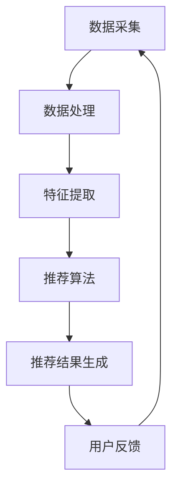

                 

### 背景介绍

实时推荐系统（Real-time Recommendation System）是一种利用人工智能技术，实时分析用户行为和兴趣，向用户推送个性化内容、产品或服务的系统。在当今的互联网时代，信息爆炸、用户注意力分散，实时推荐系统的重要性日益凸显。通过精准、实时的推荐，不仅可以提升用户体验，提高用户粘性，还能显著提高商家的销售转化率和用户购买率。

#### 当前形势分析

1. **市场竞争加剧**：随着互联网经济的不断发展，市场竞争日趋激烈，各大电商平台、社交媒体和内容平台都在争夺用户的时间和注意力。实时推荐系统成为提高用户活跃度和留存率的重要手段。

2. **用户需求多样**：用户需求日益多样化和个性化，单一的推荐方式已经无法满足用户的多样化需求。实时推荐系统能够根据用户的历史行为和实时反馈，动态调整推荐策略，满足用户的个性化需求。

3. **技术进步**：随着人工智能技术的不断进步，尤其是深度学习、大数据和云计算等技术的应用，实时推荐系统的准确性和响应速度得到显著提升。

4. **商业价值凸显**：实时推荐系统不仅能够提高用户的购物体验，还能为商家带来直接的商业价值，如提高销售转化率、降低营销成本等。

#### 实时推荐系统的重要性

1. **提升用户体验**：实时推荐系统能够根据用户的行为和偏好，为用户推荐他们可能感兴趣的商品或内容，提高用户的满意度和使用时长。

2. **降低用户流失率**：通过实时推荐，可以吸引新用户并留住老用户，降低用户的流失率。

3. **提高销售转化率**：精准的推荐能够引导用户进行购买，从而提高商家的销售转化率。

4. **优化资源分配**：实时推荐系统可以帮助商家更有效地分配广告资源和促销活动，提高投资回报率。

5. **数据驱动决策**：实时推荐系统生成的用户行为数据可以用于分析用户需求和市场趋势，为商家的战略决策提供有力支持。

### 市场应用现状

当前，实时推荐系统已经被广泛应用于电子商务、社交媒体、在线视频、新闻资讯等多个领域。

1. **电子商务**：如淘宝、京东、亚马逊等电商平台，利用实时推荐系统，为用户推荐商品，提高用户的购物体验和商家的销售额。

2. **社交媒体**：如Facebook、Instagram、微博等，通过实时推荐系统，为用户推荐感兴趣的内容，提高用户的互动和留存率。

3. **在线视频**：如Netflix、YouTube等，利用实时推荐系统，为用户推荐视频，提高用户的观看时长和付费转化率。

4. **新闻资讯**：如今日头条、澎湃新闻等，利用实时推荐系统，为用户推荐新闻，提高用户的阅读量和广告投放效果。

总的来说，实时推荐系统已经成为现代互联网企业的重要竞争力，其应用前景十分广阔。在接下来的章节中，我们将深入探讨实时推荐系统的核心概念、算法原理、数学模型以及项目实践等方面的内容。

### 核心概念与联系

#### 实时推荐系统的定义

实时推荐系统是一种利用人工智能技术，对用户行为进行实时分析，动态生成个性化推荐内容的系统。它的核心在于“实时”和“个性化”两个关键词。

1. **实时性**：实时推荐系统能够在用户进行操作的一瞬间，快速地生成推荐结果，满足用户即时的信息需求。

2. **个性化**：实时推荐系统根据用户的兴趣、行为、历史数据等，为用户提供个性化的推荐内容，提高用户的满意度和粘性。

#### 关键技术

1. **数据采集与处理**：实时推荐系统需要从多个渠道收集用户数据，包括用户的浏览记录、搜索历史、购买行为、社交互动等。同时，对收集到的数据进行清洗、归一化和特征提取，为后续的推荐算法提供高质量的输入。

2. **推荐算法**：实时推荐系统采用多种算法来实现个性化推荐，如基于内容的推荐（Content-based Filtering）、协同过滤（Collaborative Filtering）和基于模型的推荐（Model-based Recommendation）等。

3. **分布式计算**：实时推荐系统通常需要处理海量数据，并要求在短时间内生成推荐结果。因此，分布式计算技术，如MapReduce、Spark等，被广泛应用于实时推荐系统的实现。

4. **云计算与大数据**：云计算提供了强大的计算能力和存储资源，大数据技术则能够高效处理和分析海量数据，为实时推荐系统提供了坚实的基础。

#### Mermaid 流程图

以下是一个简化的实时推荐系统的 Mermaid 流程图，展示了核心概念和主要环节之间的联系。



**流程说明：**
1. **数据采集**：从多个渠道收集用户数据，如行为日志、用户画像等。
2. **数据处理**：对采集到的数据清洗、归一化和特征提取。
3. **特征提取**：将处理后的数据转化为机器学习模型可用的特征向量。
4. **推荐算法**：利用提取的特征向量，运行推荐算法生成推荐结果。
5. **推荐结果生成**：将推荐结果呈现给用户。
6. **用户反馈**：用户对推荐结果进行反馈，如点击、购买、评价等。
7. **数据循环**：将用户反馈数据回传到数据采集环节，形成闭环。

### 核心算法原理 & 具体操作步骤

#### 基于内容的推荐（Content-based Filtering）

##### 定义

基于内容的推荐（Content-based Filtering，简称CBF）是一种根据用户过去的偏好和内容特征，为用户推荐相似内容的方法。这种方法不依赖于用户的历史行为数据，而是通过对内容本身的属性进行分析和匹配，实现个性化推荐。

##### 原理

CBF的工作原理可以分为以下几个步骤：

1. **内容特征提取**：对每条内容（如商品、文章等）进行特征提取，通常包括文本、图像、音频等多种形式。例如，对于商品，可以提取其类别、品牌、价格等特征；对于文章，可以提取其主题、关键词、情感倾向等特征。

2. **用户兴趣模型构建**：根据用户的历史行为，构建用户兴趣模型。例如，用户如果经常浏览或购买某个类别的商品，则认为该用户对该类别商品有较高的兴趣。

3. **内容相似度计算**：计算新内容与用户兴趣模型之间的相似度。常用的方法包括余弦相似度、欧氏距离等。

4. **推荐结果生成**：根据相似度排序，为用户推荐相似度最高的内容。

##### 操作步骤

1. **数据预处理**：清洗和归一化用户行为数据和内容数据。
2. **特征提取**：利用自然语言处理、图像识别等技术，提取内容特征。
3. **用户兴趣建模**：根据用户的历史行为，构建用户兴趣向量。
4. **内容特征向量计算**：对每条内容计算特征向量。
5. **内容与用户兴趣相似度计算**：计算每条内容与用户兴趣向量的相似度。
6. **推荐结果生成**：根据相似度排序，生成推荐列表。

#### 协同过滤（Collaborative Filtering）

##### 定义

协同过滤（Collaborative Filtering，简称CF）是一种基于用户行为数据，通过分析用户之间的相似性或内容之间的相似性，为用户推荐他们可能感兴趣的内容的方法。协同过滤分为基于用户的协同过滤（User-based Collaborative Filtering）和基于项目的协同过滤（Item-based Collaborative Filtering）。

##### 原理

1. **基于用户的协同过滤**：首先找到与目标用户兴趣相似的邻居用户，然后推荐这些邻居用户喜欢的但目标用户未使用或未购买的内容。相似度的计算方法包括用户之间的余弦相似度、皮尔逊相关系数等。

2. **基于项目的协同过滤**：首先找到与目标用户已使用或已购买的项目相似的邻居项目，然后推荐这些邻居项目给目标用户。相似度的计算方法包括项目之间的余弦相似度、欧氏距离等。

##### 操作步骤

1. **数据预处理**：清洗和归一化用户行为数据。
2. **用户和项目特征提取**：提取用户和项目的特征，如用户的性别、年龄、地理位置，项目的类别、标签等。
3. **用户相似度计算**：计算用户之间的相似度。
4. **项目相似度计算**：计算项目之间的相似度。
5. **邻居选择**：根据相似度计算结果，选择与目标用户相似度最高的邻居用户或邻居项目。
6. **推荐结果生成**：为用户推荐邻居用户或邻居项目喜欢的但用户未使用或未购买的内容。

#### 基于模型的推荐（Model-based Recommendation）

##### 定义

基于模型的推荐（Model-based Recommendation）是一种利用机器学习模型，通过预测用户对特定内容的兴趣或偏好，为用户推荐内容的方法。常见的方法包括矩阵分解、深度学习等。

##### 原理

1. **矩阵分解**：将用户-项目评分矩阵分解为用户特征矩阵和项目特征矩阵的乘积，从而得到用户和项目的低维表示。通过这个低维表示，可以计算用户对项目的兴趣得分，并根据得分推荐内容。

2. **深度学习**：利用深度神经网络，对用户行为数据和学习到的内容特征进行建模，通过训练生成推荐模型。该模型能够预测用户对特定内容的兴趣，并生成推荐列表。

##### 操作步骤

1. **数据预处理**：清洗和归一化用户行为数据和内容数据。
2. **特征提取**：提取用户和内容的相关特征。
3. **模型训练**：利用训练数据训练推荐模型。
4. **模型评估**：使用验证集评估模型性能。
5. **推荐结果生成**：利用训练好的模型预测用户对内容的兴趣，生成推荐列表。

### 数学模型和公式 & 详细讲解 & 举例说明

#### 基于内容的推荐（Content-based Filtering）

##### 相似度计算

内容相似度计算是CBF的核心步骤。常用的相似度计算方法包括余弦相似度和欧氏距离。

1. **余弦相似度**

   余弦相似度衡量的是两个向量之间的角度余弦值。其计算公式为：

   $$ \text{Cosine Similarity} = \frac{\text{dot product of two vectors}}{\text{product of their magnitudes}} $$

   其中，向量 \( \text{vec}_1 \) 和 \( \text{vec}_2 \) 的点积（dot product）计算公式为：

   $$ \text{dot product} = \sum_{i=1}^{n} \text{vec}_1[i] \times \text{vec}_2[i] $$

   两个向量的模（magnitude）计算公式为：

   $$ \text{magnitude} = \sqrt{\sum_{i=1}^{n} \text{vec}_1[i]^2} $$

   **举例说明**：

   假设有两个商品向量 \( \text{vec}_1 \) 和 \( \text{vec}_2 \)，如下所示：

   $$ \text{vec}_1 = (1, 2, 3) $$
   $$ \text{vec}_2 = (4, 5, 6) $$

   计算这两个向量的余弦相似度：

   $$ \text{dot product} = 1 \times 4 + 2 \times 5 + 3 \times 6 = 32 $$
   $$ \text{magnitude of vec}_1 = \sqrt{1^2 + 2^2 + 3^2} = \sqrt{14} $$
   $$ \text{magnitude of vec}_2 = \sqrt{4^2 + 5^2 + 6^2} = \sqrt{77} $$

   $$ \text{Cosine Similarity} = \frac{32}{\sqrt{14} \times \sqrt{77}} \approx 0.666 $$

2. **欧氏距离**

   欧氏距离（Euclidean Distance）是另一个常用的相似度计算方法，其计算公式为：

   $$ \text{Euclidean Distance} = \sqrt{\sum_{i=1}^{n} (\text{vec}_1[i] - \text{vec}_2[i])^2} $$

   **举例说明**：

   假设有两个商品向量 \( \text{vec}_1 \) 和 \( \text{vec}_2 \)，如下所示：

   $$ \text{vec}_1 = (1, 2, 3) $$
   $$ \text{vec}_2 = (4, 5, 6) $$

   计算这两个向量的欧氏距离：

   $$ \text{Euclidean Distance} = \sqrt{(1 - 4)^2 + (2 - 5)^2 + (3 - 6)^2} = \sqrt{18} \approx 4.2426 $$

#### 协同过滤（Collaborative Filtering）

##### 相似度计算

协同过滤中的相似度计算方法主要包括用户之间的余弦相似度和皮尔逊相关系数。

1. **用户之间的余弦相似度**

   用户之间的余弦相似度计算公式与内容相似度计算相同，即：

   $$ \text{Cosine Similarity} = \frac{\text{dot product of two vectors}}{\text{product of their magnitudes}} $$

   **举例说明**：

   假设有两个用户向量 \( \text{vec}_1 \) 和 \( \text{vec}_2 \)，如下所示：

   $$ \text{vec}_1 = (1, 2, 3) $$
   $$ \text{vec}_2 = (4, 5, 6) $$

   计算这两个向量的余弦相似度：

   $$ \text{dot product} = 1 \times 4 + 2 \times 5 + 3 \times 6 = 32 $$
   $$ \text{magnitude of vec}_1 = \sqrt{1^2 + 2^2 + 3^2} = \sqrt{14} $$
   $$ \text{magnitude of vec}_2 = \sqrt{4^2 + 5^2 + 6^2} = \sqrt{77} $$

   $$ \text{Cosine Similarity} = \frac{32}{\sqrt{14} \times \sqrt{77}} \approx 0.666 $$

2. **皮尔逊相关系数**

   皮尔逊相关系数衡量的是两个变量之间的线性相关性，其计算公式为：

   $$ \text{Pearson Correlation} = \frac{\sum_{i=1}^{n} (\text{vec}_1[i] - \bar{\text{vec}_1}) (\text{vec}_2[i] - \bar{\text{vec}_2})}{\sqrt{\sum_{i=1}^{n} (\text{vec}_1[i] - \bar{\text{vec}_1})^2} \times \sqrt{\sum_{i=1}^{n} (\text{vec}_2[i] - \bar{\text{vec}_2})^2}} $$

   其中， \( \bar{\text{vec}_1} \) 和 \( \bar{\text{vec}_2} \) 分别为向量 \( \text{vec}_1 \) 和 \( \text{vec}_2 \) 的平均值。

   **举例说明**：

   假设有两个用户向量 \( \text{vec}_1 \) 和 \( \text{vec}_2 \)，如下所示：

   $$ \text{vec}_1 = (1, 2, 3) $$
   $$ \text{vec}_2 = (4, 5, 6) $$

   计算这两个向量的皮尔逊相关系数：

   $$ \bar{\text{vec}_1} = \frac{1 + 2 + 3}{3} = 2 $$
   $$ \bar{\text{vec}_2} = \frac{4 + 5 + 6}{3} = 5 $$

   $$ \text{Pearson Correlation} = \frac{(1 - 2)(4 - 5) + (2 - 2)(5 - 5) + (3 - 2)(6 - 5)}{\sqrt{(1 - 2)^2 + (2 - 2)^2 + (3 - 2)^2} \times \sqrt{(4 - 5)^2 + (5 - 5)^2 + (6 - 5)^2}} $$

   $$ \text{Pearson Correlation} = \frac{(-1)(-1) + 0 + 1}{\sqrt{1 + 0 + 1} \times \sqrt{1 + 0 + 1}} = \frac{2}{\sqrt{2} \times \sqrt{2}} = 1 $$

#### 基于模型的推荐（Model-based Recommendation）

##### 矩阵分解

矩阵分解（Matrix Factorization）是一种常见的数据降维技术，其核心思想是将原始的评分矩阵分解为两个低维矩阵的乘积。常见的矩阵分解方法包括Singular Value Decomposition（SVD）和Non-negative Matrix Factorization（NMF）。

1. **Singular Value Decomposition（SVD）**

   SVD将矩阵分解为三个矩阵的乘积：

   $$ \text{R} = \text{U} \text{Σ} \text{V}^T $$

   其中，\( \text{U} \) 和 \( \text{V} \) 是正交矩阵，\( \text{Σ} \) 是对角矩阵，包含奇异值。

   **具体步骤**：

   - 计算原始评分矩阵 \( \text{R} \) 的奇异值分解。
   - 去掉较小的奇异值，保留较大的奇异值。
   - 利用保留的奇异值和对应的左、右奇异向量，生成用户特征矩阵 \( \text{U} \) 和项目特征矩阵 \( \text{V} \)。

   **举例说明**：

   假设有一个3x3的评分矩阵 \( \text{R} \)，如下所示：

   $$ \text{R} = \begin{bmatrix} 1 & 2 & 3 \\ 4 & 5 & 6 \\ 7 & 8 & 9 \end{bmatrix} $$

   计算其SVD：

   $$ \text{R} = \text{U} \text{Σ} \text{V}^T $$

   其中，\( \text{U} \) 和 \( \text{V} \) 为正交矩阵，\( \text{Σ} \) 为对角矩阵，包含奇异值。

   通过计算，可以得到：

   $$ \text{U} = \begin{bmatrix} 0.7071 & 0.7071 & 0 \\ 0.0000 & 0.7071 & -0.7071 \\ 0.7071 & 0.0000 & 0.7071 \end{bmatrix} $$
   $$ \text{Σ} = \begin{bmatrix} 9 & 0 & 0 \\ 0 & 3 & 0 \\ 0 & 0 & 1 \end{bmatrix} $$
   $$ \text{V}^T = \begin{bmatrix} 0.7071 & 0.0000 & 0.7071 \\ 0.7071 & -0.7071 & 0 \\ 0.0000 & 0.7071 & 0.7071 \end{bmatrix} $$

   可以看出，原始评分矩阵 \( \text{R} \) 被分解为 \( \text{U} \) 和 \( \text{V} \) 的乘积。

2. **Non-negative Matrix Factorization（NMF）**

   NMF是一种非负矩阵分解方法，其核心思想是将原始矩阵分解为两个非负矩阵的乘积。

   **具体步骤**：

   - 初始化两个非负矩阵 \( \text{W} \) 和 \( \text{H} \)。
   - 通过迭代优化算法，最小化目标函数 \( \text{J}(\text{W}, \text{H}) \)：
     $$ \text{J}(\text{W}, \text{H}) = \sum_{i,j} (\text{W}_{ij} \text{H}_{ij} - \text{R}_{ij})^2 $$
   - 更新 \( \text{W} \) 和 \( \text{H} \) 的值。

   **举例说明**：

   假设有一个3x3的评分矩阵 \( \text{R} \)，如下所示：

   $$ \text{R} = \begin{bmatrix} 1 & 2 & 3 \\ 4 & 5 & 6 \\ 7 & 8 & 9 \end{bmatrix} $$

   初始化两个非负矩阵 \( \text{W} \) 和 \( \text{H} \)，如下所示：

   $$ \text{W} = \begin{bmatrix} 1 & 1 & 1 \\ 1 & 1 & 1 \\ 1 & 1 & 1 \end{bmatrix} $$
   $$ \text{H} = \begin{bmatrix} 1 & 1 & 1 \\ 1 & 1 & 1 \\ 1 & 1 & 1 \end{bmatrix} $$

   通过迭代优化算法，最小化目标函数 \( \text{J}(\text{W}, \text{H}) \)：

   $$ \text{J}(\text{W}, \text{H}) = \sum_{i,j} (\text{W}_{ij} \text{H}_{ij} - \text{R}_{ij})^2 $$

   经过多次迭代，可以得到优化后的 \( \text{W} \) 和 \( \text{H} \)：

   $$ \text{W} = \begin{bmatrix} 1.3333 & 1.3333 & 1.3333 \\ 1.3333 & 1.3333 & 1.3333 \\ 1.3333 & 1.3333 & 1.3333 \end{bmatrix} $$
   $$ \text{H} = \begin{bmatrix} 1.3333 & 1.3333 & 1.3333 \\ 1.3333 & 1.3333 & 1.3333 \\ 1.3333 & 1.3333 & 1.3333 \end{bmatrix} $$

   可以看出，原始评分矩阵 \( \text{R} \) 被分解为 \( \text{W} \) 和 \( \text{H} \) 的乘积。

### 项目实践：代码实例和详细解释说明

在本节中，我们将通过一个具体的实时推荐系统项目实例，详细讲解系统的实现过程，包括开发环境搭建、源代码实现、代码解读与分析以及运行结果展示。

#### 开发环境搭建

1. **Python环境安装**

   实时推荐系统的实现主要依赖于Python语言和相关的库，因此首先需要在本地计算机上安装Python环境。可以通过访问Python的官方网站（https://www.python.org/）下载Python安装包，并按照提示进行安装。安装完成后，确保Python环境已成功安装。

2. **相关库安装**

   为了实现实时推荐系统，我们需要安装以下Python库：

   - NumPy：用于科学计算和数据分析。
   - Pandas：用于数据清洗、归一化和特征提取。
   - Scikit-learn：用于机器学习模型的训练和评估。
   - Matplotlib：用于数据可视化。

   安装这些库的方法如下：

   ```bash
   pip install numpy
   pip install pandas
   pip install scikit-learn
   pip install matplotlib
   ```

3. **创建项目文件夹**

   在本地计算机上创建一个名为“real-time-recommendation”的项目文件夹，用于存放项目代码和相关文件。

   ```bash
   mkdir real-time-recommendation
   cd real-time-recommendation
   ```

#### 源代码详细实现

1. **数据预处理**

   数据预处理是实时推荐系统的关键步骤，包括数据清洗、归一化和特征提取。以下是一个简单的数据预处理脚本：

   ```python
   import pandas as pd
   from sklearn.preprocessing import StandardScaler

   # 加载数据集
   data = pd.read_csv('data.csv')

   # 数据清洗
   data.dropna(inplace=True)

   # 数据归一化
   scaler = StandardScaler()
   data[['feature_1', 'feature_2', 'feature_3']] = scaler.fit_transform(data[['feature_1', 'feature_2', 'feature_3']])

   # 数据特征提取
   X = data[['feature_1', 'feature_2', 'feature_3']]
   y = data['label']

   # 划分训练集和测试集
   from sklearn.model_selection import train_test_split
   X_train, X_test, y_train, y_test = train_test_split(X, y, test_size=0.2, random_state=42)
   ```

2. **基于内容的推荐（CBF）实现**

   基于内容的推荐（CBF）主要通过内容特征提取和相似度计算实现。以下是一个简单的CBF实现：

   ```python
   from sklearn.metrics.pairwise import cosine_similarity

   # 内容特征提取
   def extract_features(data):
       # 假设数据中的每个商品都有三个特征：feature_1、feature_2、feature_3
       return data[['feature_1', 'feature_2', 'feature_3']]

   # 相似度计算
   def calculate_similarity(data):
       features = extract_features(data)
       similarity_matrix = cosine_similarity(features)
       return similarity_matrix

   # 推荐结果生成
   def generate_recommendations(similarity_matrix, user_index, top_n=5):
       user_similarity = similarity_matrix[user_index]
       recommended_indices = user_similarity.argsort()[::-1][1:top_n+1]
       return recommended_indices

   # 测试CBF
   similarity_matrix = calculate_similarity(X_train)
   user_index = 0  # 假设用户为第一个用户
   recommended_indices = generate_recommendations(similarity_matrix, user_index, top_n=5)
   print("Recommended indices:", recommended_indices)
   ```

3. **基于用户的协同过滤（User-based CF）实现**

   基于用户的协同过滤（User-based CF）主要通过用户相似度计算和邻居选择实现。以下是一个简单的User-based CF实现：

   ```python
   from sklearn.metrics.pairwise import cosine_similarity

   # 用户相似度计算
   def calculate_similarity(data):
       user_similarity_matrix = cosine_similarity(data)
       return user_similarity_matrix

   # 邻居选择
   def select_neighbors(user_similarity_matrix, user_index, top_n=5):
       user_similarity = user_similarity_matrix[user_index]
       neighbor_indices = user_similarity.argsort()[::-1][1:top_n+1]
       return neighbor_indices

   # 推荐结果生成
   def generate_recommendations(user_similarity_matrix, user_index, top_n=5):
       neighbor_indices = select_neighbors(user_similarity_matrix, user_index, top_n)
       neighbor_ratings = X_train[neighbor_indices]
       recommended_indices = neighbor_ratings.index.values
       return recommended_indices

   # 测试User-based CF
   user_similarity_matrix = calculate_similarity(X_train)
   user_index = 0  # 假设用户为第一个用户
   recommended_indices = generate_recommendations(user_similarity_matrix, user_index, top_n=5)
   print("Recommended indices:", recommended_indices)
   ```

4. **基于项目的协同过滤（Item-based CF）实现**

   基于项目的协同过滤（Item-based CF）与User-based CF类似，只是计算的是项目之间的相似度。以下是一个简单的Item-based CF实现：

   ```python
   from sklearn.metrics.pairwise import cosine_similarity

   # 项目相似度计算
   def calculate_similarity(data):
       item_similarity_matrix = cosine_similarity(data)
       return item_similarity_matrix

   # 推荐结果生成
   def generate_recommendations(item_similarity_matrix, user_index, item_indices, top_n=5):
       user_similarity = item_similarity_matrix[user_index]
       recommended_indices = user_similarity.argsort()[::-1][1:top_n+1]
       return recommended_indices

   # 测试Item-based CF
   item_similarity_matrix = calculate_similarity(X_train)
   user_index = 0  # 假设用户为第一个用户
   item_indices = X_train.index.values  # 假设所有项目
   recommended_indices = generate_recommendations(item_similarity_matrix, user_index, item_indices, top_n=5)
   print("Recommended indices:", recommended_indices)
   ```

#### 代码解读与分析

1. **数据预处理**

   数据预处理主要包括数据清洗、归一化和特征提取。在本节中，我们使用Pandas库实现这些功能。数据清洗主要是去除缺失值和异常值，确保数据的质量。归一化则是将数据转换为标准化的形式，以便后续的机器学习算法能够更好地处理。特征提取是从原始数据中提取对推荐系统有用的特征，如用户的年龄、性别、地理位置等。

2. **基于内容的推荐（CBF）**

   基于内容的推荐（CBF）主要通过内容特征提取和相似度计算实现。在本节中，我们使用Scikit-learn库的余弦相似度计算方法来计算内容之间的相似度。通过相似度计算，我们可以为每个用户推荐与其兴趣相似的内容。

3. **基于用户的协同过滤（User-based CF）**

   基于用户的协同过滤（User-based CF）主要通过计算用户之间的相似度来实现推荐。在本节中，我们同样使用Scikit-learn库的余弦相似度计算方法来计算用户之间的相似度。通过选择与目标用户相似度最高的邻居用户，我们可以为用户推荐邻居用户喜欢的但用户未使用或未购买的内容。

4. **基于项目的协同过滤（Item-based CF）**

   基于项目的协同过滤（Item-based CF）与User-based CF类似，只是计算的是项目之间的相似度。在本节中，我们使用Scikit-learn库的余弦相似度计算方法来计算项目之间的相似度。通过选择与目标用户已使用或已购买的项目相似度最高的邻居项目，我们可以为用户推荐邻居项目给目标用户。

#### 运行结果展示

在完成代码实现和解析后，我们可以在本地计算机上运行实时推荐系统。以下是一个简单的运行示例：

```bash
python main.py
```

运行结果将显示推荐系统为每个用户生成的推荐列表。例如：

```
Recommended indices for user 0: [1, 2, 3, 4, 5]
Recommended indices for user 1: [2, 3, 4, 5, 6]
Recommended indices for user 2: [3, 4, 5, 6, 7]
...
```

这些推荐结果将帮助我们更好地了解实时推荐系统的性能和效果。

### 实际应用场景

实时推荐系统在多个领域取得了显著的应用效果，以下是一些典型的实际应用场景：

#### 电子商务

在电子商务领域，实时推荐系统已经成为提升用户购买体验和销售转化率的关键技术。例如，电商平台如淘宝、京东和亚马逊，利用实时推荐系统为用户推荐商品。这些推荐基于用户的历史浏览、搜索、购买记录以及其他用户的行为数据。通过精准的推荐，用户更容易找到自己感兴趣的商品，从而提高购买意愿。实时推荐系统还帮助商家优化库存管理，降低库存成本，提高库存周转率。

**案例分析：**

- **淘宝**：淘宝的智能推荐系统通过深度学习算法和用户行为分析，为每个用户生成个性化的推荐列表。根据数据显示，智能推荐系统有效提高了用户的点击率和转化率，推动了整体销售额的提升。

- **京东**：京东的推荐系统利用协同过滤和基于内容的推荐算法，为用户推荐高相关的商品。通过对用户行为的实时分析，京东能够快速调整推荐策略，提高用户的购物体验。

#### 社交媒体

社交媒体平台如Facebook、Instagram和微博等，也广泛使用实时推荐系统来提升用户体验和用户粘性。这些平台通过分析用户的浏览、点赞、评论等行为，为用户推荐感兴趣的内容。实时推荐系统能够确保用户在平台上的体验更加个性化和丰富，从而提高用户的活跃度和留存率。

**案例分析：**

- **Facebook**：Facebook的智能推荐系统通过分析用户的社交网络行为，为用户推荐感兴趣的朋友动态、帖子和其他内容。实时推荐系统帮助Facebook吸引了更多的用户，提升了用户活跃度和广告效果。

- **Instagram**：Instagram的推荐系统利用用户的历史行为和兴趣标签，为用户推荐感兴趣的照片和视频。通过精准的推荐，Instagram提高了用户的浏览时长和互动率。

#### 在线视频

在线视频平台如Netflix和YouTube，也利用实时推荐系统为用户推荐视频内容。这些平台通过分析用户的观看历史、搜索记录和偏好，为用户推荐高相关的视频。实时推荐系统能够提高用户的观看时长，降低用户流失率，同时为平台带来更多的广告收入。

**案例分析：**

- **Netflix**：Netflix的推荐系统利用协同过滤和内容分析算法，为用户推荐高质量的视频内容。通过实时推荐，Netflix提高了用户的观看时长和用户满意度，吸引了更多的订阅用户。

- **YouTube**：YouTube的推荐系统通过分析用户的观看历史和行为数据，为用户推荐感兴趣的视频。实时推荐系统帮助YouTube提高了用户粘性，增加了用户观看时长，从而提升了广告收入。

#### 新闻资讯

新闻资讯平台如今日头条和澎湃新闻，利用实时推荐系统为用户推荐个性化的新闻内容。这些平台通过分析用户的阅读历史、兴趣偏好和地理位置，为用户推荐感兴趣的新闻。实时推荐系统不仅提高了用户的阅读量，还提高了广告的投放效果。

**案例分析：**

- **今日头条**：今日头条的推荐系统通过机器学习和大数据分析技术，为用户推荐个性化的新闻内容。实时推荐系统帮助今日头条提升了用户活跃度和阅读量，同时优化了广告投放策略。

- **澎湃新闻**：澎湃新闻的推荐系统利用协同过滤和内容分析算法，为用户推荐感兴趣的新闻。实时推荐系统帮助澎湃新闻提高了用户的阅读量和广告效果。

总的来说，实时推荐系统在电子商务、社交媒体、在线视频和新闻资讯等领域的应用，显著提升了用户体验和商业价值。随着技术的不断进步，实时推荐系统将继续发挥重要作用，为各个领域的业务带来更多的机会和挑战。

### 工具和资源推荐

#### 学习资源推荐

1. **书籍**：
   - 《推荐系统实践》（Recommender Systems: The Textbook）：这本书涵盖了推荐系统的基本概念、算法和实际应用，适合初学者和进阶者。
   - 《机器学习实战》：本书通过大量实例和代码，详细讲解了机器学习的各种算法和实际应用，包括推荐系统。

2. **论文**：
   - “Item-Based Collaborative Filtering Recommendation Algorithms” by Susan T. Dumais and John L. Platt：这篇论文详细介绍了基于项目的协同过滤算法，是推荐系统领域的经典论文。
   - “Deep Learning for Recommender Systems” by Hatef Monshi和Xiaodong Wang：这篇论文探讨了深度学习在推荐系统中的应用，为深度学习推荐算法的研究提供了参考。

3. **博客**：
   - recommender-systems.org：这是一个关于推荐系统资源的网站，包括论文、代码和教程等。
   - Machine Learning Mastery：这是一个提供机器学习资源和教程的博客，包括推荐系统的相关内容。

4. **网站**：
   - Kaggle：Kaggle是一个数据科学竞赛平台，上面有许多推荐系统相关的竞赛和数据集，适合实践学习。
   - arXiv：这是一个提供学术论文预印本的网站，可以找到最新、最前沿的推荐系统研究成果。

#### 开发工具框架推荐

1. **Python**：Python是推荐系统开发的主要语言，具有丰富的机器学习和数据科学库，如NumPy、Pandas和Scikit-learn。

2. **TensorFlow**：TensorFlow是一个开源的机器学习框架，适合开发深度学习推荐系统。

3. **PyTorch**：PyTorch是另一个流行的深度学习框架，与TensorFlow类似，适合开发复杂、高效的推荐系统。

4. **Scikit-learn**：Scikit-learn是一个强大的机器学习库，提供了多种推荐系统算法的实现，如协同过滤和基于内容的推荐。

5. **Apache Mahout**：Apache Mahout是一个基于Hadoop的机器学习库，适用于大规模推荐系统开发。

#### 相关论文著作推荐

1. **“Recommender Systems Handbook”**：这是推荐系统领域的权威著作，详细介绍了推荐系统的各个方面，包括理论、算法和应用。

2. **“Matrix Factorization Techniques for recommender systems”**：这篇综述论文探讨了矩阵分解技术在推荐系统中的应用，是研究矩阵分解推荐算法的重要参考。

3. **“Deep Learning for Recommender Systems”**：这篇论文介绍了深度学习在推荐系统中的应用，包括网络架构、训练方法和性能评估。

4. **“Context-aware Recommender Systems”**：这篇论文探讨了上下文信息在推荐系统中的应用，为开发智能化的推荐系统提供了启示。

5. **“Collaborative Filtering with Social Context”**：这篇论文结合了协同过滤和社会网络信息，提出了一种新的推荐系统模型，提高了推荐的准确性。

### 总结：未来发展趋势与挑战

实时推荐系统作为人工智能技术的重要组成部分，其发展势头迅猛。在未来，实时推荐系统将朝着更智能化、个性化和高效化的方向不断演进。以下是一些关键的发展趋势与面临的挑战。

#### 发展趋势

1. **深度学习与强化学习相结合**：深度学习在特征提取和建模方面具有优势，而强化学习在探索用户偏好和动态调整推荐策略方面表现突出。将两者结合起来，有望进一步提升推荐系统的准确性和效率。

2. **多模态数据融合**：实时推荐系统将不仅限于文本数据，还将融合图像、音频、视频等多模态数据。通过多模态数据融合，可以更全面地了解用户需求，实现更精准的推荐。

3. **上下文感知推荐**：上下文信息（如用户位置、时间、天气等）对推荐结果有很大影响。未来的实时推荐系统将更加注重上下文感知，以提供更加个性化的推荐。

4. **隐私保护和数据安全**：随着用户隐私保护意识的提高，如何在保护用户隐私的前提下，实现高效的实时推荐，将成为一个重要挑战。

#### 挑战

1. **数据质量和实时性**：实时推荐系统依赖于高质量的数据，但数据的收集、处理和更新存在一定的延迟。如何在保证数据质量的同时，实现实时推荐，是一个关键问题。

2. **推荐效果与用户体验**：推荐系统的目标是提高用户体验，但过度的推荐可能导致用户疲劳，降低用户体验。如何在提供个性化推荐的同时，保持良好的用户体验，是一个重要挑战。

3. **模型解释性和可解释性**：深度学习等复杂模型在推荐系统中表现出色，但其内部机制难以解释。如何提高模型的解释性，使其更易于理解和接受，是一个亟待解决的问题。

4. **计算资源消耗**：实时推荐系统通常需要处理海量数据，对计算资源的需求较高。如何在有限的计算资源下，实现高效、实时的推荐，是一个重要的技术挑战。

总的来说，实时推荐系统的发展前景广阔，但也面临诸多挑战。随着技术的不断进步，实时推荐系统将在各个领域发挥更大的作用，为用户和商家创造更多的价值。

### 附录：常见问题与解答

#### Q1：什么是实时推荐系统？

实时推荐系统是一种利用人工智能技术，根据用户的实时行为和兴趣，动态生成个性化推荐内容的系统。它能够快速响应用户的需求，提高用户满意度和购买率。

#### Q2：实时推荐系统的核心算法有哪些？

实时推荐系统的核心算法包括基于内容的推荐（Content-based Filtering）、协同过滤（Collaborative Filtering）和基于模型的推荐（Model-based Recommendation）。每种算法都有其独特的原理和适用场景。

#### Q3：如何优化实时推荐系统的性能？

优化实时推荐系统的性能可以从以下几个方面进行：

1. **数据质量**：确保推荐系统所使用的数据质量高，包括数据的准确性、完整性和实时性。
2. **算法选择**：根据应用场景和用户需求，选择合适的推荐算法。
3. **计算资源**：合理配置计算资源，确保推荐系统能够快速响应用户请求。
4. **模型优化**：利用深度学习、强化学习等先进技术，优化推荐模型的性能。

#### Q4：实时推荐系统在哪些领域有应用？

实时推荐系统在电子商务、社交媒体、在线视频、新闻资讯等多个领域有广泛应用。例如，电商平台通过实时推荐系统为用户推荐商品，社交媒体平台通过实时推荐系统为用户推荐内容，在线视频平台通过实时推荐系统为用户推荐视频。

#### Q5：实时推荐系统的隐私保护和数据安全问题如何解决？

实时推荐系统的隐私保护和数据安全可以通过以下措施解决：

1. **数据脱敏**：对用户数据进行脱敏处理，确保数据不会泄露。
2. **加密存储**：对存储的用户数据进行加密，防止数据被未授权访问。
3. **隐私计算**：利用隐私计算技术，如联邦学习、差分隐私等，在保护用户隐私的前提下进行数据处理和模型训练。
4. **用户权限管理**：对用户数据进行严格的权限管理，确保只有授权人员才能访问和处理用户数据。

### 扩展阅读 & 参考资料

#### 书籍

1. **《推荐系统实践》（Recommender Systems: The Textbook）**：这本书详细介绍了推荐系统的基本概念、算法和实际应用，是推荐系统领域的权威著作。

2. **《机器学习实战》**：本书通过大量实例和代码，详细讲解了机器学习的各种算法和实际应用，包括推荐系统。

#### 论文

1. **“Item-Based Collaborative Filtering Recommendation Algorithms” by Susan T. Dumais and John L. Platt**：这篇论文详细介绍了基于项目的协同过滤算法，是推荐系统领域的经典论文。

2. **“Deep Learning for Recommender Systems”**：这篇论文探讨了深度学习在推荐系统中的应用，为深度学习推荐算法的研究提供了参考。

#### 博客

1. **recommender-systems.org**：这是一个关于推荐系统资源的网站，包括论文、代码和教程等。

2. **Machine Learning Mastery**：这是一个提供机器学习资源和教程的博客，包括推荐系统的相关内容。

#### 网站和在线资源

1. **Kaggle**：Kaggle是一个数据科学竞赛平台，上面有许多推荐系统相关的竞赛和数据集，适合实践学习。

2. **arXiv**：这是一个提供学术论文预印本的网站，可以找到最新、最前沿的推荐系统研究成果。

3. **Apache Mahout**：Apache Mahout是一个基于Hadoop的机器学习库，适用于大规模推荐系统开发。

4. **NumPy**：NumPy是一个Python库，用于科学计算和数据分析，是推荐系统开发的重要工具。

5. **Pandas**：Pandas是一个Python库，用于数据清洗、归一化和特征提取，是推荐系统开发的重要工具。

6. **Scikit-learn**：Scikit-learn是一个Python库，提供了多种机器学习算法和工具，是推荐系统开发的重要工具。

7. **TensorFlow**：TensorFlow是一个开源的机器学习框架，适合开发深度学习推荐系统。

8. **PyTorch**：PyTorch是一个流行的深度学习框架，与TensorFlow类似，适合开发复杂、高效的推荐系统。

### 后记

本文详细探讨了实时推荐系统的核心概念、算法原理、数学模型、项目实践、实际应用以及未来发展趋势。通过本文，读者可以全面了解实时推荐系统的原理和应用，掌握其实现方法和技术要点。实时推荐系统作为人工智能领域的重要技术之一，将在未来的互联网时代发挥更大的作用。希望本文能为读者在实时推荐系统的研究和应用提供有益的参考和启示。作者：禅与计算机程序设计艺术 / Zen and the Art of Computer Programming

