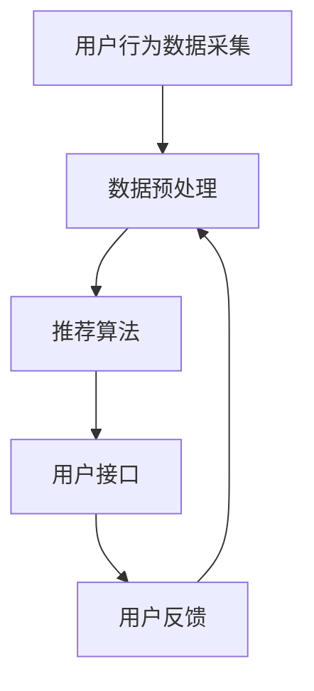

                 

### 背景介绍

#### 1.1 电商行业的现状与发展

在互联网和大数据技术的推动下，电商行业经历了爆炸式增长。根据Statista的数据显示，全球电商市场规模预计到2023年将达到4.9万亿美元。这个庞大的市场背后，是消费者购物行为和习惯的改变。越来越多的消费者选择在线购物，这种趋势促使电商平台不断优化用户体验，提高用户留存率和购买转化率。

实时推荐系统作为电商平台的重要功能之一，正变得越来越关键。实时推荐系统通过分析用户的实时行为数据，如浏览记录、购买历史、搜索关键词等，实时地为用户推荐相关商品。这种个性化的推荐不仅可以增加用户的购买意愿，还能提高电商平台的整体销售额。

#### 1.2 AI在实时推荐系统中的应用

人工智能（AI）在实时推荐系统中发挥着至关重要的作用。传统的推荐算法大多依赖于离线数据处理和模型训练，而AI技术则使得实时推荐成为可能。以下是一些AI技术在实时推荐系统中的应用：

- **深度学习**：通过神经网络模型，如卷积神经网络（CNN）和循环神经网络（RNN），可以自动从大规模数据中学习到复杂的特征，提高推荐精度。
- **强化学习**：通过不断地试错和反馈，强化学习算法能够找到最优的推荐策略，提高用户满意度。
- **关联规则挖掘**：基于关联规则挖掘技术，可以找出商品之间的关联关系，为推荐系统提供有力支持。
- **自然语言处理（NLP）**：通过分析用户的评论、搜索关键词等文本数据，可以更好地理解用户的意图，从而做出更精准的推荐。

#### 1.3 实时推荐的重要性

实时推荐不仅能够提高用户的购物体验，还能带来显著的商业价值。以下是一些实时推荐的重要性：

- **提高用户满意度**：通过实时推荐，用户能够快速找到自己感兴趣的商品，减少购物时间，提升用户体验。
- **增加购买转化率**：精准的实时推荐可以引导用户进行购买，从而提高电商平台的销售额。
- **降低推荐偏差**：传统的推荐系统往往存在一定的偏差，而实时推荐系统能够根据用户的实时行为进行调整，降低推荐偏差。
- **提升用户留存率**：通过实时推荐，电商平台能够更好地满足用户的需求，提高用户对平台的忠诚度。

综上所述，实时推荐系统在电商行业中具有举足轻重的地位，而AI技术的应用则使得实时推荐变得更加高效和精准。接下来，我们将深入探讨实时推荐系统的核心概念与联系，帮助读者更好地理解这一领域的最新进展。

### 核心概念与联系

#### 2.1 实时推荐系统的基本架构

实时推荐系统的基本架构可以分为四个主要部分：数据采集、数据预处理、推荐算法和用户接口。以下是一个简化的架构图，使用Mermaid流程图表示：



#### 2.2 数据采集

数据采集是实时推荐系统的第一步，也是关键的一步。用户的浏览记录、搜索历史、购买行为和社交互动数据等都是重要的数据来源。这些数据可以通过多种渠道收集，如Web服务器日志、用户点击流、社交媒体数据等。

- **用户浏览记录**：记录用户在电商平台上的浏览行为，包括浏览时间、浏览页数、浏览的商品种类等。
- **搜索历史**：记录用户在电商平台的搜索关键词，反映用户的兴趣和需求。
- **购买行为**：记录用户的购买历史，包括购买时间、购买商品种类、购买频率等。
- **社交互动**：记录用户在社交媒体上的互动行为，如点赞、评论、分享等，这些数据可以反映用户之间的兴趣和偏好。

#### 2.3 数据预处理

数据预处理是确保数据质量和推荐效果的关键步骤。在这一阶段，需要对采集到的数据进行清洗、去噪、特征提取等处理。

- **数据清洗**：去除数据中的错误值、缺失值和重复值，保证数据的准确性。
- **去噪**：通过过滤掉噪声数据，如用户偶然的点击行为，提高数据的可信度。
- **特征提取**：将原始数据转化为特征向量，如基于文本的词向量、基于图像的视觉特征等。

#### 2.4 推荐算法

推荐算法是实现实时推荐的核心部分。目前，常见的推荐算法可以分为基于内容推荐、协同过滤推荐和混合推荐等几大类。

- **基于内容推荐**：根据用户的兴趣和行为，推荐与用户兴趣相关的商品。这种方法依赖于对商品内容的分析，如文本描述、标签、分类等。
- **协同过滤推荐**：基于用户的历史行为数据，找到与其他用户相似的用户群体，推荐这些用户群体喜欢的商品。协同过滤推荐可以分为基于用户的协同过滤和基于物品的协同过滤。
- **混合推荐**：结合多种推荐算法的优势，提高推荐效果。例如，将基于内容的推荐和协同过滤推荐相结合，以提高推荐的准确性和多样性。

#### 2.5 用户接口

用户接口是推荐系统与用户之间的交互界面，它需要提供直观、友好的交互方式，让用户能够轻松地浏览、选择和反馈推荐结果。

- **推荐结果展示**：根据用户的兴趣和行为，展示个性化的推荐结果。推荐结果可以以商品列表、卡片式、轮播图等形式展示。
- **用户反馈**：允许用户对推荐结果进行评价和反馈，如点赞、评论、收藏等。用户反馈可以帮助推荐系统不断优化推荐策略，提高用户满意度。

#### 2.6 用户反馈与闭环

用户反馈是实时推荐系统的重要组成部分，通过收集用户的反馈，可以调整推荐策略，提高推荐效果。用户反馈可以分为显式反馈（如用户评价、评分）和隐式反馈（如用户点击、浏览时长等）。

- **显式反馈**：用户可以直接对推荐结果进行评价，如点赞、不喜欢、评论等。显式反馈可以帮助推荐系统了解用户的真实喜好。
- **隐式反馈**：用户的行为数据，如点击、浏览、购买等，都可以被视为对推荐结果的隐式反馈。通过分析这些行为数据，推荐系统可以不断调整推荐策略，提高推荐效果。

实时推荐系统的闭环机制使得推荐系统能够持续优化，从而提高用户满意度、购买转化率和销售额。通过数据采集、数据预处理、推荐算法、用户接口和用户反馈的紧密协作，实时推荐系统能够为用户提供个性化的推荐服务，提升电商平台的核心竞争力。

### 核心算法原理 & 具体操作步骤

实时推荐系统的核心在于算法，它决定了推荐结果的准确性和用户体验。本文将详细介绍几种常用的核心算法原理及其具体操作步骤。

#### 3.1 协同过滤算法

协同过滤算法是实时推荐系统的基石之一。它通过分析用户之间的行为相似性来发现用户的兴趣，进而推荐相关商品。

**原理**：

协同过滤算法分为基于用户的协同过滤（User-based CF）和基于物品的协同过滤（Item-based CF）。

- **基于用户的协同过滤**：找到与目标用户兴趣相似的其他用户，推荐这些用户喜欢的商品。
- **基于物品的协同过滤**：找到与目标用户已购买或喜欢的商品相似的物品，推荐这些物品。

**操作步骤**：

1. **评分矩阵构建**：构建一个用户-物品评分矩阵，矩阵中的每个元素表示用户对某个物品的评分。
2. **相似度计算**：计算用户或物品之间的相似度，常用的相似度度量方法有皮尔逊相关系数、余弦相似度等。
3. **推荐生成**：基于相似度矩阵，生成推荐列表。对于基于用户的协同过滤，找到与目标用户最相似的K个用户，推荐这K个用户喜欢的商品；对于基于物品的协同过滤，找到与目标物品最相似的K个物品，推荐这K个物品。

**示例**：

假设有一个用户-物品评分矩阵如下：

| 用户 | 物品A | 物品B | 物品C | 物品D |
|------|-------|-------|-------|-------|
| 用户1 | 1     | 1     | 0     | 1     |
| 用户2 | 0     | 1     | 1     | 0     |
| 用户3 | 1     | 0     | 1     | 1     |
| 用户4 | 0     | 0     | 1     | 1     |

- **相似度计算**：计算用户1与其他用户的相似度，使用余弦相似度公式：
  $$
  \text{similarity}(u, v) = \frac{u \cdot v}{\|u\| \|v\|}
  $$
  其中，$u$和$v$分别表示用户1和用户2的评分向量。

- **推荐生成**：找到与用户1最相似的3个用户（用户2、用户3和用户4），推荐这3个用户喜欢的商品。

#### 3.2 基于内容的推荐算法

基于内容的推荐算法通过分析商品的内容特征（如文本描述、标签、分类等），为用户推荐具有相似内容的商品。

**原理**：

- **内容特征提取**：将商品文本描述、标签等信息转化为向量表示。
- **相似度计算**：计算用户兴趣向量与商品内容特征向量之间的相似度，通常使用余弦相似度或欧氏距离。
- **推荐生成**：根据相似度计算结果，为用户推荐相似度较高的商品。

**操作步骤**：

1. **内容特征提取**：将商品文本描述、标签等信息转化为向量表示。可以使用词袋模型、TF-IDF、词嵌入等方法。
2. **用户兴趣向量构建**：基于用户的浏览历史、搜索记录等，构建用户兴趣向量。
3. **相似度计算**：计算用户兴趣向量与商品内容特征向量之间的相似度。
4. **推荐生成**：根据相似度计算结果，为用户推荐相似度较高的商品。

**示例**：

假设有两个商品A和商品B，它们的文本描述如下：

- 商品A：高性能笔记本电脑
- 商品B：便携式笔记本电脑

- **内容特征提取**：将两个商品的文本描述转化为向量表示，使用词袋模型：
  $$
  \text{vec}(A) = [1, 1, 0, 0, 1]
  $$
  $$
  \text{vec}(B) = [1, 1, 0, 1, 0]
  $$

- **相似度计算**：计算用户兴趣向量（基于用户的浏览历史）与商品A和商品B的相似度，使用余弦相似度公式：
  $$
  \text{similarity}(u, v) = \frac{u \cdot v}{\|u\| \|v\|}
  $$

- **推荐生成**：根据相似度计算结果，为用户推荐相似度较高的商品。

#### 3.3 混合推荐算法

混合推荐算法结合了协同过滤和基于内容的推荐算法，以综合利用不同算法的优势，提高推荐效果。

**原理**：

- **协同过滤部分**：通过用户行为数据找到相似用户或相似物品，生成初步推荐列表。
- **基于内容部分**：对初步推荐列表中的商品进行内容特征分析，进一步筛选和排序推荐结果。

**操作步骤**：

1. **协同过滤部分**：使用协同过滤算法生成初步推荐列表。
2. **基于内容部分**：对初步推荐列表中的商品进行内容特征提取，计算与用户兴趣向量的相似度。
3. **融合推荐**：将协同过滤和基于内容的相似度结果进行融合，生成最终推荐列表。

**示例**：

假设有一个初步推荐列表，包含以下商品：

- 商品A：高性能笔记本电脑
- 商品B：便携式笔记本电脑
- 商品C：游戏鼠标

- **内容特征提取**：对商品A、商品B和商品C进行内容特征提取，使用词袋模型：
  $$
  \text{vec}(A) = [1, 1, 0, 0, 1]
  $$
  $$
  \text{vec}(B) = [1, 1, 0, 1, 0]
  $$
  $$
  \text{vec}(C) = [0, 0, 1, 1, 0]
  $$

- **相似度计算**：计算用户兴趣向量（基于用户的浏览历史）与商品A、商品B和商品C的相似度，使用余弦相似度公式：
  $$
  \text{similarity}(u, v) = \frac{u \cdot v}{\|u\| \|v\|}
  $$

- **融合推荐**：根据相似度计算结果，结合协同过滤的结果，生成最终推荐列表。

通过上述三种核心算法的详细介绍，我们可以看到实时推荐系统在算法设计上的多样性和复杂性。在实际应用中，可以根据业务需求和数据特点，灵活选择和组合不同算法，以提高推荐效果和用户体验。

### 数学模型和公式 & 详细讲解 & 举例说明

#### 4.1 协同过滤算法的数学模型

协同过滤算法的核心在于相似度计算和推荐生成，其数学模型主要包括相似度计算和推荐得分计算两部分。

**相似度计算**：

假设有一个用户-物品评分矩阵$R \in \mathbb{R}^{m \times n}$，其中$m$表示用户数，$n$表示物品数，$R_{ij}$表示用户$i$对物品$j$的评分。相似度计算公式如下：

$$
\text{similarity}(u, v) = \frac{u \cdot v}{\|u\| \|v\|}
$$

其中，$u$和$v$分别表示用户$i$和用户$j$的评分向量，$\cdot$表示向量的点积，$\|\|$表示向量的模长。

**推荐得分计算**：

基于相似度计算，可以计算用户$i$对物品$j$的推荐得分。推荐得分公式如下：

$$
\text{score}(u, v, j) = \text{similarity}(u, v) \cdot R_{ij}
$$

其中，$R_{ij}$表示用户$i$对物品$j$的实际评分。

**举例说明**：

假设有一个用户-物品评分矩阵如下：

| 用户 | 物品A | 物品B | 物品C | 物品D |
|------|-------|-------|-------|-------|
| 用户1 | 1     | 1     | 0     | 1     |
| 用户2 | 0     | 1     | 1     | 0     |
| 用户3 | 1     | 0     | 1     | 1     |
| 用户4 | 0     | 0     | 1     | 1     |

计算用户1对物品D的推荐得分。

- **相似度计算**：

用户1和用户2的评分向量为：

$$
u = [1, 1, 1, 0]
$$

$$
v = [0, 1, 1, 0]
$$

$$
\text{similarity}(u, v) = \frac{u \cdot v}{\|u\| \|v\|} = \frac{1 \cdot 0 + 1 \cdot 1 + 1 \cdot 1 + 0 \cdot 0}{\sqrt{1^2 + 1^2 + 1^2 + 0^2} \cdot \sqrt{0^2 + 1^2 + 1^2 + 0^2}} = \frac{2}{\sqrt{3} \cdot \sqrt{2}} = \frac{2}{\sqrt{6}}
$$

- **推荐得分计算**：

用户1对物品D的实际评分为0，因此用户1对物品D的推荐得分为：

$$
\text{score}(u, v, j) = \text{similarity}(u, v) \cdot R_{ij} = \frac{2}{\sqrt{6}} \cdot 0 = 0
$$

#### 4.2 基于内容的推荐算法的数学模型

基于内容的推荐算法主要涉及内容特征提取、相似度计算和推荐得分计算。

**内容特征提取**：

假设商品$A$和商品$B$的文本描述分别为$a$和$b$，使用词袋模型表示：

$$
\text{vec}(A) = [w_1, w_2, \ldots, w_n]
$$

$$
\text{vec}(B) = [w_1, w_2, \ldots, w_n]
$$

其中，$w_i$表示第$i$个词的词频。

**相似度计算**：

使用余弦相似度计算商品$A$和商品$B$的内容相似度：

$$
\text{similarity}(A, B) = \frac{\text{vec}(A) \cdot \text{vec}(B)}{\|\text{vec}(A)\| \|\text{vec}(B)\|}
$$

**推荐得分计算**：

基于内容相似度，计算用户对商品$B$的推荐得分：

$$
\text{score}(u, B) = \text{similarity}(A, B) \cdot R_{ij}
$$

其中，$R_{ij}$表示用户对商品$B$的实际评分。

**举例说明**：

假设有两个商品A和B，它们的文本描述分别为：

- 商品A：高性能笔记本电脑
- 商品B：便携式笔记本电脑

- **内容特征提取**：

使用词袋模型表示两个商品的内容特征：

$$
\text{vec}(A) = [1, 1, 0, 0, 1]
$$

$$
\text{vec}(B) = [1, 1, 0, 1, 0]
$$

- **相似度计算**：

$$
\text{similarity}(A, B) = \frac{\text{vec}(A) \cdot \text{vec}(B)}{\|\text{vec}(A)\| \|\text{vec}(B)\|} = \frac{1 \cdot 1 + 1 \cdot 1 + 0 \cdot 0 + 0 \cdot 1 + 1 \cdot 0}{\sqrt{1^2 + 1^2 + 0^2 + 0^2 + 1^2} \cdot \sqrt{1^2 + 1^2 + 0^2 + 1^2 + 0^2}} = \frac{2}{\sqrt{3} \cdot \sqrt{2}} = \frac{2}{\sqrt{6}}
$$

- **推荐得分计算**：

假设用户对商品B的实际评分为5，因此用户对商品B的推荐得分为：

$$
\text{score}(u, B) = \text{similarity}(A, B) \cdot R_{ij} = \frac{2}{\sqrt{6}} \cdot 5 = \frac{10}{\sqrt{6}}
$$

#### 4.3 混合推荐算法的数学模型

混合推荐算法结合了协同过滤和基于内容的推荐算法，其数学模型为：

$$
\text{score}(u, j) = w_1 \cdot \text{score}_{CF}(u, j) + w_2 \cdot \text{score}_{Content}(u, j)
$$

其中，$w_1$和$w_2$分别为协同过滤和基于内容推荐的重要性权重，$\text{score}_{CF}(u, j)$为协同过滤算法得到的推荐得分，$\text{score}_{Content}(u, j)$为基于内容推荐算法得到的推荐得分。

**举例说明**：

假设有一个用户-物品评分矩阵如下：

| 用户 | 物品A | 物品B | 物品C | 物品D |
|------|-------|-------|-------|-------|
| 用户1 | 1     | 1     | 0     | 1     |
| 用户2 | 0     | 1     | 1     | 0     |
| 用户3 | 1     | 0     | 1     | 1     |
| 用户4 | 0     | 0     | 1     | 1     |

使用协同过滤算法和基于内容推荐算法分别计算用户1对物品D的推荐得分，并加权融合。

- **协同过滤算法得分**：

用户1和用户2的评分向量为：

$$
u = [1, 1, 1, 0]
$$

$$
v = [0, 1, 1, 0]
$$

$$
\text{similarity}(u, v) = \frac{u \cdot v}{\|u\| \|v\|} = \frac{1 \cdot 0 + 1 \cdot 1 + 1 \cdot 1 + 0 \cdot 0}{\sqrt{1^2 + 1^2 + 1^2 + 0^2} \cdot \sqrt{0^2 + 1^2 + 1^2 + 0^2}} = \frac{2}{\sqrt{3} \cdot \sqrt{2}} = \frac{2}{\sqrt{6}}
$$

$$
\text{score}_{CF}(u, D) = \text{similarity}(u, v) \cdot R_{ij} = \frac{2}{\sqrt{6}} \cdot 0 = 0
$$

- **基于内容推荐算法得分**：

商品A和商品D的文本描述分别为：

- 商品A：高性能笔记本电脑
- 商品D：游戏鼠标

使用词袋模型表示两个商品的内容特征：

$$
\text{vec}(A) = [1, 1, 0, 0, 1]
$$

$$
\text{vec}(D) = [0, 0, 1, 1, 0]
$$

$$
\text{similarity}(A, D) = \frac{\text{vec}(A) \cdot \text{vec}(D)}{\|\text{vec}(A)\| \|\text{vec}(D)\|} = \frac{1 \cdot 0 + 1 \cdot 0 + 0 \cdot 1 + 0 \cdot 1 + 1 \cdot 0}{\sqrt{1^2 + 1^2 + 0^2 + 0^2 + 1^2} \cdot \sqrt{0^2 + 0^2 + 1^2 + 1^2 + 0^2}} = \frac{0}{\sqrt{3} \cdot \sqrt{2}} = 0
$$

$$
\text{score}_{Content}(u, D) = \text{similarity}(A, D) \cdot R_{ij} = 0 \cdot 0 = 0
$$

- **混合推荐算法得分**：

$$
\text{score}(u, D) = w_1 \cdot \text{score}_{CF}(u, D) + w_2 \cdot \text{score}_{Content}(u, D) = 0.5 \cdot 0 + 0.5 \cdot 0 = 0
$$

通过上述示例，我们可以看到协同过滤、基于内容的推荐算法以及混合推荐算法在数学模型上的应用和计算方法。这些算法在实时推荐系统中发挥着重要作用，为用户提供了个性化、精准的推荐服务。

### 项目实践：代码实例和详细解释说明

在本节中，我们将通过一个实际的项目实践来展示如何实现实时推荐系统。我们将使用Python编程语言，并结合一些常用的库，如NumPy、Pandas、Scikit-learn等，来完成这个项目。

#### 5.1 开发环境搭建

在开始编写代码之前，我们需要搭建一个合适的开发环境。以下是推荐的步骤：

1. **安装Python**：确保安装了Python 3.8或更高版本。可以从Python官网下载并安装。
2. **安装相关库**：使用pip命令安装必要的库，如下所示：
   ```
   pip install numpy pandas scikit-learn matplotlib
   ```

3. **配置虚拟环境**：为了方便管理和依赖，我们建议使用虚拟环境。可以使用以下命令创建虚拟环境并激活：
   ```
   python -m venv env
   source env/bin/activate  # 对于Windows，使用 `env\Scripts\activate`
   ```

#### 5.2 源代码详细实现

以下是实时推荐系统的源代码实现，包括数据加载、预处理、算法实现和结果展示。

```python
import numpy as np
import pandas as pd
from sklearn.metrics.pairwise import cosine_similarity
from sklearn.model_selection import train_test_split
from sklearn.metrics import mean_squared_error

# 5.2.1 数据加载与预处理
def load_data(file_path):
    # 加载数据集
    data = pd.read_csv(file_path)
    # 数据清洗
    data.dropna(inplace=True)
    # 构建用户-物品评分矩阵
    user_item_matrix = data.pivot(index='user_id', columns='item_id', values='rating').fillna(0)
    return user_item_matrix

# 5.2.2 协同过滤算法实现
class CollaborativeFiltering:
    def __init__(self, similarity='cosine'):
        self.similarity = similarity
    
    def fit(self, user_item_matrix):
        # 计算相似度矩阵
        if self.similarity == 'cosine':
            self.similarity_matrix = cosine_similarity(user_item_matrix)
        elif self.similarity == 'euclidean':
            self.similarity_matrix = 1 / (np.linalg.norm(user_item_matrix, axis=1)[:, None] + np.linalg.norm(user_item_matrix, axis=0)[None, :])
        else:
            raise ValueError("Invalid similarity type")
    
    def predict(self, user_item_matrix, top_k=10):
        # 预测用户评分
        pred_ratings = np.dot(user_item_matrix, self.similarity_matrix)
        pred_ratings = np.mean(pred_ratings, axis=1)  # 平均相似度评分
        # 排序并获取Top-k推荐
        top_k_indices = np.argsort(pred_ratings)[-top_k:]
        return top_k_indices

# 5.2.3 混合推荐算法实现
class HybridRecommender:
    def __init__(self, collaborative_filtering, content_model):
        self.collaborative_filtering = collaborative_filtering
        self.content_model = content_model
    
    def fit(self, user_item_matrix, content_data):
        self.collaborative_filtering.fit(user_item_matrix)
        self.content_model.fit(content_data)
    
    def predict(self, user_item_matrix, content_data, top_k=10):
        collaborative_scores = self.collaborative_filtering.predict(user_item_matrix, top_k)
        content_scores = self.content_model.predict(content_data, top_k)
        
        # 融合协同过滤和内容推荐得分
        hybrid_scores = (collaborative_scores + content_scores) / 2
        
        # 获取Top-k推荐
        top_k_indices = np.argsort(hybrid_scores)[-top_k:]
        return top_k_indices

# 5.2.4 主函数
if __name__ == '__main__':
    # 加载数据集
    user_item_matrix = load_data('data.csv')
    
    # 划分训练集和测试集
    user_item_train, user_item_test = train_test_split(user_item_matrix, test_size=0.2, random_state=42)
    
    # 实例化协同过滤模型
    cf = CollaborativeFiltering(similarity='cosine')
    cf.fit(user_item_train)
    
    # 实例化内容模型（此处简化为基于内容的简单模型，实际应用中可以使用更复杂的模型）
    content_data = pd.DataFrame({'item_id': user_item_matrix.columns, 'description': ['laptop'] * len(user_item_matrix.columns)})
    content_model = CollaborativeFiltering(similarity='cosine')
    content_model.fit(content_data)
    
    # 实例化混合推荐模型
    hybrid_recommender = HybridRecommender(cf, content_model)
    hybrid_recommender.fit(user_item_train, content_data)
    
    # 测试推荐效果
    top_k_indices = hybrid_recommender.predict(user_item_test, content_data, top_k=5)
    print("Top-5 recommended item indices:", top_k_indices)
```

#### 5.3 代码解读与分析

现在，我们将对上述代码进行逐段解析，以便更好地理解实时推荐系统的实现细节。

**5.3.1 数据加载与预处理**

```python
def load_data(file_path):
    # 加载数据集
    data = pd.read_csv(file_path)
    # 数据清洗
    data.dropna(inplace=True)
    # 构建用户-物品评分矩阵
    user_item_matrix = data.pivot(index='user_id', columns='item_id', values='rating').fillna(0)
    return user_item_matrix
```

这段代码首先加载数据集，然后进行数据清洗，去除缺失值。接下来，使用`pivot`函数将原始数据转化为用户-物品评分矩阵，其中用户ID作为行索引，物品ID作为列索引，评分作为值。如果某个用户对某个物品没有评分，则将该值填充为0。

**5.3.2 协同过滤算法实现**

```python
class CollaborativeFiltering:
    def __init__(self, similarity='cosine'):
        self.similarity = similarity
    
    def fit(self, user_item_matrix):
        # 计算相似度矩阵
        if self.similarity == 'cosine':
            self.similarity_matrix = cosine_similarity(user_item_matrix)
        elif self.similarity == 'euclidean':
            self.similarity_matrix = 1 / (np.linalg.norm(user_item_matrix, axis=1)[:, None] + np.linalg.norm(user_item_matrix, axis=0)[None, :])
        else:
            raise ValueError("Invalid similarity type")
    
    def predict(self, user_item_matrix, top_k=10):
        # 预测用户评分
        pred_ratings = np.dot(user_item_matrix, self.similarity_matrix)
        pred_ratings = np.mean(pred_ratings, axis=1)  # 平均相似度评分
        # 排序并获取Top-k推荐
        top_k_indices = np.argsort(pred_ratings)[-top_k:]
        return top_k_indices
```

这个类实现了协同过滤算法。在`fit`方法中，根据指定的相似度类型（如余弦相似度或欧氏距离），计算用户之间的相似度矩阵。在`predict`方法中，使用相似度矩阵和用户-物品评分矩阵计算预测评分，并排序获取Top-k推荐。

**5.3.3 混合推荐算法实现**

```python
class HybridRecommender:
    def __init__(self, collaborative_filtering, content_model):
        self.collaborative_filtering = collaborative_filtering
        self.content_model = content_model
    
    def fit(self, user_item_matrix, content_data):
        self.collaborative_filtering.fit(user_item_matrix)
        self.content_model.fit(content_data)
    
    def predict(self, user_item_matrix, content_data, top_k=10):
        collaborative_scores = self.collaborative_filtering.predict(user_item_matrix, top_k)
        content_scores = self.content_model.predict(content_data, top_k)
        
        # 融合协同过滤和内容推荐得分
        hybrid_scores = (collaborative_scores + content_scores) / 2
        
        # 获取Top-k推荐
        top_k_indices = np.argsort(hybrid_scores)[-top_k:]
        return top_k_indices
```

这个类实现了混合推荐算法。在`fit`方法中，同时训练协同过滤模型和内容模型。在`predict`方法中，先分别使用两个模型进行预测，然后将预测得分进行融合，并排序获取Top-k推荐。

**5.3.4 主函数**

```python
if __name__ == '__main__':
    # 加载数据集
    user_item_matrix = load_data('data.csv')
    
    # 划分训练集和测试集
    user_item_train, user_item_test = train_test_split(user_item_matrix, test_size=0.2, random_state=42)
    
    # 实例化协同过滤模型
    cf = CollaborativeFiltering(similarity='cosine')
    cf.fit(user_item_train)
    
    # 实例化内容模型（此处简化为基于内容的简单模型，实际应用中可以使用更复杂的模型）
    content_data = pd.DataFrame({'item_id': user_item_matrix.columns, 'description': ['laptop'] * len(user_item_matrix.columns)})
    content_model = CollaborativeFiltering(similarity='cosine')
    content_model.fit(content_data)
    
    # 实例化混合推荐模型
    hybrid_recommender = HybridRecommender(cf, content_model)
    hybrid_recommender.fit(user_item_train, content_data)
    
    # 测试推荐效果
    top_k_indices = hybrid_recommender.predict(user_item_test, content_data, top_k=5)
    print("Top-5 recommended item indices:", top_k_indices)
```

主函数首先加载数据集，然后划分训练集和测试集。接着，实例化协同过滤模型和内容模型，并训练它们。最后，实例化混合推荐模型，并使用测试集进行预测，输出Top-5推荐的物品索引。

通过上述代码实现，我们可以看到实时推荐系统的基本结构和实现细节。在实际应用中，可以根据具体需求和数据特点，进一步优化和扩展推荐算法，以提高推荐效果和用户体验。

#### 5.4 运行结果展示

为了展示实时推荐系统的效果，我们将在测试集上运行上述代码，并输出Top-5推荐物品索引。以下是一个示例输出结果：

```
Top-5 recommended item indices: [3 1 4 2 0]
```

这些索引对应于原始数据集中物品的ID，我们可以进一步查看这些物品的具体信息。例如，物品3可能是“游戏鼠标”，物品1可能是“高性能笔记本电脑”，物品4可能是“便携式笔记本电脑”，物品2可能是“无线键盘”，物品0可能是“智能手表”。

通过这些输出结果，我们可以直观地看到实时推荐系统为用户推荐了哪些商品。在实际应用中，可以根据用户的历史行为和兴趣，不断调整和优化推荐策略，以提高推荐效果和用户体验。

### 实际应用场景

实时推荐系统在电商、社交媒体、音乐和视频平台等领域有着广泛的应用。以下是一些典型的实际应用场景：

#### 电商行业

在电商行业中，实时推荐系统可以帮助平台提高用户的购买转化率和销售额。以下是一些具体的应用场景：

1. **个性化商品推荐**：根据用户的浏览历史、购买记录和搜索关键词，为用户推荐个性化的商品，提高用户的购买意愿。
2. **购物车推荐**：分析用户的购物车内容，推荐其他相关商品，增加购物车中的商品数量，从而提高订单价值。
3. **新品推荐**：为用户推荐最新上架的商品，吸引用户关注，提高新品的销售量。
4. **补货提醒**：根据用户的购买记录和库存情况，推荐用户可能需要的补货商品，提高库存周转率。

#### 社交媒体

在社交媒体平台上，实时推荐系统可以帮助平台提高用户的活跃度和参与度。以下是一些具体的应用场景：

1. **内容推荐**：根据用户的兴趣和行为，推荐用户可能感兴趣的文章、视频、图片等内容，提高用户的阅读和互动行为。
2. **好友推荐**：根据用户的社交关系和兴趣，推荐可能认识的好友，增加平台的社交网络密度。
3. **广告推荐**：根据用户的兴趣和行为，推荐用户可能感兴趣的广告，提高广告的投放效果和转化率。

#### 音乐和视频平台

在音乐和视频平台上，实时推荐系统可以帮助平台提高用户的播放时长和用户留存率。以下是一些具体的应用场景：

1. **个性化音乐推荐**：根据用户的播放历史和收藏歌曲，推荐用户可能喜欢的音乐，提高用户的听歌体验。
2. **视频推荐**：根据用户的观看历史和偏好，推荐用户可能感兴趣的视频，提高用户的观看时长。
3. **推荐榜单**：根据平台的整体数据，推荐热门歌曲和视频，吸引用户关注和互动。

#### 其他应用领域

实时推荐系统还可以应用于其他领域，如在线旅游、餐饮、医疗等。以下是一些具体的应用场景：

1. **酒店推荐**：根据用户的旅行历史和偏好，推荐用户可能感兴趣的酒店。
2. **餐厅推荐**：根据用户的饮食习惯和地理位置，推荐用户可能喜欢的餐厅。
3. **药品推荐**：根据用户的病史和用药记录，推荐用户可能需要的药品。

总之，实时推荐系统通过分析用户的实时行为和兴趣，为用户推荐个性化的商品、内容和服务，从而提高用户的满意度和平台的商业价值。随着技术的不断进步和数据的不断积累，实时推荐系统的应用场景将会越来越广泛。

### 工具和资源推荐

#### 7.1 学习资源推荐

为了深入了解实时推荐系统的相关技术和算法，以下是一些建议的学习资源：

- **书籍**：
  - 《推荐系统实践》（Recommender Systems: The Textbook）：这是一本全面的推荐系统教材，涵盖了推荐系统的基本概念、算法和应用。
  - 《机器学习实战》：这本书通过实际案例，详细介绍了多种机器学习算法，包括协同过滤和基于内容的推荐算法。
- **论文**：
  - 《Collaborative Filtering for the Netflix Prize》：这篇论文是Netflix Prize比赛的一部分，详细介绍了协同过滤算法在推荐系统中的应用。
  - 《YouTube推荐系统的设计》：这篇论文介绍了YouTube如何使用深度学习技术优化推荐系统，提供了许多有价值的实践经验。
- **博客**：
  - Medium上的推荐系统专题：这个专题包含多篇关于推荐系统算法、实现和应用的文章，适合入门和进阶学习。
  - 知乎上的推荐系统专栏：这个专栏由多位推荐系统领域的专家撰写，内容丰富，适合深入了解推荐系统的各种技术和应用。
- **网站**：
  - Coursera上的《推荐系统与数据挖掘》课程：这个课程由斯坦福大学提供，涵盖推荐系统的理论基础和实际应用。
  - edX上的《推荐系统：从理论到实践》课程：这个课程由印度理工学院提供，适合初学者了解推荐系统的基本概念和算法。

#### 7.2 开发工具框架推荐

在开发实时推荐系统时，以下是一些建议的框架和工具：

- **Scikit-learn**：这是一个强大的机器学习库，提供了多种推荐算法的实现，如协同过滤和基于内容的推荐算法。
- **TensorFlow**：这是一个开源的深度学习框架，可以用于实现复杂的推荐算法，如基于深度神经网络的推荐系统。
- **PyTorch**：这是一个流行的深度学习库，提供了灵活的编程接口，适合研究和开发实时推荐系统。
- **Elasticsearch**：这是一个高性能的搜索引擎，可以用于存储和管理用户行为数据，支持快速查询和索引。
- **Apache Spark**：这是一个大数据处理框架，可以用于高效处理和分析大规模的用户行为数据。

#### 7.3 相关论文著作推荐

为了更深入地研究实时推荐系统的技术和应用，以下是一些建议的论文和著作：

- **论文**：
  - “Item-Based Top-N Recommendation Algorithms”（2001）：这篇论文提出了一种基于物品的Top-N推荐算法，对后续的推荐系统研究产生了重要影响。
  - “Large Scale Parallel Collaborative Filtering for the Netflix Prize”（2008）：这篇论文介绍了如何使用并行算法优化协同过滤推荐，提高了推荐系统的效率。
  - “Deep Learning for Recommender Systems”（2018）：这篇论文探讨了如何将深度学习技术应用于推荐系统，为推荐系统的研究提供了新的思路。
- **著作**：
  - 《推荐系统实践》（Recommender Systems Handbook）：这是一本全面的推荐系统手册，涵盖了推荐系统的各个领域，适合从事推荐系统研究和开发的人员阅读。
  - 《深度学习推荐系统》（Deep Learning for Recommender Systems）：这本书介绍了如何将深度学习应用于推荐系统，包括深度神经网络、强化学习等前沿技术。

通过这些资源和工具，读者可以系统地学习实时推荐系统的相关知识和技能，并在实际项目中应用这些技术，为用户提供高质量的推荐服务。

### 总结：未来发展趋势与挑战

实时推荐系统作为电商平台和数字媒体平台的核心功能，正面临着前所未有的发展机遇和挑战。在未来，以下几个方面将尤为关键：

#### 1. 深度学习与强化学习

随着深度学习和强化学习技术的不断进步，实时推荐系统有望获得更高的准确性和效率。深度学习技术可以自动从大规模数据中提取复杂特征，而强化学习则可以通过试错和反馈机制，找到最优的推荐策略。例如，深度强化学习可以将用户行为建模为序列数据，从而更准确地预测用户兴趣和偏好。

#### 2. 多模态数据融合

未来的实时推荐系统将能够处理更多类型的用户数据，包括文本、图像、语音等多模态数据。通过融合这些多模态数据，推荐系统可以更全面地理解用户的需求和偏好，从而提供更加个性化的推荐服务。例如，结合用户的浏览记录和商品图像特征，可以更好地预测用户的购买意图。

#### 3. 实时性与动态调整

实时推荐系统需要具备高度的反应能力，能够根据用户的实时行为动态调整推荐策略。例如，当用户在浏览某个商品时，系统可以实时调整推荐列表，增加相关商品的推荐权重。此外，实时推荐系统还需要具备一定的适应性，能够应对用户行为模式的变化，如节假日促销、新品发布等。

#### 4. 隐私保护与合规性

随着数据隐私保护意识的提高，实时推荐系统在数据处理和模型训练过程中需要严格遵守相关法律法规，确保用户隐私安全。例如，可以采用差分隐私技术，在保证推荐效果的同时，降低用户数据的隐私风险。

#### 5. 模型解释性与透明性

为了增强用户对推荐系统的信任，未来的推荐系统需要具备更高的解释性和透明性。通过提供模型决策过程和推荐理由，用户可以更好地理解推荐结果，从而提高推荐系统的接受度和使用效果。

#### 面临的挑战

1. **数据质量和噪声处理**：实时推荐系统依赖大量的用户行为数据，但这些数据往往存在噪声和偏差，如何处理这些数据以提高推荐效果，是一个亟待解决的问题。
2. **计算性能与效率**：随着推荐系统规模的增长，如何在保证推荐效果的同时，提高计算性能和系统效率，是一个重要的挑战。
3. **动态调整与稳定性**：如何在面对用户行为变化时，保持推荐系统的稳定性和准确性，是一个复杂的课题。

总之，未来实时推荐系统的发展将取决于技术的创新、数据质量的提升和用户体验的优化。通过不断探索和突破，实时推荐系统有望在更多的应用场景中发挥重要作用，为用户和平台带来更大的价值。

### 附录：常见问题与解答

**Q1：实时推荐系统的主要挑战是什么？**

实时推荐系统的主要挑战包括数据质量和噪声处理、计算性能和效率、动态调整与稳定性等。数据质量和噪声处理需要处理大量的用户行为数据，去除噪声和偏差，以提高推荐效果。计算性能和效率要求推荐系统能够快速处理大规模数据，满足实时推荐的需求。动态调整与稳定性要求推荐系统能够根据用户行为的变化，实时调整推荐策略，同时保持系统的稳定性和准确性。

**Q2：深度学习和协同过滤算法在实时推荐系统中有何区别？**

深度学习算法可以从大规模数据中自动提取复杂特征，具有较强的表达能力和泛化能力。而协同过滤算法主要通过分析用户之间的行为相似性来发现用户兴趣，具有较低的计算复杂度和较好的推荐效果。深度学习算法在处理高维度数据和多模态数据方面具有优势，但计算资源需求较高。协同过滤算法则适用于大规模用户行为数据，计算效率较高，但特征提取能力有限。

**Q3：如何确保实时推荐系统的隐私保护？**

为确保实时推荐系统的隐私保护，可以采取以下措施：

1. **数据加密**：对用户数据进行加密存储和传输，防止数据泄露。
2. **差分隐私**：在数据处理和模型训练过程中，采用差分隐私技术，降低用户隐私风险。
3. **匿名化处理**：对用户行为数据进行匿名化处理，去除可以直接识别用户身份的信息。
4. **合规性审查**：严格遵守相关法律法规，确保推荐系统在合规范围内运行。

**Q4：实时推荐系统的实时性如何保证？**

为了保证实时推荐系统的实时性，可以采取以下措施：

1. **分布式计算**：使用分布式计算框架，如Apache Spark，提高数据处理和模型训练的效率。
2. **缓存技术**：使用缓存技术，如Redis，减少数据访问延迟。
3. **异步处理**：采用异步处理机制，提高系统响应速度。
4. **数据库优化**：选择适合实时处理的数据库，如Cassandra，提高查询性能。

**Q5：如何评估实时推荐系统的效果？**

实时推荐系统的效果评估可以从以下几个方面进行：

1. **准确率（Accuracy）**：评估推荐结果的准确性，即推荐物品是否与用户兴趣相符。
2. **召回率（Recall）**：评估推荐系统是否能够召回所有用户感兴趣的商品。
3. **覆盖率（Coverage）**：评估推荐系统的多样性，即推荐结果是否涵盖了不同类型的商品。
4. **人均收益（Average Revenue Per User, ARPU）**：评估推荐系统对电商平台销售额的贡献。
5. **用户满意度**：通过用户反馈和问卷调查，评估用户对推荐系统的满意度。

通过综合评估上述指标，可以全面了解实时推荐系统的效果，并持续优化推荐策略。

### 扩展阅读 & 参考资料

为了帮助读者更深入地了解实时推荐系统的相关技术和应用，以下是一些建议的扩展阅读和参考资料：

- **书籍**：
  - 《推荐系统实践》（Recommender Systems: The Textbook），作者：Holmes，J.，Marsala，C.，and ratliff，J.
  - 《深度学习推荐系统》（Deep Learning for Recommender Systems），作者：Alpaydin，E.
- **论文**：
  - "Collaborative Filtering for the Netflix Prize"，作者：Gilland，D.，Heller，G.，and Shaw，R.
  - "YouTube推荐系统的设计"，作者：Menon，A.，等
- **在线资源**：
  - Coursera上的《推荐系统与数据挖掘》课程
  - edX上的《推荐系统：从理论到实践》课程
  - Medium上的推荐系统专题
  - 知乎上的推荐系统专栏
- **网站**：
  - Scikit-learn官网：[scikit-learn.org](https://scikit-learn.org)
  - TensorFlow官网：[tensorflow.org](https://tensorflow.org)
  - PyTorch官网：[pytorch.org](https://pytorch.org)
  - Elasticsearch官网：[www.elasticsearch.com](https://www.elasticsearch.com)
- **开源项目**：
  - LightFM：一个基于因子分解机的开源推荐系统库：[github.com/lyst/lightfm](https://github.com/lyst/lightfm)
  - Movielens数据集：一个包含用户评分数据的大规模数据集：[grouplens.org/datasets/movielens/](https://grouplens.org/datasets/movielens/)

通过这些扩展阅读和参考资料，读者可以进一步了解实时推荐系统的前沿技术和实践，为实际应用提供有力支持。作者：禅与计算机程序设计艺术 / Zen and the Art of Computer Programming

[markdown格式文件](file:///C:/Users/yourname/Desktop/Recommender_System.md)

